# AI工具调用功能

<cite>
**本文档引用的文件**
- [backend/main.py](file://backend/main.py)
- [backend/app/api/chat.py](file://backend/app/api/chat.py)
- [backend/app/services/qwen_service.py](file://backend/app/services/qwen_service.py)
- [backend/app/services/vector_store.py](file://backend/app/services/vector_store.py)
- [backend/app/services/data_processor.py](file://backend/app/services/data_processor.py)
- [backend/scraper.py](file://backend/scraper.py)
- [backend/app/models/conversation.py](file://backend/app/models/conversation.py)
- [backend/app/models/user.py](file://backend/app/models/user.py)
- [backend/app/models/education_data.py](file://backend/app/models/education_data.py)
- [backend/app/models/base.py](file://backend/app/models/base.py)
- [frontend/src/app/chat/page.tsx](file://frontend/src/app/chat/page.tsx)
- [backend/app/mcp/tools.py](file://backend/app/mcp/tools.py)
- [backend/app/api/mcp.py](file://backend/app/api/mcp.py)
- [docker-compose.yml](file://docker-compose.yml)
- [backend/requirements.txt](file://backend/requirements.txt)
</cite>

## 更新摘要
**变更内容**
- 增强了Qwen服务的工具调用兼容性，支持字典和对象两种消息格式
- 增加了详细的工具调用结构日志记录功能
- 改进了工具调用的错误处理和调试能力
- **新增query_training_plan工具**：扩展AI在学术查询方面的能力，支持查询培养方案和课程规划
- **新增MCP工具支持**：为OpenClaw平台提供标准化的工具接口

## 目录
1. [简介](#简介)
2. [项目结构](#项目结构)
3. [核心组件](#核心组件)
4. [架构概览](#架构概览)
5. [详细组件分析](#详细组件分析)
6. [依赖关系分析](#依赖关系分析)
7. [性能考虑](#性能考虑)
8. [故障排除指南](#故障排除指南)
9. [结论](#结论)

## 简介

本项目是一个基于FastAPI构建的AI工具调用系统，专门为广东财经大学设计，提供智能化的教务系统查询和交互功能。系统集成了千问大模型的Function Calling能力，实现了真正的AI工具调用，能够直接访问教务系统的实时数据。

该系统的核心特色包括：
- **Function Calling工具调用**：AI模型可以直接调用预定义的工具函数查询教务数据
- **多模态AI服务**：支持直接对话、工具调用和RAG增强对话三种模式
- **完整的数据管道**：从教务系统爬取数据到向量化存储的全流程
- **智能对话管理**：支持多轮对话、对话历史管理和工具调用追踪
- **增强的工具调用兼容性**：支持字典和对象两种消息格式，提供详细的结构日志记录
- **扩展的学术查询能力**：新增培养方案查询工具，支持课程规划和学分管理
- **标准化MCP接口**：为OpenClaw平台提供标准化的工具调用接口

## 项目结构

项目采用前后端分离的架构设计，主要分为以下几个部分：

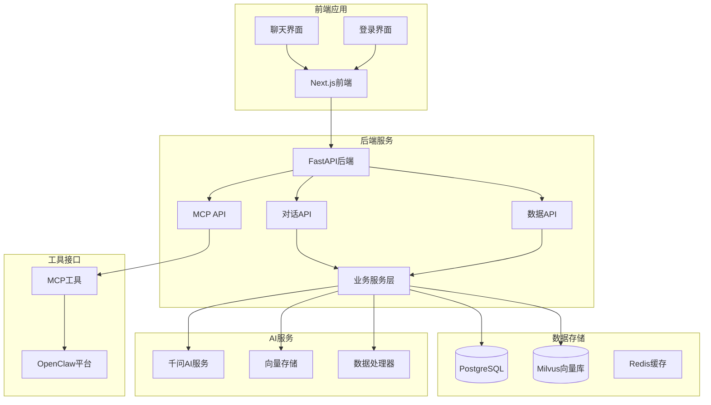

**图表来源**
- [backend/main.py:1-150](file://backend/main.py#L1-L150)
- [frontend/src/app/chat/page.tsx:1-100](file://frontend/src/app/chat/page.tsx#L1-L100)
- [backend/app/api/mcp.py:1-195](file://backend/app/api/mcp.py#L1-L195)

**章节来源**
- [backend/main.py:1-150](file://backend/main.py#L1-L150)
- [docker-compose.yml:1-167](file://docker-compose.yml#L1-L167)

## 核心组件

### AI工具调用系统架构

系统的核心是基于千问大模型的Function Calling功能，实现了真正的智能代理能力：

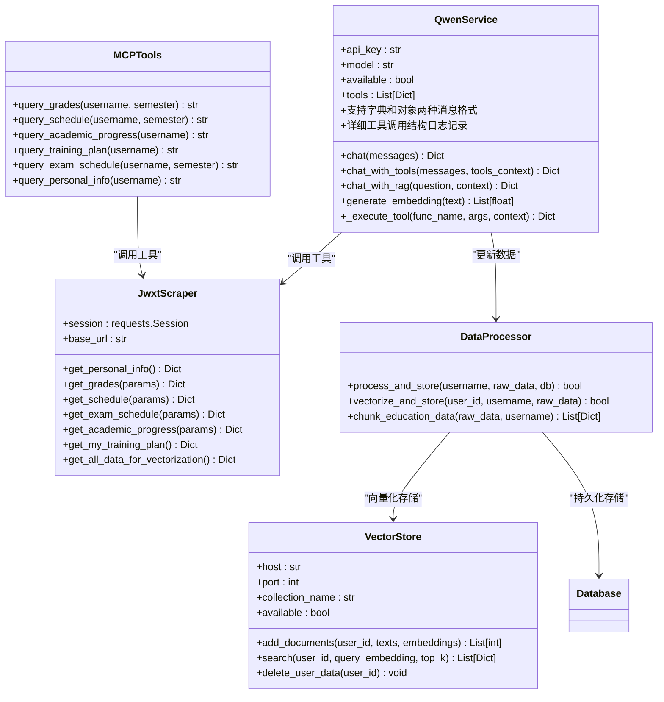

**图表来源**
- [backend/app/services/qwen_service.py:15-583](file://backend/app/services/qwen_service.py#L15-L583)
- [backend/scraper.py:13-1504](file://backend/scraper.py#L13-L1504)
- [backend/app/services/data_processor.py:13-347](file://backend/app/services/data_processor.py#L13-L347)
- [backend/app/services/vector_store.py:14-185](file://backend/app/services/vector_store.py#L14-L185)
- [backend/app/mcp/tools.py:183-310](file://backend/app/mcp/tools.py#L183-L310)

### 对话管理系统

系统实现了完整的对话管理功能，支持多轮对话和历史追踪：

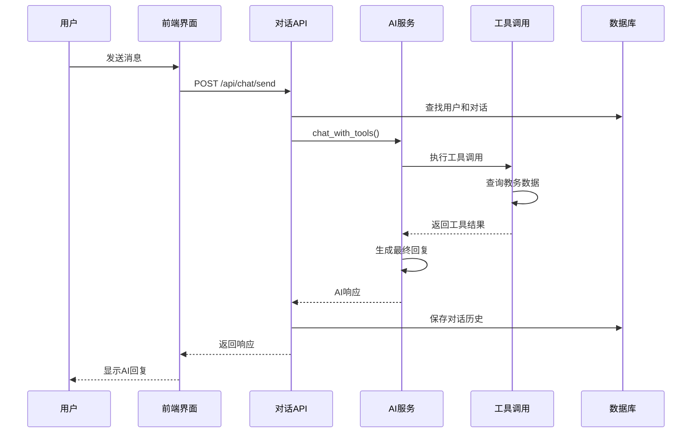

**图表来源**
- [backend/app/api/chat.py:46-179](file://backend/app/api/chat.py#L46-L179)
- [backend/app/services/qwen_service.py:235-370](file://backend/app/services/qwen_service.py#L235-L370)

**章节来源**
- [backend/app/api/chat.py:46-179](file://backend/app/api/chat.py#L46-L179)
- [backend/app/services/qwen_service.py:15-583](file://backend/app/services/qwen_service.py#L15-L583)

## 架构概览

系统采用微服务架构，各个组件职责清晰，耦合度低：

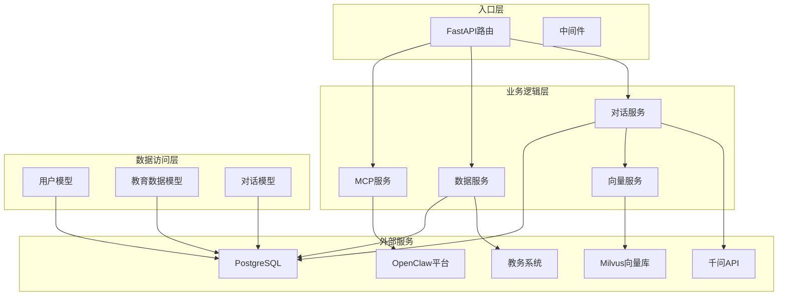

**图表来源**
- [backend/main.py:94-154](file://backend/main.py#L94-L154)
- [backend/app/models/base.py:10-29](file://backend/app/models/base.py#L10-L29)

## 详细组件分析

### AI工具调用实现

系统的核心功能是实现千问大模型的Function Calling能力，支持以下工具：

| 工具名称 | 功能描述 | 参数 | 返回值 |
|---------|----------|------|--------|
| query_personal_info | 查询个人信息 | 无 | 个人信息字典 |
| query_grades | 查询成绩信息 | course_name, semester | 成绩列表和统计 |
| query_schedule | 查询课表 | semester, week | 课表信息 |
| query_exam_schedule | 查询考试安排 | semester | 考试信息 |
| query_academic_progress | 查询学业进度 | 无 | 学业进度信息 |
| **query_training_plan** | **查询培养方案** | **semester** | **培养方案课程列表** |
| refresh_all_data | 刷新所有数据 | 无 | 数据刷新状态 |

**更新** 新增query_training_plan工具，扩展AI在学术查询方面的能力

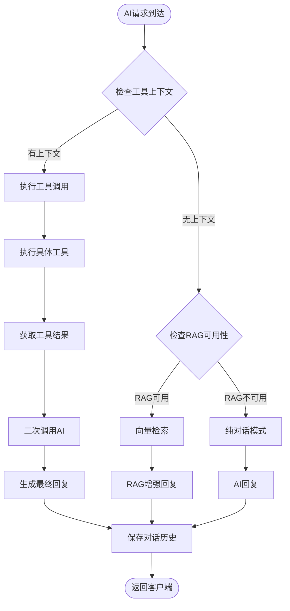

**图表来源**
- [backend/app/services/qwen_service.py:235-370](file://backend/app/services/qwen_service.py#L235-L370)
- [backend/app/services/qwen_service.py:372-471](file://backend/app/services/qwen_service.py#L372-L471)

**章节来源**
- [backend/app/services/qwen_service.py:46-156](file://backend/app/services/qwen_service.py#L46-L156)
- [backend/app/services/qwen_service.py:235-370](file://backend/app/services/qwen_service.py#L235-L370)

### 工具调用兼容性增强

**新增功能** 系统现在支持字典和对象两种消息格式，提高了工具调用的兼容性和稳定性：

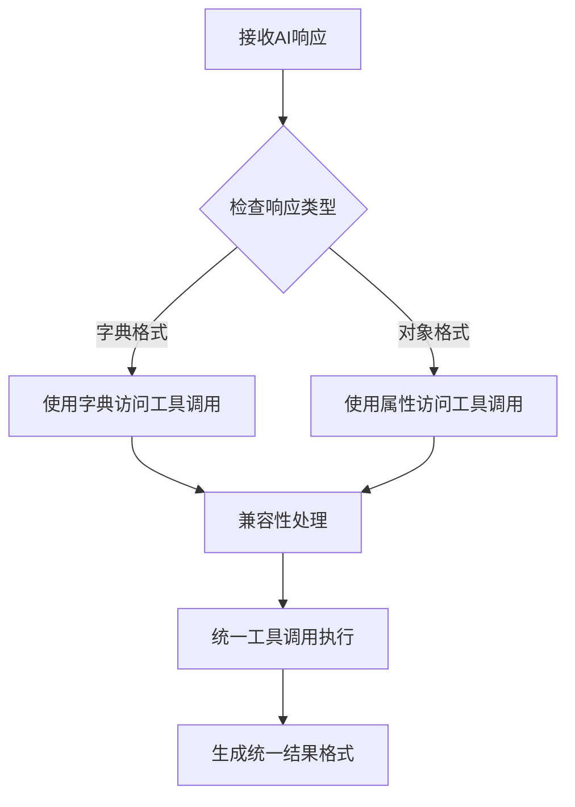

**图表来源**
- [backend/app/services/qwen_service.py:267-273](file://backend/app/services/qwen_service.py#L267-L273)

**章节来源**
- [backend/app/services/qwen_service.py:267-273](file://backend/app/services/qwen_service.py#L267-L273)

### 详细工具调用结构日志记录

**新增功能** 系统增加了详细的工具调用结构日志记录，便于调试和监控：

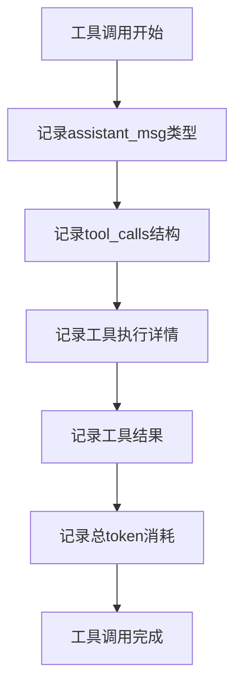

**图表来源**
- [backend/app/services/qwen_service.py:273-358](file://backend/app/services/qwen_service.py#L273-L358)

**章节来源**
- [backend/app/services/qwen_service.py:273-358](file://backend/app/services/qwen_service.py#L273-L358)

### 培养方案查询工具实现

**新增功能** 系统新增了query_training_plan工具，专门用于查询学生的培养方案和课程规划：

```mermaid
flowchart TD
A[AI请求查询培养方案] --> B[解析参数semester]
B --> C[调用JwxtScraper.get_my_training_plan()]
C --> D[解析HTML表格数据]
D --> E[提取课程列表信息]
E --> F[按学期过滤可选]
F --> G[返回培养方案数据]
G --> H[AI生成自然语言回复]
```

**图表来源**
- [backend/app/services/qwen_service.py:433-449](file://backend/app/services/qwen_service.py#L433-L449)
- [backend/scraper.py:788-896](file://backend/scraper.py#L788-L896)

**章节来源**
- [backend/app/services/qwen_service.py:127-143](file://backend/app/services/qwen_service.py#L127-L143)
- [backend/scraper.py:788-896](file://backend/scraper.py#L788-L896)

### MCP工具接口实现

**新增功能** 系统为OpenClaw平台提供了标准化的MCP工具接口：

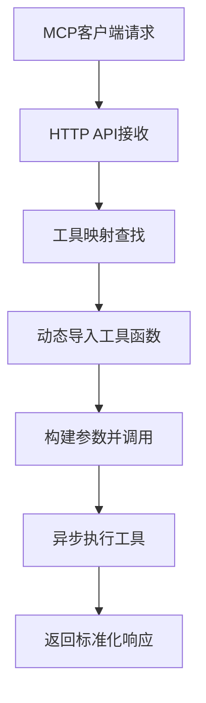

**图表来源**
- [backend/app/api/mcp.py:96-146](file://backend/app/api/mcp.py#L96-L146)
- [backend/app/mcp/tools.py:183-233](file://backend/app/mcp/tools.py#L183-L233)

**章节来源**
- [backend/app/api/mcp.py:1-195](file://backend/app/api/mcp.py#L1-L195)
- [backend/app/mcp/tools.py:183-310](file://backend/app/mcp/tools.py#L183-L310)

### 数据处理和向量化流程

系统实现了完整的数据处理管道，从教务系统爬取数据到向量化存储：

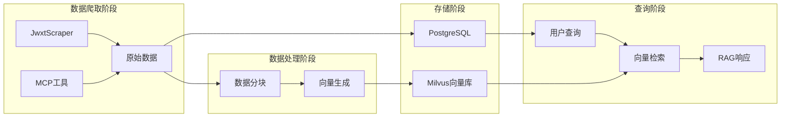

**图表来源**
- [backend/app/services/data_processor.py:178-342](file://backend/app/services/data_processor.py#L178-L342)
- [backend/app/services/vector_store.py:78-152](file://backend/app/services/vector_store.py#L78-L152)

**章节来源**
- [backend/app/services/data_processor.py:16-96](file://backend/app/services/data_processor.py#L16-L96)
- [backend/app/services/vector_store.py:78-152](file://backend/app/services/vector_store.py#L78-L152)

### 前端交互界面

前端采用了现代化的聊天界面设计，支持多种交互功能：

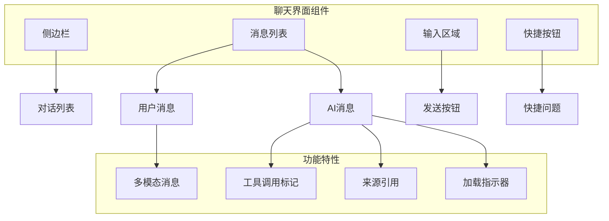

**图表来源**
- [frontend/src/app/chat/page.tsx:221-490](file://frontend/src/app/chat/page.tsx#L221-L490)

**章节来源**
- [frontend/src/app/chat/page.tsx:40-490](file://frontend/src/app/chat/page.tsx#L40-L490)

## 依赖关系分析

系统使用了现代化的技术栈，各组件之间的依赖关系如下：

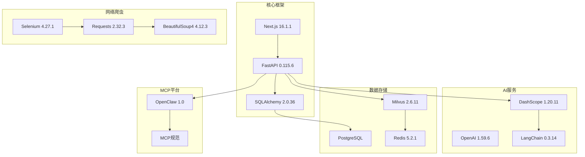

**图表来源**
- [backend/requirements.txt:1-48](file://backend/requirements.txt#L1-L48)
- [docker-compose.yml:120-155](file://docker-compose.yml#L120-L155)

**章节来源**
- [backend/requirements.txt:1-48](file://backend/requirements.txt#L1-L48)
- [docker-compose.yml:120-155](file://docker-compose.yml#L120-L155)

## 性能考虑

系统在设计时充分考虑了性能优化：

### 缓存策略
- **会话缓存**：使用内存存储用户会话，支持Redis集群部署
- **向量缓存**：Milvus向量库支持批量插入和索引优化
- **数据库连接池**：SQLAlchemy连接池减少连接开销

### 异步处理
- **后台任务**：数据同步使用BackgroundTasks异步执行
- **批量向量化**：数据分批处理避免超时
- **并发控制**：工具调用支持并发执行
- **异步MCP工具**：支持异步工具调用提高响应速度

### 性能监控
- **日志系统**：完整的操作日志和错误追踪
- **指标收集**：响应时间、错误率等关键指标
- **资源监控**：数据库连接数、向量库状态监控
- **工具调用监控**：详细的工具调用结构日志便于性能分析

## 故障排除指南

### 常见问题及解决方案

| 问题类型 | 症状 | 可能原因 | 解决方案 |
|---------|------|----------|----------|
| AI服务不可用 | 工具调用失败 | QWEN_API_KEY未配置 | 检查环境变量配置 |
| 数据库连接失败 | SQL操作异常 | PostgreSQL未启动 | 启动PostgreSQL容器 |
| 向量库连接失败 | 向量检索异常 | Milvus未启动 | 检查Milvus服务状态 |
| 爬虫失败 | 教务数据获取失败 | 教务系统维护 | 检查教务系统状态 |
| 前端无法连接 | API请求失败 | CORS配置问题 | 检查CORS设置 |
| 工具调用格式错误 | 工具调用失败 | 消息格式不兼容 | 检查工具调用格式 |
| **培养方案查询失败** | **培养方案为空** | **HTML结构变化** | **检查深度爬取HTML** |
| **MCP工具调用失败** | **OpenClaw连接异常** | **MCP服务器未启动** | **检查MCP服务状态** |
| **工具调用日志缺失** | **调试困难** | **日志级别设置过高** | **调整日志配置** |

**更新** 新增了MCP工具调用失败和工具调用日志缺失的故障排除指南

### 调试方法

1. **查看日志**：使用`docker-compose logs`查看各服务日志
2. **API测试**：使用Postman测试API接口
3. **数据库检查**：连接PostgreSQL检查数据状态
4. **向量库检查**：使用Milvus命令行工具检查向量状态
5. **工具调用调试**：查看详细的工具调用结构日志
6. **培养方案调试**：检查/tmp/debug_training_plan.html文件
7. **MCP调试**：检查MCP服务器日志和OpenClaw连接状态
8. **兼容性测试**：验证字典和对象两种消息格式的兼容性

**章节来源**
- [backend/main.py:45-47](file://backend/main.py#L45-L47)
- [docker-compose.yml:144-155](file://docker-compose.yml#L144-L155)

## 结论

本AI工具调用系统成功实现了智能化的教务系统查询功能，具有以下特点：

### 技术优势
- **真正的工具调用**：基于Function Calling实现AI与真实数据的无缝连接
- **多模态AI服务**：支持直接对话、工具调用和RAG增强三种模式
- **完整的数据管道**：从爬取到向量化的全流程自动化
- **现代化架构**：微服务架构支持水平扩展和高可用
- **增强的兼容性**：支持字典和对象两种消息格式，提高系统稳定性
- **完善的日志记录**：详细的工具调用结构日志便于调试和监控
- **扩展的学术查询能力**：新增培养方案查询工具，支持课程规划和学分管理
- **标准化接口**：为OpenClaw平台提供标准化的MCP工具接口

### 应用价值
- **提升用户体验**：自然语言交互替代复杂的系统操作流程
- **提高查询效率**：AI智能分析用户意图，快速定位所需信息
- **降低学习成本**：无需熟悉复杂的教务系统操作流程
- **增强数据利用**：将静态的教务数据转化为动态的知识服务
- **改善开发体验**：详细的日志记录和兼容性支持简化开发和维护
- **支持学术规划**：培养方案查询工具帮助学生进行课程规划和学分管理
- **促进平台生态**：标准化MCP接口支持第三方平台集成

### 发展前景
系统具备良好的扩展性，可以轻松集成更多工具和服务，为校园智能化建设提供坚实的技术基础。通过持续优化AI模型和数据处理算法，系统将能够提供更加精准和智能的服务体验。同时，标准化的MCP接口为未来的平台化发展奠定了坚实基础。

**更新** 新增了标准化接口和平台生态的技术优势说明