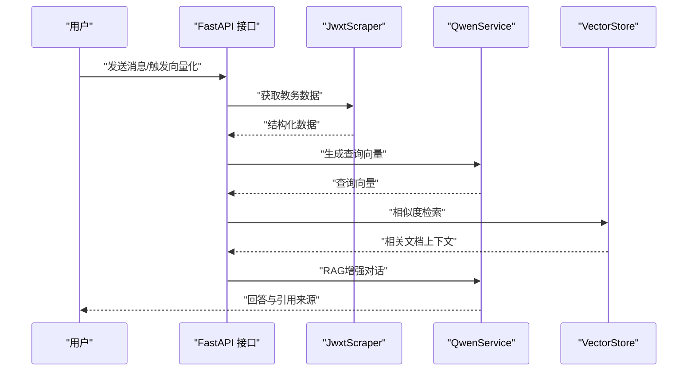
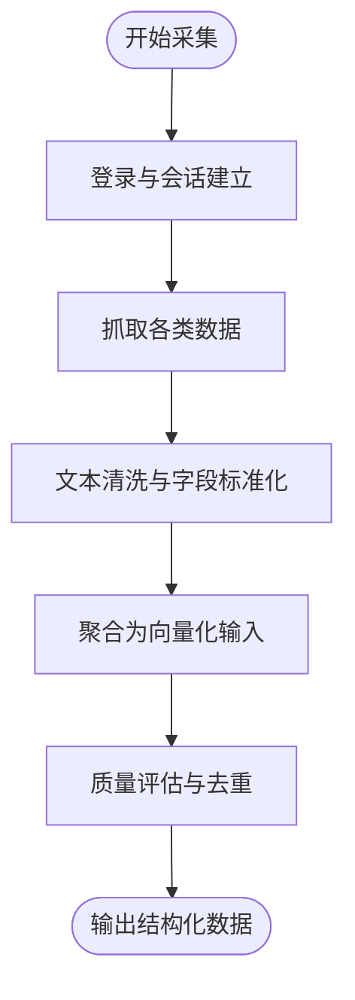
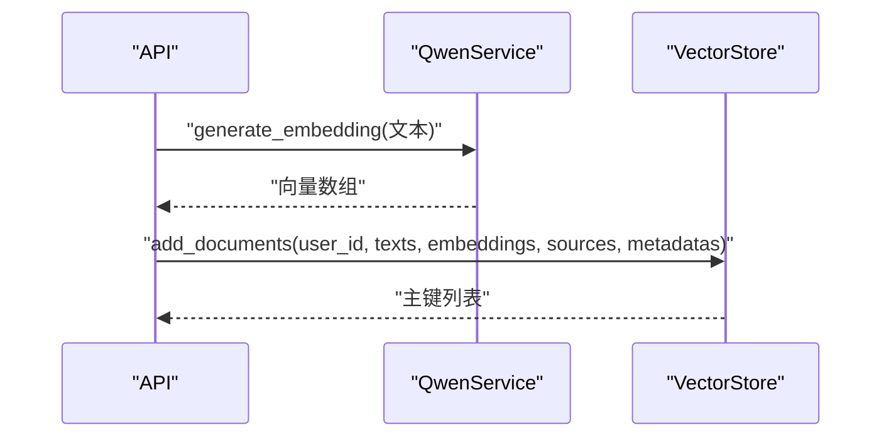
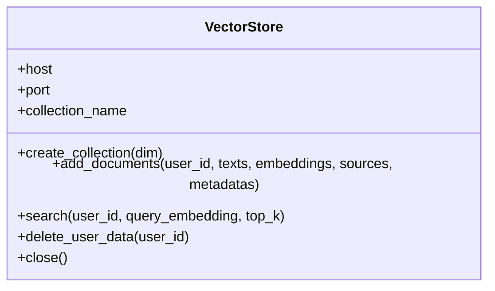
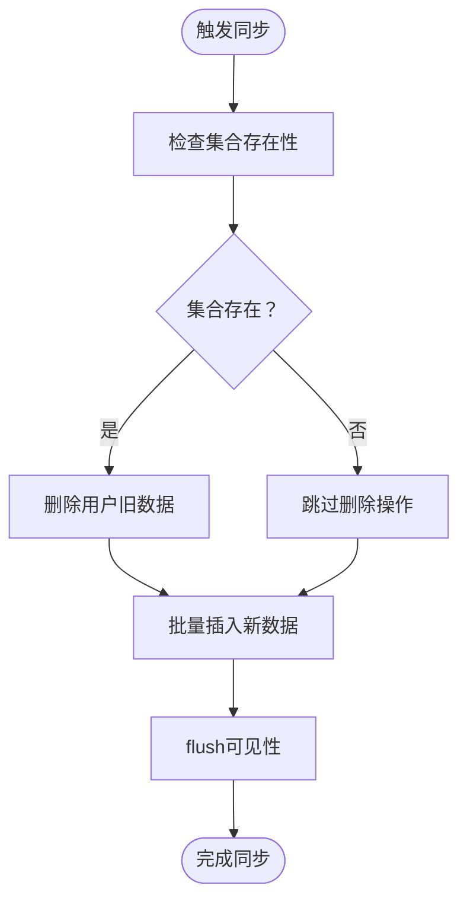
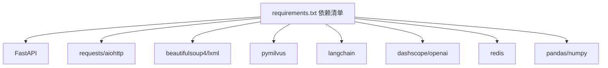

# AI数据处理流程

<cite>
**本文档引用的文件**
- [main.py](file://backend/main.py)
- [scraper.py](file://backend/scraper.py)
- [vector_store.py](file://backend/app/services/vector_store.py)
- [qwen_service.py](file://backend/app/services/qwen_service.py)
- [chat.py](file://backend/app/api/chat.py)
- [education_data.py](file://backend/app/models/education_data.py)
- [base.py](file://backend/app/models/base.py)
- [user.py](file://backend/app/models/user.py)
- [requirements.txt](file://backend/requirements.txt)
- [education_options.py](file://backend/education_options.py)
- [test_scraper.py](file://backend/test_scraper.py)
- [data_processor.py](file://backend/app/services/data_processor.py)
</cite>

## 更新摘要
**变更内容**
- 更新了向量化处理流程，强调操作顺序的重新排序以提高系统健壮性
- 新增了集合存在性检查的详细说明
- 增强了数据删除操作的安全性描述
- 完善了数据处理流程的可靠性保障措施

## 目录
1. [简介](#简介)
2. [项目结构](#项目结构)
3. [核心组件](#核心组件)
4. [架构总览](#架构总览)
5. [详细组件分析](#详细组件分析)
6. [依赖分析](#依赖分析)
7. [性能考虑](#性能考虑)
8. [故障排查指南](#故障排查指南)
9. [结论](#结论)
10. [附录](#附录)

## 简介
本文件面向智能教务系统AI助手的AI数据处理流程，围绕教务数据的采集、预处理、向量化、索引与存储、检索与查询、以及更新与同步机制展开，提供从数据源到向量数据库再到AI问答的全链路技术说明，并配套性能监控与优化建议。

## 项目结构
后端采用FastAPI提供REST接口，核心数据处理由爬虫模块负责采集与聚合，向量数据库服务负责索引与检索，AI服务负责RAG增强对话。数据库模型定义了用户与教务数据的关系，教育选项工具为AI提供结构化查询参数。

```mermaid
graph TB
subgraph "后端服务"
API["FastAPI 应用<br/>路由与接口"]
SCR["爬虫模块<br/>JwxtScraper"]
VEC["向量数据库服务<br/>VectorStore(Milvus)"]
QWEN["AI服务<br/>QwenService(RAG)"]
DB["数据库模型<br/>User/EducationData"]
END
API --> SCR
API --> VEC
API --> QWEN
API --> DB
QWEN --> VEC
```

**图表来源**
- [main.py:1-120](file://backend/main.py#L1-L120)
- [scraper.py:13-30](file://backend/scraper.py#L13-L30)
- [vector_store.py:14-30](file://backend/app/services/vector_store.py#L14-L30)
- [qwen_service.py:15-30](file://backend/app/services/qwen_service.py#L15-L30)
- [education_data.py:11-48](file://backend/app/models/education_data.py#L11-L48)

**章节来源**
- [main.py:1-120](file://backend/main.py#L1-L120)
- [requirements.txt:1-44](file://backend/requirements.txt#L1-L44)

## 核心组件
- 教务数据采集与聚合：JwxtScraper负责从教务系统抓取个人信息、成绩、课表、培养方案、学业进度、考试安排等，并提供统一的向量化数据聚合接口。
- 向量数据库服务：VectorStore封装Milvus，负责集合创建、索引构建、批量插入、相似度检索与用户数据清理。
- AI服务与RAG：QwenService提供对话与RAG增强对话能力，结合向量检索结果生成回答。
- 数据模型与持久化：User与EducationData模型定义用户与教务数据的存储结构，配合数据库会话管理。
- 选项与查询工具：EducationOptions提供院系、学期、课程性质等结构化选项，辅助AI工具化查询。

**章节来源**
- [scraper.py:13-30](file://backend/scraper.py#L13-L30)
- [vector_store.py:14-72](file://backend/app/services/vector_store.py#L14-L72)
- [qwen_service.py:15-90](file://backend/app/services/qwen_service.py#L15-L90)
- [education_data.py:11-48](file://backend/app/models/education_data.py#L11-L48)
- [education_options.py:130-260](file://backend/education_options.py#L130-L260)

## 架构总览
AI数据处理流程分为四个阶段：
- 数据采集与预处理：从教务系统抓取原始数据，进行清洗与格式标准化，生成统一的结构化数据。
- 向量化处理：对文本进行分段与清洗，生成嵌入向量，支持批量处理。
- 索引与存储：在Milvus中创建集合与索引，批量写入向量与元数据。
- 检索与查询：基于用户问题生成查询向量，向量检索返回上下文，结合AI生成最终回答。



**图表来源**
- [chat.py:45-147](file://backend/app/api/chat.py#L45-L147)
- [qwen_service.py:91-142](file://backend/app/services/qwen_service.py#L91-L142)
- [vector_store.py:100-141](file://backend/app/services/vector_store.py#L100-L141)

## 详细组件分析

### 教务数据采集与预处理
- 数据采集：JwxtScraper封装登录、验证码、个人信息、成绩、课表、培养方案、学业进度、考试安排等接口，统一返回结构化数据。
- 数据聚合：提供向量化数据聚合接口，将多类数据整合为适合嵌入与检索的文本片段。
- 预处理要点：
  - 文本清洗：去除冗余空白、HTML标签、特殊字符，保留关键字段。
  - 结构化标准化：统一字段命名与单位，如学分、绩点、周次、节次等。
  - 质量评估：统计缺失字段比例、重复项识别、异常值检测（如负学分、非法周次范围）。



**图表来源**
- [scraper.py:33-60](file://backend/scraper.py#L33-L60)
- [scraper.py:153-300](file://backend/scraper.py#L153-L300)
- [scraper.py:1153-1220](file://backend/scraper.py#L1153-L1220)

**章节来源**
- [scraper.py:33-60](file://backend/scraper.py#L33-L60)
- [scraper.py:153-300](file://backend/scraper.py#L153-L300)
- [scraper.py:1153-1220](file://backend/scraper.py#L1153-L1220)
- [test_scraper.py:103-117](file://backend/test_scraper.py#L103-L117)

### 向量化处理机制
- 文本分段：将长文本按语义边界切分，确保每段具备独立语义与较短长度，便于嵌入与检索。
- 嵌入生成：使用QwenService的generate_embedding接口生成向量，当前实现为占位，实际项目中可替换为sentence-transformers、OpenAI Embedding或其他开源模型。
- 批量处理策略：VectorStore支持批量插入，减少网络往返与索引构建压力；插入后flush以确保可见性。

**更新** 向量化过程中的操作顺序已重新排序，确保系统健壮性：
- 首先检查集合存在性，避免在不存在的集合上执行删除操作
- 确保Collection对象存在后再执行数据删除
- 通过utility.has_collection()方法进行存在性检查



**图表来源**
- [qwen_service.py:144-173](file://backend/app/services/qwen_service.py#L144-L173)
- [vector_store.py:73-98](file://backend/app/services/vector_store.py#L73-L98)

**章节来源**
- [qwen_service.py:144-173](file://backend/app/services/qwen_service.py#L144-L173)
- [vector_store.py:73-98](file://backend/app/services/vector_store.py#L73-L98)

### 数据索引与存储优化
- 集合与字段：定义主键、用户ID、文本、向量、来源、元数据等字段，满足按用户隔离与检索需求。
- 索引类型：采用COSINE度量与IVF_FLAT索引，nlist为聚类中心数量，平衡检索精度与性能。
- 查询加速：加载集合、设置nprobe（搜索时访问的倒排表簇数），在top_k与召回率之间权衡。
- 存储效率：向量维度与VARCHAR长度在创建集合时确定，避免频繁schema变更；元数据以JSON字符串存储，便于扩展。



**图表来源**
- [vector_store.py:14-164](file://backend/app/services/vector_store.py#L14-L164)

**章节来源**
- [vector_store.py:37-72](file://backend/app/services/vector_store.py#L37-L72)
- [vector_store.py:100-141](file://backend/app/services/vector_store.py#L100-L141)

### 数据更新与同步机制
- 增量更新：按用户维度区分数据，删除用户数据后重新写入，确保一致性；可引入版本号字段实现更细粒度的增量。
- 版本控制：在EducationData模型中维护last_updated时间戳，作为数据新鲜度依据；可扩展为版本号字段。
- 一致性保证：删除与插入操作在同一事务中进行（数据库层），向量库层面通过flush确保可见性；AI检索时按user_id过滤，避免跨用户污染。

**更新** 数据删除操作的健壮性增强：
- 在执行delete_user_data之前，先检查Collection对象是否存在
- 如果Collection不存在，则记录信息并跳过删除操作
- 这种设计避免了在不存在的集合上执行删除操作可能引发的异常



**图表来源**
- [vector_store.py:143-154](file://backend/app/services/vector_store.py#L143-L154)
- [education_data.py:43-44](file://backend/app/models/education_data.py#L43-L44)

**章节来源**
- [vector_store.py:143-154](file://backend/app/services/vector_store.py#L143-L154)
- [education_data.py:43-44](file://backend/app/models/education_data.py#L43-L44)

### 性能监控与优化方案
- 处理速度：
  - 批量插入：VectorStore批量写入，减少IO与索引开销。
  - 检索参数：调整nprobe与top_k，兼顾延迟与召回率。
- 内存使用：
  - 文本分段长度控制，避免超长向量导致内存峰值过高。
  - 分批生成嵌入，避免一次性加载过多文本。
- 存储效率：
  - 合理设置向量维度与VARCHAR最大长度，避免浪费。
  - 定期清理无效或低价值数据，释放存储空间。
- 外部依赖：
  - Milvus与DashScope等外部服务的连接池与超时配置需按负载调优。

**章节来源**
- [vector_store.py:60-65](file://backend/app/services/vector_store.py#L60-L65)
- [qwen_service.py:144-173](file://backend/app/services/qwen_service.py#L144-L173)
- [requirements.txt:22-33](file://backend/requirements.txt#L22-L33)

## 依赖分析
后端依赖包括Web框架、HTTP请求、HTML解析、向量数据库、LangChain、AI模型、缓存与数据处理库。这些依赖共同支撑数据采集、向量化、索引与检索、对话生成与RAG增强。



**图表来源**
- [requirements.txt:1-44](file://backend/requirements.txt#L1-L44)

**章节来源**
- [requirements.txt:1-44](file://backend/requirements.txt#L1-L44)

## 性能考虑
- 向量检索：通过nprobe与top_k参数平衡延迟与召回；在高并发场景下考虑缓存热点查询结果。
- 文本分段：采用语义边界切分，避免过短或过长片段影响检索效果与内存占用。
- 嵌入模型：在保证精度的前提下选择合适维度与模型，减少token与计算成本。
- 数据库与向量库：合理设置连接池大小、超时与重试策略，避免阻塞与资源耗尽。

## 故障排查指南
- Milvus连接失败：检查主机、端口与集合是否存在；确认索引创建与加载状态。
- 向量检索无结果：确认查询向量非空、集合已load、表达式过滤正确（按user_id）。
- AI服务异常：检查DashScope API Key与模型配置；关注token用量与错误日志。
- 数据库会话问题：确认数据库URL与凭据；检查会话生命周期与异常处理。

**章节来源**
- [vector_store.py:24-35](file://backend/app/services/vector_store.py#L24-L35)
- [vector_store.py:100-141](file://backend/app/services/vector_store.py#L100-L141)
- [qwen_service.py:84-89](file://backend/app/services/qwen_service.py#L84-L89)
- [base.py:10-28](file://backend/app/models/base.py#L10-L28)

## 结论
该AI数据处理流程以JwxtScraper为核心采集器，结合QwenService与VectorStore实现从数据到向量再到检索与问答的闭环。通过结构化的数据清洗、标准化与向量化，配合Milvus的索引与查询优化，能够为教务问答提供稳定高效的RAG能力。最新的操作顺序优化确保了数据删除操作的健壮性，通过先检查集合存在性再执行删除，有效避免了潜在的异常情况。后续可在嵌入模型替换、增量更新策略与缓存体系方面进一步优化。

## 附录
- 数据模型关系：User与EducationData一对一/一对多关系，支持按用户隔离与持久化。
- 选项工具：EducationOptions提供结构化选项，辅助AI工具化查询与参数校验。

**章节来源**
- [education_data.py:46-47](file://backend/app/models/education_data.py#L46-L47)
- [user.py:30-33](file://backend/app/models/user.py#L30-L33)
- [education_options.py:130-260](file://backend/education_options.py#L130-L260)