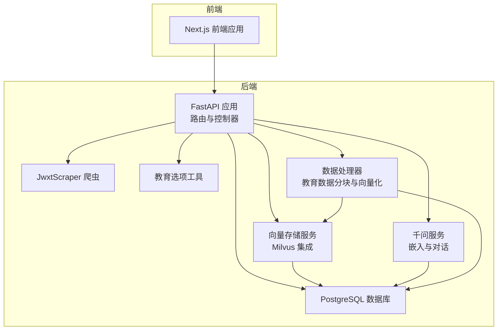
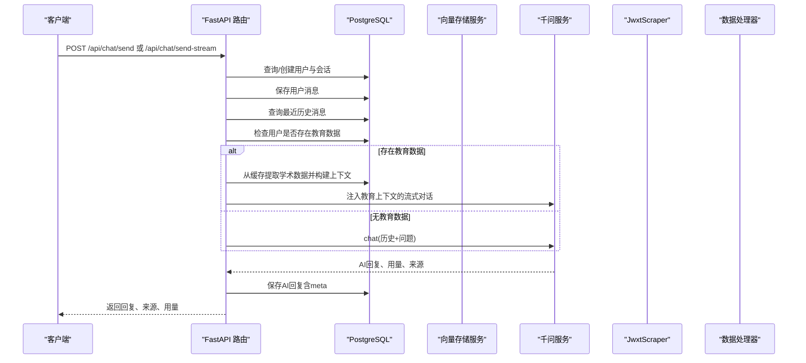
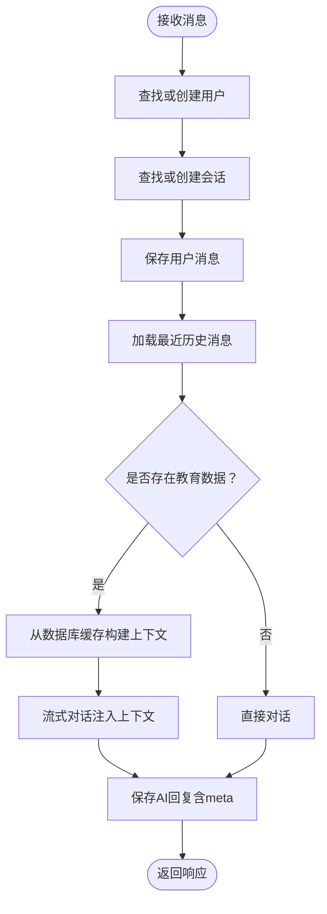
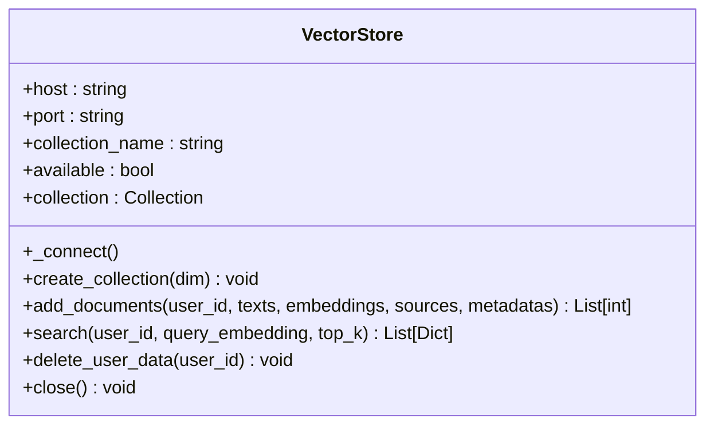
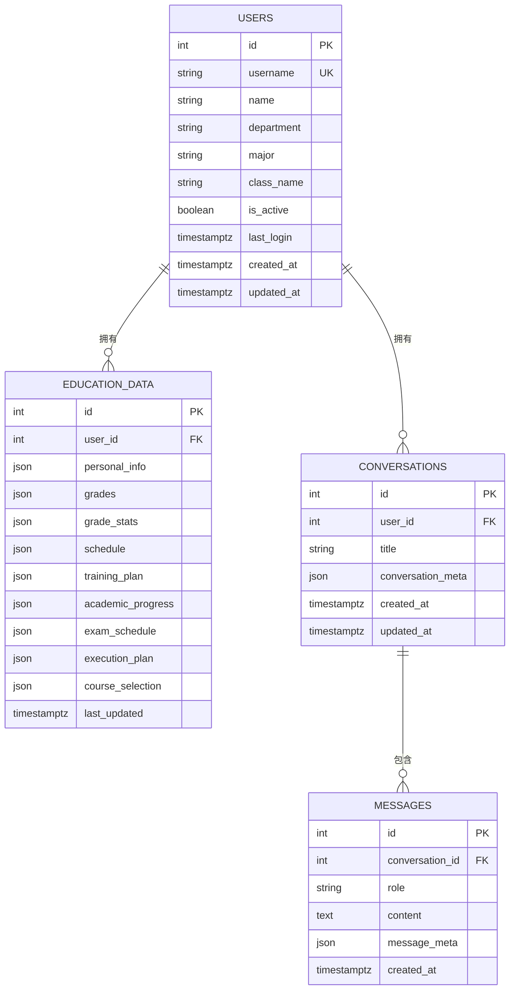
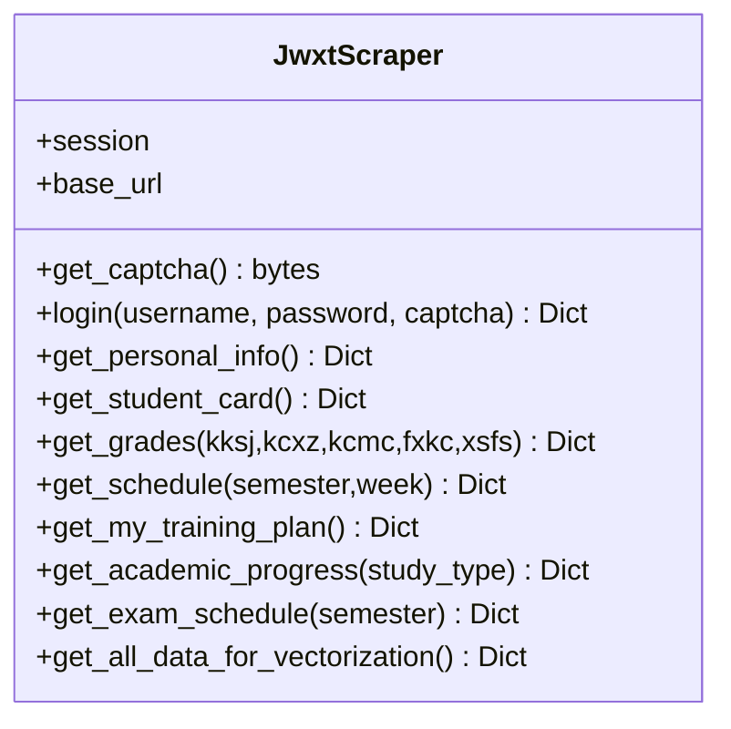
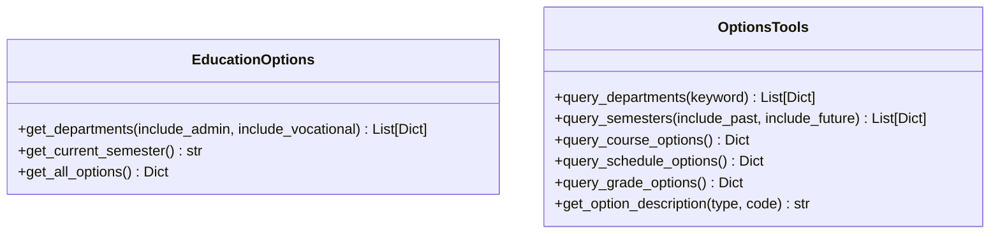
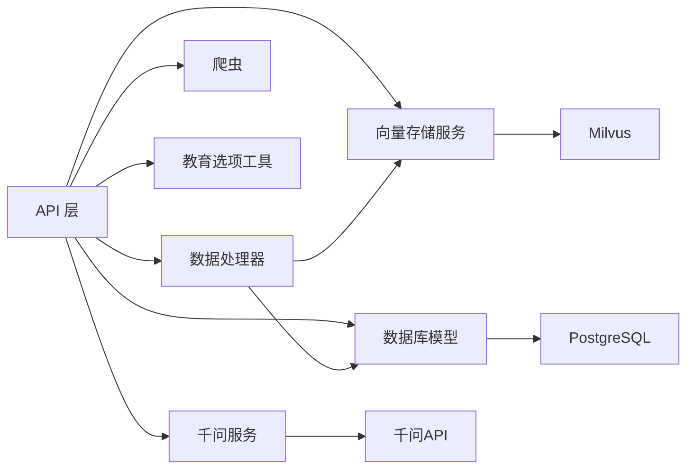

# AI智能问答系统

<cite>
**本文档引用的文件**
- [backend/main.py](file://backend/main.py)
- [backend/app/api/chat.py](file://backend/app/api/chat.py)
- [backend/app/services/vector_store.py](file://backend/app/services/vector_store.py)
- [backend/app/services/data_processor.py](file://backend/app/services/data_processor.py)
- [backend/app/models/conversation.py](file://backend/app/models/conversation.py)
- [backend/app/models/education_data.py](file://backend/app/models/education_data.py)
- [backend/app/models/base.py](file://backend/app/models/base.py)
- [backend/app/models/user.py](file://backend/app/models/user.py)
- [backend/scraper.py](file://backend/scraper.py)
- [backend/education_options.py](file://backend/education_options.py)
- [backend/docker-compose.yml](file://backend/docker-compose.yml)
- [backend/test_login.py](file://backend/test_login.py)
- [backend/test_scraper.py](file://backend/test_scraper.py)
- [backend/app/services/qwen_service.py](file://backend/app/services/qwen_service.py)
</cite>

## 更新摘要
**变更内容**
- 新增教育上下文注入功能：系统现在可以从数据库缓存中提取学术数据并注入到AI系统提示词中
- 增强流式对话功能：支持在流式生成过程中注入教务数据上下文
- 改进数据处理流程：优化教育数据的分块和向量化存储策略
- 增强错误处理机制：改进数据库连接和向量存储的异常处理

## 目录
1. [简介](#简介)
2. [项目结构](#项目结构)
3. [核心组件](#核心组件)
4. [架构总览](#架构总览)
5. [详细组件分析](#详细组件分析)
6. [教育上下文注入功能](#教育上下文注入功能)
7. [依赖分析](#依赖分析)
8. [性能考虑](#性能考虑)
9. [故障排除指南](#故障排除指南)
10. [结论](#结论)
11. [附录](#附录)

## 简介
本项目是一个基于RAG（检索增强生成）的智能教务系统AI助手，围绕教育数据的采集、向量化、检索与对话生成展开。系统采用FastAPI作为后端框架，结合Milvus向量数据库、PostgreSQL关系型数据库、Redis缓存以及阿里云千问（qwen-plus）大模型服务，提供面向学生的教务问答能力。系统支持验证码获取与登录、个人信息与成绩课表等数据爬取、RAG检索增强的对话、对话历史管理与持久化、教育选项数据的查询工具，以及新增的教育上下文注入功能。

## 项目结构
后端采用分层架构：
- API层：定义REST接口，负责接收请求、组织上下文、调用服务层与模型层
- 业务服务层：封装向量检索、嵌入生成、RAG对话、数据处理等逻辑
- 数据模型层：基于SQLAlchemy定义用户、对话、消息、教育数据等实体
- 爬虫与选项工具：负责从教务系统抓取数据与提供AI工具所需的静态选项

**图表来源**
- [backend/main.py:1-120](file://backend/main.py#L1-L120)
- [backend/app/api/chat.py:1-60](file://backend/app/api/chat.py#L1-L60)
- [backend/app/services/vector_store.py:1-40](file://backend/app/services/vector_store.py#L1-L40)
- [backend/docker-compose.yml:1-148](file://backend/docker-compose.yml#L1-L148)

**章节来源**
- [backend/main.py:1-120](file://backend/main.py#L1-L120)
- [backend/docker-compose.yml:1-148](file://backend/docker-compose.yml#L1-L148)

## 核心组件
- RAG对话流程：用户消息进入API层，先持久化对话与消息，再根据用户是否有教育数据决定是否走向量检索增强，随后调用千问服务生成回复并回写消息元数据（用量、来源等）
- **教育上下文注入**：系统从数据库缓存中提取学术数据，构建结构化的上下文文本，注入到AI系统提示词中，确保AI回答严格基于真实数据
- 向量数据库（Milvus）：提供集合创建、文档插入、相似度检索与按用户维度过滤，具备完善的错误处理和状态管理
- 千问（qwen-plus）：提供文本嵌入与对话生成能力，支持RAG上下文增强和流式对话
- 教育数据爬取：统一的JwxtScraper类，覆盖个人信息、成绩、课表、培养方案、学业进度、考试安排等
- 数据处理器：负责教育数据的分块、向量化和存储，支持批量处理和错误恢复
- 对话历史管理：基于SQLAlchemy的会话与消息模型，支持查询、删除、历史回放
- 教育选项工具：提供院系、学期、课程性质、修读类别等静态选项查询与描述映射

**章节来源**
- [backend/app/api/chat.py:45-154](file://backend/app/api/chat.py#L45-L154)
- [backend/app/services/vector_store.py:14-192](file://backend/app/services/vector_store.py#L14-L192)
- [backend/scraper.py:13-120](file://backend/scraper.py#L13-L120)
- [backend/app/models/conversation.py:11-42](file://backend/app/models/conversation.py#L11-L42)
- [backend/education_options.py:130-260](file://backend/education_options.py#L130-L260)

## 架构总览
系统整体交互流程如下：

**图表来源**
- [backend/app/api/chat.py:45-154](file://backend/app/api/chat.py#L45-L154)
- [backend/app/services/vector_store.py:108-153](file://backend/app/services/vector_store.py#L108-L153)

**章节来源**
- [backend/app/api/chat.py:45-154](file://backend/app/api/chat.py#L45-L154)

## 详细组件分析

### 对话API与RAG流程
- 用户消息到达后，自动创建或定位会话，保存用户消息
- 读取最近若干条历史消息，构造对话历史
- 若用户已有教育数据，则从数据库缓存中提取学术数据并构建上下文；否则直接对话
- 调用千问服务生成回答，回写消息元数据（用量、来源），返回给客户端

**图表来源**
- [backend/app/api/chat.py:54-154](file://backend/app/api/chat.py#L54-L154)

**章节来源**
- [backend/app/api/chat.py:45-154](file://backend/app/api/chat.py#L45-L154)

### 向量存储服务（Milvus）- 错误处理与集合管理改进
**更新** 向量存储服务经过重大改进，增强了错误处理和集合管理的稳定性

- **连接管理**：支持自动连接检测，连接失败时设置可用状态标志，避免后续操作
- **集合管理**：改进的集合创建流程，包含存在性检查、自动创建和索引建立
- **文档入库**：增强的批量插入功能，包含数据验证和异常处理
- **检索优化**：改进的搜索参数配置和结果格式化
- **数据清理**：增强的用户数据删除功能，包含集合存在性验证和异常处理
- **日志记录**：全面的日志记录机制，提供详细的调试信息

**图表来源**
- [backend/app/services/vector_store.py:14-192](file://backend/app/services/vector_store.py#L14-L192)

**章节来源**
- [backend/app/services/vector_store.py:14-192](file://backend/app/services/vector_store.py#L14-L192)

### 教育数据模型与对话模型
- 用户模型：包含学号、姓名、学院、专业、班级、激活状态与时间戳
- 教育数据模型：以JSON形式存储个人信息、成绩、课表、培养方案、学业进度、考试安排、执行计划与选课信息
- 对话模型：会话与消息，消息支持JSON元数据（用量、来源等），并维护创建/更新时间

**图表来源**
- [backend/app/models/user.py:11-33](file://backend/app/models/user.py#L11-L33)
- [backend/app/models/education_data.py:11-48](file://backend/app/models/education_data.py#L11-L48)
- [backend/app/models/conversation.py:11-42](file://backend/app/models/conversation.py#L11-L42)

**章节来源**
- [backend/app/models/user.py:11-33](file://backend/app/models/user.py#L11-L33)
- [backend/app/models/education_data.py:11-48](file://backend/app/models/education_data.py#L11-L48)
- [backend/app/models/conversation.py:11-42](file://backend/app/models/conversation.py#L11-L42)

### 教务数据爬取（JwxtScraper）
- 支持验证码获取、登录、个人信息、学籍卡片、成绩、课表、培养方案、学业进度、考试安排、执行计划、选课信息等
- 提供"我的培养方案"与"学业进度"等个性化查询
- 提供"所有数据聚合"接口，便于一次性向量化存储

**图表来源**
- [backend/scraper.py:13-120](file://backend/scraper.py#L13-L120)

**章节来源**
- [backend/scraper.py:13-120](file://backend/scraper.py#L13-L120)

### 教育选项工具（AI工具）
- 提供院系、学期、课程性质、修读类别、成绩显示方式、考核方式、星期、节次、周次等选项查询
- 提供关键词查询、当前学期推断、选项描述映射等工具函数

**图表来源**
- [backend/education_options.py:130-260](file://backend/education_options.py#L130-L260)

**章节来源**
- [backend/education_options.py:130-260](file://backend/education_options.py#L130-L260)

## 教育上下文注入功能

### 功能概述
教育上下文注入是系统新增的核心功能，旨在将数据库缓存中的真实学术数据注入到AI系统的提示词中，确保AI回答严格基于学生的真实教务数据。

### 实现机制
1. **数据提取**：从EducationData表中查询用户的学术数据
2. **数据构建**：将不同类型的学术数据（个人信息、成绩、课表等）构建为结构化的上下文文本
3. **上下文注入**：将构建的上下文注入到千问服务的系统提示词中
4. **严格约束**：AI被要求严格基于注入的真实数据回答问题，不得编造任何数据

### 数据处理流程

**图表来源**
- [backend/app/api/chat.py:381-404](file://backend/app/api/chat.py#L381-L404)
- [backend/app/services/qwen_service.py:196-242](file://backend/app/services/qwen_service.py#L196-L242)

### 上下文构建策略
系统支持多种学术数据类型的上下文构建：

- **个人信息**：姓名、学号、专业、班级、学院等基础信息
- **成绩数据**：课程名称、成绩、学分、课程性质、平时成绩、期末成绩等
- **成绩统计**：已修课程数量、已修学分、总学分要求、还需学分、GPA等
- **课表数据**：按星期分组的课程安排，包括节次、教师、地点、周次等
- **学业进度**：修读类型、学分统计、课程列表等详细信息
- **考试安排**：考试时间、地点、座位号等考试相关信息

### 流式对话中的上下文注入
在流式对话模式下，系统会在生成过程中实时注入教育上下文，确保AI回答的实时性和准确性。

**章节来源**
- [backend/app/api/chat.py:381-404](file://backend/app/api/chat.py#L381-L404)
- [backend/app/services/qwen_service.py:196-242](file://backend/app/services/qwen_service.py#L196-L242)

## 依赖分析
- 外部服务依赖：Milvus（向量检索）、PostgreSQL（关系数据）、Redis（会话/缓存，compose中定义）、MinIO/Etcd（Milvus依赖）
- 内部模块依赖：API层依赖服务层（向量存储、千问服务、数据处理器），服务层依赖数据库模型与爬虫工具

**图表来源**
- [backend/docker-compose.yml:72-92](file://backend/docker-compose.yml#L72-L92)
- [backend/app/api/chat.py:11-14](file://backend/app/api/chat.py#L11-L14)

**章节来源**
- [backend/docker-compose.yml:1-167](file://backend/docker-compose.yml#L1-L167)
- [backend/app/api/chat.py:11-14](file://backend/app/api/chat.py#L11-L14)

## 性能考虑
- **向量检索优化**
  - 索引类型：IVF_FLAT，适合中小规模向量库；可通过nlist与nprobe参数平衡召回与延迟
  - 距离度量：COSINE适用于文本嵌入
  - 过滤：按user_id过滤避免跨用户检索
- **批量处理**
  - 插入：批量entities减少网络往返
  - 检索：批量查询可合并为一次请求（若上游支持）
  - 数据分块：教育数据按类型分块，提高检索精度
- **并发控制**
  - API层使用同步FastAPI；如需高并发，建议引入异步模式与连接池
  - 向量检索与LLM调用建议限流与超时控制
  - 流式对话支持异步生成，提升用户体验
- **缓存策略**
  - 建议使用Redis缓存热点问题的嵌入与检索结果（注意失效策略）
  - 对高频选项数据可做本地缓存
  - 教育数据缓存：数据库缓存学术数据，避免重复爬取
- **数据库优化**
  - 对会话与消息表建立索引（conversation_id、created_at）
  - 分页查询历史消息，限制最大上下文长度
  - 教育数据表使用JSON字段存储，支持灵活的数据结构
- **错误处理优化**
  - 增强的异常捕获和日志记录
  - 优雅降级机制，确保系统稳定性
  - 数据库连接池管理，避免连接泄漏

## 故障排除指南
- **登录与验证码**
  - 验证码session过期：前端需重新获取验证码并携带captcha_session_id
  - 登录失败常见原因：密码错误、验证码错误、用户名不存在；检查响应内容与URL跳转
- **Milvus连接与检索**
  - 连接失败：确认容器健康、环境变量（MILVUS_HOST/MILVUS_PORT）、集合存在
  - 检索无结果：检查nprobe、过滤表达式、向量维度一致
  - 集合管理：检查集合存在性、索引状态和数据完整性
- **PostgreSQL会话**
  - 会话泄漏：确保每个请求正确关闭数据库会话
  - 表结构不一致：运行迁移或重建数据库
  - 教育数据缓存：检查EducationData表的数据完整性
- **教育上下文注入**
  - 数据提取失败：检查数据库连接和用户权限
  - 上下文构建异常：验证JSON数据格式和字段完整性
  - AI回答偏离：检查系统提示词注入是否正确
- **前后端联调**
  - CORS：开发环境允许所有来源，生产需限制
  - 健康检查：/api/health用于快速验证服务可用性
- **错误处理与日志**
  - 查看详细的日志信息，包括连接状态、操作结果和异常详情
  - 检查环境变量配置和依赖服务状态

**章节来源**
- [backend/main.py:135-328](file://backend/main.py#L135-L328)
- [backend/app/services/vector_store.py:25-180](file://backend/app/services/vector_store.py#L25-L180)
- [backend/docker-compose.yml:120-127](file://backend/docker-compose.yml#L120-L127)

## 结论
本系统以RAG为核心，结合Milvus向量检索与千问大模型，实现了针对教务场景的智能问答能力。通过统一的爬虫与数据模型，系统能够将结构化与非结构化的教育数据转化为可检索的知识库，并在对话过程中动态增强回答质量。

**重要更新**：最新的教育上下文注入功能显著提升了系统的智能化水平。通过从数据库缓存中提取真实的学术数据并注入到AI系统提示词中，系统现在能够：

- **严格基于真实数据回答**：AI被明确要求仅基于注入的真实数据进行回答，避免编造信息
- **多维度数据融合**：支持个人信息、成绩、课表、学业进度、考试安排等多种数据类型的上下文注入
- **实时流式生成**：在流式对话中实时注入上下文，提升用户体验
- **增强回答准确性**：通过结构化的上下文构建，显著提高AI回答的准确性和可信度

这些改进包括：

- 更好的连接状态管理
- 增强的异常捕获和日志记录
- 优雅的降级机制
- 改进的数据一致性保证
- 新增的教育上下文注入功能

后续可在缓存、批量处理、并发扩展与模型微调等方面持续优化。

## 附录
- **快速启动**
  - 使用docker-compose一键启动：postgres、redis、etcd、minio、milvus、frontend、backend
  - 环境变量：数据库、Milvus、千问API密钥、CORS等
- **测试参考**
  - 登录测试：test_login.py
  - 爬虫功能测试：test_scraper.py
  - 教育上下文注入测试：新增的上下文构建和注入功能测试
- **配置示例**
  - Milvus环境变量：MILVUS_HOST、MILVUS_PORT、MILVUS_COLLECTION
  - 千问API配置：QWEN_API_KEY、QWEN_MODEL
  - 数据库连接：POSTGRES_HOST、POSTGRES_PORT、POSTGRES_DB
  - 教育数据缓存：支持多种学术数据类型的JSON存储

**章节来源**
- [backend/docker-compose.yml:1-167](file://backend/docker-compose.yml#L1-L167)
- [backend/test_login.py:1-152](file://backend/test_login.py#L1-L152)
- [backend/test_scraper.py:1-280](file://backend/test_scraper.py#L1-L280)