# AI智能问答系统

<cite>
**本文档引用的文件**
- [backend/main.py](file://backend/main.py)
- [backend/app/api/chat.py](file://backend/app/api/chat.py)
- [backend/app/api/auth_sync.py](file://backend/app/api/auth_sync.py)
- [backend/app/api/mcp.py](file://backend/app/api/mcp.py)
- [backend/app/api/intake.py](file://backend/app/api/intake.py)
- [backend/app/services/vector_store.py](file://backend/app/services/vector_store.py)
- [backend/app/services/data_processor.py](file://backend/app/services/data_processor.py)
- [backend/app/services/session_store.py](file://backend/app/services/session_store.py)
- [backend/app/services/education_normalizer.py](file://backend/app/services/education_normalizer.py)
- [backend/app/services/mcp_registry.py](file://backend/app/services/mcp_registry.py)
- [backend/app/models/conversation.py](file://backend/app/models/conversation.py)
- [backend/app/models/education_data.py](file://backend/app/models/education_data.py)
- [backend/app/models/base.py](file://backend/app/models/base.py)
- [backend/app/models/user.py](file://backend/app/models/user.py)
- [backend/scraper.py](file://backend/scraper.py)
- [backend/education_options.py](file://backend/education_options.py)
- [backend/mcp_server.py](file://backend/mcp_server.py)
- [backend/app/mcp/tools.py](file://backend/app/mcp/tools.py)
- [backend/app/mcp/external_tools.json](file://backend/app/mcp/external_tools.json)
- [backend/app/mcp/external_tools.generated.json](file://backend/app/mcp/external_tools.generated.json)
- [backend/docker-compose.yml](file://backend/docker-compose.yml)
- [backend/test_login.py](file://backend/test_login.py)
- [backend/test_scraper.py](file://backend/test_scraper.py)
- [backend/app/services/qwen_service.py](file://backend/app/services/qwen_service.py)
- [frontend/src/app/chat/page.tsx](file://frontend/src/app/chat/page.tsx)
- [frontend/src/app/login/page.tsx](file://frontend/src/app/login/page.tsx)
- [docs/AI_HANDOVER.md](file://docs/AI_HANDOVER.md)
- [docs/PLATFORM_REBUILD_PLAN.md](file://docs/PLATFORM_REBUILD_PLAN.md)
- [scripts/github_autopilot.py](file://scripts/github_autopilot.py)
- [scripts/generate_mcp_external_tools.py](file://scripts/generate_mcp_external_tools.py)
- [scripts/probe_mcp_external_tools.py](file://scripts/probe_mcp_external_tools.py)
- [scripts/enrich_mcp_external_tools.py](file://scripts/enrich_mcp_external_tools.py)
- [docs/github-intake/AUTOPILOT.md](file://docs/github-intake/AUTOPILOT.md)
- [docs/github-intake/autopilot-report.json](file://docs/github-intake/autopilot-report.json)
</cite>

## 更新摘要
**变更内容**
- 新增MCP工具自动探测与健康检查功能，支持HTTP工具可达性检测和自动启用
- 新增MCP工具配置优化脚本，从vendor仓库提取端点线索并自动回填URL
- 新增完整的自动化流水线，支持从仓库搜索到工具配置的全流程自动化
- 增强MCP工具注册中心，支持工具配置文件导入和热重载
- 新增工具配置文件导入API，支持JSON文件上传和验证
- 完善工具元数据管理，支持健康状态和元数据追踪
- **新增probe_mcp_external_tools.py脚本**：实现HTTP工具可达性探测和自动启用功能
- **新增enrich_mcp_external_tools.py脚本**：从vendor仓库提取端点线索并回填URL
- **新增自动化流水线API**：提供完整的工具管理自动化流程
- **增强工具加载机制**：支持工具配置文件导入和元数据追踪
- **改进工具管理能力**：支持健康检查、配置优化和元数据管理

## 目录
1. [简介](#简介)
2. [项目结构](#项目结构)
3. [核心组件](#核心组件)
4. [架构总览](#架构总览)
5. [详细组件分析](#详细组件分析)
6. [MCP工具注册中心](#mcp工具注册中心)
7. [向量存储后端切换](#向量存储后端切换)
8. [GitHub Autopilot集成](#github-autopilot集成)
9. [MCP工具管理增强](#mcp工具管理增强)
10. [教育上下文注入功能](#教育上下文注入功能)
11. [持久化过渡日志系统](#持久化过渡日志系统)
12. [会话存储服务](#会话存储服务)
13. [数据同步状态管理](#数据同步状态管理)
14. [前端持久化策略](#前端持久化策略)
15. [依赖分析](#依赖分析)
16. [性能考虑](#性能考虑)
17. [故障排除指南](#故障排除指南)
18. [结论](#结论)
19. [附录](#附录)

## 简介
本项目是一个基于RAG（检索增强生成）的智能教务系统AI助手，围绕教育数据的采集、向量化、检索与对话生成展开。系统采用FastAPI作为后端框架，结合Milvus向量数据库、PostgreSQL关系型数据库、Redis缓存以及阿里云千问（qwen-plus）大模型服务，提供面向学生的教务问答能力。系统支持验证码获取与登录、个人信息与成绩课表等数据爬取、RAG检索增强的对话、对话历史管理与持久化、教育选项数据的查询工具，以及新增的MCP工具注册中心、向量存储后端切换、GitHub Autopilot集成和MCP工具管理增强等新功能。

**重要更新**：系统现已升级为可扩展的校园Agent平台，具备以下新特性：
- **MCP工具注册中心**：支持工具的声明式配置和动态加载
- **向量存储后端切换**：支持Milvus和Txtai两种后端的无缝切换
- **GitHub Autopilot**：自动化仓库搜索和集成报告生成
- **Agent Runtime抽象**：为多Agent编排提供基础架构
- **external_tools.generated.json**：自动生成MCP工具模板，支持社区项目的低成本接入
- **增强的工具加载机制**：支持同时加载内置工具和外部生成工具，具备更好的错误处理能力
- **MCP工具自动探测**：支持HTTP工具可达性检测和自动启用
- **MCP工具配置优化**：从vendor仓库提取端点线索并自动回填URL
- **自动化流水线**：提供完整的工具管理自动化流程
- **工具配置文件导入**：支持JSON文件上传和验证

## 项目结构
后端采用分层架构：
- API层：定义REST接口，负责接收请求、组织上下文、调用服务层与模型层
- 业务服务层：封装向量检索、嵌入生成、RAG对话、数据处理、MCP工具管理等逻辑
- 数据模型层：基于SQLAlchemy定义用户、对话、消息、教育数据等实体
- 爬虫与选项工具：负责从教务系统抓取数据与提供AI工具所需的静态选项
- 会话存储服务：提供Redis持久化和内存回退的会话管理
- **MCP工具系统**：提供工具注册、发现和调用的统一接口，支持外部工具的声明式集成
- **向量存储系统**：支持多种后端的向量检索服务
- **工具管理脚本**：提供工具自动探测、配置优化和自动化流水线功能

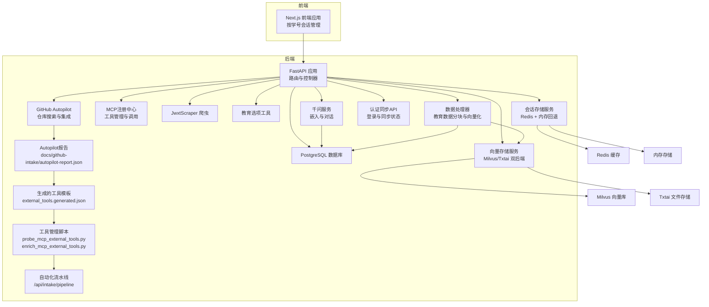

**图表来源**
- [backend/main.py:1-120](file://backend/main.py#L1-L120)
- [backend/app/api/chat.py:1-60](file://backend/app/api/chat.py#L1-L60)
- [backend/app/services/vector_store.py:1-40](file://backend/app/services/vector_store.py#L1-L40)
- [backend/app/services/session_store.py:1-201](file://backend/app/services/session_store.py#L1-L201)
- [backend/app/services/mcp_registry.py:1-249](file://backend/app/services/mcp_registry.py#L1-L249)
- [backend/docker-compose.yml:1-148](file://backend/docker-compose.yml#L1-L148)

**章节来源**
- [backend/main.py:1-120](file://backend/main.py#L1-L120)
- [backend/docker-compose.yml:1-148](file://backend/docker-compose.yml#L1-L148)

## 核心组件
- RAG对话流程：用户消息进入API层，先持久化对话与消息，再根据用户是否有教育数据决定是否走向量检索增强，随后调用千问服务生成回复并回写消息元数据（用量、来源等）
- **MCP工具注册中心**：提供统一的工具注册、发现和调用接口，支持Python函数和HTTP工具的混合调用，支持外部工具的声明式配置
- **向量存储后端切换**：支持Milvus和Txtai两种后端，通过环境变量实现无缝切换，降低开发环境依赖
- **GitHub Autopilot**：自动化搜索GitHub高星仓库，生成集成报告，支持社区项目的低成本接入
- **教育上下文注入**：系统从数据库缓存中提取学术数据，构建结构化的上下文文本，注入到AI系统提示词中，确保AI回答严格基于真实数据
- **持久化过渡日志系统**：实现从旧版localStorage键值到新版按学号命名的键值迁移，确保用户会话数据的连续性和安全性
- **MCP工具自动探测**：支持HTTP工具可达性检测，自动启用可达工具，提供健康状态追踪
- **MCP工具配置优化**：从vendor仓库提取端点线索，自动回填URL，优化工具配置
- **自动化流水线**：提供完整的工具管理自动化流程，从仓库搜索到工具配置的全流程自动化
- **工具配置文件导入**：支持JSON文件上传和验证，动态导入MCP工具配置
- 向量数据库（Milvus）：提供集合创建、文档插入、相似度检索与按用户维度过滤，具备完善的错误处理和状态管理
- 千问（qwen-plus）：提供文本嵌入与对话生成能力，支持RAG上下文增强和流式对话
- 教育数据爬取：统一的JwxtScraper类，覆盖个人信息、成绩、课表、培养方案、学业进度、考试安排等
- 数据处理器：负责教育数据的分块、向量化和存储，支持批量处理和错误恢复
- 对话历史管理：基于SQLAlchemy的会话与消息模型，支持查询、删除、历史回放
- 教育选项工具：提供院系、学期、课程性质、修读类别等静态选项查询与描述映射
- **会话存储服务**：提供Redis持久化和内存回退机制，支持验证码、用户会话、同步状态和认证会话的管理
- **external_tools.generated.json**：自动生成的MCP工具模板文件，包含从GitHub Autopilot报告中提取的工具配置

**章节来源**
- [backend/app/api/chat.py:45-154](file://backend/app/api/chat.py#L45-L154)
- [backend/app/services/vector_store.py:14-192](file://backend/app/services/vector_store.py#L14-L192)
- [backend/app/services/mcp_registry.py:34-249](file://backend/app/services/mcp_registry.py#L34-L249)
- [backend/app/services/session_store.py:25-201](file://backend/app/services/session_store.py#L25-L201)
- [backend/scraper.py:13-120](file://backend/scraper.py#L13-L120)
- [backend/app/models/conversation.py:11-42](file://backend/app/models/conversation.py#L11-L42)
- [backend/education_options.py:130-260](file://backend/education_options.py#L130-L260)

## 架构总览
系统整体交互流程如下：

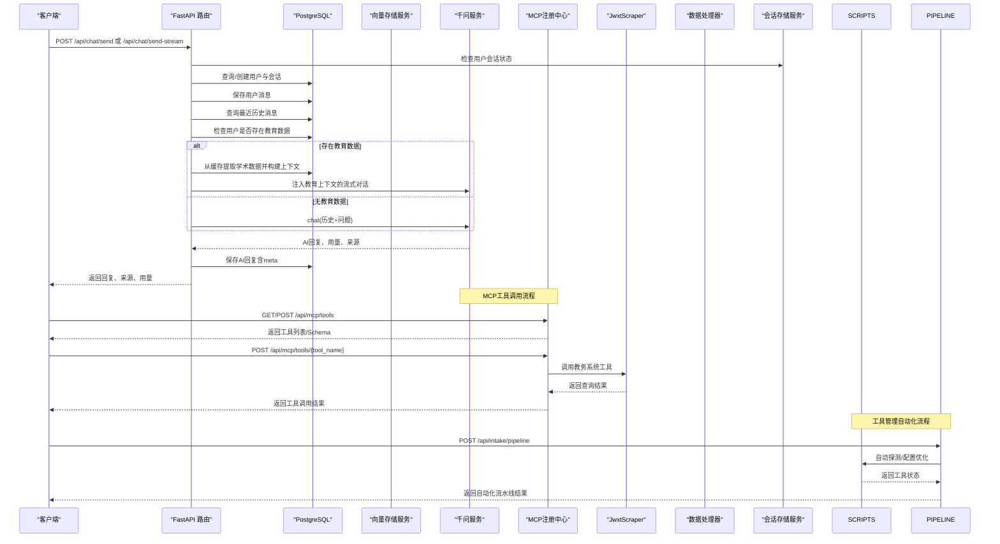

**图表来源**
- [backend/app/api/chat.py:45-154](file://backend/app/api/chat.py#L45-L154)
- [backend/app/services/vector_store.py:108-153](file://backend/app/services/vector_store.py#L108-L153)
- [backend/app/api/mcp.py:45-109](file://backend/app/api/mcp.py#L45-109)
- [backend/app/api/intake.py:181-275](file://backend/app/api/intake.py#L181-L275)

**章节来源**
- [backend/app/api/chat.py:45-154](file://backend/app/api/chat.py#L45-L154)

## 详细组件分析

### 对话API与RAG流程
- 用户消息到达后，自动创建或定位会话，保存用户消息
- 读取最近若干条历史消息，构造对话历史
- 若用户已有教育数据，则从数据库缓存中提取学术数据并构建上下文；否则直接对话
- 调用千问服务生成回答，回写消息元数据（用量、来源），返回给客户端

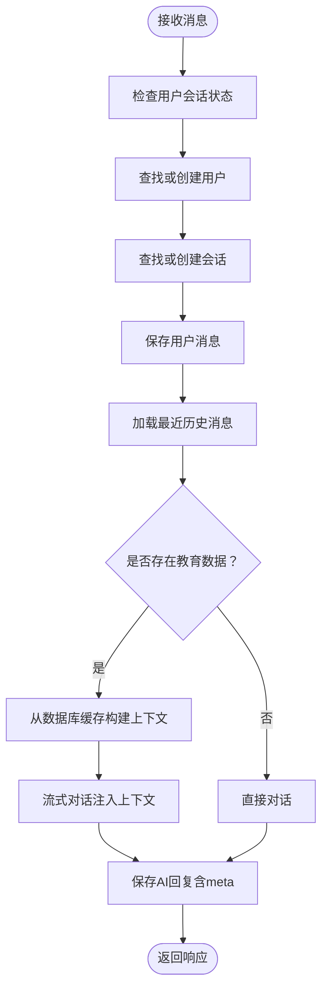

**图表来源**
- [backend/app/api/chat.py:54-154](file://backend/app/api/chat.py#L54-L154)

**章节来源**
- [backend/app/api/chat.py:45-154](file://backend/app/api/chat.py#L45-L154)

### 向量存储服务（Milvus）- 错误处理与集合管理改进
**更新** 向量存储服务经过重大改进，增强了错误处理和集合管理的稳定性

- **连接管理**：支持自动连接检测，连接失败时设置可用状态标志，避免后续操作
- **集合管理**：改进的集合创建流程，包含存在性检查、自动创建和索引建立
- **文档入库**：增强的批量插入功能，包含数据验证和异常处理
- **检索优化**：改进的搜索参数配置和结果格式化
- **数据清理**：增强的用户数据删除功能，包含集合存在性验证和异常处理
- **日志记录**：全面的日志记录机制，提供详细的调试信息
- **后端切换**：新增TxtaiVectorStore作为可选后端，支持本地文件存储

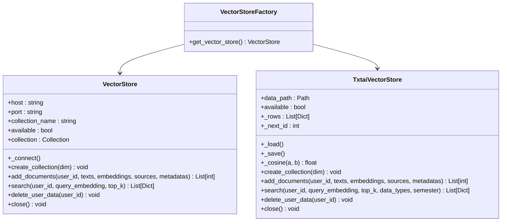

**图表来源**
- [backend/app/services/vector_store.py:21-401](file://backend/app/services/vector_store.py#L21-L401)

**章节来源**
- [backend/app/services/vector_store.py:21-401](file://backend/app/services/vector_store.py#L21-L401)

### 教育数据模型与对话模型
- 用户模型：包含学号、姓名、学院、专业、班级、激活状态与时间戳
- 教育数据模型：以JSON形式存储个人信息、成绩、课表、培养方案、学业进度、考试安排、执行计划与选课信息
- 对话模型：会话与消息，消息支持JSON元数据（用量、来源等），并维护创建/更新时间

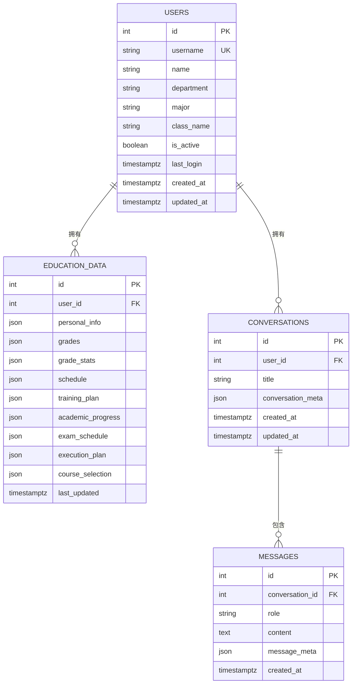

**图表来源**
- [backend/app/models/user.py:11-33](file://backend/app/models/user.py#L11-L33)
- [backend/app/models/education_data.py:11-48](file://backend/app/models/education_data.py#L11-L48)
- [backend/app/models/conversation.py:11-42](file://backend/app/models/conversation.py#L11-L42)

**章节来源**
- [backend/app/models/user.py:11-33](file://backend/app/models/user.py#L11-L33)
- [backend/app/models/education_data.py:11-48](file://backend/app/models/education_data.py#L11-L48)
- [backend/app/models/conversation.py:11-42](file://backend/app/models/conversation.py#L11-L42)

### 教务数据爬取（JwxtScraper）
- 支持验证码获取、登录、个人信息、学籍卡片、成绩、课表、培养方案、学业进度、考试安排、执行计划、选课信息等
- 提供"我的培养方案"与"学业进度"等个性化查询
- 提供"所有数据聚合"接口，便于一次性向量化存储

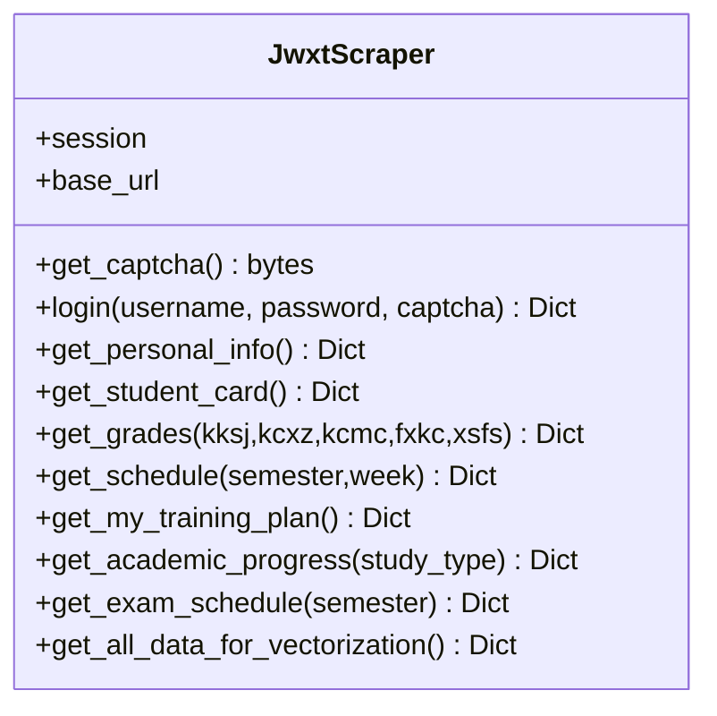

**图表来源**
- [backend/scraper.py:13-120](file://backend/scraper.py#L13-L120)

**章节来源**
- [backend/scraper.py:13-120](file://backend/scraper.py#L13-L120)

### 教育选项工具（AI工具）
- 提供院系、学期、课程性质、修读类别、成绩显示方式、考核方式、星期、节次、周次等选项查询
- 提供关键词查询、当前学期推断、选项描述映射等工具函数

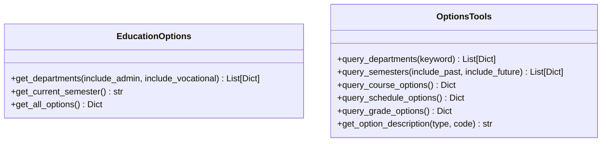

**图表来源**
- [backend/education_options.py:130-260](file://backend/education_options.py#L130-L260)

**章节来源**
- [backend/education_options.py:130-260](file://backend/education_options.py#L130-L260)

## MCP工具注册中心

### 系统概述
MCP（Model Context Protocol）工具注册中心是系统新增的核心功能，旨在为AI助手提供统一的工具管理接口，支持工具的注册、发现和调用。该系统消除了API层对具体工具的硬编码依赖，提供了配置驱动的工具管理能力。

**更新** 系统现已增强对external_tools.generated.json的支持，实现了更强大的工具加载机制和更好的错误处理能力。新增的工具管理功能包括自动探测、健康检查和配置优化等高级特性。

### 核心架构

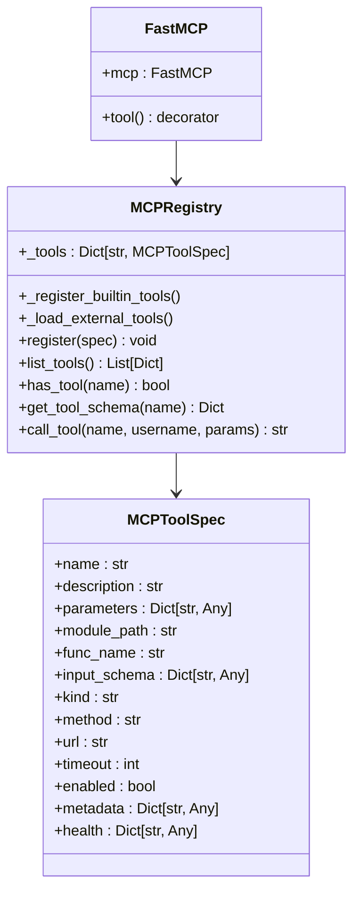

**图表来源**
- [backend/app/services/mcp_registry.py:34-249](file://backend/app/services/mcp_registry.py#L34-L249)
- [backend/app/mcp/tools.py:14-306](file://backend/app/mcp/tools.py#L14-L306)

### 工具类型支持
系统支持两种类型的工具：

1. **Python工具**：直接调用Python函数
   - 通过`module_path`和`func_name`指定函数位置
   - 支持异步函数调用
   - 自动参数合并和类型检查

2. **HTTP工具**：通过HTTP请求调用外部服务
   - 支持GET和POST方法
   - 可配置超时时间和请求头
   - 自动JSON响应处理

### 外部工具配置
系统支持通过两种文件进行外部工具的声明式配置：

#### internal_tools.json
这是传统的内置工具配置文件，包含系统自带的教务查询工具。

#### external_tools.generated.json
这是自动生成的工具模板文件，包含从GitHub Autopilot报告中提取的工具配置。该文件具有以下特点：

- **自动生成**：由`scripts/generate_mcp_external_tools.py`脚本根据Autopilot报告生成
- **元数据丰富**：包含源仓库信息、主题标签、启用状态等元数据
- **模板化设计**：为每个推荐的仓库生成标准化的工具模板
- **禁用状态**：默认禁用，需要手动启用后才能使用
- **健康状态**：支持工具健康状态追踪

```json
{
  "generated_from": "docs/github-intake/autopilot-report.json",
  "tools": [
    {
      "name": "ext_openai_openai_agents_python_1",
      "description": "Generated MCP external tool stub for openai/openai-agents-python",
      "kind": "http",
      "method": "POST",
      "url": "http://localhost:8787/mcp/call",
      "timeout": 12,
      "enabled": false,
      "metadata": {
        "source_repo": "openai/openai-agents-python",
        "topic": "multi_agent",
        "note": "请替换为真实外部服务地址后启用"
      },
      "health": {
        "alive": false
      },
      "parameters": {
        "username": {"type": "string", "required": true, "description": "学号"},
        "payload": {"type": "object", "required": false, "description": "透传参数"}
      },
      "input_schema": {
        "type": "object",
        "properties": {
          "username": {"type": "string", "description": "学号"},
          "payload": {"type": "object", "description": "透传参数"}
        },
        "required": ["username"]
      }
    }
  ]
}
```

### 工具加载机制
系统采用增强的工具加载机制，支持同时加载多种来源的工具：

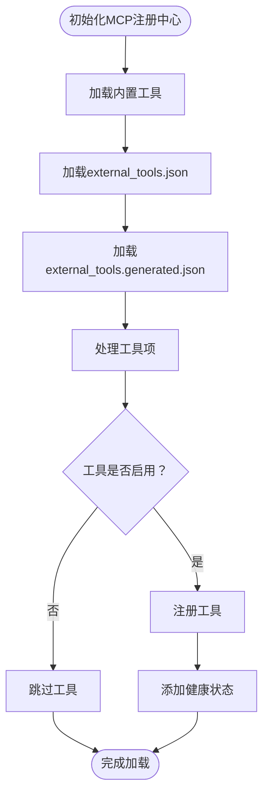

**图表来源**
- [backend/app/services/mcp_registry.py:124-167](file://backend/app/services/mcp_registry.py#L124-L167)

### API接口
系统提供以下MCP相关API：

- `GET /api/mcp/tools`：列出所有可用工具
- `POST /api/mcp/tools/{tool_name}`：调用指定工具
- `GET /api/mcp/tools/{tool_name}/schema`：获取工具的JSON Schema
- `POST /api/mcp/tools/reload`：热重载工具配置
- `POST /api/mcp/tools/import-file`：导入工具配置文件

### 工具调用流程

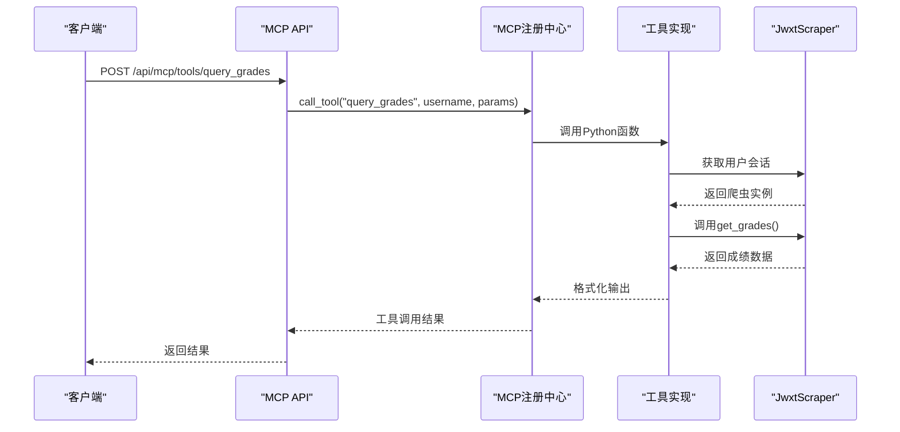

**图表来源**
- [backend/app/api/mcp.py:45-109](file://backend/app/api/mcp.py#L45-109)
- [backend/app/services/mcp_registry.py:202-249](file://backend/app/services/mcp_registry.py#L202-249)

**章节来源**
- [backend/app/services/mcp_registry.py:34-249](file://backend/app/services/mcp_registry.py#L34-L249)
- [backend/app/api/mcp.py:1-191](file://backend/app/api/mcp.py#L1-L191)
- [backend/app/mcp/tools.py:1-306](file://backend/app/mcp/tools.py#L1-L306)
- [backend/app/mcp/external_tools.json:1-80](file://backend/app/mcp/external_tools.json#L1-L80)
- [backend/app/mcp/external_tools.generated.json:1-154](file://backend/app/mcp/external_tools.generated.json#L1-L154)

## 向量存储后端切换

### 系统概述
向量存储后端切换功能是系统为降低开发环境复杂度而新增的重要特性。该功能允许系统在Milvus和Txtai两种向量存储后端之间无缝切换，满足不同环境下的部署需求。

### 后端架构


**图表来源**
- [backend/app/services/vector_store.py:21-401](file://backend/app/services/vector_store.py#L21-L401)

### 后端选择机制
系统通过环境变量`VECTOR_BACKEND`来选择向量存储后端：

- **默认后端**：Milvus（`VECTOR_BACKEND=milvus`或未设置）
- **可选后端**：Txtai（`VECTOR_BACKEND=txtai`）

### Milvus后端特性
- **高性能**：支持大规模向量数据的高效检索
- **企业级**：支持分布式部署和高可用性
- **功能完整**：支持复杂的查询和索引管理
- **错误处理**：完善的连接管理和异常处理机制

### Txtai后端特性
- **轻量级**：无需额外的数据库服务，适合开发环境
- **文件存储**：向量数据存储在本地JSON文件中
- **简单易用**：无需配置复杂的数据库连接
- **兼容性**：保持与Milvus相同的API接口

### 数据持久化机制
Txtai后端使用以下数据结构进行持久化：

```json
{
  "next_id": 1,
  "rows": [
    {
      "id": 1,
      "user_id": 123456,
      "text": "示例文本内容",
      "embedding": [0.1, 0.2, 0.3, ...],
      "source": "成绩数据",
      "metadata": {
        "data_type": "grades",
        "semester": "2024-2025-1",
        "course_id": "CS101"
      }
    }
  ]
}
```

### 检索优化策略
Txtai后端实现了基于余弦相似度的向量检索：

1. **候选过滤**：首先按用户ID过滤候选文档
2. **类型匹配**：根据`data_type`和`semester`参数进一步筛选
3. **相似度计算**：计算查询向量与文档向量的余弦相似度
4. **结果排序**：按相似度分数降序排列，返回Top-K结果

### 配置示例
```bash
# 使用Milvus（默认）
export VECTOR_BACKEND=milvus

# 使用Txtai（开发环境）
export VECTOR_BACKEND=txtai
export TXTAI_DATA_PATH=backend/data/txtai_vectors.json
```

**章节来源**
- [backend/app/services/vector_store.py:256-401](file://backend/app/services/vector_store.py#L256-L401)
- [docs/PLATFORM_REBUILD_PLAN.md:118-124](file://docs/PLATFORM_REBUILD_PLAN.md#L118-L124)

## GitHub Autopilot集成

### 系统概述
GitHub Autopilot是系统新增的自动化仓库搜索和集成功能，旨在为社区项目接入提供低成本入口。该功能能够自动搜索GitHub上高星且活跃的仓库，生成集成报告，并提供可融入的路径建议。

### 核心功能

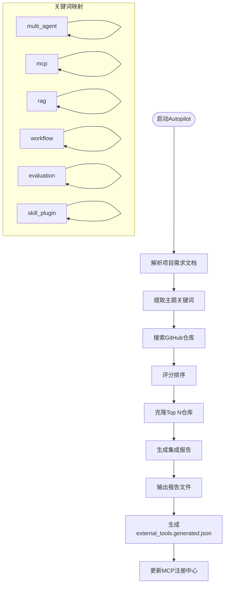

**图表来源**
- [scripts/github_autopilot.py:1-343](file://scripts/github_autopilot.py#L1-L343)

### 主题分类
系统支持以下主题的自动搜索和集成：

- **multi_agent**：多智能体协作相关
- **mcp**：Model Context Protocol工具调用相关
- **rag**：检索增强生成相关
- **workflow**：工作流和状态机相关
- **evaluation**：评估和可观测性相关
- **skill_plugin**：技能和插件市场相关

### 搜索和评分机制
系统使用以下标准对仓库进行评分：

1. **星数权重**：仓库的GitHub星数
2. **更新时效**：最近更新时间，越新的权重越高
3. **语言匹配**：与项目技术栈的匹配度
4. **许可证兼容**：许可证的兼容性

评分公式：`score = stars_weight + time_weight + language_weight`

### 自动化工具生成
**更新** 系统现在支持自动生成MCP工具模板，实现从仓库搜索到工具配置的完整自动化流程：

1. **报告生成**：`scripts/github_autopilot.py`生成`docs/github-intake/autopilot-report.json`
2. **工具模板生成**：`scripts/generate_mcp_external_tools.py`根据报告生成`backend/app/mcp/external_tools.generated.json`
3. **工具配置**：自动生成标准化的MCP工具配置，包含元数据和参数定义
4. **自动启用**：工具默认禁用，需要手动启用后才能使用

### API接口
系统提供以下GitHub Intake相关API：

- `POST /api/intake/run`：运行Autopilot脚本
- `GET /api/intake/report`：获取最新的集成报告
- `POST /api/intake/probe-mcp-tools`：探测MCP工具健康状态
- `POST /api/intake/enrich-mcp-tools`：优化MCP工具配置
- `POST /api/intake/pipeline`：运行完整的自动化流水线

### 报告输出
系统生成以下格式的报告文件：

1. **JSON格式**：`docs/github-intake/autopilot-report.json`
2. **Markdown格式**：`docs/github-intake/autopilot-report.md`
3. **仓库列表**：`docs/github-intake/repos.txt`（可选更新）

### 集成建议
系统为每个推荐的仓库提供集成建议，包括：

- **推荐集成路径**：建议的代码融入位置
- **集成理由**：为什么推荐该仓库
- **技术要点**：需要关注的关键特性

### 配置参数
```bash
# 运行命令示例
python scripts/github_autopilot.py \
  --per-topic 8 \
  --clone-top 4 \
  --integrate-top 8 \
  --update-repo-list
```

- `--per-topic`：每主题搜索的仓库数量
- `--clone-top`：克隆的顶级仓库数量
- `--integrate-top`：生成集成建议的仓库数量
- `--no-clone`：仅生成报告，不克隆仓库
- `--update-repo-list`：更新仓库列表文件

**章节来源**
- [scripts/github_autopilot.py:1-343](file://scripts/github_autopilot.py#L1-L343)
- [scripts/generate_mcp_external_tools.py:1-93](file://scripts/generate_mcp_external_tools.py#L1-L93)
- [backend/app/api/intake.py:150-292](file://backend/app/api/intake.py#L150-L292)
- [docs/github-intake/AUTOPILOT.md:1-61](file://docs/github-intake/AUTOPILOT.md#L1-L61)

## MCP工具管理增强

### 系统概述
MCP工具管理增强是系统新增的核心功能，旨在提供完整的工具生命周期管理能力，包括自动探测、健康检查、配置优化和自动化流水线等功能。该系统通过多个脚本和API实现了工具管理的自动化和智能化。

### 核心功能架构

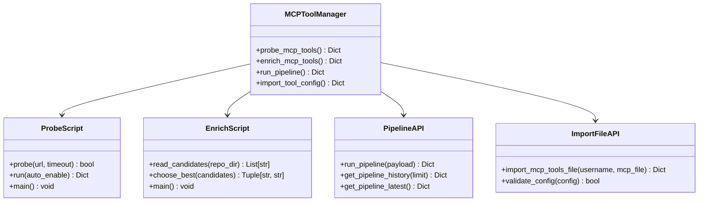

**图表来源**
- [scripts/probe_mcp_external_tools.py:1-67](file://scripts/probe_mcp_external_tools.py#L1-L67)
- [scripts/enrich_mcp_external_tools.py:1-107](file://scripts/enrich_mcp_external_tools.py#L1-L107)
- [backend/app/api/intake.py:181-275](file://backend/app/api/intake.py#L181-L275)
- [backend/app/api/mcp.py:114-191](file://backend/app/api/mcp.py#L114-L191)

### 工具自动探测功能
**新增** `probe_mcp_external_tools.py`脚本实现了HTTP工具可达性检测功能：

- **可达性检测**：支持OPTIONS和GET方法检测HTTP工具端点
- **自动启用**：可选的自动启用功能，将可达工具标记为enabled
- **健康状态追踪**：为每个工具添加health字段，记录存活状态
- **配置更新**：自动更新external_tools.generated.json文件

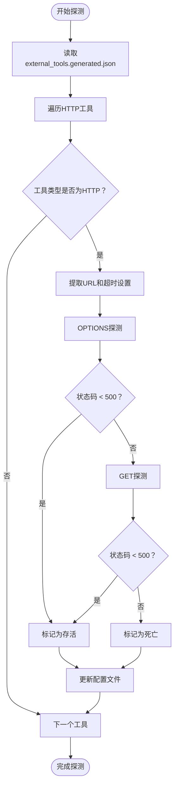

**图表来源**
- [scripts/probe_mcp_external_tools.py:20-54](file://scripts/probe_mcp_external_tools.py#L20-L54)

### 工具配置优化功能
**新增** `enrich_mcp_external_tools.py`脚本实现了从vendor仓库提取端点线索并自动回填URL的功能：

- **端点线索提取**：从README、docker-compose等文件中提取URL线索
- **最佳端点选择**：基于启发式规则选择最佳端点URL
- **本地端点优先**：优先选择localhost端点，提高可达性
- **MCP端点偏好**：优先选择包含/mcp的端点路径
- **元数据回填**：自动回填源仓库信息和检测状态

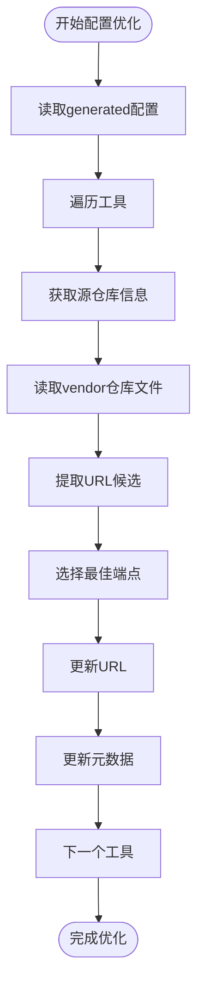

**图表来源**
- [scripts/enrich_mcp_external_tools.py:28-102](file://scripts/enrich_mcp_external_tools.py#L28-L102)

### 自动化流水线功能
**新增** 完整的自动化流水线API，支持从仓库搜索到工具配置的全流程自动化：

- **一键执行**：`POST /api/intake/pipeline`提供完整的自动化流程
- **步骤监控**：监控每个步骤的执行时间和结果
- **配置热重载**：自动重载MCP注册中心，使新配置立即生效
- **历史记录**：记录流水线执行历史和性能指标

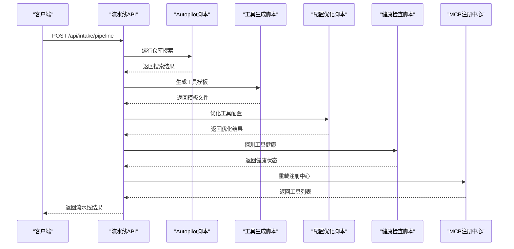

**图表来源**
- [backend/app/api/intake.py:181-275](file://backend/app/api/intake.py#L181-L275)

### 工具配置文件导入功能
**新增** 支持通过文件导入MCP工具配置，提供灵活的配置管理方式：

- **文件上传**：支持JSON文件上传和验证
- **格式支持**：支持两种配置格式：`{"tools":[...]} `和`[...]`
- **基础校验**：验证工具名称、类型和必需字段
- **冲突解决**：自动处理工具名称冲突，保留最新配置
- **即时生效**：导入后自动重载MCP注册中心

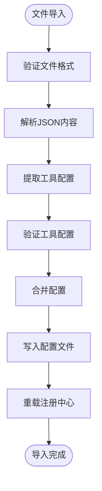

**图表来源**
- [backend/app/api/mcp.py:114-191](file://backend/app/api/mcp.py#L114-L191)

### API接口
系统提供以下MCP工具管理相关API：

- `POST /api/intake/probe-mcp-tools`：探测MCP工具健康状态
- `POST /api/intake/enrich-mcp-tools`：优化MCP工具配置
- `POST /api/intake/pipeline`：运行完整的自动化流水线
- `POST /api/mcp/tools/import-file`：导入工具配置文件

### 配置文件格式
系统支持以下格式的工具配置文件：

#### 标准格式
```json
{
  "tools": [
    {
      "name": "ext_query_grades",
      "description": "查询学生成绩",
      "kind": "python",
      "module_path": "app.mcp.tools",
      "func_name": "query_grades",
      "parameters": {
        "username": {
          "type": "string",
          "required": true,
          "description": "学号"
        }
      }
    }
  ]
}
```

#### 简化格式
```json
[
  {
    "name": "ext_query_grades",
    "description": "查询学生成绩",
    "kind": "python",
    "module_path": "app.mcp.tools",
    "func_name": "query_grades",
    "parameters": {
      "username": {
        "type": "string",
        "required": true,
        "description": "学号"
      }
    }
  }
]
```

**章节来源**
- [scripts/probe_mcp_external_tools.py:1-67](file://scripts/probe_mcp_external_tools.py#L1-L67)
- [scripts/enrich_mcp_external_tools.py:1-107](file://scripts/enrich_mcp_external_tools.py#L1-L107)
- [backend/app/api/intake.py:158-292](file://backend/app/api/intake.py#L158-L292)
- [backend/app/api/mcp.py:114-191](file://backend/app/api/mcp.py#L114-L191)

## 教育上下文注入功能

### 功能概述
教育上下文注入是系统新增的核心功能，旨在将数据库缓存中的真实学术数据注入到AI系统的提示词中，确保AI回答严格基于学生的真实教务数据。

### 实现机制
1. **数据提取**：从EducationData表中查询用户的学术数据
2. **数据构建**：将不同类型的学术数据（个人信息、成绩、课表等）构建为结构化的上下文文本
3. **上下文注入**：将构建的上下文注入到千问服务的系统提示词中
4. **严格约束**：AI被要求严格基于注入的真实数据回答问题，不得编造任何数据

### 数据处理流程

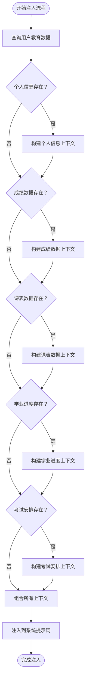

**图表来源**
- [backend/app/api/chat.py:407-442](file://backend/app/api/chat.py#L407-L442)
- [backend/app/services/qwen_service.py:196-242](file://backend/app/services/qwen_service.py#L196-L242)

### 上下文构建策略
系统支持多种学术数据类型的上下文构建：

- **个人信息**：姓名、学号、专业、班级、学院等基础信息
- **成绩数据**：课程名称、成绩、学分、课程性质、平时成绩、期末成绩等
- **成绩统计**：已修课程数量、已修学分、总学分要求、还需学分、GPA等
- **课表数据**：按星期分组的课程安排，包括节次、教师、地点、周次等
- **学业进度**：修读类型、学分统计、课程列表等详细信息
- **考试安排**：考试时间、地点、座位号等考试相关信息

### 流式对话中的上下文注入
在流式对话模式下，系统会在生成过程中实时注入教育上下文，确保AI回答的实时性和准确性。

**章节来源**
- [backend/app/api/chat.py:407-442](file://backend/app/api/chat.py#L407-L442)
- [backend/app/services/qwen_service.py:196-242](file://backend/app/services/qwen_service.py#L196-L242)

## 持久化过渡日志系统

### 系统概述
持久化过渡日志系统是为了解决从旧版localStorage键值到新版按学号命名键值的平滑迁移而设计的。该系统确保用户会话数据在系统升级过程中不会丢失，同时提供清晰的迁移日志和错误处理机制。

### 设计目标
- **数据连续性**：确保用户会话数据在迁移过程中不丢失
- **安全性**：通过按学号命名的键值实现用户数据隔离
- **透明性**：提供详细的迁移日志，便于问题排查
- **兼容性**：支持新旧两种键值格式的并行处理

### 迁移策略
系统采用渐进式迁移策略，通过以下步骤实现：

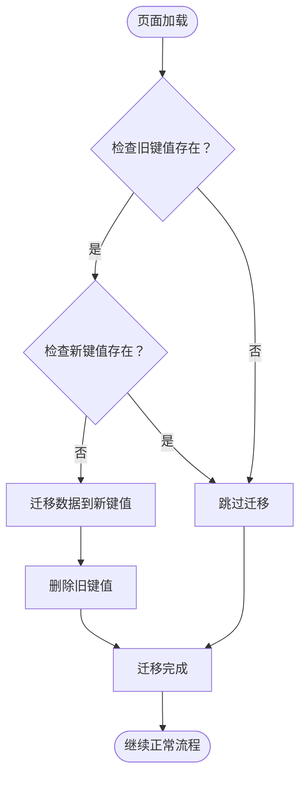

**图表来源**
- [frontend/src/app/chat/page.ts:412-418](file://frontend/src/app/chat/page.ts#L412-L418)

### 关键实现细节
- **键值生成**：使用`getConversationStorageKey(uname)`函数生成按学号命名的键值
- **迁移检测**：检查localStorage中是否存在`current_conversation_id`旧键值
- **原子性操作**：先写入新键值，再删除旧键值，确保数据完整性
- **错误处理**：迁移失败时保持原有数据不变

**章节来源**
- [frontend/src/app/chat/page.ts:412-418](file://frontend/src/app/chat/page.ts#L412-L418)

## 会话存储服务

### 服务概述
会话存储服务提供Redis持久化和内存回退机制，支持验证码、用户会话、同步状态和认证会话的管理。该服务确保系统在Redis不可用时仍能正常运行。

### 核心功能
- **Redis连接管理**：自动检测Redis可用性，提供连接状态反馈
- **多类型会话存储**：支持验证码会话、用户会话、同步状态、认证会话
- **序列化机制**：将requests.Session对象序列化为可持久化的格式
- **TTL管理**：为不同类型会话设置合适的过期时间

### 数据结构设计

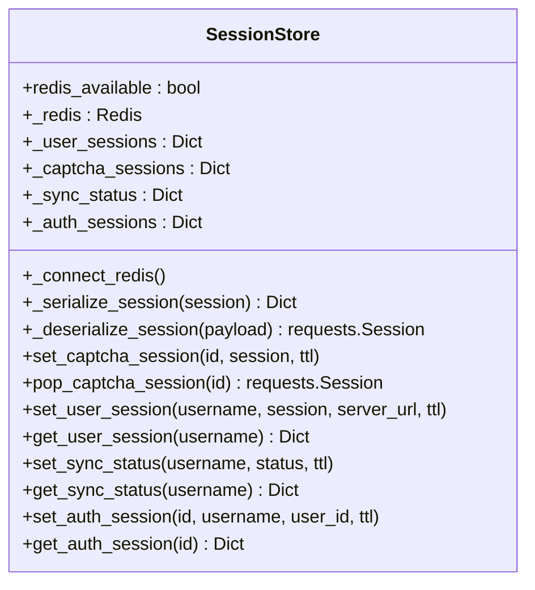

**图表来源**
- [backend/app/services/session_store.py:25-201](file://backend/app/services/session_store.py#L25-L201)

### 键值命名规范
- **验证码会话**：`captcha:{captcha_session_id}`
- **用户会话**：`user_session:{username}`
- **同步状态**：`sync_status:{username}`
- **认证会话**：`auth_session:{auth_session_id}`

### 回退机制
当Redis不可用时，系统自动切换到内存存储模式：
- 使用字典存储会话数据
- 无持久化，进程重启后数据丢失
- 适用于开发环境和单实例部署

**章节来源**
- [backend/app/services/session_store.py:25-201](file://backend/app/services/session_store.py#L25-L201)

## 数据同步状态管理

### 状态管理概述
数据同步状态管理确保用户在登录后能够正确处理教务数据的同步过程。系统支持自动同步和手动同步两种模式，并提供实时的状态反馈。

### 同步状态生命周期

```mermaid
stateDiagram-v2
[*] --> 未开始同步
未开始同步 --> 同步中 : 开始同步
同步中 --> 完成 : 同步成功
同步中 --> 失败 : 同步失败
完成 --> [*]
失败 --> [*]
```

**图表来源**
- [backend/app/api/auth_sync.py:139-170](file://backend/app/api/auth_sync.py#L139-L170)

### 状态字段说明
- **status**：同步状态（none/syncing/completed/failed）
- **message**：状态描述信息
- **timestamp**：状态更新时间戳
- **cached**：是否使用缓存数据（仅完成状态）

### 同步流程
1. **登录检查**：检查用户是否已有教育数据
2. **状态判断**：根据数据存在性决定是否需要同步
3. **后台任务**：启动数据爬取和存储任务
4. **状态更新**：实时更新同步状态到Redis
5. **前端反馈**：通过轮询接口获取最新状态

**章节来源**
- [backend/app/api/auth_sync.py:139-170](file://backend/app/api/auth_sync.py#L139-L170)

## 前端持久化策略

### 策略概述
前端持久化策略通过localStorage实现用户会话数据的本地存储，支持按学号命名的键值格式，确保用户数据的安全隔离。

### 键值管理

```mermaid
flowchart LR
Username["学号"] --> KeyGen["键值生成"]
KeyGen --> NewKey["current_conversation_id_{username}"]
KeyGen --> OldKey["current_conversation_id"]
NewKey --> Migration["迁移检测"]
OldKey --> Migration
Migration --> CheckExist{"新键值存在？"}
CheckExist --> |否| WriteNew["写入新键值"]
CheckExist --> |是| SkipWrite["跳过写入"]
WriteNew --> DeleteOld["删除旧键值"]
SkipWrite --> Continue["继续使用"]
DeleteOld --> Continue
```

**图表来源**
- [frontend/src/app/chat/page.ts:67](file://frontend/src/app/chat/page.ts#L67)
- [frontend/src/app/chat/page.ts:412-418](file://frontend/src/app/chat/page.ts#L412-L418)

### 核心实现函数
- **getConversationStorageKey(uname)**：生成按学号命名的键值
- **迁移逻辑**：自动检测并处理旧键值到新键值的转换
- **数据清理**：退出登录时清理相关localStorage数据

### 安全考虑
- **按学号隔离**：每个用户的会话数据独立存储
- **Cookie配合**：结合session_username cookie实现双重验证
- **数据清理**：退出登录时清除所有相关数据

**章节来源**
- [frontend/src/app/chat/page.ts:67](file://frontend/src/app/chat/page.ts#L67)
- [frontend/src/app/chat/page.ts:412-418](file://frontend/src/app/chat/page.ts#L412-L418)

## 依赖分析
- 外部服务依赖：Milvus（向量检索）、PostgreSQL（关系数据）、Redis（会话/缓存，compose中定义）、MinIO/Etcd（Milvus依赖）
- 内部模块依赖：API层依赖服务层（向量存储、千问服务、数据处理器、会话存储、MCP注册中心），服务层依赖数据库模型与爬虫工具

```mermaid
graph LR
API["API 层"] --> VEC["向量存储服务"]
API --> QW["千问服务"]
API --> DB["数据库模型"]
API --> SCR["爬虫"]
API --> OPT["教育选项工具"]
API --> DP["数据处理器"]
API --> SS["会话存储服务"]
API --> MCPR["MCP注册中心"]
API --> GITHUB_AUTOPILOT["GitHub Autopilot"]
API --> GENERATED_TOOLS["生成的工具模板"]
API --> PROBE_SCRIPT["工具探测脚本"]
API --> ENRICH_SCRIPT["配置优化脚本"]
API --> PIPELINE_API["自动化流水线API"]
VEC --> MILVUS["Milvus"]
VEC --> TXTAI["Txtai存储"]
DB --> PG["PostgreSQL"]
QW --> LLM["千问API"]
SS --> REDIS["Redis"]
SS --> MEMORY["内存存储"]
DP --> VEC
DP --> DB
MCPR --> TOOLS["MCP工具"]
MCPR --> GENERATED_TOOLS
GITHUB_AUTOPILOT --> AUTOPILOT_REPORT["Autopilot报告"]
AUTOPILOT_REPORT --> GENERATED_TOOLS
PROBE_SCRIPT --> GENERATED_TOOLS
ENRICH_SCRIPT --> GENERATED_TOOLS
PIPELINE_API --> PROBE_SCRIPT
PIPELINE_API --> ENRICH_SCRIPT
PIPELINE_API --> GENERATED_TOOLS
```

**图表来源**
- [backend/docker-compose.yml:72-92](file://backend/docker-compose.yml#L72-L92)
- [backend/app/api/chat.py:11-14](file://backend/app/api/chat.py#L11-L14)

**章节来源**
- [backend/docker-compose.yml:1-167](file://backend/docker-compose.yml#L1-L167)
- [backend/app/api/chat.py:11-14](file://backend/app/api/chat.py#L11-L14)

## 性能考虑
- **向量检索优化**
  - 索引类型：IVF_FLAT，适合中小规模向量库；可通过nlist与nprobe参数平衡召回与延迟
  - 距离度量：COSINE适用于文本嵌入
  - 过滤：按user_id过滤避免跨用户检索
  - **后端选择**：根据环境选择合适的向量存储后端
- **批量处理**
  - 插入：批量entities减少网络往返
  - 检索：批量查询可合并为一次请求（若上游支持）
  - 数据分块：教育数据按类型分块，提高检索精度
  - **工具调用**：支持异步工具调用，提高并发性能
- **并发控制**
  - API层使用同步FastAPI；如需高并发，建议引入异步模式与连接池
  - 向量检索与LLM调用建议限流与超时控制
  - 流式对话支持异步生成，提升用户体验
  - **MCP工具**：支持并发工具调用，但需注意外部服务的限流
- **缓存策略**
  - 建议使用Redis缓存热点问题的嵌入与检索结果（注意失效策略）
  - 对高频选项数据可做本地缓存
  - 教育数据缓存：数据库缓存学术数据，避免重复爬取
  - **会话缓存**：Redis持久化用户会话，内存回退机制
  - **工具缓存**：MCP工具结果的短期缓存
- **数据库优化**
  - 对会话与消息表建立索引（conversation_id、created_at）
  - 分页查询历史消息，限制最大上下文长度
  - 教育数据表使用JSON字段存储，支持灵活的数据结构
- **错误处理优化**
  - 增强的异常捕获和日志记录
  - 优雅降级机制，确保系统稳定性
  - 数据库连接池管理，避免连接泄漏
  - **持久化过渡**：迁移过程中的数据一致性保证
  - **后端切换**：向量存储后端的平滑切换机制
  - **工具加载**：外部配置文件加载失败不影响内置工具可用性
  - **工具管理**：自动探测、配置优化和流水线执行的容错处理

## 故障排除指南
- **登录与验证码**
  - 验证码session过期：前端需重新获取验证码并携带captcha_session_id
  - 登录失败常见原因：密码错误、验证码错误、用户名不存在；检查响应内容与URL跳转
- **Milvus连接与检索**
  - 连接失败：确认容器健康、环境变量（MILVUS_HOST/MILVUS_PORT）、集合存在
  - 检索无结果：检查nprobe、过滤表达式、向量维度一致
  - 集合管理：检查集合存在性、索引状态和数据完整性
- **Txtai存储问题**
  - 文件读写失败：检查TXTAI_DATA_PATH权限和磁盘空间
  - 数据加载异常：验证JSON文件格式和数据完整性
  - 性能问题：考虑增加内存或使用Milvus后端
- **MCP工具调用**
  - 工具不存在：检查工具名称和注册状态
  - 参数错误：验证JSON Schema和必填参数
  - 外部服务超时：检查HTTP工具的URL和超时设置
  - 用户未登录：确认用户会话状态和登录状态
  - **工具加载失败**：检查external_tools.generated.json格式和元数据
  - **外部配置错误**：外部配置文件加载失败不影响内置工具可用性
- **GitHub Autopilot**
  - API限制：GitHub API有速率限制，可能需要等待
  - 网络问题：检查网络连接和代理设置
  - 权限问题：确保有访问GitHub仓库的权限
  - 存储空间：检查磁盘空间是否足够存储克隆的仓库
  - **报告生成失败**：检查docs/github-intake目录权限
  - **工具模板生成失败**：检查autopilot-report.json格式
- **MCP工具管理**
  - **工具探测失败**：检查网络连接和HTTP工具端点
  - **配置优化失败**：检查vendor仓库文件和URL提取
  - **自动化流水线失败**：检查各个步骤的执行状态和错误日志
  - **工具配置导入失败**：检查JSON格式和必需字段
  - **健康状态异常**：检查工具端点可达性和响应状态
- **PostgreSQL会话**
  - 会话泄漏：确保每个请求正确关闭数据库会话
  - 表结构不一致：运行迁移或重建数据库
  - 教育数据缓存：检查EducationData表的数据完整性
- **教育上下文注入**
  - 数据提取失败：检查数据库连接和用户权限
  - 上下文构建异常：验证JSON数据格式和字段完整性
  - AI回答偏离：检查系统提示词注入是否正确
- **持久化过渡问题**
  - 迁移失败：检查localStorage访问权限和键值格式
  - 数据丢失：确认迁移过程中的原子性操作
  - 安全问题：验证按学号命名的键值格式
- **会话存储服务**
  - Redis连接失败：检查Redis服务状态和网络连接
  - 数据丢失：确认Redis持久化配置和TTL设置
  - 内存溢出：监控内存使用情况，适时调整Redis配置
- **数据同步状态**
  - 状态不更新：检查后台任务执行情况
  - 同步失败：验证教务系统登录状态和网络连接
  - 前端轮询：确认轮询间隔和错误处理机制
- **前后端联调**
  - CORS：开发环境允许所有来源，生产需限制
  - 健康检查：/api/health用于快速验证服务可用性
- **错误处理与日志**
  - 查看详细的日志信息，包括连接状态、操作结果和异常详情
  - 检查环境变量配置和依赖服务状态
  - **外部配置处理**：检查external_tools.json和external_tools.generated.json的加载情况
  - **工具管理脚本**：检查脚本执行权限和依赖库

**章节来源**
- [backend/main.py:135-328](file://backend/main.py#L135-L328)
- [backend/app/services/vector_store.py:25-180](file://backend/app/services/vector_store.py#L25-L180)
- [backend/app/services/session_store.py:38-52](file://backend/app/services/session_store.py#L38-L52)
- [backend/docker-compose.yml:120-127](file://backend/docker-compose.yml#L120-L127)

## 结论
本系统以RAG为核心，结合Milvus向量检索与千问大模型，实现了针对教务场景的智能问答能力。通过统一的爬虫与数据模型，系统能够将结构化与非结构化的教育数据转化为可检索的知识库，并在对话过程中动态增强回答质量。

**重要更新**：最新的功能升级显著提升了系统的扩展性和实用性。通过实现MCP工具注册中心、向量存储后端切换、GitHub Autopilot集成和MCP工具管理增强等功能，系统现在具备了更强的生态扩展能力：

- **MCP工具注册中心**：为AI助手提供统一的工具管理接口，支持工具的声明式配置和动态加载
- **向量存储后端切换**：支持Milvus和Txtai两种后端的无缝切换，降低开发环境复杂度
- **GitHub Autopilot**：自动化仓库搜索和集成报告生成，为社区项目接入提供低成本入口
- **Agent Runtime抽象**：为多Agent编排提供基础架构，支持未来的能力扩展
- **持久化过渡**：迁移过程中的数据一致性保证
- **external_tools.generated.json**：自动生成的工具模板，支持社区项目的低成本接入
- **增强的工具加载机制**：支持同时加载内置工具和外部生成工具，具备更好的错误处理能力
- **MCP工具自动探测**：支持HTTP工具可达性检测和自动启用，提供健康状态追踪
- **MCP工具配置优化**：从vendor仓库提取端点线索并自动回填URL，优化工具配置
- **自动化流水线**：提供完整的工具管理自动化流程，从仓库搜索到工具配置的全流程自动化
- **工具配置文件导入**：支持JSON文件上传和验证，提供灵活的配置管理方式
- **全面的工具生态**：支持Python函数和HTTP工具的混合调用
- **自动化工具生成**：从仓库搜索到工具配置的完整自动化流程
- **增强的错误处理**：外部配置文件加载失败不影响内置工具可用性
- **丰富的元数据支持**：工具包含源仓库信息、主题标签、启用状态和健康状态

这些改进包括：

- 更好的连接状态管理
- 增强的异常捕获和日志记录
- 优雅的降级机制
- 改进的数据一致性保证
- 新增的教育上下文注入功能
- **完整的工具管理生态系统**：支持自动探测、配置优化、健康检查和自动化流水线
- **智能化的工具生命周期管理**：从仓库搜索到工具启用的完整自动化流程
- **灵活的配置管理方式**：支持文件导入和在线配置编辑
- **全面的工具状态追踪**：健康状态、元数据和使用统计

后续可在缓存、批量处理、并发扩展与模型微调等方面持续优化，为构建完整的校园Agent平台奠定坚实基础。

## 附录
- **快速启动**
  - 使用docker-compose一键启动：postgres、redis、etcd、minio、milvus、frontend、backend
  - 环境变量：数据库、Milvus、千问API密钥、CORS等
  - **向量后端选择**：通过`VECTOR_BACKEND`环境变量选择Milvus或Txtai
  - **工具配置**：支持external_tools.json和external_tools.generated.json两种配置方式
  - **工具管理**：支持自动探测、配置优化和流水线执行
- **测试参考**
  - 登录测试：test_login.py
  - 爬虫功能测试：test_scraper.py
  - 教育上下文注入测试：新增的上下文构建和注入功能测试
  - **MCP工具测试**：工具注册、发现和调用功能测试
  - **向量存储测试**：Milvus和Txtai后端的功能测试
  - **持久化迁移测试**：会话键值迁移和数据完整性验证
  - **GitHub Autopilot测试**：仓库搜索、报告生成和工具模板功能测试
  - **工具管理测试**：自动探测、配置优化和流水线功能测试
- **配置示例**
  - Milvus环境变量：MILVUS_HOST、MILVUS_PORT、MILVUS_COLLECTION
  - 千问API配置：QWEN_API_KEY、QWEN_MODEL
  - 数据库连接：POSTGRES_HOST、POSTGRES_PORT、POSTGRES_DB
  - 教育数据缓存：支持多种学术数据类型的JSON存储
  - **Redis配置**：会话存储服务的Redis连接参数
  - **向量存储配置**：VECTOR_BACKEND、TXTAI_DATA_PATH
  - **MCP工具配置**：external_tools.json声明式配置，external_tools.generated.json自动生成模板
  - **GitHub Autopilot配置**：GITHUB_TOKEN、搜索参数、生成路径
  - **工具管理配置**：probe_mcp_external_tools.py、enrich_mcp_external_tools.py脚本参数
- **AI交接指南**
  - **项目范围**：明确前端、后端和Docker编排的职责边界
  - **关键规则**：包管理器、用户数据隔离、客户端localStorage限制
  - **已知问题**：教育数据模式匹配、聊天历史所有权、SSE流解析等修复
  - **运行检查**：登录验证、同步状态、流式对话、页面刷新、账号切换等
  - **调试路径**：关键文件位置和日志查看方法
  - **新功能检查**：MCP工具、向量存储后端切换、GitHub Autopilot功能验证
  - **工具管理检查**：内置工具、外部工具、生成工具的加载和使用验证
  - **自动化流程检查**：GitHub Autopilot报告生成、工具模板生成、配置更新流程
  - **工具管理功能检查**：自动探测、配置优化、健康检查和流水线执行验证
  - **工具配置导入检查**：文件上传、格式验证和配置合并功能验证

**章节来源**
- [backend/docker-compose.yml:1-167](file://backend/docker-compose.yml#L1-L167)
- [backend/test_login.py:1-152](file://backend/test_login.py#L1-L152)
- [backend/test_scraper.py:1-280](file://backend/test_scraper.py#L1-L280)
- [docs/AI_HANDOVER.md:1-72](file://docs/AI_HANDOVER.md#L1-L72)
- [docs/PLATFORM_REBUILD_PLAN.md:1-132](file://docs/PLATFORM_REBUILD_PLAN.md#L1-L132)