# RAG架构设计

<cite>
**本文档引用的文件**
- [backend/main.py](file://backend/main.py)
- [backend/app/api/chat.py](file://backend/app/api/chat.py)
- [backend/app/services/vector_store.py](file://backend/app/services/vector_store.py)
- [backend/app/services/qwen_service.py](file://backend/app/services/qwen_service.py)
- [backend/app/models/education_data.py](file://backend/app/models/education_data.py)
- [backend/app/models/conversation.py](file://backend/app/models/conversation.py)
- [backend/app/models/user.py](file://backend/app/models/user.py)
- [backend/app/models/base.py](file://backend/app/models/base.py)
- [backend/scraper.py](file://backend/scraper.py)
- [backend/education_options.py](file://backend/education_options.py)
- [backend/test_scraper.py](file://backend/test_scraper.py)
- [backend/test_login.py](file://backend/test_login.py)
</cite>

## 目录
1. [简介](#简介)
2. [项目结构](#项目结构)
3. [核心组件](#核心组件)
4. [架构概览](#架构概览)
5. [详细组件分析](#详细组件分析)
6. [依赖关系分析](#依赖关系分析)
7. [性能考虑](#性能考虑)
8. [故障排除指南](#故障排除指南)
9. [结论](#结论)

## 简介

智能教务系统AI助手采用RAG（检索增强生成）架构，为广东财经大学学生提供智能化的教务咨询服务。该系统通过整合教务数据爬取、向量检索和大模型生成三大核心模块，实现了准确、实时且个性化的AI助手服务。

RAG架构的核心理念是将外部知识库与大语言模型相结合，通过检索相关的教务数据来增强AI的回答质量。系统能够：
- 实时检索最新的教务数据
- 提供准确的个性化回答
- 支持多轮对话上下文记忆
- 维护用户隐私和数据安全

## 项目结构

智能教务系统采用前后端分离的架构设计，后端使用FastAPI框架，前端使用Next.js框架。

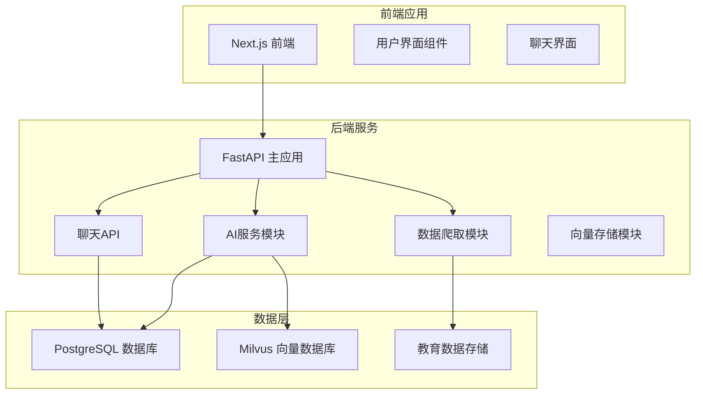
```mermaid
graph TB
subgraph "前端应用"
FE1[Next.js 前端]
FE2[用户界面组件]
FE3[聊天界面]
end
subgraph "后端服务"
BE1[FastAPI 主应用]
BE2[聊天API]
BE3[数据爬取模块]
BE4[AI服务模块]
BE5[向量存储模块]
end
subgraph "数据层"
DB1[PostgreSQL 数据库]
VS1[Milvus 向量数据库]
ES1[教育数据存储]
end
FE1 --> BE1
BE1 --> BE2
BE1 --> BE3
BE1 --> BE4
BE4 --> VS1
BE2 --> DB1
BE3 --> ES1
BE4 --> DB1
```

**图表来源**
- [backend/main.py:1-120](file://backend/main.py#L1-L120)
- [backend/app/api/chat.py:1-50](file://backend/app/api/chat.py#L1-L50)

**章节来源**
- [backend/main.py:1-853](file://backend/main.py#L1-L853)
- [backend/app/api/chat.py:1-224](file://backend/app/api/chat.py#L1-L224)

## 核心组件

### 1. 向量存储服务（Vector Store）

向量存储服务基于Milvus构建，负责存储和检索教务数据的向量表示。

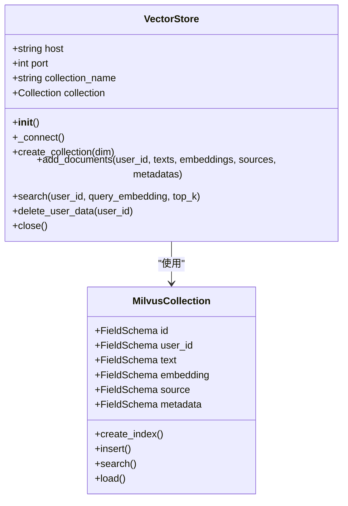
```mermaid
classDiagram
class VectorStore {
+string host
+int port
+string collection_name
+Collection collection
+__init__()
+_connect()
+create_collection(dim)
+add_documents(user_id, texts, embeddings, sources, metadatas)
+search(user_id, query_embedding, top_k)
+delete_user_data(user_id)
+close()
}
class MilvusCollection {
+FieldSchema id
+FieldSchema user_id
+FieldSchema text
+FieldSchema embedding
+FieldSchema source
+FieldSchema metadata
+create_index()
+insert()
+search()
+load()
}
VectorStore --> MilvusCollection : "使用"
```

**图表来源**
- [backend/app/services/vector_store.py:14-164](file://backend/app/services/vector_store.py#L14-L164)

### 2. AI服务模块（Qwen Service）

AI服务模块集成了DashScope千问大模型，提供对话和RAG增强功能。

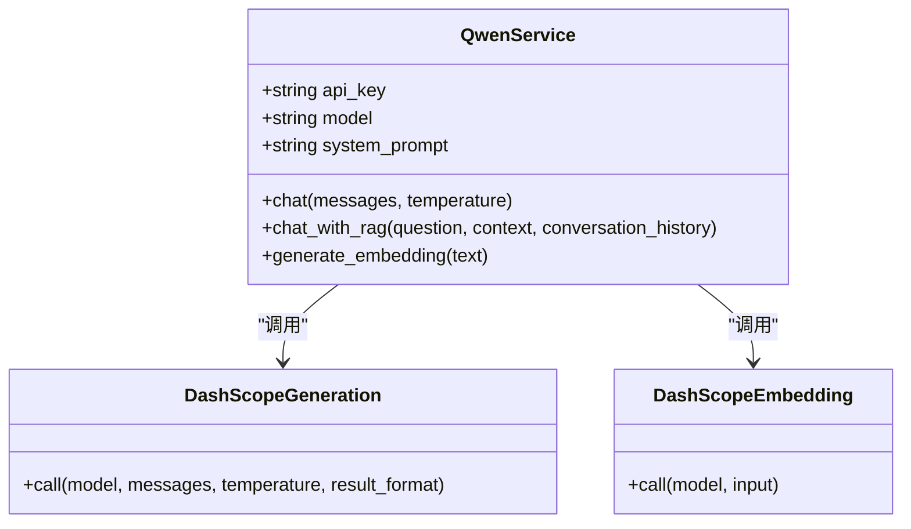
```mermaid
classDiagram
class QwenService {
+string api_key
+string model
+string system_prompt
+chat(messages, temperature)
+chat_with_rag(question, context, conversation_history)
+generate_embedding(text)
}
class DashScopeGeneration {
+call(model, messages, temperature, result_format)
}
class DashScopeEmbedding {
+call(model, input)
}
QwenService --> DashScopeGeneration : "调用"
QwenService --> DashScopeEmbedding : "调用"
```

**图表来源**
- [backend/app/services/qwen_service.py:15-178](file://backend/app/services/qwen_service.py#L15-L178)

### 3. 数据模型

系统使用SQLAlchemy ORM定义了完整的数据模型体系。

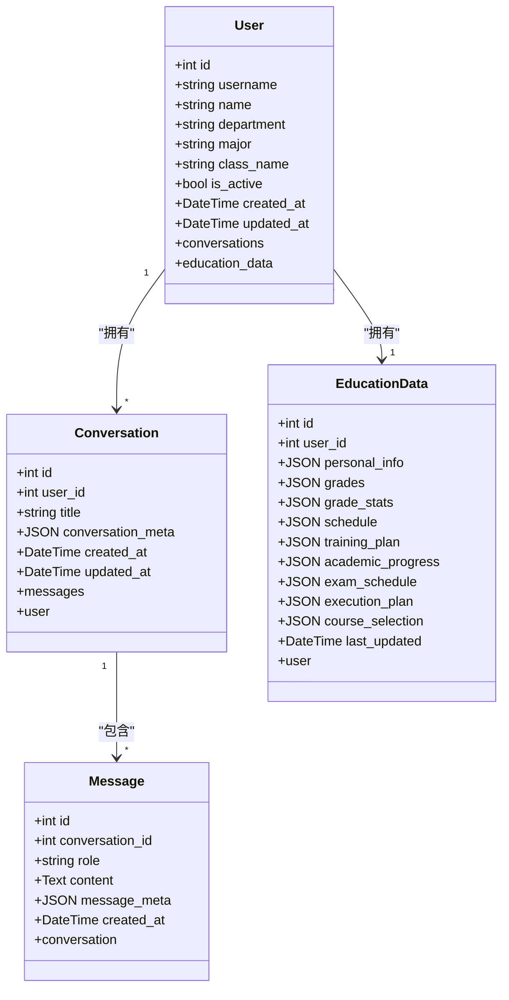
```mermaid
classDiagram
class User {
+int id
+string username
+string name
+string department
+string major
+string class_name
+bool is_active
+DateTime created_at
+DateTime updated_at
+conversations
+education_data
}
class Conversation {
+int id
+int user_id
+string title
+JSON conversation_meta
+DateTime created_at
+DateTime updated_at
+messages
+user
}
class Message {
+int id
+int conversation_id
+string role
+Text content
+JSON message_meta
+DateTime created_at
+conversation
}
class EducationData {
+int id
+int user_id
+JSON personal_info
+JSON grades
+JSON grade_stats
+JSON schedule
+JSON training_plan
+JSON academic_progress
+JSON exam_schedule
+JSON execution_plan
+JSON course_selection
+DateTime last_updated
+user
}
User "1" --> "*" Conversation : "拥有"
User "1" --> "1" EducationData : "拥有"
Conversation "1" --> "*" Message : "包含"
```

**图表来源**
- [backend/app/models/user.py:11-33](file://backend/app/models/user.py#L11-L33)
- [backend/app/models/conversation.py:11-42](file://backend/app/models/conversation.py#L11-L42)
- [backend/app/models/education_data.py:11-103](file://backend/app/models/education_data.py#L11-L103)

**章节来源**
- [backend/app/services/vector_store.py:1-164](file://backend/app/services/vector_store.py#L1-L164)
- [backend/app/services/qwen_service.py:1-178](file://backend/app/services/qwen_service.py#L1-L178)
- [backend/app/models/user.py:1-33](file://backend/app/models/user.py#L1-L33)
- [backend/app/models/conversation.py:1-42](file://backend/app/models/conversation.py#L1-L42)
- [backend/app/models/education_data.py:1-103](file://backend/app/models/education_data.py#L1-L103)

## 架构概览

智能教务系统采用三层架构设计，实现了RAG流程的完整闭环。

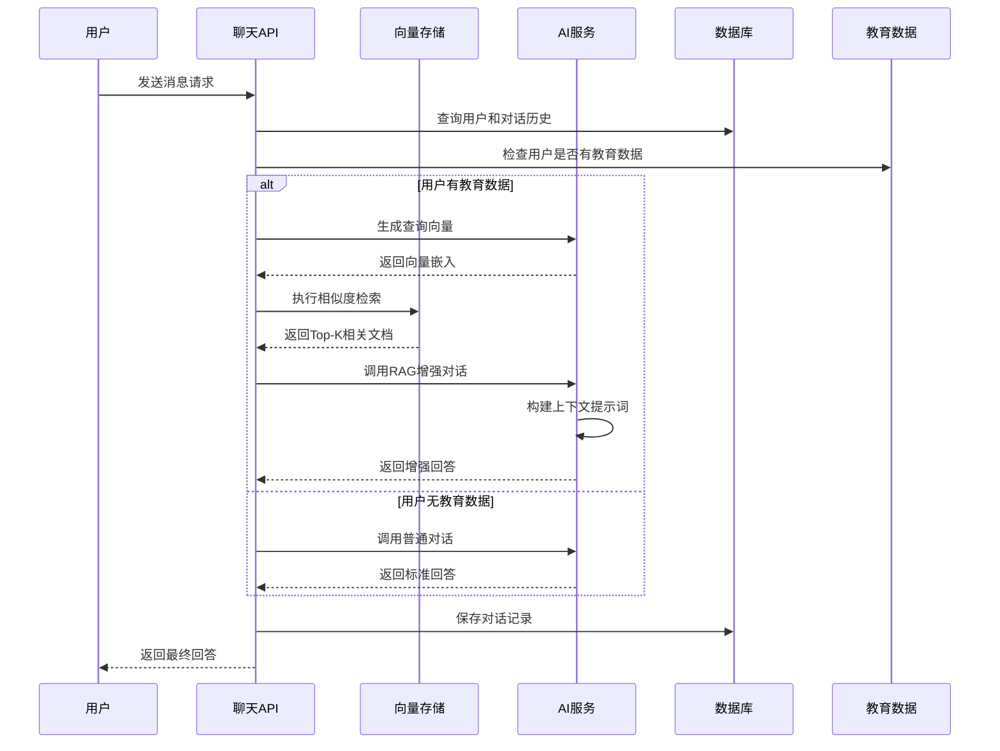
```mermaid
sequenceDiagram
participant U as 用户
participant API as 聊天API
participant VS as 向量存储
participant QWEN as AI服务
participant DB as 数据库
participant ED as 教育数据
U->>API : 发送消息请求
API->>DB : 查询用户和对话历史
API->>ED : 检查用户是否有教育数据
alt 用户有教育数据
API->>QWEN : 生成查询向量
QWEN-->>API : 返回向量嵌入
API->>VS : 执行相似度检索
VS-->>API : 返回Top-K相关文档
API->>QWEN : 调用RAG增强对话
QWEN->>QWEN : 构建上下文提示词
QWEN-->>API : 返回增强回答
else 用户无教育数据
API->>QWEN : 调用普通对话
QWEN-->>API : 返回标准回答
end
API->>DB : 保存对话记录
API-->>U : 返回最终回答
```

**图表来源**
- [backend/app/api/chat.py:45-154](file://backend/app/api/chat.py#L45-L154)
- [backend/app/services/vector_store.py:100-142](file://backend/app/services/vector_store.py#L100-L142)
- [backend/app/services/qwen_service.py:91-142](file://backend/app/services/qwen_service.py#L91-L142)

### RAG工作流程详解

#### 1. 检索阶段（Retrieval）

检索阶段负责从向量数据库中找到与用户查询最相关的教务数据。

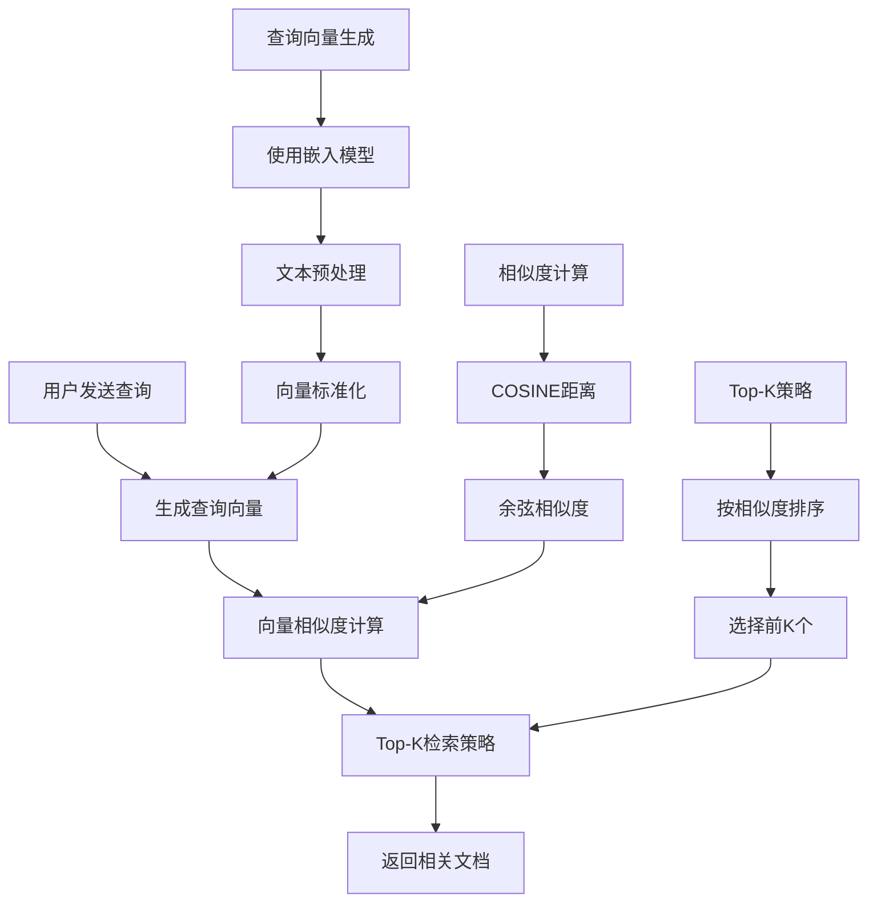
```mermaid
flowchart TD
A[用户发送查询] --> B[生成查询向量]
B --> C[向量相似度计算]
C --> D[Top-K检索策略]
D --> E[返回相关文档]
F[查询向量生成] --> G[使用嵌入模型]
G --> H[文本预处理]
H --> I[向量标准化]
I --> B
J[相似度计算] --> K[COSINE距离]
K --> L[余弦相似度]
L --> C
M[Top-K策略] --> N[按相似度排序]
N --> O[选择前K个]
O --> D
```

**图表来源**
- [backend/app/services/vector_store.py:100-142](file://backend/app/services/vector_store.py#L100-L142)
- [backend/app/services/qwen_service.py:144-173](file://backend/app/services/qwen_service.py#L144-L173)

#### 2. 融合阶段（Fusion）

融合阶段将检索到的相关文档与用户的历史对话进行融合。

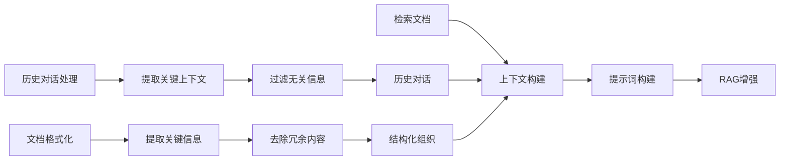
```mermaid
flowchart LR
A[检索文档] --> B[上下文构建]
C[历史对话] --> B
B --> D[提示词构建]
D --> E[RAG增强]
F[文档格式化] --> G[提取关键信息]
G --> H[去除冗余内容]
H --> I[结构化组织]
I --> B
J[历史对话处理] --> K[提取关键上下文]
K --> L[过滤无关信息]
L --> C
```

**图表来源**
- [backend/app/services/qwen_service.py:91-142](file://backend/app/services/qwen_service.py#L91-L142)

#### 3. 生成阶段（Generation）

生成阶段利用融合后的上下文调用大模型生成最终回答。

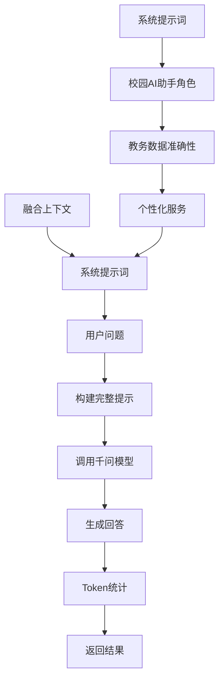
```mermaid
flowchart TD
A[融合上下文] --> B[系统提示词]
B --> C[用户问题]
C --> D[构建完整提示]
D --> E[调用千问模型]
E --> F[生成回答]
F --> G[Token统计]
G --> H[返回结果]
I[系统提示词] --> J[校园AI助手角色]
J --> K[教务数据准确性]
K --> L[个性化服务]
L --> B
```

**图表来源**
- [backend/app/services/qwen_service.py:39-90](file://backend/app/services/qwen_service.py#L39-L90)

**章节来源**
- [backend/app/api/chat.py:45-154](file://backend/app/api/chat.py#L45-L154)
- [backend/app/services/vector_store.py:100-142](file://backend/app/services/vector_store.py#L100-L142)
- [backend/app/services/qwen_service.py:91-178](file://backend/app/services/qwen_service.py#L91-L178)

## 详细组件分析

### 聊天API组件

聊天API是RAG架构的核心入口，负责协调整个对话流程。

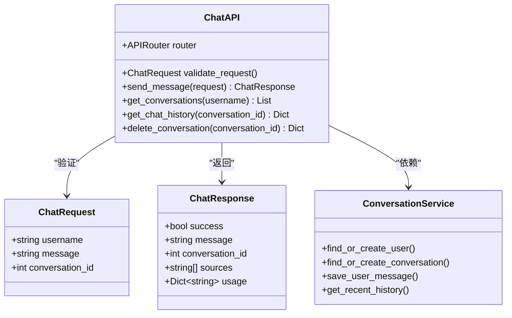
```mermaid
classDiagram
class ChatAPI {
+APIRouter router
+ChatRequest validate_request()
+send_message(request) ChatResponse
+get_conversations(username) List
+get_chat_history(conversation_id) Dict
+delete_conversation(conversation_id) Dict
}
class ChatRequest {
+string username
+string message
+int conversation_id
}
class ChatResponse {
+bool success
+string message
+int conversation_id
+string[] sources
+Dict~string~ usage
}
class ConversationService {
+find_or_create_user()
+find_or_create_conversation()
+save_user_message()
+get_recent_history()
}
ChatAPI --> ChatRequest : "验证"
ChatAPI --> ChatResponse : "返回"
ChatAPI --> ConversationService : "依赖"
```

**图表来源**
- [backend/app/api/chat.py:18-154](file://backend/app/api/chat.py#L18-L154)

#### 聊天流程序列图

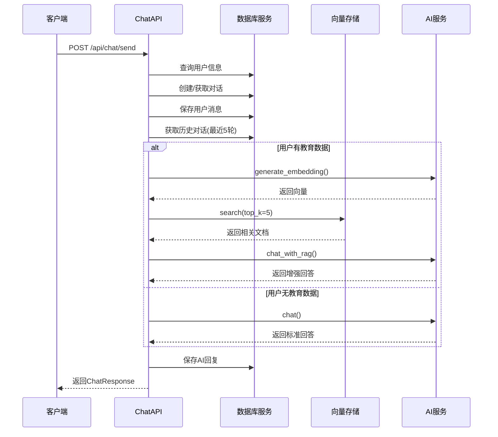
```mermaid
sequenceDiagram
participant Client as 客户端
participant API as ChatAPI
participant DB as 数据库服务
participant VS as 向量存储
participant QWEN as AI服务
Client->>API : POST /api/chat/send
API->>DB : 查询用户信息
API->>DB : 创建/获取对话
API->>DB : 保存用户消息
API->>DB : 获取历史对话(最近5轮)
alt 用户有教育数据
API->>QWEN : generate_embedding()
QWEN-->>API : 返回向量
API->>VS : search(top_k=5)
VS-->>API : 返回相关文档
API->>QWEN : chat_with_rag()
QWEN-->>API : 返回增强回答
else 用户无教育数据
API->>QWEN : chat()
QWEN-->>API : 返回标准回答
end
API->>DB : 保存AI回复
API-->>Client : 返回ChatResponse
```

**图表来源**
- [backend/app/api/chat.py:45-154](file://backend/app/api/chat.py#L45-L154)

### 向量检索机制

向量检索机制是RAG架构的关键技术实现。

#### 向量存储设计

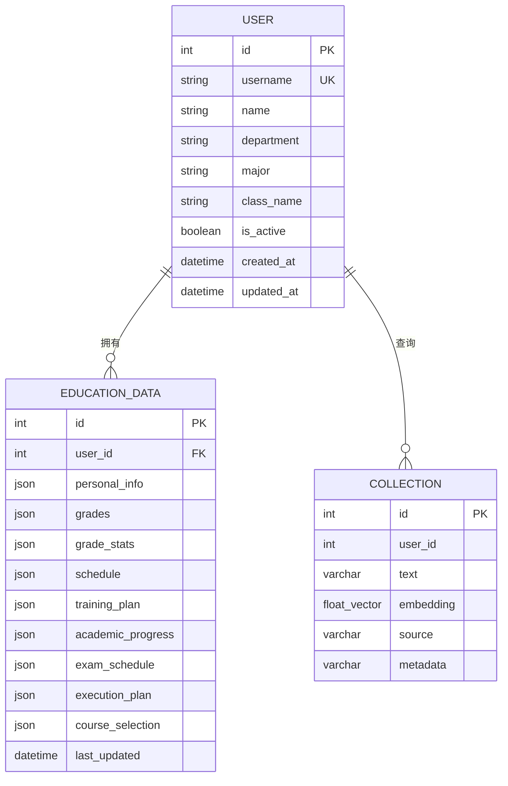
```mermaid
erDiagram
COLLECTION {
int id PK
int user_id
varchar text
float_vector embedding
varchar source
varchar metadata
}
USER {
int id PK
string username UK
string name
string department
string major
string class_name
boolean is_active
datetime created_at
datetime updated_at
}
EDUCATION_DATA {
int id PK
int user_id FK
json personal_info
json grades
json grade_stats
json schedule
json training_plan
json academic_progress
json exam_schedule
json execution_plan
json course_selection
datetime last_updated
}
USER ||--o{ EDUCATION_DATA : "拥有"
USER ||--o{ COLLECTION : "查询"
```

**图表来源**
- [backend/app/services/vector_store.py:46-57](file://backend/app/services/vector_store.py#L46-L57)
- [backend/app/models/education_data.py:16-47](file://backend/app/models/education_data.py#L16-L47)

#### 相似度计算算法

系统采用余弦相似度进行向量相似度计算：

**相似度公式：**
```
cos(θ) = (A · B) / (||A|| × ||B||)
```

其中：
- A 和 B 是两个向量
- A · B 是向量点积
- ||A|| 和 ||B|| 是向量的模长

#### Top-K检索策略

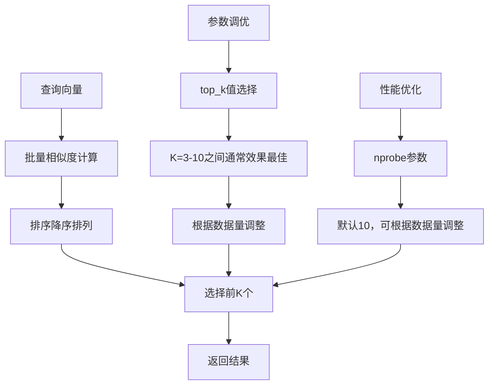
```mermaid
flowchart TD
A[查询向量] --> B[批量相似度计算]
B --> C[排序降序排列]
C --> D[选择前K个]
D --> E[返回结果]
F[参数调优] --> G[top_k值选择]
G --> H[K=3-10之间通常效果最佳]
H --> I[根据数据量调整]
I --> D
J[性能优化] --> K[nprobe参数]
K --> L[默认10，可根据数据量调整]
L --> D
```

**图表来源**
- [backend/app/services/vector_store.py:109-122](file://backend/app/services/vector_store.py#L109-L122)

### 上下文构建过程

上下文构建是RAG架构中最重要的环节，负责将检索到的相关文档与用户历史对话融合。

#### 文档筛选和排序

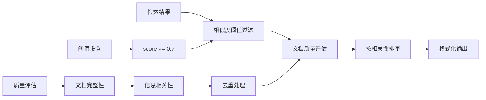
```mermaid
flowchart LR
A[检索结果] --> B[相似度阈值过滤]
B --> C[文档质量评估]
C --> D[按相关性排序]
D --> E[格式化输出]
F[阈值设置] --> G[score >= 0.7]
G --> B
H[质量评估] --> I[文档完整性]
I --> J[信息相关性]
J --> K[去重处理]
K --> C
```

**图表来源**
- [backend/app/services/vector_store.py:125-137](file://backend/app/services/vector_store.py#L125-L137)

#### 格式化策略

系统采用统一的上下文格式化模板：

```
【序号】文档内容
来源: 文档来源
```

这种格式化策略确保了：
- 清晰的文档标识
- 可追溯的信息来源
- 标准化的呈现格式

**章节来源**
- [backend/app/api/chat.py:97-124](file://backend/app/api/chat.py#L97-L124)
- [backend/app/services/vector_store.py:100-142](file://backend/app/services/vector_store.py#L100-L142)
- [backend/app/services/qwen_service.py:101-116](file://backend/app/services/qwen_service.py#L101-L116)

## 依赖关系分析

### 外部依赖

系统依赖多个外部服务和库：

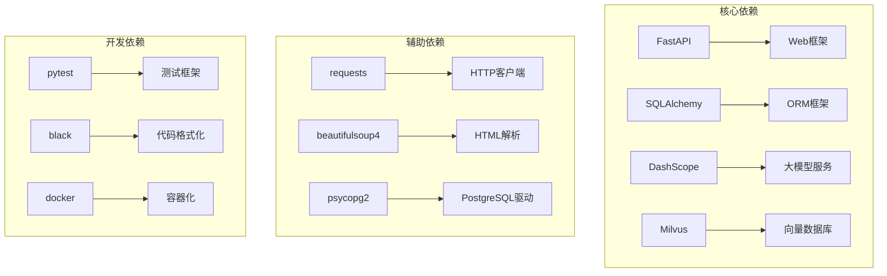
```mermaid
graph TB
subgraph "核心依赖"
A[FastAPI] --> B[Web框架]
C[SQLAlchemy] --> D[ORM框架]
E[DashScope] --> F[大模型服务]
G[Milvus] --> H[向量数据库]
end
subgraph "辅助依赖"
I[requests] --> J[HTTP客户端]
K[beautifulsoup4] --> L[HTML解析]
M[psycopg2] --> N[PostgreSQL驱动]
end
subgraph "开发依赖"
O[pytest] --> P[测试框架]
Q[black] --> R[代码格式化]
S[docker] --> T[容器化]
end
```

**图表来源**
- [backend/app/services/qwen_service.py:5-11](file://backend/app/services/qwen_service.py#L5-L11)
- [backend/app/services/vector_store.py:5-9](file://backend/app/services/vector_store.py#L5-L9)

### 内部模块依赖

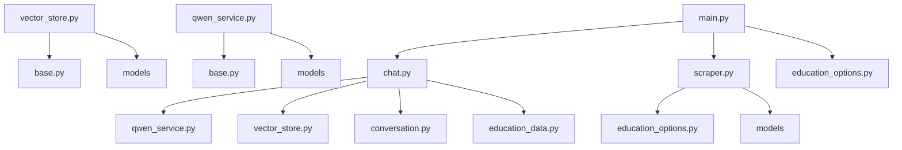
```mermaid
graph TD
A[chat.py] --> B[qwen_service.py]
A --> C[vector_store.py]
A --> D[conversation.py]
A --> E[education_data.py]
F[vector_store.py] --> G[base.py]
F --> H[models]
I[qwen_service.py] --> J[base.py]
I --> K[models]
L[scraper.py] --> M[education_options.py]
L --> N[models]
O[main.py] --> A
O --> L
O --> P[education_options.py]
```

**图表来源**
- [backend/app/api/chat.py:11-12](file://backend/app/api/chat.py#L11-L12)
- [backend/app/services/vector_store.py:1-9](file://backend/app/services/vector_store.py#L1-L9)
- [backend/app/services/qwen_service.py:1-11](file://backend/app/services/qwen_service.py#L1-L11)

**章节来源**
- [backend/app/api/chat.py:1-224](file://backend/app/api/chat.py#L1-L224)
- [backend/app/services/vector_store.py:1-164](file://backend/app/services/vector_store.py#L1-L164)
- [backend/app/services/qwen_service.py:1-178](file://backend/app/services/qwen_service.py#L1-L178)

## 性能考虑

### 向量检索性能优化

#### 索引策略

系统使用IVF_FLAT索引类型，具有以下特点：
- **索引类型**: IVF_FLAT（倒排文件）
- **度量类型**: COSINE（余弦距离）
- **nlist参数**: 128（聚类数量）
- **nprobe参数**: 10（查询时检查的簇数）

#### 性能调优建议

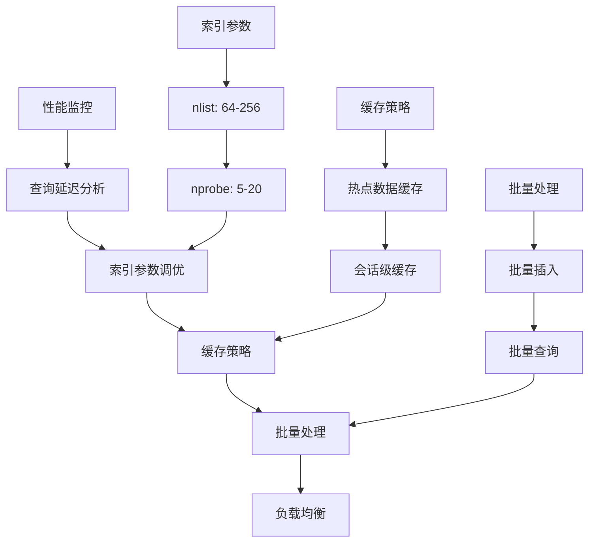
```mermaid
flowchart TD
A[性能监控] --> B[查询延迟分析]
B --> C[索引参数调优]
C --> D[缓存策略]
D --> E[批量处理]
E --> F[负载均衡]
G[索引参数] --> H[nlist: 64-256]
H --> I[nprobe: 5-20]
I --> C
J[缓存策略] --> K[热点数据缓存]
K --> L[会话级缓存]
L --> D
M[批量处理] --> N[批量插入]
N --> O[批量查询]
O --> E
```

### 内存和存储优化

#### 向量存储优化

- **向量维度**: 1024维（平衡精度和性能）
- **集合命名**: campus_knowledge（清晰的命名规范）
- **数据类型**: FLOAT_VECTOR（高精度浮点数）
- **最大长度**: 4096字符（文本内容限制）

#### 数据库优化

- **连接池**: 使用SQLAlchemy连接池
- **事务管理**: 自动事务提交和回滚
- **索引优化**: 为常用查询字段建立索引
- **查询优化**: 使用LIMIT限制结果集大小

### 网络通信优化

#### API响应优化

- **CORS配置**: 允许跨域请求
- **超时设置**: 10秒请求超时
- **重试机制**: 自动重试失败的请求
- **错误处理**: 统一的错误响应格式

**章节来源**
- [backend/app/services/vector_store.py:37-72](file://backend/app/services/vector_store.py#L37-L72)
- [backend/app/services/vector_store.py:109-122](file://backend/app/services/vector_store.py#L109-L122)
- [backend/main.py:41-48](file://backend/main.py#L41-L48)

## 故障排除指南

### 常见问题诊断

#### 向量数据库连接问题

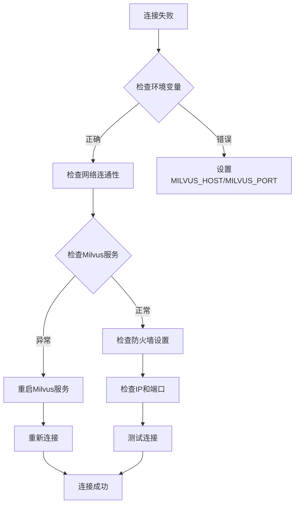
```mermaid
flowchart TD
A[连接失败] --> B{检查环境变量}
B --> |正确| C[检查网络连通性]
B --> |错误| D[设置MILVUS_HOST/MILVUS_PORT]
C --> E{检查Milvus服务}
E --> |正常| F[检查防火墙设置]
E --> |异常| G[重启Milvus服务]
F --> H[检查IP和端口]
G --> I[重新连接]
H --> J[测试连接]
I --> K[连接成功]
J --> K
```

#### AI服务调用失败

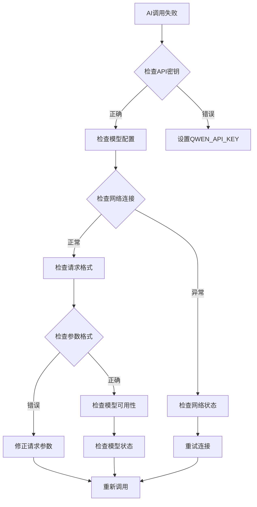
```mermaid
flowchart TD
A[AI调用失败] --> B{检查API密钥}
B --> |正确| C[检查模型配置]
B --> |错误| D[设置QWEN_API_KEY]
C --> E{检查网络连接}
E --> |正常| F[检查请求格式]
E --> |异常| G[检查网络状态]
F --> H{检查参数格式}
H --> |正确| I[检查模型可用性]
H --> |错误| J[修正请求参数]
I --> K[检查模型状态]
G --> L[重试连接]
J --> M[重新调用]
K --> M
L --> M
```

### 日志和监控

系统实现了完善的日志记录机制：

#### 关键日志级别

- **INFO**: 正常操作记录（连接成功、查询完成）
- **WARNING**: 警告信息（向量检索失败、数据格式警告）
- **ERROR**: 错误信息（连接失败、API调用异常）

#### 监控指标

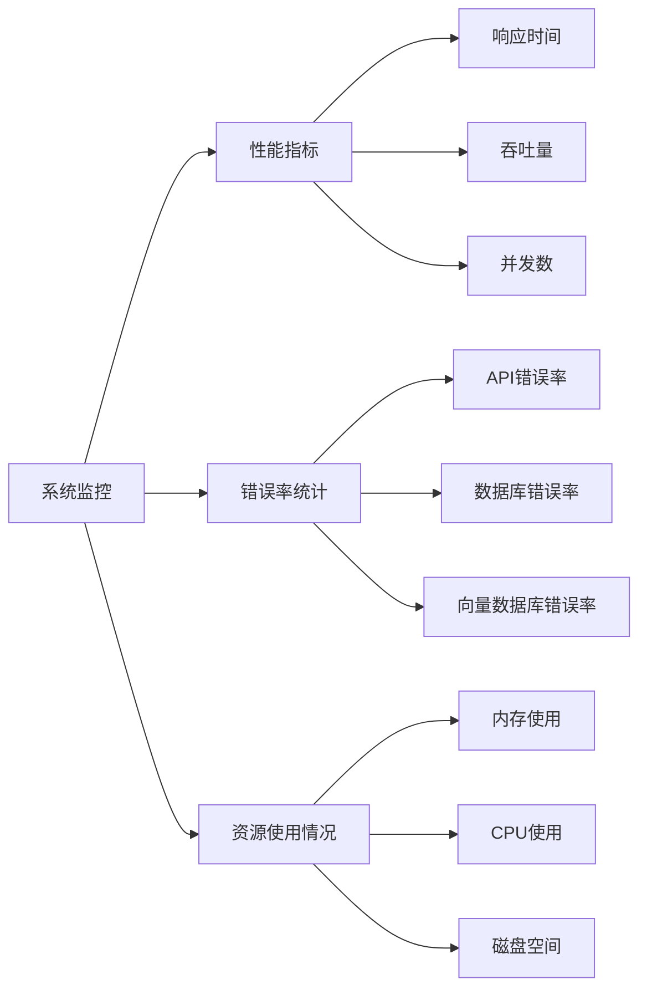
```mermaid
graph LR
A[系统监控] --> B[性能指标]
A --> C[错误率统计]
A --> D[资源使用情况]
B --> E[响应时间]
B --> F[吞吐量]
B --> G[并发数]
C --> H[API错误率]
C --> I[数据库错误率]
C --> J[向量数据库错误率]
D --> K[内存使用]
D --> L[CPU使用]
D --> M[磁盘空间]
```

### 调试工具

#### 测试脚本

系统提供了完整的测试套件：

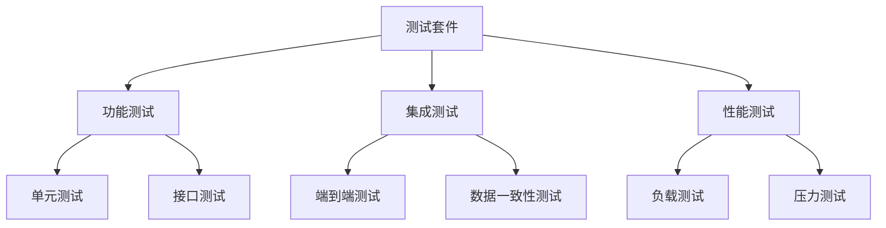
```mermaid
flowchart TD
A[测试套件] --> B[功能测试]
A --> C[集成测试]
A --> D[性能测试]
B --> E[单元测试]
B --> F[接口测试]
C --> G[端到端测试]
C --> H[数据一致性测试]
D --> I[负载测试]
D --> J[压力测试]
```

**章节来源**
- [backend/app/services/vector_store.py:34-35](file://backend/app/services/vector_store.py#L34-L35)
- [backend/app/services/qwen_service.py:78-89](file://backend/app/services/qwen_service.py#L78-L89)
- [backend/test_scraper.py:1-280](file://backend/test_scraper.py#L1-L280)
- [backend/test_login.py:1-152](file://backend/test_login.py#L1-L152)

## 结论

智能教务系统AI助手的RAG架构设计体现了现代AI应用的最佳实践。通过精心设计的三层架构（检索、融合、生成），系统实现了：

### 技术优势

1. **准确性提升**: 通过向量检索确保回答基于真实的教务数据
2. **知识时效性**: 实时从教务系统获取最新数据
3. **个性化能力**: 支持每个学生的专属数据和对话历史
4. **可扩展性**: 模块化设计便于功能扩展和维护

### 架构特色

1. **完整的数据流**: 从数据爬取到向量存储再到AI生成的完整闭环
2. **灵活的检索策略**: 支持多种检索参数和过滤条件
3. **强大的上下文管理**: 支持多轮对话和历史上下文记忆
4. **完善的错误处理**: 全面的日志记录和错误恢复机制

### 未来发展方向

1. **模型优化**: 引入更先进的大语言模型和嵌入模型
2. **性能提升**: 优化向量检索算法和数据库查询性能
3. **功能扩展**: 支持更多类型的教务查询和业务场景
4. **用户体验**: 改进界面设计和交互体验

该RAG架构为智能教务系统提供了坚实的技术基础，能够有效提升学生的学习体验和教务管理效率。