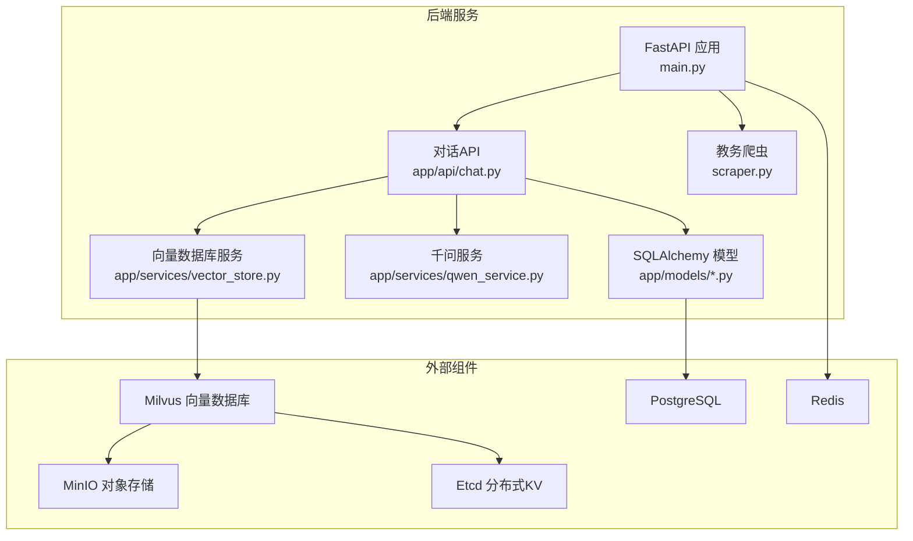
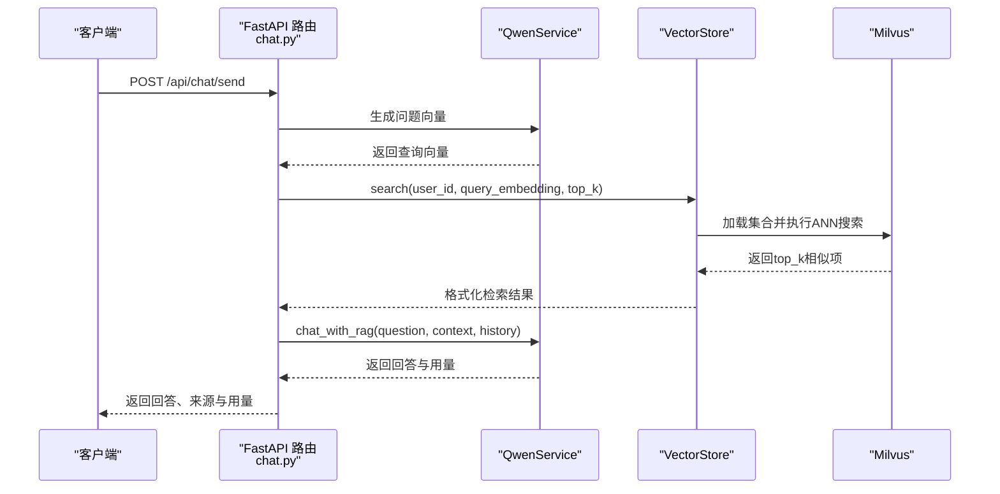
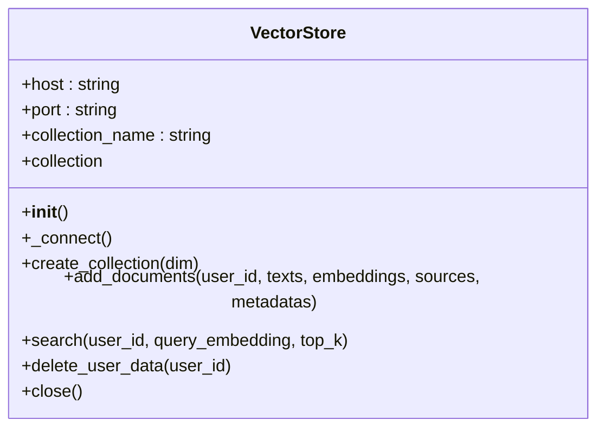
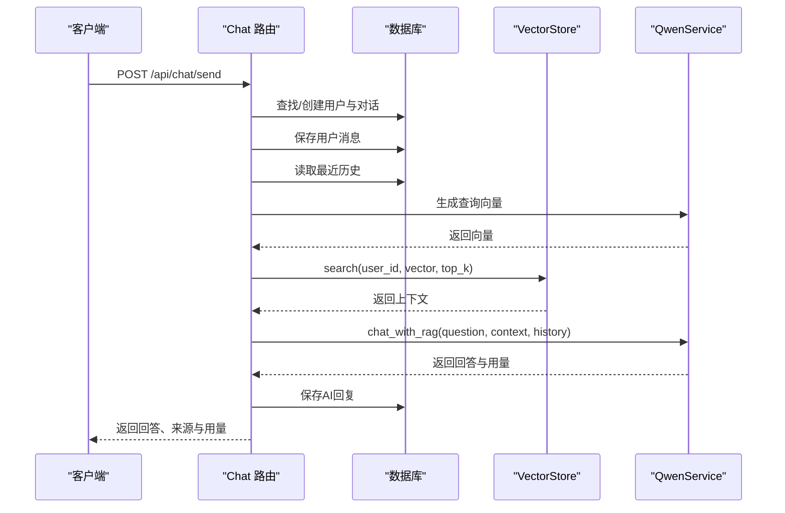
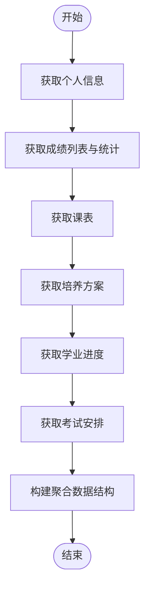
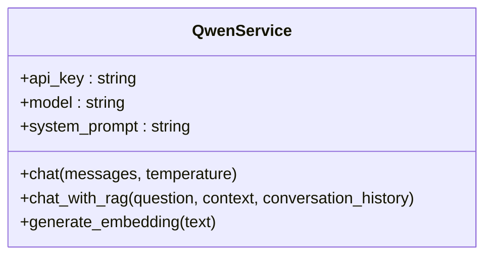
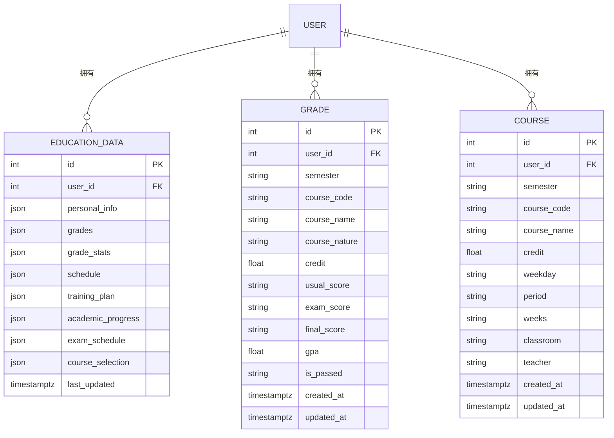
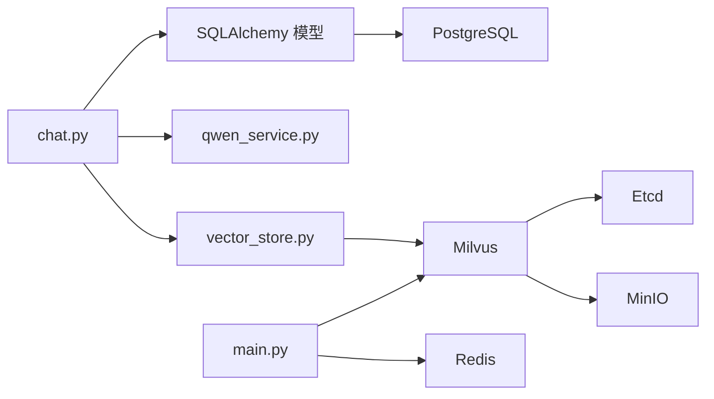

# 向量数据库集成

<cite>
**本文档引用的文件**
- [backend/app/services/vector_store.py](file://backend/app/services/vector_store.py)
- [backend/app/api/chat.py](file://backend/app/api/chat.py)
- [backend/main.py](file://backend/main.py)
- [backend/docker-compose.yml](file://backend/docker-compose.yml)
- [backend/requirements.txt](file://backend/requirements.txt)
- [backend/Dockerfile](file://backend/Dockerfile)
- [backend/app/models/base.py](file://backend/app/models/base.py)
- [backend/app/models/education_data.py](file://backend/app/models/education_data.py)
- [backend/app/services/qwen_service.py](file://backend/app/services/qwen_service.py)
- [backend/scraper.py](file://backend/scraper.py)
</cite>

## 目录
1. [简介](#简介)
2. [项目结构](#项目结构)
3. [核心组件](#核心组件)
4. [架构总览](#架构总览)
5. [详细组件分析](#详细组件分析)
6. [依赖关系分析](#依赖关系分析)
7. [性能考虑](#性能考虑)
8. [故障排查指南](#故障排查指南)
9. [结论](#结论)
10. [附录](#附录)

## 简介
本文件面向“智能教务系统AI助手”的向量数据库集成，围绕Milvus向量数据库展开，涵盖连接配置、集合管理、索引策略、向量数据存储结构、检索实现机制、生命周期管理、监控与维护以及配置示例与最佳实践。系统采用FastAPI提供REST接口，结合Milvus进行RAG（检索增强生成）以提升AI助手对教务数据的问答能力。

## 项目结构
后端采用Python + FastAPI + SQLAlchemy + Milvus的组合：
- FastAPI应用负责对外提供API，包括登录、数据爬取、对话RAG等。
- SQLAlchemy负责持久化用户会话、对话历史与教务数据。
- Milvus作为向量数据库，存储用户文本与其向量表示，支撑相似度检索。
- Docker Compose编排PostgreSQL、Redis、MinIO、Etcd与Milvus，形成一体化运行环境。

**图表来源**
- [backend/main.py:1-120](file://backend/main.py#L1-L120)
- [backend/app/api/chat.py:1-60](file://backend/app/api/chat.py#L1-L60)
- [backend/app/services/vector_store.py:1-40](file://backend/app/services/vector_store.py#L1-L40)
- [backend/docker-compose.yml:72-92](file://backend/docker-compose.yml#L72-L92)

**章节来源**
- [backend/main.py:1-120](file://backend/main.py#L1-L120)
- [backend/docker-compose.yml:1-148](file://backend/docker-compose.yml#L1-L148)

## 核心组件
- 向量数据库服务（VectorStore）：封装Milvus连接、集合创建、索引、插入、检索、删除与关闭。
- 对话API（Chat API）：整合RAG流程，调用嵌入服务生成查询向量，检索Milvus，再调用千问生成回答。
- 教务爬虫（Scraper）：聚合个人信息、成绩、课表、培养方案、学业进度、考试安排等，供向量化与RAG使用。
- 千问服务（QwenService）：封装DashScope调用，提供对话、RAG增强对话与文本向量生成。
- 数据模型（EducationData等）：定义教务数据的结构化存储，配合RAG检索使用。

**章节来源**
- [backend/app/services/vector_store.py:14-163](file://backend/app/services/vector_store.py#L14-L163)
- [backend/app/api/chat.py:45-147](file://backend/app/api/chat.py#L45-L147)
- [backend/scraper.py:1154-1219](file://backend/scraper.py#L1154-L1219)
- [backend/app/services/qwen_service.py:15-178](file://backend/app/services/qwen_service.py#L15-L178)
- [backend/app/models/education_data.py:11-103](file://backend/app/models/education_data.py#L11-L103)

## 架构总览
下图展示RAG检索流程：用户提问经千问生成查询向量，向量数据库按用户维度检索相似文本，返回上下文给千问生成最终回答。

**图表来源**
- [backend/app/api/chat.py:97-124](file://backend/app/api/chat.py#L97-L124)
- [backend/app/services/qwen_service.py:91-142](file://backend/app/services/qwen_service.py#L91-L142)
- [backend/app/services/vector_store.py:100-141](file://backend/app/services/vector_store.py#L100-L141)

## 详细组件分析

### 向量数据库服务（VectorStore）
- 连接配置：通过环境变量读取主机、端口与集合名，默认连接本地Milvus。
- 集合管理：若集合不存在则创建，字段包含自增主键、用户ID、文本、向量、来源与元数据。
- 索引策略：使用余弦相似度的IVF_FLAT索引，nlist为128，适合中小规模数据与快速检索平衡。
- 数据写入：批量插入文本、向量、来源与元数据，写入后flush保证可见性。
- 检索机制：加载集合，设置nprobe为10，按用户ID过滤，输出文本、来源与元数据。
- 生命周期：提供按用户ID删除数据与连接关闭方法。

**图表来源**
- [backend/app/services/vector_store.py:14-163](file://backend/app/services/vector_store.py#L14-L163)

**章节来源**
- [backend/app/services/vector_store.py:17-159](file://backend/app/services/vector_store.py#L17-L159)

### 对话API与RAG流程
- 用户认证与会话：路由层查找或创建用户与对话，保存用户消息。
- RAG检索：若存在教务数据，生成查询向量并调用VectorStore.search按用户维度检索。
- AI生成：将检索上下文与历史对话传入QwenService.chat_with_rag生成回答，记录用量与来源。
- 历史与删除：提供对话历史查询与删除接口。

**图表来源**
- [backend/app/api/chat.py:45-147](file://backend/app/api/chat.py#L45-L147)
- [backend/app/services/vector_store.py:100-141](file://backend/app/services/vector_store.py#L100-L141)
- [backend/app/services/qwen_service.py:91-142](file://backend/app/services/qwen_service.py#L91-L142)

**章节来源**
- [backend/app/api/chat.py:45-147](file://backend/app/api/chat.py#L45-L147)

### 教务数据聚合与向量化入口
- 教务爬虫提供统一聚合接口，返回个人信息、成绩、课表、培养方案、学业进度、考试安排、教师与课程信息。
- FastAPI提供“获取所有数据”接口，供前端或后台任务拉取后进行向量化入库。

**图表来源**
- [backend/scraper.py:1154-1219](file://backend/scraper.py#L1154-L1219)
- [backend/main.py:698-724](file://backend/main.py#L698-L724)

**章节来源**
- [backend/scraper.py:1154-1219](file://backend/scraper.py#L1154-L1219)
- [backend/main.py:698-724](file://backend/main.py#L698-L724)

### 千问服务与嵌入生成
- 对话与RAG增强：构造系统提示词与上下文，调用DashScope生成回答并返回用量。
- 文本向量生成：当前封装使用DashScope文本嵌入接口，实际项目可根据需要替换为sentence-transformers等。

**图表来源**
- [backend/app/services/qwen_service.py:15-178](file://backend/app/services/qwen_service.py#L15-L178)

**章节来源**
- [backend/app/services/qwen_service.py:15-178](file://backend/app/services/qwen_service.py#L15-L178)

### 数据模型与持久化
- 教务数据模型：定义教育数据表、成绩明细表与课程表，支持JSON字段存储结构化数据。
- 数据库连接：通过环境变量读取PostgreSQL连接串，提供会话工厂与依赖注入。

**图表来源**
- [backend/app/models/education_data.py:11-103](file://backend/app/models/education_data.py#L11-L103)
- [backend/app/models/base.py:10-29](file://backend/app/models/base.py#L10-L29)

**章节来源**
- [backend/app/models/education_data.py:11-103](file://backend/app/models/education_data.py#L11-L103)
- [backend/app/models/base.py:10-29](file://backend/app/models/base.py#L10-L29)

## 依赖关系分析
- 组件耦合：对话API依赖向量数据库服务与千问服务；向量数据库服务依赖Milvus；RAG流程贯穿三者。
- 外部依赖：Milvus、PostgreSQL、Redis、MinIO、Etcd通过Docker Compose统一编排。
- 运行时依赖：FastAPI、Pydantic、DashScope、pymilvus、SQLAlchemy等。

**图表来源**
- [backend/app/api/chat.py:11-12](file://backend/app/api/chat.py#L11-L12)
- [backend/app/services/vector_store.py:5-5](file://backend/app/services/vector_store.py#L5-L5)
- [backend/docker-compose.yml:72-92](file://backend/docker-compose.yml#L72-L92)

**章节来源**
- [backend/docker-compose.yml:1-148](file://backend/docker-compose.yml#L1-L148)
- [backend/requirements.txt:1-44](file://backend/requirements.txt#L1-L44)

## 性能考虑
- 索引与查询参数
  - 索引类型：IVF_FLAT（适合中小规模、易训练与部署）
  - 相似度：COSINE（与嵌入归一化一致，语义检索效果好）
  - nlist：128（影响倒排表数量，权衡内存与召回）
  - nprobe：10（查询时扫描倒排桶数量，越大越准但越慢）
- 向量维度与数据类型
  - 向量维度：集合创建时指定，需与嵌入模型输出一致
  - 字段类型：FLOAT_VECTOR、VARCHAR、INT64等
- 写入与可见性
  - flush保证写入后立即可见，适合小批量写入；大批量建议分批与批量flush
- 检索过滤
  - 按user_id过滤避免跨用户数据泄露，同时限制搜索空间
- 缓存与会话
  - 会话存储建议使用Redis（当前为内存字典，生产需替换）

**章节来源**
- [backend/app/services/vector_store.py:37-71](file://backend/app/services/vector_store.py#L37-L71)
- [backend/app/services/vector_store.py:100-141](file://backend/app/services/vector_store.py#L100-L141)

## 故障排查指南
- Milvus连接失败
  - 检查环境变量MILVUS_HOST/MILVUS_PORT与容器连通性
  - 查看容器健康检查状态
- 集合不存在或索引异常
  - 确认集合创建逻辑与索引参数
  - 检查向量维度与嵌入模型输出一致性
- 检索无结果或性能差
  - 调整nprobe与nlist，评估数据规模与硬件资源
  - 确认user_id过滤表达式正确
- 嵌入生成失败
  - 检查DashScope API Key与模型可用性
  - 替换为稳定可靠的嵌入服务（如sentence-transformers）
- 数据库与会话问题
  - 确认PostgreSQL连接串与Redis可用性
  - 生产环境将会话迁移至Redis

**章节来源**
- [backend/app/services/vector_store.py:24-35](file://backend/app/services/vector_store.py#L24-L35)
- [backend/app/services/vector_store.py:69-71](file://backend/app/services/vector_store.py#L69-L71)
- [backend/app/services/vector_store.py:139-141](file://backend/app/services/vector_store.py#L139-L141)
- [backend/app/services/qwen_service.py:154-173](file://backend/app/services/qwen_service.py#L154-L173)
- [backend/docker-compose.yml:72-92](file://backend/docker-compose.yml#L72-L92)
- [backend/app/models/base.py:10-29](file://backend/app/models/base.py#L10-L29)

## 结论
本系统以Milvus为核心向量数据库，结合RAG实现对教务数据的语义检索与智能问答。通过清晰的服务边界与Docker编排，实现了开发、测试与生产的可移植性。建议在生产环境中进一步完善嵌入模型、缓存策略、索引调优与监控告警体系，以获得更稳定的性能与用户体验。

## 附录

### Milvus连接与环境变量
- 主机与端口：通过环境变量MILVUS_HOST与MILVUS_PORT配置
- 集合名：通过MILVUS_COLLECTION配置，默认“campus_knowledge”
- Docker Compose中Milvus暴露19530端口并挂载数据卷

**章节来源**
- [backend/app/services/vector_store.py:17-22](file://backend/app/services/vector_store.py#L17-L22)
- [backend/docker-compose.yml:72-92](file://backend/docker-compose.yml#L72-L92)

### 集合字段与索引策略
- 字段设计
  - id：自增主键（INT64）
  - user_id：用户标识（INT64）
  - text：文本内容（VARCHAR，最大长度4096）
  - embedding：向量（FLOAT_VECTOR，维度由集合创建时指定）
  - source：数据来源（VARCHAR，最大长度100）
  - metadata：元数据（VARCHAR，最大长度2048，JSON字符串）
- 索引参数
  - metric_type：COSINE
  - index_type：IVF_FLAT
  - params：nlist=128

**章节来源**
- [backend/app/services/vector_store.py:45-65](file://backend/app/services/vector_store.py#L45-L65)

### 检索流程与参数
- 搜索参数
  - metric_type：COSINE
  - params：nprobe=10
  - expr：按user_id过滤
  - output_fields：text、source、metadata
- 返回结构：包含id、text、source、metadata、score

**章节来源**
- [backend/app/services/vector_store.py:108-122](file://backend/app/services/vector_store.py#L108-L122)
- [backend/app/services/vector_store.py:124-137](file://backend/app/services/vector_store.py#L124-L137)

### 向量化数据聚合接口
- 聚合内容：个人信息、成绩信息（含统计）、课表信息、培养方案、学业进度、考试安排、教师信息、课程信息
- 用途：供RAG系统一次性获取并向量化入库

**章节来源**
- [backend/scraper.py:1154-1219](file://backend/scraper.py#L1154-L1219)
- [backend/main.py:698-724](file://backend/main.py#L698-L724)

### Docker Compose与运行环境
- 服务编排：PostgreSQL、Redis、MinIO、Etcd、Milvus、后端、前端
- 端口映射：Milvus 19530、后端 8000、前端 3000
- 健康检查：Milvus健康端口9091，PostgreSQL/Redis/Etcd/MinIO均有健康检查

**章节来源**
- [backend/docker-compose.yml:1-148](file://backend/docker-compose.yml#L1-L148)
- [backend/Dockerfile:1-18](file://backend/Dockerfile#L1-L18)