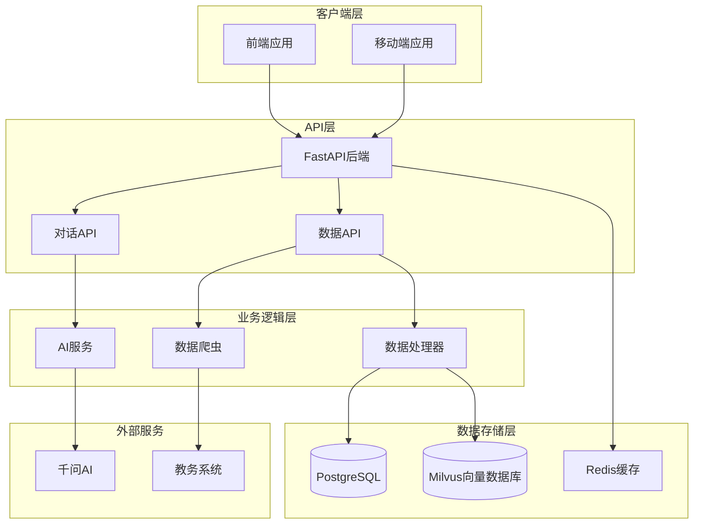
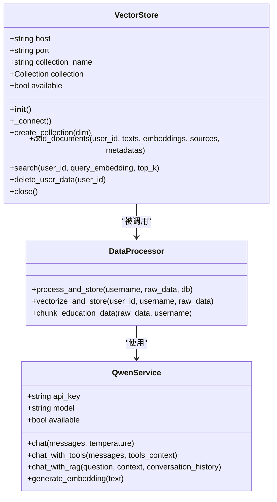
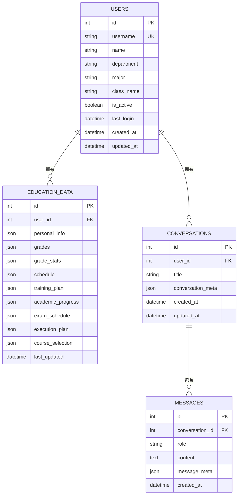
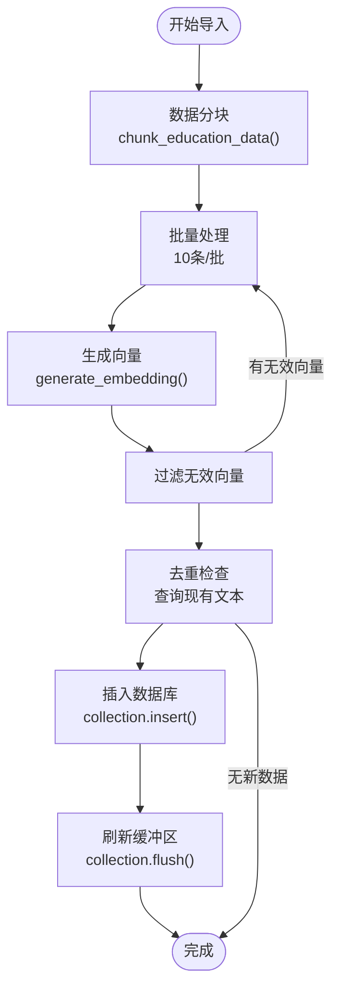
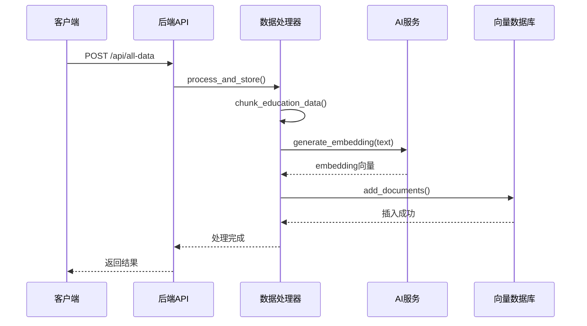
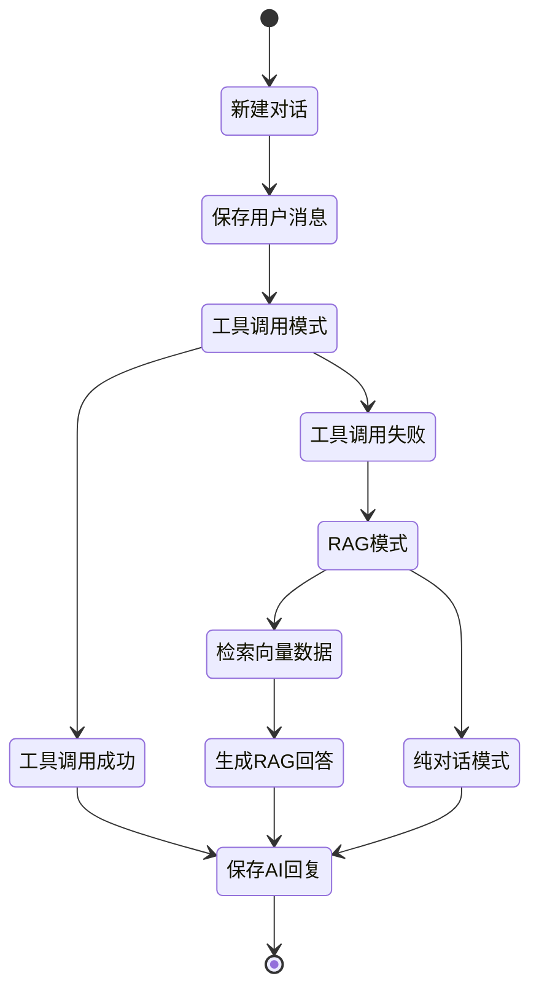

# 向量数据库管理脚本

<cite>
**本文档中引用的文件**
- [main.py](file://backend/main.py)
- [check_vectors.py](file://backend/check_vectors.py)
- [vector_store.py](file://backend/app/services/vector_store.py)
- [data_processor.py](file://backend/app/services/data_processor.py)
- [qwen_service.py](file://backend/app/services/qwen_service.py)
- [scraper.py](file://backend/scraper.py)
- [chat.py](file://backend/app/api/chat.py)
- [education_data.py](file://backend/app/models/education_data.py)
- [user.py](file://backend/app/models/user.py)
- [conversation.py](file://backend/app/models/conversation.py)
- [base.py](file://backend/app/models/base.py)
- [requirements.txt](file://backend/requirements.txt)
- [docker-compose.yml](file://docker-compose.yml)
</cite>

## 目录
1. [项目概述](#项目概述)
2. [系统架构](#系统架构)
3. [核心组件](#核心组件)
4. [向量数据库管理](#向量数据库管理)
5. [数据处理流程](#数据处理流程)
6. [AI集成](#ai集成)
7. [部署配置](#部署配置)
8. [故障排除](#故障排除)
9. [总结](#总结)

## 项目概述

这是一个基于FastAPI构建的智能教务系统AI助手，集成了向量数据库管理功能。该项目实现了完整的教务数据爬取、存储、向量化和检索功能，支持基于Milvus的向量搜索和基于DashScope的AI对话。

### 主要特性

- **教务数据爬取**：自动爬取成绩、课表、培养方案等教务数据
- **向量数据库管理**：使用Milvus进行数据向量化和相似度检索
- **AI对话集成**：支持Function Calling和RAG增强的AI对话
- **多用户支持**：为每个用户维护独立的数据和对话历史
- **容器化部署**：完整的Docker Compose配置

## 系统架构



**架构图来源**
- [main.py:1-973](file://backend/main.py#L1-L973)
- [docker-compose.yml:1-167](file://docker-compose.yml#L1-L167)

## 核心组件

### 1. 向量存储服务

VectorStore类是向量数据库的核心管理组件：



**类图来源**
- [vector_store.py:14-234](file://backend/app/services/vector_store.py#L14-L234)
- [data_processor.py:13-356](file://backend/app/services/data_processor.py#L13-L356)
- [qwen_service.py:15-516](file://backend/app/services/qwen_service.py#L15-L516)

### 2. 数据模型设计

系统采用SQLAlchemy ORM设计，包含用户、教育数据和对话模型：



**实体关系图来源**
- [user.py:11-33](file://backend/app/models/user.py#L11-L33)
- [education_data.py:11-103](file://backend/app/models/education_data.py#L11-L103)
- [conversation.py:11-42](file://backend/app/models/conversation.py#L11-L42)

**章节来源**
- [vector_store.py:1-234](file://backend/app/services/vector_store.py#L1-L234)
- [data_processor.py:1-356](file://backend/app/services/data_processor.py#L1-L356)
- [education_data.py:1-103](file://backend/app/models/education_data.py#L1-L103)
- [user.py:1-33](file://backend/app/models/user.py#L1-L33)
- [conversation.py:1-42](file://backend/app/models/conversation.py#L1-L42)

## 向量数据库管理

### 1. Milvus集成

系统使用Milvus作为向量数据库，支持高效的相似度搜索：

#### 集合管理
- **集合名称**：`campus_knowledge`
- **字段定义**：
  - `id`: 主键，自增整数
  - `user_id`: 用户ID，整数
  - `text`: 文本内容，VARCHAR(4096)
  - `embedding`: 向量，FLOAT_VECTOR(1536维)
  - `source`: 数据来源，VARCHAR(100)
  - `metadata`: 元数据，VARCHAR(2048)

#### 索引配置
- **索引类型**：IVF_FLAT
- **距离度量**：COSINE
- **参数**：nlist=128

### 2. 数据导入流程



**流程图来源**
- [data_processor.py:97-181](file://backend/app/services/data_processor.py#L97-L181)
- [vector_store.py:78-144](file://backend/app/services/vector_store.py#L78-L144)

### 3. 搜索机制

系统支持基于语义的相似度搜索：

#### 搜索参数
- **top_k**: 默认5条结果
- **nprobe**: 10个聚类中心
- **过滤条件**: `user_id == {user_id}`

#### 搜索结果格式
```json
{
  "id": 123,
  "text": "课程成绩：高等数学，学期2024-2025-1，成绩85，学分4",
  "source": "成绩",
  "metadata": {"type": "grade", "course": "高等数学"},
  "score": 0.85
}
```

**章节来源**
- [vector_store.py:146-191](file://backend/app/services/vector_store.py#L146-L191)
- [data_processor.py:182-351](file://backend/app/services/data_processor.py#L182-L351)

## 数据处理流程

### 1. 数据分块策略

系统将不同类型的教务数据按照特定规则进行分块：

#### 个人信息分块
- **内容**：姓名、学号、专业、班级、学院
- **来源**：个人信息
- **元数据**：`{"type": "personal_info"}`

#### 成绩数据分块
- **每门课程**生成一个数据块
- **内容**：课程名称、学期、成绩、学分等
- **来源**：成绩
- **元数据**：`{"type": "grade", "course": "课程名"}`

#### 课表数据分块
- **按星期分组**：周一到周日
- **内容**：每天的课程列表
- **来源**：课表
- **元数据**：`{"type": "schedule", "day": "星期X"}`

#### 培养方案分块
- **按学期分组**：每个学期一个数据块
- **内容**：学期课程列表
- **来源**：培养方案
- **元数据**：`{"type": "training_plan", "semester": "学期"}`

### 2. 向量化流程



**序列图来源**
- [main.py:408-457](file://backend/main.py#L408-L457)
- [data_processor.py:97-181](file://backend/app/services/data_processor.py#L97-L181)

**章节来源**
- [data_processor.py:182-351](file://backend/app/services/data_processor.py#L182-L351)
- [scraper.py:1-800](file://backend/scraper.py#L1-L800)

## AI集成

### 1. 千问AI服务

系统集成了DashScope的千问AI服务，支持多种功能：

#### 工具调用功能
- `query_personal_info`: 查询个人信息
- `query_grades`: 查询成绩
- `query_schedule`: 查询课表
- `query_exam_schedule`: 查询考试安排
- `query_academic_progress`: 查询学业进度
- `refresh_all_data`: 刷新所有数据

#### RAG增强对话
系统支持基于向量检索的RAG对话，能够结合最新的教务数据提供准确回答。

### 2. 对话管理



**状态图来源**
- [chat.py:46-179](file://backend/app/api/chat.py#L46-L179)

**章节来源**
- [qwen_service.py:15-516](file://backend/app/services/qwen_service.py#L15-L516)
- [chat.py:1-200](file://backend/app/api/chat.py#L1-L200)

## 部署配置

### 1. Docker Compose配置

系统使用Docker Compose进行容器化部署，包含以下服务：

#### 核心服务
- **postgres**: PostgreSQL数据库
- **redis**: 缓存服务
- **milvus**: 向量数据库
- **etcd**: 分布式键值存储
- **minio**: 对象存储

#### 应用服务
- **backend**: FastAPI后端服务
- **frontend**: 前端应用

### 2. 环境变量配置

```yaml
environment:
  POSTGRES_HOST: postgres
  POSTGRES_PORT: 5432
  POSTGRES_USER: ${POSTGRES_USER:-postgres}
  POSTGRES_PASSWORD: ${POSTGRES_PASSWORD:-postgres}
  POSTGRES_DB: ${POSTGRES_DB:-campus_ai}
  REDIS_HOST: redis
  MILVUS_HOST: milvus
  MILVUS_PORT: 19530
  QWEN_API_KEY: sk-6c8dc750b9744c9cb60ce0eb7fcfce0e
  QWEN_MODEL: qwen-plus
```

### 3. 依赖包管理

系统使用requirements.txt管理Python依赖，主要包括：

#### 核心框架
- `fastapi==0.115.6`: Web框架
- `uvicorn==0.32.1`: ASGI服务器

#### 数据库相关
- `sqlalchemy==2.0.36`: ORM框架
- `psycopg2-binary==2.9.10`: PostgreSQL驱动
- `pymilvus==2.6.11`: Milvus客户端

#### AI和向量处理
- `dashscope==1.20.11`: 千问AI SDK
- `openai==1.59.6`: OpenAI SDK
- `langchain==0.3.14`: LLM框架

**章节来源**
- [docker-compose.yml:1-167](file://docker-compose.yml#L1-L167)
- [requirements.txt:1-48](file://backend/requirements.txt#L1-L48)

## 故障排除

### 1. 向量数据库检查

提供专门的脚本来检查Milvus向量数据库状态：

```bash
python backend/check_vectors.py
```

#### 检查内容
- Milvus连接状态
- 集合存在性
- 数据统计信息
- 用户数据查询
- 数据来源统计

### 2. 常见问题解决

#### Milvus连接失败
- 检查Docker容器状态：`docker ps`
- 验证网络连接：`docker network ls`
- 检查端口占用：`netstat -an | grep 19530`

#### 向量数据导入失败
- 检查API密钥配置
- 验证数据格式正确性
- 确认向量维度匹配

#### AI服务不可用
- 验证DashScope API密钥
- 检查网络连接
- 确认模型配置正确

### 3. 性能优化建议

#### 向量数据库优化
- 调整nlist参数优化搜索性能
- 定期清理无效数据
- 监控磁盘空间使用

#### 数据库优化
- 为常用查询字段建立索引
- 定期分析和优化表结构
- 监控查询性能

**章节来源**
- [check_vectors.py:1-84](file://backend/check_vectors.py#L1-L84)

## 总结

这个向量数据库管理脚本实现了一个完整的智能教务系统，具有以下特点：

### 技术优势
- **完整的数据处理链路**：从爬取到向量化的全流程自动化
- **灵活的向量检索**：支持基于语义的相似度搜索
- **强大的AI集成**：支持Function Calling和RAG增强对话
- **容器化部署**：易于部署和扩展

### 架构特色
- **模块化设计**：清晰的服务分离和依赖管理
- **数据持久化**：PostgreSQL存储结构化数据，Milvus存储向量数据
- **多用户隔离**：每个用户独立的数据和对话空间
- **可扩展性**：支持水平扩展和微服务架构

### 应用价值
- **提升用户体验**：提供智能化的教务查询服务
- **降低开发成本**：标准化的数据处理和AI集成
- **便于维护**：清晰的代码结构和完善的错误处理

该系统为教育机构提供了现代化的智能助手解决方案，能够有效提升教务管理效率和用户体验。