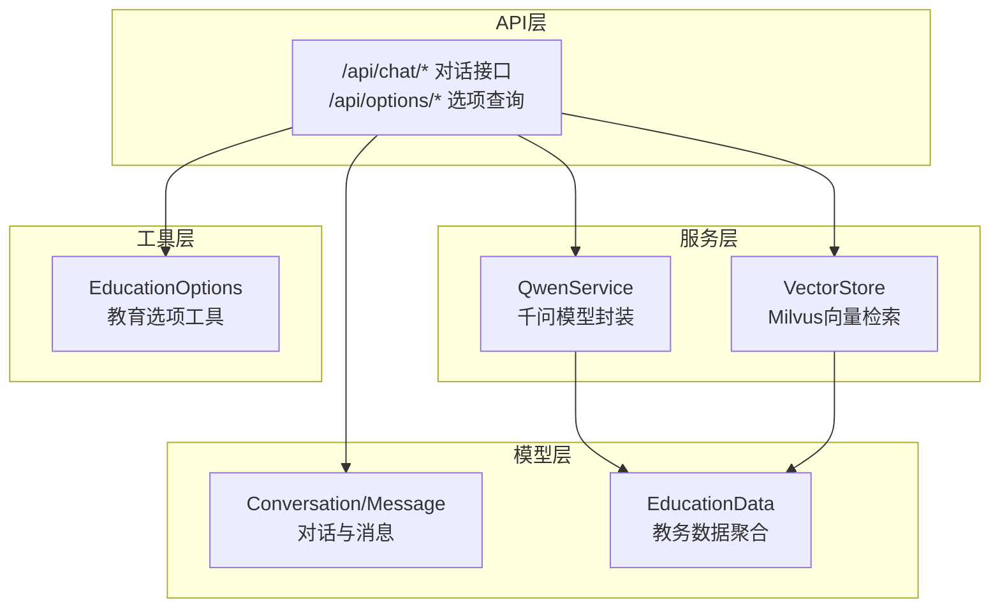
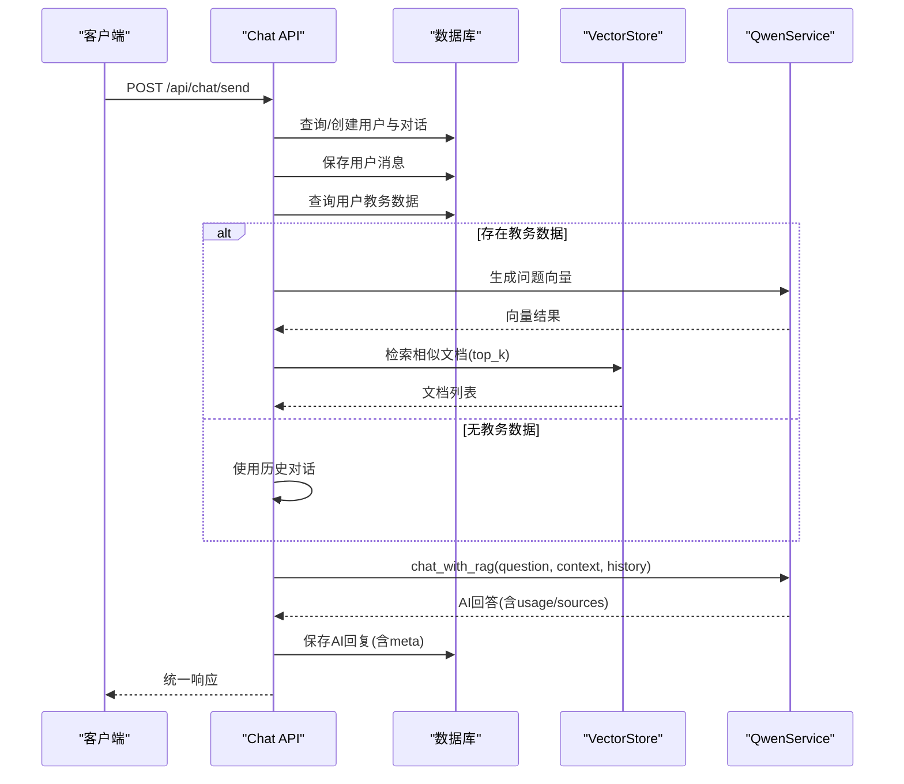
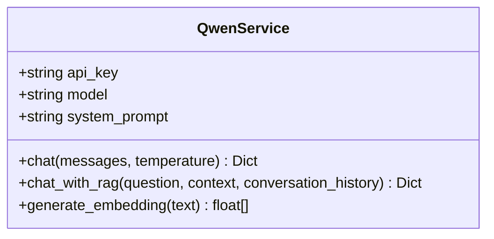
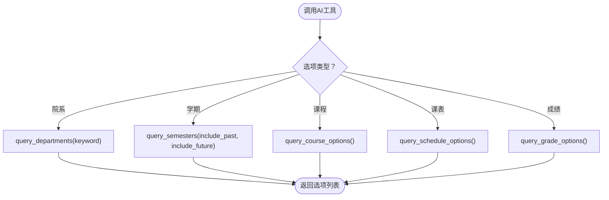
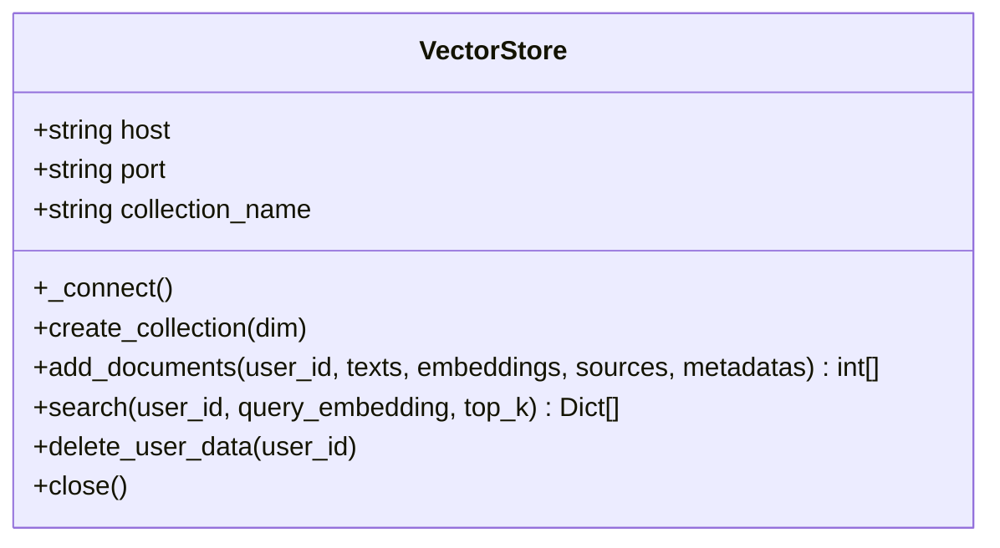
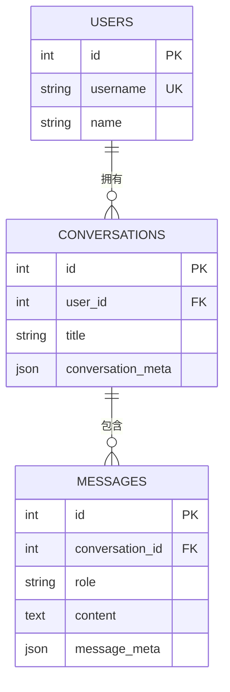
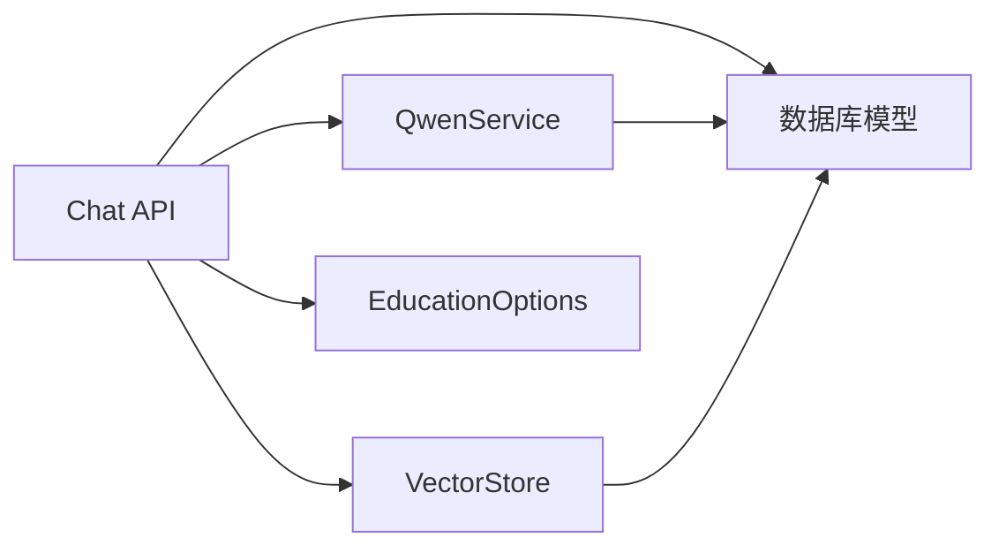
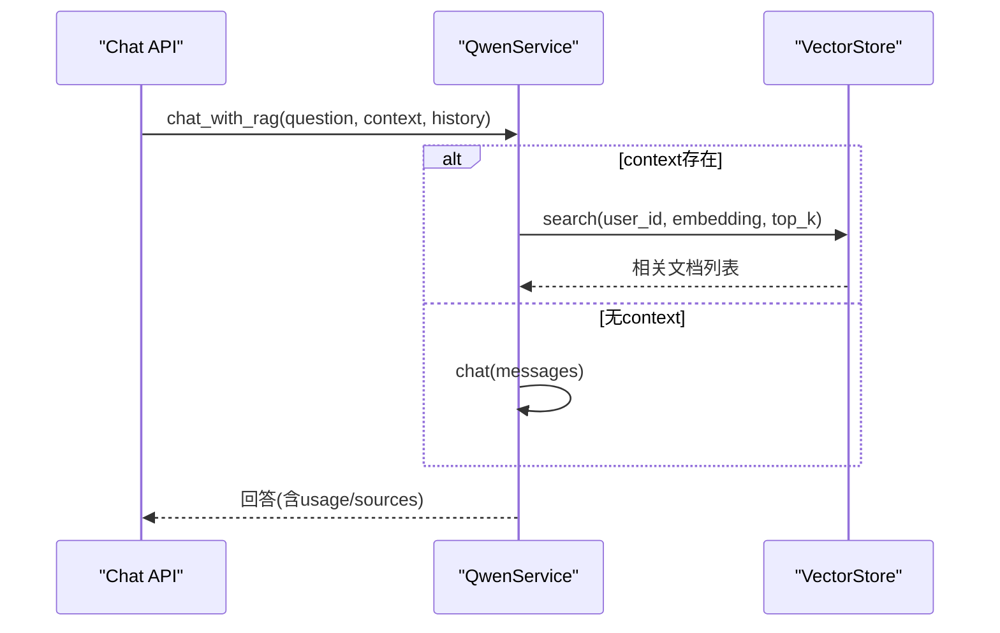
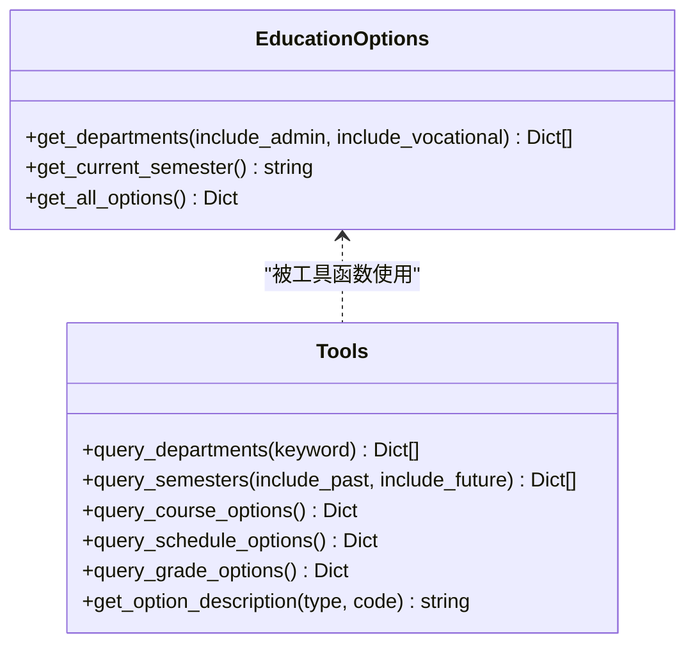

# 大语言模型服务集成

<cite>
**本文档引用的文件**
- [backend/main.py](file://backend/main.py)
- [backend/app/api/chat.py](file://backend/app/api/chat.py)
- [backend/app/services/qwen_service.py](file://backend/app/services/qwen_service.py)
- [backend/education_options.py](file://backend/education_options.py)
- [backend/app/services/vector_store.py](file://backend/app/services/vector_store.py)
- [backend/app/models/education_data.py](file://backend/app/models/education_data.py)
- [backend/app/models/conversation.py](file://backend/app/models/conversation.py)
- [backend/app/models/base.py](file://backend/app/models/base.py)
- [backend/scraper.py](file://backend/scraper.py)
- [backend/test_login.py](file://backend/test_login.py)
- [backend/test_scraper.py](file://backend/test_scraper.py)
</cite>

## 目录
1. [简介](#简介)
2. [项目结构](#项目结构)
3. [核心组件](#核心组件)
4. [架构总览](#架构总览)
5. [详细组件分析](#详细组件分析)
6. [依赖分析](#依赖分析)
7. [性能考虑](#性能考虑)
8. [故障排查指南](#故障排查指南)
9. [结论](#结论)
10. [附录](#附录)

## 简介
本文件面向“智能教务系统AI助手”的大语言模型服务集成，聚焦于阿里云千问（qwen-plus）模型的集成方式、教育数据工具选项的管理机制、模型调用流程、并发与错误处理、性能优化策略以及最佳实践。文档以代码为依据，结合序列图与类图，帮助开发者快速理解并扩展该系统。

## 项目结构
后端采用FastAPI框架，按领域划分模块：
- API层：提供对外HTTP接口，包含聊天对话、选项查询、教务数据爬取等
- 服务层：封装千问模型调用、向量检索、数据库访问等
- 模型层：定义对话、消息、教务数据等ORM模型
- 工具层：教育数据选项工具，支持AI动态查询

**图表来源**
- [backend/app/api/chat.py:1-224](file://backend/app/api/chat.py#L1-L224)
- [backend/app/services/qwen_service.py:1-178](file://backend/app/services/qwen_service.py#L1-L178)
- [backend/app/services/vector_store.py:1-164](file://backend/app/services/vector_store.py#L1-L164)
- [backend/app/models/conversation.py:1-42](file://backend/app/models/conversation.py#L1-L42)
- [backend/app/models/education_data.py:1-103](file://backend/app/models/education_data.py#L1-L103)
- [backend/education_options.py:1-420](file://backend/education_options.py#L1-L420)

**章节来源**
- [backend/main.py:1-853](file://backend/main.py#L1-L853)
- [backend/app/api/chat.py:1-224](file://backend/app/api/chat.py#L1-L224)

## 核心组件
- 千问服务封装（QwenService）：负责模型调用、RAG增强对话、嵌入生成
- 向量检索（VectorStore）：基于Milvus的相似文档检索
- 教育数据选项（EducationOptions）：提供院系、学期、课程性质等选项查询与描述
- 对话模型（Conversation/Message）：持久化对话历史与元数据
- 教务数据模型（EducationData）：聚合爬取的教务数据，支撑RAG
- 教务爬虫（JwxtScraper）：对接教务系统，提供数据抓取能力

**章节来源**
- [backend/app/services/qwen_service.py:1-178](file://backend/app/services/qwen_service.py#L1-L178)
- [backend/app/services/vector_store.py:1-164](file://backend/app/services/vector_store.py#L1-L164)
- [backend/education_options.py:1-420](file://backend/education_options.py#L1-L420)
- [backend/app/models/conversation.py:1-42](file://backend/app/models/conversation.py#L1-L42)
- [backend/app/models/education_data.py:1-103](file://backend/app/models/education_data.py#L1-L103)
- [backend/scraper.py:1-1220](file://backend/scraper.py#L1-L1220)

## 架构总览
系统通过FastAPI暴露REST接口，聊天接口在收到用户消息后：
- 识别或创建用户与对话
- 保存用户消息
- 若存在用户教务数据，则生成问题向量并检索相似文档
- 将检索上下文与历史对话拼接为提示词，调用千问模型
- 保存AI回复（含用量与来源）
- 返回统一响应

**图表来源**
- [backend/app/api/chat.py:45-147](file://backend/app/api/chat.py#L45-L147)
- [backend/app/services/qwen_service.py:91-142](file://backend/app/services/qwen_service.py#L91-L142)
- [backend/app/services/vector_store.py:100-141](file://backend/app/services/vector_store.py#L100-L141)

## 详细组件分析

### 千问服务封装（QwenService）
- 模型与密钥：通过环境变量加载API Key与模型名，默认使用qwen-plus
- 系统提示词：设定角色与回答风格，强调教务场景与数据安全
- 对话接口：支持温度参数，返回内容与token用量
- RAG增强：将检索到的上下文拼接为提示词，限定历史轮次，返回引用来源
- 嵌入生成：预留接口，当前示例返回空列表，实际项目可接入专用embedding服务

**图表来源**
- [backend/app/services/qwen_service.py:15-178](file://backend/app/services/qwen_service.py#L15-L178)

**章节来源**
- [backend/app/services/qwen_service.py:1-178](file://backend/app/services/qwen_service.py#L1-L178)

### 教育数据选项工具（EducationOptions）
- 选项数据：内置院系、年级、学期、课程性质、修读类别、成绩显示方式、考核方式、星期、节次、周次等
- 查询接口：
  - 院系：支持关键词搜索、是否包含职能部门/联合培养
  - 学期：支持过去/未来过滤、当前学期推断
  - 课程/课表/成绩选项：按类别返回选项集
  - 描述映射：根据类型与编码返回人类可读描述

**图表来源**
- [backend/education_options.py:264-377](file://backend/education_options.py#L264-L377)

**章节来源**
- [backend/education_options.py:1-420](file://backend/education_options.py#L1-L420)

### 向量检索（VectorStore）
- 连接与集合：支持通过环境变量配置Milvus地址与集合名，自动创建集合与索引
- 文档增删：支持批量插入、按用户ID删除
- 检索：按向量余弦距离检索，支持表达式过滤与字段输出

**图表来源**
- [backend/app/services/vector_store.py:14-164](file://backend/app/services/vector_store.py#L14-L164)

**章节来源**
- [backend/app/services/vector_store.py:1-164](file://backend/app/services/vector_store.py#L1-L164)

### 对话与消息模型
- Conversation：会话实体，关联用户与消息
- Message：消息实体，保存角色、内容与元数据（用量、来源等）

**图表来源**
- [backend/app/models/conversation.py:1-42](file://backend/app/models/conversation.py#L1-L42)
- [backend/app/models/base.py:1-29](file://backend/app/models/base.py#L1-L29)

**章节来源**
- [backend/app/models/conversation.py:1-42](file://backend/app/models/conversation.py#L1-L42)
- [backend/app/models/base.py:1-29](file://backend/app/models/base.py#L1-L29)

### 教务数据模型
- EducationData：以JSON字段存储个人信息、成绩、课表、培养方案、学业进度、考试安排、执行计划、选课信息等，便于RAG检索与展示

**章节来源**
- [backend/app/models/education_data.py:1-103](file://backend/app/models/education_data.py#L1-L103)

### 教务爬虫（JwxtScraper）
- 支持验证码获取、登录、个人信息、学籍卡片、成绩、课表、培养方案、学业进度、考试安排、执行计划、选课信息等
- 为向量化与RAG提供原始数据源

**章节来源**
- [backend/scraper.py:1-1220](file://backend/scraper.py#L1-L1220)

## 依赖分析
- API依赖服务层：聊天接口依赖QwenService与VectorStore
- 服务层依赖模型层：QwenService与VectorStore写入EducationData与Message
- 工具层被API与服务层共同使用：EducationOptions为AI工具提供选项数据
- 外部依赖：DashScope（千问）、Milvus（向量库）、PostgreSQL（数据库）

**图表来源**
- [backend/app/api/chat.py:1-224](file://backend/app/api/chat.py#L1-L224)
- [backend/app/services/qwen_service.py:1-178](file://backend/app/services/qwen_service.py#L1-L178)
- [backend/app/services/vector_store.py:1-164](file://backend/app/services/vector_store.py#L1-L164)
- [backend/education_options.py:1-420](file://backend/education_options.py#L1-L420)

**章节来源**
- [backend/app/api/chat.py:1-224](file://backend/app/api/chat.py#L1-L224)
- [backend/app/services/qwen_service.py:1-178](file://backend/app/services/qwen_service.py#L1-L178)
- [backend/app/services/vector_store.py:1-164](file://backend/app/services/vector_store.py#L1-L164)
- [backend/education_options.py:1-420](file://backend/education_options.py#L1-L420)

## 性能考虑
- 向量检索优化
  - 索引类型：IVF_FLAT，指标类型COSINE
  - nprobe参数：控制搜索范围，平衡召回与延迟
  - top_k：限制返回数量，减少上下文长度
- 文本向量生成
  - 当前示例返回空列表，建议接入专用embedding服务（如sentence-transformers、OpenAI等）
- 模型调用
  - 控制上下文长度：RAG中仅保留最近若干轮对话
  - 温度参数：平衡创造性与稳定性
- 数据库与缓存
  - 对话与消息按会话级清理，避免无限增长
  - 向量库按用户维度隔离与删除

[本节为通用指导，不直接分析具体文件]

## 故障排查指南
- 登录与验证码
  - 外网与内网服务器差异：测试脚本提供对比验证
  - 验证码session有效期：登录接口对session进行清理与校验
- 模型调用
  - API Key与模型名：确认环境变量配置
  - DashScope返回状态：检查响应状态码与message
- 向量检索
  - Milvus连接：检查host/port/集合名
  - 检索结果为空：确认embedding维度一致与nprobe设置
- 数据一致性
  - 教务数据聚合：确保EducationData存在且结构正确

**章节来源**
- [backend/test_login.py:1-152](file://backend/test_login.py#L1-L152)
- [backend/app/services/qwen_service.py:50-89](file://backend/app/services/qwen_service.py#L50-L89)
- [backend/app/services/vector_store.py:24-35](file://backend/app/services/vector_store.py#L24-L35)
- [backend/app/models/education_data.py:11-47](file://backend/app/models/education_data.py#L11-L47)

## 结论
本系统通过清晰的服务分层与工具化选项，实现了从教务数据到RAG增强对话的完整链路。QwenService提供稳定的模型调用能力，VectorStore支撑高效检索，EducationOptions为AI提供丰富的上下文选项。建议在生产环境中进一步完善并发控制、重试与熔断策略，并接入专用embedding服务以提升检索质量。

[本节为总结性内容，不直接分析具体文件]

## 附录

### 模型调用流程（代码级）

**图表来源**
- [backend/app/api/chat.py:113-123](file://backend/app/api/chat.py#L113-L123)
- [backend/app/services/qwen_service.py:91-142](file://backend/app/services/qwen_service.py#L91-L142)
- [backend/app/services/vector_store.py:100-141](file://backend/app/services/vector_store.py#L100-L141)

### 教育数据工具选项管理（类图）

**图表来源**
- [backend/education_options.py:130-260](file://backend/education_options.py#L130-L260)
- [backend/education_options.py:262-420](file://backend/education_options.py#L262-L420)

### API调用示例与错误处理（路径指引）
- 聊天发送接口
  - 请求：POST /api/chat/send
  - 成功响应：ChatResponse（包含success、message、conversation_id、sources、usage）
  - 错误处理：捕获HTTP异常与通用异常，返回500
  - 参考路径：[backend/app/api/chat.py:45-153](file://backend/app/api/chat.py#L45-L153)
- 选项查询接口
  - 院系：GET /api/options/departments
  - 学期：GET /api/options/semesters
  - 课程/课表/成绩选项：GET /api/options/course | /api/options/schedule | /api/options/grade
  - 错误处理：统一包装为HTTP 500
  - 参考路径：[backend/main.py:729-800](file://backend/main.py#L729-L800)
- 登录与验证码
  - 获取验证码：GET /api/captcha
  - 登录：POST /api/login
  - 错误处理：参数校验、验证码session校验、登录结果判定
  - 参考路径：[backend/main.py:135-327](file://backend/main.py#L135-L327)