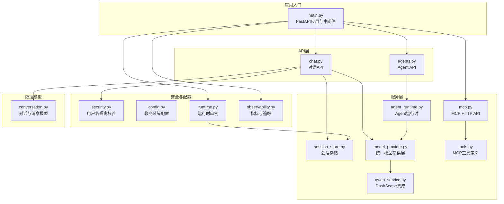
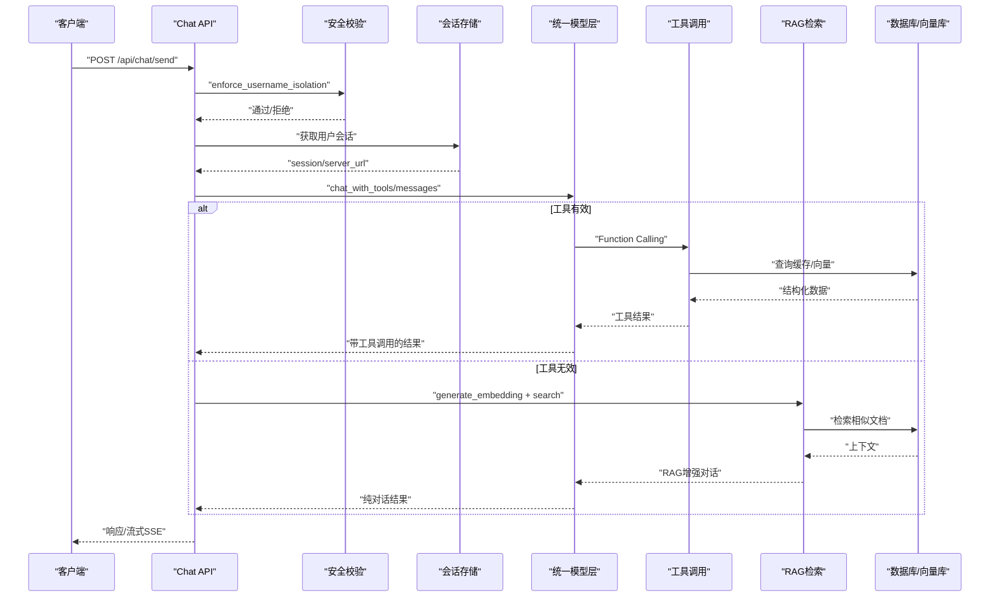
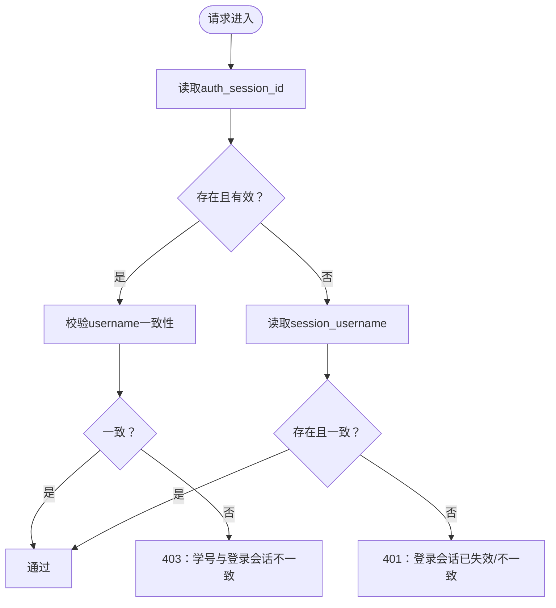
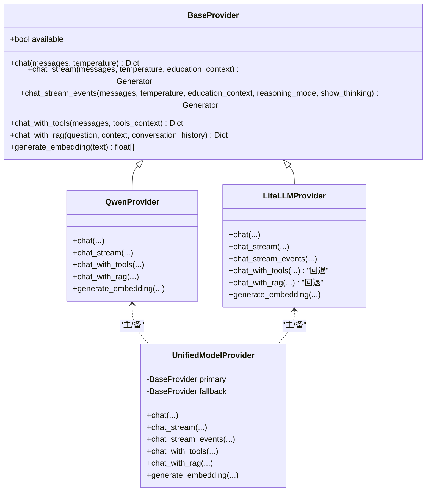
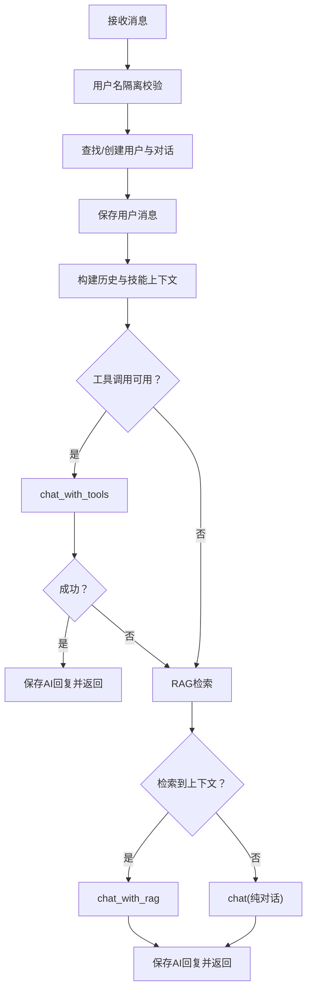
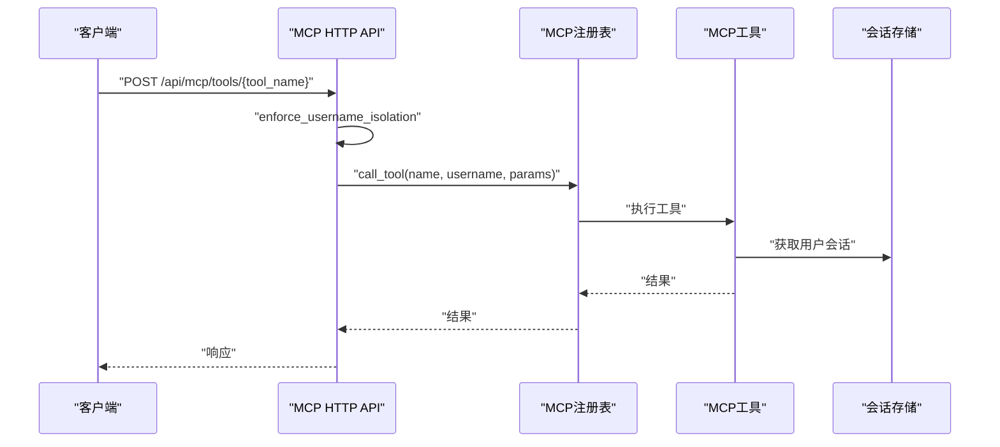
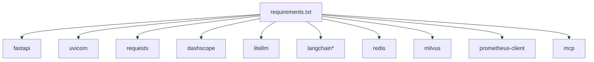

# AI响应约束系统

<cite>
**本文档引用的文件**
- [backend/main.py](file://backend/main.py)
- [backend/app/security.py](file://backend/app/security.py)
- [backend/app/core/config.py](file://backend/app/core/config.py)
- [backend/app/services/agent_runtime.py](file://backend/app/services/agent_runtime.py)
- [backend/app/api/chat.py](file://backend/app/api/chat.py)
- [backend/app/services/model_provider.py](file://backend/app/services/model_provider.py)
- [backend/app/services/session_store.py](file://backend/app/services/session_store.py)
- [backend/app/models/conversation.py](file://backend/app/models/conversation.py)
- [backend/app/core/runtime.py](file://backend/app/core/runtime.py)
- [backend/app/api/agents.py](file://backend/app/api/agents.py)
- [backend/app/services/qwen_service.py](file://backend/app/services/qwen_service.py)
- [backend/app/core/observability.py](file://backend/app/core/observability.py)
- [backend/app/api/mcp.py](file://backend/app/api/mcp.py)
- [backend/app/mcp/tools.py](file://backend/app/mcp/tools.py)
- [backend/requirements.txt](file://backend/requirements.txt)
</cite>

## 目录
1. [简介](#简介)
2. [项目结构](#项目结构)
3. [核心组件](#核心组件)
4. [架构总览](#架构总览)
5. [详细组件分析](#详细组件分析)
6. [依赖关系分析](#依赖关系分析)
7. [性能考虑](#性能考虑)
8. [故障排除指南](#故障排除指南)
9. [结论](#结论)

## 简介
本项目是一个面向教务系统的AI响应约束系统，旨在通过严格的会话隔离、工具调用与RAG结合的对话策略，以及可观测性指标，确保AI回答严格基于真实教务数据，避免虚构信息。系统提供REST API与流式SSE响应，支持多种模型提供方与Agent运行时框架，并通过MCP协议对外暴露教务查询工具。

## 项目结构
后端采用FastAPI框架，按功能模块划分：
- 应用入口与中间件：main.py负责路由注册、CORS配置、健康检查与Prometheus指标导出
- 安全与隔离：security.py提供用户名强制隔离校验
- 核心配置：core/config.py集中管理教务系统基础URL与服务器列表
- 服务层：
  - model_provider.py统一模型提供层，支持Qwen与LiteLLM
  - qwen_service.py集成DashScope千问模型，实现Function Calling与RAG
  - session_store.py提供会话持久化（Redis/内存）
  - agent_runtime.py支持OpenAI Agents与LangGraph运行时
  - mcp工具与注册：mcp/tools.py与mcp/registry
- API层：
  - chat.py提供对话接口（含流式SSE）
  - agents.py提供Agent运行时API
  - mcp.py提供MCP HTTP API
- 数据模型：models/conversation.py定义对话与消息表
- 运行时与可观测性：core/runtime.py与core/observability.py

**图表来源**
- [backend/main.py:1-170](file://backend/main.py#L1-L170)
- [backend/app/security.py:1-26](file://backend/app/security.py#L1-L26)
- [backend/app/core/config.py:1-27](file://backend/app/core/config.py#L1-L27)
- [backend/app/services/session_store.py:1-234](file://backend/app/services/session_store.py#L1-L234)
- [backend/app/services/model_provider.py:1-396](file://backend/app/services/model_provider.py#L1-L396)
- [backend/app/services/qwen_service.py:1-612](file://backend/app/services/qwen_service.py#L1-L612)
- [backend/app/services/agent_runtime.py:1-177](file://backend/app/services/agent_runtime.py#L1-L177)
- [backend/app/api/chat.py:1-816](file://backend/app/api/chat.py#L1-L816)
- [backend/app/api/agents.py:1-40](file://backend/app/api/agents.py#L1-L40)
- [backend/app/api/mcp.py:1-271](file://backend/app/api/mcp.py#L1-L271)
- [backend/app/mcp/tools.py:1-306](file://backend/app/mcp/tools.py#L1-L306)
- [backend/app/models/conversation.py:1-42](file://backend/app/models/conversation.py#L1-L42)
- [backend/app/core/runtime.py:1-28](file://backend/app/core/runtime.py#L1-L28)
- [backend/app/core/observability.py:1-90](file://backend/app/core/observability.py#L1-L90)

**章节来源**
- [backend/main.py:1-170](file://backend/main.py#L1-L170)
- [backend/requirements.txt:1-61](file://backend/requirements.txt#L1-L61)

## 核心组件
- 严格会话隔离：通过cookie与服务端会话双重校验，确保username一致性，防止越权访问
- 统一模型提供层：支持Qwen与LiteLLM，具备主备回退机制，保证可用性
- 工具调用与RAG组合：优先Function Calling，失败时回退至RAG，再回退至纯对话
- 流式SSE响应：支持工具调用阶段与模型流式阶段的双通道输出
- MCP工具链：通过HTTP API暴露教务查询工具，支持动态导入与热重载
- 可观测性：Prometheus指标、追踪ID、请求计数与时延统计

**章节来源**
- [backend/app/security.py:4-26](file://backend/app/security.py#L4-L26)
- [backend/app/services/model_provider.py:243-396](file://backend/app/services/model_provider.py#L243-L396)
- [backend/app/api/chat.py:190-480](file://backend/app/api/chat.py#L190-L480)
- [backend/app/api/mcp.py:41-271](file://backend/app/api/mcp.py#L41-L271)
- [backend/app/core/observability.py:30-90](file://backend/app/core/observability.py#L30-L90)

## 架构总览
系统采用分层架构，核心约束在于“AI回答必须严格基于真实数据”。整体流程如下：

**图表来源**
- [backend/app/api/chat.py:190-480](file://backend/app/api/chat.py#L190-L480)
- [backend/app/services/model_provider.py:341-358](file://backend/app/services/model_provider.py#L341-L358)
- [backend/app/services/qwen_service.py:252-387](file://backend/app/services/qwen_service.py#L252-L387)

## 详细组件分析

### 安全与会话隔离
- 强制会话隔离：优先使用服务端auth_session_id校验username一致性，兼容旧版cookie校验
- 会话存储：支持Redis持久化，不可用时回退内存存储；提供用户会话、验证码会话、同步状态、认证会话、模型偏好等键空间

**图表来源**
- [backend/app/security.py:4-26](file://backend/app/security.py#L4-L26)

**章节来源**
- [backend/app/security.py:4-26](file://backend/app/security.py#L4-L26)
- [backend/app/services/session_store.py:25-234](file://backend/app/services/session_store.py#L25-L234)

### 统一模型提供层
- 提供统一接口：chat、chat_stream、chat_stream_events、chat_with_tools、chat_with_rag、generate_embedding
- 主备回退：默认主Provider为Qwen，失败时自动回退到QwenProvider
- LiteLLM适配：支持chat/chat_stream，工具调用与RAG暂回退到Qwen

**图表来源**
- [backend/app/services/model_provider.py:20-396](file://backend/app/services/model_provider.py#L20-L396)

**章节来源**
- [backend/app/services/model_provider.py:243-396](file://backend/app/services/model_provider.py#L243-L396)

### 对话API与响应约束
- 优先级：工具调用(Function Calling) → RAG兜底 → 纯对话
- 结构化直答：针对身份与地点类问题，直接基于缓存数据生成限定范围内的回答
- 流式SSE：先回包，再在流内执行工具调用/模型调用，支持心跳与异常恢复
- 严格约束：系统提示词明确禁止虚构信息、校区推断、未验证信息补充

**图表来源**
- [backend/app/api/chat.py:190-480](file://backend/app/api/chat.py#L190-L480)
- [backend/app/services/qwen_service.py:167-204](file://backend/app/services/qwen_service.py#L167-L204)

**章节来源**
- [backend/app/api/chat.py:190-480](file://backend/app/api/chat.py#L190-L480)
- [backend/app/services/qwen_service.py:32-53](file://backend/app/services/qwen_service.py#L32-L53)

### MCP工具与HTTP API
- 工具定义：查询成绩、课表、学业进度、培养方案、考试安排、个人信息
- HTTP API：列出工具、调用工具、获取Schema、热重载、导入外部工具配置
- 安全约束：所有操作均执行用户名隔离校验

**图表来源**
- [backend/app/api/mcp.py:53-96](file://backend/app/api/mcp.py#L53-L96)
- [backend/app/mcp/tools.py:22-38](file://backend/app/mcp/tools.py#L22-L38)

**章节来源**
- [backend/app/api/mcp.py:41-271](file://backend/app/api/mcp.py#L41-L271)
- [backend/app/mcp/tools.py:40-306](file://backend/app/mcp/tools.py#L40-L306)

### Agent运行时
- 支持框架：OpenAI Agents SDK（推荐）、LangGraph（兼容）
- 降级策略：任一框架不可用或执行失败时，统一降级到模型层
- 单例管理：全局唯一实例，避免重复初始化

**章节来源**
- [backend/app/services/agent_runtime.py:21-177](file://backend/app/services/agent_runtime.py#L21-L177)
- [backend/app/api/agents.py:26-40](file://backend/app/api/agents.py#L26-L40)

## 依赖关系分析
- 外部依赖：FastAPI、Uvicorn、Requests、BeautifulSoup、DashScope、LiteLLM、LangChain/LangGraph、Redis、Milvus、Prometheus、MCP等
- 模块耦合：API层依赖安全、会话、模型提供层；模型提供层依赖Qwen服务；MCP工具依赖会话存储与爬虫

**图表来源**
- [backend/requirements.txt:1-61](file://backend/requirements.txt#L1-L61)

**章节来源**
- [backend/requirements.txt:1-61](file://backend/requirements.txt#L1-L61)

## 性能考虑
- 流式SSE：减少首字节延迟，支持心跳与断线恢复
- 主备回退：在模型层失败时快速回退，保障可用性
- 指标监控：HTTP请求总量与时延、流式请求与中断统计、任务队列状态
- 会话持久化：Redis可用时降低进程间共享成本，提升扩展性

## 故障排除指南
- 401/403：检查auth_session_id与session_username一致性，确认登录状态
- AI服务未配置：检查QWEN_API_KEY或MODEL_PROVIDER环境变量
- 工具调用失败：确认用户已登录教务系统，会话有效
- 流式中断：关注客户端断连指标，服务端会记录中断并保存消息
- MCP导入失败：检查JSON格式与工具字段完整性

**章节来源**
- [backend/app/security.py:4-26](file://backend/app/security.py#L4-L26)
- [backend/app/services/qwen_service.py:24-29](file://backend/app/services/qwen_service.py#L24-L29)
- [backend/app/core/observability.py:74-88](file://backend/app/core/observability.py#L74-L88)

## 结论
本AI响应约束系统通过严格的会话隔离、工具调用与RAG的组合策略、统一模型提供层的主备回退、以及完善的可观测性，实现了对教务数据的严格约束与高质量响应。MCP工具链进一步增强了系统的可扩展性与外部集成能力。建议在生产环境中启用Redis以提升会话持久化能力，并持续优化工具调用与RAG检索的准确性与性能。