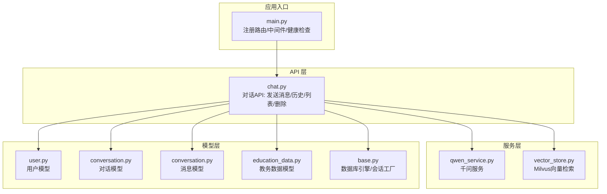
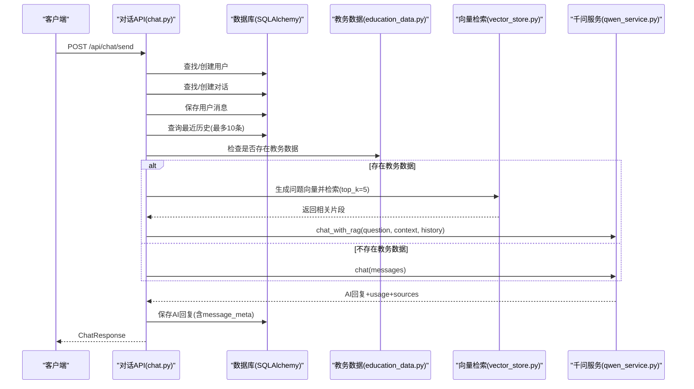
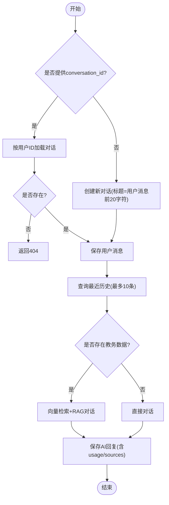
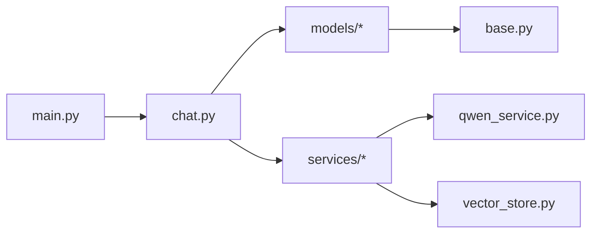

# 对话管理系统

<cite>
**本文档引用的文件**
- [backend/app/api/chat.py](file://backend/app/api/chat.py)
- [backend/app/models/conversation.py](file://backend/app/models/conversation.py)
- [backend/app/models/base.py](file://backend/app/models/base.py)
- [backend/app/models/user.py](file://backend/app/models/user.py)
- [backend/app/models/education_data.py](file://backend/app/models/education_data.py)
- [backend/app/services/vector_store.py](file://backend/app/services/vector_store.py)
- [backend/app/services/qwen_service.py](file://backend/app/services/qwen_service.py)
- [backend/main.py](file://backend/main.py)
- [backend/requirements.txt](file://backend/requirements.txt)
</cite>

## 目录
1. [简介](#简介)
2. [项目结构](#项目结构)
3. [核心组件](#核心组件)
4. [架构总览](#架构总览)
5. [详细组件分析](#详细组件分析)
6. [依赖关系分析](#依赖关系分析)
7. [性能考量](#性能考量)
8. [故障排查指南](#故障排查指南)
9. [结论](#结论)
10. [附录](#附录)

## 简介
本文件面向“智能教务系统AI助手”的对话管理系统，围绕对话生命周期管理（创建、状态维护、销毁）、消息存储结构（用户消息、AI回复、元数据）、历史检索与管理（分页、时间过滤、排序）、会话状态持久化（数据库设计、事务与并发控制）、扩展能力（标记、搜索索引、统计分析）进行系统化技术说明，并提供数据库Schema设计、API接口定义与最佳实践、性能优化建议。

## 项目结构
后端采用FastAPI + SQLAlchemy + Pydantic的典型三层架构：
- API层：定义对话相关REST接口，负责请求校验、业务编排与响应封装
- 服务层：集成千问大模型与向量检索服务，实现RAG增强对话
- 模型层：定义用户、对话、消息、教务数据等实体及其关系
- 应用入口：注册路由、中间件与健康检查



图表来源
- [backend/main.py:76-79](file://backend/main.py#L76-L79)
- [backend/app/api/chat.py:15](file://backend/app/api/chat.py#L15)
- [backend/app/services/qwen_service.py:15](file://backend/app/services/qwen_service.py#L15)
- [backend/app/services/vector_store.py:14](file://backend/app/services/vector_store.py#L14)
- [backend/app/models/base.py:10](file://backend/app/models/base.py#L10)
- [backend/app/models/user.py:11](file://backend/app/models/user.py#L11)
- [backend/app/models/conversation.py:11](file://backend/app/models/conversation.py#L11)
- [backend/app/models/education_data.py:11](file://backend/app/models/education_data.py#L11)

章节来源
- [backend/main.py:76-79](file://backend/main.py#L76-L79)
- [backend/app/api/chat.py:15](file://backend/app/api/chat.py#L15)
- [backend/app/models/base.py:10](file://backend/app/models/base.py#L10)

## 核心组件
- 对话API：提供发送消息、获取对话列表、获取历史、删除对话等接口
- 对话模型：包含对话元数据、创建/更新时间、与用户和消息的关系
- 消息模型：记录角色、内容、消息元数据（如token用量、来源）与对话关系
- 用户模型：用户基本信息与状态，关联对话与教务数据
- 教务数据模型：聚合存储个人、成绩、课表、培养方案、学业进度、考试安排、执行计划、选课信息等JSON结构
- 向量检索服务：基于Milvus的集合创建、文档插入、相似度检索、用户数据清理
- 千问服务：系统提示词、普通对话、RAG增强对话、文本向量生成（可替换）

章节来源
- [backend/app/api/chat.py:45-224](file://backend/app/api/chat.py#L45-L224)
- [backend/app/models/conversation.py:11-42](file://backend/app/models/conversation.py#L11-L42)
- [backend/app/models/user.py:11-33](file://backend/app/models/user.py#L11-L33)
- [backend/app/models/education_data.py:11-103](file://backend/app/models/education_data.py#L11-L103)
- [backend/app/services/vector_store.py:14-164](file://backend/app/services/vector_store.py#L14-L164)
- [backend/app/services/qwen_service.py:15-178](file://backend/app/services/qwen_service.py#L15-L178)

## 架构总览
对话管理的关键流程：客户端发起发送消息请求，后端查找或创建用户与对话，保存用户消息，按需检索RAG上下文，调用千问生成回复，保存AI回复并返回结果；同时提供历史查询与对话列表查询、删除接口。



图表来源
- [backend/app/api/chat.py:45-154](file://backend/app/api/chat.py#L45-L154)
- [backend/app/services/vector_store.py:100-142](file://backend/app/services/vector_store.py#L100-L142)
- [backend/app/services/qwen_service.py:91-142](file://backend/app/services/qwen_service.py#L91-L142)

## 详细组件分析

### 对话生命周期管理
- 创建：若未传入conversation_id，则以用户消息前20字符作为标题创建新对话
- 维护：每次发送消息都会更新对话的updated_at；历史查询按created_at升序返回
- 销毁：删除对话时级联删除其消息



图表来源
- [backend/app/api/chat.py:63-147](file://backend/app/api/chat.py#L63-L147)

章节来源
- [backend/app/api/chat.py:63-147](file://backend/app/api/chat.py#L63-L147)

### 消息存储结构与元数据
- 用户消息：role为"user"，content为用户输入文本
- AI回复：role为"assistant"，content为AI输出文本，message_meta包含usage与sources
- 元数据字段设计：
  - conversation_meta：对话级元数据（如标签、分类、统计信息）
  - message_meta：消息级元数据（如token用量、耗时、引用来源）
- 时间戳：created_at由服务器默认设置，updated_at在更新时自动更新

章节来源
- [backend/app/models/conversation.py:18-21](file://backend/app/models/conversation.py#L18-L21)
- [backend/app/models/conversation.py:36-38](file://backend/app/models/conversation.py#L36-L38)
- [backend/app/api/chat.py:128-139](file://backend/app/api/chat.py#L128-L139)

### 对话历史检索与管理
- 获取对话列表：按updated_at降序返回对话ID、标题、创建时间
- 获取历史：按created_at升序返回消息列表，包含消息ID、角色、内容、时间、元数据
- 分页与过滤：当前实现未提供分页参数，建议在历史查询接口增加offset/limit与时间范围过滤参数
- 排序策略：对话列表按更新时间倒序；历史按创建时间正序

章节来源
- [backend/app/api/chat.py:156-178](file://backend/app/api/chat.py#L156-L178)
- [backend/app/api/chat.py:181-204](file://backend/app/api/chat.py#L181-L204)

### 会话状态持久化与并发控制
- 数据库设计：PostgreSQL连接字符串通过环境变量配置；SQLAlchemy声明式基类统一管理
- 事务处理：每个API操作使用独立数据库会话，提交后关闭；异常时捕获并返回HTTP错误
- 并发控制：当前未显式加锁；建议对高并发场景引入乐观锁（如版本号）或分布式锁（Redis）保护关键写操作
- 级联删除：对话与消息采用级联删除，避免孤儿数据

章节来源
- [backend/app/models/base.py:10-29](file://backend/app/models/base.py#L10-L29)
- [backend/app/api/chat.py:54-153](file://backend/app/api/chat.py#L54-L153)

### 扩展功能：标记、搜索索引与统计分析
- 对话标记：可在conversation_meta中扩展标签字段，用于后续筛选与统计
- 搜索索引：当前未实现全文检索；建议在消息内容上建立GIN索引或使用Elasticsearch/PG全文检索
- 统计分析：可在message_meta中记录token用量、耗时、来源，结合conversation_meta进行统计

章节来源
- [backend/app/models/conversation.py:18-19](file://backend/app/models/conversation.py#L18-L19)
- [backend/app/models/conversation.py:36-38](file://backend/app/models/conversation.py#L36-L38)

### 数据库Schema设计
- users：用户基本信息与状态
- conversations：对话与用户关联、标题、元数据、时间戳
- messages：消息与对话关联、角色、内容、消息元数据、时间戳
- education_data：用户唯一关联的教务数据聚合（JSON字段）
- grades/courses：可选明细表，便于更细粒度查询与统计

```mermaid
erDiagram
USERS {
int id PK
string username UK
string name
string department
string major
string class_name
boolean is_active
timestamptz last_login
timestamptz created_at
timestamptz updated_at
}
CONVERSATIONS {
int id PK
int user_id FK
string title
jsonb conversation_meta
timestamptz created_at
timestamptz updated_at
}
MESSAGES {
int id PK
int conversation_id FK
string role
text content
jsonb message_meta
timestamptz created_at
}
EDUCATION_DATA {
int id PK
int user_id FK UK
jsonb personal_info
jsonb grades
jsonb grade_stats
jsonb schedule
jsonb training_plan
jsonb academic_progress
jsonb exam_schedule
jsonb execution_plan
jsonb course_selection
timestamptz last_updated
}
GRADES {
int id PK
int user_id FK
string semester
string course_code
string course_name
string course_nature
float credit
string usual_score
string exam_score
string final_score
float gpa
string is_passed
timestamptz created_at
timestamptz updated_at
}
COURSES {
int id PK
int user_id FK
string semester
string course_code
string course_name
float credit
string weekday
string period
string weeks
string classroom
string teacher
timestamptz created_at
timestamptz updated_at
}
USERS ||--o{ CONVERSATIONS : "拥有"
CONVERSATIONS ||--o{ MESSAGES : "包含"
USERS ||--o{ EDUCATION_DATA : "拥有"
USERS ||--o{ GRADES : "拥有"
USERS ||--o{ COURSES : "拥有"
```

图表来源
- [backend/app/models/user.py:11-33](file://backend/app/models/user.py#L11-L33)
- [backend/app/models/conversation.py:11-42](file://backend/app/models/conversation.py#L11-L42)
- [backend/app/models/education_data.py:11-103](file://backend/app/models/education_data.py#L11-L103)

## 依赖关系分析
- 外部依赖：FastAPI、SQLAlchemy、DashScope、PyMilvus、LangChain、OpenAI等
- 内部依赖：API依赖模型层与服务层；服务层依赖外部SDK与环境变量



图表来源
- [backend/app/api/chat.py:11](file://backend/app/api/chat.py#L11)
- [backend/app/services/qwen_service.py:15](file://backend/app/services/qwen_service.py#L15)
- [backend/app/services/vector_store.py:14](file://backend/app/services/vector_store.py#L14)
- [backend/app/models/base.py:10](file://backend/app/models/base.py#L10)
- [backend/main.py:76-79](file://backend/main.py#L76-L79)

章节来源
- [backend/requirements.txt:1-44](file://backend/requirements.txt#L1-L44)
- [backend/app/api/chat.py:11](file://backend/app/api/chat.py#L11)

## 性能考量
- 数据库层面
  - 为users.username、conversations.user_id、messages.conversation_id建立索引
  - 对messages.created_at建立索引以加速历史查询
  - 对education_data.user_id建立唯一索引
- 检索与RAG
  - 向量检索top_k可根据业务需求调整；Milvus索引参数可按数据规模优化
  - 生成embedding可考虑缓存或批量处理
- API层面
  - 历史查询建议增加分页参数（offset/limit）与时间范围过滤
  - 对高频接口增加限流与缓存（如对话列表）
- 并发与一致性
  - 引入乐观锁或分布式锁保护关键写操作
  - 对批量插入使用事务批处理减少往返

[本节为通用指导，不直接分析具体文件]

## 故障排查指南
- 数据库连接失败
  - 检查DATABASE_URL环境变量与PostgreSQL可达性
- 向量检索失败
  - 检查Milvus连接参数与集合是否存在；确认embedding维度一致
- AI服务错误
  - 检查QWEN_API_KEY与模型配置；查看日志中的usage与错误信息
- 对话不存在
  - 确认conversation_id与用户ID匹配；检查删除后的状态

章节来源
- [backend/app/models/base.py:10-14](file://backend/app/models/base.py#L10-L14)
- [backend/app/services/vector_store.py:24-36](file://backend/app/services/vector_store.py#L24-L36)
- [backend/app/services/qwen_service.py:18-22](file://backend/app/services/qwen_service.py#L18-L22)
- [backend/app/api/chat.py:69-70](file://backend/app/api/chat.py#L69-L70)

## 结论
该对话管理系统以清晰的分层架构实现了完整的对话生命周期管理与RAG增强问答能力。通过JSON元数据与关系模型的结合，既保证了灵活性又维持了良好的可扩展性。建议在后续迭代中完善分页与过滤、引入全文检索与缓存、加强并发控制与索引优化，以满足更高性能与可靠性要求。

[本节为总结性内容，不直接分析具体文件]

## 附录

### API接口说明
- 发送消息
  - 方法：POST
  - 路径：/api/chat/send
  - 请求体：username, message, conversation_id(可选)
  - 响应：success, message, conversation_id, sources, usage
- 获取对话列表
  - 方法：GET
  - 路径：/api/chat/conversations/{username}
  - 响应：id, title, created_at
- 获取历史
  - 方法：GET
  - 路径：/api/chat/history/{conversation_id}
  - 响应：success, messages[{id, role, content, created_at, meta}]
- 删除对话
  - 方法：DELETE
  - 路径：/api/chat/conversations/{conversation_id}
  - 响应：success, message

章节来源
- [backend/app/api/chat.py:45-224](file://backend/app/api/chat.py#L45-L224)

### 最佳实践与建议
- 对话管理
  - 在conversation_meta中加入标签字段，便于后续筛选与统计
  - 历史查询增加分页与时间过滤参数
- 消息存储
  - message_meta中记录usage与sources，便于成本与溯源追踪
  - 对content字段建立全文索引或使用向量检索
- RAG与向量检索
  - 优化Milvus索引参数与nprobe；定期清理无效数据
  - embedding生成可接入专用服务并缓存
- 并发与一致性
  - 对关键写操作引入乐观锁或分布式锁
  - 使用事务批处理提升吞吐

[本节为通用指导，不直接分析具体文件]