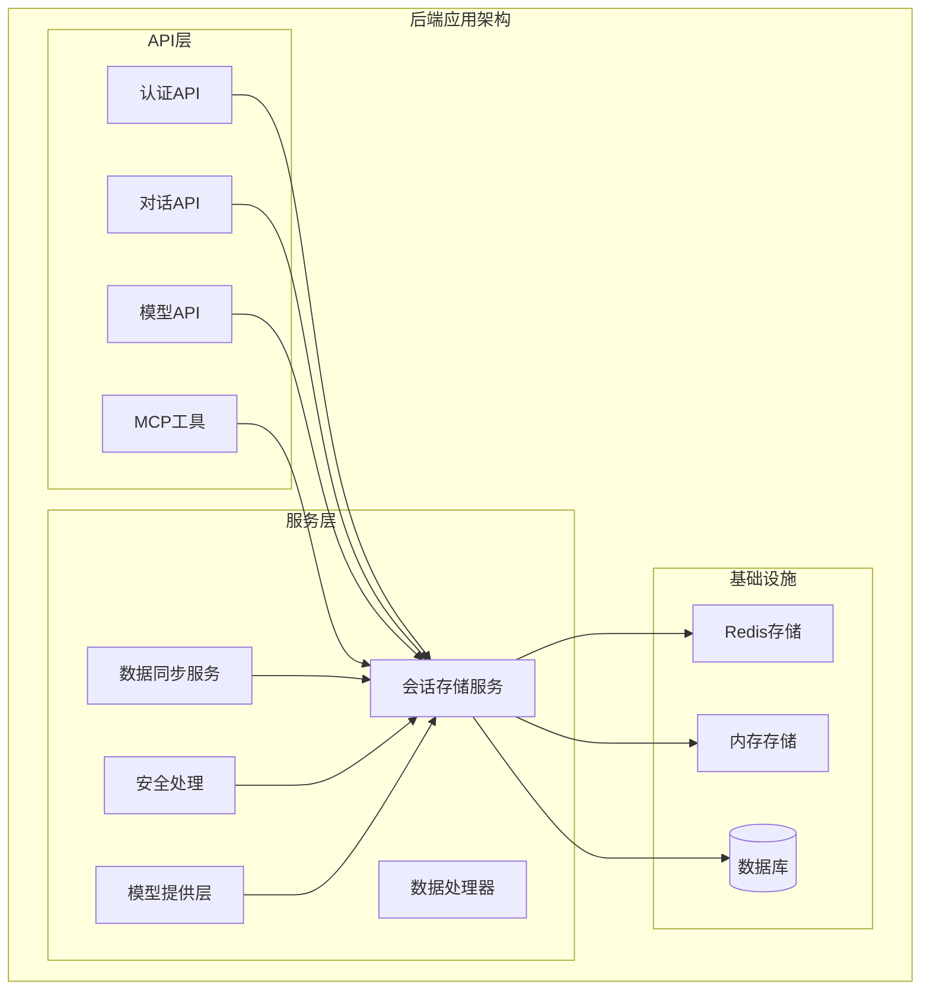
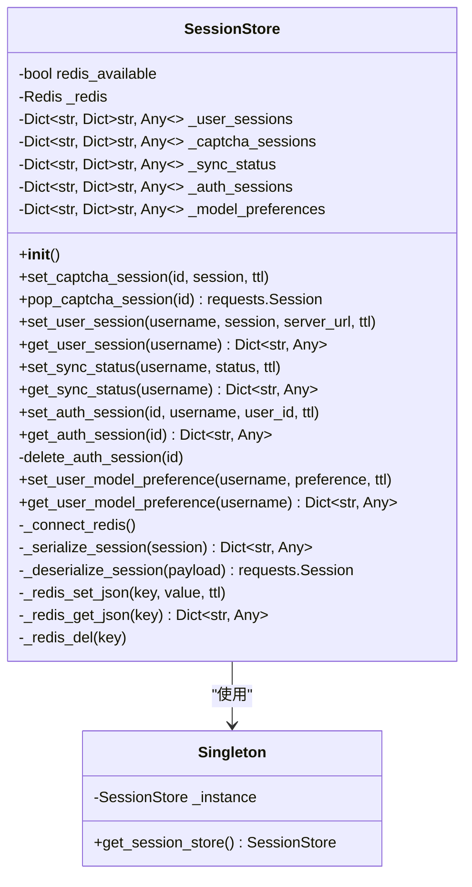
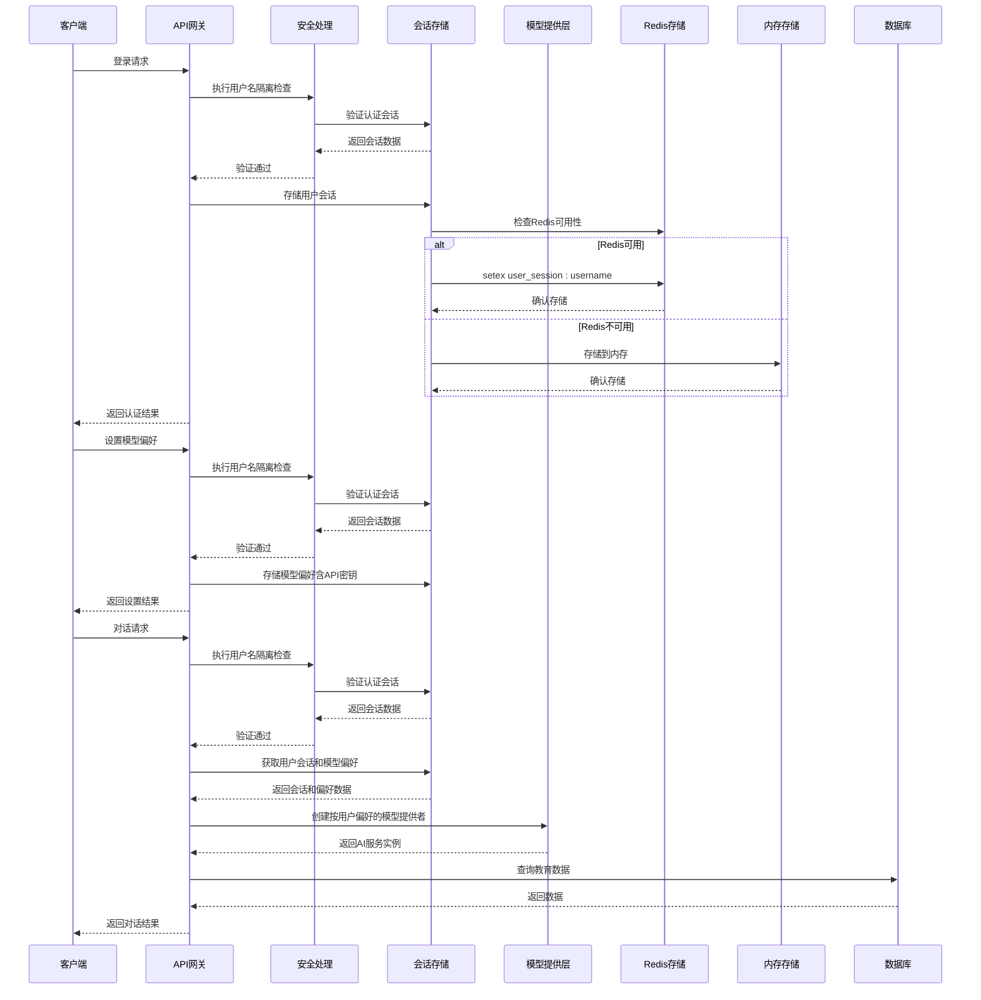
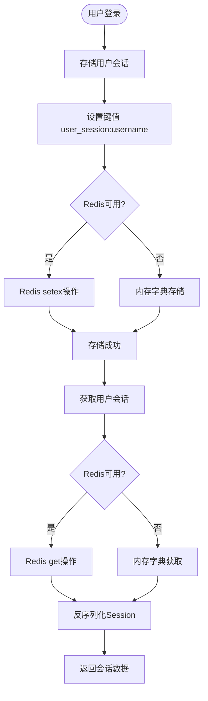
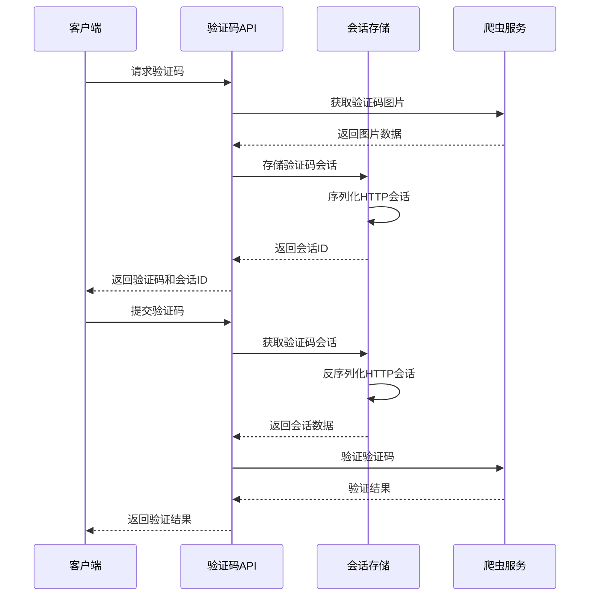
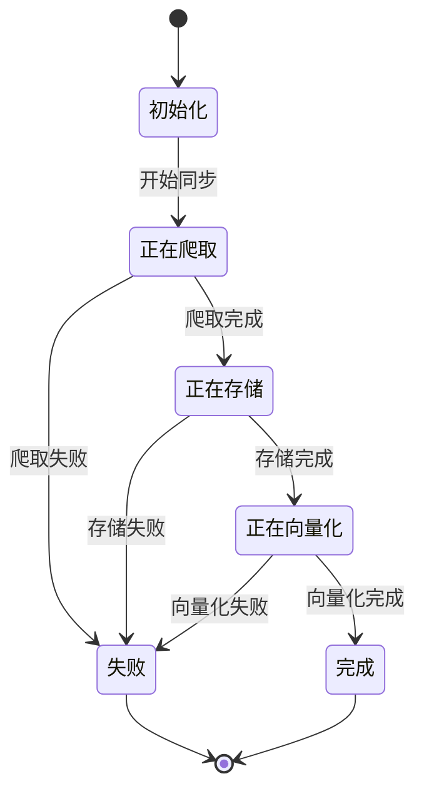
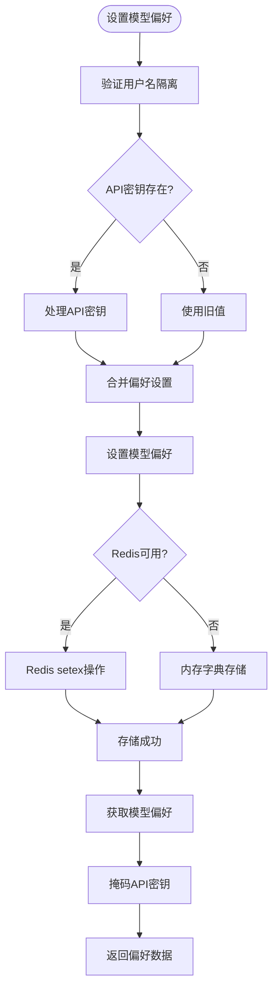
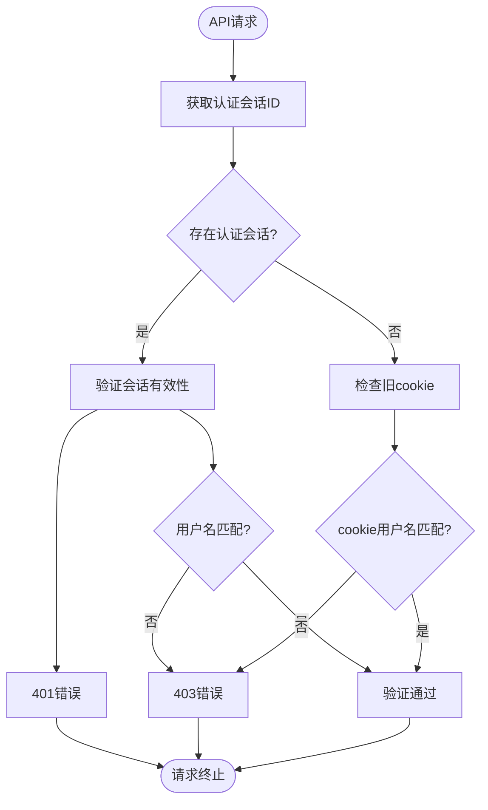
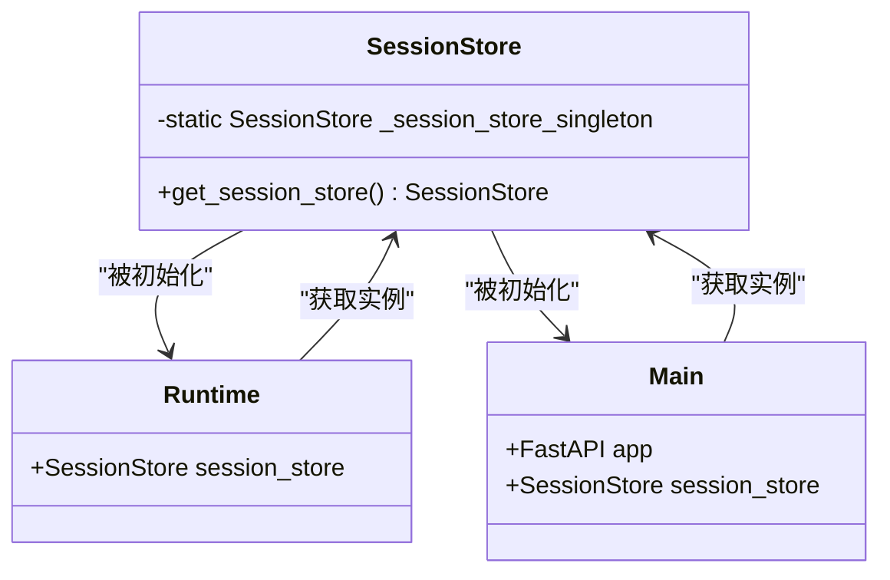
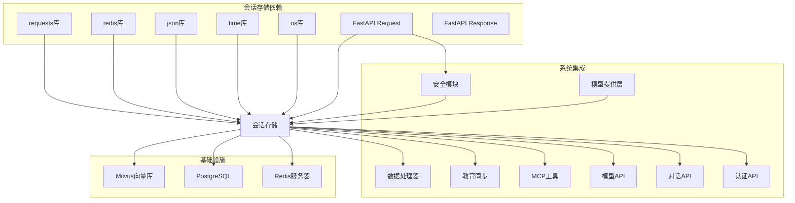

# 会话存储

<cite>
**本文档引用的文件**
- [session_store.py](file://backend/app/services/session_store.py)
- [test_session_store_singleton.py](file://backend/tests/test_session_store_singleton.py)
- [runtime.py](file://backend/app/core/runtime.py)
- [main.py](file://backend/main.py)
- [auth_sync.py](file://backend/app/api/auth_sync.py)
- [chat.py](file://backend/app/api/chat.py)
- [models.py](file://backend/app/api/models.py)
- [tools.py](file://backend/app/mcp/tools.py)
- [education_sync.py](file://backend/app/services/education_sync.py)
- [data_processor.py](file://backend/app/services/data_processor.py)
- [security.py](file://backend/app/security.py)
- [model_provider.py](file://backend/app/services/model_provider.py)
- [__init__.py](file://backend/app/services/__init__.py)
</cite>

## 更新摘要
**所做更改**
- 新增API键管理功能，支持用户API密钥的安全存储和处理
- 扩展偏好持久化机制，增加模型偏好配置的完整管理
- 强化安全处理机制，引入用户名隔离和会话验证
- 更新模型提供层，支持按用户偏好动态配置AI服务

## 目录
1. [简介](#简介)
2. [项目结构](#项目结构)
3. [核心组件](#核心组件)
4. [架构概览](#架构概览)
5. [详细组件分析](#详细组件分析)
6. [依赖关系分析](#依赖关系分析)
7. [性能考虑](#性能考虑)
8. [故障排除指南](#故障排除指南)
9. [结论](#结论)

## 简介

会话存储（Session Store）是本项目中的关键基础设施组件，负责管理用户认证会话、验证码会话、同步状态和模型偏好设置。该组件提供了Redis持久化存储和内存回退机制，确保在不同部署环境下的可靠性和灵活性。

会话存储服务采用单例模式设计，通过统一的接口管理多种类型的会话数据，包括：
- 用户会话：存储登录用户的认证信息和服务器URL
- 验证码会话：临时存储验证码相关的HTTP会话
- 同步状态：跟踪数据同步进度和状态
- 认证会话：管理服务端认证状态
- 模型偏好：存储用户的AI模型选择偏好，包括API密钥管理

**更新** 新增了API键管理功能，支持用户API密钥的安全存储和处理，以及强化的安全处理机制，确保用户数据的隔离和安全。

## 项目结构

会话存储服务位于后端应用的服务层，与API路由、认证系统和数据处理流程紧密集成：

**图表来源**
- [session_store.py:1-234](file://backend/app/services/session_store.py#L1-L234)
- [auth_sync.py:1-267](file://backend/app/api/auth_sync.py#L1-L267)
- [chat.py:1-662](file://backend/app/api/chat.py#L1-L662)
- [security.py:1-26](file://backend/app/security.py#L1-L26)

**章节来源**
- [session_store.py:1-234](file://backend/app/services/session_store.py#L1-L234)
- [runtime.py:1-28](file://backend/app/core/runtime.py#L1-L28)

## 核心组件

会话存储服务的核心组件包括：

### 主要类结构

**图表来源**
- [session_store.py:25-234](file://backend/app/services/session_store.py#L25-L234)

### 关键特性

1. **双存储后端**：同时支持Redis和内存存储，提供高可用性
2. **序列化机制**：将requests.Session对象序列化为可持久化的字典格式
3. **TTL管理**：为不同类型的数据设置合适的过期时间
4. **类型安全**：针对不同用途的数据提供专门的存储方法
5. **API键管理**：新增的API密钥安全存储和处理机制
6. **安全隔离**：集成用户名隔离和会话验证机制

**章节来源**
- [session_store.py:25-234](file://backend/app/services/session_store.py#L25-L234)

## 架构概览

会话存储在整个系统架构中扮演着中介者的角色，连接各个API组件和数据存储层：

**图表来源**
- [auth_sync.py:70-208](file://backend/app/api/auth_sync.py#L70-L208)
- [chat.py:95-264](file://backend/app/api/chat.py#L95-L264)
- [models.py:59-114](file://backend/app/api/models.py#L59-L114)
- [security.py:4-26](file://backend/app/security.py#L4-L26)
- [session_store.py:94-220](file://backend/app/services/session_store.py#L94-L220)

## 详细组件分析

### 会话存储类详解

会话存储类实现了完整的会话管理功能，包括多种会话类型的存储和检索：

#### 用户会话管理

用户会话是最重要的会话类型，存储了用户的认证信息和服务器连接状态：

**图表来源**
- [session_store.py:124-158](file://backend/app/services/session_store.py#L124-L158)
- [auth_sync.py:136-137](file://backend/app/api/auth_sync.py#L136-L137)

#### 验证码会话处理

验证码会话具有较短的生命周期，主要用于一次性验证码验证：

**图表来源**
- [auth_sync.py:30-68](file://backend/app/api/auth_sync.py#L30-L68)
- [session_store.py:94-116](file://backend/app/services/session_store.py#L94-L116)

#### 同步状态管理

同步状态用于跟踪数据同步的进度和状态：

**图表来源**
- [education_sync.py:17-58](file://backend/app/services/education_sync.py#L17-L58)
- [session_store.py:160-170](file://backend/app/services/session_store.py#L160-L170)

#### 模型偏好管理

**新增** 模型偏好管理功能，支持用户API密钥的安全存储和处理：

**图表来源**
- [session_store.py:195-220](file://backend/app/services/session_store.py#L195-L220)
- [models.py:89-114](file://backend/app/api/models.py#L89-L114)

### 安全处理机制

**新增** 安全处理机制，确保用户数据的严格隔离：

**图表来源**
- [security.py:4-26](file://backend/app/security.py#L4-L26)
- [chat.py:105-106](file://backend/app/api/chat.py#L105-L106)
- [models.py:91](file://backend/app/api/models.py#L91)

### 单例模式实现

会话存储采用全局单例模式，确保整个应用只有一个会话存储实例：

**图表来源**
- [session_store.py:222-234](file://backend/app/services/session_store.py#L222-L234)
- [runtime.py:12](file://backend/app/core/runtime.py#L12)
- [main.py:19](file://backend/main.py#L19)

**章节来源**
- [session_store.py:222-234](file://backend/app/services/session_store.py#L222-L234)
- [test_session_store_singleton.py:1-30](file://backend/tests/test_session_store_singleton.py#L1-L30)

## 依赖关系分析

会话存储服务与系统的其他组件存在密切的依赖关系：

**图表来源**
- [session_store.py:6-19](file://backend/app/services/session_store.py#L6-L19)
- [auth_sync.py:14-17](file://backend/app/api/auth_sync.py#L14-L17)
- [chat.py:16](file://backend/app/api/chat.py#L16)
- [models.py:11](file://backend/app/api/models.py#L11)
- [security.py:1](file://backend/app/security.py#L1)
- [model_provider.py:384-396](file://backend/app/services/model_provider.py#L384-L396)

### 组件耦合度分析

会话存储服务与其他组件的耦合关系如下：

1. **低耦合设计**：通过统一的接口与各API组件交互
2. **单向依赖**：其他组件依赖会话存储，反之不依赖
3. **抽象接口**：提供清晰的抽象层，便于替换底层存储
4. **安全集成**：与安全模块深度集成，确保数据隔离
5. **动态配置**：与模型提供层集成，支持按用户偏好动态配置

**章节来源**
- [auth_sync.py:14-17](file://backend/app/api/auth_sync.py#L14-L17)
- [chat.py:16](file://backend/app/api/chat.py#L16)
- [models.py:11](file://backend/app/api/models.py#L11)
- [security.py:1](file://backend/app/security.py#L1)
- [model_provider.py:384-396](file://backend/app/services/model_provider.py#L384-L396)

## 性能考虑

会话存储服务在设计时充分考虑了性能优化：

### 存储策略优化

1. **Redis优先策略**：当Redis可用时，所有操作都通过Redis进行，提供更好的性能和持久性
2. **内存回退机制**：Redis不可用时自动切换到内存存储，确保系统正常运行
3. **TTL智能管理**：不同类型的会话设置不同的过期时间，平衡内存使用和功能需求
4. **API键安全处理**：API密钥存储时进行适当的处理，避免敏感信息泄露

### 序列化性能

会话对象的序列化采用高效的字典格式，包含：
- Cookie信息的完整保存
- 请求头的精确复制
- 最小化的序列化开销

### 并发安全性

会话存储服务在多线程环境下保证数据一致性：
- 使用Python字典作为内存存储，内部已考虑线程安全
- Redis操作通过原子性命令保证数据一致性
- 错误处理机制防止并发访问导致的数据损坏
- **新增** API键的原子性处理，确保敏感数据的安全

## 故障排除指南

### 常见问题诊断

#### Redis连接问题

**症状**：系统警告Redis不可用，使用内存存储

**解决方案**：
1. 检查Redis服务器状态
2. 验证网络连接
3. 确认Redis配置参数
4. 检查防火墙设置

#### 会话数据丢失

**症状**：用户需要重新登录或数据同步状态异常

**排查步骤**：
1. 检查Redis服务可用性
2. 验证TTL设置是否合理
3. 确认会话键名格式正确
4. 检查内存存储容量限制

#### 序列化错误

**症状**：会话数据无法正确恢复

**解决方法**：
1. 检查序列化格式兼容性
2. 验证Cookie和Header数据完整性
3. 确认requests.Session对象状态正常

#### API键安全问题

**新增** **症状**：API密钥泄露或处理不当

**排查步骤**：
1. 检查API密钥存储格式
2. 验证API密钥掩码机制
3. 确认API密钥的原子性处理
4. 检查API密钥的TTL设置

#### 安全隔离失效

**新增** **症状**：用户可以访问其他用户的资源

**排查步骤**：
1. 检查认证会话ID的有效性
2. 验证用户名隔离检查逻辑
3. 确认会话存储的用户名匹配
4. 检查旧cookie兼容性处理

### 监控和调试

会话存储服务提供了完善的日志记录：
- Redis连接状态监控
- 存储操作成功/失败记录
- 内存使用情况跟踪
- 错误异常详细日志
- **新增** API键安全处理日志
- **新增** 用户名隔离验证日志

**章节来源**
- [session_store.py:39-53](file://backend/app/services/session_store.py#L39-L53)
- [session_store.py:20-22](file://backend/app/services/session_store.py#L20-L22)

## 结论

会话存储服务是本项目架构中的关键基础设施，通过其灵活的设计和可靠的实现，为整个系统提供了稳定的数据会话管理能力。经过更新后，主要特点包括：

1. **高可用性设计**：Redis优先+内存回退的双重存储策略
2. **类型化管理**：针对不同用途的数据提供专门的存储方案
3. **单例模式**：确保全局一致的会话状态管理
4. **性能优化**：合理的TTL设置和高效的序列化机制
5. **易于维护**：清晰的接口设计和完善的错误处理
6. **API键安全管理**：新增的API密钥安全存储和处理机制
7. **用户名隔离**：强化的安全处理机制，确保用户数据隔离
8. **动态配置支持**：与模型提供层集成，支持按用户偏好动态配置

**更新** 该组件的成功实现为后续的功能扩展奠定了坚实的基础，特别是在用户认证、数据同步、AI对话和API密钥管理等核心功能中发挥着重要作用。通过持续的监控和优化，会话存储服务将继续为系统的稳定运行提供保障。

该更新特别增强了系统的安全性，通过用户名隔离机制和API键安全处理，有效防止了跨用户数据访问和敏感信息泄露的风险。同时，新增的模型偏好管理功能为用户提供了更加个性化的AI服务体验。