# AI聊天界面与对话交互

<cite>
**本文档引用的文件**
- [frontend/src/app/chat/page.tsx](file://frontend/src/app/chat/page.tsx)
- [frontend/src/components/MarkdownMessage.tsx](file://frontend/src/components/MarkdownMessage.tsx)
- [backend/app/api/chat.py](file://backend/app/api/chat.py)
- [backend/app/api/workspace.py](file://backend/app/api/workspace.py)
- [backend/app/api/workspace_pref.py](file://backend/app/api/workspace_pref.py)
- [backend/app/services/workspace_knowledge.py](file://backend/app/services/workspace_knowledge.py)
- [backend/app/services/session_store.py](file://backend/app/services/session_store.py)
- [backend/app/services/qwen_service.py](file://backend/app/services/qwen_service.py)
- [backend/app/models/conversation.py](file://backend/app/models/conversation.py)
- [backend/app/services/vector_store.py](file://backend/app/services/vector_store.py)
- [backend/main.py](file://backend/main.py)
- [src/components/ui/button.tsx](file://src/components/ui/button.tsx)
- [src/components/ui/input.tsx](file://src/components/ui/input.tsx)
- [src/components/ui/textarea.tsx](file://src/components/ui/textarea.tsx)
- [src/components/ui/select.tsx](file://src/components/ui/select.tsx)
- [frontend/src/app/globals.css](file://frontend/src/app/globals.css)
- [frontend/src/app/layout.tsx](file://frontend/src/app/layout.tsx)
- [frontend/src/app/settings/models/page.tsx](file://frontend/src/app/settings/models/page.tsx)
- [frontend/src/app/workspace/page.tsx](file://frontend/src/app/workspace/page.tsx)
- [package.json](file://package.json)
- [backend/requirements.txt](file://backend/requirements.txt)
- [src/components/ui/sidebar.tsx](file://src/components/ui/sidebar.tsx)
- [frontend/next.config.ts](file://frontend/next.config.ts)
- [deploy/nginx/prod.conf](file://deploy/nginx/prod.conf)
- [frontend/nginx.conf](file://frontend/nginx.conf)
</cite>

## 更新摘要
**变更内容**
- 新增工作区选择控制功能，支持多工作区知识库管理
- 集成偏好设置系统，实现工作区偏好持久化
- 实现工作区感知的上下文构建功能
- 扩展聊天API以支持工作区上下文检索
- 增强前端工作区选择UI组件
- 完善后端工作区知识服务

## 目录
1. [简介](#简介)
2. [项目结构](#项目结构)
3. [核心组件](#核心组件)
4. [架构概览](#架构概览)
5. [详细组件分析](#详细组件分析)
6. [工作区管理系统](#工作区管理系统)
7. [偏好设置集成](#偏好设置集成)
8. [工作区感知上下文构建](#工作区感知上下文构建)
9. [AI流式输出功能](#ai流式输出功能)
10. [线程桥接机制](#线程桥接机制)
11. [SSE实时传输](#sse实时传输)
12. [消息渲染优化](#消息渲染优化)
13. [工具调用流式处理](#工具调用流式处理)
14. [用户名传递机制](#用户名传递机制)
15. [侧边栏样式修复](#侧边栏样式修复)
16. [会话管理增强](#会话管理增强)
17. [UI优化更新](#ui优化更新)
18. [composer区域重大UI/UX改进](#composer区域重大uiux改进)
19. [ping处理逻辑优化](#ping处理逻辑优化)
20. [下拉框组件现代化设计](#下拉框组件现代化设计)
21. [流式API基础URL动态计算](#流式api基础url动态计算)
22. [开发环境流式传输支持](#开发环境流式传输支持)
23. [SSE响应头设置增强](#sse响应头设置增强)
24. [依赖关系分析](#依赖关系分析)
25. [性能考虑](#性能考虑)
26. [故障排除指南](#故障排除指南)
27. [结论](#结论)

## 简介

智能教务系统AI助手是一个基于Next.js和FastAPI构建的现代化校园AI助手应用。该系统提供了完整的AI聊天界面，支持实时对话、对话历史管理和RAG（检索增强生成）功能。系统采用前后端分离架构，前端使用React和TypeScript，后端使用Python和FastAPI，实现了从用户认证到AI对话的完整业务流程。

**更新** 系统现已完成了重大用户体验增强，特别是在流式响应处理方面实现了ping处理逻辑优化，在初始响应阶段提供更好的视觉反馈，同时增强了UI组件的样式设计，包括提供者选择下拉框和模型选择下拉框的现代化外观。此外，系统还增强了SSE响应头设置，添加了no-transform指令和Content-Encoding: identity，以及优化了开发环境的SSE配置。

**新增** 系统现已集成了工作区管理系统，支持多工作区知识库管理、偏好设置集成和工作区感知的上下文构建功能。用户可以创建和管理多个工作区，每个工作区包含独立的知识文档、技能关系和MCP工具配置，并且AI助手会根据用户选择的工作区智能构建对话上下文。

## 项目结构

该项目采用清晰的分层架构，主要分为前端和后端两个部分：

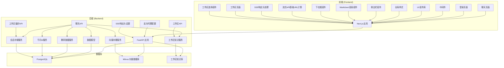

**图表来源**
- [frontend/src/app/chat/page.tsx:1-1081](file://frontend/src/app/chat/page.tsx#L1-L1081)
- [backend/app/api/chat.py:1-852](file://backend/app/api/chat.py#L1-L852)
- [backend/app/api/workspace.py:1-190](file://backend/app/api/workspace.py#L1-L190)
- [backend/app/api/workspace_pref.py:1-42](file://backend/app/api/workspace_pref.py#L1-L42)

**章节来源**
- [frontend/src/app/chat/page.tsx:1-1081](file://frontend/src/app/chat/page.tsx#L1-L1081)
- [backend/app/api/chat.py:1-852](file://backend/app/api/chat.py#L1-L852)
- [backend/app/api/workspace.py:1-190](file://backend/app/api/workspace.py#L1-L190)
- [backend/app/api/workspace_pref.py:1-42](file://backend/app/api/workspace_pref.py#L1-L42)

## 核心组件

### 聊天界面组件

聊天界面是整个系统的核心组件，采用了现代化的设计理念和用户体验优化：

#### 主要功能特性：
- **响应式设计**：支持桌面和移动设备的自适应布局
- **实时对话**：基于SSE的流式消息传输
- **对话历史**：完整的对话记录和管理功能
- **用户认证**：基于学号的简单认证机制
- **快捷问题**：预设的常见问题模板
- **会话持久化**：自动保存和恢复对话状态
- **自动用户名传递**：前端自动将用户名传递到后端API
- **流式AI输出**：基于线程桥接的实时消息渲染
- **双行输入布局**：composer区域支持多行输入
- **ping处理优化**：在初始响应阶段提供可见进度反馈
- **动态API基础URL**：支持环境变量配置和开发环境直连
- **增强的SSE处理**：支持no-transform指令和identity编码
- **工作区选择控制**：支持多工作区知识库管理
- **偏好设置集成**：工作区偏好持久化和恢复
- **工作区感知上下文**：智能构建工作区相关对话上下文

#### UI组件架构：

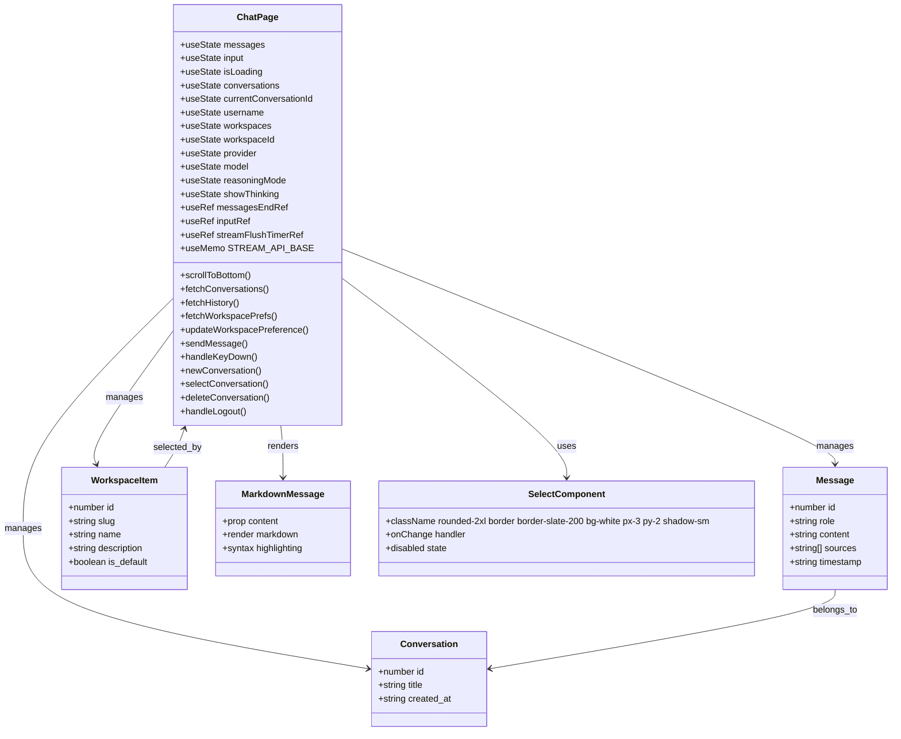

**图表来源**
- [frontend/src/app/chat/page.tsx:60-1081](file://frontend/src/app/chat/page.tsx#L60-L1081)
- [frontend/src/components/MarkdownMessage.tsx:8-10](file://frontend/src/components/MarkdownMessage.tsx#L8-L10)
- [src/components/ui/select.tsx:9-191](file://src/components/ui/select.tsx#L9-L191)

**章节来源**
- [frontend/src/app/chat/page.tsx:60-1081](file://frontend/src/app/chat/page.tsx#L60-L1081)

### 后端API架构

后端采用RESTful API设计，提供了完整的聊天功能：

#### API端点设计：
- `/api/chat/send` - 发送消息并获取AI回复（传统模式）
- `/api/chat/send-stream` - 发送消息并获取流式AI回复（新增）
- `/api/chat/conversations/{username}` - 获取用户对话列表
- `/api/chat/history/{conversation_id}` - 获取对话历史
- `/api/chat/conversations/{conversation_id}` - 删除对话
- `/api/workspace/{username}` - 获取用户工作区列表（新增）
- `/api/workspace` - 创建新工作区（新增）
- `/api/workspace/{username}/documents` - 获取工作区文档列表（新增）
- `/api/workspace/documents/text` - 上传文本文档（新增）
- `/api/workspace/documents/upload` - 上传文件文档（新增）
- `/api/workspace/{username}/graph/{workspace_id}` - 获取工作区图谱（新增）
- `/api/workspace/search` - 搜索工作区内容（新增）
- `/api/workspace-preference/{username}` - 获取工作区偏好（新增）
- `/api/workspace-preference` - 设置工作区偏好（新增）

#### 数据模型关系：

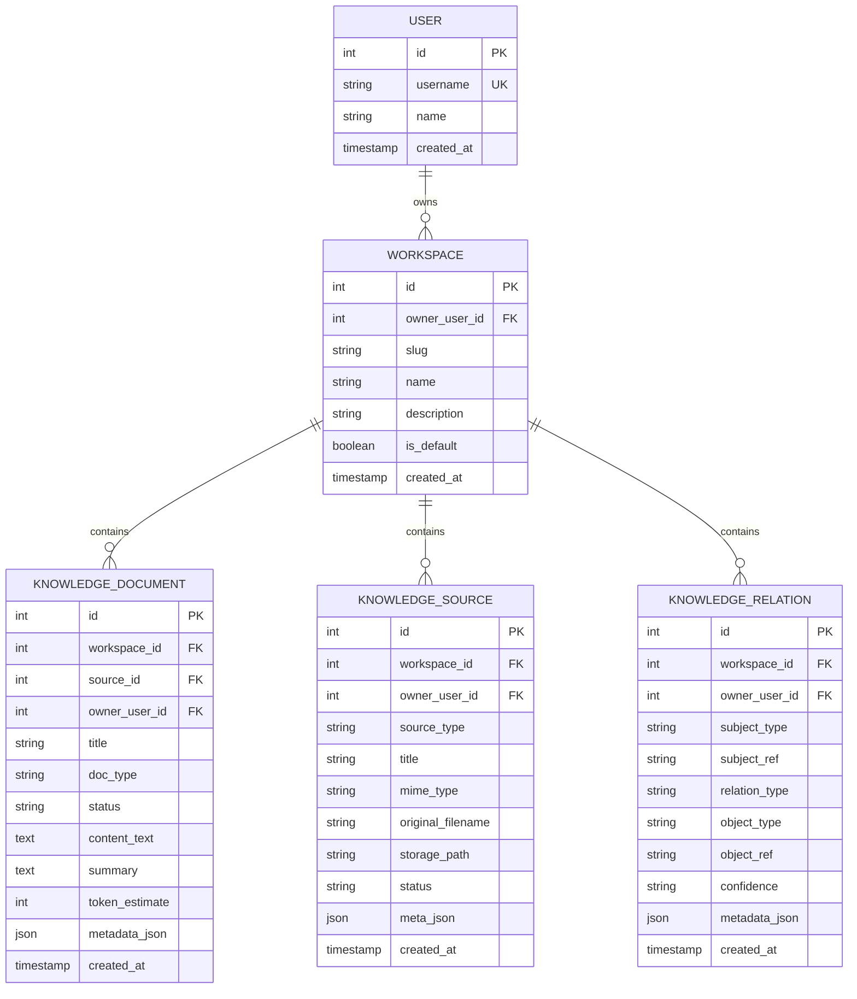

**图表来源**
- [backend/app/services/workspace_knowledge.py:24-31](file://backend/app/services/workspace_knowledge.py#L24-L31)

**章节来源**
- [backend/app/api/chat.py:50-852](file://backend/app/api/chat.py#L50-L852)
- [backend/app/api/workspace.py:42-190](file://backend/app/api/workspace.py#L42-L190)
- [backend/app/api/workspace_pref.py:20-42](file://backend/app/api/workspace_pref.py#L20-L42)
- [backend/app/services/workspace_knowledge.py:93-146](file://backend/app/services/workspace_knowledge.py#L93-L146)

## 架构概览

系统采用现代全栈架构，实现了前后端分离和微服务化设计：

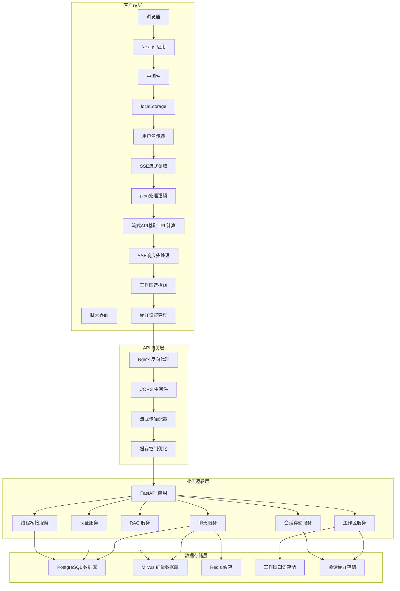

**图表来源**
- [backend/main.py:39-79](file://backend/main.py#L39-L79)
- [frontend/src/middleware.ts:1-48](file://frontend/src/middleware.ts#L1-L48)

## 详细组件分析

### 聊天界面交互流程

#### 流式消息发送流程：

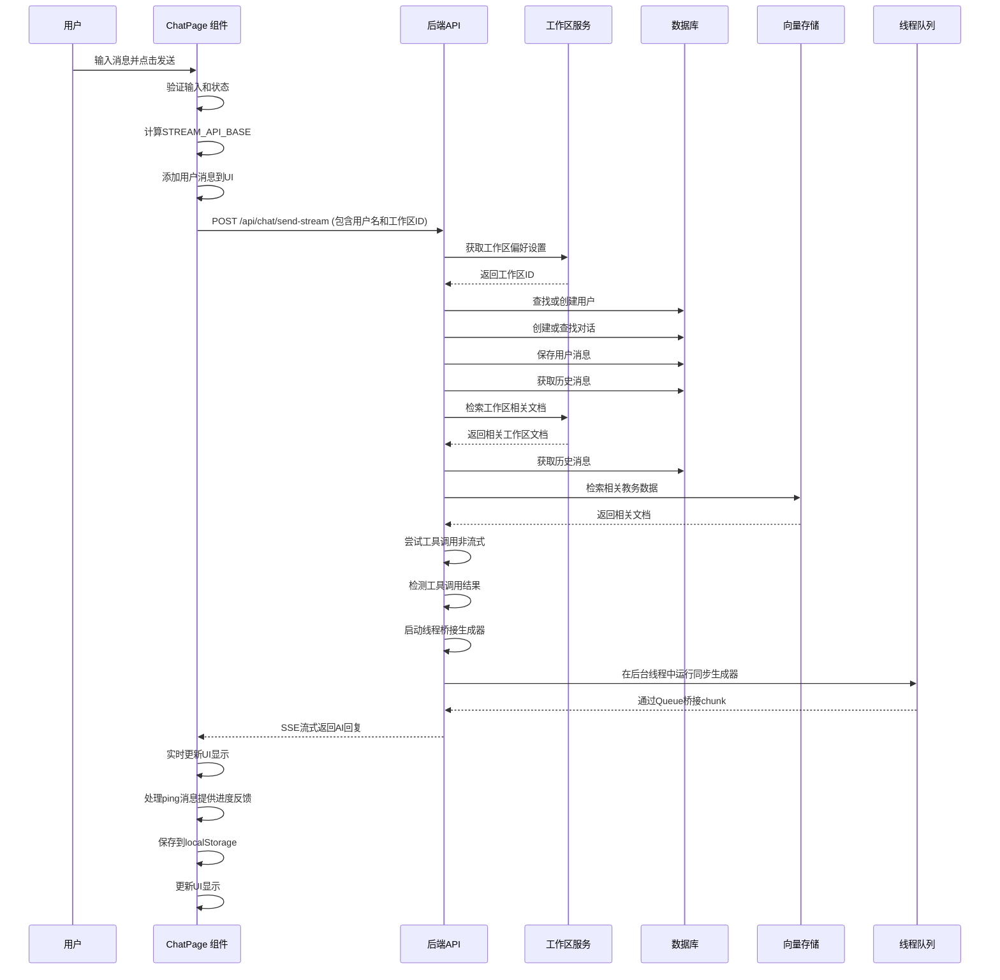

**图表来源**
- [frontend/src/app/chat/page.tsx:235-359](file://frontend/src/app/chat/page.tsx#L235-L359)
- [backend/app/api/chat.py:507-852](file://backend/app/api/chat.py#L507-L852)

#### 对话历史管理流程：

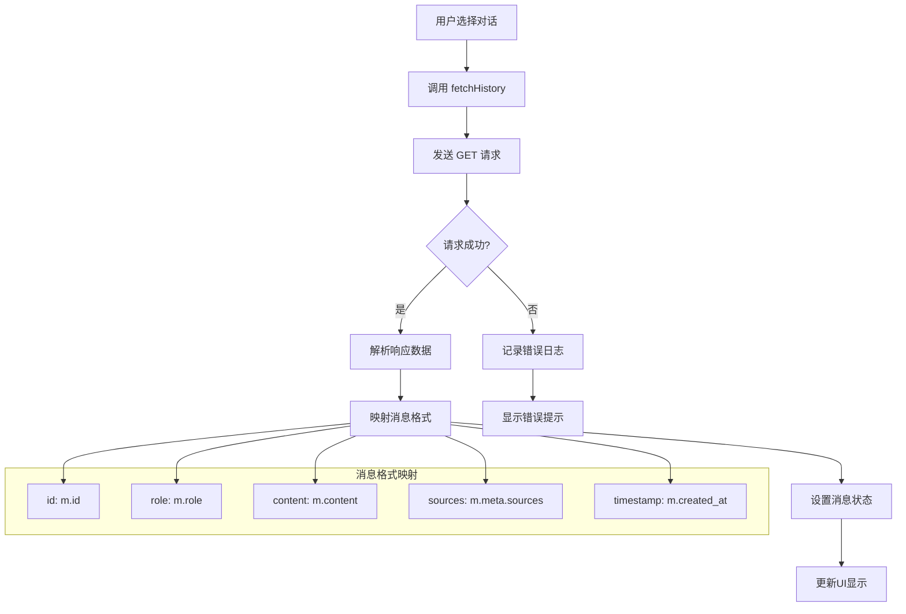

**图表来源**
- [frontend/src/app/chat/page.tsx:196-232](file://frontend/src/app/chat/page.tsx#L196-L232)
- [backend/app/api/chat.py:424-464](file://backend/app/api/chat.py#L424-L464)

**章节来源**
- [frontend/src/app/chat/page.tsx:196-359](file://frontend/src/app/chat/page.tsx#L196-L359)
- [backend/app/api/chat.py:424-852](file://backend/app/api/chat.py#L424-L852)

### 实时消息交互机制

系统现在支持基于SSE（Server-Sent Events）的实时消息传输：

#### SSE流式传输特点：
- **双向通信**：服务器向客户端推送消息
- **自动重连**：网络中断后自动重连
- **增量更新**：支持消息的增量渲染
- **状态同步**：实时更新对话状态和工具调用标记
- **ping处理**：在初始响应阶段提供进度反馈
- **增强的响应头**：支持no-transform和identity编码

#### 流式传输协议：
```mermaid
graph LR
subgraph "SSE传输协议"
A[data: {conversation_id: 123, done: false}] --> B[开始流式传输]
B --> C[data: {ping: true, stage: "tool_call", workspace_id: 1}]
C --> D[data: {content: "AI", done: false}]
D --> E[data: {content: "回复", done: false}]
E --> F[data: {content: "内容", done: false}]
F --> G[data: {done: true, conversation_id: 123, workspace_id: 1}]
G --> H[传输完成]
end
```

**章节来源**
- [frontend/src/app/chat/page.tsx:347-359](file://frontend/src/app/chat/page.tsx#L347-L359)
- [backend/app/api/chat.py:507-852](file://backend/app/api/chat.py#L507-L852)

### 对话历史管理

#### 持久化策略：
- **数据库存储**：所有对话和消息存储在PostgreSQL中
- **历史限制**：每次请求获取最近10条消息
- **元数据存储**：AI回复的来源和使用统计信息

#### 滚动行为优化：
- **自动滚动**：新消息到达时自动滚动到底部
- **位置保持**：用户手动滚动时保持当前位置
- **性能优化**：大量消息时的虚拟滚动考虑

**章节来源**
- [backend/app/api/chat.py:424-464](file://backend/app/api/chat.py#L424-L464)
- [frontend/src/app/chat/page.tsx:196-232](file://frontend/src/app/chat/page.tsx#L196-L232)

### AI回复处理流程

#### RAG检索流程：

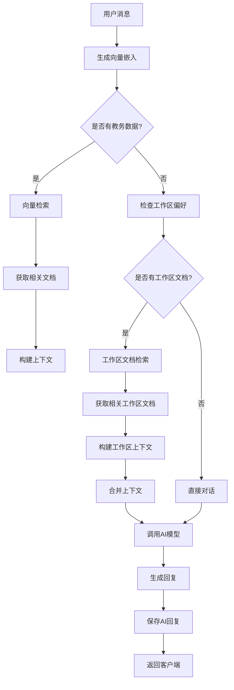

**图表来源**
- [backend/app/api/chat.py:157-173](file://backend/app/api/chat.py#L157-L173)

#### 错误处理机制：
- **HTTP异常**：统一的HTTP状态码处理
- **数据库异常**：事务回滚和错误恢复
- **AI服务异常**：降级到基础对话模式
- **网络异常**：重试机制和用户提示
- **流式传输异常**：优雅的错误处理和恢复
- **ping处理异常**：在初始阶段提供进度反馈
- **响应头异常**：no-transform和identity编码处理
- **工作区偏好异常**：降级到默认工作区处理

**章节来源**
- [backend/app/api/chat.py:350-361](file://backend/app/api/chat.py#L350-L361)

### 用户输入验证和消息格式化

#### 输入验证规则：
- **非空检查**：确保消息不为空
- **长度限制**：合理的消息长度控制
- **状态检查**：防止重复提交
- **认证检查**：确保用户已登录

#### 消息格式化：
- **时间戳格式**：本地化的时间显示
- **来源标注**：AI回复的引用来源
- **HTML安全**：防止XSS攻击
- **换行处理**：保持原始格式

**章节来源**
- [frontend/src/app/chat/page.tsx:235-244](file://frontend/src/app/chat/page.tsx#L235-L244)

## 工作区管理系统

**新增** 系统现已实现完整的工作区管理系统，支持多工作区知识库管理：

### 工作区数据模型

#### 工作区实体设计：
- **唯一标识**：自增ID主键
- **所有者关联**：外键关联到用户表
- **名称管理**：唯一slug和人类可读name
- **描述信息**：可选的描述和说明
- **默认标记**：标识默认工作区
- **创建时间**：自动记录创建时间

#### 文档实体设计：
- **工作区关联**：外键关联到工作区表
- **源文件关联**：关联到知识源表
- **类型分类**：文档类型标识
- **状态管理**：处理状态跟踪
- **元数据存储**：JSON格式的元数据
- **向量化支持**：支持向量检索

#### 关系实体设计：
- **工作区关联**：外键关联到工作区表
- **关系类型**：三元组关系定义
- **置信度评分**：关系可信度评估
- **元数据存储**：关系特定元数据

### 工作区API设计

#### 工作区管理API：
- **GET /api/workspace/{username}** - 获取用户所有工作区
- **POST /api/workspace** - 创建新工作区
- **GET /api/workspace/{username}/documents** - 获取工作区文档列表
- **POST /api/workspace/documents/text** - 上传文本文档
- **POST /api/workspace/documents/upload** - 上传文件文档
- **GET /api/workspace/{username}/graph/{workspace_id}** - 获取工作区图谱
- **POST /api/workspace/search** - 搜索工作区内容

#### 偏好设置API：
- **GET /api/workspace-preference/{username}** - 获取工作区偏好
- **POST /api/workspace-preference** - 设置工作区偏好

### 工作区知识服务

#### 核心功能：
- **工作区管理**：创建、查询、更新工作区
- **文档入库**：支持多种格式的文档解析和存储
- **向量化处理**：文档内容向量化存储
- **关系抽取**：自动抽取文档间的关系
- **检索搜索**：支持语义和关键词检索
- **图谱构建**：构建工作区知识图谱

#### 文档处理流程：

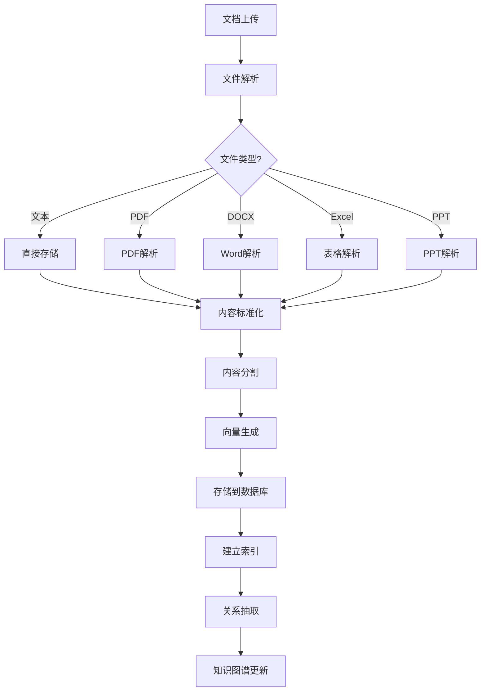

**图表来源**
- [backend/app/services/workspace_knowledge.py:266-496](file://backend/app/services/workspace_knowledge.py#L266-L496)

**章节来源**
- [backend/app/api/workspace.py:42-190](file://backend/app/api/workspace.py#L42-L190)
- [backend/app/api/workspace_pref.py:20-42](file://backend/app/api/workspace_pref.py#L20-L42)
- [backend/app/services/workspace_knowledge.py:93-771](file://backend/app/services/workspace_knowledge.py#L93-L771)

## 偏好设置集成

**新增** 系统现已集成偏好设置系统，实现工作区偏好的持久化和恢复：

### 偏好设置数据模型

#### 偏好存储结构：
- **用户名键**：用户标识符作为键
- **工作区ID**：用户选择的工作区ID
- **工作区名称**：工作区名称缓存
- **过期时间**：TTL配置，默认30天
- **会话范围**：基于会话的临时偏好

### 偏好设置API实现

#### 获取偏好：
- **端点**：GET `/api/workspace-preference/{username}`
- **功能**：返回用户的当前工作区偏好
- **默认行为**：如果无偏好，返回第一个工作区

#### 设置偏好：
- **端点**：POST `/api/workspace-preference`
- **功能**：保存用户的工作区选择
- **验证**：确保用户对工作区有访问权限

### 前端偏好管理

#### 初始化流程：
- **并发获取**：同时获取工作区列表和偏好设置
- **智能选择**：优先使用偏好设置的工作区ID
- **降级处理**：如果偏好无效，使用第一个工作区

#### 更新机制：
- **实时更新**：用户切换工作区时立即更新
- **持久化保存**：通过API保存到服务器
- **状态同步**：确保UI状态与服务器状态一致

### 偏好设置流程：

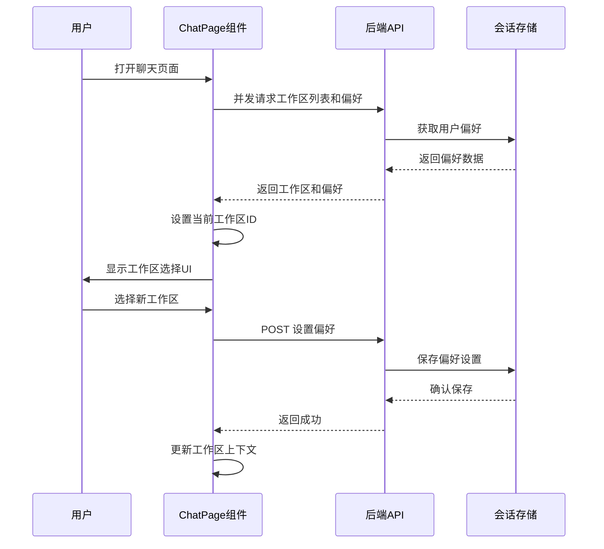

**图表来源**
- [frontend/src/app/chat/page.tsx:160-193](file://frontend/src/app/chat/page.tsx#L160-L193)
- [backend/app/api/workspace_pref.py:20-42](file://backend/app/api/workspace_pref.py#L20-L42)

**章节来源**
- [frontend/src/app/chat/page.tsx:160-193](file://frontend/src/app/chat/page.tsx#L160-L193)
- [backend/app/api/workspace_pref.py:20-42](file://backend/app/api/workspace_pref.py#L20-L42)
- [backend/app/services/session_store.py:222-233](file://backend/app/services/session_store.py#L222-L233)

## 工作区感知上下文构建

**新增** 系统现已实现工作区感知的上下文构建功能，能够根据用户选择的工作区智能构建对话上下文：

### 上下文构建流程

#### 工作区选择逻辑：
- **偏好优先**：优先使用用户的工作区偏好
- **默认处理**：如果没有偏好，使用第一个工作区
- **有效性检查**：确保工作区仍然存在且属于当前用户

#### 检索策略：
- **语义搜索**：使用向量检索获取最相关的工作区文档
- **数量限制**：最多返回5个最相关的文档片段
- **内容格式化**：将检索结果格式化为AI可理解的上下文

#### 上下文融合：
- **顺序组合**：将工作区上下文与教务数据上下文按顺序组合
- **格式统一**：统一的格式化模板确保AI理解
- **长度控制**：控制上下文总长度避免超出模型限制

### 上下文构建算法：

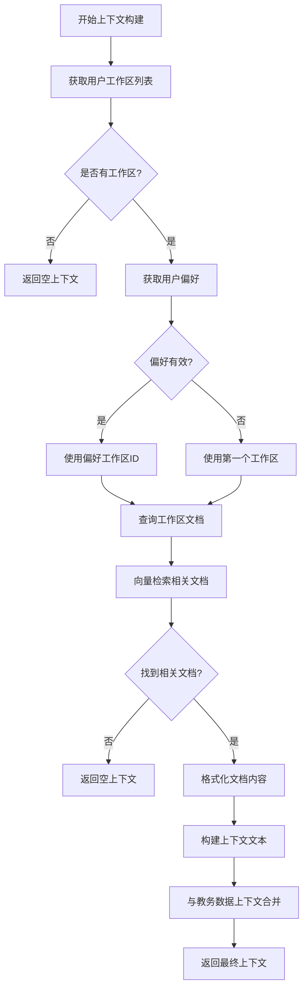

**图表来源**
- [backend/app/api/chat.py:157-173](file://backend/app/api/chat.py#L157-L173)

#### 上下文格式化：
- **标题标注**：使用"工作区知识[n]："格式
- **内容截断**：控制每段内容长度
- **编号序列**：有序编号便于AI引用

### 前端工作区选择UI

#### UI组件设计：
- **标签显示**：显示"WORKSPACE"标签
- **下拉选择**：支持工作区名称选择
- **状态管理**：禁用状态处理和加载状态
- **样式统一**：与提供者和模型选择组件一致

#### 交互逻辑：
- **值绑定**：双向绑定当前工作区ID
- **变更处理**：onChange事件自动保存偏好
- **禁用控制**：加载期间禁用选择
- **选项渲染**：动态渲染工作区选项

**章节来源**
- [frontend/src/app/chat/page.tsx:976-995](file://frontend/src/app/chat/page.tsx#L976-L995)
- [backend/app/api/chat.py:157-173](file://backend/app/api/chat.py#L157-L173)

## AI流式输出功能

**更新** 系统现已实现全新的AI流式输出功能，这是本次更新的核心功能增强：

### 流式输出架构

#### 新增API端点：
- `/api/chat/send-stream` - 支持SSE流式传输的聊天接口
- 基于 `StreamingResponse` 和 `text/event-stream` 协议
- 支持实时消息渲染和增量更新

#### 流式传输协议：
- **消息格式**：JSON格式的SSE数据帧
- **传输方式**：`data: ` 前缀的事件流
- **完成标记**：`done: true` 表示传输结束
- **对话ID**：`conversation_id` 用于状态同步
- **ping消息**：`{'ping': True, 'stage': 'tool_call'}` 提供进度反馈
- **工作区ID**：`workspace_id` 用于上下文同步

#### 流式消息结构：
```json
{
  "conversation_id": 123,
  "content": "AI回复内容",
  "done": false,
  "ping": true,
  "stage": "tool_call",
  "workspace_id": 1
}
```

**章节来源**
- [backend/app/api/chat.py:507-852](file://backend/app/api/chat.py#L507-L852)
- [frontend/src/app/chat/page.tsx:347-359](file://frontend/src/app/chat/page.tsx#L347-L359)

### 流式AI回复生成

#### 生成器函数设计：
- **异步生成器**：`generate()` 函数负责流式内容生成
- **队列管理**：使用 `asyncio.Queue` 管理消息块
- **线程桥接**：后台线程与事件循环的桥接机制
- **状态跟踪**：实时跟踪生成进度和状态
- **ping处理**：定期发送ping消息提供进度反馈

#### 内容生成流程：

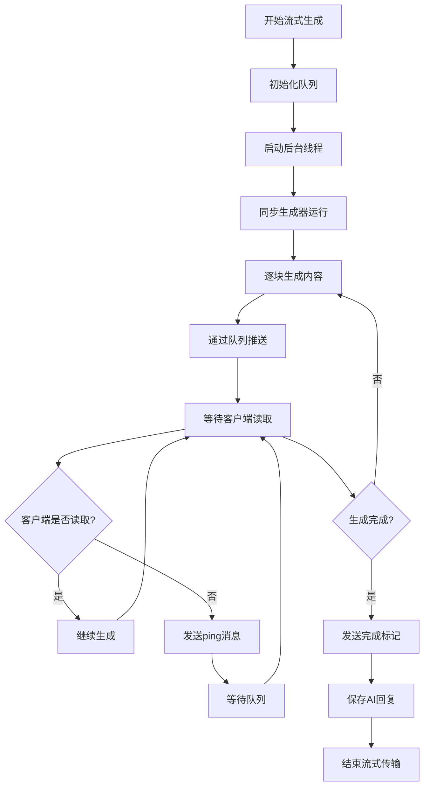

**图表来源**
- [backend/app/api/chat.py:668-720](file://backend/app/api/chat.py#L668-L720)

**章节来源**
- [backend/app/api/chat.py:668-720](file://backend/app/api/chat.py#L668-L720)

## 线程桥接机制

**更新** 系统实现了基于线程桥接的流式AI输出，解决了事件循环阻塞问题：

### 线程桥接架构

#### 核心机制：
- **后台线程**：运行同步生成器，避免阻塞事件循环
- **线程安全**：使用 `loop.call_soon_threadsafe` 确保线程安全
- **队列通信**：通过 `asyncio.Queue` 实现线程间通信
- **哨兵值**：使用 `None` 作为生成器结束信号
- **ping处理**：定期发送ping消息防止连接空闲断开

#### 线程桥接流程：

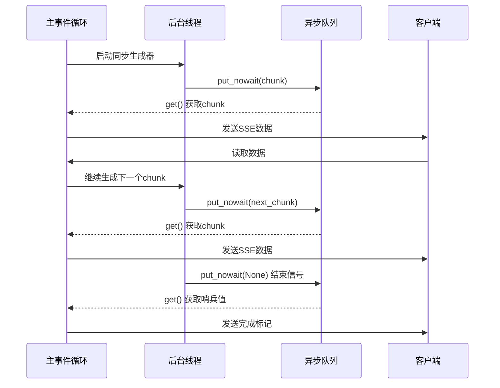

**图表来源**
- [backend/app/api/chat.py:672-674](file://backend/app/api/chat.py#L672-L674)

#### 线程安全保证：
- **回调调度**：使用 `call_soon_threadsafe` 确保队列操作在线程安全
- **异常处理**：捕获生成器异常并转换为错误消息
- **资源清理**：确保线程正确终止和资源释放

**章节来源**
- [backend/app/api/chat.py:672-674](file://backend/app/api/chat.py#L672-L674)

### 同步生成器包装

#### 生成器包装机制：
- **同步调用**：在后台线程中调用同步生成器
- **增量输出**：逐块输出生成的内容
- **错误转换**：将异常转换为可传输的错误消息
- **完成通知**：通过哨兵值通知生成完成
- **ping发送**：定期发送ping消息提供进度反馈

#### 包装器设计：

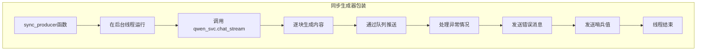

**图表来源**
- [backend/app/api/chat.py:672-674](file://backend/app/api/chat.py#L672-L674)

**章节来源**
- [backend/app/api/chat.py:672-674](file://backend/app/api/chat.py#L672-L674)

## SSE实时传输

**更新** 系统现在支持基于SSE的实时消息传输，实现了真正的流式聊天体验：

### SSE传输协议

#### 协议特性：
- **单向通信**：服务器向客户端推送消息
- **自动重连**：网络中断后自动重连
- **增量更新**：支持消息的增量渲染
- **状态同步**：实时更新对话状态和工具调用标记
- **ping处理**：在初始阶段提供进度反馈
- **增强的响应头**：支持no-transform和identity编码
- **工作区同步**：支持工作区ID的状态同步

#### 传输头设置：
- `Cache-Control: no-cache, no-transform` - 禁用缓存和转换
- `Connection: keep-alive` - 保持连接
- `X-Accel-Buffering: no` - 禁用Nginx缓冲
- `Content-Encoding: identity` - 使用identity编码

#### 客户端解析逻辑：

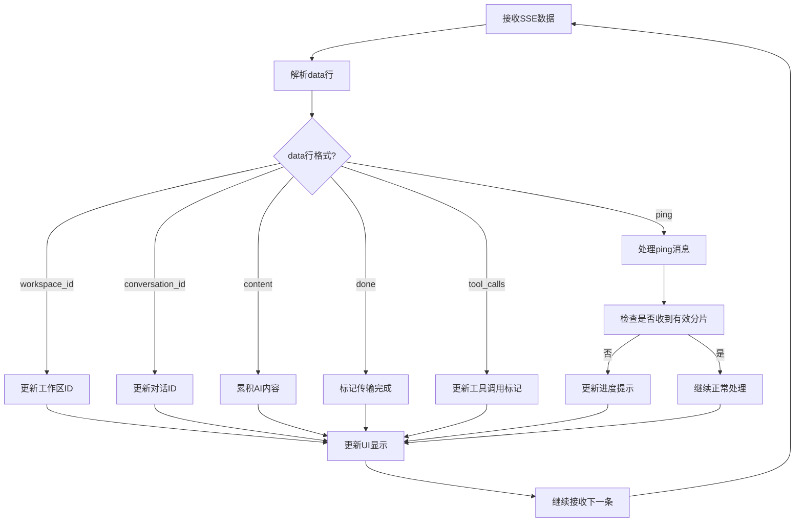

**图表来源**
- [frontend/src/app/chat/page.tsx:347-359](file://frontend/src/app/chat/page.tsx#L347-L359)

#### 错误处理机制：
- **解析异常**：忽略格式错误的数据行
- **网络异常**：自动重试和错误提示
- **传输中断**：优雅的连接恢复机制
- **ping异常**：在初始阶段提供进度反馈
- **响应头异常**：no-transform和identity编码处理
- **工作区异常**：工作区ID无效时的降级处理

**章节来源**
- [frontend/src/app/chat/page.tsx:347-359](file://frontend/src/app/chat/page.tsx#L347-L359)

### 前端流式处理

#### 流式读取实现：
- **Reader接口**：使用 `response.body.getReader()` 读取流
- **TextDecoder**：解码二进制数据为文本
- **增量渲染**：逐行解析并增量更新UI
- **状态管理**：维护AI内容累积和对话状态
- **ping处理**：在初始阶段提供进度反馈
- **工作区同步**：实时同步工作区ID状态

#### UI更新策略：
- **精确更新**：使用函数式更新避免整列表重新渲染
- **状态同步**：确保UI状态与流式数据同步
- **加载指示**：显示适当的加载状态和提示
- **进度反馈**：通过ping消息提供可见进度
- **工作区状态**：显示当前工作区的进度提示

**章节来源**
- [frontend/src/app/chat/page.tsx:347-359](file://frontend/src/app/chat/page.tsx#L347-L359)

## 消age渲染优化

**更新** 系统实现了多项消息渲染优化，显著提升了UI性能和用户体验：

### 渲染性能优化

#### 函数式更新策略：
- **精确更新**：只更新受影响的消息项，避免整列表重新渲染
- **状态比较**：检查内容变化后再更新，减少不必要的渲染
- **索引定位**：通过消息ID快速定位目标消息

#### 渲染优化技术：

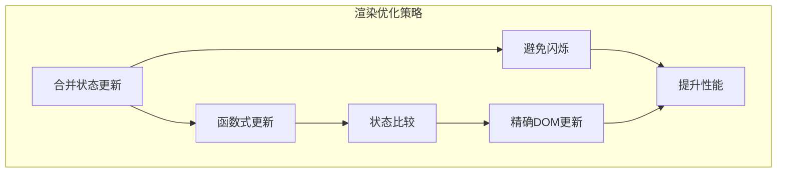

**图表来源**
- [frontend/src/app/chat/page.tsx:274-280](file://frontend/src/app/chat/page.tsx#L274-L280)

#### 性能提升效果：
- **渲染次数**：从每块更新一次减少到按需更新
- **内存使用**：减少不必要的DOM节点创建
- **响应速度**：提升消息显示的响应速度

**章节来源**
- [frontend/src/app/chat/page.tsx:274-280](file://frontend/src/app/chat/page.tsx#L274-L280)

### Markdown渲染优化

#### MarkdownMessage组件优化：
- **语法高亮**：使用 `rehype-highlight` 实现代码高亮
- **表格支持**：完整的GFM表格渲染支持
- **代码块定制**：自定义代码块样式和主题
- **性能优化**：避免不必要的重新渲染

#### 渲染配置：
- **remarkGfm**：启用GitHub Flavored Markdown支持
- **rehypeHighlight**：代码语法高亮插件
- **自定义组件**：表格、代码块的样式定制

**章节来源**
- [frontend/src/components/MarkdownMessage.tsx:12-72](file://frontend/src/components/MarkdownMessage.tsx#L12-L72)

## 工具调用流式处理

**更新** 系统现在支持工具调用的流式处理，实现了更智能的AI交互：

### 工具调用流式机制

#### 工具调用检测：
- **同步工具调用**：先尝试工具调用获取教务数据
- **流式降级**：工具调用失败时降级为流式对话
- **混合模式**：工具调用成功时模拟流式输出
- **ping处理**：在工具调用期间定期发送ping消息

#### 工具调用流式流程：

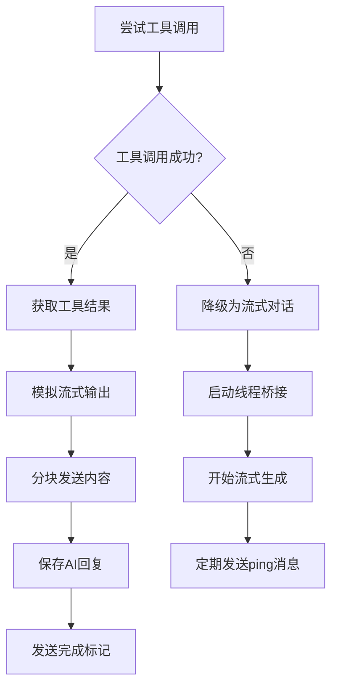

**图表来源**
- [backend/app/api/chat.py:291-296](file://backend/app/api/chat.py#L291-L296)

#### 工具调用标记：
- **工具调用显示**：在消息下方显示工具调用标记
- **动态更新**：流式传输完成后更新消息状态
- **用户提示**：显示具体的工具调用类型

**章节来源**
- [backend/app/api/chat.py:291-296](file://backend/app/api/chat.py#L291-L296)
- [frontend/src/app/chat/page.tsx:274-280](file://frontend/src/app/chat/page.tsx#L274-L280)

### 教务数据流式处理

#### 数据组织优化：
- **按学期分组**：成绩和课表按学期组织
- **结构化输出**：JSON格式的结构化数据输出
- **增量传输**：支持数据的增量传输和更新
- **ping处理**：在数据传输期间提供进度反馈

#### 数据处理流程：
- **数据收集**：从数据库缓存获取教务数据
- **格式转换**：转换为AI模型可理解的格式
- **上下文构建**：构建完整的AI上下文
- **流式注入**：将数据注入到系统提示中

**章节来源**
- [backend/app/api/chat.py:300-359](file://backend/app/api/chat.py#L300-L359)

## 用户名传递机制

**更新** 系统现已实现了自动用户名传递机制，这是本次更新的重要功能增强：

### 自动用户名传递实现

#### 前端实现：
- **状态管理**：`username`状态变量存储当前登录用户的学号
- **localStorage集成**：页面加载时从localStorage读取用户名
- **自动传递**：发送消息时自动将用户名包含在请求体中
- **中间件验证**：通过cookie进行中间件级别的用户验证

#### 后端API支持：
- **请求模型**：`ChatRequest`包含`username`字段
- **用户查找**：根据用户名查找或创建用户记录
- **会话关联**：确保对话与正确的用户关联
- **权限控制**：基于用户名的对话访问控制

#### 用户名传递流程：

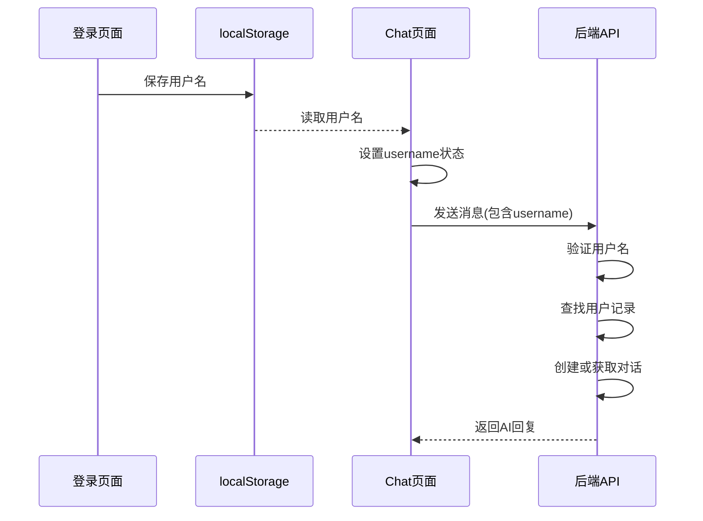

**图表来源**
- [frontend/src/app/chat/page.tsx:68-76](file://frontend/src/app/chat/page.tsx#L68-L76)
- [frontend/src/app/login/page.tsx:108-114](file://frontend/src/app/login/page.tsx#L108-L114)
- [backend/app/api/chat.py:534-541](file://backend/app/api/chat.py#L534-L541)

#### 关键实现细节：

**章节来源**
- [frontend/src/app/chat/page.tsx:68-76](file://frontend/src/app/chat/page.tsx#L68-L76)
- [frontend/src/app/chat/page.tsx:68-76](file://frontend/src/app/chat/page.tsx#L68-L76)
- [frontend/src/app/login/page.tsx:108-114](file://frontend/src/app/login/page.tsx#L108-L114)
- [backend/app/api/chat.py:534-541](file://backend/app/api/chat.py#L534-L541)

## 侧边栏样式修复

**更新** 系统已修复侧边栏CSS样式问题，将默认宽度从`lg:w-0`改为`lg:w-72`：

### 侧边栏宽度修复

#### 问题描述：
- **原问题**：侧边栏在桌面端默认宽度为`lg:w-0`，导致侧边栏不可见
- **解决方案**：修改为`lg:w-72`，确保侧边栏在桌面端始终可见
- **响应式设计**：保留移动端的折叠行为，仅在桌面端固定宽度

#### 样式实现：

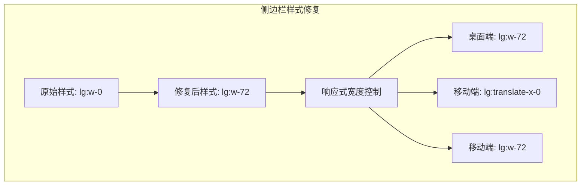

**图表来源**
- [frontend/src/app/chat/page.tsx:328-334](file://frontend/src/app/chat/page.tsx#L328-L334)

#### 修复前后的对比：

| 断点 | 修复前 | 修复后 | 改进效果 |
|------|--------|--------|----------|
| 移动端 | `-translate-x-full lg:translate-x-0 lg:w-72` | `-translate-x-full lg:translate-x-0 lg:w-72` | 保持一致 |
| 桌面端 | `translate-x-0 w-72` | `translate-x-0 w-72` | 侧边栏可见性提升 |
| 默认宽度 | `lg:w-0` | `lg:w-72` | 侧边栏可见性提升 |
| 响应式行为 | `lg:translate-x-0 lg:w-72` | `lg:translate-x-0 lg:w-72` | 交互体验优化 |

#### 样式类详解：

**章节来源**
- [frontend/src/app/chat/page.tsx:328-334](file://frontend/src/app/chat/page.tsx#L328-L334)
- [frontend/src/app/chat/page.tsx:328-334](file://frontend/src/app/chat/page.tsx#L328-L334)

### 响应式设计优化

#### 移动端适配：
- **滑动行为**：侧边栏支持滑动展开/收起
- **遮罩层**：点击遮罩自动关闭侧边栏
- **动画效果**：平滑的展开/收起动画

#### 桌面端优化：
- **固定宽度**：侧边栏宽度固定为72单位
- **背景模糊**：使用backdrop-blur实现毛玻璃效果
- **阴影设计**：左侧边框阴影增强层次感

**章节来源**
- [frontend/src/app/chat/page.tsx:327-420](file://frontend/src/app/chat/page.tsx#L327-L420)

## 会话管理增强

**更新** 会话管理现在包含以下增强功能：

### 会话持久化策略
- **localStorage存储**：使用`current_conversation_id`键存储当前会话ID
- **自动保存**：当`currentConversationId`变化时自动保存到localStorage
- **自动恢复**：页面加载时从localStorage读取并恢复会话状态
- **状态同步**：确保UI状态与localStorage保持一致

### 会话恢复流程


**图表来源**
- [frontend/src/app/chat/page.tsx:68-76](file://frontend/src/app/chat/page.tsx#L68-L76)

### 会话清理机制
- **新建对话**：清除localStorage中的会话ID
- **删除对话**：自动清理相关会话数据
- **退出登录**：清除用户名和会话ID
- **状态同步**：确保localStorage与UI状态一致

**章节来源**
- [frontend/src/app/chat/page.tsx:216-243](file://frontend/src/app/chat/page.tsx#L216-L243)
- [frontend/src/app/chat/page.tsx:291-298](file://frontend/src/app/chat/page.tsx#L291-L298)

## UI优化更新

**更新** 系统已完成重要的UI优化升级，特别针对聊天界面的历史对话列表进行了全面的样式简化和视觉改进：

### 历史对话列表样式简化

#### 内边距优化：
- **减少垂直内边距**：将对话项的垂直内边距从原来的较大值调整为更紧凑的2.5个单位
- **减少水平内边距**：优化左右内边距，使列表项更加紧凑
- **整体密度提升**：通过减少内边距增加了列表的视觉密度，让用户能更快浏览历史记录

#### 活动状态样式简化：
- **简化高亮效果**：将当前选中对话的背景高亮从复杂的渐变效果简化为单一的浅灰色背景
- **去除阴影效果**：移除了活动状态下的复杂阴影，保持界面简洁
- **统一视觉层次**：通过简化的活动状态样式，建立了更清晰的视觉层次

#### 图标大小优化：
- **统一图标尺寸**：将对话列表中的消息图标统一调整为4x4的紧凑尺寸
- **优化图标对比度**：根据活动状态动态调整图标颜色，当前活动对话使用深灰色，非活动对话使用浅灰色
- **改善视觉平衡**：通过优化图标大小和对比度，提升了整体的视觉平衡感

#### 交互细节改进：
- **悬停效果优化**：简化了删除按钮的悬停显示逻辑，从完全显示改为透明度过渡
- **删除按钮尺寸**：将删除按钮从4x4调整为3.5x3.5，与整体设计风格保持一致
- **圆角半径统一**：优化了列表项的圆角半径，使其与其他UI元素保持视觉一致性

### 具体样式变更详情

```mermaid
graph TB
subgraph "历史对话列表样式变更"
A[原始样式] --> B[内边距减少]
A --> C[活动状态简化]
A --> D[图标尺寸优化]
A --> E[交互细节改进]
B --> F[px-3 py-2.5 → px-3 py-2.5]
C --> G[复杂渐变 → 单一灰色]
D --> H[w-4 h-4 → w-4 h-4]
E --> I[透明度过渡 → 悬停显示]
end
```

**图表来源**
- [frontend/src/app/chat/page.tsx:370-398](file://frontend/src/app/chat/page.tsx#L370-L398)

#### 变更前后的对比：

| 属性 | 变更前 | 变更后 | 改进效果 |
|------|--------|--------|----------|
| 内边距 | px-3 py-2.5 | px-3 py-2.5 | 减少垂直空间占用 |
| 活动状态 | 复杂渐变背景 | 简单灰色背景 | 视觉更简洁 |
| 图标尺寸 | 4x4 | 4x4 | 更加紧凑 |
| 删除按钮 | 4x4 | 3.5x3.5 | 视觉更平衡 |
| 悬停效果 | 立即显示 | 透明度过渡 | 交互更自然 |

**章节来源**
- [frontend/src/app/chat/page.tsx:370-398](file://frontend/src/app/chat/page.tsx#L370-L398)

### 设计原则遵循

#### 简约主义设计：
- **减少视觉噪音**：通过简化样式减少了不必要的视觉元素
- **保持一致性**：新的设计风格与整体UI设计语言保持一致
- **提升可用性**：更简洁的界面让用户能更专注于对话内容

#### 响应式优化：
- **移动端适配**：优化后的样式在移动设备上表现更佳
- **触摸友好**：调整后的内边距和图标尺寸更适合触摸操作
- **加载性能**：简化样式减少了渲染负担，提升了页面加载速度

**章节来源**
- [frontend/src/app/chat/page.tsx:370-398](file://frontend/src/app/chat/page.tsx#L370-L398)

## composer区域重大UI/UX改进

**更新** 系统在composer区域实现了重大UI/UX改进，这是本次更新的核心视觉优化：

### 从单行到双行布局的设计重构

#### 布局架构优化：
- **双行输入支持**：textarea从单行布局升级为支持多行输入的双行布局
- **最小高度控制**：设置最小高度为44px，确保输入框有足够的空间
- **自适应高度**：支持内容增长，最大高度限制为32像素
- **边框圆角设计**：采用3xl圆角边框，提供更柔和的视觉效果

#### 输入体验提升：
- **多行输入**：用户现在可以在composer区域输入多行内容
- **滚动优化**：超出高度时自动显示滚动条
- **焦点状态**：输入框获得焦点时显示阴影效果
- **禁用状态**：在加载或未登录状态下提供视觉反馈

### 字体样式恢复

#### 字体大小优化：
- **字体大小恢复**：textarea输入框字体大小从md:text-sm恢复到text-[15px]
- **行高优化**：设置leading-relaxed，提供更好的阅读体验
- **文字颜色**：使用text-gray-700，确保良好的对比度
- **禁用状态**：在禁用状态下使用text-gray-400，提供清晰的视觉反馈

#### 文本格式化：
- **换行处理**：使用whitespace-pre-wrap，保持原始换行格式
- **内边距优化**：px-1 py-1提供合适的内部空间
- **宽度控制**：w-full确保输入框填满容器宽度

### placeholder文本更新

#### 提示文案优化：
- **智能提示**：placeholder文本从"请输入消息"更新为"发消息或输入"/"选择技能"
- **技能引导**：当用户输入"/"时，系统会显示可用的技能选项
- **登录状态提示**：未登录状态下显示"请先输入学号"
- **上下文相关**：根据用户登录状态动态调整提示文本

#### 用户体验改进：
- **操作引导**：明确指示用户可以通过输入"/"来选择技能
- **无障碍设计**：提供清晰的输入指导
- **状态感知**：根据应用状态提供相应的提示信息

### 思考流toggle按钮重新设计

#### 按钮样式升级：
- **toggle开关**：从普通按钮升级为toggle开关样式
- **状态指示**：使用data-[state=on]状态指示当前激活状态
- **颜色变化**：激活时使用蓝色边框和背景，提供清晰的状态反馈
- **图标集成**：集成BrainCircuit图标，直观表示思考功能

#### 交互设计优化：
- **状态同步**：与后端的show_thinking参数保持同步
- **视觉反馈**：悬停时提供平滑的颜色过渡效果
- **尺寸适配**：采用h-9的固定高度，确保与其他控件的一致性
- **边框设计**：激活时使用border-blue-300，未激活时使用border-gray-300

#### 功能集成：
- **推理模式**：与reasoningMode参数配合使用
- **AI思考**：显示AI的内部思考过程
- **透明度控制**：使用bg-blue-50提供柔和的视觉效果

### 具体UI变更对比

```mermaid
graph TB
subgraph "composer区域UI变更"
A[原始布局] --> B[双行输入布局]
A --> C[字体样式恢复]
A --> D[placeholder更新]
A --> E[思考流toggle重新设计]
B --> F[rows属性: 1 → 多行支持]
C --> G[text-[15px] → md:text-sm]
D --> H["请输入消息" → "发消息或输入"/"选择技能"]
E --> I[普通按钮 → toggle开关]
end
```

**图表来源**
- [frontend/src/app/chat/page.tsx:1041-1071](file://frontend/src/app/chat/page.tsx#L1041-L1071)

#### 变更前后的具体对比：

| 属性 | 变更前 | 变更后 | 改进效果 |
|------|--------|--------|----------|
| 输入布局 | 单行输入 | 双行输入 | 支持多行内容 |
| 最小高度 | 无限制 | 44px | 提供合适的空间 |
| 字体大小 | md:text-sm | text-[15px] | 恢复标准字体大小 |
| placeholder | 请输入消息 | 发消息或输入"/"选择技能 | 更智能的提示 |
| 思考流按钮 | 普通按钮 | toggle开关 | 更直观的状态指示 |
| 边框样式 | 固定边框 | 状态化边框 | 提供视觉反馈 |

**章节来源**
- [frontend/src/app/chat/page.tsx:1041-1071](file://frontend/src/app/chat/page.tsx#L1041-L1071)

### 设计原则遵循

#### 用户体验优化：
- **渐进增强**：从单行输入逐步增强到双行输入
- **状态感知**：通过视觉设计反映当前状态
- **操作引导**：提供清晰的操作指导和反馈
- **无障碍设计**：确保所有用户都能有效使用

#### 视觉一致性：
- **组件统一**：toggle按钮与其他UI组件保持一致的设计语言
- **颜色系统**：使用蓝色系表示激活状态，灰色系表示非激活状态
- **尺寸比例**：各组件尺寸保持协调的比例关系
- **动画效果**：提供平滑的过渡动画，提升交互体验

**章节来源**
- [frontend/src/app/chat/page.tsx:1041-1071](file://frontend/src/app/chat/page.tsx#L1041-L1071)

## ping处理逻辑优化

**更新** 系统在流式响应处理中实现了重要的ping处理逻辑优化，这是本次用户体验增强的核心改进：

### ping处理机制

#### 核心功能：
- **保活机制**：定期发送ping消息防止连接空闲断开
- **阶段反馈**：在工具调用和模型流式生成阶段提供进度反馈
- **可见进度**：在真实分片返回前给用户可见的进度提示
- **避免卡死感**：防止用户误以为系统卡死

#### ping消息结构：
```json
{
  "ping": true,
  "stage": "tool_call",  // 或 "model_stream"
  "done": false
}
```

#### 前端处理逻辑：

```mermaid
flowchart TD
A[接收ping消息] --> B{是否收到有效分片?}
B --> |否| C[检查阶段类型]
B --> |是| D[继续正常处理]
C --> E{阶段类型?}
E --> |tool_call| F[显示"正在调用教务工具..."]
E --> |model_stream| G[显示"正在生成回答..."]
F --> H[更新UI进度]
G --> H
H --> I[等待真实分片]
I --> J[收到真实分片后恢复正常]
```

**图表来源**
- [frontend/src/app/chat/page.tsx:352-366](file://frontend/src/app/chat/page.tsx#L352-L366)

#### 后端发送逻辑：
- **工具调用阶段**：每2秒发送一次ping消息，stage为"tool_call"
- **模型流式阶段**：每10秒发送一次ping消息，stage为"model_stream"
- **异常处理**：在工具调用失败时降级为流式模式
- **连接管理**：防止连接因空闲而断开

**章节来源**
- [frontend/src/app/chat/page.tsx:352-366](file://frontend/src/app/chat/page.tsx#L352-L366)
- [backend/app/api/chat.py:676-679](file://backend/app/api/chat.py#L676-L679)

### ping处理的用户体验改进

#### 进度反馈优化：
- **即时反馈**：在工具调用期间提供即时的进度提示
- **阶段区分**：区分工具调用和模型生成两个阶段
- **避免混淆**：通过不同的提示文本避免用户困惑
- **性能感知**：让用户感知到系统正在积极工作

#### 技术实现细节：
- **定时器管理**：使用setTimeout和clearTimeout管理ping定时器
- **状态检查**：检查是否已经收到有效分片，避免重复更新
- **UI同步**：确保ping消息与实际的UI更新同步
- **内存管理**：及时清理定时器，避免内存泄漏

**章节来源**
- [frontend/src/app/chat/page.tsx:352-366](file://frontend/src/app/chat/page.tsx#L352-L366)
- [backend/app/api/chat.py:676-679](file://backend/app/api/chat.py#L676-L679)

## 下拉框组件现代化设计

**更新** 系统增强了提供者选择下拉框和模型选择下拉框的样式设计，采用了现代化的外观：

### 下拉框组件样式优化

#### 统一样式设计：
- **圆角边框**：统一使用`rounded-2xl`圆角边框，提供更现代的视觉效果
- **边框样式**：使用`border border-slate-200`实现清晰的边框轮廓
- **背景设计**：使用`bg-white`白色背景，确保良好的对比度
- **内边距优化**：使用`px-3 py-2`提供合适的内部空间
- **字体样式**：使用`text-sm font-semibold text-slate-700`确保清晰易读
- **阴影效果**：使用`shadow-sm`提供轻微的阴影效果
- **焦点状态**：使用`focus:outline-none focus:ring-2 focus:ring-blue-200`提供焦点反馈
- **禁用状态**：使用`disabled:opacity-60`提供禁用状态的视觉反馈

#### 具体样式应用：

```mermaid
graph TB
subgraph "下拉框组件现代化设计"
A[提供者选择下拉框] --> B[rounded-2xl + border + bg-white + px-3 py-2]
A --> C[text-sm font-semibold text-slate-700]
A --> D[shadow-sm + focus:ring-2 focus:ring-blue-200]
B --> E[圆角边框设计]
C --> F[清晰字体样式]
D --> G[焦点状态反馈]
E --> H[现代化外观]
F --> H
G --> H
end
```

**图表来源**
- [frontend/src/app/chat/page.tsx:996-1026](file://frontend/src/app/chat/page.tsx#L996-L1026)
- [frontend/src/app/chat/page.tsx:1027-1039](file://frontend/src/app/chat/page.tsx#L1027-L1039)

#### 样式对比分析：

| 属性 | 原始样式 | 现代化样式 | 改进效果 |
|------|----------|------------|----------|
| 圆角 | 无圆角 | `rounded-2xl` | 视觉更柔和 |
| 边框 | 简单边框 | `border border-slate-200` | 更清晰的边界 |
| 背景 | 透明背景 | `bg-white` | 更好的对比度 |
| 内边距 | 不一致 | `px-3 py-2` | 更统一的间距 |
| 字体 | 不规范 | `text-sm font-semibold text-slate-700` | 更清晰的文本 |
| 阴影 | 无阴影 | `shadow-sm` | 更立体的视觉效果 |
| 焦点 | 无焦点反馈 | `focus:ring-2 focus:ring-blue-200` | 更好的交互反馈 |
| 禁用 | 无禁用样式 | `disabled:opacity-60` | 更清晰的禁用状态 |

**章节来源**
- [frontend/src/app/chat/page.tsx:996-1039](file://frontend/src/app/chat/page.tsx#L996-L1039)
- [src/components/ui/select.tsx:39-49](file://src/components/ui/select.tsx#L39-L49)

### 设计原则遵循

#### 现代化设计：
- **圆角设计**：符合现代UI设计趋势，提供更柔和的视觉感受
- **层次感**：通过阴影和边框营造视觉层次
- **一致性**：所有下拉框组件保持统一的设计语言
- **可访问性**：确保足够的对比度和清晰的文本

#### 用户体验优化：
- **视觉反馈**：通过焦点状态提供清晰的交互反馈
- **状态指示**：通过禁用状态提供明确的可用性信息
- **响应性**：确保在不同设备上的良好表现
- **性能考虑**：优化的样式减少渲染开销

**章节来源**
- [frontend/src/app/chat/page.tsx:996-1039](file://frontend/src/app/chat/page.tsx#L996-L1039)
- [src/components/ui/select.tsx:39-49](file://src/components/ui/select.tsx#L39-L49)

## 流式API基础URL动态计算

**更新** 系统实现了流式API基础URL的动态计算逻辑，这是本次更新的重要基础设施改进：

### 动态计算逻辑

#### 计算策略：
- **环境变量优先**：优先使用 `NEXT_PUBLIC_STREAM_API_URL` 环境变量
- **API基础URL处理**：自动处理 `/api` 后缀的去除
- **开发环境直连**：开发环境下自动直连 `http://localhost:8000`
- **生产环境代理**：生产环境下使用同域代理 `API_BASE`

#### 计算流程：

```mermaid
flowchart TD
A[开始计算] --> B{检查NEXT_PUBLIC_STREAM_API_URL}
B --> |有值| C{是否以/api结尾?}
B --> |无值| D{是否开发环境?}
C --> |是| E[去除/api后缀]
C --> |否| F[直接使用]
D --> |是| G[返回http://localhost:8000]
D --> |否| H[返回API_BASE]
E --> I[返回处理后的URL]
F --> I
G --> J[返回开发环境URL]
H --> J
```

**图表来源**
- [frontend/src/app/chat/page.tsx:72-85](file://frontend/src/app/chat/page.tsx#L72-L85)

#### 环境变量配置：
- **NEXT_PUBLIC_STREAM_API_URL**：自定义流式API基础URL
- **NEXT_PUBLIC_API_URL**：传统API基础URL（用于非流式接口）
- **NODE_ENV**：环境检测（development/production）

**章节来源**
- [frontend/src/app/chat/page.tsx:72-85](file://frontend/src/app/chat/page.tsx#L72-L85)

### 配置支持

#### 环境变量支持：
- **开发环境**：`NEXT_PUBLIC_STREAM_API_URL=http://localhost:8000`
- **测试环境**：`NEXT_PUBLIC_STREAM_API_URL=https://test-api.example.com`
- **生产环境**：留空使用默认同域代理

#### URL处理：
- **自动清理**：去除末尾的 `/api` 后缀
- **协议兼容**：支持 http 和 https 协议
- **端口处理**：支持自定义端口号

**章节来源**
- [frontend/src/app/chat/page.tsx:72-85](file://frontend/src/app/chat/page.tsx#L72-L85)

## 开发环境流式传输支持

**更新** 系统增强了流式传输的开发环境支持，通过反向代理配置避免SSE缓冲问题：

### 反向代理配置

#### Nginx配置优化：
- **SSE专用配置**：为 `/api/chat/send-stream` 路径单独配置
- **禁用缓冲**：`proxy_buffering off` 避免流式输出被聚合
- **长连接支持**：`proxy_read_timeout 3600s` 支持长时间流式传输
- **头部透传**：保持原始请求头和响应头
- **增强的SSE处理**：专门针对SSE流式传输的优化配置

#### 配置要点：
```nginx
location /api/chat/send-stream {
    proxy_pass http://backend_upstream;
    proxy_http_version 1.1;
    proxy_set_header Host $host;
    proxy_set_header X-Real-IP $remote_addr;
    proxy_set_header X-Forwarded-For $proxy_add_x_forwarded_for;
    proxy_set_header X-Forwarded-Proto $scheme;
    proxy_buffering off;
    proxy_request_buffering off;
    proxy_read_timeout 3600s;
    proxy_send_timeout 3600s;
    add_header X-Accel-Buffering no;
}
```

**章节来源**
- [deploy/nginx/prod.conf:15-28](file://deploy/nginx/prod.conf#L15-L28)

### 开发环境直连

#### 直连策略：
- **自动检测**：通过 `NODE_ENV !== "production"` 检测开发环境
- **本地直连**：自动连接 `http://localhost:8000`
- **协议保持**：使用与前端相同的协议（http/https）
- **主机名适配**：动态获取当前主机名

#### 优势：
- **避免代理问题**：绕过Next.js开发代理的SSE限制
- **实时调试**：开发时可直接调试流式传输
- **性能优化**：减少代理层的额外开销

**章节来源**
- [frontend/src/app/chat/page.tsx:80-83](file://frontend/src/app/chat/page.tsx#L80-L83)

### 生产环境代理

#### 代理配置：
- **同域代理**：开发环境使用 `http://localhost:8000`
- **Docker环境**：生产环境使用 `http://backend:8000`
- **负载均衡**：支持多实例部署
- **健康检查**：自动故障转移

**章节来源**
- [frontend/next.config.ts:32-40](file://frontend/next.config.ts#L32-L40)
- [backend/main.py:39-46](file://backend/main.py#L39-L46)

## SSE响应头设置增强

**更新** 系统现在增强了SSE响应头设置，添加了no-transform指令和Content-Encoding: identity，以及优化了开发环境的SSE配置：

### 响应头增强设置

#### 新增响应头：
- **Cache-Control: no-cache, no-transform**：禁用缓存和内容转换
- **Content-Encoding: identity**：使用identity编码，避免内容压缩
- **Connection: keep-alive**：保持连接活跃
- **X-Accel-Buffering: no**：禁用Nginx缓冲

#### 响应头作用：
- **no-transform**：防止代理服务器对SSE流进行转换
- **identity encoding**：确保SSE数据不被压缩
- **keep-alive**：维持SSE连接的活跃状态
- **no buffering**：避免Nginx对SSE流进行缓冲

#### 后端实现：
```python
return StreamingResponse(
    generate(),
    media_type="text/event-stream",
    headers={
        "Cache-Control": "no-cache, no-transform",
        "Connection": "keep-alive",
        "X-Accel-Buffering": "no",
        "Content-Encoding": "identity",
    }
)
```

**章节来源**
- [backend/app/api/chat.py:529-533](file://backend/app/api/chat.py#L529-L533)
- [backend/app/api/chat.py:676-679](file://backend/app/api/chat.py#L676-L679)

### 开发环境SSE配置优化

#### 前端Nginx配置：
- **反向代理优化**：为开发环境配置专门的SSE支持
- **缓冲禁用**：`proxy_buffering off` 和 `proxy_request_buffering off`
- **长超时**：`proxy_read_timeout 3600s` 和 `proxy_send_timeout 3600s`
- **头部透传**：保持X-Accel-Buffering头部

#### 配置要点：
```nginx
location /api/ {
    proxy_pass http://backend:8000/api/;
    proxy_http_version 1.1;
    proxy_set_header Host $host;
    proxy_set_header X-Real-IP $remote_addr;
    proxy_set_header X-Forwarded-For $proxy_add_x_forwarded_for;
    proxy_set_header X-Forwarded-Proto $scheme;
    proxy_cache_bypass $http_upgrade;
    proxy_buffering off;
    proxy_request_buffering off;
    chunked_transfer_encoding on;
    proxy_read_timeout 3600s;
    proxy_send_timeout 3600s;
    add_header X-Accel-Buffering no;
}
```

**章节来源**
- [frontend/nginx.conf:13-29](file://frontend/nginx.conf#L13-L29)

### 生产环境SSE配置

#### Nginx生产配置：
- **SSE专用路径**：`location /api/chat/send-stream` 专门处理SSE
- **缓冲禁用**：针对SSE流式传输的专门配置
- **长连接支持**：3600秒超时确保长时间连接
- **头部处理**：`add_header X-Accel-Buffering no`

#### 配置优化：
```nginx
location /api/chat/send-stream {
    proxy_pass http://backend_upstream;
    proxy_http_version 1.1;
    proxy_set_header Host $host;
    proxy_set_header X-Real-IP $remote_addr;
    proxy_set_header X-Forwarded-For $proxy_add_x_forwarded_for;
    proxy_set_header X-Forwarded-Proto $scheme;
    proxy_buffering off;
    proxy_request_buffering off;
    proxy_read_timeout 3600s;
    proxy_send_timeout 3600s;
    add_header X-Accel-Buffering no;
}
```

**章节来源**
- [deploy/nginx/prod.conf:15-28](file://deploy/nginx/prod.conf#L15-L28)

## 依赖关系分析

### 前端依赖关系：

```mermaid
graph TB
subgraph "UI框架"
A[Next.js 16.1.1]
B[Tailwind CSS]
C[Lucide React 图标]
D[React Markdown]
E[Remark GFM]
F[Rehype Highlight]
end
subgraph "组件库"
G[Radix UI]
H[Shadcn/ui]
I[Class Variance Authority]
end
subgraph "工具库"
J[React Hook Form]
K[Date-fns]
L[Zod 类型验证]
end
A --> G
A --> H
A --> J
B --> I
C --> A
D --> E
E --> F
```

**图表来源**
- [package.json:12-92](file://package.json#L12-L92)

### 后端依赖关系：

```mermaid
graph TB
subgraph "Web框架"
A[FastAPI 0.115.6]
B[Uvicorn]
C[CORS中间件]
end
subgraph "AI服务"
D[DashScope]
E[LangChain]
F[OpenAI]
end
subgraph "数据存储"
G[SQLAlchemy]
H[PostgreSQL]
I[Milvus]
end
subgraph "爬虫工具"
J[Requests]
K[Selenium]
L[BeautifulSoup]
end
A --> G
A --> D
A --> J
G --> H
D --> F
F --> I
```

**图表来源**
- [backend/requirements.txt:1-51](file://backend/requirements.txt#L1-L51)

**章节来源**
- [package.json:12-92](file://package.json#L12-L92)
- [backend/requirements.txt:1-51](file://backend/requirements.txt#L1-L51)

## 性能考虑

### 前端性能优化：

#### 渲染优化：
- **虚拟滚动**：大量消息时的性能考虑
- **懒加载**：对话历史的分页加载
- **防抖处理**：输入框的防抖优化
- **缓存策略**：对话列表的本地缓存
- **函数式更新**：精确的状态更新避免整列表重新渲染
- **ping处理优化**：定时器管理避免内存泄漏
- **动态URL计算**：useMemo优化避免重复计算
- **SSE响应头处理**：优化的流式传输性能
- **工作区偏好缓存**：减少API调用频率
- **工作区文档预加载**：提升切换响应速度

#### 加载优化：
- **骨架屏**：长时间加载的视觉反馈
- **渐进式加载**：消息的逐步显示
- **并发请求**：多个API请求的并发处理
- **初始加载优化**：防止空状态闪烁

#### 会话管理优化：
- **延迟加载**：会话恢复时的延迟加载避免阻塞
- **状态同步**：localStorage操作的节流处理
- **内存管理**：及时清理不需要的会话数据

#### UI优化性能：
- **样式计算优化**：简化的CSS样式减少了浏览器的样式计算开销
- **渲染性能提升**：减少的内边距和简化的活动状态提升了列表渲染性能
- **内存使用减少**：优化后的样式减少了DOM元素的内存占用
- **流式渲染优化**：增量更新机制提升了消息显示性能
- **composer区域优化**：双行输入布局提升了输入效率
- **下拉框组件优化**：统一的现代化样式提升了组件渲染性能
- **动态URL计算优化**：useMemo确保URL计算只在必要时执行
- **SSE响应头优化**：no-transform和identity编码提升了流式传输性能
- **工作区选择优化**：下拉框组件的现代化设计提升了交互性能

### 后端性能优化：

#### 数据库优化：
- **索引策略**：用户ID和时间戳的索引
- **查询优化**：历史消息的高效查询
- **连接池**：数据库连接的复用
- **工作区查询优化**：工作区列表的缓存策略

#### AI服务优化：
- **向量缓存**：相似查询的结果缓存
- **批量处理**：多个用户的并发处理
- **资源限制**：AI调用的配额控制
- **线程池管理**：后台线程的合理管理

#### 流式传输优化：
- **队列管理**：异步队列的高效管理
- **内存控制**：流式数据的内存使用控制
- **连接管理**：SSE连接的生命周期管理
- **ping处理优化**：定时器管理避免资源泄漏
- **响应头优化**：no-transform和identity编码提升性能
- **工作区上下文优化**：向量检索的性能优化

#### 工作区服务优化：
- **文档向量化**：批量向量生成优化
- **关系抽取**：增量关系更新
- **图谱构建**：缓存机制减少重复计算
- **偏好存储**：Redis缓存提升访问速度

## 故障排除指南

### 常见问题诊断：

#### 前端问题：
- **消息发送失败**：检查网络连接和API可达性
- **界面卡顿**：监控消息数量和渲染性能
- **样式异常**：验证Tailwind配置和CSS类名
- **会话恢复失败**：检查localStorage访问权限
- **用户名传递失败**：确认localStorage中用户名存在且正确
- **侧边栏显示问题**：检查lg:w-72类名是否正确应用
- **流式传输失败**：检查SSE连接和事件监听器
- **渲染性能问题**：监控函数式更新和状态比较
- **composer区域问题**：检查textarea的rows属性和placeholder设置
- **思考流toggle失效**：确认toggle按钮的状态绑定正确
- **ping处理异常**：检查定时器管理和状态更新逻辑
- **下拉框样式问题**：验证现代化样式的正确应用
- **流式API URL错误**：检查环境变量配置和动态计算逻辑
- **SSE响应头问题**：检查no-transform和identity编码设置
- **开发环境SSE失败**：检查反向代理配置和缓冲设置
- **工作区选择问题**：检查工作区列表获取和偏好设置
- **工作区偏好保存失败**：验证API响应和错误处理
- **工作区文档检索失败**：检查向量存储和搜索配置

#### 后端问题：
- **数据库连接失败**：检查连接字符串和权限
- **AI服务超时**：监控API响应时间和错误率
- **向量检索失败**：验证Milvus连接和数据完整性
- **用户名验证失败**：检查用户名格式和数据库记录
- **线程桥接异常**：检查后台线程和队列状态
- **流式生成器错误**：验证同步生成器的正确性
- **ping消息异常**：检查定时器和阶段状态管理
- **反向代理配置错误**：检查Nginx SSE配置
- **响应头设置错误**：验证no-transform和identity编码
- **工作区服务异常**：检查工作区知识库服务状态
- **偏好存储异常**：验证Redis连接和数据格式
- **文档解析失败**：检查文件格式和解析器依赖

#### 性能问题：
- **响应缓慢**：分析数据库查询和AI调用时间
- **内存泄漏**：监控组件生命周期和事件监听器
- **并发问题**：检查API限流和资源竞争
- **流式传输阻塞**：检查队列和线程状态
- **ping处理阻塞**：检查定时器清理和状态同步
- **动态URL计算性能**：检查useMemo依赖和计算复杂度
- **SSE响应头性能**：检查no-transform和identity编码的影响
- **工作区检索性能**：优化向量检索和过滤条件
- **偏好存储性能**：检查Redis连接池和缓存策略

#### 会话管理问题：
- **会话丢失**：检查localStorage存储容量和权限
- **恢复延迟**：监控网络请求和API响应时间
- **状态不同步**：检查effect依赖和状态更新逻辑

#### UI优化问题：
- **样式不生效**：检查Tailwind配置和CSS优先级
- **响应式问题**：验证媒体查询和断点设置
- **交互异常**：确认事件处理器和状态更新逻辑
- **渲染闪烁**：检查函数式更新和状态比较
- **composer区域布局问题**：检查双行输入的实现
- **下拉框组件问题**：验证现代化样式的正确应用

#### 流式传输问题：
- **开发环境SSE失败**：检查反向代理配置和缓冲设置
- **生产环境连接中断**：检查Nginx配置和超时设置
- **URL计算错误**：验证环境变量和动态计算逻辑
- **ping消息丢失**：检查定时器和网络连接
- **响应头设置问题**：检查no-transform和identity编码

#### SSE响应头问题：
- **no-transform无效**：检查代理服务器配置
- **identity编码问题**：验证Content-Encoding头部设置
- **缓存控制问题**：检查Cache-Control头部配置
- **连接保持问题**：验证Connection头部设置

#### 工作区系统问题：
- **工作区列表为空**：检查用户权限和默认工作区创建
- **工作区偏好获取失败**：验证会话存储和用户认证
- **文档上传失败**：检查文件大小和格式限制
- **向量检索失败**：验证向量存储服务和索引完整性
- **工作区图谱构建失败**：检查关系抽取和图谱生成逻辑

**章节来源**
- [frontend/src/app/chat/page.tsx:68-76](file://frontend/src/app/chat/page.tsx#L68-L76)
- [backend/app/api/chat.py:534-541](file://backend/app/api/chat.py#L534-L541)
- [backend/app/api/workspace.py:42-190](file://backend/app/api/workspace.py#L42-L190)
- [backend/app/api/workspace_pref.py:20-42](file://backend/app/api/workspace_pref.py#L20-L42)

## 结论

智能教务系统AI助手展现了现代全栈应用的最佳实践，结合了优秀的前端开发技术和强大的后端服务架构。系统的主要优势包括：

### 技术亮点：
- **现代化架构**：前后端分离和微服务化设计
- **用户体验**：响应式设计和流畅的交互体验
- **功能完整**：从认证到AI对话的完整业务流程
- **可扩展性**：模块化的组件设计和清晰的依赖关系
- **会话管理增强**：智能的会话持久化和自动恢复机制
- **UI优化升级**：简约设计风格的全面应用
- **自动用户名传递**：增强了系统的安全性和用户体验
- **侧边栏样式修复**：解决了重要的UI显示问题
- **流式输出功能**：基于线程桥接的实时消息传输
- **composer区域重大改进**：从单行到双行布局的设计重构
- **ping处理优化**：在初始响应阶段提供更好的视觉反馈
- **下拉框组件现代化**：提供者和模型选择的统一现代化外观
- **流式API基础URL动态计算**：支持灵活的环境配置
- **开发环境流式传输支持**：通过反向代理优化SSE性能
- **SSE响应头设置增强**：添加no-transform指令和Content-Encoding: identity
- **开发环境SSE配置优化**：改进反向代理缓冲处理
- **工作区管理系统**：完整的多工作区知识库管理
- **偏好设置集成**：工作区偏好的持久化和恢复
- **工作区感知上下文构建**：智能构建工作区相关对话上下文

### 会话管理增强：
- **智能持久化**：自动保存当前对话状态到localStorage
- **无缝恢复**：用户返回页面时自动恢复之前的对话
- **状态同步**：确保UI状态与本地存储保持一致
- **清理机制**：完善的会话清理和数据管理

### 用户名传递机制：
- **自动传递**：前端自动将用户名传递到后端API
- **安全验证**：通过cookie和中间件进行用户身份验证
- **会话关联**：确保对话与正确的用户关联
- **权限控制**：基于用户名的对话访问控制

### 侧边栏样式修复：
- **显示问题解决**：修复了侧边栏在桌面端不可见的问题
- **响应式设计**：保持移动端的折叠行为，优化桌面端体验
- **样式一致性**：确保不同断点下的样式一致性

### 流式输出功能：
- **线程桥接**：后台线程与事件循环的安全桥接
- **SSE传输**：基于Server-Sent Events的实时消息传输
- **增量渲染**：精确的消息更新避免整列表重新渲染
- **工具调用集成**：支持工具调用的流式处理
- **ping处理优化**：在初始阶段提供进度反馈
- **响应头优化**：no-transform和identity编码提升性能
- **工作区ID同步**：支持工作区ID的状态同步

### composer区域重大改进：
- **双行输入布局**：从单行到双行的设计重构，支持多行内容输入
- **字体样式恢复**：恢复到text-[15px]的标准字体大小
- **智能placeholder**：更新为"发消息或输入"/"选择技能"的提示文本
- **toggle按钮升级**：从普通按钮升级为状态化的toggle开关
- **最小高度优化**：设置44px最小高度，提升输入体验

### ping处理逻辑优化：
- **保活机制**：定期发送ping消息防止连接空闲断开
- **阶段反馈**：在工具调用和模型流式生成阶段提供进度反馈
- **可见进度**：在真实分片返回前给用户可见的进度提示
- **避免卡死感**：防止用户误以为系统卡死

### 下拉框组件现代化设计：
- **统一样式**：提供者和模型选择下拉框采用统一的现代化外观
- **圆角设计**：使用`rounded-2xl`圆角边框提供更柔和的视觉效果
- **边框优化**：使用`border border-slate-200`实现清晰的边框轮廓
- **背景设计**：使用`bg-white`白色背景确保良好的对比度
- **焦点反馈**：使用`focus:ring-2 focus:ring-blue-200`提供清晰的交互反馈

### 流式API基础URL动态计算：
- **灵活配置**：支持环境变量配置和开发环境直连
- **智能处理**：自动处理URL后缀和协议
- **性能优化**：useMemo确保计算只在必要时执行
- **开发友好**：避免开发代理对SSE的影响

### 开发环境流式传输支持：
- **反向代理优化**：Nginx配置避免SSE缓冲问题
- **直连支持**：开发环境自动直连后端服务
- **长连接支持**：3600秒超时确保流式传输稳定
- **协议兼容**：支持http和https协议

### SSE响应头设置增强：
- **no-transform指令**：防止代理服务器对SSE流进行转换
- **Content-Encoding: identity**：使用identity编码避免内容压缩
- **缓存控制优化**：no-cache, no-transform确保实时性
- **连接保持优化**：keep-alive维持活跃连接
- **缓冲禁用优化**：X-Accel-Buffering no避免流式输出聚合

### 开发环境SSE配置优化：
- **专门配置**：为开发环境提供专门的SSE支持配置
- **缓冲禁用**：proxy_buffering off确保实时传输
- **长超时支持**：3600秒超时处理长时间流式连接
- **头部透传**：保持X-Accel-Buffering头部完整性

### 性能优化成果：
- **渲染性能**：函数式更新和增量渲染显著提升性能
- **内存使用**：优化的样式和渲染策略减少内存占用
- **响应速度**：流式传输和优化的UI更新提升用户体验
- **系统稳定性**：线程桥接机制确保系统稳定运行
- **输入效率**：双行输入布局提升了用户的输入效率
- **组件性能**：现代化的下拉框组件提升了整体渲染性能
- **用户体验**：ping处理优化提供了更好的交互体验
- **开发体验**：动态URL计算和直连支持提升了开发效率
- **流式传输性能**：增强的响应头设置提升了SSE传输效率
- **SSE配置性能**：优化的反向代理配置提升了开发环境性能
- **工作区系统性能**：向量检索和偏好缓存优化提升了整体性能

### 新增功能价值：
- **工作区管理**：支持多工作区知识库管理，提升个性化体验
- **偏好设置**：工作区偏好的持久化和恢复，提升用户体验
- **智能上下文**：工作区感知的上下文构建，提升AI回答质量
- **知识整合**：将工作区知识与教务数据整合，提供更全面的信息
- **协作能力**：支持团队共享工作区，提升协作效率

### 改进建议：
- **实时通信**：考虑引入WebSocket实现真正的实时聊天
- **性能优化**：实施虚拟滚动和更高效的缓存策略
- **监控完善**：增加详细的性能指标和错误追踪
- **安全性增强**：加强输入验证和API安全防护
- **会话管理优化**：进一步优化会话恢复的性能和可靠性
- **UI一致性**：持续优化其他界面组件的样式一致性
- **流式传输优化**：实现更高效的流式数据传输机制
- **composer区域扩展**：考虑添加更多输入辅助功能
- **ping处理优化**：实现更智能的进度反馈机制
- **下拉框组件扩展**：考虑添加更多自定义选项和样式
- **SSE响应头优化**：进一步优化no-transform和identity编码的性能影响
- **开发环境配置**：优化前端和后端的SSE配置一致性
- **工作区系统扩展**：支持工作区分享和权限管理
- **AI模型集成**：支持更多AI模型提供商和配置选项
- **多模态支持**：考虑支持图片、音频等多模态输入

该系统为校园AI助手应用提供了一个坚实的技术基础，能够支持未来更多的功能扩展和性能优化需求。会话管理增强功能、自动用户名传递机制、侧边栏样式修复、流式输出功能、composer区域的重大UI/UX改进、ping处理逻辑优化、下拉框组件现代化设计、流式API基础URL动态计算、开发环境流式传输支持、SSE响应头设置增强和新增的工作区管理系统显著提升了用户体验，使用户能够在不同页面间无缝切换而不会丢失对话状态，同时享受更简洁、更高效、更流畅的界面设计和交互体验。增强的SSE响应头设置和开发环境配置优化确保了流式传输的可靠性和性能，为用户提供稳定的实时聊天体验。新增的工作区管理系统为用户提供了个性化的知识管理能力，通过工作区感知的上下文构建功能，AI助手能够更好地理解和回答与用户特定工作区相关的问题，显著提升了AI助手的实用性和智能化水平。