# AI聊天界面与对话交互

<cite>
**本文档引用的文件**
- [frontend/src/app/chat/page.tsx](file://frontend/src/app/chat/page.tsx)
- [frontend/src/app/login/page.tsx](file://frontend/src/app/login/page.tsx)
- [frontend/src/middleware.ts](file://frontend/src/middleware.ts)
- [backend/app/api/chat.py](file://backend/app/api/chat.py)
- [backend/app/models/conversation.py](file://backend/app/models/conversation.py)
- [backend/app/services/vector_store.py](file://backend/app/services/vector_store.py)
- [backend/main.py](file://backend/main.py)
- [src/components/ui/button.tsx](file://src/components/ui/button.tsx)
- [src/components/ui/input.tsx](file://src/components/ui/input.tsx)
- [src/components/ui/textarea.tsx](file://src/components/ui/textarea.tsx)
- [frontend/src/app/globals.css](file://frontend/src/app/globals.css)
- [frontend/src/app/layout.tsx](file://frontend/src/app/layout.tsx)
- [package.json](file://package.json)
- [backend/requirements.txt](file://backend/requirements.txt)
</cite>

## 更新摘要
**变更内容**
- 更新了会话管理增强机制，包括localStorage持久化和自动恢复功能
- 新增了会话清理和恢复逻辑的详细说明
- 完善了用户认证和会话状态管理的文档
- 增强了用户体验优化部分的内容

## 目录
1. [简介](#简介)
2. [项目结构](#项目结构)
3. [核心组件](#核心组件)
4. [架构概览](#架构概览)
5. [详细组件分析](#详细组件分析)
6. [依赖关系分析](#依赖关系分析)
7. [性能考虑](#性能考虑)
8. [故障排除指南](#故障排除指南)
9. [结论](#结论)

## 简介

智能教务系统AI助手是一个基于Next.js和FastAPI构建的现代化校园AI助手应用。该系统提供了完整的AI聊天界面，支持实时对话、对话历史管理和RAG（检索增强生成）功能。系统采用前后端分离架构，前端使用React和TypeScript，后端使用Python和FastAPI，实现了从用户认证到AI对话的完整业务流程。

**更新** 系统现已增强了会话管理功能，实现了智能的会话持久化和自动恢复机制，显著提升了用户体验。

## 项目结构

该项目采用清晰的分层架构，主要分为前端和后端两个部分：

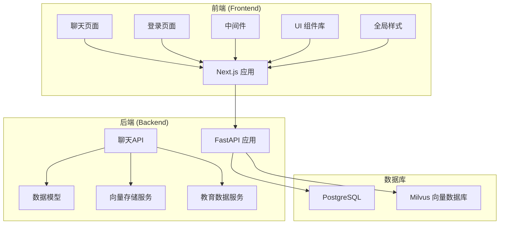

**图表来源**
- [frontend/src/app/chat/page.tsx:1-513](file://frontend/src/app/chat/page.tsx#L1-L513)
- [backend/app/api/chat.py:1-249](file://backend/app/api/chat.py#L1-L249)

**章节来源**
- [frontend/src/app/chat/page.tsx:1-513](file://frontend/src/app/chat/page.tsx#L1-L513)
- [backend/app/api/chat.py:1-249](file://backend/app/api/chat.py#L1-L249)

## 核心组件

### 聊天界面组件

聊天界面是整个系统的核心组件，采用了现代化的设计理念和用户体验优化：

#### 主要功能特性：
- **响应式设计**：支持桌面和移动设备的自适应布局
- **实时对话**：基于HTTP请求的即时消息传递
- **对话历史**：完整的对话记录和管理功能
- **用户认证**：基于学号的简单认证机制
- **快捷问题**：预设的常见问题模板
- **会话持久化**：自动保存和恢复对话状态

#### UI组件架构：

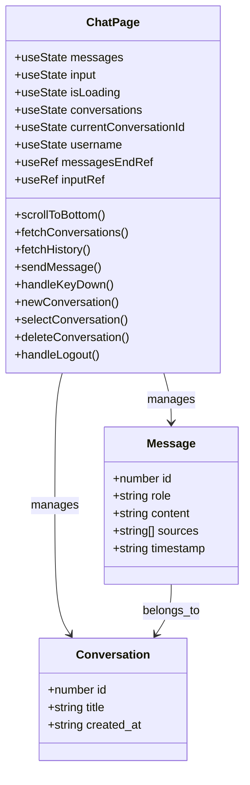

**图表来源**
- [frontend/src/app/chat/page.tsx:25-38](file://frontend/src/app/chat/page.tsx#L25-L38)

**章节来源**
- [frontend/src/app/chat/page.tsx:40-513](file://frontend/src/app/chat/page.tsx#L40-L513)

### 会话管理增强

**更新** 系统现在实现了完整的会话管理增强功能：

#### 会话持久化机制：
- **localStorage集成**：自动保存当前对话ID到浏览器本地存储
- **自动恢复功能**：页面加载时自动恢复之前的对话状态
- **跨页面保持**：用户离开页面后返回时自动恢复对话
- **状态同步**：当前会话ID与UI状态保持同步

#### 会话恢复流程：

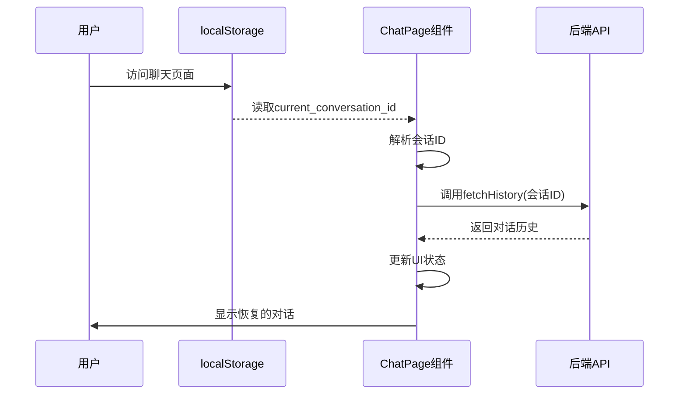

**图表来源**
- [frontend/src/app/chat/page.tsx:189-209](file://frontend/src/app/chat/page.tsx#L189-L209)
- [frontend/src/app/chat/page.tsx:218-225](file://frontend/src/app/chat/page.tsx#L218-L225)

**章节来源**
- [frontend/src/app/chat/page.tsx:189-225](file://frontend/src/app/chat/page.tsx#L189-L225)

### 后端API架构

后端采用RESTful API设计，提供了完整的聊天功能：

#### API端点设计：
- `/api/chat/send` - 发送消息并获取AI回复
- `/api/chat/conversations/{username}` - 获取用户对话列表
- `/api/chat/history/{conversation_id}` - 获取对话历史
- `/api/chat/conversations/{conversation_id}` - 删除对话

#### 数据模型关系：

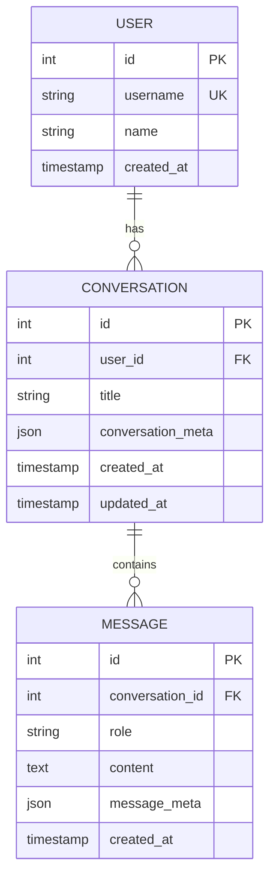

**图表来源**
- [backend/app/models/conversation.py:11-42](file://backend/app/models/conversation.py#L11-L42)

**章节来源**
- [backend/app/api/chat.py:46-249](file://backend/app/api/chat.py#L46-L249)
- [backend/app/models/conversation.py:11-42](file://backend/app/models/conversation.py#L11-L42)

## 架构概览

系统采用现代全栈架构，实现了前后端分离和微服务化设计：

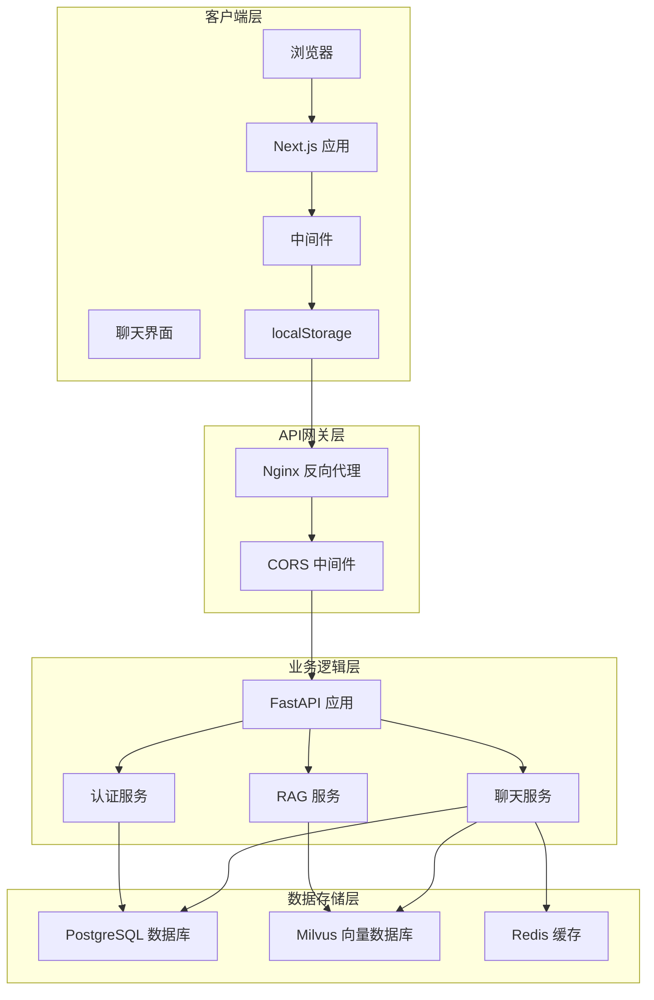

**图表来源**
- [backend/main.py:39-79](file://backend/main.py#L39-L79)
- [frontend/src/middleware.ts:1-48](file://frontend/src/middleware.ts#L1-L48)

## 详细组件分析

### 聊天界面交互流程

#### 消息发送流程：

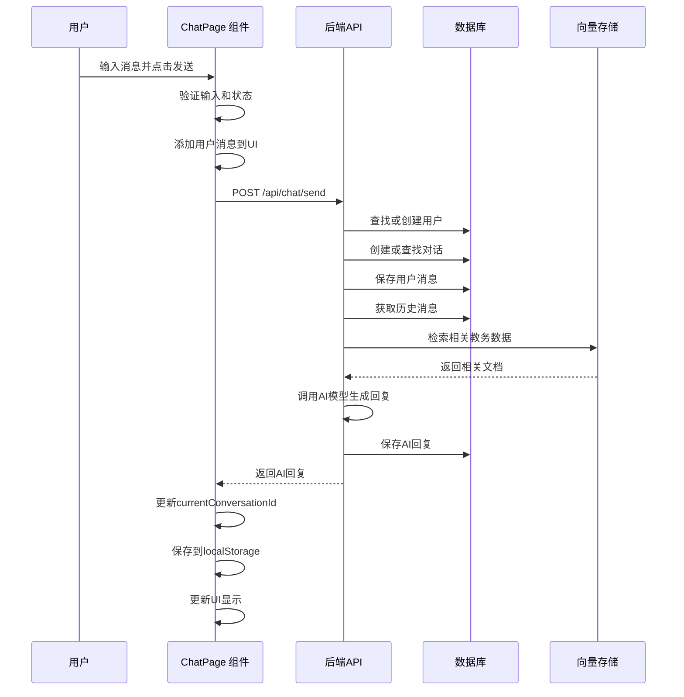

**图表来源**
- [frontend/src/app/chat/page.tsx:95-150](file://frontend/src/app/chat/page.tsx#L95-L150)
- [backend/app/api/chat.py:46-172](file://backend/app/api/chat.py#L46-L172)

#### 对话历史管理流程：

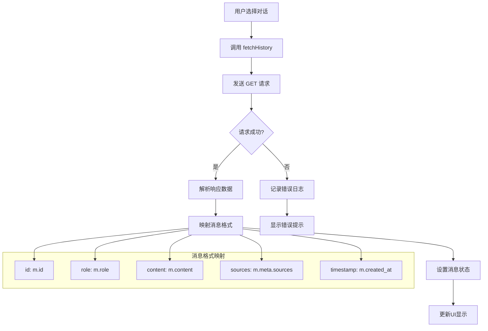

**图表来源**
- [frontend/src/app/chat/page.tsx:76-93](file://frontend/src/app/chat/page.tsx#L76-L93)
- [backend/app/api/chat.py:206-229](file://backend/app/api/chat.py#L206-L229)

**章节来源**
- [frontend/src/app/chat/page.tsx:76-150](file://frontend/src/app/chat/page.tsx#L76-L150)
- [backend/app/api/chat.py:181-249](file://backend/app/api/chat.py#L181-L249)

### 会话管理增强机制

**更新** 会话管理现在包含以下增强功能：

#### 会话持久化策略：
- **localStorage存储**：使用`current_conversation_id`键存储当前会话ID
- **自动保存**：当`currentConversationId`变化时自动保存到localStorage
- **自动恢复**：页面加载时从localStorage读取并恢复会话状态
- **状态同步**：确保UI状态与localStorage保持一致

#### 会话恢复流程：

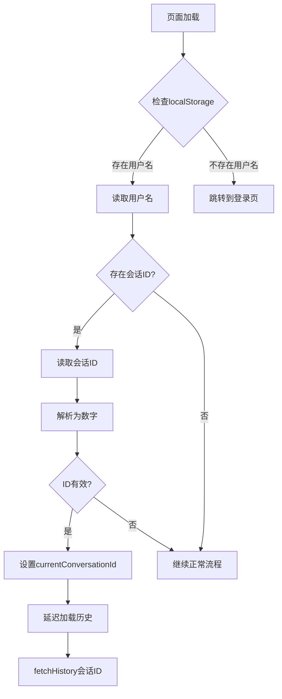

**图表来源**
- [frontend/src/app/chat/page.tsx:189-209](file://frontend/src/app/chat/page.tsx#L189-L209)

#### 会话清理机制：
- **新建对话**：清除localStorage中的会话ID
- **删除对话**：自动清理相关会话数据
- **退出登录**：清除用户名和会话ID
- **状态同步**：确保localStorage与UI状态一致

**章节来源**
- [frontend/src/app/chat/page.tsx:160-187](file://frontend/src/app/chat/page.tsx#L160-L187)
- [frontend/src/app/chat/page.tsx:218-234](file://frontend/src/app/chat/page.tsx#L218-L234)

### 实时消息交互机制

虽然系统目前使用HTTP请求实现消息传递，但具备扩展为WebSocket的能力：

#### 当前实现特点：
- **同步请求**：每次消息发送都触发独立的HTTP请求
- **即时反馈**：用户输入后立即显示，AI回复后更新
- **状态管理**：使用React状态管理消息和加载状态
- **错误处理**：统一的错误捕获和用户提示

#### WebSocket扩展建议：
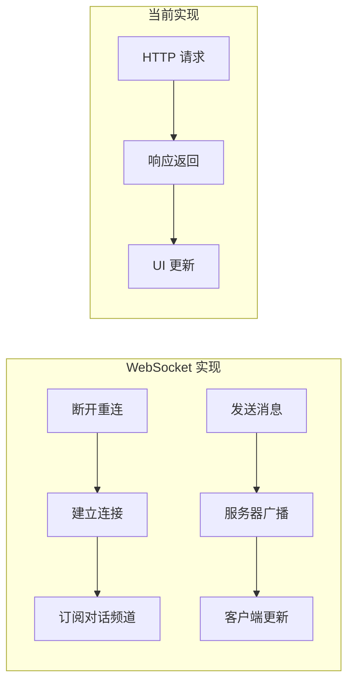

**章节来源**
- [frontend/src/app/chat/page.tsx:95-150](file://frontend/src/app/chat/page.tsx#L95-L150)

### 对话历史管理

#### 持久化策略：
- **数据库存储**：所有对话和消息存储在PostgreSQL中
- **历史限制**：每次请求获取最近10条消息
- **元数据存储**：AI回复的来源和使用统计信息

#### 滚动行为优化：
- **自动滚动**：新消息到达时自动滚动到底部
- **位置保持**：用户手动滚动时保持当前位置
- **性能优化**：大量消息时的虚拟滚动考虑

**章节来源**
- [backend/app/api/chat.py:92-96](file://backend/app/api/chat.py#L92-L96)
- [frontend/src/app/chat/page.tsx:53-60](file://frontend/src/app/chat/page.tsx#L53-L60)

### AI回复处理流程

#### RAG检索流程：

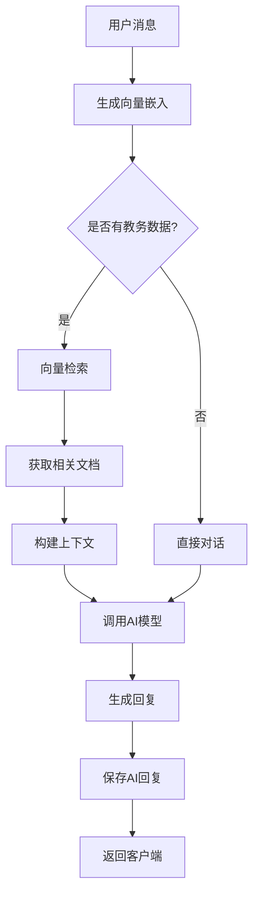

**图表来源**
- [backend/app/api/chat.py:123-146](file://backend/app/api/chat.py#L123-L146)

#### 错误处理机制：
- **HTTP异常**：统一的HTTP状态码处理
- **数据库异常**：事务回滚和错误恢复
- **AI服务异常**：降级到基础对话模式
- **网络异常**：重试机制和用户提示

**章节来源**
- [backend/app/api/chat.py:174-178](file://backend/app/api/chat.py#L174-L178)

### 用户输入验证和消息格式化

#### 输入验证规则：
- **非空检查**：确保消息不为空
- **长度限制**：合理的消息长度控制
- **状态检查**：防止重复提交
- **认证检查**：确保用户已登录

#### 消息格式化：
- **时间戳格式**：本地化的时间显示
- **来源标注**：AI回复的引用来源
- **HTML安全**：防止XSS攻击
- **换行处理**：保持原始格式

**章节来源**
- [frontend/src/app/chat/page.tsx:96-106](file://frontend/src/app/chat/page.tsx#L96-L106)

## 依赖关系分析

### 前端依赖关系：

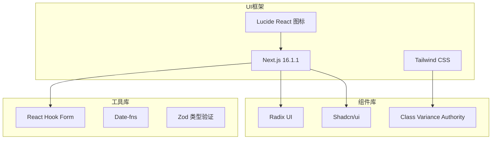

**图表来源**
- [package.json:55-68](file://package.json#L55-L68)

### 后端依赖关系：

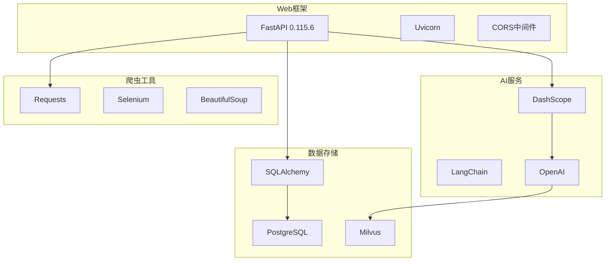

**图表来源**
- [backend/requirements.txt:2-44](file://backend/requirements.txt#L2-L44)

**章节来源**
- [package.json:12-92](file://package.json#L12-L92)
- [backend/requirements.txt:1-44](file://backend/requirements.txt#L1-L44)

## 性能考虑

### 前端性能优化：

#### 渲染优化：
- **虚拟滚动**：大量消息时的性能考虑
- **懒加载**：对话历史的分页加载
- **防抖处理**：输入框的防抖优化
- **缓存策略**：对话列表的本地缓存

#### 加载优化：
- **骨架屏**：长时间加载的视觉反馈
- **渐进式加载**：消息的逐步显示
- **并发请求**：多个API请求的并发处理

#### 会话管理优化：
- **延迟加载**：会话恢复时的延迟加载避免阻塞
- **状态同步**：localStorage操作的节流处理
- **内存管理**：及时清理不需要的会话数据

### 后端性能优化：

#### 数据库优化：
- **索引策略**：用户ID和时间戳的索引
- **查询优化**：历史消息的高效查询
- **连接池**：数据库连接的复用

#### AI服务优化：
- **向量缓存**：相似查询的结果缓存
- **批量处理**：多个用户的并发处理
- **资源限制**：AI调用的配额控制

## 故障排除指南

### 常见问题诊断：

#### 前端问题：
- **消息发送失败**：检查网络连接和API可达性
- **界面卡顿**：监控消息数量和渲染性能
- **样式异常**：验证Tailwind配置和CSS类名
- **会话恢复失败**：检查localStorage访问权限

#### 后端问题：
- **数据库连接失败**：检查连接字符串和权限
- **AI服务超时**：监控API响应时间和错误率
- **向量检索失败**：验证Milvus连接和数据完整性

#### 性能问题：
- **响应缓慢**：分析数据库查询和AI调用时间
- **内存泄漏**：监控组件生命周期和事件监听器
- **并发问题**：检查API限流和资源竞争

#### 会话管理问题：
- **会话丢失**：检查localStorage存储容量和权限
- **恢复延迟**：监控网络请求和API响应时间
- **状态不同步**：检查effect依赖和状态更新逻辑

**章节来源**
- [frontend/src/app/chat/page.tsx:189-209](file://frontend/src/app/chat/page.tsx#L189-L209)
- [backend/app/api/chat.py:206-229](file://backend/app/api/chat.py#L206-L229)

## 结论

智能教务系统AI助手展现了现代全栈应用的最佳实践，结合了优秀的前端开发技术和强大的后端服务架构。系统的主要优势包括：

### 技术亮点：
- **现代化架构**：前后端分离和微服务化设计
- **用户体验**：响应式设计和流畅的交互体验
- **功能完整**：从认证到AI对话的完整业务流程
- **可扩展性**：模块化的组件设计和清晰的依赖关系
- **会话管理增强**：智能的会话持久化和自动恢复机制

### 会话管理增强：
- **智能持久化**：自动保存当前对话状态到localStorage
- **无缝恢复**：用户返回页面时自动恢复之前的对话
- **状态同步**：确保UI状态与本地存储保持一致
- **清理机制**：完善的会话清理和数据管理

### 改进建议：
- **实时通信**：考虑引入WebSocket实现真正的实时聊天
- **性能优化**：实施虚拟滚动和更高效的缓存策略
- **监控完善**：增加详细的性能指标和错误追踪
- **安全性增强**：加强输入验证和API安全防护
- **会话管理优化**：进一步优化会话恢复的性能和可靠性

该系统为校园AI助手应用提供了一个坚实的技术基础，能够支持未来更多的功能扩展和性能优化需求。会话管理增强功能显著提升了用户体验，使用户能够在不同页面间无缝切换而不会丢失对话状态。