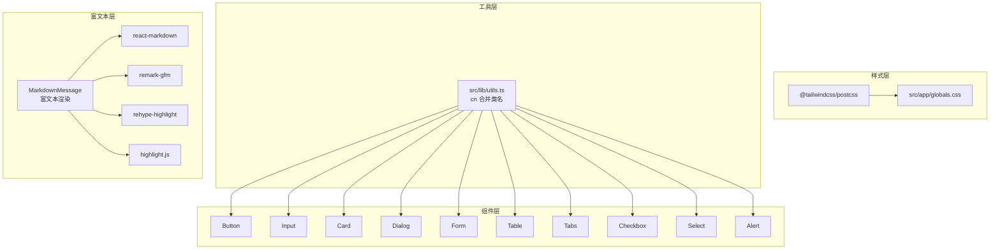
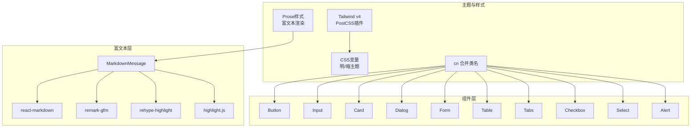
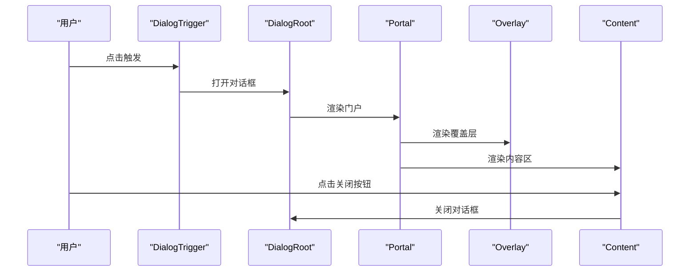
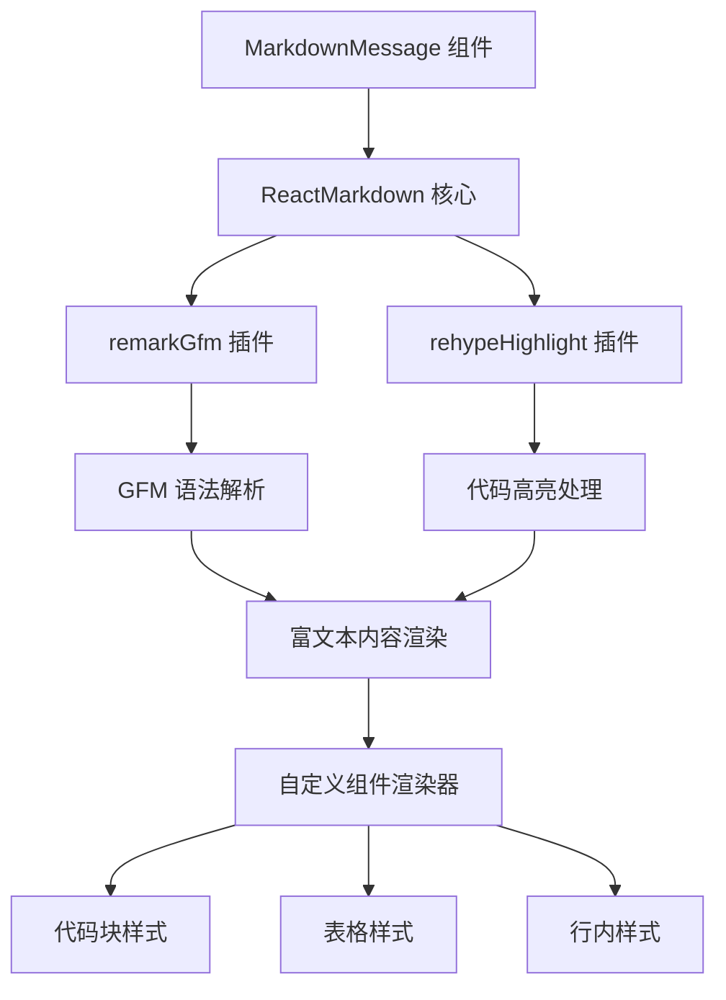
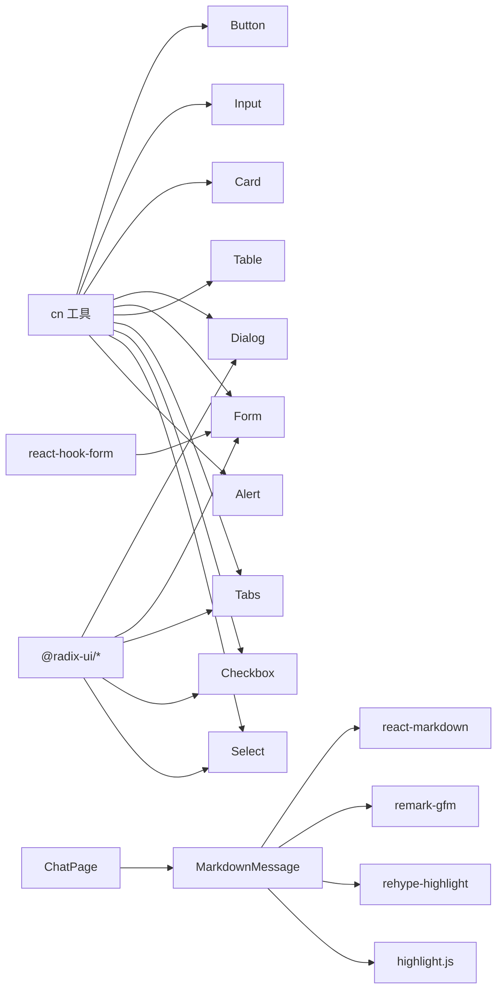

# UI组件库与样式系统

<cite>
**本文引用的文件**
- [components.json](file://components.json)
- [package.json](file://package.json)
- [postcss.config.mjs](file://postcss.config.mjs)
- [next.config.ts](file://next.config.ts)
- [src/lib/utils.ts](file://src/lib/utils.ts)
- [src/components/ui/button.tsx](file://src/components/ui/button.tsx)
- [src/components/ui/input.tsx](file://src/components/ui/input.tsx)
- [src/components/ui/card.tsx](file://src/components/ui/card.tsx)
- [src/components/ui/dialog.tsx](file://src/components/ui/dialog.tsx)
- [src/components/ui/form.tsx](file://src/components/ui/form.tsx)
- [src/components/ui/table.tsx](file://src/components/ui/table.tsx)
- [src/components/ui/tabs.tsx](file://src/components/ui/tabs.tsx)
- [src/components/ui/checkbox.tsx](file://src/components/ui/checkbox.tsx)
- [src/components/ui/select.tsx](file://src/components/ui/select.tsx)
- [src/components/ui/alert.tsx](file://src/components/ui/alert.tsx)
- [frontend/src/components/MarkdownMessage.tsx](file://frontend/src/components/MarkdownMessage.tsx)
- [frontend/src/app/chat/page.tsx](file://frontend/src/app/chat/page.tsx)
- [frontend/package.json](file://frontend/package.json)
- [src/hooks/use-mobile.ts](file://src/hooks/use-mobile.ts)
- [src/app/globals.css](file://src/app/globals.css)
</cite>

## 更新摘要
**变更内容**
- 新增MarkdownMessage组件，支持富文本渲染和代码高亮功能
- 更新聊天界面以支持Markdown内容显示
- 添加react-markdown、remark-gfm、rehype-highlight等富文本处理依赖
- 增强AI助手的消息展示能力，支持代码块、表格等富文本格式

## 目录
1. [简介](#简介)
2. [项目结构](#项目结构)
3. [核心组件](#核心组件)
4. [架构总览](#架构总览)
5. [组件详解](#组件详解)
6. [富文本渲染系统](#富文本渲染系统)
7. [依赖关系分析](#依赖关系分析)
8. [性能与可访问性](#性能与可访问性)
9. [样式调试与维护指南](#样式调试与维护指南)
10. [故障排查](#故障排查)
11. [结论](#结论)

## 简介
本文件面向智能教务系统AI助手的前端UI组件库与样式系统，聚焦于Shadcn/UI风格的组件集成与定制化使用，涵盖组件导入、样式覆盖与主题配置；对Button、Input、Card、Dialog等常用组件进行属性与事件说明；解释Tailwind CSS在本项目中的使用模式（含命名、响应式断点与自定义变量）；总结组件组合与复用策略；并提供可访问性、性能优化与浏览器兼容性的最佳实践及样式调试与维护建议。

**更新** 新增MarkdownMessage组件，支持富文本渲染和代码高亮，增强AI助手的消息展示能力。

## 项目结构
- 组件库位于 src/components/ui，采用按功能拆分的模块化组织，每个组件独立导出，便于按需引入与复用。
- 富文本渲染系统位于frontend/src/components，包含MarkdownMessage组件专门处理Markdown内容渲染。
- 样式系统基于 Tailwind CSS v4，通过 PostCSS 插件启用，全局样式集中于 src/app/globals.css，并以CSS变量驱动明暗主题切换。
- 工具函数 cn 聚合 clsx 与 tailwind-merge，用于合并与去重类名，保证样式优先级与覆盖可控。
- 组件多采用 Radix UI 原子能力与 class-variance-authority 的变体系统，统一风格与交互一致性。

**图表来源**
- [postcss.config.mjs:1-8](file://postcss.config.mjs#L1-L8)
- [src/app/globals.css:1-69](file://src/app/globals.css#L1-L69)
- [src/lib/utils.ts:1-7](file://src/lib/utils.ts#L1-L7)
- [frontend/src/components/MarkdownMessage.tsx:1-73](file://frontend/src/components/MarkdownMessage.tsx#L1-L73)
- [frontend/src/app/chat/page.tsx:1-567](file://frontend/src/app/chat/page.tsx#L1-L567)

**章节来源**
- [components.json:1-22](file://components.json#L1-L22)
- [package.json:1-92](file://package.json#L1-L92)
- [postcss.config.mjs:1-8](file://postcss.config.mjs#L1-L8)
- [src/app/globals.css:1-69](file://src/app/globals.css#L1-L69)
- [src/lib/utils.ts:1-7](file://src/lib/utils.ts#L1-L7)

## 核心组件
- Button：支持多种变体与尺寸，具备可选的asChild渲染，适配图标按钮与链接按钮场景。
- Input：基础输入框，内置焦点与无效态样式，支持占位符与选择态。
- Card：卡片容器及其头部、标题、描述、内容、底部、操作区域，支持网格布局与响应式断点。
- Dialog：模态对话框，包含触发器、门户、覆盖层、内容、标题、描述与页脚，支持关闭按钮与动画。
- Form：表单上下文与字段上下文，配合 react-hook-form 提供标签、控制、描述与错误信息管理。
- Table：表格容器与表头、表体、表尾、行、单元格、标题单元格与标题，支持滚动容器与悬停/选中态。
- Tabs：选项卡根容器、列表、触发器与内容区，支持激活态样式与键盘导航。
- Checkbox：复选框原语，支持选中态与指示器。
- Select：下拉选择，支持组、值、触发器（含尺寸）、内容面板、项、分隔符与滚动按钮。
- Alert：警示容器，支持默认与破坏性两种变体，内部含标题与描述区域。

**更新** 新增MarkdownMessage组件，专门处理富文本渲染，支持代码高亮、表格显示等功能。

**章节来源**
- [src/components/ui/button.tsx:1-63](file://src/components/ui/button.tsx#L1-L63)
- [src/components/ui/input.tsx:1-22](file://src/components/ui/input.tsx#L1-L22)
- [src/components/ui/card.tsx:1-93](file://src/components/ui/card.tsx#L1-L93)
- [src/components/ui/dialog.tsx:1-144](file://src/components/ui/dialog.tsx#L1-L144)
- [src/components/ui/form.tsx:1-168](file://src/components/ui/form.tsx#L1-L168)
- [src/components/ui/table.tsx:1-117](file://src/components/ui/table.tsx#L1-L117)
- [src/components/ui/tabs.tsx:1-67](file://src/components/ui/tabs.tsx#L1-L67)
- [src/components/ui/checkbox.tsx:1-33](file://src/components/ui/checkbox.tsx#L1-L33)
- [src/components/ui/select.tsx:1-191](file://src/components/ui/select.tsx#L1-L191)
- [src/components/ui/alert.tsx:1-67](file://src/components/ui/alert.tsx#L1-L67)
- [frontend/src/components/MarkdownMessage.tsx:1-73](file://frontend/src/components/MarkdownMessage.tsx#L1-L73)

## 架构总览
- 组件风格：采用 Shadcn/UI 风格，通过 class-variance-authority 定义变体与默认样式，结合 Radix UI 提供无障碍与可访问性。
- 样式系统：Tailwind CSS v4 通过 PostCSS 插件启用，全局CSS变量驱动明暗主题，cn 工具负责类名合并与冲突消除。
- 主题与颜色：使用 oklch 颜色空间，定义背景、前景、卡片、弹出层、主要/次要、边框、输入、环形光晕等变量，并在明/暗两套值之间切换。
- 响应式与断点：广泛使用 sm/md 等 Tailwind 断点，部分组件使用自定义容器查询与网格布局。
- 可访问性：组件普遍设置 role、aria-* 属性与键盘交互，确保屏幕阅读器友好。
- 富文本系统：新增MarkdownMessage组件，基于react-markdown提供富文本渲染，支持GFM语法和代码高亮。

**图表来源**
- [src/app/globals.css:1-69](file://src/app/globals.css#L1-L69)
- [postcss.config.mjs:1-8](file://postcss.config.mjs#L1-L8)
- [src/lib/utils.ts:1-7](file://src/lib/utils.ts#L1-L7)
- [frontend/src/components/MarkdownMessage.tsx:1-73](file://frontend/src/components/MarkdownMessage.tsx#L1-L73)

## 组件详解

### Button 按钮
- 功能要点
  - 支持多种变体（默认、破坏性、描边、次级、幽灵、链接）与尺寸（默认、小、大、图标系列）。
  - 支持 asChild 将渲染节点替换为 Slot，便于包裹链接或自定义元素。
  - 内置焦点可见性与无效态样式，支持 SVG 图标尺寸与对齐。
- 关键属性
  - className：追加自定义样式
  - variant：变体类型
  - size：尺寸类型
  - asChild：是否作为子节点渲染
  - 其余透传至原生 button
- 事件处理
  - onClick 等标准事件由透传属性支持，无需额外封装
- 最佳实践
  - 图标按钮建议使用 icon 或 icon-sm 尺寸
  - 禁用态保持不可交互，避免视觉误导

**章节来源**
- [src/components/ui/button.tsx:1-63](file://src/components/ui/button.tsx#L1-L63)

### Input 输入框
- 功能要点
  - 默认提供圆角、边框、阴影与过渡效果
  - 焦点态与无效态具备环形光晕与边框高亮
  - 支持占位符与选择态样式
- 关键属性
  - className：追加自定义样式
  - type：原生 input 类型
  - 其余透传至原生 input
- 事件处理
  - onChange、onFocus、onBlur 等由透传属性支持

**章节来源**
- [src/components/ui/input.tsx:1-22](file://src/components/ui/input.tsx#L1-L22)

### Card 卡片
- 功能要点
  - 卡片容器、头部、标题、描述、内容、底部与操作区域
  - 头部支持网格布局与"存在操作时"的列排布
  - 内容区域与底部提供内边距与分隔线约定
- 关键属性
  - className：追加自定义样式
- 使用建议
  - 将操作按钮放置于 CardAction，标题与描述置于 CardHeader 下

**章节来源**
- [src/components/ui/card.tsx:1-93](file://src/components/ui/card.tsx#L1-L93)

### Dialog 对话框
- 功能要点
  - Root、Trigger、Portal、Overlay、Content、Header、Footer、Title、Description
  - 支持显示/隐藏动画与居中定位
  - 可选关闭按钮，具备无障碍标签
- 关键属性
  - showCloseButton：是否渲染关闭按钮
  - className：追加自定义样式
  - 其余透传至对应 Radix 组件
- 事件处理
  - 打开/关闭状态由 Root 控制，关闭按钮通过 Close 触发

**图表来源**
- [src/components/ui/dialog.tsx:1-144](file://src/components/ui/dialog.tsx#L1-L144)

**章节来源**
- [src/components/ui/dialog.tsx:1-144](file://src/components/ui/dialog.tsx#L1-L144)

### Form 表单
- 功能要点
  - FormProvider、FormField、useFormField 提供上下文与字段状态
  - FormItem、FormLabel、FormControl、FormDescription、FormMessage 组合形成可访问的表单结构
  - 自动注入 aria-* 属性与错误提示
- 关键属性
  - FormField 接受 react-hook-form 的 ControllerProps
  - FormLabel、FormControl、FormMessage 通过上下文读取字段 ID 与错误信息
- 最佳实践
  - 为每个字段提供唯一 name，并在 FormItem 中组合 Label 与 Control
  - 错误信息通过 FormMessage 渲染，避免手动拼接

**章节来源**
- [src/components/ui/form.tsx:1-168](file://src/components/ui/form.tsx#L1-L168)

### Table 表格
- 功能要点
  - Table 容器提供横向滚动
  - 表头、表体、表尾、行、单元格、标题单元格与标题支持悬停与选中态
- 关键属性
  - className：追加自定义样式
- 使用建议
  - 在 TableContainer 中嵌入 table，确保横向溢出可滚动

**章节来源**
- [src/components/ui/table.tsx:1-117](file://src/components/ui/table.tsx#L1-L117)

### Tabs 选项卡
- 功能要点
  - Tabs、TabsList、TabsTrigger、TabsContent 提供选项卡容器与触发器
  - 激活态具备边框与阴影，支持键盘导航
- 关键属性
  - className：追加自定义样式
  - TabsTrigger 支持 data-state 判定激活态

**章节来源**
- [src/components/ui/tabs.tsx:1-67](file://src/components/ui/tabs.tsx#L1-L67)

### Checkbox 复选框
- 功能要点
  - 基于 Radix UI Checkbox，支持选中态与指示器图标
  - 焦点态与无效态具备环形光晕与边框高亮
- 关键属性
  - className：追加自定义样式
  - 透传至原生 Checkbox 原语

**章节来源**
- [src/components/ui/checkbox.tsx:1-33](file://src/components/ui/checkbox.tsx#L1-L33)

### Select 下拉选择
- 功能要点
  - Select、SelectTrigger（含尺寸）、SelectContent、SelectItem、SelectLabel、SelectSeparator、SelectScrollUp/DownButton
  - 支持弹出位置、对齐与滚动按钮
- 关键属性
  - size：触发器尺寸（sm/default）
  - position：内容面板位置（item-aligned/popper）
  - align：对齐方式
  - className：追加自定义样式
- 最佳实践
  - 使用 SelectValue 作为占位文本，SelectItem 中展示选项
  - 长列表配合滚动按钮提升可用性

**章节来源**
- [src/components/ui/select.tsx:1-191](file://src/components/ui/select.tsx#L1-L191)

### Alert 警示
- 功能要点
  - 支持默认与破坏性变体，内部含标题与描述区域
  - 图标与内容区域采用网格布局，自动适配图标存在与否
- 关键属性
  - variant：变体类型
  - className：追加自定义样式

**章节来源**
- [src/components/ui/alert.tsx:1-67](file://src/components/ui/alert.tsx#L1-L67)

## 富文本渲染系统

### MarkdownMessage 组件
- 功能要点
  - 基于 react-markdown 提供富文本渲染
  - 支持 GitHub Flavored Markdown (GFM) 语法
  - 集成代码高亮功能，支持多种编程语言
  - 自定义表格渲染，支持响应式表格显示
  - 内置暗色主题适配
- 核心特性
  - 代码块高亮：支持行内代码和预格式化代码块
  - 表格渲染：响应式表格，支持表头和单元格样式
  - GFM支持：支持任务列表、删除线等扩展语法
  - 主题适配：自动适配明暗主题切换
- 关键属性
  - content：要渲染的Markdown内容字符串
- 自定义渲染器
  - code：区分行内代码和代码块，提供不同样式
  - pre：为代码块提供滚动容器和边框样式
  - table/th/td：自定义表格样式，支持响应式布局

**图表来源**
- [frontend/src/components/MarkdownMessage.tsx:1-73](file://frontend/src/components/MarkdownMessage.tsx#L1-L73)

**章节来源**
- [frontend/src/components/MarkdownMessage.tsx:1-73](file://frontend/src/components/MarkdownMessage.tsx#L1-L73)

### 聊天界面富文本集成
- 集成方式
  - AI助手消息使用 MarkdownMessage 组件渲染
  - 用户消息保持原有纯文本显示
  - 支持代码块、表格、列表等富文本格式
- 渲染策略
  - assistant 角色消息通过 MarkdownMessage 渲染
  - user 角色消息直接显示文本内容
  - 自动处理 Markdown 解析和样式应用
- 性能优化
  - 按需渲染，只对AI消息进行富文本处理
  - 缓存渲染结果，避免重复解析
  - 限制最大渲染长度，防止内存溢出

**章节来源**
- [frontend/src/app/chat/page.tsx:479-483](file://frontend/src/app/chat/page.tsx#L479-L483)
- [frontend/src/app/chat/page.tsx:14-20](file://frontend/src/app/chat/page.tsx#L14-L20)

## 依赖关系分析
- 组件依赖
  - Button、Input、Card、Dialog、Form、Table、Tabs、Checkbox、Select、Alert 均依赖 cn 工具进行类名合并
  - 大多数组件依赖 Radix UI 原语以实现无障碍与状态同步
  - Form 组件依赖 react-hook-form 上下文
- 富文本依赖
  - MarkdownMessage 依赖 react-markdown、remark-gfm、rehype-highlight
  - 代码高亮依赖 highlight.js
  - 聊天界面依赖 MarkdownMessage 组件
- 样式依赖
  - Tailwind v4 通过 PostCSS 插件启用，全局 CSS 变量驱动明/暗主题
  - 组件内部使用 Tailwind 实用类与自定义变量组合
  - 富文本样式通过 prose 类和自定义渲染器实现

**图表来源**
- [src/lib/utils.ts:1-7](file://src/lib/utils.ts#L1-L7)
- [frontend/src/components/MarkdownMessage.tsx:1-73](file://frontend/src/components/MarkdownMessage.tsx#L1-L73)
- [frontend/src/app/chat/page.tsx:4-4](file://frontend/src/app/chat/page.tsx#L4-L4)

**章节来源**
- [package.json:1-92](file://package.json#L1-L92)
- [frontend/package.json:1-96](file://frontend/package.json#L1-L96)
- [src/lib/utils.ts:1-7](file://src/lib/utils.ts#L1-L7)

## 性能与可访问性
- 性能
  - 使用 cn 合并类名，减少重复与冲突，降低样式计算成本
  - 组件尽量无副作用，避免在渲染路径中执行昂贵逻辑
  - 表单与列表组件通过上下文传递状态，减少重复渲染
  - 富文本渲染按需处理，避免不必要的解析
- 可访问性
  - Dialog、Form、Tabs、Select、Checkbox 等组件均设置 role 与 aria-* 属性
  - 提供键盘导航与焦点管理，确保屏幕阅读器友好
  - 富文本内容保持语义化结构，支持屏幕阅读器解析
- 浏览器兼容性
  - Tailwind v4 与 PostCSS 插件已配置，Next.js 构建链路支持现代浏览器特性
  - 富文本渲染依赖现代浏览器的 DOM API
  - 如需兼容旧版浏览器，可在 PostCSS 配置中添加 polyfill 插件

**更新** 新增富文本渲染系统的性能考虑和可访问性保障。

## 样式调试与维护指南
- CSS 变量与主题
  - 明/暗主题通过 CSS 变量切换，可在 :root 与 .dark 中调整颜色值
  - 使用自定义变量如 --radius、--font-sans 等统一设计语言
  - 富文本样式通过 prose 类和自定义渲染器实现主题适配
- Tailwind 类名调试
  - 使用浏览器开发者工具查看元素 data-slot 与 data-* 属性，确认当前变体与尺寸
  - 通过覆盖 className 进行局部调试，避免全局污染
  - 富文本组件可通过 prose 类进行样式微调
- 组件样式覆盖
  - 优先使用变体与尺寸参数；必要时通过 className 覆盖，注意与 cn 的合并顺序
  - 避免使用 !important，优先利用 Tailwind 权重与变量
  - 富文本样式建议通过自定义渲染器而非 !important 覆盖
- 响应式与断点
  - 使用 sm/md 等断点进行移动端适配；复杂布局可结合容器查询
  - 富文本表格支持响应式滚动，适应不同屏幕尺寸
- 组件组合与复用
  - 将通用样式抽离为变体或尺寸参数，减少重复代码
  - 通过上下文与透传属性实现跨组件的状态共享
  - 富文本组件可作为通用渲染器在多个场景中复用

**更新** 新增富文本渲染系统的调试和维护指南。

**章节来源**
- [src/app/globals.css:1-69](file://src/app/globals.css#L1-L69)
- [src/lib/utils.ts:1-7](file://src/lib/utils.ts#L1-L7)
- [frontend/src/components/MarkdownMessage.tsx:14](file://frontend/src/components/MarkdownMessage.tsx#L14-L14)

## 故障排查
- 组件未生效或样式错乱
  - 检查 cn 是否正确合并类名，避免遗漏关键类
  - 确认 Tailwind 插件已启用且构建成功
- 对话框无法关闭或遮罩层异常
  - 确保 DialogTrigger、DialogRoot、DialogPortal 正确组合
  - 检查 showCloseButton 与关闭按钮事件绑定
- 表单字段无错误提示
  - 确认 FormField 包裹 Controller，且 useFormField 正常调用
  - 检查 react-hook-form 的 errors 与 mode 配置
- 移动端布局异常
  - 使用 useIsMobile 获取断点状态，结合 Tailwind 断点进行条件渲染
- 主题切换无效
  - 检查 .dark 类是否正确挂载，CSS 变量是否更新
- 富文本渲染问题
  - 确认 react-markdown、remark-gfm、rehype-highlight 依赖已安装
  - 检查 MarkdownMessage 组件的 props 传入是否正确
  - 验证代码高亮样式文件是否正确加载
  - 确认 Markdown 内容格式符合 GFM 语法规范

**更新** 新增富文本渲染系统的故障排查指南。

**章节来源**
- [src/components/ui/dialog.tsx:1-144](file://src/components/ui/dialog.tsx#L1-L144)
- [src/components/ui/form.tsx:1-168](file://src/components/ui/form.tsx#L1-L168)
- [src/hooks/use-mobile.ts:1-20](file://src/hooks/use-mobile.ts#L1-L20)
- [frontend/src/components/MarkdownMessage.tsx:1-73](file://frontend/src/components/MarkdownMessage.tsx#L1-L73)

## 结论
本项目采用 Tailwind CSS v4 与 Shadcn/UI 风格的组件体系，结合 Radix UI 与 class-variance-authority，实现了高一致性的UI组件库与灵活的主题系统。通过 cn 工具与 CSS 变量，组件在样式覆盖、主题切换与响应式适配上具备良好可维护性。

**更新** 新增的MarkdownMessage组件显著增强了AI助手的消息展示能力，支持富文本渲染、代码高亮和表格显示等功能。该组件基于react-markdown生态系统，提供了完整的GFM语法支持和现代化的代码高亮体验。富文本系统的集成不仅提升了用户体验，也为未来的功能扩展奠定了坚实基础。

建议在实际开发中遵循组件变体与尺寸参数的约定，善用上下文与透传属性，确保可访问性与性能表现。对于富文本内容，建议保持内容结构的语义化，避免过度复杂的样式定制，确保良好的可访问性和维护性。