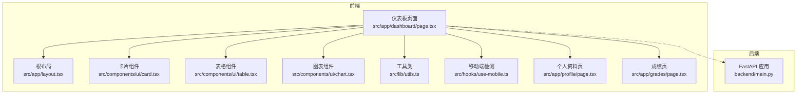
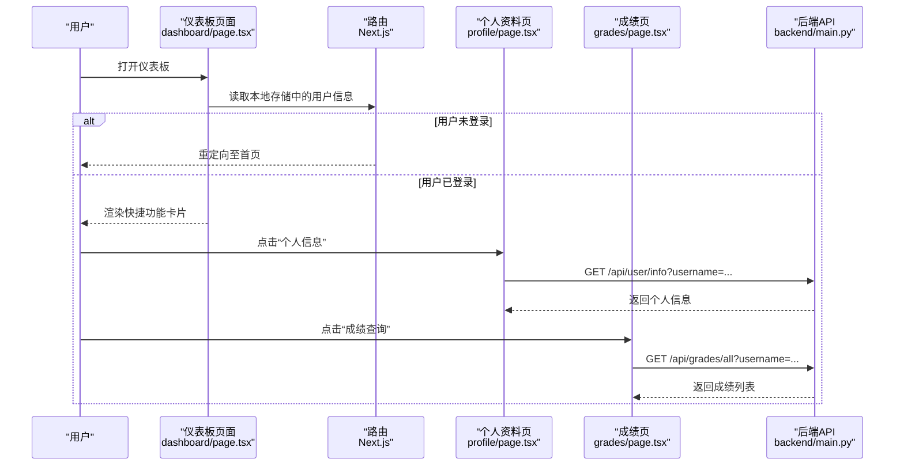
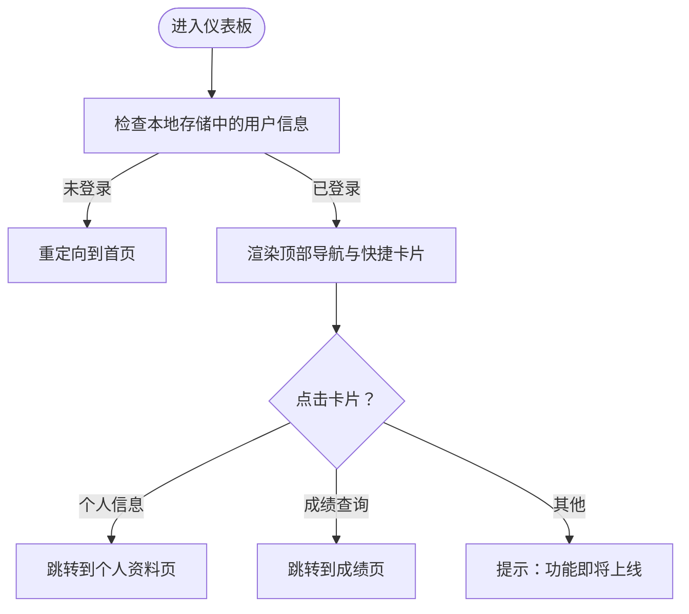
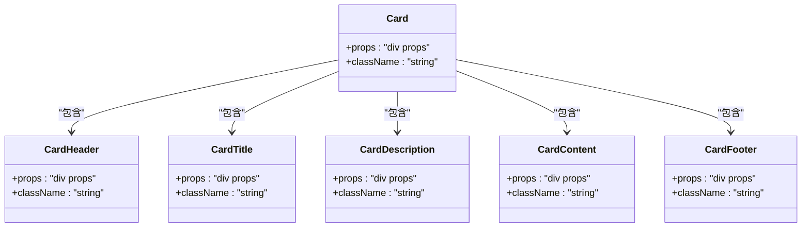
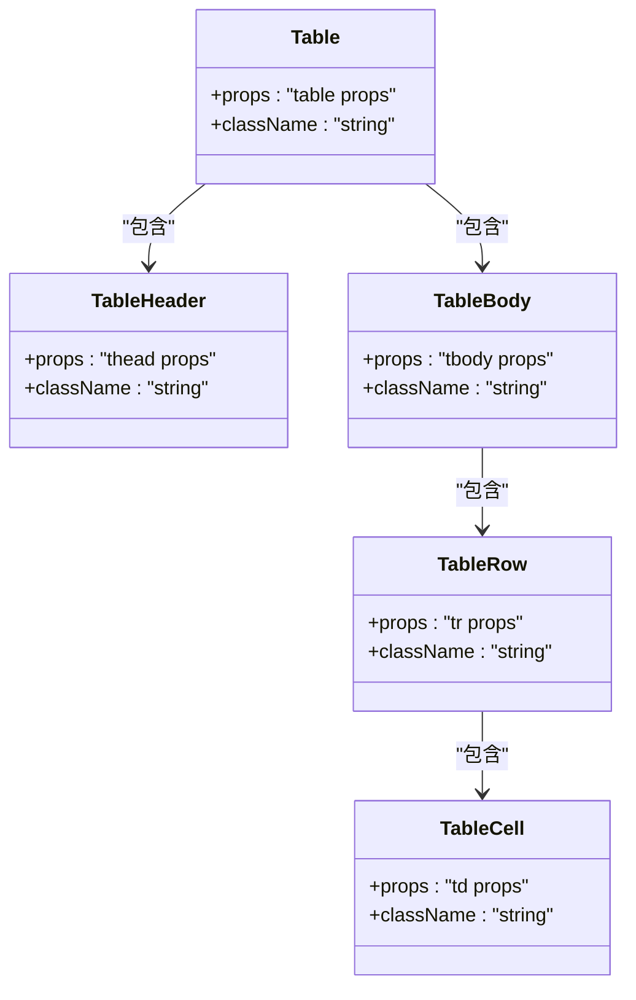
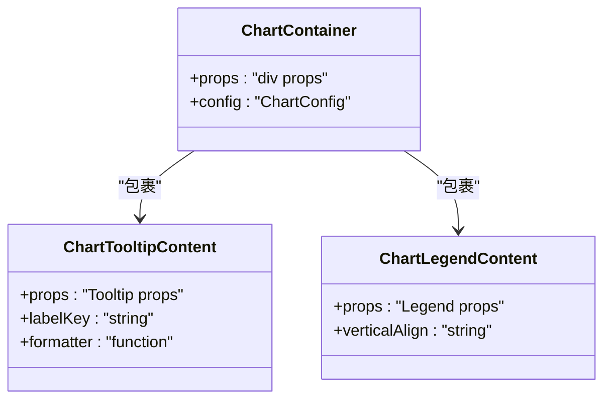
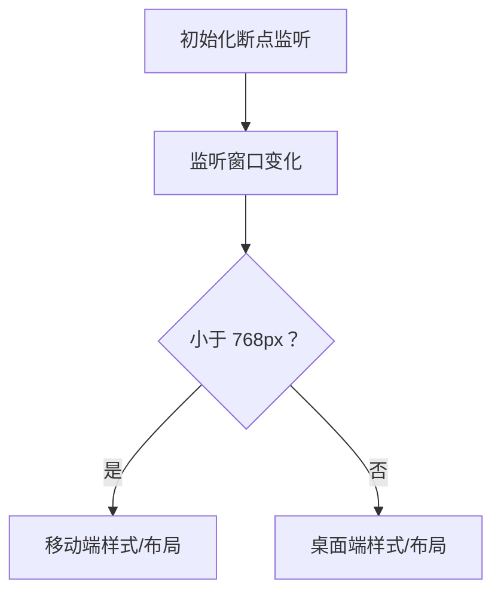
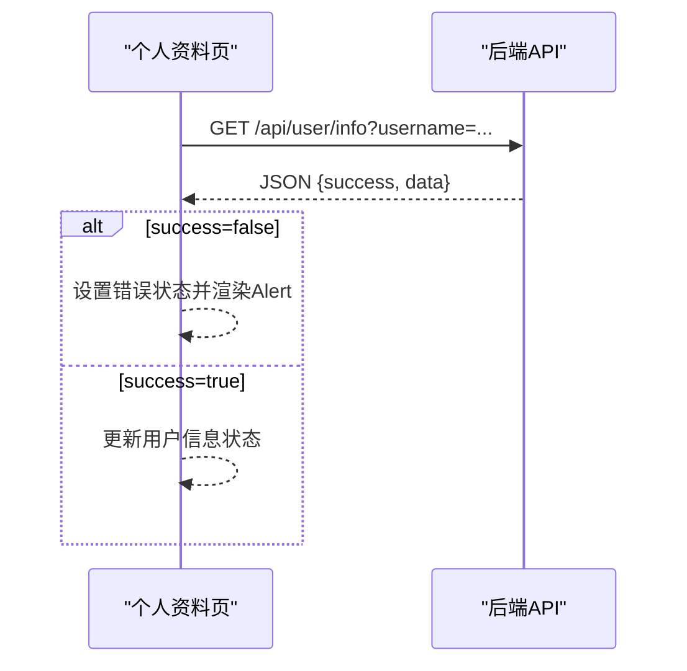
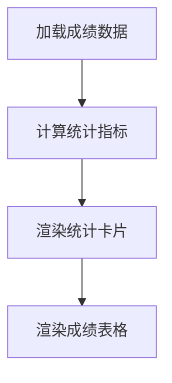
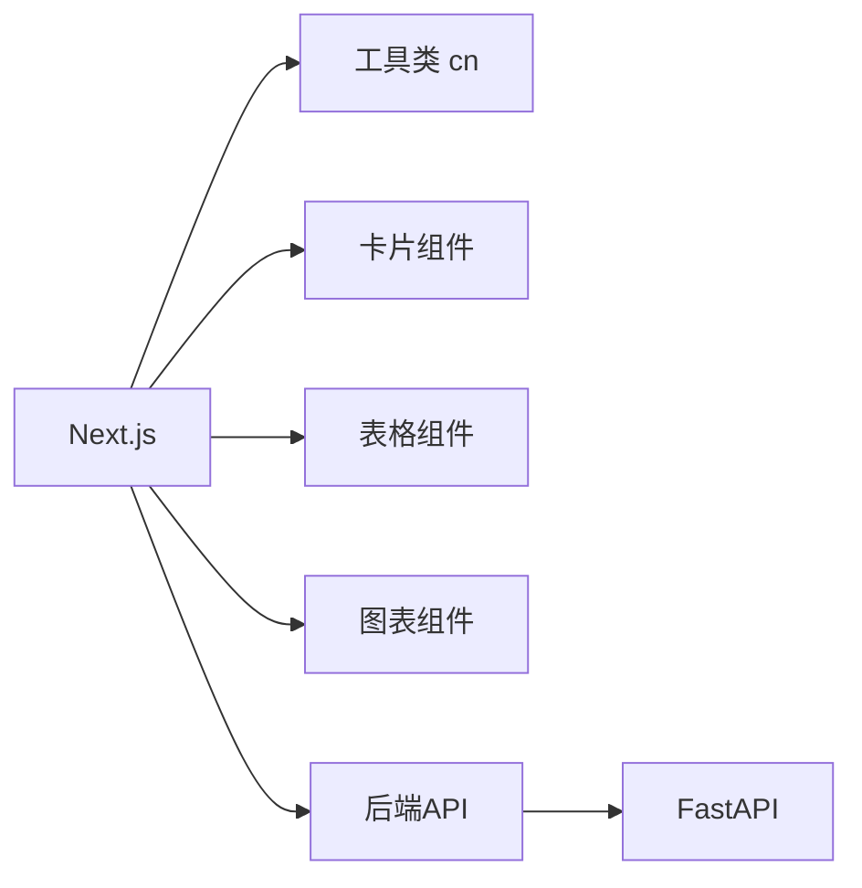

# 仪表板页面与数据展示

<cite>
**本文引用的文件**
- [src/app/dashboard/page.tsx](file://src/app/dashboard/page.tsx)
- [src/app/layout.tsx](file://src/app/layout.tsx)
- [src/components/ui/card.tsx](file://src/components/ui/card.tsx)
- [src/components/ui/chart.tsx](file://src/components/ui/chart.tsx)
- [src/components/ui/table.tsx](file://src/components/ui/table.tsx)
- [src/hooks/use-mobile.ts](file://src/hooks/use-mobile.ts)
- [src/lib/utils.ts](file://src/lib/utils.ts)
- [src/app/profile/page.tsx](file://src/app/profile/page.tsx)
- [src/app/grades/page.tsx](file://src/app/grades/page.tsx)
- [backend/main.py](file://backend/main.py)
- [package.json](file://package.json)
</cite>

## 目录
1. [简介](#简介)
2. [项目结构](#项目结构)
3. [核心组件](#核心组件)
4. [架构总览](#架构总览)
5. [详细组件分析](#详细组件分析)
6. [依赖分析](#依赖分析)
7. [性能考虑](#性能考虑)
8. [故障排查指南](#故障排查指南)
9. [结论](#结论)
10. [附录](#附录)

## 简介
本文件面向“智能教务系统AI助手”的仪表板页面，提供从布局设计、数据可视化到交互与性能优化的完整实现文档。重点涵盖：
- 仪表板的整体布局与响应式设计
- 个人信息展示、快捷功能入口与统计信息呈现
- 数据获取与更新机制（API调用、本地缓存与刷新策略）
- UI组件的使用与集成（卡片、表格、图表）
- 数据格式化与本地化处理方法
- 性能优化与用户体验建议

## 项目结构
前端采用 Next.js 应用程序目录结构，仪表板页面位于 src/app/dashboard/page.tsx；配套 UI 组件位于 src/components/ui；响应式与工具函数位于 hooks 与 lib；后端 API 位于 backend/main.py。

**图示来源**
- [src/app/dashboard/page.tsx:1-181](file://src/app/dashboard/page.tsx#L1-L181)
- [src/app/layout.tsx:1-46](file://src/app/layout.tsx#L1-L46)
- [src/components/ui/card.tsx:1-93](file://src/components/ui/card.tsx#L1-L93)
- [src/components/ui/table.tsx:1-117](file://src/components/ui/table.tsx#L1-L117)
- [src/components/ui/chart.tsx:1-358](file://src/components/ui/chart.tsx#L1-L358)
- [src/lib/utils.ts:1-7](file://src/lib/utils.ts#L1-L7)
- [src/hooks/use-mobile.ts:1-20](file://src/hooks/use-mobile.ts#L1-L20)
- [src/app/profile/page.tsx:1-172](file://src/app/profile/page.tsx#L1-L172)
- [src/app/grades/page.tsx:1-243](file://src/app/grades/page.tsx#L1-L243)
- [backend/main.py:1-853](file://backend/main.py#L1-L853)

**章节来源**
- [src/app/dashboard/page.tsx:1-181](file://src/app/dashboard/page.tsx#L1-L181)
- [src/app/layout.tsx:1-46](file://src/app/layout.tsx#L1-L46)

## 核心组件
- 仪表板页面：负责渲染顶部导航、快捷功能卡片、提示信息等，并通过路由跳转至个人资料与成绩页面。
- 卡片组件：提供统一的卡片容器与标题、描述、内容区域，支持悬停阴影与过渡效果。
- 表格组件：提供表格容器、表头、表体、行、单元格等基础结构，支持横向滚动与悬停态。
- 图表组件：基于 recharts 的封装，支持主题色、样式注入、提示框与图例等。
- 工具类与移动端检测：提供类名合并与断点检测能力，支撑响应式布局。
- 个人资料与成绩页面：演示数据拉取、错误处理、统计计算与表格展示。

**章节来源**
- [src/app/dashboard/page.tsx:6-181](file://src/app/dashboard/page.tsx#L6-L181)
- [src/components/ui/card.tsx:1-93](file://src/components/ui/card.tsx#L1-L93)
- [src/components/ui/table.tsx:1-117](file://src/components/ui/table.tsx#L1-L117)
- [src/components/ui/chart.tsx:1-358](file://src/components/ui/chart.tsx#L1-L358)
- [src/lib/utils.ts:1-7](file://src/lib/utils.ts#L1-L7)
- [src/hooks/use-mobile.ts:1-20](file://src/hooks/use-mobile.ts#L1-L20)
- [src/app/profile/page.tsx:1-172](file://src/app/profile/page.tsx#L1-L172)
- [src/app/grades/page.tsx:1-243](file://src/app/grades/page.tsx#L1-L243)

## 架构总览
仪表板作为前端入口，通过 Next.js 路由与自定义 UI 组件组合实现功能入口与信息展示；后端以 FastAPI 提供统一 API，前端通过 fetch 调用后端接口获取数据。

**图示来源**
- [src/app/dashboard/page.tsx:12-25](file://src/app/dashboard/page.tsx#L12-L25)
- [src/app/profile/page.tsx:34-51](file://src/app/profile/page.tsx#L34-L51)
- [src/app/grades/page.tsx:39-56](file://src/app/grades/page.tsx#L39-L56)
- [backend/main.py:332-367](file://backend/main.py#L332-L367)
- [backend/main.py:440-452](file://backend/main.py#L440-L452)

## 详细组件分析

### 仪表板页面（DashboardPage）
- 登录态校验：通过 localStorage 读取用户信息，未登录则重定向首页。
- 快捷功能入口：提供“个人信息”“成绩查询”等卡片按钮，点击后路由跳转。
- 提示信息：展示开发进度与版本信息。
- 响应式网格：使用 CSS Grid 在不同屏幕尺寸下调整列数。

**图示来源**
- [src/app/dashboard/page.tsx:8-181](file://src/app/dashboard/page.tsx#L8-L181)

**章节来源**
- [src/app/dashboard/page.tsx:8-181](file://src/app/dashboard/page.tsx#L8-L181)

### 卡片组件（Card）
- 结构化布局：CardHeader/CardTitle/CardDescription/CardContent/CardFooter 提供清晰的卡片骨架。
- 样式与主题：通过 cn 合并 Tailwind 类，支持浅色/深色主题下的视觉一致性。
- 交互增强：仪表板中卡片带有 hover 阴影与过渡动画，提升交互体验。

**图示来源**
- [src/components/ui/card.tsx:1-93](file://src/components/ui/card.tsx#L1-L93)

**章节来源**
- [src/components/ui/card.tsx:1-93](file://src/components/ui/card.tsx#L1-L93)

### 表格组件（Table）
- 容器与滚动：Table 外层容器支持横向滚动，避免小屏拥挤。
- 行列结构：TableHeader/TableBody/TableRow/TableCell 提供语义化表格结构。
- 交互态：行悬停高亮与选中态，提升可读性与可操作性。

**图示来源**
- [src/components/ui/table.tsx:1-117](file://src/components/ui/table.tsx#L1-L117)

**章节来源**
- [src/components/ui/table.tsx:1-117](file://src/components/ui/table.tsx#L1-L117)

### 图表组件（Chart）
- 主题与样式：ChartContainer 注入主题色变量，支持浅色/深色模式。
- 提示与图例：ChartTooltipContent 与 ChartLegendContent 提供丰富的交互提示。
- 数据映射：通过 useChart 与配置对象映射数据键与标签，便于扩展。

**图示来源**
- [src/components/ui/chart.tsx:37-70](file://src/components/ui/chart.tsx#L37-L70)
- [src/components/ui/chart.tsx:107-251](file://src/components/ui/chart.tsx#L107-L251)
- [src/components/ui/chart.tsx:255-309](file://src/components/ui/chart.tsx#L255-L309)

**章节来源**
- [src/components/ui/chart.tsx:1-358](file://src/components/ui/chart.tsx#L1-L358)

### 响应式设计与移动端适配
- 断点与 Hook：useIsMobile 基于媒体查询监听窗口宽度，提供移动端断点判断。
- 网格布局：仪表板使用 CSS Grid，在小屏时减少列数，保证内容可读性。
- 表格滚动：Table 外层容器支持横向滚动，避免小屏表格溢出。

**图示来源**
- [src/hooks/use-mobile.ts:1-20](file://src/hooks/use-mobile.ts#L1-L20)
- [src/app/dashboard/page.tsx:60](file://src/app/dashboard/page.tsx#L60)

**章节来源**
- [src/hooks/use-mobile.ts:1-20](file://src/hooks/use-mobile.ts#L1-L20)
- [src/app/dashboard/page.tsx:60](file://src/app/dashboard/page.tsx#L60)

### 数据获取与更新机制
- 登录态与路由：仪表板与子页面均通过 localStorage 校验登录态，未登录则跳转首页。
- API 调用：个人资料与成绩页面分别调用后端对应接口，使用查询参数传递用户名。
- 错误处理：捕获异常并设置错误状态，统一渲染 Alert 提示。
- 加载状态：在请求期间显示加载占位，改善用户体验。

**图示来源**
- [src/app/profile/page.tsx:34-51](file://src/app/profile/page.tsx#L34-L51)
- [backend/main.py:332-367](file://backend/main.py#L332-L367)

**章节来源**
- [src/app/dashboard/page.tsx:12-25](file://src/app/dashboard/page.tsx#L12-L25)
- [src/app/profile/page.tsx:34-51](file://src/app/profile/page.tsx#L34-L51)
- [src/app/grades/page.tsx:39-56](file://src/app/grades/page.tsx#L39-L56)
- [backend/main.py:332-367](file://backend/main.py#L332-L367)
- [backend/main.py:440-452](file://backend/main.py#L440-L452)

### 统计信息与数据格式化
- 成绩统计：在成绩页计算总课程数、总学分、平均分与平均绩点，并以卡片形式展示。
- 数据格式化：成绩按等级区间着色，便于快速识别；数值使用千位分隔与保留小数。

**图示来源**
- [src/app/grades/page.tsx:59-77](file://src/app/grades/page.tsx#L59-L77)
- [src/app/grades/page.tsx:131-174](file://src/app/grades/page.tsx#L131-L174)
- [src/app/grades/page.tsx:197-224](file://src/app/grades/page.tsx#L197-L224)

**章节来源**
- [src/app/grades/page.tsx:59-77](file://src/app/grades/page.tsx#L59-L77)
- [src/app/grades/page.tsx:131-174](file://src/app/grades/page.tsx#L131-L174)
- [src/app/grades/page.tsx:197-224](file://src/app/grades/page.tsx#L197-L224)

### 本地化与国际化
- 文案本地化：当前项目中使用中文文案，若需国际化可在页面层引入 i18n 方案（例如 next-i18n），并在组件中通过 key 引用翻译。
- 数字与日期格式：可借助 date-fns 或 Intl API 进行本地化格式化（已在依赖中引入）。

**章节来源**
- [package.json:47-48](file://package.json#L47-L48)

## 依赖分析
- 前端依赖：Next.js、Tailwind CSS、Radix UI、Recharts、class-variance-authority、clsx、tailwind-merge 等。
- 组件复用：通过 cn 工具与组件变体系统实现一致的样式与交互规范。
- 后端依赖：FastAPI、CORS、requests 等，提供统一 API 接口与跨域支持。

**图示来源**
- [package.json:12-92](file://package.json#L12-L92)
- [src/lib/utils.ts:1-7](file://src/lib/utils.ts#L1-L7)

**章节来源**
- [package.json:12-92](file://package.json#L12-L92)
- [src/lib/utils.ts:1-7](file://src/lib/utils.ts#L1-L7)

## 性能考虑
- 组件懒加载：对非首屏关键组件（如图表）可采用动态导入与 Suspense 包裹，减少初始包体积。
- 图表优化：仅在可见区域渲染图表，使用 ResizeObserver 监听容器尺寸变化，避免不必要的重绘。
- 数据缓存：在前端可引入内存缓存（如 LRU）或 IndexedDB 缓存短期数据，降低重复请求次数。
- 路由预取：利用 Next.js 的路由预取能力，提前加载后续页面资源。
- 图片与字体：使用现代格式（WebP）与字体子集化，减少首屏阻塞。
- 无障碍与 SEO：为卡片与表格添加语义化标签与可访问属性，完善 meta 信息与 Open Graph 标签。

## 故障排查指南
- 登录态失效：检查 localStorage 中用户信息是否存在；若不存在，仪表板会自动重定向首页。
- 网络错误：个人资料与成绩页面在请求失败时会显示错误提示；确认后端服务地址与端口正确。
- CORS 问题：后端已启用 CORS，若跨域受限，检查请求来源与请求头配置。
- 移动端显示异常：确认断点监听生效与 CSS Grid 响应式规则；检查横向滚动容器是否正确包裹表格。

**章节来源**
- [src/app/dashboard/page.tsx:12-25](file://src/app/dashboard/page.tsx#L12-L25)
- [src/app/profile/page.tsx:46-50](file://src/app/profile/page.tsx#L46-L50)
- [backend/main.py:42-48](file://backend/main.py#L42-L48)

## 结论
仪表板页面通过简洁的卡片布局与统一的 UI 组件体系，实现了个人信息、快捷入口与统计信息的高效展示。结合后端 API 的数据聚合与前端的响应式设计，能够在多终端上提供一致的用户体验。后续可进一步引入数据缓存、图表懒加载与国际化方案，持续优化性能与可维护性。

## 附录
- 项目元数据与根布局：定义站点标题、关键词、Open Graph 等信息，以及开发者工具开关。
- 依赖清单：包含前端运行时与开发依赖，便于安装与升级。

**章节来源**
- [src/app/layout.tsx:5-28](file://src/app/layout.tsx#L5-L28)
- [package.json:12-92](file://package.json#L12-L92)