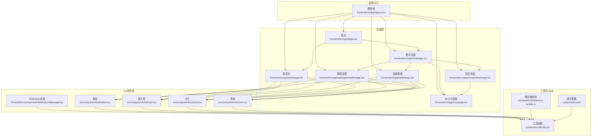
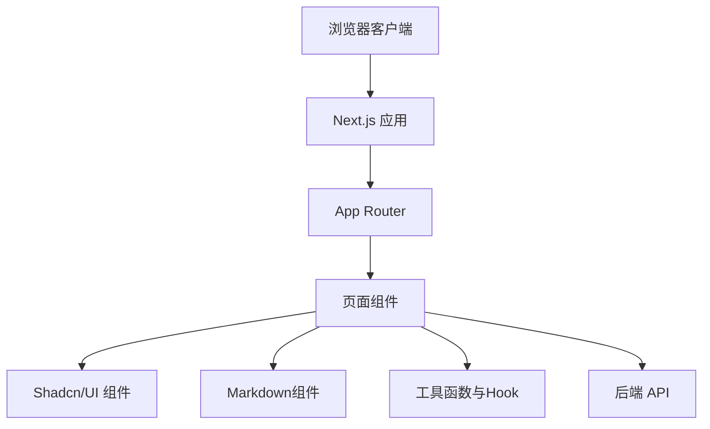
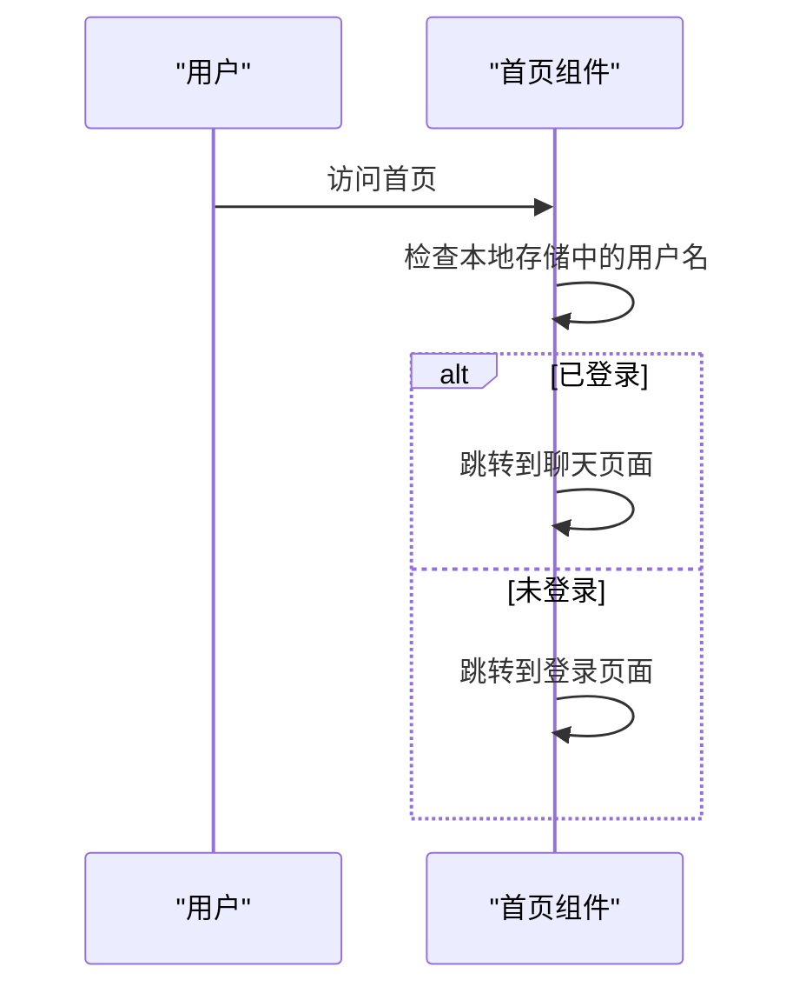
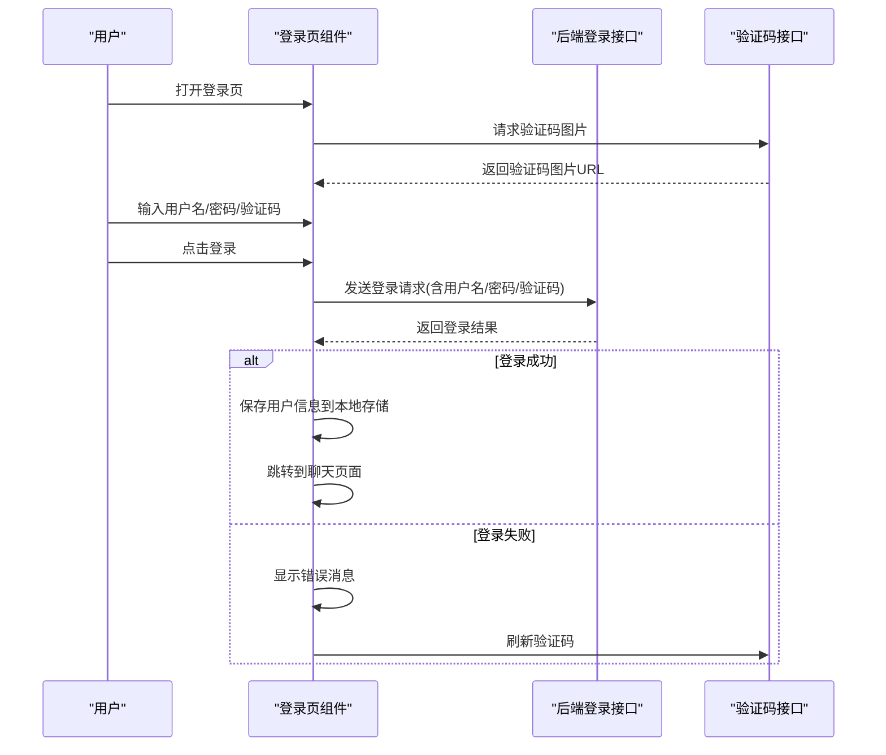
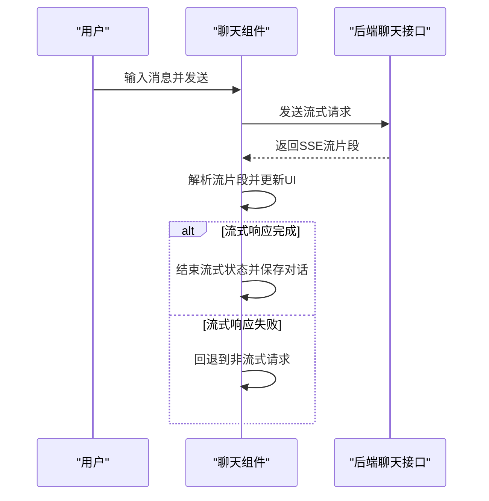
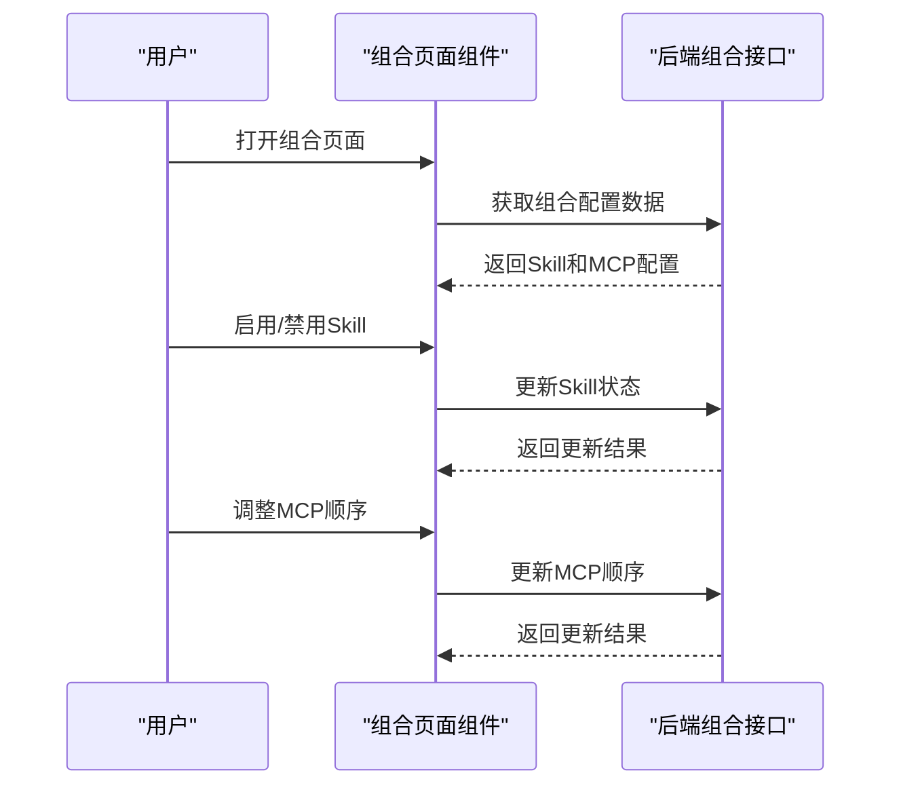
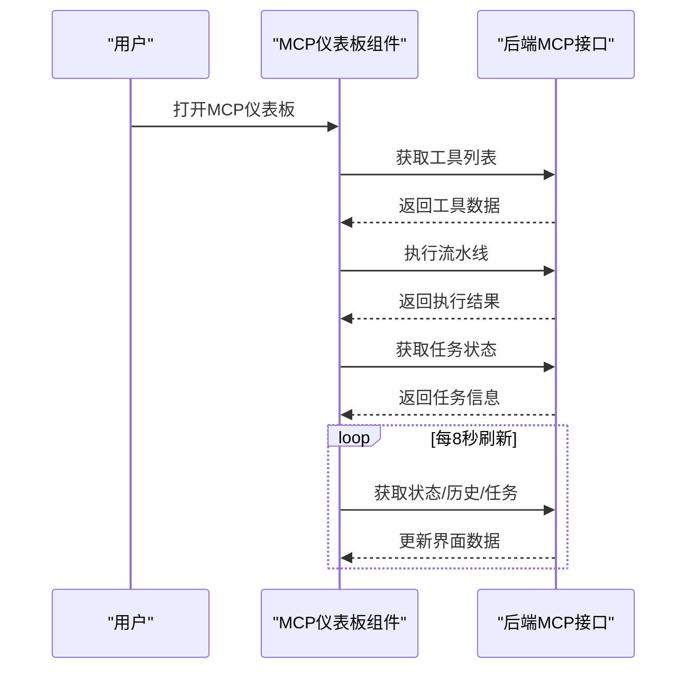
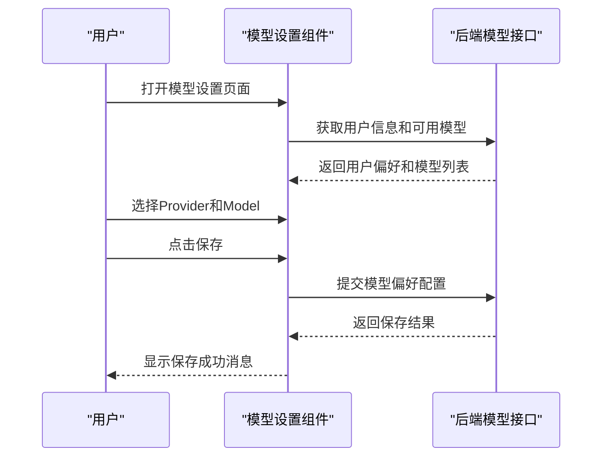
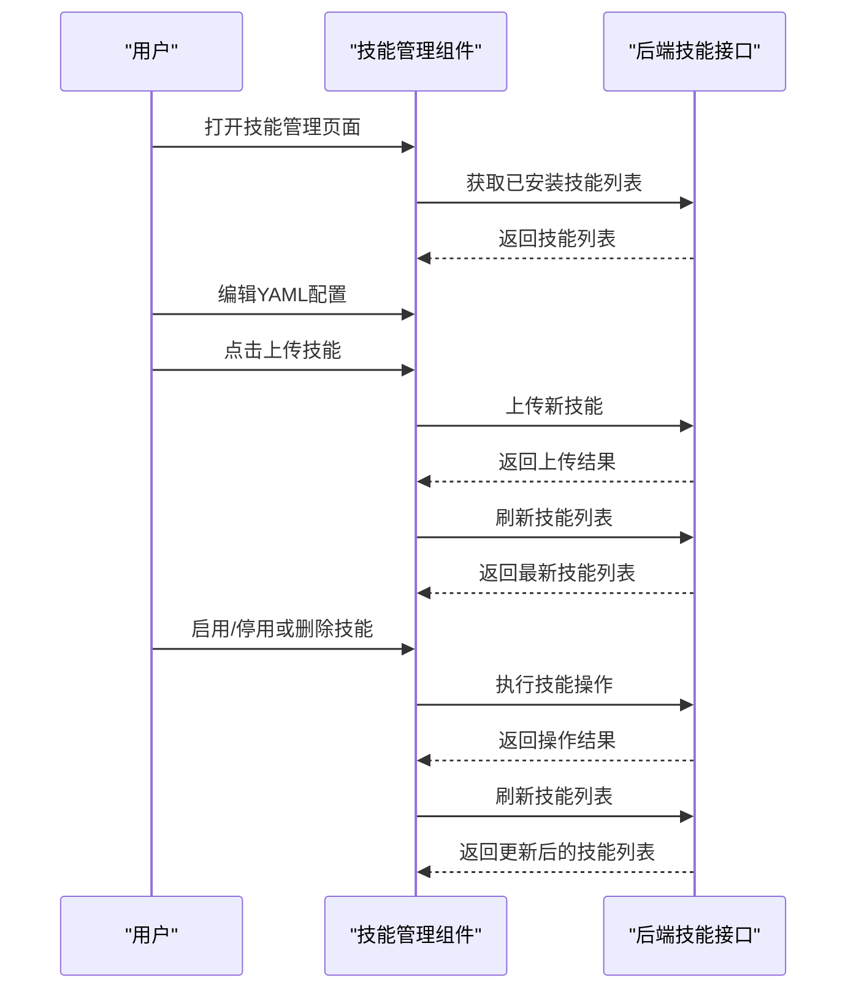
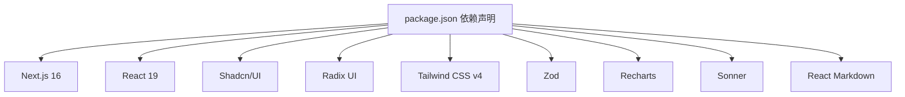

# 前端应用文档

<cite>
**本文档引用的文件**
- [package.json](file://package.json)
- [next.config.ts](file://next.config.ts)
- [frontend/src/app/layout.tsx](file://frontend/src/app/layout.tsx)
- [frontend/src/app/page.tsx](file://frontend/src/app/page.tsx)
- [frontend/src/app/chat/page.tsx](file://frontend/src/app/chat/page.tsx)
- [frontend/src/app/composition/page.tsx](file://frontend/src/app/composition/page.tsx)
- [frontend/src/app/mcp/page.tsx](file://frontend/src/app/mcp/page.tsx)
- [frontend/src/app/login/page.tsx](file://frontend/src/app/login/page.tsx)
- [frontend/src/app/settings/models/page.tsx](file://frontend/src/app/settings/models/page.tsx)
- [frontend/src/app/skills/page.tsx](file://frontend/src/app/skills/page.tsx)
- [frontend/src/components/MarkdownMessage.tsx](file://frontend/src/components/MarkdownMessage.tsx)
- [src/components/ui/button.tsx](file://src/components/ui/button.tsx)
- [src/components/ui/input.tsx](file://src/components/ui/input.tsx)
- [src/components/ui/card.tsx](file://src/components/ui/card.tsx)
- [src/components/ui/form.tsx](file://src/components/ui/form.tsx)
- [frontend/src/hooks/use-mobile.ts](file://frontend/src/hooks/use-mobile.ts)
- [frontend/src/lib/utils.ts](file://frontend/src/lib/utils.ts)
- [components.json](file://components.json)
</cite>

## 更新摘要
**所做更改**
- 新增组合页面（Composition Page）功能模块
- 新增MCP仪表板（MCP Dashboard）功能模块
- 改进聊天界面稳定性与性能优化
- 优化MCP工具管理与流水线监控布局
- 增强工具调用与状态管理功能

## 目录
1. [简介](#简介)
2. [项目结构](#项目结构)
3. [核心组件](#核心组件)
4. [架构总览](#架构总览)
5. [详细组件分析](#详细组件分析)
6. [依赖关系分析](#依赖关系分析)
7. [性能考虑](#性能考虑)
8. [故障排除指南](#故障排除指南)
9. [结论](#结论)
10. [附录](#附录)

## 简介
本项目是一个基于 Next.js 16 App Router 的智能教务系统 AI 助手前端应用。系统采用现代化的前端技术栈，结合 Shadcn/UI 组件库与 Tailwind CSS 实现统一的视觉风格与可复用组件体系。应用提供登录认证、仪表板概览、成绩查询与个人信息查看等功能模块，通过客户端状态管理与本地存储实现用户会话持久化，并通过与后端 API 的交互完成数据获取与业务流程。

**更新** 新增了组合页面、MCP仪表板、改进聊天界面稳定性等重大增强功能，为用户提供更强大的AI助手配置与管理能力。

## 项目结构
前端项目采用 Next.js 16 App Router 的目录结构组织，页面按功能模块划分，组件以可复用 UI 组件为主，工具函数与 Hook 提供通用能力支撑。



**图表来源**
- [frontend/src/app/layout.tsx:1-22](file://frontend/src/app/layout.tsx#L1-L22)
- [frontend/src/app/page.tsx:1-28](file://frontend/src/app/page.tsx#L1-L28)
- [frontend/src/app/chat/page.tsx:1-969](file://frontend/src/app/chat/page.tsx#L1-L969)
- [frontend/src/app/composition/page.tsx:1-236](file://frontend/src/app/composition/page.tsx#L1-L236)
- [frontend/src/app/mcp/page.tsx:1-515](file://frontend/src/app/mcp/page.tsx#L1-L515)
- [frontend/src/app/login/page.tsx:1-350](file://frontend/src/app/login/page.tsx#L1-L350)
- [frontend/src/app/settings/models/page.tsx:1-151](file://frontend/src/app/settings/models/page.tsx#L1-L151)
- [frontend/src/app/skills/page.tsx:1-179](file://frontend/src/app/skills/page.tsx#L1-L179)
- [frontend/src/components/MarkdownMessage.tsx:1-73](file://frontend/src/components/MarkdownMessage.tsx#L1-L73)
- [src/components/ui/button.tsx:1-63](file://src/components/ui/button.tsx#L1-L63)
- [src/components/ui/input.tsx:1-22](file://src/components/ui/input.tsx#L1-L22)
- [src/components/ui/card.tsx:1-93](file://src/components/ui/card.tsx#L1-L93)
- [src/components/ui/form.tsx:1-168](file://src/components/ui/form.tsx#L1-L168)
- [frontend/src/lib/utils.ts:1-7](file://frontend/src/lib/utils.ts#L1-L7)
- [frontend/src/hooks/use-mobile.ts:1-20](file://frontend/src/hooks/use-mobile.ts#L1-L20)
- [components.json:1-22](file://components.json#L1-L22)

**章节来源**
- [frontend/src/app/layout.tsx:1-22](file://frontend/src/app/layout.tsx#L1-L22)
- [package.json:1-92](file://package.json#L1-L92)
- [next.config.ts:1-19](file://next.config.ts#L1-L19)
- [components.json:1-22](file://components.json#L1-L22)

## 核心组件
- 根布局与元数据：定义全局样式、SEO 元数据与开发者调试工具集成。
- 页面组件：首页、聊天页面、组合页面、MCP仪表板、登录页、模型设置、技能管理等页面，负责业务逻辑与数据展示。
- UI 组件：按钮、输入框、卡片、表单等，提供一致的交互与视觉体验。
- Markdown 渲染组件：专门用于AI助手消息的Markdown内容渲染。
- 工具与 Hook：类名合并、移动端检测、组件别名配置等。

**章节来源**
- [frontend/src/app/layout.tsx:1-22](file://frontend/src/app/layout.tsx#L1-L22)
- [frontend/src/app/page.tsx:1-28](file://frontend/src/app/page.tsx#L1-L28)
- [frontend/src/app/chat/page.tsx:1-969](file://frontend/src/app/chat/page.tsx#L1-L969)
- [frontend/src/app/composition/page.tsx:1-236](file://frontend/src/app/composition/page.tsx#L1-L236)
- [frontend/src/app/mcp/page.tsx:1-515](file://frontend/src/app/mcp/page.tsx#L1-L515)
- [frontend/src/app/login/page.tsx:1-350](file://frontend/src/app/login/page.tsx#L1-L350)
- [frontend/src/app/settings/models/page.tsx:1-151](file://frontend/src/app/settings/models/page.tsx#L1-L151)
- [frontend/src/app/skills/page.tsx:1-179](file://frontend/src/app/skills/page.tsx#L1-L179)
- [frontend/src/components/MarkdownMessage.tsx:1-73](file://frontend/src/components/MarkdownMessage.tsx#L1-L73)
- [src/components/ui/button.tsx:1-63](file://src/components/ui/button.tsx#L1-L63)
- [src/components/ui/input.tsx:1-22](file://src/components/ui/input.tsx#L1-L22)
- [src/components/ui/card.tsx:1-93](file://src/components/ui/card.tsx#L1-L93)
- [src/components/ui/form.tsx:1-168](file://src/components/ui/form.tsx#L1-L168)
- [frontend/src/lib/utils.ts:1-7](file://frontend/src/lib/utils.ts#L1-L7)
- [frontend/src/hooks/use-mobile.ts:1-20](file://frontend/src/hooks/use-mobile.ts#L1-L20)
- [components.json:1-22](file://components.json#L1-L22)

## 架构总览
应用采用客户端渲染与静态资源托管相结合的方式，页面通过 Next.js App Router 进行组织，UI 组件遵循 Shadcn/UI 设计规范，状态管理主要依赖 React 客户端状态与浏览器本地存储，路由跳转由 Next.js Navigation API 提供。



**图表来源**
- [frontend/src/app/layout.tsx:1-22](file://frontend/src/app/layout.tsx#L1-L22)
- [frontend/src/app/page.tsx:1-28](file://frontend/src/app/page.tsx#L1-L28)
- [frontend/src/app/chat/page.tsx:1-969](file://frontend/src/app/chat/page.tsx#L1-L969)
- [frontend/src/app/composition/page.tsx:1-236](file://frontend/src/app/composition/page.tsx#L1-L236)
- [frontend/src/app/mcp/page.tsx:1-515](file://frontend/src/app/mcp/page.tsx#L1-L515)
- [frontend/src/app/login/page.tsx:1-350](file://frontend/src/app/login/page.tsx#L1-L350)
- [frontend/src/app/settings/models/page.tsx:1-151](file://frontend/src/app/settings/models/page.tsx#L1-L151)
- [frontend/src/app/skills/page.tsx:1-179](file://frontend/src/app/skills/page.tsx#L1-L179)
- [frontend/src/components/MarkdownMessage.tsx:1-73](file://frontend/src/components/MarkdownMessage.tsx#L1-L73)
- [src/components/ui/button.tsx:1-63](file://src/components/ui/button.tsx#L1-L63)
- [src/components/ui/input.tsx:1-22](file://src/components/ui/input.tsx#L1-L22)
- [src/components/ui/card.tsx:1-93](file://src/components/ui/card.tsx#L1-L93)
- [src/components/ui/form.tsx:1-168](file://src/components/ui/form.tsx#L1-L168)
- [frontend/src/lib/utils.ts:1-7](file://frontend/src/lib/utils.ts#L1-L7)
- [frontend/src/hooks/use-mobile.ts:1-20](file://frontend/src/hooks/use-mobile.ts#L1-L20)

## 详细组件分析

### 首页（路由引导）
- 功能概述：根据用户登录状态自动跳转到聊天页面或登录页面，提供加载指示器。
- 关键流程：
  - 页面加载时检查本地存储中的用户名。
  - 已登录用户直接跳转到聊天页面。
  - 未登录用户跳转到登录页面。



**图表来源**
- [frontend/src/app/page.tsx:9-17](file://frontend/src/app/page.tsx#L9-L17)

**章节来源**
- [frontend/src/app/page.tsx:1-28](file://frontend/src/app/page.tsx#L1-L28)

### 登录页面（验证码与认证）
- 功能概述：提供用户名、密码与验证码输入，支持刷新验证码图片，提交后调用后端登录接口，成功后将用户信息存入本地存储并跳转至仪表板。
- 关键流程：
  - 加载时请求验证码图片地址。
  - 表单提交时校验必填项，调用登录接口，根据返回结果更新消息提示与状态。
  - 失败时刷新验证码并清空输入，成功后延时跳转并保存用户信息。
- 错误处理：网络异常、后端返回错误、必填项缺失等情况均有相应提示与状态控制。



**图表来源**
- [frontend/src/app/login/page.tsx:96-166](file://frontend/src/app/login/page.tsx#L96-L166)

**章节来源**
- [frontend/src/app/login/page.tsx:1-350](file://frontend/src/app/login/page.tsx#L1-L350)

### 聊天页面（AI对话交互）
- 功能概述：提供完整的AI对话界面，支持流式响应、对话历史管理、快捷问题等功能。
- 关键特性：
  - 流式SSE响应处理，支持实时消息显示。
  - 对话历史管理，支持新建、选择、删除对话。
  - 快捷问题功能，提供常用查询模板。
  - 侧边栏导航，包含模型设置、技能管理、MCP工具和组合编排入口。
  - 工具调用标记与来源引用显示。
  - 思考过程可视化与推理模式支持。
- 错误处理：网络异常、流式响应失败时提供降级处理。



**图表来源**
- [frontend/src/app/chat/page.tsx:178-439](file://frontend/src/app/chat/page.tsx#L178-L439)

**章节来源**
- [frontend/src/app/chat/page.tsx:1-969](file://frontend/src/app/chat/page.tsx#L1-L969)

### 组合页面（Skill与MCP编排）
- 功能概述：提供Skill与MCP工具的组合编排功能，支持启停控制、优先级调整与顺序管理。
- 关键特性：
  - Skill拼装：按用户启停Skill，决定路由是否生效。
  - MCP拼装：启停工具并调整执行优先顺序。
  - 实时状态更新与消息反馈。
  - 支持返回聊天页面与其他管理入口。
- 数据流：通过API接口获取组合配置，支持实时更新与状态同步。



**图表来源**
- [frontend/src/app/composition/page.tsx:73-137](file://frontend/src/app/composition/page.tsx#L73-L137)

**章节来源**
- [frontend/src/app/composition/page.tsx:1-236](file://frontend/src/app/composition/page.tsx#L1-L236)

### MCP仪表板（工具管理与流水线监控）
- 功能概述：提供MCP工具的完整管理界面，包括工具导入、重载、探测、流水线执行与任务监控。
- 关键特性：
  - 工具导入：支持从URL和文件导入MCP配置。
  - 工具管理：显示已注册工具列表与详细信息。
  - 流水线操作：一键执行流水线，支持优先级设置。
  - 任务队列：实时监控任务状态、重试次数与错误信息。
  - 历史记录：查看流水线执行历史与统计信息。
  - 自动刷新：定时更新状态、历史和任务信息。
- 数据流：通过多个API接口管理工具生命周期与流水线状态。



**图表来源**
- [frontend/src/app/mcp/page.tsx:66-90](file://frontend/src/app/mcp/page.tsx#L66-L90)

**章节来源**
- [frontend/src/app/mcp/page.tsx:1-515](file://frontend/src/app/mcp/page.tsx#L1-L515)

### 模型设置页面（AI模型配置）
- 功能概述：允许用户配置AI模型偏好，支持Provider和Model的选择与保存。
- 关键流程：
  - 加载用户信息和可用模型列表。
  - 用户选择Provider和Model后保存配置。
  - 支持返回聊天页面。
- 数据流：通过API接口获取用户偏好和可用模型，保存时提交配置信息。



**图表来源**
- [frontend/src/app/settings/models/page.tsx:25-81](file://frontend/src/app/settings/models/page.tsx#L25-L81)

**章节来源**
- [frontend/src/app/settings/models/page.tsx:1-151](file://frontend/src/app/settings/models/page.tsx#L1-L151)

### 技能管理页面（自定义技能）
- 功能概述：允许用户上传、启用/停用、删除自定义技能，支持YAML格式配置。
- 关键流程：
  - 加载用户已安装的技能列表。
  - 用户编辑YAML配置并上传新技能。
  - 支持对现有技能进行启用/停用和删除操作。
- 数据流：通过API接口管理技能的上传、启用/停用和删除操作。



**图表来源**
- [frontend/src/app/skills/page.tsx:40-109](file://frontend/src/app/skills/page.tsx#L40-L109)

**章节来源**
- [frontend/src/app/skills/page.tsx:1-179](file://frontend/src/app/skills/page.tsx#L1-L179)

### Markdown渲染组件
- 功能概述：专门用于渲染AI助手的消息内容，支持Markdown语法、代码高亮和表格显示。
- 关键特性：
  - GFM兼容的Markdown渲染。
  - 代码块高亮显示。
  - 自定义表格样式。
  - 内联代码与预格式化代码块的差异化处理。

```mermaid
classDiagram
class MarkdownMessage {
+props : "content"
+渲染 : "ReactMarkdown组件"
+插件 : "remarkGfm, rehypeHighlight"
+自定义 : "代码块, 表格, 预格式化"
}
MarkdownMessage --> Utils["工具函数"]
```

**图表来源**
- [frontend/src/components/MarkdownMessage.tsx:12-72](file://frontend/src/components/MarkdownMessage.tsx#L12-L72)

**章节来源**
- [frontend/src/components/MarkdownMessage.tsx:1-73](file://frontend/src/components/MarkdownMessage.tsx#L1-L73)

### UI 组件与设计系统
- 按钮组件：支持多种变体与尺寸，通过变体工厂与类名合并实现样式扩展。
- 输入框组件：统一的输入样式与焦点态、无效态表现。
- 卡片组件：提供标题、描述、内容、底部等语义化区域，便于组合布局。
- 表单组件：基于 react-hook-form 的表单上下文与字段上下文，提供标签、控件、描述与错误消息的统一处理。

```mermaid
classDiagram
class Button {
+props : "变体/尺寸/禁用/子元素"
+渲染 : "Slot 或 button"
}
class Input {
+props : "类型/占位符/禁用"
+渲染 : "input 元素"
}
class Card {
+CardHeader
+CardTitle
+CardDescription
+CardContent
+CardFooter
}
class Form {
+FormProvider
+FormField
+FormLabel
+FormControl
+FormDescription
+FormMessage
}
Button --> Utils["类名合并"]
Input --> Utils
Card --> Utils
Form --> Utils
```

**图表来源**
- [src/components/ui/button.tsx:1-63](file://src/components/ui/button.tsx#L1-L63)
- [src/components/ui/input.tsx:1-22](file://src/components/ui/input.tsx#L1-L22)
- [src/components/ui/card.tsx:1-93](file://src/components/ui/card.tsx#L1-L93)
- [src/components/ui/form.tsx:1-168](file://src/components/ui/form.tsx#L1-L168)
- [frontend/src/lib/utils.ts:1-7](file://frontend/src/lib/utils.ts#L1-L7)

**章节来源**
- [src/components/ui/button.tsx:1-63](file://src/components/ui/button.tsx#L1-L63)
- [src/components/ui/input.tsx:1-22](file://src/components/ui/input.tsx#L1-L22)
- [src/components/ui/card.tsx:1-93](file://src/components/ui/card.tsx#L1-L93)
- [src/components/ui/form.tsx:1-168](file://src/components/ui/form.tsx#L1-L168)
- [frontend/src/lib/utils.ts:1-7](file://frontend/src/lib/utils.ts#L1-L7)

### 状态管理与本地存储
- 客户端状态：页面内部使用 React 状态管理用户输入、加载状态与错误信息。
- 服务器数据同步：通过 fetch 接口与后端进行数据交换，成功后更新本地状态。
- 会话持久化：登录成功后将用户信息保存到本地存储，仪表板与子页面在初始化时读取该信息以判断登录状态。
- 对话状态管理：支持多对话并行管理，使用localStorage持久化当前对话ID。

**章节来源**
- [frontend/src/app/login/page.tsx:134-136](file://frontend/src/app/login/page.tsx#L134-L136)
- [frontend/src/app/chat/page.tsx:570-579](file://frontend/src/app/chat/page.tsx#L570-L579)
- [frontend/src/app/composition/page.tsx:22-57](file://frontend/src/app/composition/page.tsx#L22-L57)
- [frontend/src/app/mcp/page.tsx:47-113](file://frontend/src/app/mcp/page.tsx#L47-L113)

### 响应式设计与用户体验
- 移动端适配：提供移动端检测 Hook，在不同设备上调整交互与布局策略。
- 视觉反馈：通过按钮禁用态、加载提示、错误提示与颜色编码（如成绩等级）提升可用性。
- 导航体验：统一的头部导航与返回按钮，确保用户在各页面间顺畅切换。
- 流式渲染优化：聊天界面采用节流刷新机制，避免高频分片导致的重绘抖动。

**章节来源**
- [frontend/src/hooks/use-mobile.ts:1-20](file://frontend/src/hooks/use-mobile.ts#L1-L20)
- [frontend/src/app/chat/page.tsx:319-350](file://frontend/src/app/chat/page.tsx#L319-L350)

## 依赖关系分析
- 依赖生态：Next.js 16、React 19、Tailwind CSS v4、Shadcn/UI 组件库、Radix UI、Zod、Recharts、Sonner、React Markdown等。
- 构建与运行：通过脚本命令启动开发服务器、构建与启动生产环境。
- 图像与跨域：配置允许的远程图像源与开发时允许的来源，便于资源加载与调试。



**图表来源**
- [package.json:12-68](file://package.json#L12-L68)
- [next.config.ts:1-19](file://next.config.ts#L1-L19)

**章节来源**
- [package.json:1-92](file://package.json#L1-L92)
- [next.config.ts:1-19](file://next.config.ts#L1-L19)

## 性能考虑
- 组件复用：通过 Shadcn/UI 组件减少重复样式编写，提升一致性与维护效率。
- 类名合并：使用工具函数进行条件类名合并，避免冗余样式与不必要的重排。
- 资源加载：合理利用 Next.js 的静态资源与图像优化能力，减少首屏加载时间。
- 状态最小化：仅在必要时更新状态，避免不必要的重渲染。
- 流式渲染优化：聊天界面采用节流刷新机制，降低高频分片导致的重绘抖动。
- 自动刷新策略：MCP仪表板采用定时刷新机制，平衡实时性与性能消耗。
- 错误边界：在关键页面中提供错误提示与加载状态，改善用户体验。

## 故障排除指南
- 登录失败：检查后端服务连通性、验证码刷新与必填项校验；查看错误消息提示并重试。
- 聊天功能异常：检查流式响应处理、网络连接和后端API状态。
- 组合页面保存失败：确认用户登录状态、工具配置有效性与网络连接。
- MCP工具管理异常：检查工具导入格式、重载状态与后端服务可用性。
- 模型设置保存失败：确认用户登录状态、Provider和Model的有效性。
- 技能上传失败：检查YAML格式正确性和网络连接。
- 图像加载问题：检查远程图像源配置与网络访问权限。
- 移动端显示异常：使用移动端检测 Hook 并根据断点调整布局与交互。

**章节来源**
- [frontend/src/app/login/page.tsx:155-160](file://frontend/src/app/login/page.tsx#L155-L160)
- [frontend/src/app/chat/page.tsx:425-439](file://frontend/src/app/chat/page.tsx#L425-L439)
- [frontend/src/app/composition/page.tsx:73-115](file://frontend/src/app/composition/page.tsx#L73-L115)
- [frontend/src/app/mcp/page.tsx:124-141](file://frontend/src/app/mcp/page.tsx#L124-L141)
- [frontend/src/app/settings/models/page.tsx:72-78](file://frontend/src/app/settings/models/page.tsx#L72-L78)
- [frontend/src/app/skills/page.tsx:79-84](file://frontend/src/app/skills/page.tsx#L79-L84)
- [next.config.ts:7-15](file://next.config.ts#L7-L15)

## 结论
本项目通过 Next.js 16 App Router 与 Shadcn/UI 组件库实现了清晰的页面结构与一致的 UI 体验。新增的组合页面、MCP仪表板、改进的聊天界面稳定性等重大增强功能，为用户提供了更强大的AI助手配置与管理能力。首页、登录页、聊天页面、组合页面、MCP仪表板、模型设置和技能管理等页面围绕统一的状态管理模式与本地存储机制协同工作，配合响应式设计与错误处理策略，提供了优秀的用户体验。这些增强功能进一步提升了系统的可配置性、可管理性和扩展性，为用户提供了更丰富的智能教务助手使用体验。

## 附录
- 组件别名与主题配置：通过组件配置文件定义组件路径别名、Tailwind 配置与图标库，确保开发与构建的一致性。
- 工具函数：提供类名合并工具，简化样式组合逻辑。
- Markdown渲染：专门的Markdown组件支持代码高亮与表格显示，提升内容可读性。

**章节来源**
- [components.json:1-22](file://components.json#L1-L22)
- [frontend/src/lib/utils.ts:1-7](file://frontend/src/lib/utils.ts#L1-L7)
- [frontend/src/components/MarkdownMessage.tsx:1-73](file://frontend/src/components/MarkdownMessage.tsx#L1-L73)