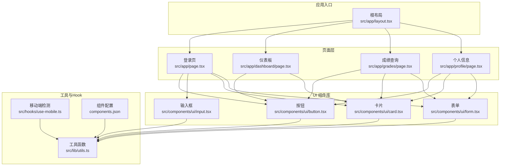
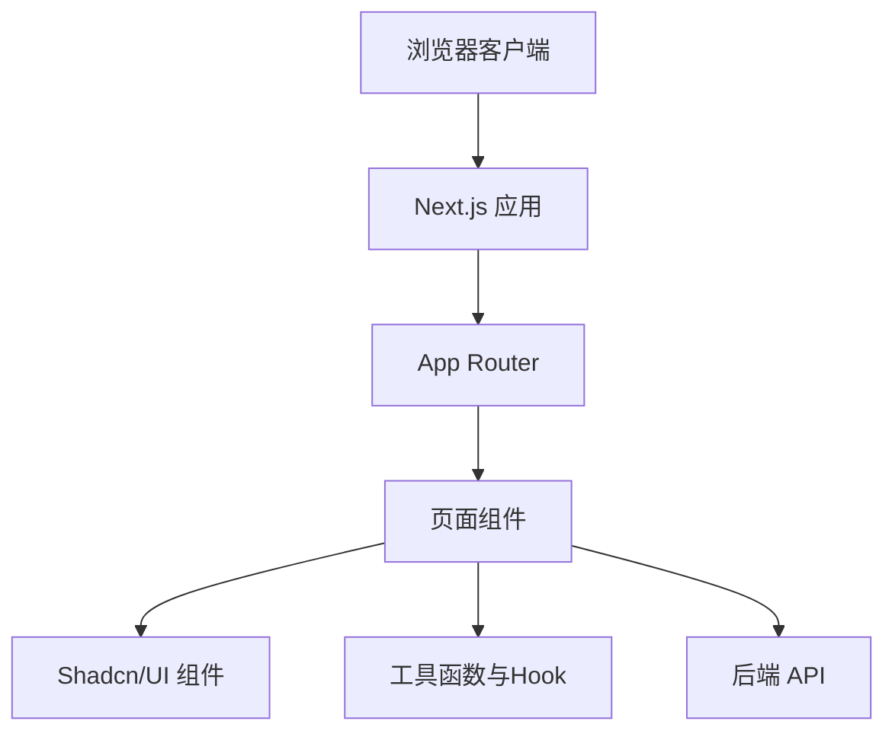
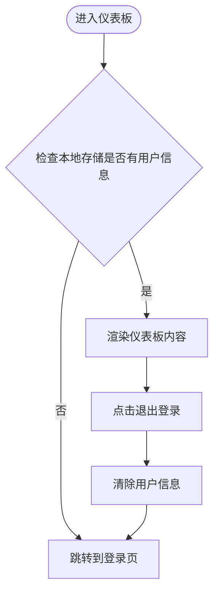
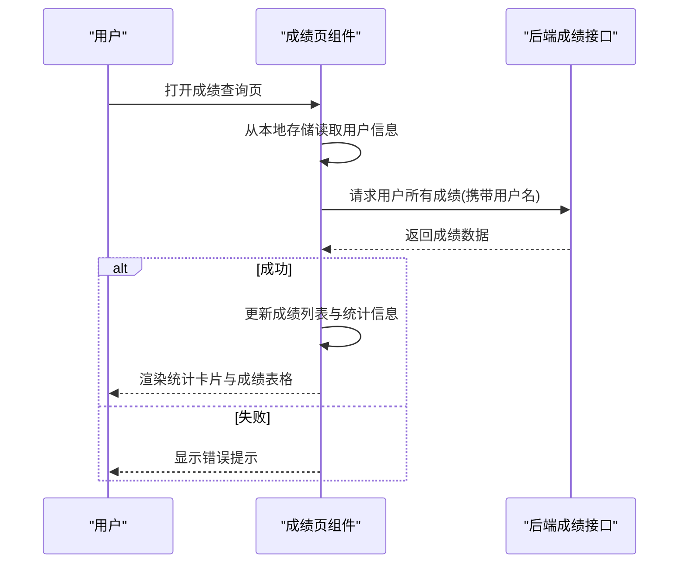
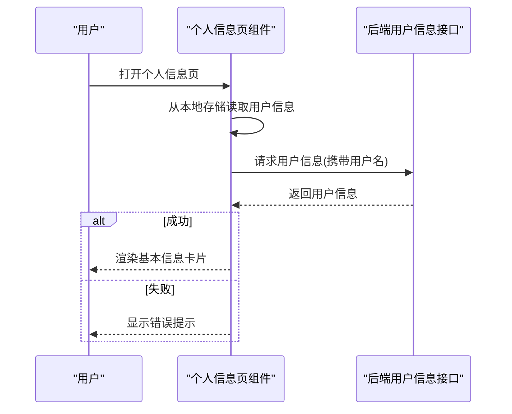
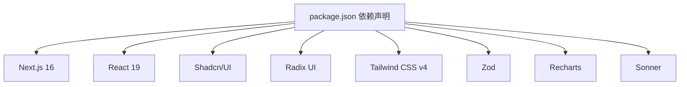

# 前端应用文档

<cite>
**本文档引用的文件**
- [package.json](file://package.json)
- [next.config.ts](file://next.config.ts)
- [src/app/layout.tsx](file://src/app/layout.tsx)
- [src/app/page.tsx](file://src/app/page.tsx)
- [src/app/dashboard/page.tsx](file://src/app/dashboard/page.tsx)
- [src/app/grades/page.tsx](file://src/app/grades/page.tsx)
- [src/app/profile/page.tsx](file://src/app/profile/page.tsx)
- [src/components/ui/button.tsx](file://src/components/ui/button.tsx)
- [src/components/ui/input.tsx](file://src/components/ui/input.tsx)
- [src/components/ui/card.tsx](file://src/components/ui/card.tsx)
- [src/components/ui/form.tsx](file://src/components/ui/form.tsx)
- [src/hooks/use-mobile.ts](file://src/hooks/use-mobile.ts)
- [src/lib/utils.ts](file://src/lib/utils.ts)
- [components.json](file://components.json)
</cite>

## 目录
1. [简介](#简介)
2. [项目结构](#项目结构)
3. [核心组件](#核心组件)
4. [架构总览](#架构总览)
5. [详细组件分析](#详细组件分析)
6. [依赖关系分析](#依赖关系分析)
7. [性能考虑](#性能考虑)
8. [故障排除指南](#故障排除指南)
9. [结论](#结论)
10. [附录](#附录)

## 简介
本项目是一个基于 Next.js 16 App Router 的智能教务系统 AI 助手前端应用。系统采用现代化的前端技术栈，结合 Shadcn/UI 组件库与 Tailwind CSS 实现统一的视觉风格与可复用组件体系。应用提供登录认证、仪表板概览、成绩查询与个人信息查看等功能模块，通过客户端状态管理与本地存储实现用户会话持久化，并通过与后端 API 的交互完成数据获取与业务流程。

## 项目结构
前端项目采用 Next.js 16 App Router 的目录结构组织，页面按功能模块划分，组件以可复用 UI 组件为主，工具函数与 Hook 提供通用能力支撑。



**图表来源**
- [src/app/layout.tsx:1-46](file://src/app/layout.tsx#L1-L46)
- [src/app/page.tsx:1-186](file://src/app/page.tsx#L1-L186)
- [src/app/dashboard/page.tsx:1-181](file://src/app/dashboard/page.tsx#L1-L181)
- [src/app/grades/page.tsx:1-243](file://src/app/grades/page.tsx#L1-L243)
- [src/app/profile/page.tsx:1-172](file://src/app/profile/page.tsx#L1-L172)
- [src/components/ui/button.tsx:1-63](file://src/components/ui/button.tsx#L1-L63)
- [src/components/ui/input.tsx:1-22](file://src/components/ui/input.tsx#L1-L22)
- [src/components/ui/card.tsx:1-93](file://src/components/ui/card.tsx#L1-L93)
- [src/components/ui/form.tsx:1-168](file://src/components/ui/form.tsx#L1-L168)
- [src/lib/utils.ts:1-7](file://src/lib/utils.ts#L1-L7)
- [src/hooks/use-mobile.ts:1-20](file://src/hooks/use-mobile.ts#L1-L20)
- [components.json:1-22](file://components.json#L1-L22)

**章节来源**
- [src/app/layout.tsx:1-46](file://src/app/layout.tsx#L1-L46)
- [package.json:1-92](file://package.json#L1-L92)
- [next.config.ts:1-19](file://next.config.ts#L1-L19)
- [components.json:1-22](file://components.json#L1-L22)

## 核心组件
- 根布局与元数据：定义全局样式、SEO 元数据与开发者调试工具集成。
- 页面组件：登录页、仪表板、成绩查询、个人信息页面，负责业务逻辑与数据展示。
- UI 组件：按钮、输入框、卡片、表单等，提供一致的交互与视觉体验。
- 工具与 Hook：类名合并、移动端检测、组件别名配置等。

**章节来源**
- [src/app/layout.tsx:1-46](file://src/app/layout.tsx#L1-L46)
- [src/app/page.tsx:1-186](file://src/app/page.tsx#L1-L186)
- [src/app/dashboard/page.tsx:1-181](file://src/app/dashboard/page.tsx#L1-L181)
- [src/app/grades/page.tsx:1-243](file://src/app/grades/page.tsx#L1-L243)
- [src/app/profile/page.tsx:1-172](file://src/app/profile/page.tsx#L1-L172)
- [src/components/ui/button.tsx:1-63](file://src/components/ui/button.tsx#L1-L63)
- [src/components/ui/input.tsx:1-22](file://src/components/ui/input.tsx#L1-L22)
- [src/components/ui/card.tsx:1-93](file://src/components/ui/card.tsx#L1-L93)
- [src/components/ui/form.tsx:1-168](file://src/components/ui/form.tsx#L1-L168)
- [src/lib/utils.ts:1-7](file://src/lib/utils.ts#L1-L7)
- [src/hooks/use-mobile.ts:1-20](file://src/hooks/use-mobile.ts#L1-L20)
- [components.json:1-22](file://components.json#L1-L22)

## 架构总览
应用采用客户端渲染与静态资源托管相结合的方式，页面通过 Next.js App Router 进行组织，UI 组件遵循 Shadcn/UI 设计规范，状态管理主要依赖 React 客户端状态与浏览器本地存储，路由跳转由 Next.js Navigation API 提供。



**图表来源**
- [src/app/layout.tsx:1-46](file://src/app/layout.tsx#L1-L46)
- [src/app/page.tsx:1-186](file://src/app/page.tsx#L1-L186)
- [src/app/dashboard/page.tsx:1-181](file://src/app/dashboard/page.tsx#L1-L181)
- [src/app/grades/page.tsx:1-243](file://src/app/grades/page.tsx#L1-L243)
- [src/app/profile/page.tsx:1-172](file://src/app/profile/page.tsx#L1-L172)
- [src/components/ui/button.tsx:1-63](file://src/components/ui/button.tsx#L1-L63)
- [src/components/ui/input.tsx:1-22](file://src/components/ui/input.tsx#L1-L22)
- [src/components/ui/card.tsx:1-93](file://src/components/ui/card.tsx#L1-L93)
- [src/components/ui/form.tsx:1-168](file://src/components/ui/form.tsx#L1-L168)
- [src/lib/utils.ts:1-7](file://src/lib/utils.ts#L1-L7)
- [src/hooks/use-mobile.ts:1-20](file://src/hooks/use-mobile.ts#L1-L20)

## 详细组件分析

### 登录页面（验证码与认证）
- 功能概述：提供用户名、密码与验证码输入，支持刷新验证码图片，提交后调用后端登录接口，成功后将用户信息存入本地存储并跳转至仪表板。
- 关键流程：
  - 加载时请求验证码图片地址。
  - 表单提交时校验必填项，调用登录接口，根据返回结果更新消息提示与状态。
  - 失败时刷新验证码并清空输入，成功后延时跳转并保存用户信息。
- 错误处理：网络异常、后端返回错误、必填项缺失等情况均有相应提示与状态控制。


**图表来源**
- [src/app/page.tsx:18-87](file://src/app/page.tsx#L18-L87)

**章节来源**
- [src/app/page.tsx:1-186](file://src/app/page.tsx#L1-L186)

### 仪表板（概览与导航）
- 功能概述：展示用户欢迎信息与功能入口卡片，提供退出登录功能；未登录状态下自动跳转至登录页。
- 组件使用：卡片、按钮等 UI 组件用于信息展示与交互。
- 导航逻辑：通过 Next.js 导航 API 实现页面跳转。



**图表来源**
- [src/app/dashboard/page.tsx:12-25](file://src/app/dashboard/page.tsx#L12-L25)

**章节来源**
- [src/app/dashboard/page.tsx:1-181](file://src/app/dashboard/page.tsx#L1-L181)

### 成绩查询（数据展示与统计）
- 功能概述：从后端获取指定用户的全部成绩，计算总课程数、总学分、平均分与平均绩点，并以表格形式展示。
- 数据流：页面加载时读取本地存储中的用户信息，提取用户名后请求后端接口；根据返回结果更新状态并渲染统计卡片与成绩表格。
- 错误处理：网络异常或后端错误时显示错误提示，加载状态提供占位反馈。



**图表来源**
- [src/app/grades/page.tsx:39-77](file://src/app/grades/page.tsx#L39-L77)

**章节来源**
- [src/app/grades/page.tsx:1-243](file://src/app/grades/page.tsx#L1-L243)

### 个人信息（数据展示与提示）
- 功能概述：从后端获取用户基本信息并在卡片中展示，提供返回仪表板的导航。
- 数据流：与成绩页类似，读取本地存储中的用户信息，发起请求并渲染结果。
- 错误处理：网络异常或后端错误时显示错误提示。



**图表来源**
- [src/app/profile/page.tsx:34-51](file://src/app/profile/page.tsx#L34-L51)

**章节来源**
- [src/app/profile/page.tsx:1-172](file://src/app/profile/page.tsx#L1-L172)

### UI 组件与设计系统
- 按钮组件：支持多种变体与尺寸，通过变体工厂与类名合并实现样式扩展。
- 输入框组件：统一的输入样式与焦点态、无效态表现。
- 卡片组件：提供标题、描述、内容、底部等语义化区域，便于组合布局。
- 表单组件：基于 react-hook-form 的表单上下文与字段上下文，提供标签、控件、描述与错误消息的统一处理。

```mermaid
classDiagram
class Button {
+props : "变体/尺寸/禁用/子元素"
+渲染 : "Slot 或 button"
}
class Input {
+props : "类型/占位符/禁用"
+渲染 : "input 元素"
}
class Card {
+CardHeader
+CardTitle
+CardDescription
+CardContent
+CardFooter
}
class Form {
+FormProvider
+FormField
+FormLabel
+FormControl
+FormDescription
+FormMessage
}
Button --> Utils["类名合并"]
Input --> Utils
Card --> Utils
Form --> Utils
```

**图表来源**
- [src/components/ui/button.tsx:1-63](file://src/components/ui/button.tsx#L1-L63)
- [src/components/ui/input.tsx:1-22](file://src/components/ui/input.tsx#L1-L22)
- [src/components/ui/card.tsx:1-93](file://src/components/ui/card.tsx#L1-L93)
- [src/components/ui/form.tsx:1-168](file://src/components/ui/form.tsx#L1-L168)
- [src/lib/utils.ts:1-7](file://src/lib/utils.ts#L1-L7)

**章节来源**
- [src/components/ui/button.tsx:1-63](file://src/components/ui/button.tsx#L1-L63)
- [src/components/ui/input.tsx:1-22](file://src/components/ui/input.tsx#L1-L22)
- [src/components/ui/card.tsx:1-93](file://src/components/ui/card.tsx#L1-L93)
- [src/components/ui/form.tsx:1-168](file://src/components/ui/form.tsx#L1-L168)
- [src/lib/utils.ts:1-7](file://src/lib/utils.ts#L1-L7)

### 状态管理与本地存储
- 客户端状态：页面内部使用 React 状态管理用户输入、加载状态与错误信息。
- 服务器数据同步：通过 fetch 接口与后端进行数据交换，成功后更新本地状态。
- 会话持久化：登录成功后将用户信息保存到本地存储，仪表板与子页面在初始化时读取该信息以判断登录状态。

**章节来源**
- [src/app/page.tsx:65-70](file://src/app/page.tsx#L65-L70)
- [src/app/dashboard/page.tsx:14-19](file://src/app/dashboard/page.tsx#L14-L19)
- [src/app/grades/page.tsx:30-36](file://src/app/grades/page.tsx#L30-L36)
- [src/app/profile/page.tsx:24-31](file://src/app/profile/page.tsx#L24-L31)

### 响应式设计与用户体验
- 移动端适配：提供移动端检测 Hook，在不同设备上调整交互与布局策略。
- 视觉反馈：通过按钮禁用态、加载提示、错误提示与颜色编码（如成绩等级）提升可用性。
- 导航体验：统一的头部导航与返回按钮，确保用户在各页面间顺畅切换。

**章节来源**
- [src/hooks/use-mobile.ts:1-20](file://src/hooks/use-mobile.ts#L1-L20)
- [src/app/grades/page.tsx:204-218](file://src/app/grades/page.tsx#L204-L218)

## 依赖关系分析
- 依赖生态：Next.js 16、React 19、Tailwind CSS v4、Shadcn/UI 组件库、Radix UI、Zod、Recharts、Sonner 等。
- 构建与运行：通过脚本命令启动开发服务器、构建与启动生产环境。
- 图像与跨域：配置允许的远程图像源与开发时允许的来源，便于资源加载与调试。



**图表来源**
- [package.json:12-68](file://package.json#L12-L68)
- [next.config.ts:1-19](file://next.config.ts#L1-L19)

**章节来源**
- [package.json:1-92](file://package.json#L1-L92)
- [next.config.ts:1-19](file://next.config.ts#L1-L19)

## 性能考虑
- 组件复用：通过 Shadcn/UI 组件减少重复样式编写，提升一致性与维护效率。
- 类名合并：使用工具函数进行条件类名合并，避免冗余样式与不必要的重排。
- 资源加载：合理利用 Next.js 的静态资源与图像优化能力，减少首屏加载时间。
- 状态最小化：仅在必要时更新状态，避免不必要的重渲染。
- 错误边界：在关键页面中提供错误提示与加载状态，改善用户体验。

## 故障排除指南
- 登录失败：检查后端服务连通性、验证码刷新与必填项校验；查看错误消息提示并重试。
- 成绩/信息为空：确认本地存储中的用户信息是否存在，以及后端接口是否正常返回数据。
- 图像加载问题：检查远程图像源配置与网络访问权限。
- 移动端显示异常：使用移动端检测 Hook 并根据断点调整布局与交互。

**章节来源**
- [src/app/page.tsx:28-34](file://src/app/page.tsx#L28-L34)
- [src/app/grades/page.tsx:48-55](file://src/app/grades/page.tsx#L48-L55)
- [src/app/profile/page.tsx:43-50](file://src/app/profile/page.tsx#L43-L50)
- [next.config.ts:7-15](file://next.config.ts#L7-L15)

## 结论
本项目通过 Next.js 16 App Router 与 Shadcn/UI 组件库实现了清晰的页面结构与一致的 UI 体验。登录、仪表板、成绩查询与个人信息等页面围绕统一的状态管理模式与本地存储机制协同工作，配合响应式设计与错误处理策略，提供了良好的用户体验。后续可在现有基础上完善聊天交互、数据爬取与向量存储等高级功能。

## 附录
- 组件别名与主题配置：通过组件配置文件定义组件路径别名、Tailwind 配置与图标库，确保开发与构建的一致性。
- 工具函数：提供类名合并工具，简化样式组合逻辑。

**章节来源**
- [components.json:1-22](file://components.json#L1-L22)
- [src/lib/utils.ts:1-7](file://src/lib/utils.ts#L1-L7)