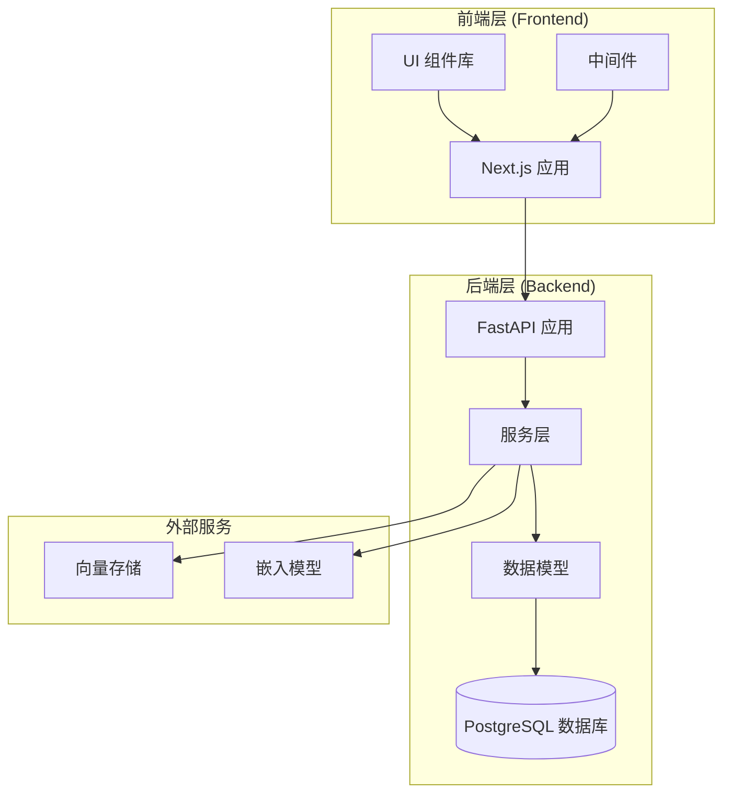
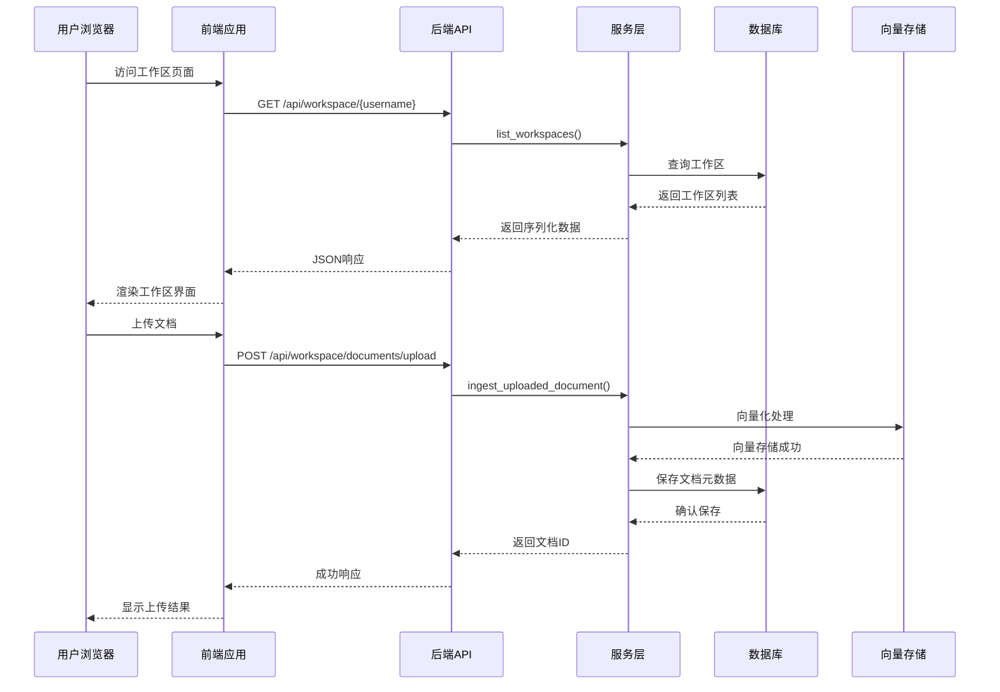
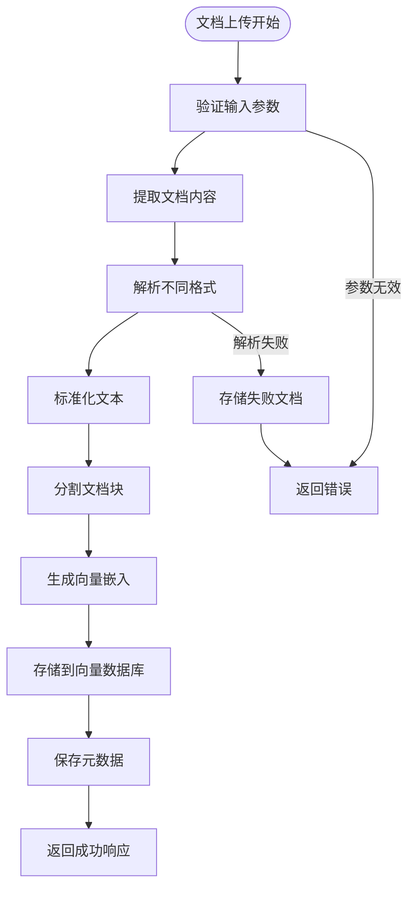
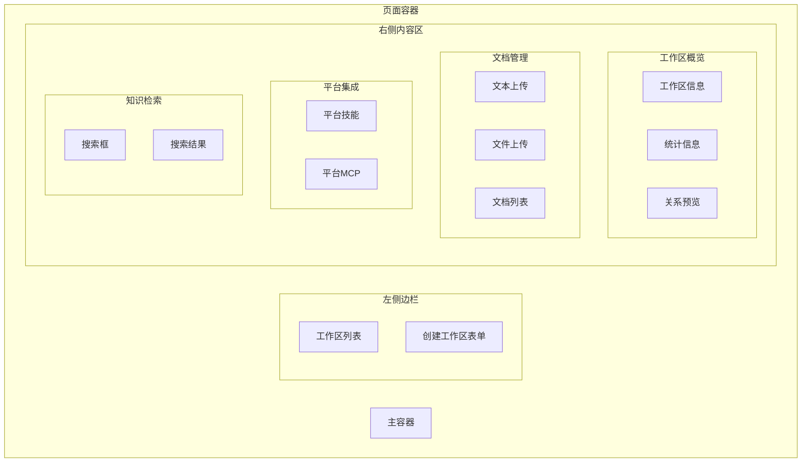
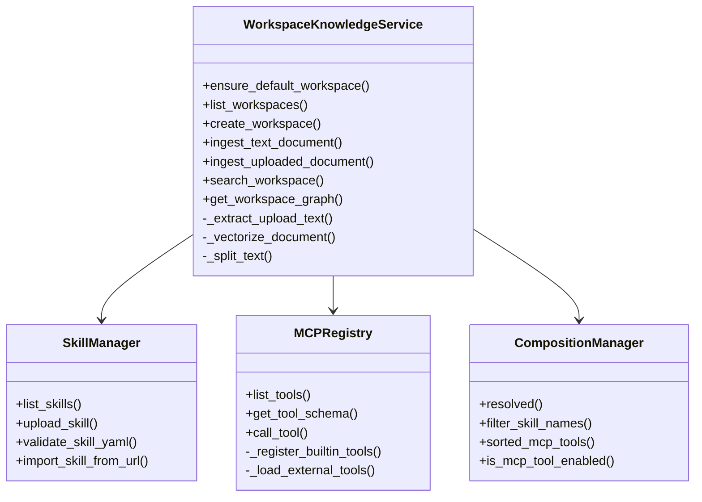
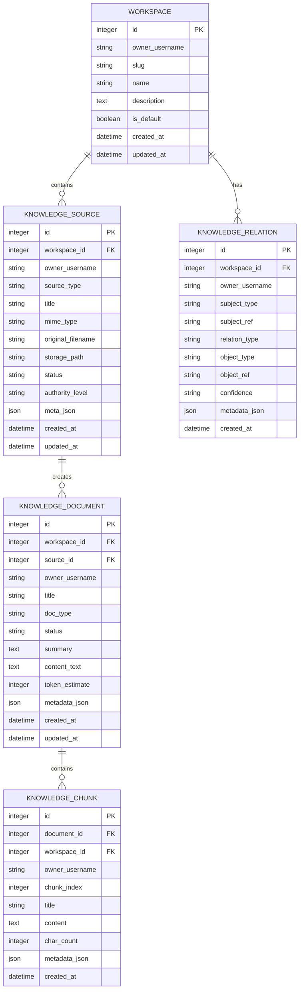
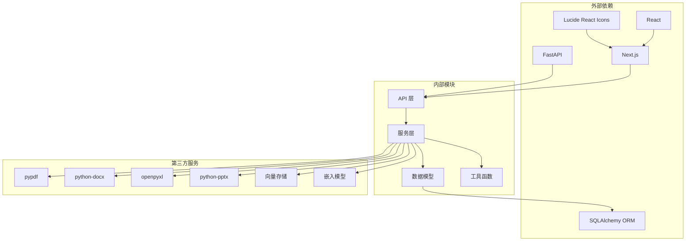

# 工作区管理页面

<cite>
**本文档引用的文件**
- [workspace.py](file://backend/app/api/workspace.py)
- [workspace_pref.py](file://backend/app/api/workspace_pref.py)
- [page.tsx](file://frontend/src/app/workspace/page.tsx)
- [workspace_knowledge.py](file://backend/app/services/workspace_knowledge.py)
- [skill_manager.py](file://backend/app/services/skill_manager.py)
- [mcp_registry.py](file://backend/app/services/mcp_registry.py)
- [composition_manager.py](file://backend/app/services/composition_manager.py)
- [platform.py](file://backend/app/models/platform.py)
- [base.py](file://backend/app/models/base.py)
- [main.py](file://backend/main.py)
- [middleware.ts](file://frontend/src/middleware.ts)
</cite>

## 目录
1. [简介](#简介)
2. [项目结构](#项目结构)
3. [核心组件](#核心组件)
4. [架构概览](#架构概览)
5. [详细组件分析](#详细组件分析)
6. [依赖关系分析](#依赖关系分析)
7. [性能考虑](#性能考虑)
8. [故障排除指南](#故障排除指南)
9. [结论](#结论)

## 简介

工作区管理页面是智能体构建项目中的核心功能模块，提供了一个统一的知识管理界面，让用户能够创建和管理个人工作区、上传和整理文档、进行知识检索以及查看平台技能和MCP工具信息。该系统采用前后端分离架构，后端使用FastAPI提供RESTful API，前端使用Next.js构建响应式用户界面。

## 项目结构

该项目采用现代化的全栈架构设计，主要分为以下几个层次：



**图表来源**
- [main.py:33-87](file://backend/main.py#L33-L87)
- [page.tsx:1-618](file://frontend/src/app/workspace/page.tsx#L1-L618)

**章节来源**
- [main.py:1-176](file://backend/main.py#L1-L176)
- [page.tsx:1-618](file://frontend/src/app/workspace/page.tsx#L1-L618)

## 核心组件

工作区管理系统由多个核心组件构成，每个组件都有明确的职责和功能边界：

### 后端API组件

1. **工作区知识库API** - 提供工作区管理、文档处理、知识检索等功能
2. **工作区偏好API** - 管理用户的默认工作区设置
3. **服务层** - 包含工作区知识库服务、技能管理、MCP注册表、组合管理等

### 前端组件

1. **工作区页面** - 主要的用户界面，包含工作区管理、文档上传、知识检索等功能
2. **状态管理** - 使用React Hooks管理应用状态
3. **API集成** - 通过fetch API与后端进行数据交互

**章节来源**
- [workspace.py:1-190](file://backend/app/api/workspace.py#L1-L190)
- [workspace_pref.py:1-42](file://backend/app/api/workspace_pref.py#L1-L42)
- [page.tsx:1-618](file://frontend/src/app/workspace/page.tsx#L1-L618)

## 架构概览

工作区管理系统采用分层架构设计，确保了良好的可维护性和扩展性：



**图表来源**
- [workspace.py:107-158](file://backend/app/api/workspace.py#L107-L158)
- [workspace_knowledge.py:538-590](file://backend/app/services/workspace_knowledge.py#L538-L590)

**章节来源**
- [workspace.py:1-190](file://backend/app/api/workspace.py#L1-L190)
- [workspace_knowledge.py:1-864](file://backend/app/services/workspace_knowledge.py#L1-L864)

## 详细组件分析

### 工作区知识库API

工作区知识库API提供了完整的CRUD操作和高级功能：

#### 核心功能接口

```mermaid
classDiagram
class WorkspaceAPI {
+GET /api/workspace/{username}
+POST /api/workspace
+GET /api/workspace/{username}/documents
+POST /api/workspace/documents/text
+POST /api/workspace/documents/upload
+GET /api/workspace/{username}/graph/{workspace_id}
+POST /api/workspace/search
}
class WorkspaceCreateRequest {
+string username
+string name
+string description
}
class TextIngestRequest {
+string username
+number workspace_id
+string filename
+string content
+string authority_level
}
class WorkspaceSearchRequest {
+string username
+number workspace_id
+string query
+number top_k
}
WorkspaceAPI --> WorkspaceCreateRequest
WorkspaceAPI --> TextIngestRequest
WorkspaceAPI --> WorkspaceSearchRequest
```

**图表来源**
- [workspace.py:21-40](file://backend/app/api/workspace.py#L21-L40)

#### 数据处理流程



**图表来源**
- [workspace_knowledge.py:538-590](file://backend/app/services/workspace_knowledge.py#L538-L590)
- [workspace_knowledge.py:591-624](file://backend/app/services/workspace_knowledge.py#L591-L624)

**章节来源**
- [workspace.py:1-190](file://backend/app/api/workspace.py#L1-L190)
- [workspace_knowledge.py:1-864](file://backend/app/services/workspace_knowledge.py#L1-L864)

### 前端工作区页面

前端工作区页面是一个功能丰富的单页应用，提供了直观的用户界面：

#### 页面布局结构



**图表来源**
- [page.tsx:303-612](file://frontend/src/app/workspace/page.tsx#L303-L612)

#### 状态管理机制

前端使用React Hooks进行状态管理，包括：

- 用户认证状态 (`username`, `loading`)
- 工作区状态 (`workspaces`, `currentWorkspaceId`)
- 文档状态 (`documents`, `graph`)
- 搜索状态 (`searchQuery`, `searchResults`)
- 平台对象状态 (`platformSkills`, `platformMcpTools`)

**章节来源**
- [page.tsx:1-618](file://frontend/src/app/workspace/page.tsx#L1-L618)

### 服务层架构

服务层负责处理复杂的业务逻辑和数据处理：

#### 工作区知识库服务



**图表来源**
- [workspace_knowledge.py:93-146](file://backend/app/services/workspace_knowledge.py#L93-L146)
- [skill_manager.py:28-189](file://backend/app/services/skill_manager.py#L28-L189)
- [mcp_registry.py:34-259](file://backend/app/services/mcp_registry.py#L34-L259)
- [composition_manager.py:16-146](file://backend/app/services/composition_manager.py#L16-L146)

#### 数据模型设计



**图表来源**
- [platform.py:25-166](file://backend/app/models/platform.py#L25-L166)

**章节来源**
- [workspace_knowledge.py:1-864](file://backend/app/services/workspace_knowledge.py#L1-L864)
- [platform.py:1-166](file://backend/app/models/platform.py#L1-L166)

## 依赖关系分析

系统采用模块化的依赖管理，确保各组件之间的松耦合：



**图表来源**
- [main.py:19-32](file://backend/main.py#L19-L32)
- [base.py:5-18](file://backend/app/models/base.py#L5-L18)

**章节来源**
- [main.py:1-176](file://backend/main.py#L1-L176)
- [base.py:1-29](file://backend/app/models/base.py#L1-L29)

## 性能考虑

工作区管理系统在设计时充分考虑了性能优化：

### 向量检索优化

- **分页检索**：支持top_k参数控制返回结果数量
- **向量缓存**：利用向量存储提高检索速度
- **降级策略**：向量检索失败时自动回退到文本匹配

### 文档处理优化

- **增量处理**：支持重复文档检测和版本管理
- **异步处理**：文档向量化采用异步方式避免阻塞
- **内存管理**：合理控制文档块大小和重叠度

### 前端性能优化

- **状态缓存**：使用useMemo优化复杂计算
- **并发请求**：平台对象数据采用Promise.all并发获取
- **懒加载**：大型组件按需加载

## 故障排除指南

### 常见问题及解决方案

#### 数据库连接问题

**症状**：应用启动时数据库表创建失败
**原因**：数据库URL配置错误或网络连接问题
**解决方案**：
1. 检查DATABASE_URL环境变量配置
2. 验证数据库服务状态
3. 确认网络连通性

#### 文档解析失败

**症状**：上传文档后显示解析失败
**原因**：缺少相应的解析依赖或文件格式不支持
**解决方案**：
1. 安装缺失的依赖包（pypdf、python-docx等）
2. 检查文件格式是否受支持
3. 验证文件完整性

#### 向量检索异常

**症状**：知识检索功能无法正常工作
**原因**：向量存储服务不可用或嵌入模型配置错误
**解决方案**：
1. 检查向量存储服务状态
2. 验证嵌入模型配置
3. 查看服务日志获取详细错误信息

**章节来源**
- [workspace_knowledge.py:577-589](file://backend/app/services/workspace_knowledge.py#L577-L589)
- [workspace_knowledge.py:687-688](file://backend/app/services/workspace_knowledge.py#L687-L688)

## 结论

工作区管理页面是智能体构建项目中的重要组成部分，它提供了一个功能完整、用户体验良好的知识管理平台。系统采用现代化的技术栈和架构设计，具有以下特点：

1. **模块化设计**：清晰的分层架构便于维护和扩展
2. **前后端分离**：独立的前端和后端服务，提高开发效率
3. **向量检索**：基于向量相似度的智能检索功能
4. **多格式支持**：支持多种文档格式的自动解析
5. **平台集成**：与技能和MCP工具的深度集成

该系统为用户提供了从文档上传、知识整理到智能检索的完整工作流，是构建智能体应用的重要基础设施。