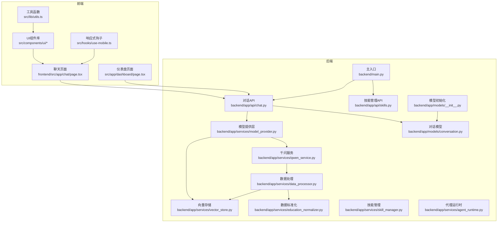
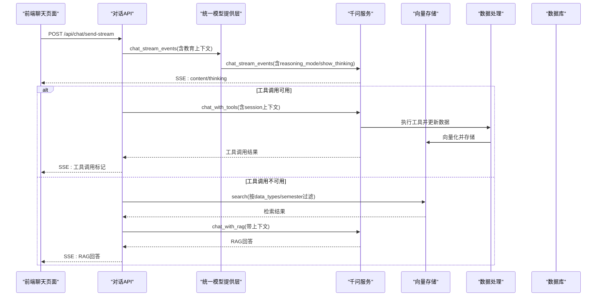
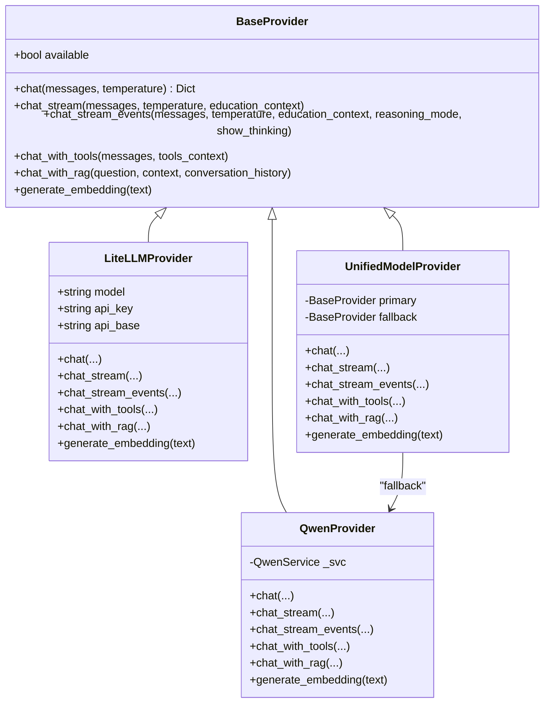
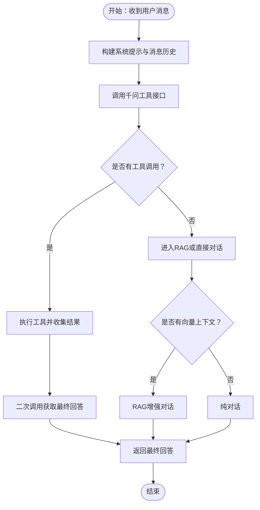
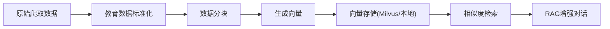
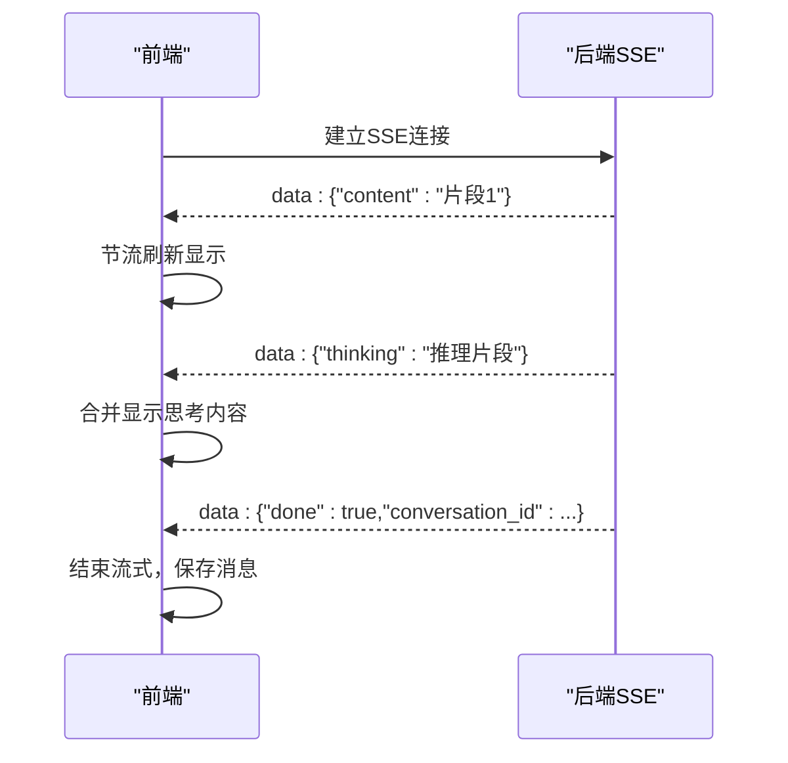
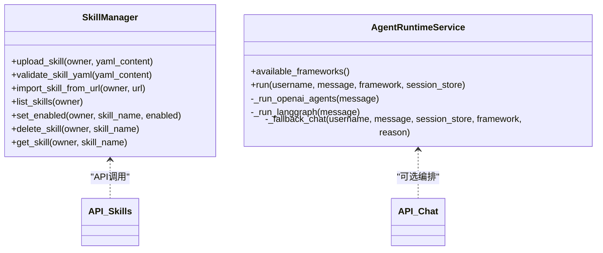
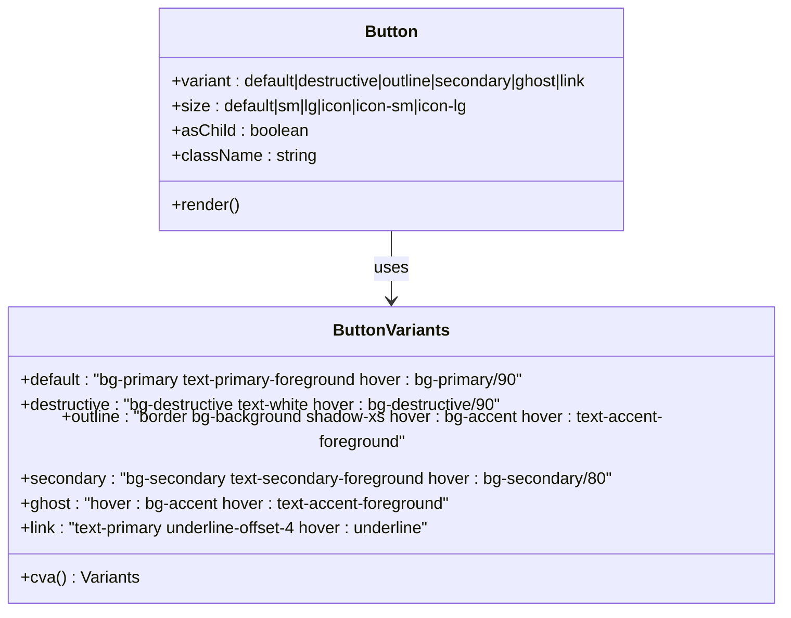
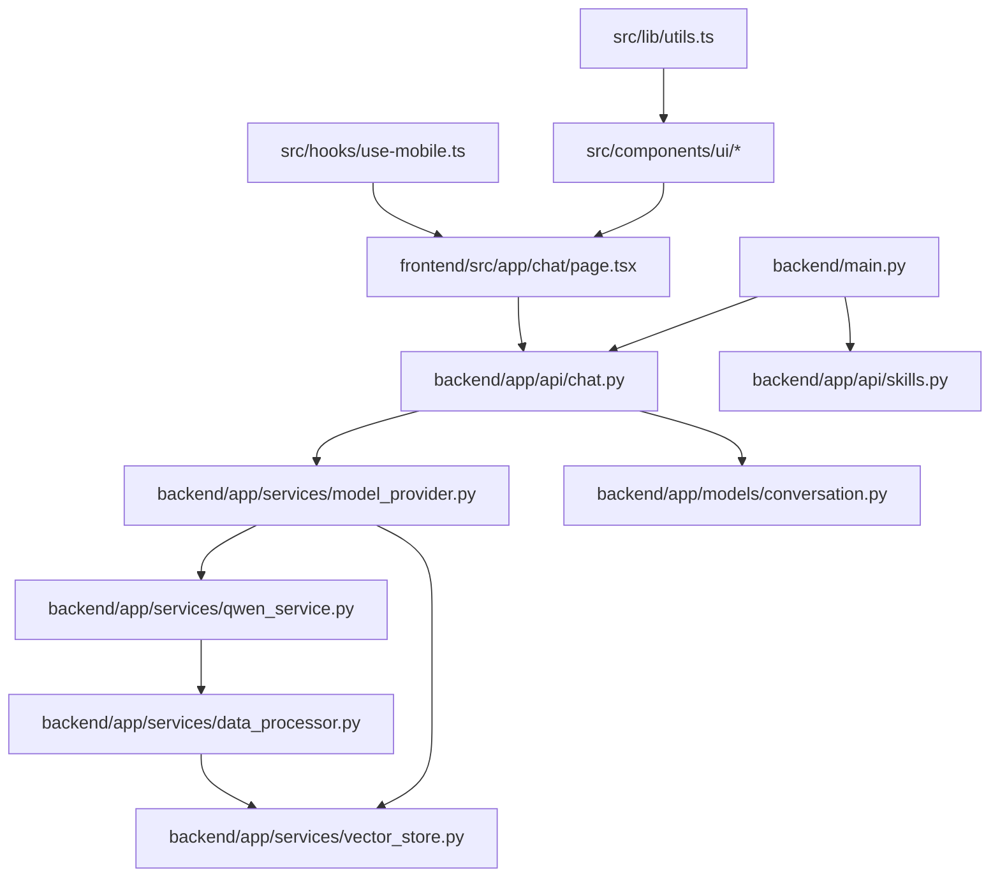

# 思考流功能

<cite>
**本文档引用的文件**
- [backend/main.py](file://backend/main.py)
- [backend/app/api/chat.py](file://backend/app/api/chat.py)
- [backend/app/services/model_provider.py](file://backend/app/services/model_provider.py)
- [backend/app/services/qwen_service.py](file://backend/app/services/qwen_service.py)
- [backend/app/services/vector_store.py](file://backend/app/services/vector_store.py)
- [backend/app/services/data_processor.py](file://backend/app/services/data_processor.py)
- [backend/app/services/education_normalizer.py](file://backend/app/services/education_normalizer.py)
- [backend/app/models/conversation.py](file://backend/app/models/conversation.py)
- [frontend/src/app/chat/page.tsx](file://frontend/src/app/chat/page.tsx)
- [backend/app/api/skills.py](file://backend/app/api/skills.py)
- [backend/app/services/skill_manager.py](file://backend/app/services/skill_manager.py)
- [backend/app/services/agent_runtime.py](file://backend/app/services/agent_runtime.py)
- [backend/app/core/config.py](file://backend/app/core/config.py)
- [backend/app/models/__init__.py](file://backend/app/models/__init__.py)
- [src/components/ui/button.tsx](file://src/components/ui/button.tsx)
- [src/components/ui/toggle.tsx](file://src/components/ui/toggle.tsx)
- [src/components/ui/dialog.tsx](file://src/components/ui/dialog.tsx)
- [src/components/ui/form.tsx](file://src/components/ui/form.tsx)
- [src/components/ui/input.tsx](file://src/components/ui/input.tsx)
- [src/components/ui/tooltip.tsx](file://src/components/ui/tooltip.tsx)
- [src/components/ui/card.tsx](file://src/components/ui/card.tsx)
- [src/components/ui/badge.tsx](file://src/components/ui/badge.tsx)
- [src/components/ui/alert.tsx](file://src/components/ui/alert.tsx)
- [src/components/ui/avatar.tsx](file://src/components/ui/avatar.tsx)
- [src/hooks/use-mobile.ts](file://src/hooks/use-mobile.ts)
- [src/lib/utils.ts](file://src/lib/utils.ts)
</cite>

## 更新摘要
**所做更改**
- 新增了前端UI组件的样式改进和交互优化
- 更新了思考流功能的视觉反馈和用户体验设计
- 增强了动态样式切换和响应式布局支持
- 完善了工具栏按钮和状态指示器的视觉设计

## 目录
1. [简介](#简介)
2. [项目结构](#项目结构)
3. [核心组件](#核心组件)
4. [架构总览](#架构总览)
5. [详细组件分析](#详细组件分析)
6. [UI组件与视觉设计](#ui组件与视觉设计)
7. [依赖关系分析](#依赖关系分析)
8. [性能考虑](#性能考虑)
9. [故障排除指南](#故障排除指南)
10. [结论](#结论)

## 简介
本项目是一个基于 FastAPI + Next.js 的教务系统智能助手，重点围绕"思考流功能"构建了完整的对话、工具调用、RAG 检索与流式输出能力。思考流功能的核心在于：
- 通过统一模型提供层（Model Provider）支持多种 LLM 后端（当前默认 Qwen，支持 LiteLLM 兼容）
- 优先使用 Function Calling（工具调用）进行数据查询，失败时回退到 RAG 检索，最终兜底为纯对话
- 支持 SSE 流式输出，实时展示 AI 回答与推理过程（可选显示思考内容）
- 以用户为中心的数据隔离与会话管理，结合向量数据库实现语义检索
- **新增**：现代化的UI组件系统，支持动态样式切换和响应式设计

## 项目结构
项目采用前后端分离架构，后端使用 FastAPI 提供 REST API，前端使用 Next.js 构建用户界面。核心模块包括：
- 后端 API 层：对话、教育数据、选项、模型、技能、代理运行时等
- 服务层：模型提供、向量存储、数据处理、教育数据标准化、技能管理、代理运行时
- 模型层：用户、对话、消息、教育数据等数据库模型
- 前端页面：聊天页面、仪表盘、设置等
- **新增**：完整的UI组件库，包含按钮、对话框、表单、输入框等基础组件

**图表来源**
- [backend/main.py:1-170](file://backend/main.py#L1-L170)
- [backend/app/api/chat.py:1-662](file://backend/app/api/chat.py#L1-L662)
- [backend/app/services/model_provider.py:1-396](file://backend/app/services/model_provider.py#L1-L396)
- [backend/app/services/qwen_service.py:1-604](file://backend/app/services/qwen_service.py#L1-L604)
- [backend/app/services/vector_store.py:1-401](file://backend/app/services/vector_store.py#L1-L401)
- [backend/app/services/data_processor.py:1-479](file://backend/app/services/data_processor.py#L1-L479)
- [backend/app/services/education_normalizer.py:1-142](file://backend/app/services/education_normalizer.py#L1-L142)
- [backend/app/models/conversation.py:1-42](file://backend/app/models/conversation.py#L1-L42)
- [frontend/src/app/chat/page.tsx:1-970](file://frontend/src/app/chat/page.tsx#L1-L970)
- [src/components/ui/button.tsx:1-63](file://src/components/ui/button.tsx#L1-L63)
- [src/hooks/use-mobile.ts:1-19](file://src/hooks/use-mobile.ts#L1-L19)
- [src/lib/utils.ts:1-7](file://src/lib/utils.ts#L1-L7)

**章节来源**
- [backend/main.py:1-170](file://backend/main.py#L1-L170)
- [frontend/src/app/chat/page.tsx:1-970](file://frontend/src/app/chat/page.tsx#L1-L970)

## 核心组件
- 统一模型提供层（UnifiedModelProvider）：封装 Qwen 与 LiteLLM，提供统一接口，支持回退机制
- 千问服务（QwenService）：集成 DashScope，实现 Function Calling、RAG、流式对话与工具执行
- 向量存储（VectorStore/TxtaiVectorStore）：支持 Milvus 与轻量本地存储，提供相似度检索
- 数据处理（DataProcessor）：将爬取数据标准化、分块、向量化并存储
- 教育数据标准化（EducationNormalizer）：统一历史数据结构，便于存储与检索
- 对话模型（Conversation/Message）：管理用户会话与消息历史
- 前端聊天页面：实现 SSE 流式接收、思考内容展示、工具调用标记等
- **新增**：完整的UI组件系统，提供一致的视觉设计和交互体验

**章节来源**
- [backend/app/services/model_provider.py:243-396](file://backend/app/services/model_provider.py#L243-L396)
- [backend/app/services/qwen_service.py:16-604](file://backend/app/services/qwen_service.py#L16-L604)
- [backend/app/services/vector_store.py:21-401](file://backend/app/services/vector_store.py#L21-L401)
- [backend/app/services/data_processor.py:14-479](file://backend/app/services/data_processor.py#L14-L479)
- [backend/app/services/education_normalizer.py:27-142](file://backend/app/services/education_normalizer.py#L27-L142)
- [backend/app/models/conversation.py:11-42](file://backend/app/models/conversation.py#L11-L42)

## 架构总览
思考流功能的整体架构遵循"工具调用优先、RAG 兜底、纯对话收尾"的三层策略。前端通过 SSE 接收流式响应，后端在模型层之上叠加工具调用与 RAG 检索，确保回答既准确又可解释。**新增**的UI组件系统提供了现代化的用户界面和响应式设计。

**图表来源**
- [backend/app/api/chat.py:360-662](file://backend/app/api/chat.py#L360-L662)
- [backend/app/services/model_provider.py:306-340](file://backend/app/services/model_provider.py#L306-L340)
- [backend/app/services/qwen_service.py:244-561](file://backend/app/services/qwen_service.py#L244-L561)
- [backend/app/services/vector_store.py:160-221](file://backend/app/services/vector_store.py#L160-L221)
- [backend/app/services/data_processor.py:149-233](file://backend/app/services/data_processor.py#L149-L233)

## 详细组件分析

### 统一模型提供层（Model Provider）
- 设计目标：保持现网行为不变（默认 Qwen），预留 LiteLLM 接入，对上层暴露统一接口
- 核心能力：
  - 主 Provider 由 MODEL_PROVIDER 决定，默认 qwen
  - 主 Provider 失败时自动回退 QwenProvider
  - 支持 chat_stream_events，可输出 thinking 事件（部分后端兼容）
  - 支持 chat_with_tools 与 chat_with_rag 的回退策略

**图表来源**
- [backend/app/services/model_provider.py:20-396](file://backend/app/services/model_provider.py#L20-L396)

**章节来源**
- [backend/app/services/model_provider.py:243-396](file://backend/app/services/model_provider.py#L243-L396)

### 千问服务（QwenService）
- Function Calling：定义工具清单（个人信息、成绩、课表、考试、培养方案、学业进度、刷新数据），支持工具执行与二次调用获取最终回答
- RAG 增强：基于检索到的上下文构造提示词，结合历史对话生成回答
- 流式对话：支持增量输出，前端可实时展示回答
- 数据更新：工具执行后触发全量数据刷新，更新数据库与向量库

**图表来源**
- [backend/app/services/qwen_service.py:244-561](file://backend/app/services/qwen_service.py#L244-L561)

**章节来源**
- [backend/app/services/qwen_service.py:16-604](file://backend/app/services/qwen_service.py#L16-L604)

### 向量存储与数据处理
- 向量存储：支持 Milvus 与轻量本地 txtai 后端，提供去重、相似度检索、按类型/学期过滤
- 数据处理：将原始爬取数据标准化、分块、向量化，批量写入向量库
- 教育数据标准化：统一历史结构，便于跨模块共享

**图表来源**
- [backend/app/services/data_processor.py:234-479](file://backend/app/services/data_processor.py#L234-L479)
- [backend/app/services/vector_store.py:160-221](file://backend/app/services/vector_store.py#L160-L221)
- [backend/app/services/education_normalizer.py:27-113](file://backend/app/services/education_normalizer.py#L27-L113)

**章节来源**
- [backend/app/services/vector_store.py:21-401](file://backend/app/services/vector_store.py#L21-L401)
- [backend/app/services/data_processor.py:14-479](file://backend/app/services/data_processor.py#L14-L479)
- [backend/app/services/education_normalizer.py:27-142](file://backend/app/services/education_normalizer.py#L27-L142)

### 前端思考流展示
- SSE 流式接收：解析 data: 块，分别处理 content 与 thinking 字段
- 节流刷新：避免高频分片导致的重绘抖动
- 工具调用标记：当 AI 发起工具调用时，前端显示相应标记
- 保活帧：后端定期发送 ping 帧，防止连接空闲断开
- **新增**：现代化的按钮组件，支持多种变体和尺寸，提供一致的视觉反馈

**图表来源**
- [frontend/src/app/chat/page.tsx:242-439](file://frontend/src/app/chat/page.tsx#L242-L439)

**章节来源**
- [frontend/src/app/chat/page.tsx:1-970](file://frontend/src/app/chat/page.tsx#L1-L970)

### 技能管理与代理运行时
- Skill 管理：支持 YAML 声明式技能上传、校验、导入、启用/禁用与删除
- 代理运行时：可插拔框架（OpenAI Agents SDK/LangGraph），失败时回退统一模型层

**图表来源**
- [backend/app/services/skill_manager.py:28-189](file://backend/app/services/skill_manager.py#L28-L189)
- [backend/app/api/skills.py:38-130](file://backend/app/api/skills.py#L38-L130)
- [backend/app/services/agent_runtime.py:21-177](file://backend/app/services/agent_runtime.py#L21-L177)

**章节来源**
- [backend/app/api/skills.py:1-130](file://backend/app/api/skills.py#L1-L130)
- [backend/app/services/skill_manager.py:1-189](file://backend/app/services/skill_manager.py#L1-L189)
- [backend/app/services/agent_runtime.py:1-177](file://backend/app/services/agent_runtime.py#L1-L177)

## UI组件与视觉设计

### 按钮组件系统
**新增**：完整的按钮组件系统，提供一致的视觉设计和交互体验

- **设计特点**：
  - 支持多种变体：default、destructive、outline、secondary、ghost、link
  - 支持多种尺寸：default、sm、lg、icon、icon-sm、icon-lg
  - 响应式设计：自动适配图标大小和间距
  - 状态反馈：悬停、激活、禁用状态的视觉变化
  - 无障碍支持：完整的键盘导航和屏幕阅读器支持

- **核心功能**：
  - 统一的样式变体系统
  - 动态类名合并（cn函数）
  - Radix UI集成，确保可访问性
  - SVG图标支持，自动调整尺寸

**图表来源**
- [src/components/ui/button.tsx:7-37](file://src/components/ui/button.tsx#L7-L37)

**章节来源**
- [src/components/ui/button.tsx:1-63](file://src/components/ui/button.tsx#L1-L63)

### 切换组件系统
**新增**：现代化的切换组件，提供清晰的状态指示

- **设计特点**：
  - 基于Radix UI Toggle Primitive
  - 支持outline和default变体
  - 尺寸自适应：default、sm、lg
  - 状态反馈：激活状态的视觉变化
  - 平滑的过渡动画效果

- **应用场景**：
  - 思考模式切换按钮
  - 功能开关控制
  - 状态指示器

**章节来源**
- [src/components/ui/toggle.tsx:1-48](file://src/components/ui/toggle.tsx#L1-L48)

### 对话框组件系统
**新增**：完整的对话框组件，支持模态交互

- **设计特点**：
  - 基于Radix UI Dialog
  - 模态背景遮罩
  - 平滑的打开/关闭动画
  - 关闭按钮集成
  - 响应式布局

- **核心功能**：
  - 对话框内容区域
  - 标题和描述区域
  - 底部操作按钮区
  - 自动焦点管理和键盘导航

**章节来源**
- [src/components/ui/dialog.tsx:1-144](file://src/components/ui/dialog.tsx#L1-L144)

### 表单组件系统
**新增**：完整的表单处理系统

- **设计特点**：
  - 基于React Hook Form
  - 集成验证状态管理
  - 无障碍支持
  - 错误状态可视化

- **核心组件**：
  - FormProvider：表单上下文提供者
  - FormField：字段容器
  - FormLabel：标签组件
  - FormControl：控件包装器
  - FormDescription：描述文本
  - FormMessage：错误消息

**章节来源**
- [src/components/ui/form.tsx:1-168](file://src/components/ui/form.tsx#L1-L168)

### 输入框组件系统
**新增**：现代化的输入框组件

- **设计特点**：
  - 基于原生HTML input
  - 统一的样式变体
  - 焦点状态管理
  - 错误状态反馈
  - 文件输入支持

- **核心功能**：
  - 类型安全的属性传递
  - 自动焦点管理
  - 错误状态可视化
  - 响应式设计

**章节来源**
- [src/components/ui/input.tsx:1-22](file://src/components/ui/input.tsx#L1-L22)

### 工具提示组件系统
**新增**：智能的工具提示系统

- **设计特点**：
  - 基于Radix UI Tooltip
  - 延迟显示控制
  - 多方向定位
  - 平滑的动画效果
  - 键盘导航支持

- **核心功能**：
  - 触发器组件
  - 内容显示区域
  - 方向偏移控制
  - 箭头指示器

**章节来源**
- [src/components/ui/tooltip.tsx:1-62](file://src/components/ui/tooltip.tsx#L1-L62)

### 卡片组件系统
**新增**：灵活的内容卡片组件

- **设计特点**：
  - 基于Flex布局
  - 灵活的网格系统
  - 边界和阴影效果
  - 响应式设计

- **核心组件**：
  - Card：基础卡片容器
  - CardHeader：头部区域
  - CardTitle：标题
  - CardDescription：描述
  - CardContent：内容区域
  - CardFooter：底部区域
  - CardAction：操作按钮

**章节来源**
- [src/components/ui/card.tsx:1-93](file://src/components/ui/card.tsx#L1-L93)

### 徽章组件系统
**新增**：状态徽章组件

- **设计特点**：
  - 基于Slot组件
  - 圆形设计
  - 多种变体：default、secondary、destructive、outline
  - 过渡动画效果
  - 键盘导航支持

**章节来源**
- [src/components/ui/badge.tsx:1-47](file://src/components/ui/badge.tsx#L1-L47)

### 警告组件系统
**新增**：状态警告组件

- **设计特点**：
  - 基于变体系统
  - 图标集成
  - 网格布局
  - 状态颜色区分

**章节来源**
- [src/components/ui/alert.tsx:1-67](file://src/components/ui/alert.tsx#L1-L67)

### 头像组件系统
**新增**：用户头像组件

- **设计特点**：
  - 基于Radix UI Avatar
  - 圆形裁剪
  - 占位符支持
  - 响应式尺寸

**章节来源**
- [src/components/ui/avatar.tsx:1-54](file://src/components/ui/avatar.tsx#L1-L54)

### 响应式钩子系统
**新增**：移动端检测钩子

- **功能特点**：
  - 基于CSS媒体查询
  - 实时窗口尺寸监听
  - 移动端断点检测
  - 状态同步管理

**章节来源**
- [src/hooks/use-mobile.ts:1-19](file://src/hooks/use-mobile.ts#L1-L19)

### 工具函数系统
**新增**：通用工具函数

- **功能特点**：
  - 类名合并（clsx + tailwind-merge）
  - 条件类名应用
  - CSS变量支持
  - 类型安全

**章节来源**
- [src/lib/utils.ts:1-7](file://src/lib/utils.ts#L1-L7)

## 依赖关系分析
- 后端入口依赖：CORS 中间件、健康检查、路由注册、启动事件（数据库建表、Intake 初始化）
- 对话 API 依赖：模型提供层、向量存储、教育数据标准化、技能提示构建、安全隔离
- 模型提供层依赖：QwenService、LiteLLMProvider
- QwenService 依赖：DashScope、数据处理、向量存储
- 前端聊天页面依赖：SSE 流式接收、本地存储、路由导航
- **新增**：UI组件依赖关系：cn函数、Radix UI组件、Lucide React图标

**图表来源**
- [backend/main.py:12-104](file://backend/main.py#L12-L104)
- [backend/app/api/chat.py:17-29](file://backend/app/api/chat.py#L17-L29)
- [backend/app/services/model_provider.py:172-396](file://backend/app/services/model_provider.py#L172-L396)
- [backend/app/services/qwen_service.py:16-604](file://backend/app/services/qwen_service.py#L16-L604)
- [backend/app/services/vector_store.py:21-401](file://backend/app/services/vector_store.py#L21-L401)
- [backend/app/models/conversation.py:11-42](file://backend/app/models/conversation.py#L11-L42)
- [frontend/src/app/chat/page.tsx:178-439](file://frontend/src/app/chat/page.tsx#L178-L439)
- [src/components/ui/button.tsx:1-63](file://src/components/ui/button.tsx#L1-L63)
- [src/lib/utils.ts:1-7](file://src/lib/utils.ts#L1-L7)
- [src/hooks/use-mobile.ts:1-19](file://src/hooks/use-mobile.ts#L1-L19)

**章节来源**
- [backend/main.py:1-170](file://backend/main.py#L1-L170)
- [backend/app/models/__init__.py:10-26](file://backend/app/models/__init__.py#L10-L26)

## 性能考虑
- 流式输出：前端节流刷新，减少频繁重绘；后端保活 ping 帧避免连接断开
- 向量检索：Milvus 使用 COSINE 距离与 IVF_FLAT 索引，支持 nprobe 参数调优
- 批量向量化：数据处理按批次生成向量，避免超时
- 回退策略：主通道失败自动回退 Qwen，保证可用性
- 数据隔离：按用户 ID 查询与删除，避免跨用户数据泄露
- **新增**：UI组件优化：使用cn函数合并类名，避免重复渲染；响应式设计减少不必要的重绘

## 故障排除指南
- 工具调用失败：检查 SessionStore 是否提供 session/server_url/username，确认教务系统登录状态
- RAG 检索无结果：确认向量库可用、数据已向量化、过滤条件（data_types/semester）合理
- 流式连接中断：检查后端日志与超时设置，前端重试逻辑
- 模型服务不可用：检查 MODEL_PROVIDER、QWEN_API_KEY、LITELLM 配置
- 数据库建表失败：检查数据库连接与权限
- **新增**：UI组件问题：检查cn函数是否正确合并类名；确认Radix UI组件正确导入；验证SVG图标尺寸

**章节来源**
- [backend/app/api/chat.py:532-534](file://backend/app/api/chat.py#L532-L534)
- [backend/app/services/model_provider.py:276-283](file://backend/app/services/model_provider.py#L276-L283)
- [backend/app/services/vector_store.py:168-170](file://backend/app/services/vector_store.py#L168-L170)

## 结论
思考流功能通过"工具调用优先、RAG 兜底、纯对话收尾"的策略，在保证准确性的同时提升了用户体验。统一模型提供层与千问服务的组合，使得系统具备良好的扩展性与稳定性。前端 SSE 流式展示与工具调用标记，让用户能够直观感知 AI 的思考过程。配合向量存储与数据处理，系统实现了从数据采集到语义检索的完整闭环。

**新增**的现代化UI组件系统进一步增强了用户体验，提供了：
- 一致的视觉设计语言
- 响应式布局支持
- 丰富的交互反馈
- 完善的无障碍支持
- 灵活的主题定制能力

这些改进共同构成了一个功能完整、界面美观、体验优秀的智能教务助手系统。