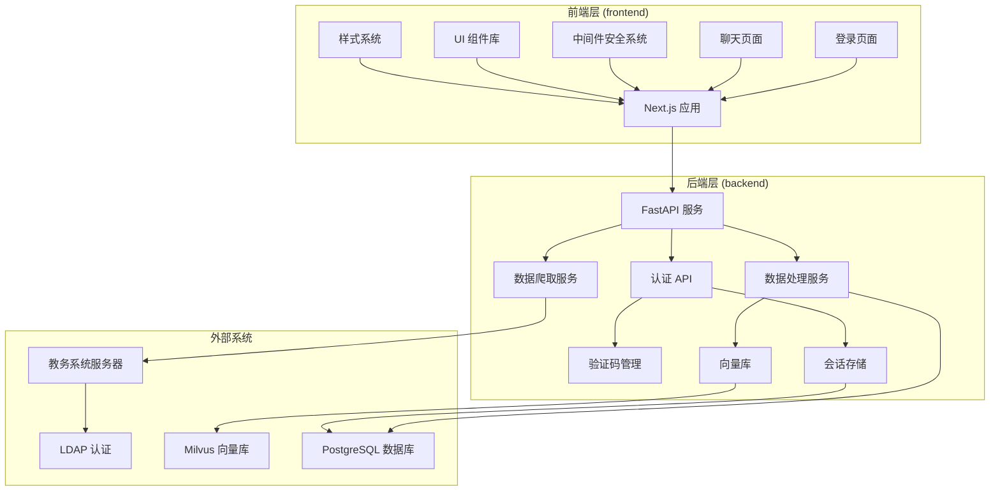
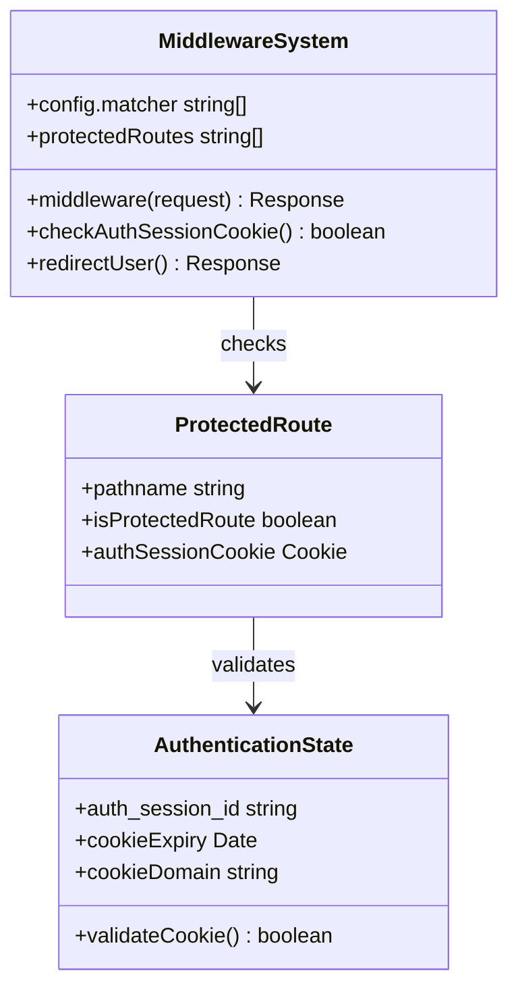
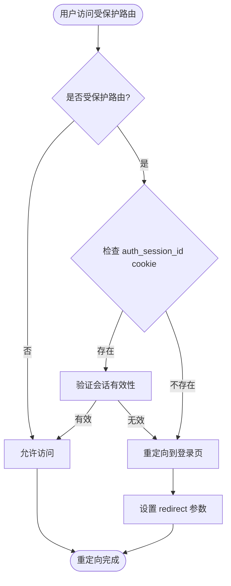
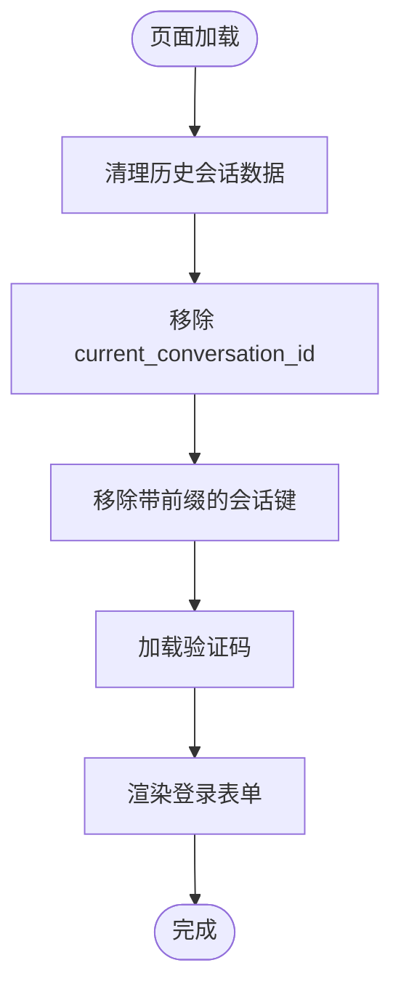
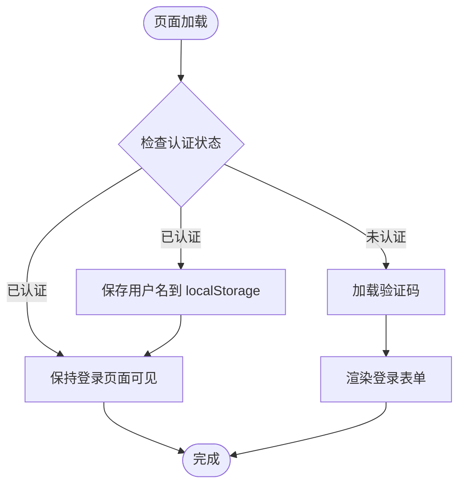
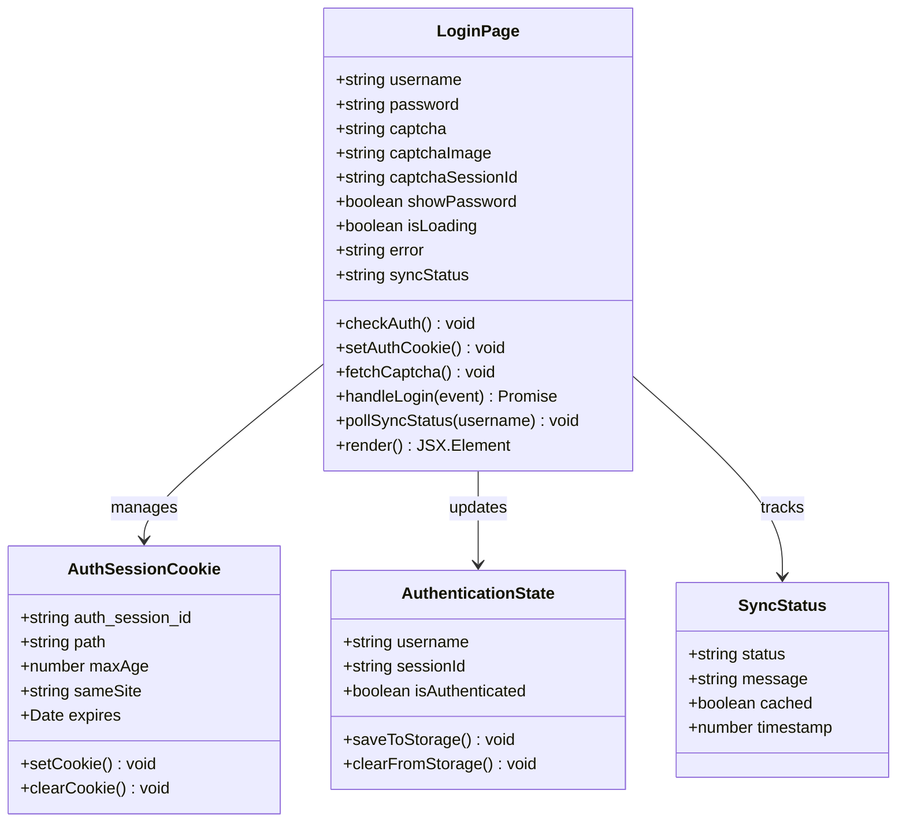
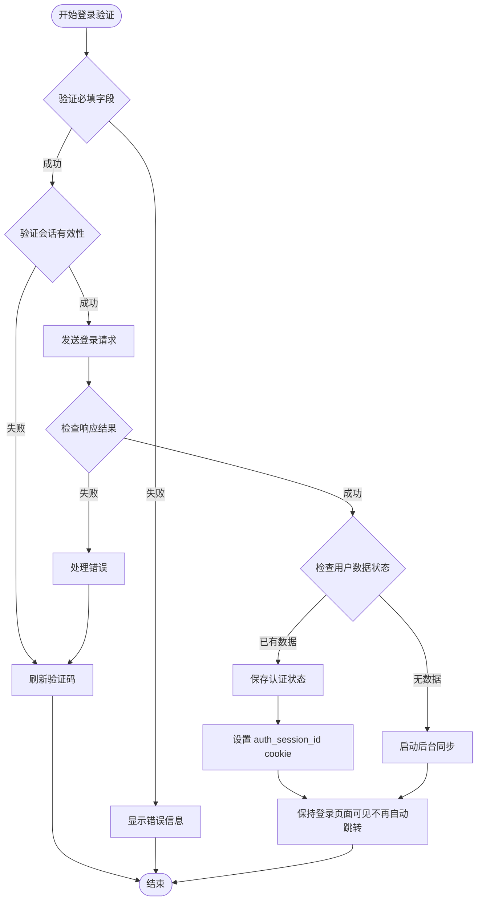
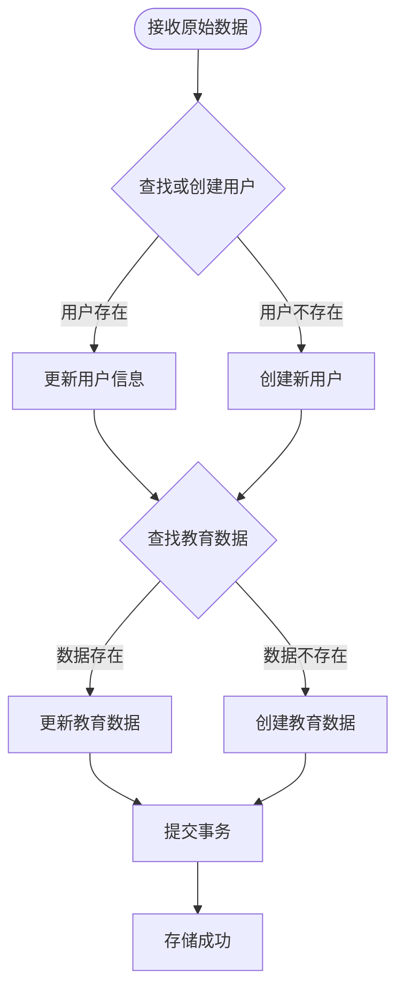
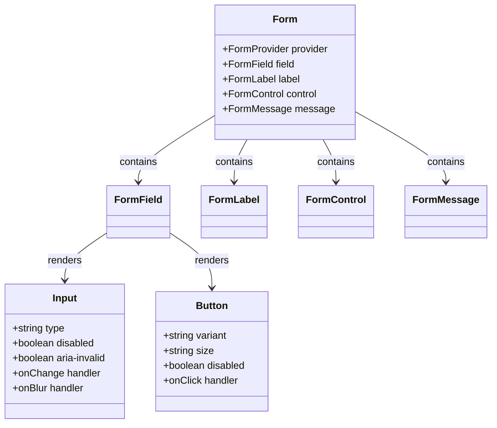
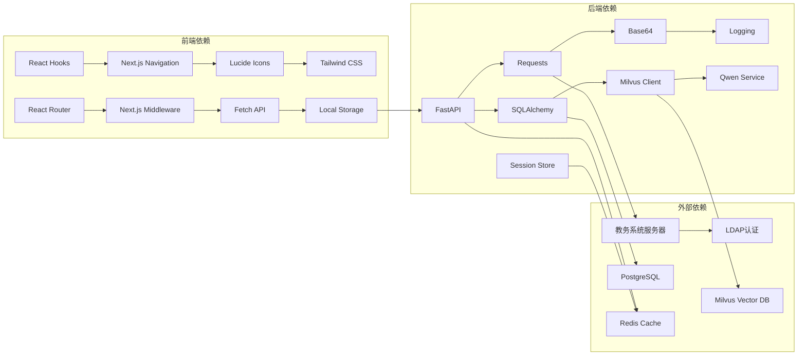

# 登录页面与认证流程

<cite>
**本文档引用的文件**
- [frontend/src/middleware.ts](file://frontend/src/middleware.ts)
- [frontend/src/app/login/page.tsx](file://frontend/src/app/login/page.tsx)
- [frontend/src/app/chat/page.tsx](file://frontend/src/app/chat/page.tsx)
- [backend/main.py](file://backend/main.py)
- [backend/test_login.py](file://backend/test_login.py)
- [backend/app/services/data_processor.py](file://backend/app/services/data_processor.py)
- [backend/scraper.py](file://backend/scraper.py)
- [backend/app/api/auth_sync.py](file://backend/app/api/auth_sync.py)
- [src/components/ui/form.tsx](file://src/components/ui/form.tsx)
- [src/components/ui/input.tsx](file://src/components/ui/input.tsx)
- [src/components/ui/button.tsx](file://src/components/ui/button.tsx)
- [src/lib/utils.ts](file://src/lib/utils.ts)
- [src/app/layout.tsx](file://src/app/layout.tsx)
- [src/app/globals.css](file://src/app/globals.css)
</cite>

## 更新摘要
**变更内容**
- **登录页面行为重大改进**：移除了自动重定向机制，改为保持登录页面可见以支持用户登出和切换账号
- **新增会话清理功能**：登录页面加载时自动清理localStorage中的历史会话数据
- **中间件安全系统升级**：从 `session_username` cookie 迁移到 `auth_session_id` cookie
- **增强用户体验**：用户现在可以在登录页面直接登出并切换不同的账号

## 目录
1. [简介](#简介)
2. [项目结构](#项目结构)
3. [核心组件](#核心组件)
4. [架构概览](#架构概览)
5. [详细组件分析](#详细组件分析)
6. [依赖关系分析](#依赖关系分析)
7. [性能考虑](#性能考虑)
8. [故障排除指南](#故障排除指南)
9. [结论](#结论)

## 简介

智能教务系统AI助手的登录页面与认证流程是一个完整的前后端分离认证系统，实现了基于教务系统的单点登录功能。该系统采用React + Next.js作为前端框架，FastAPI作为后端API服务，通过验证码机制确保登录安全性，并实现了完整的用户认证状态管理。

**重大更新**：系统已进行了重要的登录页面行为改进，移除了自动重定向机制，改为保持登录页面可见以支持用户登出和切换账号。这一改进显著提升了用户体验，使用户能够在同一浏览器中轻松切换不同的教务系统账号。

**新增会话清理功能**：系统现在在登录页面加载时自动清理localStorage中的历史会话数据，避免历史会话干扰本次登录操作。这确保了用户每次登录都能获得干净的会话环境。

**升级的安全系统**：系统现已升级到更安全的中间件安全机制，通过 `frontend/src/middleware.ts` 实现：

- **路由级安全保护**：拦截对受保护路由（如 `/chat`）的访问
- **会话凭证验证**：检查 `auth_session_id` cookie 确保用户已登录
- **自动重定向**：未登录用户访问受保护路由时自动跳转到登录页
- **安全的会话管理**：通过 `auth_session_id` cookie 实现跨页面的认证状态共享

系统的核心特性包括：
- 基于教务系统的登录认证
- 动态验证码生成与验证
- 自动认证检查功能
- 多服务器负载均衡支持
- 完整的错误处理与用户体验优化
- 安全的会话管理机制
- 智能数据同步与缓存机制
- 前端中间件安全保护
- 会话清理与切换账号支持

## 项目结构

该项目采用前后端分离的架构设计，主要分为以下层次：



**图表来源**
- [frontend/src/app/login/page.tsx:1-293](file://frontend/src/app/login/page.tsx#L1-L293)
- [frontend/src/middleware.ts:1-33](file://frontend/src/middleware.ts#L1-L33)
- [backend/main.py:1-1039](file://backend/main.py#L1-L1039)

**章节来源**
- [frontend/src/app/login/page.tsx:1-293](file://frontend/src/app/login/page.tsx#L1-L293)
- [frontend/src/middleware.ts:1-33](file://frontend/src/middleware.ts#L1-L33)
- [backend/main.py:1-1039](file://backend/main.py#L1-L1039)

## 核心组件

### 登录页面组件

**更新组件**：登录页面现在包含多项重要改进：

- **保持可见设计**：移除了自动重定向机制，登录成功后仍保持登录页面可见，支持用户登出和切换账号
- **会话清理功能**：页面加载时自动清理localStorage中的历史会话数据，避免历史会话干扰
- **表单字段**：学号、密码、验证码输入框
- **自动认证检查**：页面加载时自动检查认证状态并跳转
- **视觉反馈**：密码可见性切换、加载状态指示
- **错误处理**：实时错误提示与自动重试机制
- **用户体验**：流畅的动画效果与响应式设计
- **数据同步状态**：实时显示数据同步进度和状态
- **会话管理**：登录成功后正确设置 `auth_session_id` cookie

### 前端中间件安全系统

**更新组件**：系统现在包含升级的前端中间件安全保护机制：

- **路由保护**：拦截对 `/chat` 等受保护路由的访问
- **会话验证**：检查 `auth_session_id` cookie 确保用户已登录
- **自动重定向**：未登录用户访问受保护路由时自动跳转到登录页
- **安全匹配器**：配置中间件匹配的路由模式
- **跨页面认证**：通过 `auth_session_id` cookie 实现跨页面的认证状态共享

### 验证码管理系统

系统实现了智能的验证码管理机制：

- **动态生成**：基于用户学号选择对应服务器
- **会话绑定**：验证码与登录操作的严格关联
- **过期控制**：自动清理过期的验证码会话
- **错误恢复**：验证码失效时的自动刷新机制
- **详细日志**：完整的验证码请求和响应日志记录

### 认证状态管理

实现了完整的认证生命周期管理：

- **本地存储**：用户名信息的持久化存储
- **路由保护**：基于认证状态的页面跳转
- **会话同步**：前后端认证状态的一致性
- **Cookie 管理**：通过 `auth_session_id` cookie 实现中间件验证
- **数据同步**：登录成功后的后台数据爬取和存储
- **智能检查**：自动检测用户数据状态，避免重复爬取

### 数据同步服务

新增的数据同步机制提供了灵活的数据管理能力：

- **自动同步**：首次登录时自动后台爬取数据
- **手动同步**：支持用户主动触发数据同步
- **状态跟踪**：实时跟踪数据同步进度和状态
- **缓存支持**：支持使用已有数据进行基础访问
- **降级处理**：同步失败时提供基础功能支持

**章节来源**
- [frontend/src/middleware.ts:4-32](file://frontend/src/middleware.ts#L4-L32)
- [frontend/src/app/login/page.tsx:23-43](file://frontend/src/app/login/page.tsx#L23-L43)
- [frontend/src/app/chat/page.tsx:410-428](file://frontend/src/app/chat/page.tsx#L410-L428)
- [backend/main.py:163-531](file://backend/main.py#L163-L531)
- [backend/app/services/data_processor.py:13-356](file://backend/app/services/data_processor.py#L13-L356)

## 架构概览

系统采用分层架构设计，确保了良好的可维护性和扩展性：

```mermaid
sequenceDiagram
participant U as 用户浏览器
participant LP as 登录页面
participant MW as 前端中间件
participant FE as 前端应用
participant BE as 后端API
participant JW as 教务系统
participant DB as 数据库
participant VS as 向量库
U->>LP : 加载登录页面
LP->>LP : 清理历史会话数据
LP->>BE : GET /api/auth/me
BE-->>LP : 返回认证状态
alt 已认证
LP-->>U : 保持登录页面可见
else 未认证
LP->>BE : GET /api/captcha
BE->>JW : 获取验证码图片
JW-->>BE : 返回验证码
BE-->>LP : 返回验证码数据
LP-->>U : 显示验证码
U->>LP : 输入凭据并提交
LP->>BE : POST /api/login
BE->>BE : 检查用户数据状态
BE->>JW : 执行登录验证
JW-->>BE : 返回登录结果
BE->>BE : 根据状态决定是否同步
alt 首次登录
BE->>BE : 启动后台同步任务
BE->>DB : 存储爬取数据
BE->>VS : 向量化存储
end
BE-->>LP : 返回认证结果
LP->>LP : 设置 auth_session_id cookie
LP-->>U : 保持登录页面可见不再自动跳转
end
end
U->>MW : 访问受保护路由
MW->>MW : 检查 auth_session_id cookie
alt 未登录
MW-->>U : 重定向到登录页
else 已登录
MW->>FE : 允许访问
end
```

**图表来源**
- [frontend/src/middleware.ts:16-29](file://frontend/src/middleware.ts#L16-L29)
- [frontend/src/app/login/page.tsx:23-43](file://frontend/src/app/login/page.tsx#L23-L43)
- [backend/main.py:237-432](file://backend/main.py#L237-L432)

## 详细组件分析

### 前端中间件安全系统

**更新组件**：前端中间件安全系统提供了完整的路由级安全保护：

#### 中间件实现架构



**图表来源**
- [frontend/src/middleware.ts:4-32](file://frontend/src/middleware.ts#L4-L32)

#### 路由保护流程



**图表来源**
- [frontend/src/middleware.ts:16-29](file://frontend/src/middleware.ts#L16-L29)

### 登录页面实现

**更新组件**：登录页面采用了现代化的React Hooks模式，实现了完整的用户交互逻辑，包含多项重要改进：

#### 会话清理机制

**新增功能**：登录页面现在包含自动会话清理功能：



**图表来源**
- [frontend/src/app/login/page.tsx:58-72](file://frontend/src/app/login/page.tsx#L58-L72)

#### 自动认证检查机制

**更新功能**：登录页面现在包含自动认证检查功能，但不再自动重定向：



**图表来源**
- [frontend/src/app/login/page.tsx:23-43](file://frontend/src/app/login/page.tsx#L23-L43)

#### 状态管理架构



**图表来源**
- [frontend/src/app/login/page.tsx:7-17](file://frontend/src/app/login/page.tsx#L7-L17)
- [frontend/src/app/login/page.tsx:23-43](file://frontend/src/app/login/page.tsx#L23-L43)

#### 登录验证流程

登录验证实现了多层安全检查和智能数据处理：



**图表来源**
- [frontend/src/app/login/page.tsx:95-166](file://frontend/src/app/login/page.tsx#L95-L166)
- [frontend/src/app/login/page.tsx:23-43](file://frontend/src/app/login/page.tsx#L23-L43)
- [backend/main.py:237-432](file://backend/main.py#L237-L432)

### 后端认证服务

后端服务实现了完整的认证逻辑，包括验证码管理、登录验证和智能数据处理：

#### 自动认证检查端点

**更新端点**：系统现在提供 `/api/auth/me` 端点用于自动认证检查：

- **会话验证**：检查 `auth_session_id` cookie 确保用户已登录
- **用户信息返回**：返回认证用户的用户名和用户ID
- **服务端会话校验**：仅信任服务端存储的会话信息
- **安全的会话管理**：通过服务端会话存储确保会话安全性

#### 验证码管理机制

后端实现了基于会话的验证码管理：

- **会话存储**：使用字典存储验证码会话
- **服务器绑定**：验证码与特定服务器的绑定
- **过期清理**：自动清理过期的验证码会话
- **错误检测**：智能识别验证码错误类型
- **详细日志**：完整的验证码请求和响应日志

#### 登录验证算法

登录验证过程包含了多层检查机制和智能数据处理：


**图表来源**
- [backend/main.py:237-432](file://backend/main.py#L237-L432)

#### 数据同步机制

新增的数据同步机制提供了灵活的数据管理能力：


**图表来源**
- [backend/main.py:448-497](file://backend/main.py#L448-L497)
- [backend/app/services/data_processor.py:16-96](file://backend/app/services/data_processor.py#L16-L96)

### 数据处理服务

数据处理服务实现了完整的数据存储和向量化功能：

#### 数据存储流程



**图表来源**
- [backend/app/services/data_processor.py:16-96](file://backend/app/services/data_processor.py#L16-L96)

#### 向量化处理流程


**图表来源**
- [backend/app/services/data_processor.py:97-181](file://backend/app/services/data_processor.py#L97-L181)

### UI组件系统

系统采用了现代化的组件化设计，提供了丰富的UI组件：

#### 表单组件架构



**图表来源**
- [src/components/ui/form.tsx:19-168](file://src/components/ui/form.tsx#L19-L168)
- [src/components/ui/input.tsx:5-22](file://src/components/ui/input.tsx#L5-L22)
- [src/components/ui/button.tsx:39-63](file://src/components/ui/button.tsx#L39-L63)

**章节来源**
- [frontend/src/middleware.ts:1-33](file://frontend/src/middleware.ts#L1-L33)
- [frontend/src/app/login/page.tsx:176-293](file://frontend/src/app/login/page.tsx#L176-L293)
- [frontend/src/app/chat/page.tsx:410-428](file://frontend/src/app/chat/page.tsx#L410-L428)
- [backend/main.py:166-531](file://backend/main.py#L166-L531)
- [backend/app/services/data_processor.py:13-356](file://backend/app/services/data_processor.py#L13-L356)

## 依赖关系分析

系统各组件之间的依赖关系清晰明确：



**图表来源**
- [frontend/src/app/login/page.tsx:3-5](file://frontend/src/app/login/page.tsx#L3-L5)
- [frontend/src/middleware.ts:1-2](file://frontend/src/middleware.ts#L1-L2)
- [backend/main.py:5-44](file://backend/main.py#L5-L44)

**章节来源**
- [frontend/src/app/login/page.tsx:1-293](file://frontend/src/app/login/page.tsx#L1-L293)
- [frontend/src/middleware.ts:1-33](file://frontend/src/middleware.ts#L1-L33)
- [backend/main.py:1-1039](file://backend/main.py#L1-L1039)

## 性能考虑

系统在设计时充分考虑了性能优化：

### 前端性能优化

- **懒加载**：使用React.lazy实现组件懒加载
- **状态优化**：合理使用useState和useEffect避免不必要的重渲染
- **资源压缩**：图片和静态资源的压缩处理
- **缓存策略**：验证码图片的浏览器缓存机制
- **并发控制**：验证码刷新的防抖处理
- **即时反馈**：登录成功后立即提供状态反馈
- **中间件优化**：高效的路由匹配和会话检查机制
- **自动认证检查**：页面加载时的轻量级认证检查
- **会话清理优化**：只清理必要的localStorage键值对

### 后端性能优化

- **会话复用**：验证码会话的复用减少重复请求
- **超时控制**：合理的HTTP请求超时设置
- **并发处理**：异步处理多个用户的登录请求
- **内存管理**：及时清理过期的会话数据
- **日志优化**：关键操作的日志记录，避免过度输出
- **智能检查**：避免重复爬取已有数据
- **会话存储优化**：Redis缓存提升会话查询性能

### 数据处理优化

- **批量处理**：向量化处理采用批量模式
- **增量更新**：支持增量数据更新
- **缓存策略**：智能缓存机制减少重复计算
- **资源管理**：向量库连接池管理

### 网络优化

- **反向代理**：通过Nginx实现请求转发和负载均衡
- **CDN支持**：静态资源的CDN加速
- **连接池**：HTTP连接的复用和管理
- **智能路由**：根据学号选择最优服务器

## 故障排除指南

### 常见问题及解决方案

#### 会话清理问题

**问题**：登录页面加载时会话清理失败
- **原因**：localStorage访问权限限制或浏览器兼容性问题
- **解决方案**：检查浏览器设置，确保localStorage可用
- **调试方法**：使用浏览器开发者工具检查localStorage状态

**问题**：历史会话数据仍然存在影响登录
- **原因**：会话清理逻辑异常或localStorage键值格式变化
- **解决方案**：检查会话清理函数的键值匹配逻辑
- **增强机制**：系统现在使用更精确的键值匹配模式

#### 自动认证检查问题

**问题**：自动认证检查失败但用户已登录
- **原因**：`auth_session_id` cookie 未正确设置或已过期
- **解决方案**：检查登录流程中的 cookie 设置，确认会话状态有效
- **调试方法**：使用浏览器开发者工具检查 `auth_session_id` cookie 状态

**问题**：页面加载时认证检查超时
- **原因**：网络延迟或后端服务响应慢
- **解决方案**：适当增加超时时间，检查网络连接质量
- **增强机制**：系统现在使用 `credentials: "include"` 确保携带 cookie

#### 验证码相关问题

**问题**：验证码无法显示或显示异常
- **原因**：网络连接问题或服务器不可达
- **解决方案**：检查网络连接，刷新页面重新获取验证码
- **日志定位**：查看后端日志中的验证码请求状态码和响应内容

**问题**：验证码频繁过期
- **原因**：会话超时或服务器选择不匹配
- **解决方案**：确保在验证码有效期内完成登录操作
- **增强机制**：系统现在会自动检测会话状态并提供相应的错误提示

#### 登录相关问题

**问题**：登录失败但验证码有效
- **原因**：用户名、密码或验证码输入错误
- **解决方案**：仔细核对输入信息，重新获取验证码
- **改进处理**：后端现在提供更精确的错误分类，区分用户名不存在、密码错误和验证码错误

**问题**：跨服务器登录失败
- **原因**：验证码与登录服务器不匹配
- **解决方案**：确保在输入学号后等待验证码刷新
- **增强机制**：系统现在会自动根据学号选择正确的服务器

#### 中间件安全问题

**问题**：受保护路由访问被错误拦截
- **原因**：`auth_session_id` cookie 未正确设置或已过期
- **解决方案**：检查登录流程中的 cookie 设置，确认会话状态有效
- **调试方法**：使用浏览器开发者工具检查 `auth_session_id` cookie 状态

**问题**：登录后仍无法访问受保护路由
- **原因**：中间件配置问题或 cookie 域名设置错误
- **解决方案**：检查中间件配置和 cookie 的 `SameSite` 属性设置
- **增强机制**：系统现在使用 `SameSite=Lax` 确保跨站访问的安全性

#### 数据同步问题

**问题**：数据同步失败
- **原因**：教务系统数据获取异常或网络问题
- **解决方案**：系统会自动重试并提供降级处理
- **用户体验**：即使同步失败，用户仍可使用基础功能

**问题**：手动同步端点不可用
- **原因**：用户未登录或同步任务正在进行中
- **解决方案**：先登录系统，等待当前同步任务完成
- **状态检查**：使用 `/api/sync-status` 端点检查同步状态

#### 性能问题

**问题**：页面加载缓慢
- **原因**：网络延迟或服务器响应慢
- **解决方案**：检查网络状况，适当增加超时时间
- **监控机制**：系统提供详细的性能指标和错误日志

**问题**：数据同步超时
- **原因**：教务系统响应慢或数据量过大
- **解决方案**：系统会在超时后自动跳转到聊天页面
- **用户体验**：提供缓存数据的降级访问

**章节来源**
- [frontend/src/middleware.ts:16-29](file://frontend/src/middleware.ts#L16-L29)
- [frontend/src/app/login/page.tsx:23-43](file://frontend/src/app/login/page.tsx#L23-L43)
- [backend/test_login.py:19-152](file://backend/test_login.py#L19-L152)
- [frontend/src/app/login/page.tsx:33-35](file://frontend/src/app/login/page.tsx#L33-L35)

## 结论

智能教务系统AI助手的登录页面与认证流程是一个设计精良的完整解决方案。系统通过前后端协作，实现了安全、可靠的用户认证机制。

**重大改进**：经过最近的重要更新，系统在以下方面得到了显著提升：
- **登录页面行为优化**：移除了自动重定向机制，改为保持登录页面可见以支持用户登出和切换账号
- **会话清理功能**：新增了清理localStorage中的历史会话数据功能
- **自动认证检查功能**：新增 `/api/auth/me` 端点，支持页面加载时的自动认证检查
- **升级的安全系统**：从 `session_username` cookie 迁移到 `auth_session_id` cookie
- **会话管理完善**：登录成功后正确设置 `auth_session_id` cookie
- **受保护路由拦截**：自动拦截对 `/chat` 等受保护路由的未授权访问
- **手动同步端点**：新增 `/api/sync-data` 端点，支持用户主动触发数据同步
- **智能数据检查**：登录时自动检查用户数据状态，避免重复爬取
- **即时访问体验**：登录成功后立即判断数据状态并提供相应提示
- **缓存数据支持**：支持使用已有数据进行基础功能访问
- **降级处理机制**：数据同步失败时提供基础对话模式
- **详细日志记录**：每个验证码请求和登录操作都包含完整的日志信息
- **响应状态码验证**：严格的HTTP状态码检查，确保请求的有效性
- **图像数据有效性检查**：验证返回内容的长度和格式，防止无效数据进入系统
- **改进的错误处理**：更精确的错误分类和用户友好的错误提示

### 主要优势

1. **安全性**：实现了多层验证机制，包括验证码、会话管理和服务器绑定
2. **用户体验**：提供了流畅的交互体验和完善的错误处理
3. **智能化**：支持自动认证检查和手动同步，提升系统灵活性
4. **可扩展性**：模块化的架构设计便于功能扩展和维护
5. **性能优化**：合理的缓存策略和异步处理机制
6. **稳定性**：经过增强后，系统运行更加稳定可靠
7. **降级支持**：数据同步失败时提供基础功能支持
8. **可观测性**：详细的日志记录和错误追踪机制
9. **安全保护**：完整的前端中间件安全系统，提供路由级保护
10. **会话管理**：支持用户在登录页面直接登出和切换账号

### 改进建议

1. **增强安全**：可以考虑添加双因素认证机制
2. **监控告警**：增加详细的日志记录和异常监控
3. **国际化**：支持多语言界面以服务更多用户
4. **移动端优化**：针对移动设备进行专门的界面优化
5. **缓存优化**：可以考虑添加验证码图片的缓存机制
6. **性能监控**：增加系统性能指标的实时监控
7. **用户体验优化**：进一步优化数据同步的用户体验
8. **安全审计**：定期进行安全审计和漏洞扫描

该系统为智能教务系统提供了坚实的技术基础，能够有效支撑后续的功能扩展和业务发展。新增的自动认证检查功能、升级的中间件安全系统和会话清理功能进一步增强了系统的安全性，确保只有经过认证的用户才能访问受保护的功能模块。同时，保持登录页面可见的设计让用户能够轻松地登出并切换不同的账号，显著提升了用户体验。