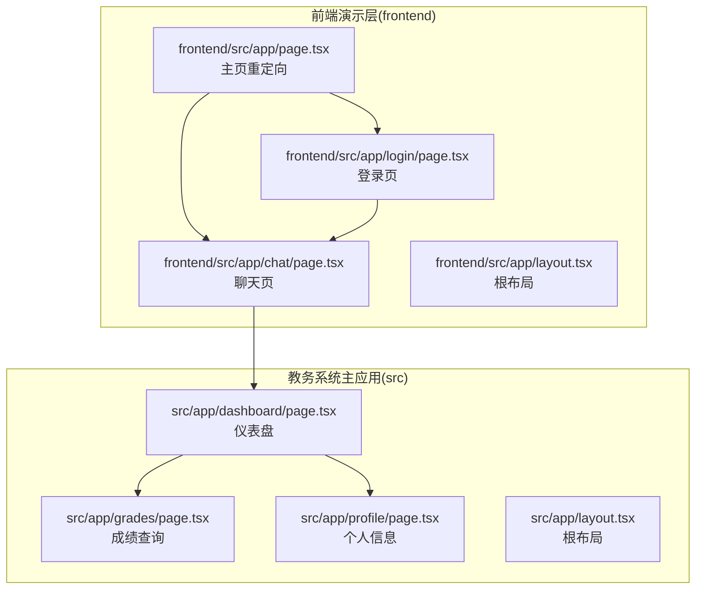
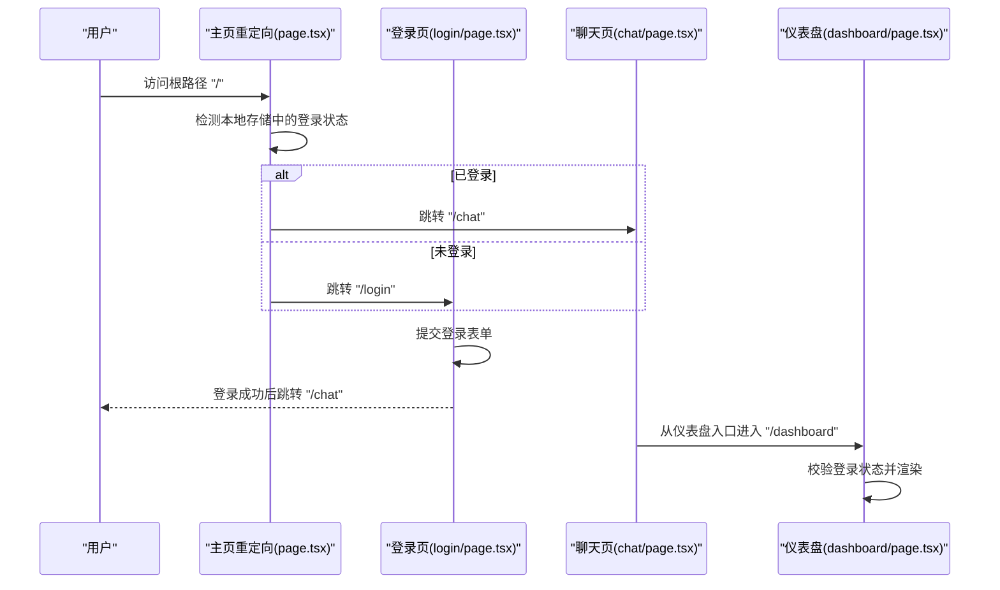
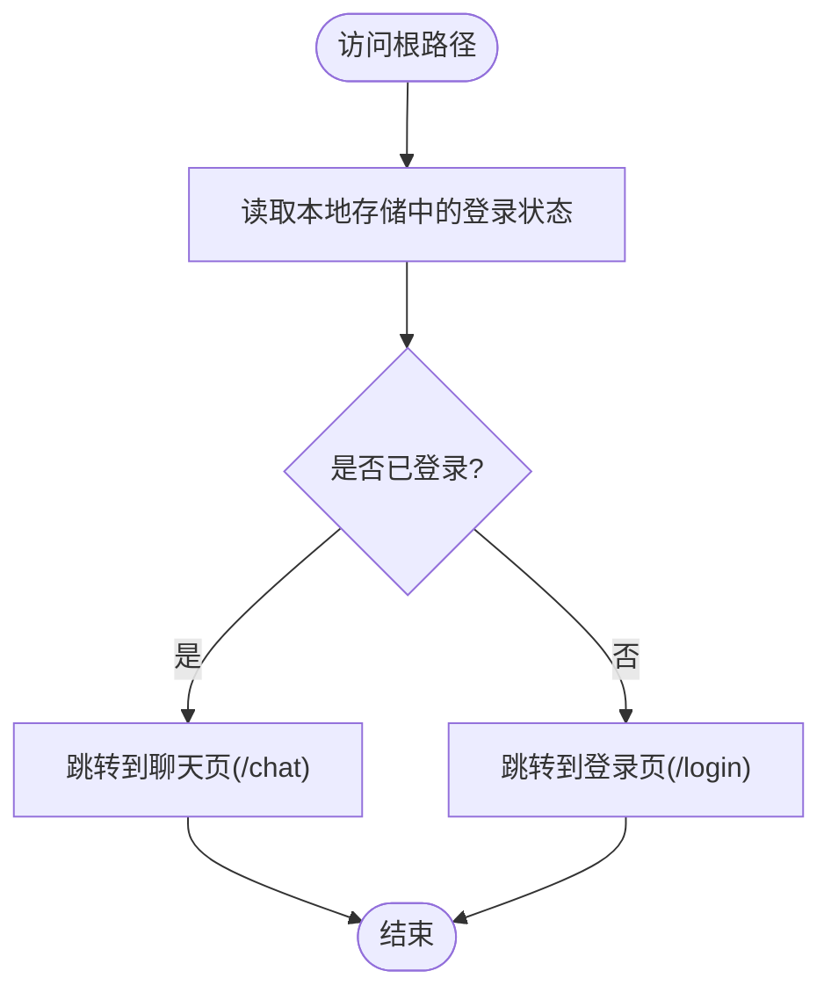
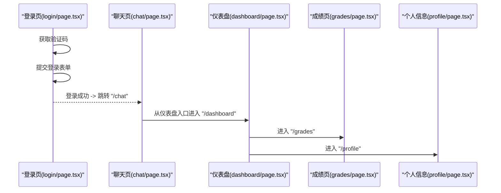
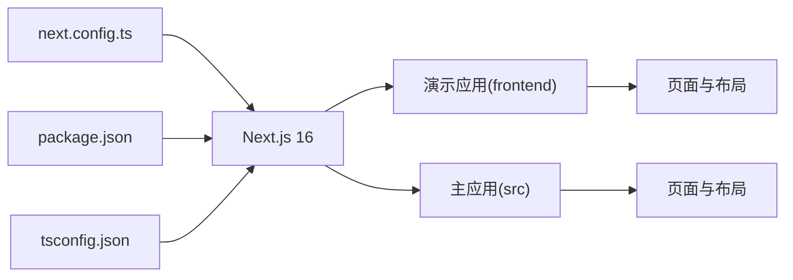

# 路由系统与页面架构

<cite>
**本文档引用的文件**
- [frontend/src/app/layout.tsx](file://frontend/src/app/layout.tsx)
- [frontend/src/app/page.tsx](file://frontend/src/app/page.tsx)
- [frontend/src/app/login/page.tsx](file://frontend/src/app/login/page.tsx)
- [frontend/src/app/chat/page.tsx](file://frontend/src/app/chat/page.tsx)
- [src/app/layout.tsx](file://src/app/layout.tsx)
- [src/app/page.tsx](file://src/app/page.tsx)
- [src/app/dashboard/page.tsx](file://src/app/dashboard/page.tsx)
- [src/app/grades/page.tsx](file://src/app/grades/page.tsx)
- [src/app/profile/page.tsx](file://src/app/profile/page.tsx)
- [next.config.ts](file://next.config.ts)
- [package.json](file://package.json)
- [tsconfig.json](file://tsconfig.json)
- [src/components/ui/sidebar.tsx](file://src/components/ui/sidebar.tsx)
</cite>

## 目录
1. [引言](#引言)
2. [项目结构](#项目结构)
3. [核心组件](#核心组件)
4. [架构总览](#架构总览)
5. [详细组件分析](#详细组件分析)
6. [依赖关系分析](#依赖关系分析)
7. [性能考虑](#性能考虑)
8. [故障排查指南](#故障排查指南)
9. [结论](#结论)
10. [附录](#附录)

## 引言
本文件面向智能教务系统AI助手的前端路由系统，基于Next.js 16 App Router进行深入解析。内容涵盖根路由配置、页面布局结构、导航逻辑、主页重定向机制（含登录状态检测）、服务器组件与客户端组件的差异及使用场景、路由参数传递与动态路由、嵌套路由实现、路由守卫与权限控制、最佳实践与性能优化建议。

## 项目结构
该仓库包含两套前端应用：
- 前端演示层（frontend）：提供登录页、聊天页等演示功能，使用Next.js App Router组织页面。
- 教务系统主应用层（src）：提供仪表盘、成绩查询、个人信息等业务页面，同样采用Next.js App Router。

两套应用共享Next.js 16能力，分别位于不同目录下，互不冲突。

图表来源
- [frontend/src/app/page.tsx:1-28](file://frontend/src/app/page.tsx#L1-L28)
- [frontend/src/app/login/page.tsx:1-224](file://frontend/src/app/login/page.tsx#L1-L224)
- [frontend/src/app/chat/page.tsx:1-491](file://frontend/src/app/chat/page.tsx#L1-L491)
- [frontend/src/app/layout.tsx:1-22](file://frontend/src/app/layout.tsx#L1-L22)
- [src/app/dashboard/page.tsx:1-181](file://src/app/dashboard/page.tsx#L1-L181)
- [src/app/grades/page.tsx:1-243](file://src/app/grades/page.tsx#L1-L243)
- [src/app/profile/page.tsx:1-172](file://src/app/profile/page.tsx#L1-L172)
- [src/app/layout.tsx:1-46](file://src/app/layout.tsx#L1-L46)

章节来源
- [frontend/src/app/page.tsx:1-28](file://frontend/src/app/page.tsx#L1-L28)
- [frontend/src/app/layout.tsx:1-22](file://frontend/src/app/layout.tsx#L1-L22)
- [src/app/layout.tsx:1-46](file://src/app/layout.tsx#L1-L46)

## 核心组件
- 根路由与重定向
  - 前端演示层主页负责根据登录状态重定向至登录页或聊天页。
  - 教务系统主应用层主页负责根据登录状态重定向至仪表盘。
- 登录流程
  - 登录页负责获取验证码、提交登录表单、保存用户信息并跳转。
- 聊天与导航
  - 聊天页提供对话历史、新建对话、侧边栏管理等交互。
  - 仪表盘页提供导航入口，进入成绩查询与个人信息页。
- 布局
  - 根布局统一注入元数据、主题与全局样式，支持开发调试工具。

章节来源
- [frontend/src/app/page.tsx:1-28](file://frontend/src/app/page.tsx#L1-L28)
- [frontend/src/app/login/page.tsx:1-224](file://frontend/src/app/login/page.tsx#L1-L224)
- [frontend/src/app/chat/page.tsx:1-491](file://frontend/src/app/chat/page.tsx#L1-L491)
- [src/app/dashboard/page.tsx:1-181](file://src/app/dashboard/page.tsx#L1-L181)
- [src/app/grades/page.tsx:1-243](file://src/app/grades/page.tsx#L1-L243)
- [src/app/profile/page.tsx:1-172](file://src/app/profile/page.tsx#L1-L172)
- [frontend/src/app/layout.tsx:1-22](file://frontend/src/app/layout.tsx#L1-L22)
- [src/app/layout.tsx:1-46](file://src/app/layout.tsx#L1-L46)

## 架构总览
Next.js 16 App Router以文件系统为基础的路由约定，结合客户端/服务器组件的职责划分，形成清晰的页面层次与导航链路。

图表来源
- [frontend/src/app/page.tsx:1-28](file://frontend/src/app/page.tsx#L1-L28)
- [frontend/src/app/login/page.tsx:1-224](file://frontend/src/app/login/page.tsx#L1-L224)
- [frontend/src/app/chat/page.tsx:1-491](file://frontend/src/app/chat/page.tsx#L1-L491)
- [src/app/dashboard/page.tsx:1-181](file://src/app/dashboard/page.tsx#L1-L181)

## 详细组件分析

### 主页重定向机制
- 前端演示层主页
  - 使用客户端组件，通过浏览器本地存储判断是否已登录，决定跳转至聊天页或登录页。
  - 跳转逻辑在副作用中执行，避免阻塞首屏渲染。
- 教务系统主应用层主页
  - 作为业务入口，负责引导用户进入仪表盘，保持与演示层一致的登录态校验思路。

图表来源
- [frontend/src/app/page.tsx:1-28](file://frontend/src/app/page.tsx#L1-L28)

章节来源
- [frontend/src/app/page.tsx:1-28](file://frontend/src/app/page.tsx#L1-L28)

### 登录状态检测与页面跳转
- 登录页
  - 支持验证码获取与刷新，提交表单后根据后端返回结果保存用户信息并跳转。
  - 针对演示层与主应用层，跳转目标分别为聊天页与仪表盘。
- 聊天页
  - 通过本地存储读取用户名，若不存在则弹出用户确认模态框。
  - 侧边栏与消息流交互，支持新建对话、查看历史与删除对话。
- 仪表盘页
  - 校验登录状态，提供导航入口至成绩查询与个人信息页。
- 成绩查询与个人信息页
  - 同样进行登录态校验，拉取后端数据并渲染。

图表来源
- [frontend/src/app/login/page.tsx:1-224](file://frontend/src/app/login/page.tsx#L1-L224)
- [frontend/src/app/chat/page.tsx:1-491](file://frontend/src/app/chat/page.tsx#L1-L491)
- [src/app/dashboard/page.tsx:1-181](file://src/app/dashboard/page.tsx#L1-L181)
- [src/app/grades/page.tsx:1-243](file://src/app/grades/page.tsx#L1-L243)
- [src/app/profile/page.tsx:1-172](file://src/app/profile/page.tsx#L1-L172)

章节来源
- [frontend/src/app/login/page.tsx:1-224](file://frontend/src/app/login/page.tsx#L1-L224)
- [frontend/src/app/chat/page.tsx:1-491](file://frontend/src/app/chat/page.tsx#L1-L491)
- [src/app/dashboard/page.tsx:1-181](file://src/app/dashboard/page.tsx#L1-L181)
- [src/app/grades/page.tsx:1-243](file://src/app/grades/page.tsx#L1-L243)
- [src/app/profile/page.tsx:1-172](file://src/app/profile/page.tsx#L1-L172)

### 服务器组件与客户端组件
- 服务器组件（Server Component）
  - 根布局文件默认为服务器组件，负责注入元数据、主题与全局样式。
  - 适用于无需客户端交互的静态内容与SEO优化。
- 客户端组件（Client Component）
  - 使用“use client”指令标记，具备客户端状态与副作用能力。
  - 典型场景：登录表单、聊天界面、导航与交互逻辑。

章节来源
- [frontend/src/app/layout.tsx:1-22](file://frontend/src/app/layout.tsx#L1-L22)
- [src/app/layout.tsx:1-46](file://src/app/layout.tsx#L1-L46)
- [frontend/src/app/login/page.tsx:1-224](file://frontend/src/app/login/page.tsx#L1-L224)
- [frontend/src/app/chat/page.tsx:1-491](file://frontend/src/app/chat/page.tsx#L1-L491)

### 路由参数传递、动态路由与嵌套路由
- 路由参数传递
  - 登录页通过查询参数携带用户名以选择服务器，随后发起登录请求。
  - 成绩查询与个人信息页通过查询参数传递用户名，后端据此拉取对应数据。
- 动态路由
  - 聊天页通过URL参数传递对话ID，实现历史对话的直接访问与展示。
- 嵌套路由
  - 仪表盘作为父级页面，内部包含多个子页面（成绩、个人资料），通过导航按钮切换。
  - 侧边栏组件提供可复用的导航容器，支持桌面端展开与移动端抽屉模式。

章节来源
- [frontend/src/app/login/page.tsx:1-224](file://frontend/src/app/login/page.tsx#L1-L224)
- [src/app/grades/page.tsx:1-243](file://src/app/grades/page.tsx#L1-L243)
- [src/app/profile/page.tsx:1-172](file://src/app/profile/page.tsx#L1-L172)
- [frontend/src/app/chat/page.tsx:1-491](file://frontend/src/app/chat/page.tsx#L1-L491)
- [src/components/ui/sidebar.tsx:1-725](file://src/components/ui/sidebar.tsx#L1-L725)

### 路由守卫与权限控制
- 登录态守卫
  - 所有需要登录态的页面在挂载时读取本地存储，若无有效用户信息则重定向至登录页。
- 会话与验证码
  - 登录页维护验证码会话ID，确保验证码与用户会话关联，防止滥用。
- 退出登录
  - 仪表盘提供退出登录按钮，清除本地存储并返回根路径。

章节来源
- [src/app/dashboard/page.tsx:1-181](file://src/app/dashboard/page.tsx#L1-L181)
- [frontend/src/app/login/page.tsx:1-224](file://frontend/src/app/login/page.tsx#L1-L224)

## 依赖关系分析
- Next.js 版本与配置
  - 项目使用Next.js 16，启用App Router与TypeScript路径别名。
  - next.config.ts配置允许开发时的跨域来源与图片远程模式。
- 包管理与脚本
  - package.json定义开发、构建与启动脚本，以及依赖版本。

图表来源
- [next.config.ts:1-19](file://next.config.ts#L1-L19)
- [package.json:1-92](file://package.json#L1-L92)
- [tsconfig.json:1-35](file://tsconfig.json#L1-L35)

章节来源
- [next.config.ts:1-19](file://next.config.ts#L1-L19)
- [package.json:1-92](file://package.json#L1-L92)
- [tsconfig.json:1-35](file://tsconfig.json#L1-L35)

## 性能考虑
- 客户端组件最小化
  - 将交互逻辑集中在必要页面（登录、聊天、仪表盘），减少服务器渲染压力。
- 路由懒加载
  - App Router默认按页面拆分代码块，结合客户端组件指令实现按需加载。
- 本地存储与缓存
  - 登录态与用户信息使用本地存储，避免重复请求；聊天页的对话列表与历史应结合后端接口进行合理缓存。
- 图片与资源
  - next.config.ts允许的远程图片模式有助于CDN加速，但需注意安全策略。

## 故障排查指南
- 登录失败
  - 检查验证码是否正确、会话ID是否有效、后端接口是否可达。
  - 若出现跨域问题，确认开发时允许的origins配置。
- 路由循环跳转
  - 确认本地存储中的用户信息格式与键名一致，避免因解析失败导致的无限重定向。
- 聊天页无法加载历史
  - 检查后端对话ID参数传递与历史接口返回格式，确保消息时间戳与来源字段正确映射。
- 仪表盘导航异常
  - 确认导航按钮绑定的路由与实际页面路径一致，避免路径大小写与拼写错误。

章节来源
- [frontend/src/app/login/page.tsx:1-224](file://frontend/src/app/login/page.tsx#L1-L224)
- [frontend/src/app/chat/page.tsx:1-491](file://frontend/src/app/chat/page.tsx#L1-L491)
- [src/app/dashboard/page.tsx:1-181](file://src/app/dashboard/page.tsx#L1-L181)
- [next.config.ts:1-19](file://next.config.ts#L1-L19)

## 结论
本路由系统以Next.js 16 App Router为核心，结合服务器组件与客户端组件的职责划分，实现了清晰的页面层次与导航链路。通过本地存储进行登录态校验，配合登录页与聊天页的交互，形成完整的用户体验闭环。后续可在权限细化、接口缓存与路由预取等方面进一步优化。

## 附录
- 最佳实践
  - 将纯展示与SEO相关的布局设为服务器组件，交互密集的页面设为客户端组件。
  - 使用查询参数传递简单数据，使用URL片段或本地状态处理复杂UI状态。
  - 为每个受保护页面添加登录态校验，避免敏感信息泄露。
- 性能优化建议
  - 合理拆分页面，利用App Router的自动代码分割。
  - 对频繁调用的后端接口增加缓存策略与错误重试。
  - 控制客户端组件数量，减少首屏JS体积。