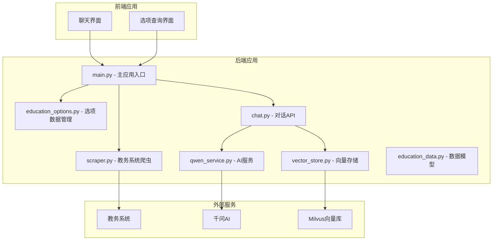
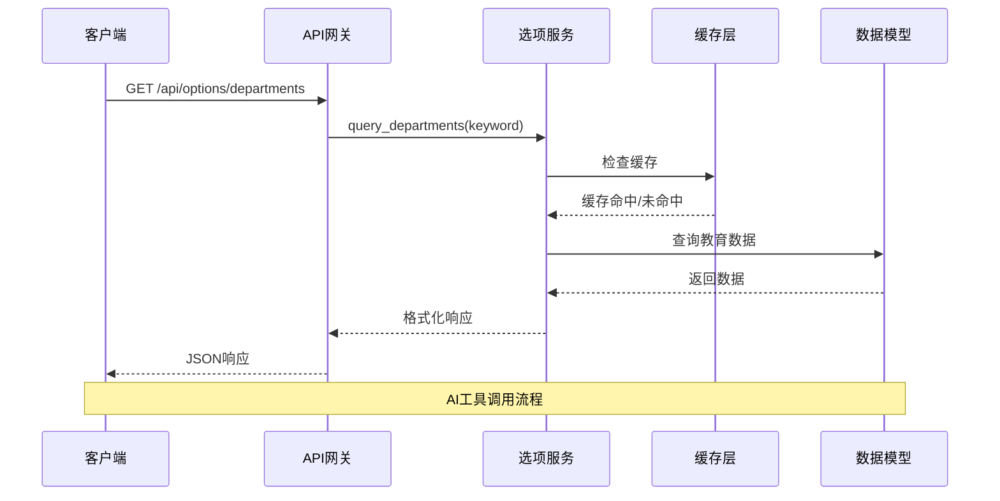
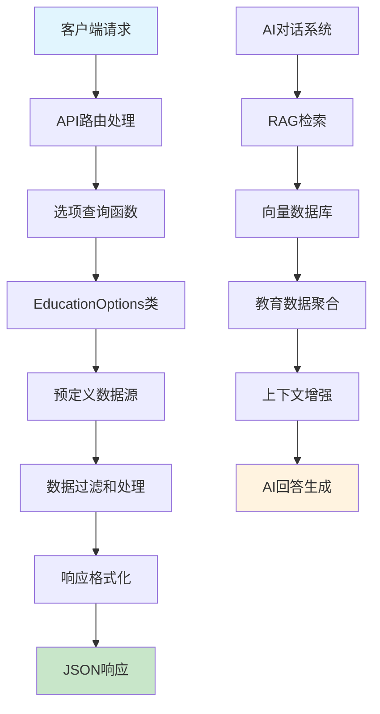
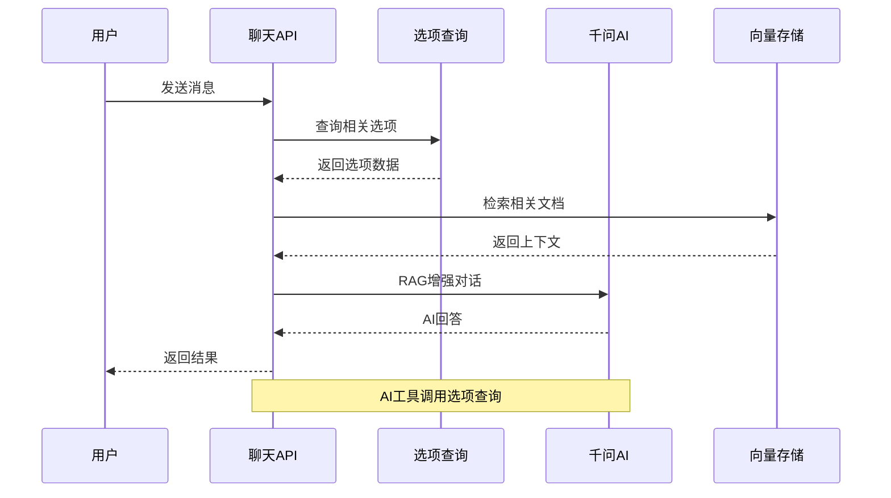
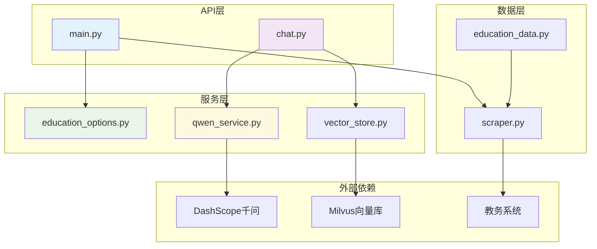
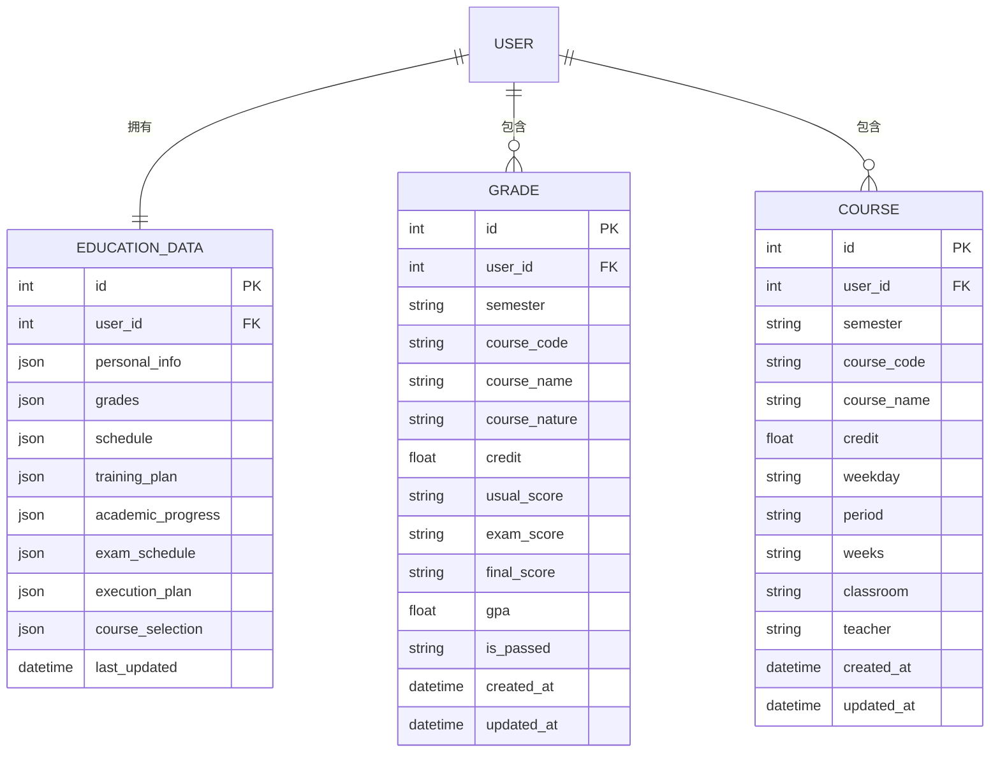
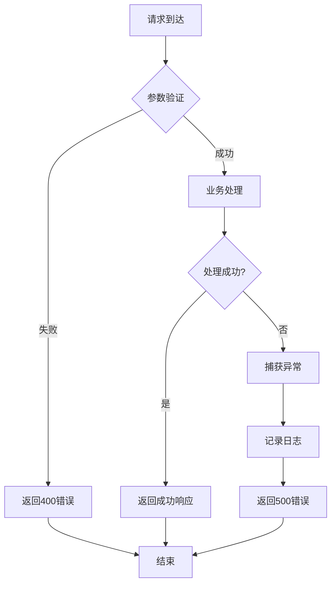

# AI工具选项API

<cite>
**本文档引用的文件**
- [main.py](file://backend/main.py)
- [education_options.py](file://backend/education_options.py)
- [scraper.py](file://backend/scraper.py)
- [chat.py](file://backend/app/api/chat.py)
- [qwen_service.py](file://backend/app/services/qwen_service.py)
- [vector_store.py](file://backend/app/services/vector_store.py)
- [education_data.py](file://backend/app/models/education_data.py)
- [test_scraper.py](file://backend/test_scraper.py)
</cite>

## 目录
1. [简介](#简介)
2. [项目结构](#项目结构)
3. [核心组件](#核心组件)
4. [架构概览](#架构概览)
5. [详细组件分析](#详细组件分析)
6. [依赖关系分析](#依赖关系分析)
7. [性能考虑](#性能考虑)
8. [故障排除指南](#故障排除指南)
9. [结论](#结论)

## 简介

AI工具选项API是广东财经大学教务系统AI助手项目的核心组件之一，专门为AI对话系统提供教育选项数据查询功能。该API系统包含多个选项查询接口，为AI工具提供结构化的教育数据，支持院系查询、学期管理、课程选项、课表选项、成绩查询等功能。

该项目采用FastAPI框架构建，集成了千问大模型服务，实现了完整的AI对话辅助功能。系统通过预定义的教育选项数据，为AI助手提供准确的查询能力，帮助学生更好地理解和使用教务系统。

## 项目结构



**图表来源**
- [main.py:1-853](file://backend/main.py#L1-L853)
- [education_options.py:1-420](file://backend/education_options.py#L1-L420)

**章节来源**
- [main.py:1-853](file://backend/main.py#L1-L853)
- [education_options.py:1-420](file://backend/education_options.py#L1-L420)

## 核心组件

### 选项数据管理系统

教育选项数据管理系统是整个AI工具的核心，负责维护和提供各种教育相关的选项数据。系统包含以下主要组件：

#### 院系数据管理
- **院系列表**：包含所有学院的基本信息，支持代码和名称查询
- **职能部门**：包含学校行政机构信息
- **联合培养学院**：包含高职院校合作信息

#### 学期和时间管理
- **学期列表**：维护学年学期信息
- **当前学期计算**：根据当前时间自动推断当前学期
- **周次管理**：支持1-30周的周次查询

#### 课程选项管理
- **课程性质**：必修、选修、通识等分类
- **修读类别**：主修、辅修课程区分
- **考核方式**：考试、考查等评估方式

#### 课表和成绩选项
- **星期映射**：周一到周日的对应关系
- **节次管理**：上午、下午、晚上的课程时间段
- **成绩显示方式**：显示全部成绩或最佳成绩

**章节来源**
- [education_options.py:9-420](file://backend/education_options.py#L9-L420)

### API接口层

系统提供多个RESTful API接口，每个接口都有明确的功能定位和数据结构：

#### 选项查询接口
- `/api/options/departments` - 院系选项查询
- `/api/options/semesters` - 学期选项查询  
- `/api/options/current-semester` - 当前学期查询
- `/api/options/course` - 课程选项查询
- `/api/options/schedule` - 课表选项查询
- `/api/options/grade` - 成绩选项查询

#### 数据爬取接口
- `/api/grades` - 成绩查询
- `/api/schedule` - 课表查询
- `/api/user/info` - 个人信息查询

**章节来源**
- [main.py:727-800](file://backend/main.py#L727-L800)

## 架构概览



**图表来源**
- [main.py:729-746](file://backend/main.py#L729-L746)
- [education_options.py:264-286](file://backend/education_options.py#L264-L286)

### 数据流架构



**图表来源**
- [main.py:727-800](file://backend/main.py#L727-L800)
- [chat.py:45-147](file://backend/app/api/chat.py#L45-L147)

## 详细组件分析

### 院系选项查询接口

#### 接口规范
- **URL**: `/api/options/departments`
- **方法**: GET
- **参数**:
  - `keyword`: 搜索关键词（可选）
  - `include_admin`: 是否包含职能部门（可选，默认False）
  - `include_vocational`: 是否包含联合培养学院（可选，默认False）

#### 查询逻辑
1. **关键词搜索模式**：当提供keyword时，系统会在所有院系数据中进行模糊匹配
2. **全量查询模式**：当不提供keyword时，返回预定义的院系列表
3. **数据合并**：根据参数决定是否包含职能部门和联合培养学院

#### 返回格式
```json
{
  "success": true,
  "data": [
    {
      "code": "01",
      "name": "工商管理学院",
      "full_code": "20100"
    }
  ],
  "count": 20
}
```

**章节来源**
- [main.py:729-746](file://backend/main.py#L729-L746)
- [education_options.py:264-286](file://backend/education_options.py#L264-L286)

### 学期选项查询接口

#### 接口规范
- **URL**: `/api/options/semesters`
- **方法**: GET
- **参数**:
  - `include_past`: 是否包含过去学期（可选，默认True）
  - `include_future`: 是否包含未来学期（可选，默认False）

#### 查询逻辑
1. **当前学期识别**：系统根据当前日期自动确定当前学期
2. **范围筛选**：根据参数动态筛选学期列表
3. **智能排序**：按时间顺序排列学期数据

#### 返回格式
```json
{
  "success": true,
  "data": [
    {
      "code": "2024-2025-1",
      "name": "2024-2025学年第一学期"
    }
  ],
  "count": 6
}
```

**章节来源**
- [main.py:748-761](file://backend/main.py#L748-L761)
- [education_options.py:289-329](file://backend/education_options.py#L289-L329)

### 当前学期查询接口

#### 接口规范
- **URL**: `/api/options/current-semester`
- **方法**: GET

#### 查询逻辑
系统根据当前日期自动计算当前学期：
- **2-7月**：返回上一个学年第二学期
- **8-次年1月**：返回当前学年第一学期

#### 返回格式
```json
{
  "success": true,
  "data": {
    "code": "2024-2025-2",
    "name": "2024-2025学年第二学期"
  }
}
```

**章节来源**
- [main.py:763-771](file://backend/main.py#L763-L771)
- [education_options.py:196-208](file://backend/education_options.py#L196-L208)

### 课程选项查询接口

#### 接口规范
- **URL**: `/api/options/course`
- **方法**: GET

#### 查询逻辑
返回与课程相关的所有选项数据：
- 课程性质（必修、选修等）
- 修读类别（主修、辅修）
- 考核方式（考试、考查）

#### 返回格式
```json
{
  "success": true,
  "data": {
    "课程性质": [...],
    "修读类别": [...],
    "考核方式": [...]
  }
}
```

**章节来源**
- [main.py:773-781](file://backend/main.py#L773-L781)
- [education_options.py:332-345](file://backend/education_options.py#L332-L345)

### 课表选项查询接口

#### 接口规范
- **URL**: `/api/options/schedule`
- **方法**: GET

#### 查询逻辑
返回与课表相关的选项数据：
- 星期映射（周一到周日）
- 节次信息（上午、下午、晚上）
- 学期列表

#### 返回格式
```json
{
  "success": true,
  "data": {
    "星期": [...],
    "节次": [...],
    "学期": [...]
  }
}
```

**章节来源**
- [main.py:783-791](file://backend/main.py#L783-L791)
- [education_options.py:348-361](file://backend/education_options.py#L348-L361)

### 成绩选项查询接口

#### 接口规范
- **URL**: `/api/options/grade`
- **方法**: GET

#### 查询逻辑
返回与成绩查询相关的选项数据：
- 成绩显示方式（显示全部、最佳成绩）
- 修读类别（主修、辅修）
- 学期列表

#### 返回格式
```json
{
  "success": true,
  "data": {
    "成绩显示方式": [...],
    "修读类别": [...],
    "学期": [...]
  }
}
```

**章节来源**
- [main.py:793-800](file://backend/main.py#L793-L800)
- [education_options.py:364-377](file://backend/education_options.py#L364-L377)

### AI对话集成

#### 对话流程


**图表来源**
- [chat.py:45-147](file://backend/app/api/chat.py#L45-L147)
- [qwen_service.py:91-142](file://backend/app/services/qwen_service.py#L91-L142)

**章节来源**
- [chat.py:45-147](file://backend/app/api/chat.py#L45-L147)
- [qwen_service.py:91-142](file://backend/app/services/qwen_service.py#L91-L142)

## 依赖关系分析

### 组件依赖图



**图表来源**
- [main.py:15-25](file://backend/main.py#L15-L25)
- [chat.py:11-12](file://backend/app/api/chat.py#L11-L12)

### 数据模型关系



**图表来源**
- [education_data.py:11-103](file://backend/app/models/education_data.py#L11-L103)

**章节来源**
- [education_data.py:11-103](file://backend/app/models/education_data.py#L11-L103)

## 性能考虑

### 缓存策略
- **内存缓存**：使用Python字典存储会话信息和验证码
- **静态数据缓存**：教育选项数据在内存中常驻
- **向量数据缓存**：Milvus向量库提供高效的相似性搜索

### 并发处理
- **异步处理**：AI服务支持并发请求
- **连接池**：数据库连接和HTTP请求使用连接池
- **限流机制**：API层实现基本的请求限制

### 性能优化建议
1. **数据预加载**：教育选项数据在应用启动时加载到内存
2. **批量查询**：支持批量选项查询减少API调用次数
3. **智能缓存**：为高频查询结果设置适当的缓存时间
4. **向量化加速**：使用Milvus向量库加速RAG检索

## 故障排除指南

### 常见问题诊断

#### API访问问题
- **404错误**：检查API路径是否正确
- **500错误**：查看服务器日志获取详细错误信息
- **CORS问题**：检查前端域名配置

#### 数据查询问题
- **空结果**：确认参数格式是否正确
- **数据过期**：检查缓存是否需要刷新
- **权限问题**：验证用户认证状态

#### AI服务问题
- **模型调用失败**：检查API密钥配置
- **响应超时**：增加超时时间或优化查询
- **费用控制**：监控token使用量

**章节来源**
- [main.py:187-327](file://backend/main.py#L187-L327)
- [chat.py:149-153](file://backend/app/api/chat.py#L149-L153)

### 错误处理机制

系统实现了完善的错误处理机制：



**图表来源**
- [main.py:729-800](file://backend/main.py#L729-L800)

## 结论

AI工具选项API为广东财经大学的AI助手系统提供了完整的教育选项数据支持。通过精心设计的API接口和数据管理机制，系统能够为AI对话提供准确、实时的教育信息查询能力。

### 主要优势
1. **结构化数据**：预定义的教育选项数据确保查询结果的一致性和准确性
2. **灵活查询**：支持多种查询模式和参数组合
3. **AI集成**：与千问AI服务无缝集成，支持RAG增强对话
4. **扩展性强**：模块化设计便于功能扩展和维护

### 应用场景
- **智能问答**：AI助手回答学生关于教务系统的各种问题
- **数据查询**：提供准确的院系、课程、成绩等信息查询
- **学习规划**：辅助学生制定学习计划和选课策略
- **信息整合**：将分散的教务信息整合为统一的知识库

### 发展方向
1. **数据更新机制**：建立自动化的数据同步和更新机制
2. **智能推荐**：基于学生画像提供个性化的学习建议
3. **多模态支持**：扩展图像、语音等多模态交互能力
4. **性能优化**：持续优化查询性能和响应速度

该系统为高校智能化建设提供了良好的技术基础，通过AI工具选项API的完善，能够更好地服务于广大学生群体，提升教务服务的质量和效率。