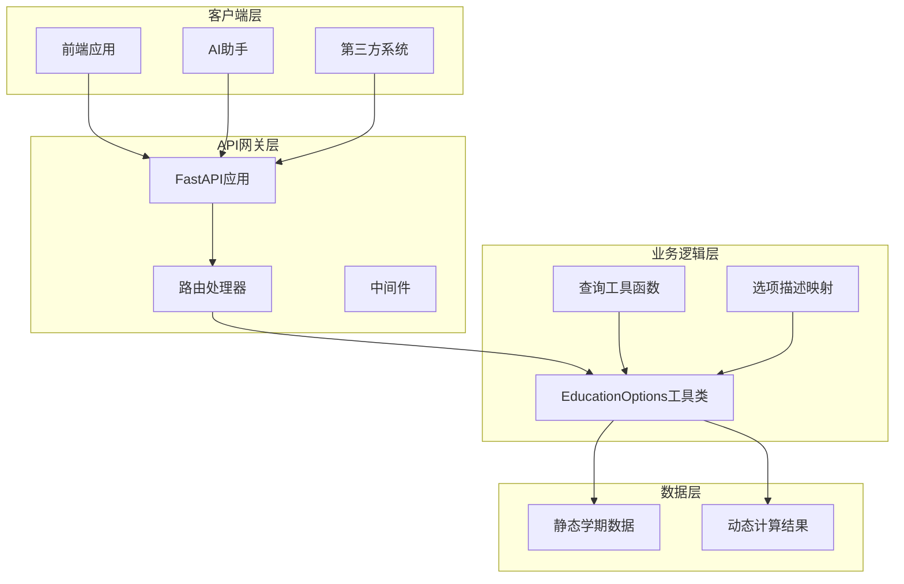
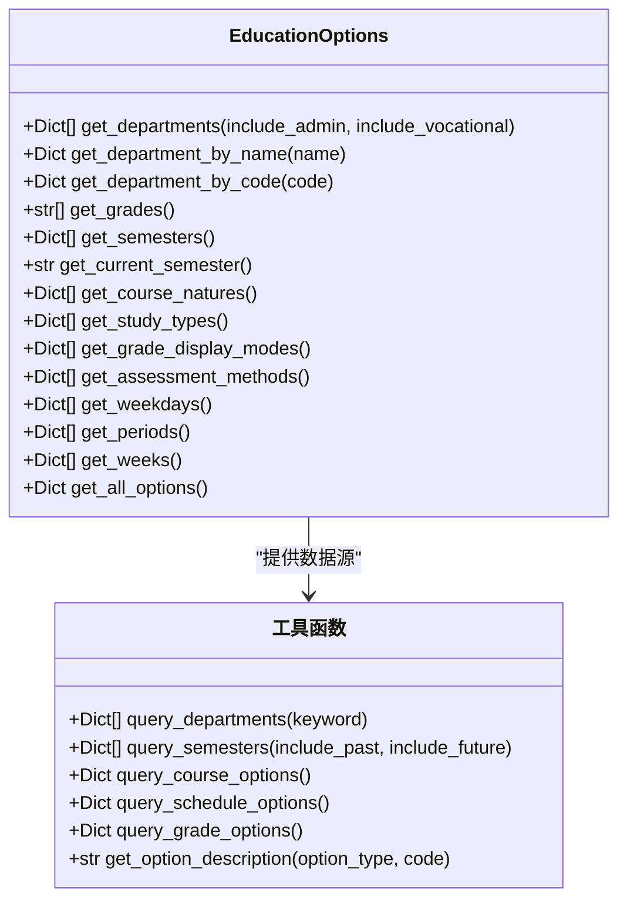
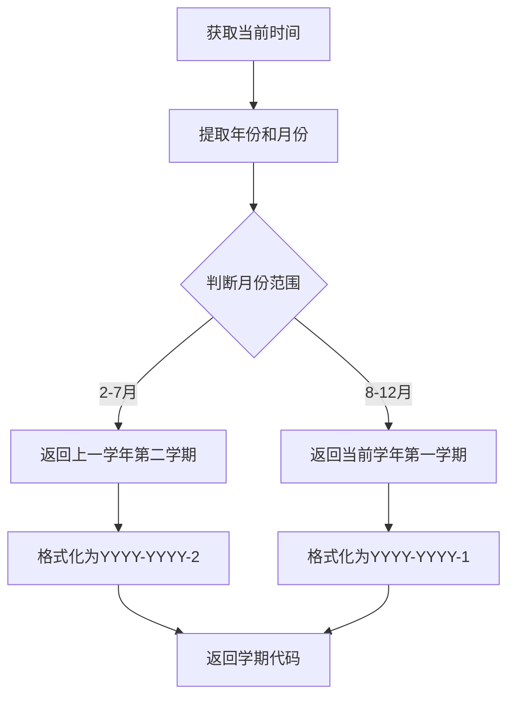
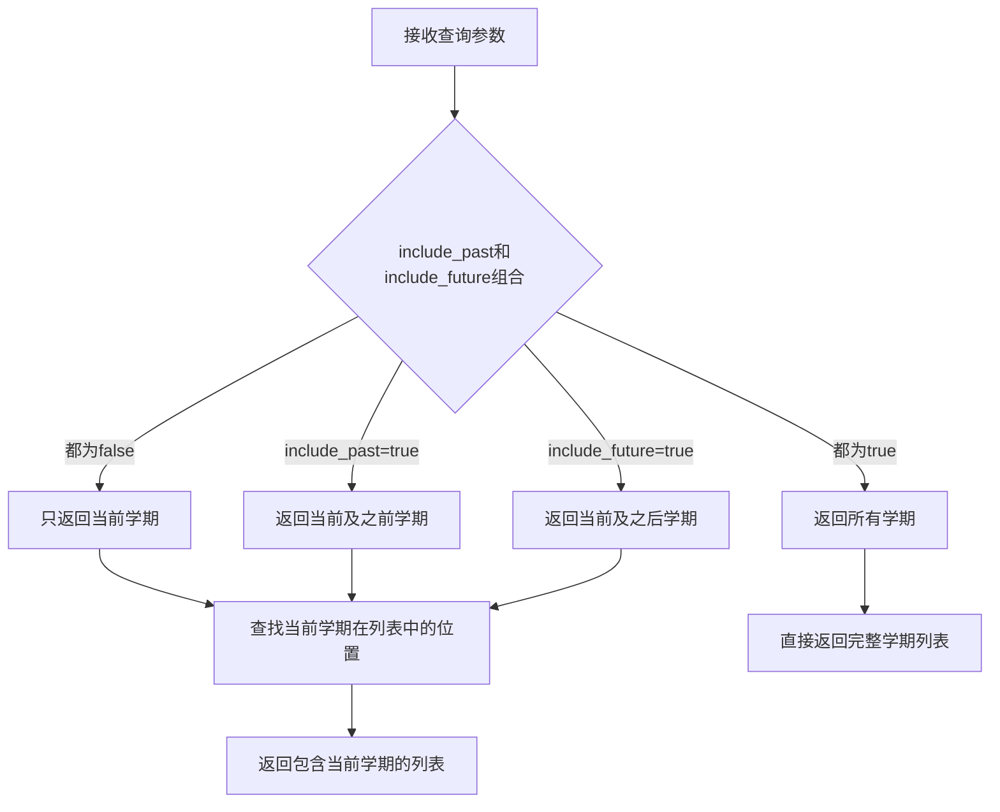
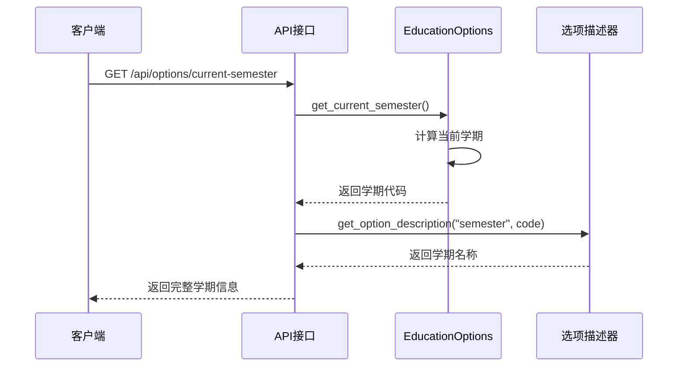
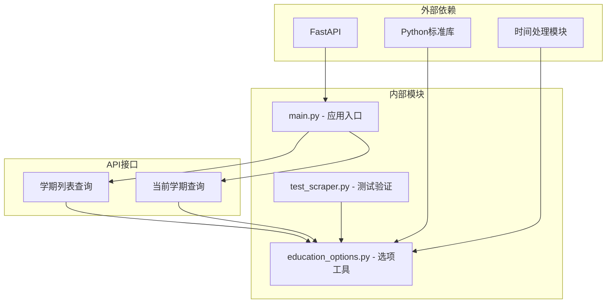
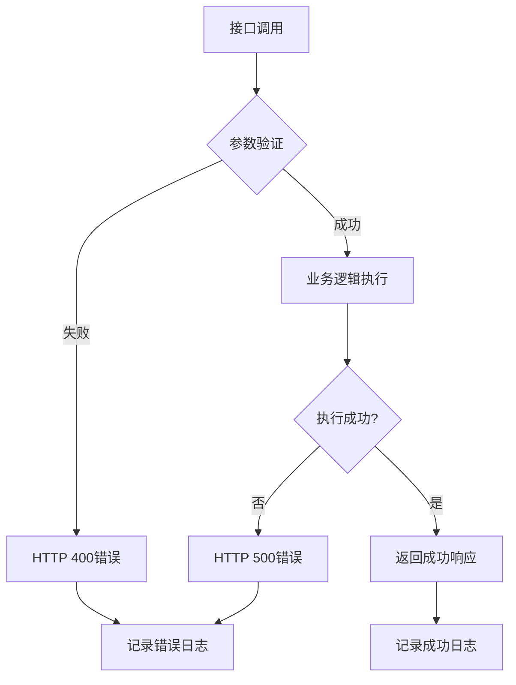

# 学期选项查询API

<cite>
**本文档引用的文件**
- [main.py](file://backend/main.py)
- [education_options.py](file://backend/education_options.py)
- [test_scraper.py](file://backend/test_scraper.py)
</cite>

## 目录
1. [简介](#简介)
2. [项目结构](#项目结构)
3. [核心组件](#核心组件)
4. [架构概览](#架构概览)
5. [详细组件分析](#详细组件分析)
6. [依赖分析](#依赖分析)
7. [性能考虑](#性能考虑)
8. [故障排除指南](#故障排除指南)
9. [结论](#结论)

## 简介

本文档详细介绍了教务系统中的学期选项查询API，重点说明了`/api/options/semesters`和`/api/options/current-semester`两个核心接口的功能和使用方法。这些接口为AI助手提供了灵活的学期数据查询能力，支持过去学期、当前学期和未来学期的组合查询策略。

该API系统采用模块化设计，将学期数据管理与业务逻辑分离，提供了清晰的接口定义和完整的错误处理机制。通过智能的学期识别算法，系统能够自动适应不同时间段的查询需求。

## 项目结构

后端项目采用FastAPI框架构建，主要文件组织如下：

```mermaid
graph TB
subgraph "后端应用结构"
A[main.py<br/>主应用入口]
B[education_options.py<br/>学期选项工具]
C[test_scraper.py<br/>测试脚本]
end
subgraph "API路由"
D[/api/options/semesters<br/>学期列表查询]
E[/api/options/current-semester<br/>当前学期查询]
F[/api/options/departments<br/>院系查询]
G[/api/options/course<br/>课程选项查询]
end
A --> D
A --> E
A --> F
A --> G
D --> B
E --> B
```

**图表来源**
- [main.py:727-798](file://backend/main.py#L727-L798)
- [education_options.py:130-260](file://backend/education_options.py#L130-L260)

**章节来源**
- [main.py:1-853](file://backend/main.py#L1-L853)
- [education_options.py:1-420](file://backend/education_options.py#L1-L420)

## 核心组件

### 学期选项工具类

`EducationOptions`类是整个学期查询系统的核心，提供了完整的学期数据管理和查询功能：

- **静态数据管理**：维护固定学期列表，包含学年和学期标识
- **智能识别算法**：根据当前时间自动计算当前学期
- **灵活查询接口**：支持多种查询策略和过滤条件
- **描述映射功能**：提供学期代码到名称的转换

### API接口层

系统提供了两个专门的学期查询接口：

1. **学期列表查询接口** (`/api/options/semesters`)
2. **当前学期查询接口** (`/api/options/current-semester`)

这两个接口都继承了统一的错误处理机制和响应格式标准。

**章节来源**
- [education_options.py:130-260](file://backend/education_options.py#L130-L260)
- [main.py:748-771](file://backend/main.py#L748-L771)

## 架构概览

系统采用分层架构设计，实现了清晰的关注点分离：



**图表来源**
- [main.py:727-798](file://backend/main.py#L727-L798)
- [education_options.py:130-260](file://backend/education_options.py#L130-L260)

## 详细组件分析

### 学期选项工具类分析

#### 类结构图



**图表来源**
- [education_options.py:130-260](file://backend/education_options.py#L130-L260)
- [education_options.py:262-420](file://backend/education_options.py#L262-L420)

#### 学期生成逻辑

系统采用智能的时间识别算法来确定当前学期：



**图表来源**
- [education_options.py:196-208](file://backend/education_options.py#L196-L208)

**章节来源**
- [education_options.py:130-260](file://backend/education_options.py#L130-L260)

### 学期列表查询接口

#### 接口定义

`/api/options/semesters`接口提供了灵活的学期查询能力：

**请求参数**
- `include_past`: 是否包含过去的学期（默认：true）
- `include_future`: 是否包含未来的学期（默认：false）

**查询策略**



**图表来源**
- [education_options.py:289-329](file://backend/education_options.py#L289-L329)

**响应格式**
```json
{
  "success": true,
  "data": [
    {
      "code": "2024-2025-1",
      "name": "2024-2025学年第一学期"
    }
  ],
  "count": 1
}
```

**章节来源**
- [main.py:748-761](file://backend/main.py#L748-L761)
- [education_options.py:289-329](file://backend/education_options.py#L289-L329)

### 当前学期查询接口

#### 接口定义

`/api/options/current-semester`接口提供了精确的当前学期识别：

**查询逻辑**



**图表来源**
- [main.py:763-771](file://backend/main.py#L763-L771)
- [education_options.py:196-208](file://backend/education_options.py#L196-L208)

**响应格式**
```json
{
  "success": true,
  "data": {
    "code": "2024-2025-2",
    "name": "2024-2025学年第二学期"
  }
}
```

**章节来源**
- [main.py:763-771](file://backend/main.py#L763-L771)

### 查询特定时间段学期列表示例

以下是几种常见的查询场景：

#### 场景1：查询所有历史学期
```
GET /api/options/semesters?include_past=true&include_future=false
```

#### 场景2：查询当前及未来学期
```
GET /api/options/semesters?include_past=false&include_future=true
```

#### 场景3：仅查询当前学期
```
GET /api/options/semesters?include_past=false&include_future=false
```

#### 场景4：查询完整学期历史
```
GET /api/options/semesters?include_past=true&include_future=true
```

**章节来源**
- [test_scraper.py:26-33](file://backend/test_scraper.py#L26-L33)

## 依赖分析

### 组件依赖关系



**图表来源**
- [main.py:15-25](file://backend/main.py#L15-L25)
- [education_options.py:6](file://backend/education_options.py#L6)

### 错误处理机制

系统实现了统一的错误处理策略：



**图表来源**
- [main.py:748-771](file://backend/main.py#L748-L771)

**章节来源**
- [main.py:727-798](file://backend/main.py#L727-L798)

## 性能考虑

### 查询优化策略

1. **内存缓存**：学期数据存储在内存中，避免重复计算
2. **快速查找**：使用线性搜索算法，时间复杂度O(n)
3. **懒加载**：仅在需要时计算当前学期
4. **响应优化**：统一的JSON序列化格式

### 扩展性考虑

- **数据结构**：当前使用列表存储，适合小规模数据集
- **算法复杂度**：查询操作为O(n)，适合当前数据规模
- **并发处理**：FastAPI支持异步处理，可扩展到高并发场景

## 故障排除指南

### 常见问题诊断

#### 1. 学期识别不准确
**症状**：返回的当前学期与预期不符
**排查步骤**：
1. 检查服务器时间设置
2. 验证月份判断逻辑
3. 确认学年边界条件

#### 2. 查询结果为空
**症状**：学期查询返回空数组
**排查步骤**：
1. 验证查询参数组合
2. 检查学期列表完整性
3. 确认当前学期在列表中的存在性

#### 3. API调用失败
**症状**：HTTP 500错误
**排查步骤**：
1. 检查服务器日志
2. 验证依赖模块导入
3. 确认数据库连接状态

**章节来源**
- [test_scraper.py:26-28](file://backend/test_scraper.py#L26-L28)

## 结论

学期选项查询API系统提供了完整、灵活的学期数据查询解决方案。通过智能的学期识别算法和灵活的查询策略，系统能够满足各种时间敏感的查询需求。

### 主要优势

1. **智能识别**：自动适应不同时间段的学期识别
2. **灵活查询**：支持多种查询策略和过滤条件
3. **统一接口**：标准化的响应格式和错误处理
4. **易于扩展**：模块化设计便于功能扩展

### 应用场景

- **AI助手**：为智能问答提供准确的学期数据
- **前端应用**：支持学期选择和时间筛选功能
- **数据分析**：为时间序列分析提供数据基础
- **报表生成**：支持按学期维度的数据统计

该系统为教务系统的智能化升级奠定了坚实的数据基础，特别是在时间敏感查询场景中发挥着重要作用。