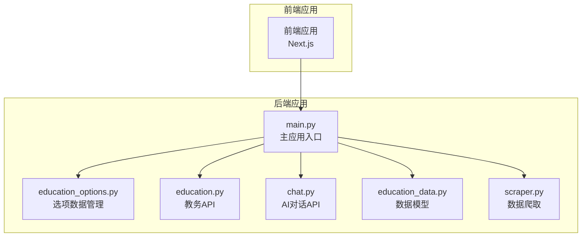
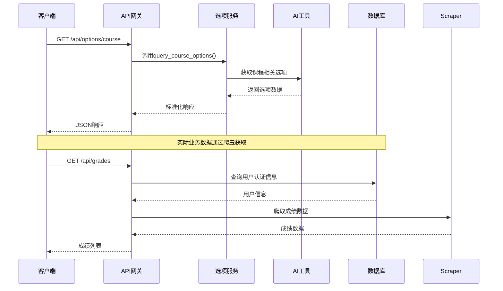
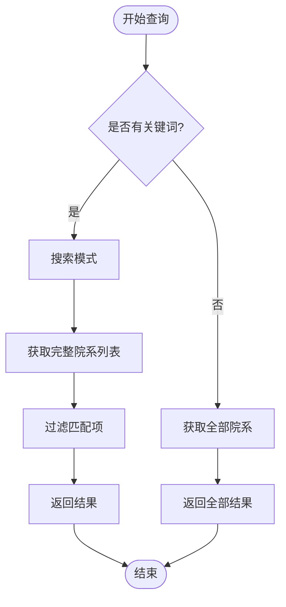
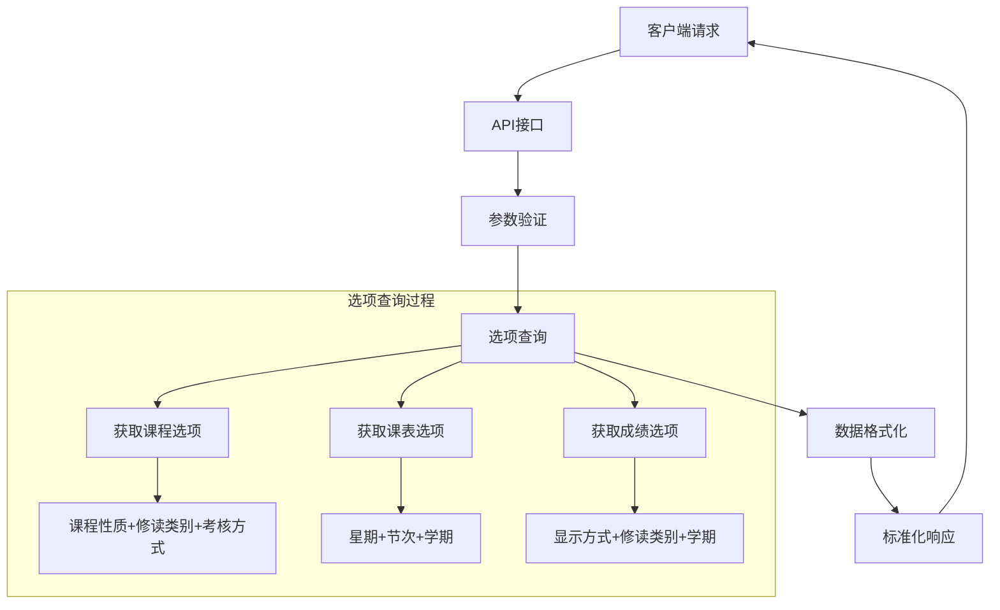
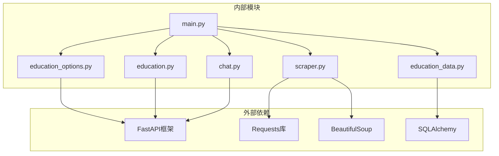

# 课程课表成绩选项API

<cite>
**本文档引用的文件**
- [main.py](file://backend/main.py)
- [education_options.py](file://backend/education_options.py)
- [education.py](file://backend/app/api/education.py)
- [chat.py](file://backend/app/api/chat.py)
- [education_data.py](file://backend/app/models/education_data.py)
- [scraper.py](file://backend/scraper.py)
- [test_scraper.py](file://backend/test_scraper.py)
</cite>

## 目录
1. [简介](#简介)
2. [项目结构](#项目结构)
3. [核心组件](#核心组件)
4. [架构概览](#架构概览)
5. [详细组件分析](#详细组件分析)
6. [依赖分析](#依赖分析)
7. [性能考虑](#性能考虑)
8. [故障排除指南](#故障排除指南)
9. [结论](#结论)
10. [附录](#附录)

## 简介
本文件为课程、课表、成绩相关的选项查询接口提供详细的API文档。系统包含三个核心选项查询接口：
- `/api/options/course` - 课程相关选项查询
- `/api/options/schedule` - 课表相关选项查询  
- `/api/options/grade` - 成绩查询相关选项查询

这些接口基于静态选项数据和AI工具函数实现，为AI对话系统提供结构化的选项数据，支持智能问答和自然语言查询。

## 项目结构
后端采用FastAPI框架，主要文件组织如下：
- `backend/main.py` - 主应用入口，包含所有API路由
- `backend/education_options.py` - 选项数据管理和AI工具函数
- `backend/app/api/education.py` - 教务系统业务API
- `backend/app/api/chat.py` - AI对话API
- `backend/app/models/education_data.py` - 教务数据模型定义
- `backend/scraper.py` - 教务系统数据爬取模块
- `backend/test_scraper.py` - 功能测试脚本



**图表来源**
- [main.py:1-120](file://backend/main.py#L1-L120)
- [education_options.py:1-50](file://backend/education_options.py#L1-L50)

**章节来源**
- [main.py:1-853](file://backend/main.py#L1-L853)
- [education_options.py:1-420](file://backend/education_options.py#L1-L420)

## 核心组件
系统的核心组件包括选项数据管理、AI工具函数、API路由和数据模型四个部分：

### 选项数据管理
- 静态选项数据：院系、年级、学期、课程性质、修读类别、成绩显示方式、考核方式、星期、节次、周次
- 动态选项计算：当前学期推断
- 选项查询工具：支持关键词搜索、模糊匹配、类型过滤

### AI工具函数
- 院系查询：支持关键词搜索和精确匹配
- 学期查询：支持过去/未来学期筛选
- 课程选项查询：课程性质、修读类别、考核方式
- 课表选项查询：星期、节次、学期
- 成绩选项查询：成绩显示方式、修读类别、学期

### API路由
- 选项查询接口：提供RESTful API供前端调用
- 错误处理：统一的HTTP异常处理机制
- 响应格式：标准化的成功/失败响应结构

### 数据模型
- EducationData：存储完整的教务数据
- Grade：成绩明细表
- Course：课程信息表

**章节来源**
- [education_options.py:130-420](file://backend/education_options.py#L130-L420)
- [main.py:727-811](file://backend/main.py#L727-L811)

## 架构概览
系统采用分层架构设计，清晰分离数据访问、业务逻辑和表现层：



**图表来源**
- [main.py:773-781](file://backend/main.py#L773-L781)
- [education_options.py:332-345](file://backend/education_options.py#L332-L345)

系统架构特点：
- **分层清晰**：选项查询与业务数据获取分离
- **扩展性强**：新增选项类型只需修改配置数据
- **AI集成**：内置AI工具函数支持智能问答
- **错误处理**：统一的异常处理和响应格式

## 详细组件分析

### 选项数据结构
系统定义了九类核心选项数据，每类都包含code和name字段：

#### 院系数据 (DEPARTMENTS)
- 格式：`{"code": "01", "name": "工商管理学院..."}`
- 支持职能部门和联合培养学院扩展
- 提供精确匹配和模糊匹配功能

#### 学期数据 (SEMESTERS)
- 格式：`{"code": "2024-2025-1", "name": "2024-2025学年第一学期"}`
- 包含多个学年周期
- 支持当前学期自动推断

#### 课程性质 (COURSE_NATURES)
- 必修、选修、通识必修、通识选修等8种类型
- 支持"全部"选项作为默认值

#### 修读类别 (STUDY_TYPES)
- 主修课程、辅修课程两种类型
- 包含详细描述信息

#### 成绩显示方式 (GRADE_DISPLAY_MODES)
- 显示全部成绩、显示最好成绩两种模式

#### 考核方式 (ASSESSMENT_METHODS)
- 考试、考查两种方式

#### 星期映射 (WEEKDAYS)
- 1-7对应周一至周日

#### 节次 (PERIODS)
- 1-2节至11-12节，包含时间范围

#### 周次 (WEEKS)
- 第1周到第30周

**章节来源**
- [education_options.py:9-128](file://backend/education_options.py#L9-L128)

### AI工具函数详解

#### 院系查询工具 (query_departments)


**图表来源**
- [education_options.py:264-286](file://backend/education_options.py#L264-L286)

#### 学期查询工具 (query_semesters)
支持灵活的学期筛选策略：
- `include_past=True, include_future=False`：仅当前及以后学期
- `include_past=False, include_future=True`：仅当前及以前学期  
- `include_past=True, include_future=True`：所有学期
- 两个参数都为False时：仅返回当前学期

#### 课程选项查询 (query_course_options)
返回课程相关的三个核心选项：
- 课程性质：必修、选修、通识等
- 修读类别：主修、辅修
- 考核方式：考试、考查

#### 课表选项查询 (query_schedule_options)
返回课表相关的三个核心选项：
- 星期：周一至周日
- 节次：1-2节至11-12节
- 学期：完整的学期列表

#### 成绩选项查询 (query_grade_options)
返回成绩查询相关的三个核心选项：
- 成绩显示方式：全部、最好
- 修读类别：主修、辅修
- 学期：完整的学期列表

**章节来源**
- [education_options.py:288-377](file://backend/education_options.py#L288-L377)

### API接口规范

#### 课程选项查询接口
**URL**: `/api/options/course`
**方法**: GET
**功能**: 获取课程相关选项数据
**响应结构**:
```json
{
  "success": true,
  "data": {
    "课程性质": [...],
    "修读类别": [...],
    "考核方式": [...]
  }
}
```

**使用场景**:
- AI问答："什么是必修课？"
- 表单渲染：课程筛选下拉框
- 数据验证：课程查询参数校验

#### 课表选项查询接口
**URL**: `/api/options/schedule`
**方法**: GET
**功能**: 获取课表相关选项数据
**响应结构**:
```json
{
  "success": true,
  "data": {
    "星期": [...],
    "节次": [...],
    "学期": [...]
  }
}
```

**使用场景**:
- AI问答："如何查看课表？"
- 时间安排：课程时间筛选
- 课表展示：星期和节次映射

#### 成绩选项查询接口
**URL**: `/api/options/grade`
**方法**: GET
**功能**: 获取成绩查询相关选项数据
**响应结构**:
```json
{
  "success": true,
  "data": {
    "成绩显示方式": [...],
    "修读类别": [...],
    "学期": [...]
  }
}
```

**使用场景**:
- AI问答："如何查看成绩？"
- 成绩筛选：按学期和显示方式过滤
- 统计分析：不同显示模式的数据对比

**章节来源**
- [main.py:773-799](file://backend/main.py#L773-L799)
- [education_options.py:332-377](file://backend/education_options.py#L332-L377)

### 数据流分析

#### 选项查询流程


**图表来源**
- [main.py:773-799](file://backend/main.py#L773-L799)
- [education_options.py:332-377](file://backend/education_options.py#L332-L377)

#### AI集成机制
系统通过以下方式集成AI工具：
- **选项描述映射**：`get_option_description()`函数提供代码到名称的映射
- **智能问答支持**：AI可以理解自然语言中的选项含义
- **动态数据生成**：根据当前时间推断当前学期
- **模糊匹配**：支持关键词搜索和模糊匹配

**章节来源**
- [education_options.py:380-419](file://backend/education_options.py#L380-L419)

## 依赖分析

### 组件依赖关系


**图表来源**
- [main.py:15-25](file://backend/main.py#L15-L25)
- [education_options.py:6](file://backend/education_options.py#L6)

### 数据依赖
- **选项数据**：完全静态，不依赖外部数据源
- **业务数据**：依赖教务系统爬取（非本接口功能）
- **AI数据**：依赖向量存储和RAG检索

**章节来源**
- [main.py:15-25](file://backend/main.py#L15-L25)
- [education_options.py:1-5](file://backend/education_options.py#L1-L5)

## 性能考虑
系统在设计时充分考虑了性能优化：

### 内存优化
- **静态数据缓存**：选项数据存储在内存中，避免重复加载
- **对象池**：使用列表复制而非深度克隆
- **延迟加载**：仅在需要时生成动态选项

### 计算优化
- **时间复杂度**：查询操作为O(n)，其中n为选项数量
- **空间复杂度**：O(n)，用于存储选项数据
- **批量操作**：支持批量获取所有选项数据

### 扩展性考虑
- **配置驱动**：通过修改配置文件即可添加新的选项类型
- **插件化设计**：AI工具函数可独立扩展
- **缓存策略**：可轻松集成Redis缓存

## 故障排除指南

### 常见问题及解决方案

#### 选项数据不完整
**症状**：某些选项缺失或显示异常
**原因**：配置数据不完整或格式错误
**解决**：检查`education_options.py`中的配置数据

#### AI工具函数异常
**症状**：`get_option_description()`返回错误描述
**原因**：选项类型不匹配或代码不存在
**解决**：验证选项类型参数和代码值

#### API响应格式错误
**症状**：响应结构不符合预期
**原因**：API实现错误或参数传递问题
**解决**：检查API路由定义和响应格式

### 调试建议
1. **单元测试**：运行`test_scraper.py`验证功能完整性
2. **日志监控**：启用详细日志跟踪API调用
3. **数据验证**：验证输入参数的有效性
4. **性能监控**：监控API响应时间和内存使用

**章节来源**
- [test_scraper.py:1-200](file://backend/test_scraper.py#L1-L200)

## 结论
本系统提供了完整的课程、课表、成绩选项查询API，具有以下优势：

### 技术优势
- **结构化数据**：标准化的选项数据格式
- **AI集成**：内置智能问答支持
- **扩展性强**：易于添加新的选项类型
- **性能优化**：内存和计算资源高效利用

### 应用价值
- **用户体验**：简化选项查询和筛选过程
- **AI增强**：支持自然语言交互
- **业务支撑**：为教务系统提供数据基础
- **开发效率**：标准化的API接口

### 最佳实践建议
1. **参数验证**：始终验证输入参数的有效性
2. **错误处理**：实现完善的异常处理机制
3. **性能监控**：定期监控API性能指标
4. **文档维护**：保持API文档与代码同步更新

## 附录

### API完整示例

#### 课程选项查询示例
```bash
# 获取所有课程选项
curl -X GET "http://localhost:8000/api/options/course"

# 响应示例
{
  "success": true,
  "data": {
    "课程性质": [
      {"code": "", "name": "全部"},
      {"code": "01", "name": "必修"}
    ],
    "修读类别": [
      {"code": "0", "name": "主修课程"},
      {"code": "1", "name": "辅修课程"}
    ],
    "考核方式": [
      {"code": "", "name": "全部"},
      {"code": "01", "name": "考试"}
    ]
  }
}
```

#### 课表选项查询示例
```bash
# 获取课表相关选项
curl -X GET "http://localhost:8000/api/options/schedule"

# 响应示例
{
  "success": true,
  "data": {
    "星期": [
      {"code": "1", "name": "周一"},
      {"code": "2", "name": "周二"}
    ],
    "节次": [
      {"code": "1-2", "name": "第一二节", "time": "08:00-09:40"},
      {"code": "3-4", "name": "第三四节", "time": "10:00-11:40"}
    ],
    "学期": [
      {"code": "2024-2025-1", "name": "2024-2025学年第一学期"}
    ]
  }
}
```

#### 成绩选项查询示例
```bash
# 获取成绩查询相关选项
curl -X GET "http://localhost:8000/api/options/grade"

# 响应示例
{
  "success": true,
  "data": {
    "成绩显示方式": [
      {"code": "all", "name": "显示全部成绩"},
      {"code": "max", "name": "显示最好成绩"}
    ],
    "修读类别": [
      {"code": "0", "name": "主修课程"},
      {"code": "1", "name": "辅修课程"}
    ],
    "学期": [
      {"code": "2024-2025-1", "name": "2024-2025学年第一学期"}
    ]
  }
}
```

### 选项数据关联关系

#### 业务逻辑关联
- **课程性质** → 课程筛选和统计
- **修读类别** → 主修/辅修数据区分
- **考核方式** → 成绩计算规则
- **星期/节次** → 课表时间安排
- **学期** → 数据时效性和统计口径

#### AI对话应用场景
- **智能问答**：理解用户对选项的自然语言描述
- **参数补全**：根据上下文自动补全查询参数
- **结果解释**：将代码转换为易懂的中文描述
- **多轮对话**：在对话历史中维护选项状态

**章节来源**
- [main.py:813-847](file://backend/main.py#L813-L847)
- [education_options.py:380-419](file://backend/education_options.py#L380-L419)