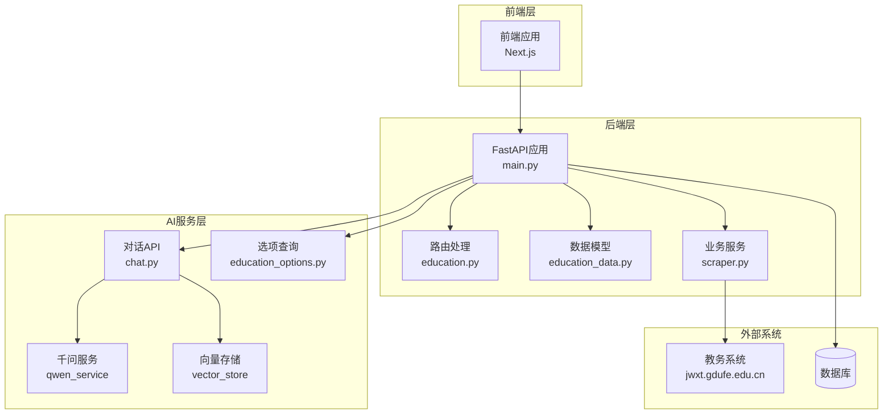
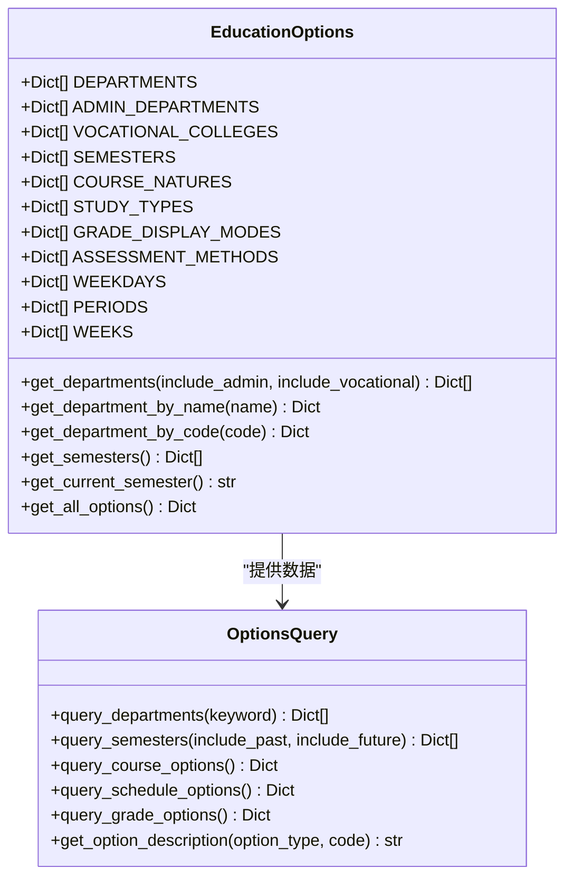
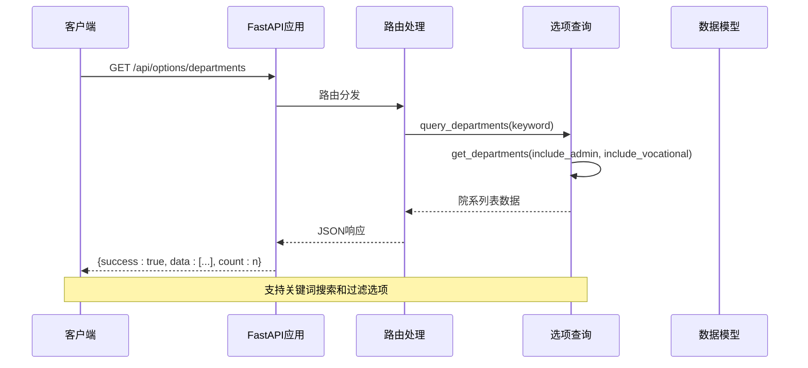
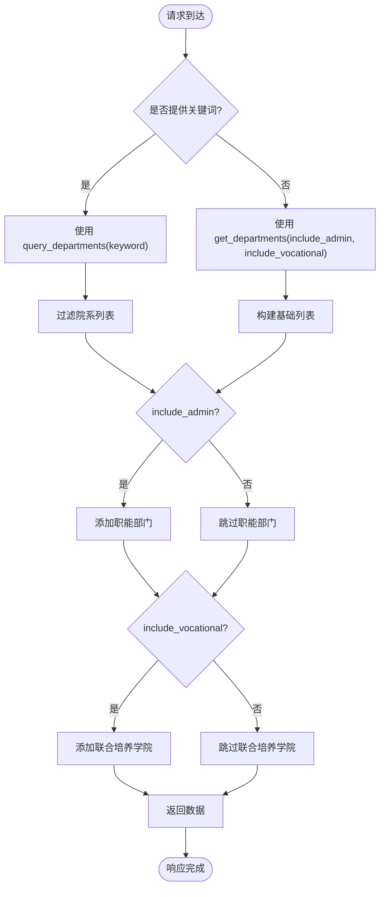
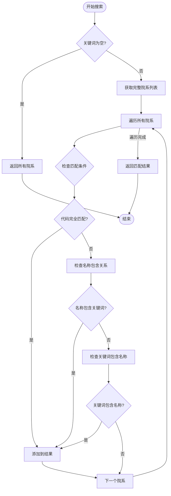
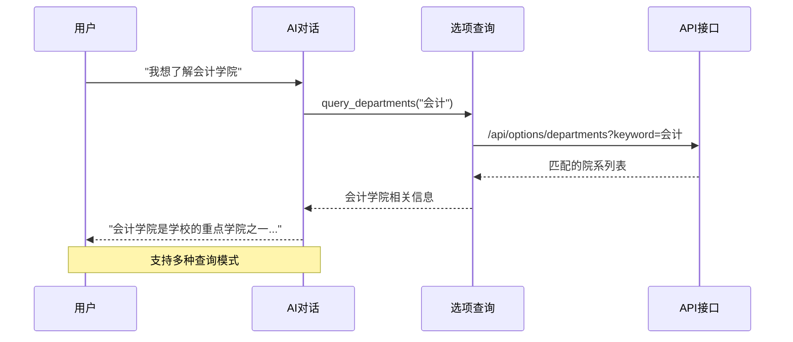
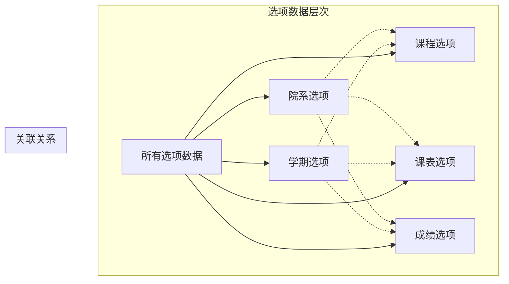
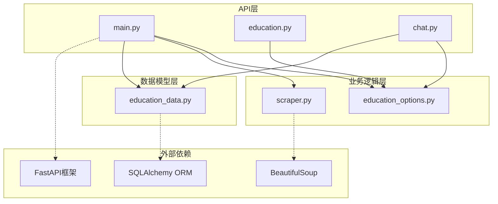

# 院系选项查询API

<cite>
**本文档引用的文件**
- [main.py](file://backend/main.py)
- [education_options.py](file://backend/education_options.py)
- [chat.py](file://backend/app/api/chat.py)
- [education_data.py](file://backend/app/models/education_data.py)
- [scraper.py](file://backend/scraper.py)
- [test_scraper.py](file://backend/test_scraper.py)
</cite>

## 目录
1. [简介](#简介)
2. [项目结构](#项目结构)
3. [核心组件](#核心组件)
4. [架构概览](#架构概览)
5. [详细组件分析](#详细组件分析)
6. [依赖关系分析](#依赖关系分析)
7. [性能考虑](#性能考虑)
8. [故障排除指南](#故障排除指南)
9. [结论](#结论)

## 简介

本项目是一个基于FastAPI构建的教务系统AI助手，专门为广东财经大学的学生提供智能化的教务信息服务。系统集成了多个核心功能模块，包括教务数据爬取、AI对话助手、选项查询工具等，旨在为用户提供便捷的教务信息查询和交互体验。

本API文档专注于"院系选项查询"功能，详细说明/get_departments_api接口的使用方法、参数配置、数据结构以及在AI对话场景中的应用。

## 项目结构

该项目采用前后端分离的架构设计，主要分为以下层次：

**图表来源**
- [main.py:1-853](file://backend/main.py#L1-L853)
- [education_options.py:1-420](file://backend/education_options.py#L1-L420)

**章节来源**
- [main.py:1-853](file://backend/main.py#L1-L853)
- [education_options.py:1-420](file://backend/education_options.py#L1-L420)

## 核心组件

### 院系数据结构

系统维护了完整的院系数据结构，包含以下三类院系信息：

#### 常规院系（DEPARTMENTS）
这是学校的主要教学单位，包含15个正式学院：
- 工商管理学院（粤商学院、创新创业学院）
- 会计学院
- 财政税务学院（税务师学院）
- 金融学院
- 经济学院
- 法学院
- 文化旅游学院
- 外国语学院
- 统计与数据科学学院
- 大数据与人工智能学院
- 人文与传播学院（网络传播学院、出版学院）
- 体育学院
- 马克思主义学院
- 公共管理学院
- 艺术与设计学院

#### 职能部门（ADMIN_DEPARTMENTS）
包含学校行政管理部门，共6个部门：
- 党委办公室、校长办公室（法制办公室、档案馆、校史馆）
- 国际交流与合作部（港澳台事务办公室）
- 旅游管理与规划设计研究院、岭南旅游研究院（合署）
- 发展与改革研究院
- 校团委

#### 联合培养学院（VOCATIONAL_COLLEGES）
针对高等职业教育的联合培养学院，包含6个学院：
- 广东食品药品职业学院
- 东莞职业技术学院
- 广东工贸职业技术学院
- 广东科学技术职业学院
- 广东轻工职业技术学院
- 广东水利电力职业技术学院

**章节来源**
- [education_options.py:9-52](file://backend/education_options.py#L9-L52)

### 选项查询工具类

系统提供了专门的`EducationOptions`类来管理各种选项数据：

**图表来源**
- [education_options.py:130-260](file://backend/education_options.py#L130-L260)

**章节来源**
- [education_options.py:130-260](file://backend/education_options.py#L130-L260)

## 架构概览

系统采用模块化的架构设计，各个组件职责清晰：

**图表来源**
- [main.py:729-746](file://backend/main.py#L729-L746)
- [education_options.py:264-287](file://backend/education_options.py#L264-L287)

## 详细组件分析

### 院系选项查询API

#### 接口定义

/get_departments_api 是专门用于查询院系选项的API接口，提供灵活的搜索和过滤功能。

**接口规范**
- **HTTP方法**: GET
- **路径**: `/api/options/departments`
- **功能**: 获取院系列表，支持关键词搜索和类型过滤

#### 参数说明

| 参数名 | 类型 | 必需 | 默认值 | 描述 |
|--------|------|------|--------|------|
| keyword | string | 否 | "" | 搜索关键词，支持模糊匹配院系名称 |
| include_admin | boolean | 否 | false | 是否包含职能部门 |
| include_vocational | boolean | 否 | false | 是否包含联合培养学院 |

#### 响应结构

**图表来源**
- [main.py:729-746](file://backend/main.py#L729-L746)
- [education_options.py:134-150](file://backend/education_options.py#L134-L150)

#### 数据结构

每个院系对象包含以下字段：

| 字段名 | 类型 | 描述 | 示例值 |
|--------|------|------|--------|
| code | string | 院系代码 | "01", "20100" |
| name | string | 院系全称 | "工商管理学院（粤商学院、创新创业学院）" |
| full_code | string | 完整代码（可选） | "20100" |

#### 关键词搜索算法

系统实现了智能的关键词搜索算法：

**图表来源**
- [education_options.py:264-287](file://backend/education_options.py#L264-L287)

**章节来源**
- [main.py:729-746](file://backend/main.py#L729-L746)
- [education_options.py:134-184](file://backend/education_options.py#L134-L184)

### AI对话中的应用场景

#### 对话流程

在AI对话系统中，院系选项查询发挥着重要作用：

**图表来源**
- [chat.py:45-154](file://backend/app/api/chat.py#L45-L154)
- [main.py:729-746](file://backend/main.py#L729-L746)

#### 支持的查询模式

1. **精确匹配**: `GET /api/options/departments?keyword=会计`
2. **模糊匹配**: `GET /api/options/departments?keyword=工商`
3. **组合查询**: `GET /api/options/departments?keyword=学院&include_admin=true`
4. **完整列表**: `GET /api/options/departments`

**章节来源**
- [chat.py:45-154](file://backend/app/api/chat.py#L45-L154)
- [education_options.py:264-287](file://backend/education_options.py#L264-L287)

### 数据更新机制

#### 静态数据管理

院系选项数据采用静态配置的方式管理，具有以下特点：

1. **集中管理**: 所有选项数据集中在`education_options.py`文件中
2. **类型安全**: 使用Python类型注解确保数据结构一致性
3. **易于扩展**: 新增院系只需修改配置文件
4. **版本控制**: 数据变更通过Git版本管理

#### 数据准确性保证

系统通过以下机制确保数据准确性：

1. **单元测试**: 提供完整的测试用例验证功能正确性
2. **类型检查**: 使用Pydantic模型进行数据验证
3. **错误处理**: 完善的异常处理和错误反馈机制
4. **日志记录**: 详细的操作日志便于问题追踪

**章节来源**
- [test_scraper.py:120-146](file://backend/test_scraper.py#L120-L146)
- [education_options.py:1-420](file://backend/education_options.py#L1-L420)

### 与其他教育选项的关联关系

#### 选项数据的层次结构

**图表来源**
- [education_options.py:246-259](file://backend/education_options.py#L246-L259)

#### 具体关联场景

1. **课程查询**: 通过院系代码筛选特定院系的课程
2. **教师查询**: 结合院系信息查询教师信息
3. **培养方案**: 根据院系制定相应的培养计划
4. **课表安排**: 按院系分配教学资源和教室

**章节来源**
- [education_options.py:246-259](file://backend/education_options.py#L246-L259)

## 依赖关系分析

### 组件依赖图

**图表来源**
- [main.py:1-853](file://backend/main.py#L1-L853)
- [education_options.py:1-420](file://backend/education_options.py#L1-L420)

### 关键依赖关系

1. **API到业务逻辑**: 所有API接口都依赖于`education_options.py`提供的查询功能
2. **AI到选项查询**: 对话系统通过选项查询获取准确的院系信息
3. **数据模型到数据库**: 教育数据模型负责与数据库的交互
4. **爬虫到外部系统**: 数据爬取模块与教务系统进行数据交换

**章节来源**
- [main.py:1-853](file://backend/main.py#L1-L853)
- [education_options.py:1-420](file://backend/education_options.py#L1-L420)

## 性能考虑

### 查询优化策略

1. **内存缓存**: 院系数据存储在内存中，避免重复的文件读取
2. **延迟加载**: 只在需要时才加载完整的院系列表
3. **索引优化**: 使用字典结构存储院系信息，提高查找效率
4. **批量处理**: 支持批量查询减少网络往返次数

### 扩展性设计

1. **模块化架构**: 各个功能模块独立，便于单独优化
2. **配置驱动**: 通过配置文件管理静态数据，便于维护
3. **接口抽象**: 提供统一的查询接口，支持多种查询模式
4. **错误隔离**: 完善的错误处理机制，防止单点故障影响整个系统

## 故障排除指南

### 常见问题及解决方案

#### 1. API调用失败

**症状**: 返回500错误或超时
**可能原因**:
- 服务器配置错误
- 网络连接问题
- 数据库连接失败

**解决方法**:
1. 检查服务器状态
2. 验证网络连接
3. 查看日志文件

#### 2. 查询结果不准确

**症状**: 返回的院系信息不完整或错误
**可能原因**:
- 关键词匹配算法问题
- 数据配置错误
- 缓存数据过期

**解决方法**:
1. 验证关键词输入
2. 检查数据配置文件
3. 清除缓存重新加载

#### 3. 性能问题

**症状**: API响应缓慢
**可能原因**:
- 数据量过大
- 查询条件过于复杂
- 服务器资源不足

**解决方法**:
1. 优化查询条件
2. 实施分页机制
3. 升级服务器配置

**章节来源**
- [main.py:729-746](file://backend/main.py#L729-L746)
- [education_options.py:134-150](file://backend/education_options.py#L134-L150)

## 结论

本院系选项查询API为教务系统AI助手提供了强大的基础功能支持。通过精心设计的数据结构、灵活的查询接口和完善的错误处理机制，系统能够满足各种复杂的查询需求。

### 主要优势

1. **功能完整**: 支持关键词搜索、类型过滤等多种查询模式
2. **性能优异**: 内存缓存和优化的查询算法确保快速响应
3. **易于扩展**: 模块化设计便于功能扩展和维护
4. **AI友好**: 专为AI对话系统设计，支持自然语言查询

### 应用前景

该API不仅服务于当前的教务系统，还为未来的智能化教育服务奠定了坚实基础。通过与AI对话系统的深度集成，能够为学生提供更加智能化、个性化的教务信息服务。

随着教育信息化的发展，本系统将继续演进，为构建智慧校园生态系统贡献力量。