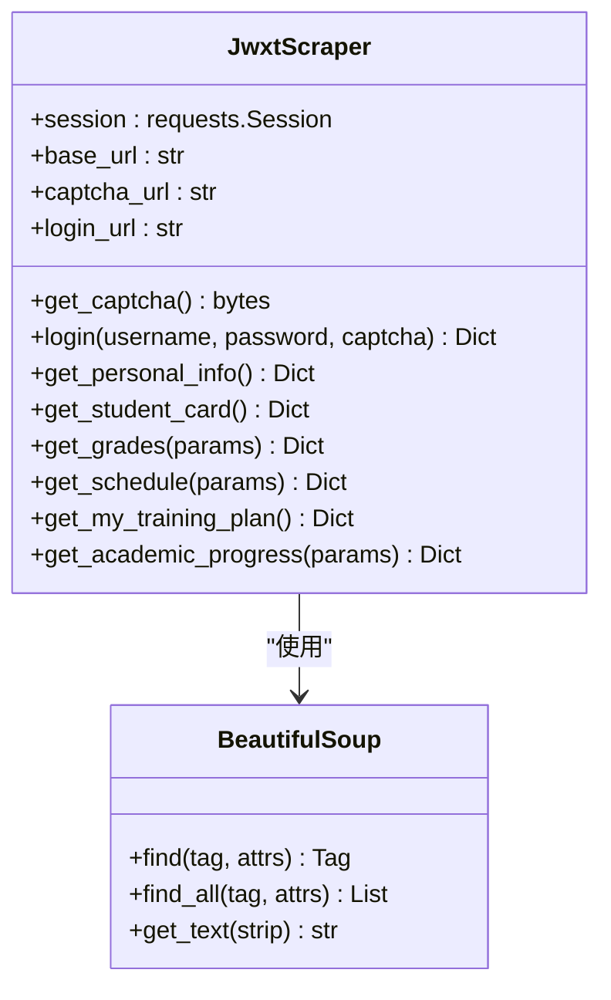
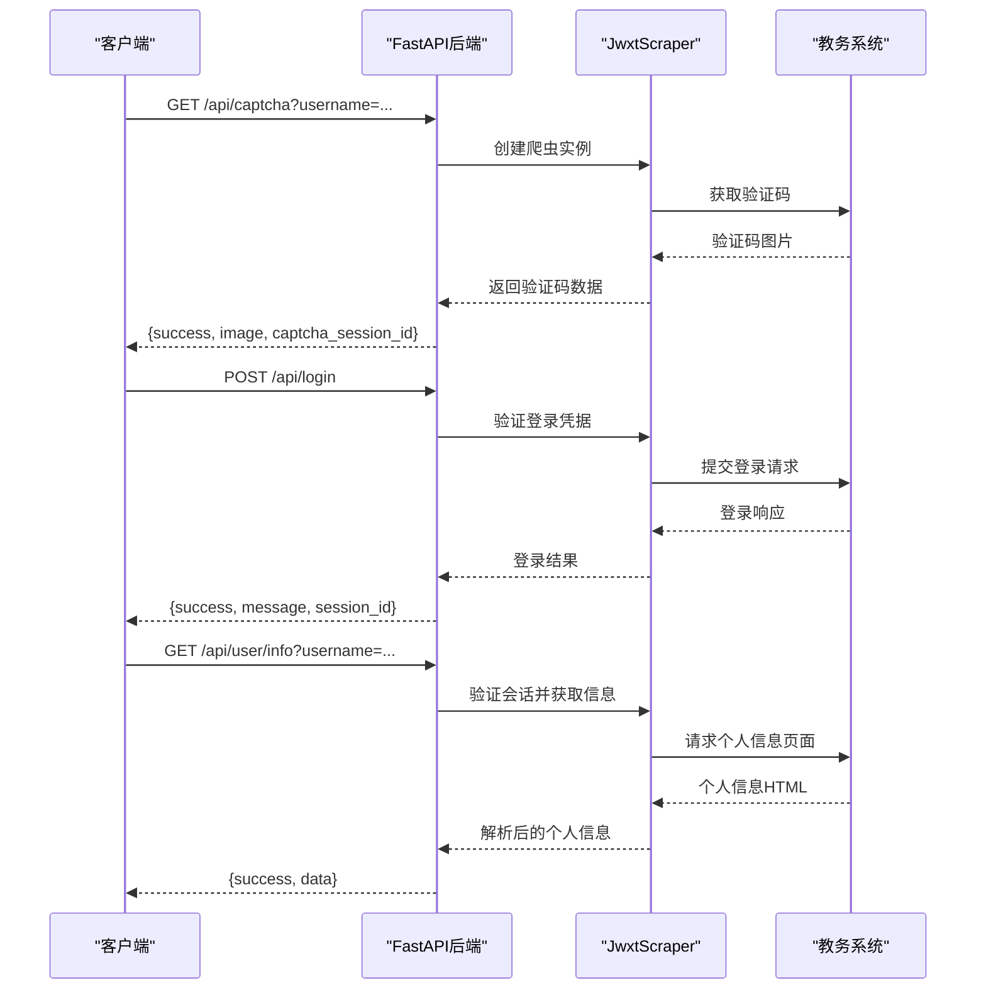
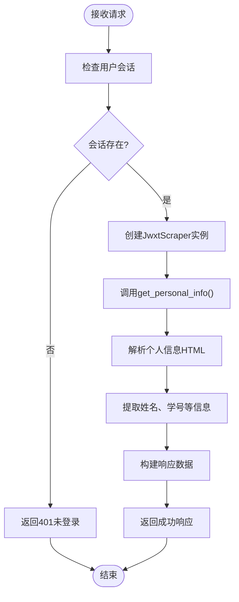
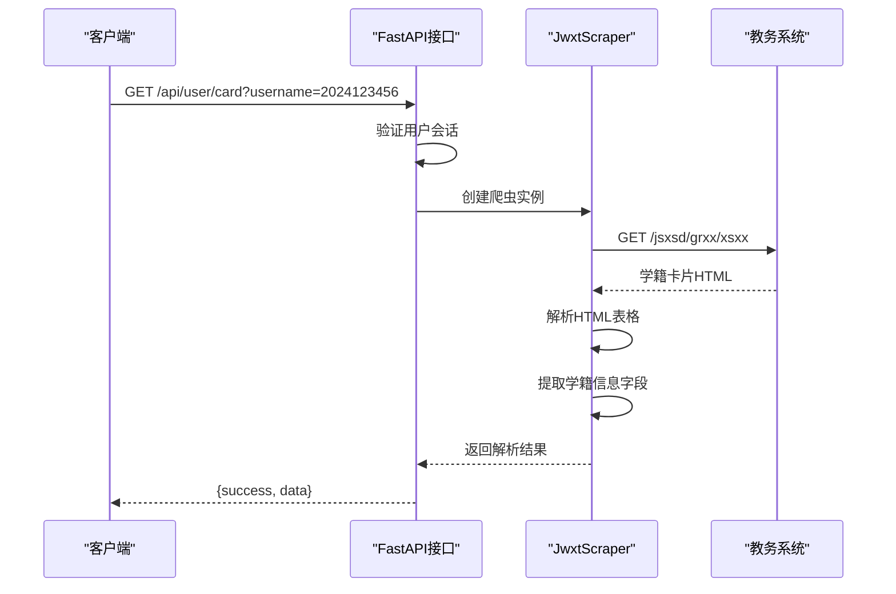
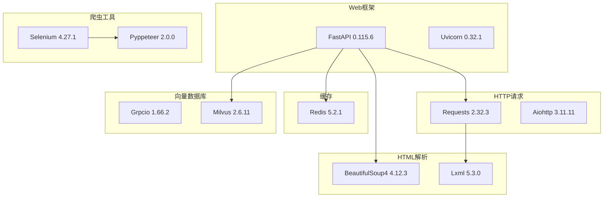
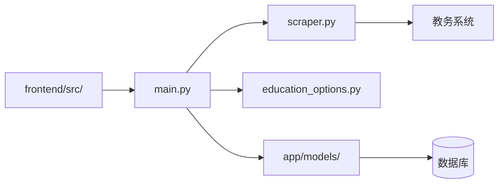
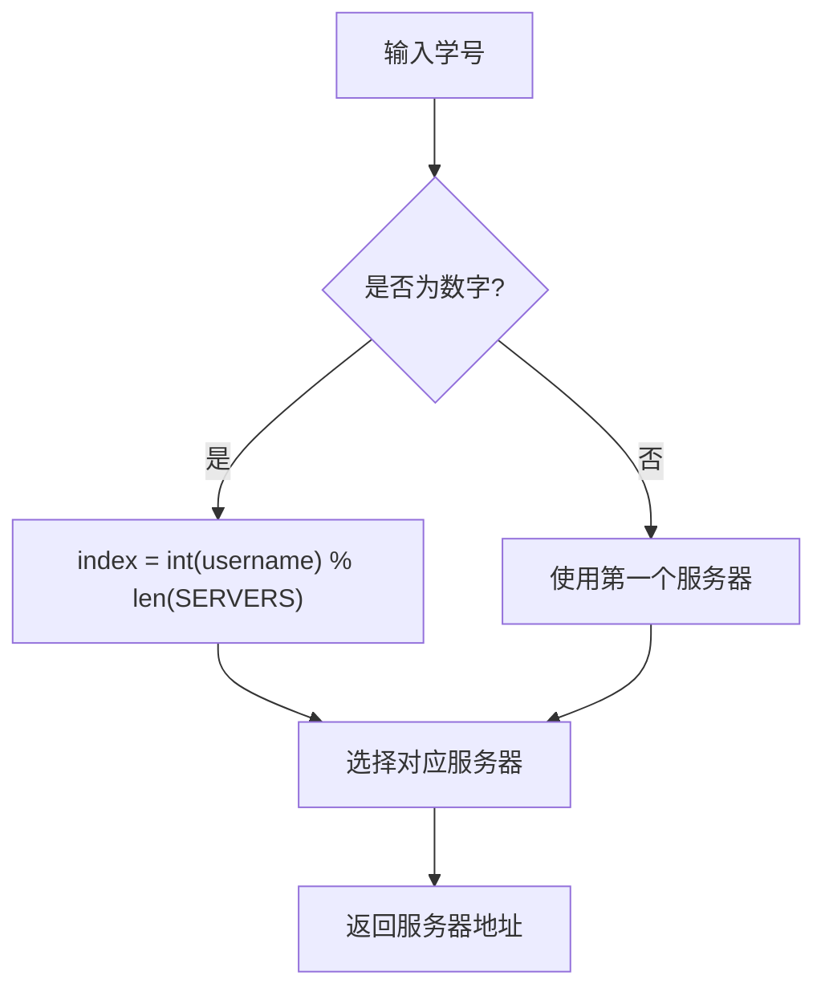
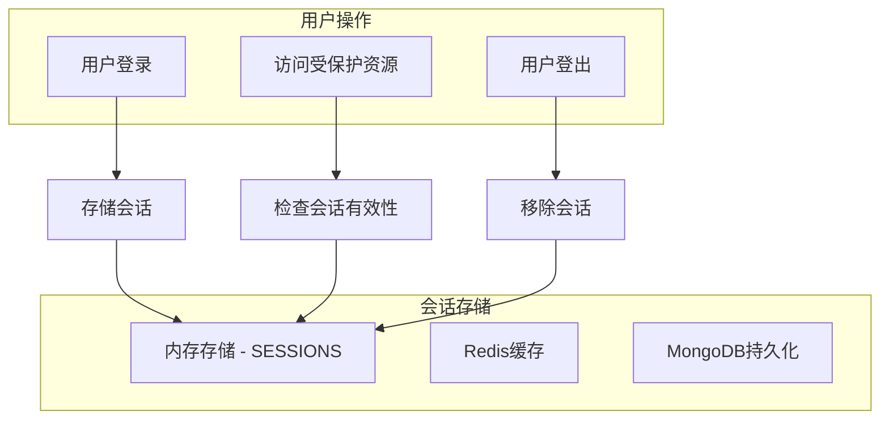

# 个人信息查询API

<cite>
**本文档引用的文件**
- [backend/main.py](file://backend/main.py)
- [backend/scraper.py](file://backend/scraper.py)
- [backend/education_options.py](file://backend/education_options.py)
- [backend/test_scraper.py](file://backend/test_scraper.py)
- [backend/test_login.py](file://backend/test_login.py)
- [backend/requirements.txt](file://backend/requirements.txt)
- [backend/app/models/user.py](file://backend/app/models/user.py)
- [backend/app/models/education_data.py](file://backend/app/models/education_data.py)
- [frontend/src/app/login/page.tsx](file://frontend/src/app/login/page.tsx)
</cite>

## 目录
1. [简介](#简介)
2. [项目结构](#项目结构)
3. [核心组件](#核心组件)
4. [架构概览](#架构概览)
5. [详细组件分析](#详细组件分析)
6. [依赖关系分析](#依赖关系分析)
7. [性能考虑](#性能考虑)
8. [故障排除指南](#故障排除指南)
9. [结论](#结论)
10. [附录](#附录)

## 简介

本项目是一个基于FastAPI开发的教务系统AI助手后端服务，主要提供个人信息查询和学籍卡片查询功能。该系统通过爬取学校教务系统的网页数据，为学生提供便捷的信息查询服务。

系统采用前后端分离架构，后端使用Python FastAPI框架，前端使用Next.js构建。核心功能包括：
- 个人信息获取接口
- 学籍卡片查询接口
- 成绩查询、课表查询等扩展功能
- 教师查询、课程查询等辅助功能

## 项目结构

```mermaid
graph TB
subgraph "后端服务"
A[main.py - 主应用入口]
B[scraper.py - 爬虫模块]
C[education_options.py - 选项数据]
D[models/ - 数据模型]
E[app/api/ - API路由]
F[services/ - 服务层]
end
subgraph "前端应用"
G[frontend/src/app/ - Next.js应用]
H[components/ui/ - UI组件]
end
subgraph "外部系统"
I[教务系统(jwxt.gdufe.edu.cn)]
J[Redis缓存]
K[向量数据库]
end
A --> B
A --> C
A --> D
G --> A
B --> I
A --> J
A --> K
```

**图表来源**
- [backend/main.py:1-853](file://backend/main.py#L1-L853)
- [backend/scraper.py:1-1220](file://backend/scraper.py#L1-L1220)

**章节来源**
- [backend/main.py:1-853](file://backend/main.py#L1-L853)
- [backend/requirements.txt:1-44](file://backend/requirements.txt#L1-L44)

## 核心组件

### API路由组件

系统提供多个API端点，其中个人信息查询和学籍卡片查询是本次文档重点关注的功能：

1. **个人信息查询接口** (`/api/user/info`)
   - 方法：GET
   - 参数：username (必需)
   - 功能：获取用户的个人信息，包括姓名、学号、专业、班级等

2. **学籍卡片查询接口** (`/api/user/card`)
   - 方法：GET
   - 参数：username (必需)
   - 功能：获取详细的学籍卡片信息

3. **验证码接口** (`/api/captcha`)
   - 方法：GET
   - 参数：username (可选)
   - 功能：获取登录验证码图片

4. **登录接口** (`/api/login`)
   - 方法：POST
   - 参数：username, password, code, captcha_session_id
   - 功能：用户身份验证

**章节来源**
- [backend/main.py:332-395](file://backend/main.py#L332-L395)
- [backend/main.py:135-190](file://backend/main.py#L135-L190)
- [backend/main.py:192-327](file://backend/main.py#L192-L327)

### 爬虫组件

JwxtScraper类是系统的核心爬虫组件，负责与教务系统交互：



**图表来源**
- [backend/scraper.py:13-1220](file://backend/scraper.py#L13-L1220)

**章节来源**
- [backend/scraper.py:13-151](file://backend/scraper.py#L13-L151)

## 架构概览



**图表来源**
- [backend/main.py:135-327](file://backend/main.py#L135-L327)
- [backend/scraper.py:61-151](file://backend/scraper.py#L61-L151)

## 详细组件分析

### 个人信息查询接口

#### 接口规范

**端点**: `GET /api/user/info`

**请求参数**:
- `username` (必需): 学号，用于识别用户会话

**请求示例**:
```bash
curl -X GET "http://localhost:8000/api/user/info?username=2024123456"
```

**响应格式**:
```json
{
  "success": true,
  "data": {
    "name": "张三",
    "student_id": "2024123456",
    "major": "计算机科学与技术",
    "class": "计科2401班",
    "department": "计算机学院"
  }
}
```

**错误处理**:
- 401 未登录：用户未通过身份验证
- 500 服务器错误：爬取过程中发生异常

#### 实现流程



**图表来源**
- [backend/main.py:332-367](file://backend/main.py#L332-L367)
- [backend/scraper.py:61-111](file://backend/scraper.py#L61-L111)

**章节来源**
- [backend/main.py:332-367](file://backend/main.py#L332-L367)
- [backend/scraper.py:61-111](file://backend/scraper.py#L61-L111)

### 学籍卡片查询接口

#### 接口规范

**端点**: `GET /api/user/card`

**请求参数**:
- `username` (必需): 学号，用于识别用户会话

**请求示例**:
```bash
curl -X GET "http://localhost:8000/api/user/card?username=2024123456"
```

**响应格式**:
```json
{
  "success": true,
  "data": {
    "姓名": "张三",
    "性别": "男",
    "出生日期": "2005-01-01",
    "民族": "汉",
    "政治面貌": "共青团员",
    "身份证号": "440101200501011234",
    "学号": "2024123456",
    "入学日期": "2024-09-01",
    "学制": "4年",
    "培养层次": "本科",
    "所在学院": "计算机学院",
    "所在专业": "计算机科学与技术",
    "所在班级": "计科2401班",
    "学籍状态": "在读",
    "学籍注册日期": "2024-09-01"
  }
}
```

**错误处理**:
- 401 未登录：用户未通过身份验证
- 500 服务器错误：爬取过程中发生异常

#### 实现流程



**图表来源**
- [backend/main.py:370-395](file://backend/main.py#L370-L395)
- [backend/scraper.py:113-151](file://backend/scraper.py#L113-L151)

**章节来源**
- [backend/main.py:370-395](file://backend/main.py#L370-L395)
- [backend/scraper.py:113-151](file://backend/scraper.py#L113-L151)

### 登录认证机制

系统采用基于会话的认证机制：


**图表来源**
- [backend/main.py:192-327](file://backend/main.py#L192-L327)
- [backend/test_login.py:19-74](file://backend/test_login.py#L19-L74)

**章节来源**
- [backend/main.py:192-327](file://backend/main.py#L192-L327)
- [backend/test_login.py:19-74](file://backend/test_login.py#L19-L74)

## 依赖关系分析

### 外部依赖

系统的主要外部依赖包括：



**图表来源**
- [backend/requirements.txt:1-44](file://backend/requirements.txt#L1-L44)

**章节来源**
- [backend/requirements.txt:1-44](file://backend/requirements.txt#L1-L44)

### 内部模块依赖



**图表来源**
- [backend/main.py:1-853](file://backend/main.py#L1-L853)
- [backend/scraper.py:1-1220](file://backend/scraper.py#L1-L1220)

**章节来源**
- [backend/main.py:1-853](file://backend/main.py#L1-L853)
- [backend/scraper.py:1-1220](file://backend/scraper.py#L1-L1220)

## 性能考虑

### 服务器选择策略

系统实现了智能的服务器选择机制，基于学号进行负载均衡：



**图表来源**
- [backend/main.py:82-92](file://backend/main.py#L82-L92)

### 会话管理

系统使用内存存储会话，生产环境中建议使用Redis：



**图表来源**
- [backend/main.py:74-75](file://backend/main.py#L74-L75)

### 爬取性能优化

1. **超时设置**: 所有HTTP请求设置10秒超时
2. **编码处理**: 统一使用UTF-8编码
3. **错误重试**: 对于临时性错误提供重试机制
4. **连接复用**: 使用requests.Session复用连接

**章节来源**
- [backend/main.py:82-92](file://backend/main.py#L82-L92)
- [backend/scraper.py:1-1220](file://backend/scraper.py#L1-L1220)

## 故障排除指南

### 常见错误及解决方案

#### 1. 验证码相关问题

**问题**: 验证码获取失败
**原因**: 
- 教务系统服务器不可达
- 网络连接问题
- 服务器选择错误

**解决方案**:
- 检查网络连接
- 验证教务系统URL配置
- 确认服务器列表配置正确

#### 2. 登录失败

**问题**: 用户名、密码或验证码错误
**原因**:
- 凭据不正确
- 验证码过期
- 服务器选择错误

**解决方案**:
- 重新获取验证码
- 检查用户名密码
- 确认验证码输入正确

#### 3. 个人信息获取失败

**问题**: 401未登录错误
**原因**:
- 用户未登录
- 会话已过期
- 用户名不匹配

**解决方案**:
- 先执行登录操作
- 检查会话有效期
- 确认用户名正确

#### 4. 学籍卡片解析错误

**问题**: 学籍信息解析失败
**原因**:
- 教务系统页面结构变化
- 网络请求失败
- HTML解析异常

**解决方案**:
- 检查页面结构变化
- 增加重试机制
- 更新解析规则

**章节来源**
- [backend/main.py:135-327](file://backend/main.py#L135-L327)
- [backend/scraper.py:61-151](file://backend/scraper.py#L61-L151)

### 调试工具

系统提供了完整的测试脚本：

1. **test_scraper.py**: 爬虫功能测试
2. **test_login.py**: 登录功能测试
3. **education_options.py**: 选项数据测试

这些测试脚本可以帮助开发者快速定位问题并验证修复效果。

**章节来源**
- [backend/test_scraper.py:1-280](file://backend/test_scraper.py#L1-L280)
- [backend/test_login.py:1-152](file://backend/test_login.py#L1-L152)

## 结论

本项目提供了一个完整的个人信息查询API解决方案，具有以下特点：

### 优势
1. **功能完整**: 支持个人信息和学籍卡片查询
2. **架构清晰**: 前后端分离，职责明确
3. **扩展性强**: 易于添加新的查询功能
4. **错误处理**: 完善的异常处理和错误反馈

### 改进建议
1. **认证安全**: 引入JWT令牌认证机制
2. **会话持久化**: 使用Redis替代内存存储
3. **限流控制**: 添加API访问频率限制
4. **缓存策略**: 实现数据缓存减少重复爬取
5. **监控告警**: 添加系统监控和错误告警

### 使用场景
- 学生自助查询个人信息
- 辅导员批量查询学生信息
- 系统集成第三方应用
- 数据分析和报表生成

## 附录

### API使用示例

#### 获取验证码
```bash
curl -X GET "http://localhost:8000/api/captcha?username=2024123456"
```

#### 用户登录
```bash
curl -X POST "http://localhost:8000/api/login" \
  -H "Content-Type: application/json" \
  -d '{
    "username": "2024123456",
    "password": "your_password",
    "code": "ABCD",
    "captcha_session_id": "captcha_123456789_0"
  }'
```

#### 获取个人信息
```bash
curl -X GET "http://localhost:8000/api/user/info?username=2024123456"
```

#### 获取学籍卡片
```bash
curl -X GET "http://localhost:8000/api/user/card?username=2024123456"
```

### 数据安全和隐私保护

1. **传输安全**: 建议在生产环境中使用HTTPS
2. **敏感信息**: 用户密码仅在本地验证，不存储明文
3. **会话管理**: 会话信息存储在服务器端，避免泄露
4. **日志记录**: 敏感信息不在日志中记录
5. **权限控制**: 受保护资源仅对已认证用户开放

### 性能优化建议

1. **连接池**: 使用连接池复用HTTP连接
2. **异步处理**: 对于耗时操作使用异步处理
3. **缓存策略**: 实现多级缓存减少重复请求
4. **并发控制**: 限制同时发起的爬取请求数量
5. **监控指标**: 添加性能监控和指标收集