# 个人信息查询API

<cite>
**本文档引用的文件**
- [backend/main.py](file://backend/main.py)
- [backend/scraper.py](file://backend/scraper.py)
- [backend/education_options.py](file://backend/education_options.py)
- [backend/test_scraper.py](file://backend/test_scraper.py)
- [backend/test_login.py](file://backend/test_login.py)
- [backend/requirements.txt](file://backend/requirements.txt)
- [backend/app/models/user.py](file://backend/app/models/user.py)
- [backend/app/models/education_data.py](file://backend/app/models/education_data.py)
- [frontend/src/app/login/page.tsx](file://frontend/src/app/login/page.tsx)
</cite>

## 更新摘要
**变更内容**
- **重大改进** 个人信息解析功能从单一的 #Top1_divLoginName 元素解析转变为双重解析策略，优先使用结构化 div.block1text 元素，同时保留降级机制以确保向后兼容性
- 新增统一的会话管理机制：所有用户数据查询API端点现在使用`get_user_session()`函数进行会话管理
- 提高系统一致性：确保登录和爬取使用同一服务器实例，增强了系统可靠性
- 改进错误处理：集中化的会话验证和错误处理机制
- 统一的API模式：所有受保护的API端点都遵循相同的会话管理模式
- **新增** 调试增强：增加了详细的日志记录来改善问题诊断能力，包括URL访问跟踪、响应特征监控、内容分析等

## 目录
1. [简介](#简介)
2. [项目结构](#项目结构)
3. [核心组件](#核心组件)
4. [架构概览](#架构概览)
5. [详细组件分析](#详细组件分析)
6. [依赖关系分析](#依赖关系分析)
7. [性能考虑](#性能考虑)
8. [故障排除指南](#故障排除指南)
9. [结论](#结论)
10. [附录](#附录)

## 简介

本项目是一个基于FastAPI开发的教务系统AI助手后端服务，主要提供个人信息查询和学籍卡片查询功能。该系统通过爬取学校教务系统的网页数据，为学生提供便捷的信息查询服务。

系统采用前后端分离架构，后端使用Python FastAPI框架，前端使用Next.js构建。核心功能包括：
- 个人信息获取接口
- 学籍卡片查询接口
- 成绩查询、课表查询等扩展功能
- 教师查询、课程查询等辅助功能

**更新** 系统现已引入统一的会话管理机制，所有用户数据查询API端点都使用`get_user_session()`函数确保登录和爬取操作使用同一服务器实例，提高了系统的一致性和可靠性。**新增** 系统还增强了调试能力，通过详细的日志记录来改善问题诊断，包括URL访问跟踪、响应特征监控、内容分析等。

## 项目结构

```mermaid
graph TB
subgraph "后端服务"
A[main.py - 主应用入口]
B[scraper.py - 爬虫模块]
C[education_options.py - 选项数据]
D[models/ - 数据模型]
E[app/api/ - API路由]
F[services/ - 服务层]
G[get_user_session() - 会话管理]
H[日志记录系统 - 调试增强]
end
subgraph "前端应用"
I[frontend/src/app/ - Next.js应用]
J[components/ui/ - UI组件]
end
subgraph "外部系统"
K[教务系统(jwxt.gdufe.edu.cn)]
L[Redis缓存]
M[向量数据库]
end
A --> B
A --> C
A --> D
A --> G
A --> H
I --> A
B --> K
A --> L
A --> M
```

**图表来源**
- [backend/main.py:1-857](file://backend/main.py#L1-L857)
- [backend/scraper.py:1-1257](file://backend/scraper.py#L1-L1257)

**章节来源**
- [backend/main.py:1-857](file://backend/main.py#L1-L857)
- [backend/requirements.txt:1-44](file://backend/requirements.txt#L1-L44)

## 核心组件

### API路由组件

系统提供多个API端点，其中个人信息查询和学籍卡片查询是本次文档重点关注的功能：

1. **个人信息查询接口** (`/api/user/info`)
   - 方法：GET
   - 参数：username (必需)
   - 功能：获取用户的个人信息，包括姓名、学号、专业、班级等
   - **更新**：使用`get_user_session()`函数进行统一会话管理
   - **新增**：详细的日志记录，包括请求参数、会话状态、爬取结果等

2. **学籍卡片查询接口** (`/api/user/card`)
   - 方法：GET
   - 参数：username (必需)
   - 功能：获取详细的学籍卡片信息
   - **更新**：使用`get_user_session()`函数进行统一会话管理
   - **新增**：详细的日志记录，包括URL访问跟踪、响应特征监控、内容分析等

3. **验证码接口** (`/api/captcha`)
   - 方法：GET
   - 参数：username (可选)
   - 功能：获取登录验证码图片

4. **登录接口** (`/api/login`)
   - 方法：POST
   - 参数：username, password, code, captcha_session_id
   - 功能：用户身份验证
   - **新增**：增强的调试日志，包括服务器选择、响应状态码、编码检测等

**章节来源**
- [backend/main.py:368-398](file://backend/main.py#L368-L398)
- [backend/main.py:401-423](file://backend/main.py#L401-L423)
- [backend/main.py:136-192](file://backend/main.py#L136-L192)
- [backend/main.py:194-348](file://backend/main.py#L194-L348)

### 会话管理组件

**新增** `get_user_session()`函数是本次更新的核心组件，提供统一的会话管理机制：

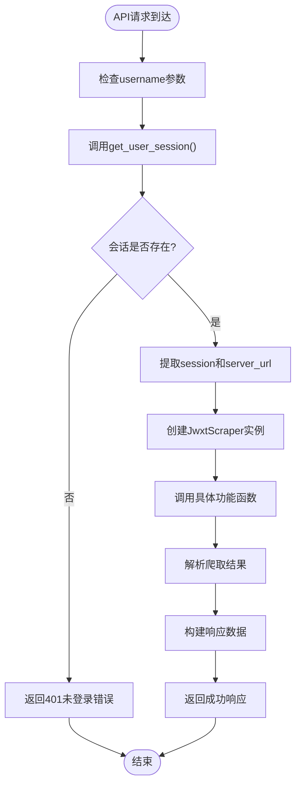

**图表来源**
- [backend/main.py:353-366](file://backend/main.py#L353-L366)

**章节来源**
- [backend/main.py:353-366](file://backend/main.py#L353-L366)

### 爬虫组件

JwxtScraper类是系统的核心爬虫组件，负责与教务系统交互：

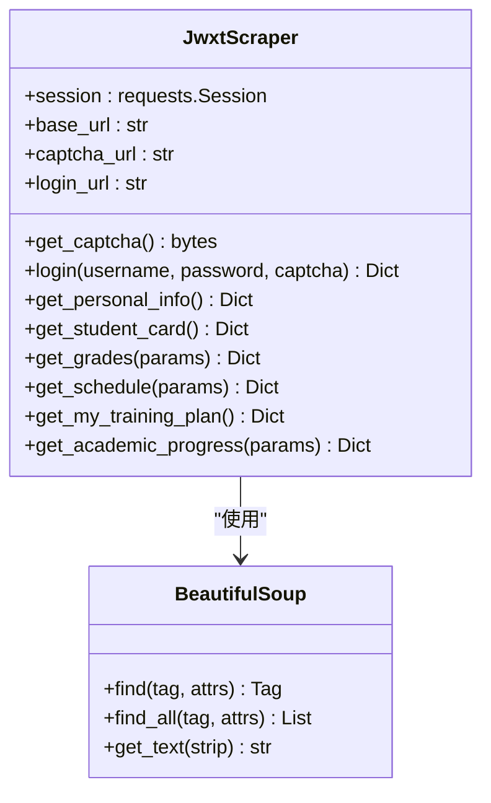

**图表来源**
- [backend/scraper.py:13-1257](file://backend/scraper.py#L13-L1257)

**章节来源**
- [backend/scraper.py:13-200](file://backend/scraper.py#L13-L200)

## 架构概览

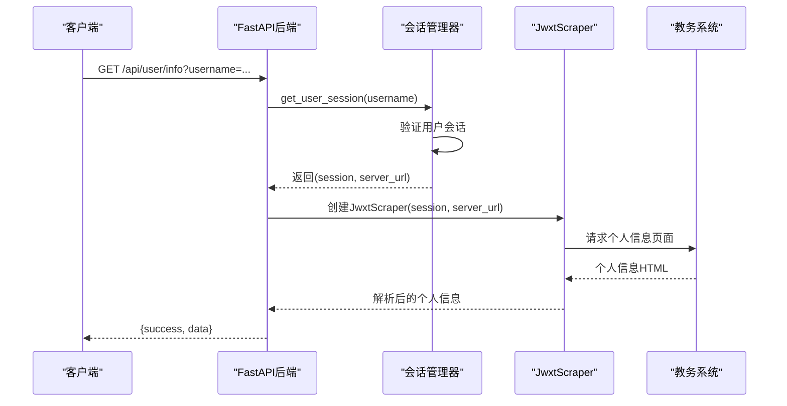

**图表来源**
- [backend/main.py:368-398](file://backend/main.py#L368-L398)
- [backend/main.py:353-366](file://backend/main.py#L353-L366)
- [backend/scraper.py:78-128](file://backend/scraper.py#L78-L128)

## 详细组件分析

### 个人信息查询接口

#### 接口规范

**端点**: `GET /api/user/info`

**请求参数**:
- `username` (必需): 学号，用于识别用户会话

**请求示例**:
```bash
curl -X GET "http://localhost:8000/api/user/info?username=2024123456"
```

**响应格式**:
```json
{
  "success": true,
  "data": {
    "name": "张三",
    "student_id": "2024123456",
    "major": "计算机科学与技术",
    "class": "计科2401班",
    "department": "计算机学院"
  }
}
```

**错误处理**:
- 401 未登录：用户未通过身份验证
- 500 服务器错误：爬取过程中发生异常

#### 实现流程

**更新** 现在使用统一的会话管理机制：

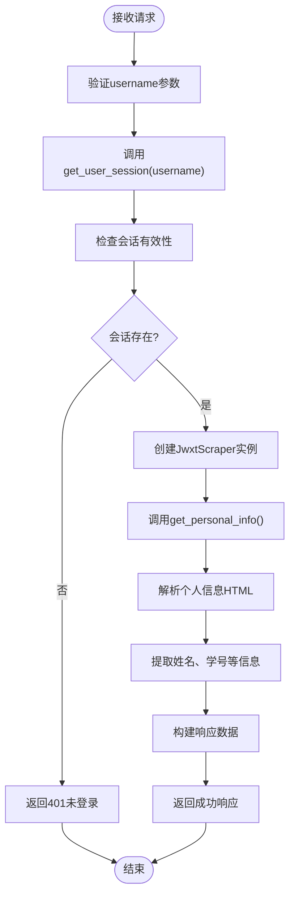

**新增** 调试增强功能：
- 详细的请求日志记录
- 会话状态监控
- 爬取结果分析
- 错误追踪和诊断

**章节来源**
- [backend/main.py:368-398](file://backend/main.py#L368-L398)
- [backend/main.py:353-366](file://backend/main.py#L353-L366)
- [backend/scraper.py:78-128](file://backend/scraper.py#L78-L128)

### 个人信息解析策略

**重大更新** 个人信息解析功能现在采用双重解析策略：

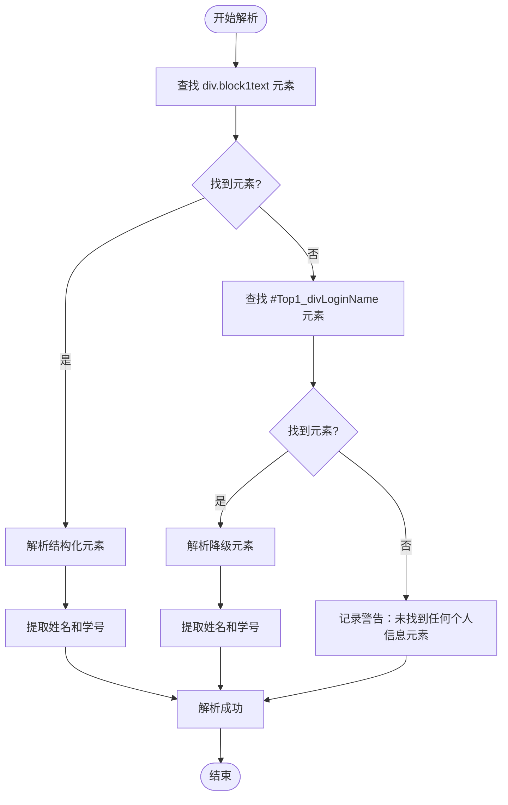

**更新** 双重解析策略的具体实现：

1. **优先策略**：查找 `div.block1text` 元素
   - HTML结构：`<div class="block1text"> 姓名：张靖<br/> 学号：24251102121<br/></div>`
   - 优点：结构化程度高，解析准确度更高
   - 日志记录：`【个人信息】从 block1text 解析: name=张靖, student_id=24251102121`

2. **降级策略**：查找 `#Top1_divLoginName` 元素
   - HTML结构：`<div id="Top1_divLoginName">张靖(24251102121)</div>`
   - 优点：向后兼容，确保在旧系统中也能正常工作
   - 日志记录：`【个人信息】从 Top1_divLoginName 降级解析: name=张靖, student_id=24251102121`

3. **错误处理**：如果两种策略都失败，记录警告并返回空值
   - 日志记录：`【个人信息】未找到任何个人信息元素`

**图表来源**
- [backend/scraper.py:99-133](file://backend/scraper.py#L99-L133)

**章节来源**
- [backend/scraper.py:99-133](file://backend/scraper.py#L99-L133)

### 学籍卡片查询接口

#### 接口规范

**端点**: `GET /api/user/card`

**请求参数**:
- `username` (必需): 学号，用于识别用户会话

**请求示例**:
```bash
curl -X GET "http://localhost:8000/api/user/card?username=2024123456"
```

**响应格式**:
```json
{
  "success": true,
  "data": {
    "姓名": "张三",
    "性别": "男",
    "出生日期": "2005-01-01",
    "民族": "汉",
    "政治面貌": "共青团员",
    "身份证号": "440101200501011234",
    "学号": "2024123456",
    "入学日期": "2024-09-01",
    "学制": "4年",
    "培养层次": "本科",
    "所在学院": "计算机学院",
    "所在专业": "计算机科学与技术",
    "所在班级": "计科2401班",
    "学籍状态": "在读",
    "学籍注册日期": "2024-09-01"
  }
}
```

**错误处理**:
- 401 未登录：用户未通过身份验证
- 500 服务器错误：爬取过程中发生异常

#### 实现流程

**更新** 现在使用统一的会话管理机制：

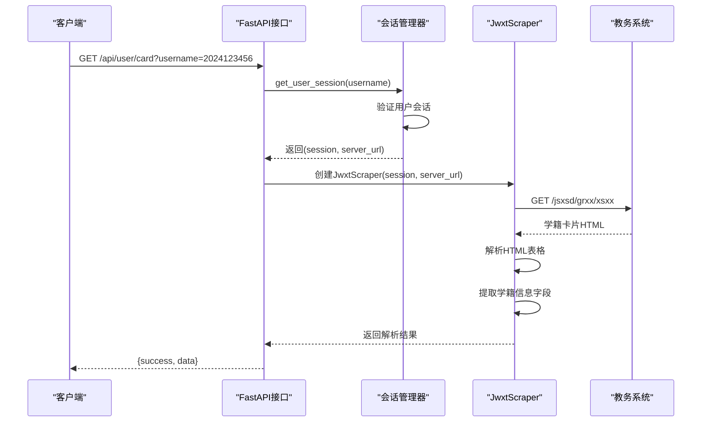

**新增** 调试增强功能：
- URL访问跟踪
- 响应特征监控
- 内容分析
- 编码检测
- 页面结构验证

**图表来源**
- [backend/main.py:401-423](file://backend/main.py#L401-L423)
- [backend/main.py:353-366](file://backend/main.py#L353-L366)
- [backend/scraper.py:130-168](file://backend/scraper.py#L130-L168)

**章节来源**
- [backend/main.py:401-423](file://backend/main.py#L401-L423)
- [backend/main.py:353-366](file://backend/main.py#L353-L366)
- [backend/scraper.py:130-168](file://backend/scraper.py#L130-L168)

### 登录认证机制

系统采用基于会话的认证机制：

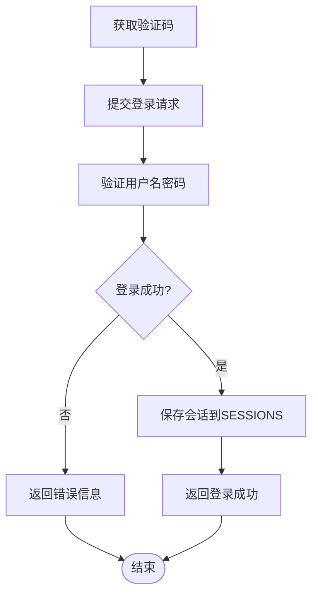

**新增** 增强的调试日志：
- 验证码获取过程跟踪
- 登录服务器选择记录
- 响应状态码监控
- 编码检测分析
- 错误信息提取

**图表来源**
- [backend/main.py:194-348](file://backend/main.py#L194-L348)
- [backend/test_login.py:19-74](file://backend/test_login.py#L19-L74)

**章节来源**
- [backend/main.py:194-348](file://backend/main.py#L194-L348)
- [backend/test_login.py:19-74](file://backend/test_login.py#L19-L74)

### 会话管理机制

**新增** 统一的会话管理机制确保所有API端点的一致性：

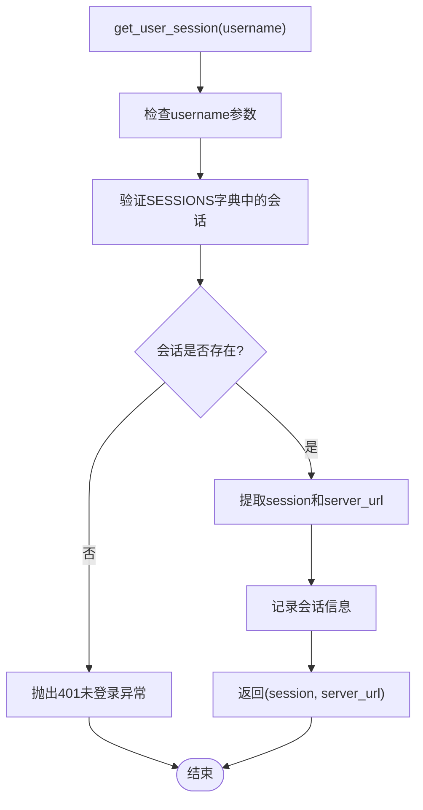

**新增** 调试增强功能：
- 会话状态监控
- 用户活动跟踪
- 服务器实例验证
- 性能指标记录

**图表来源**
- [backend/main.py:353-366](file://backend/main.py#L353-L366)

**章节来源**
- [backend/main.py:353-366](file://backend/main.py#L353-L366)

## 依赖关系分析

### 外部依赖

系统的主要外部依赖包括：

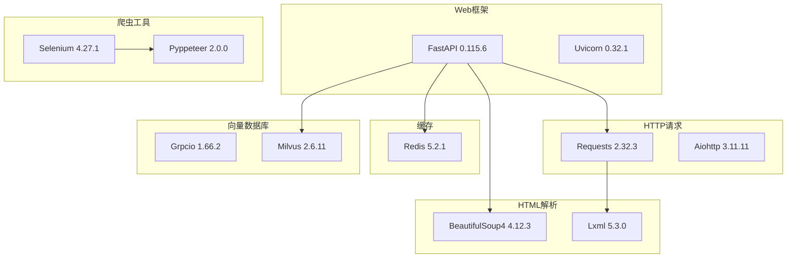

**图表来源**
- [backend/requirements.txt:1-44](file://backend/requirements.txt#L1-L44)

**章节来源**
- [backend/requirements.txt:1-44](file://backend/requirements.txt#L1-L44)

### 内部模块依赖

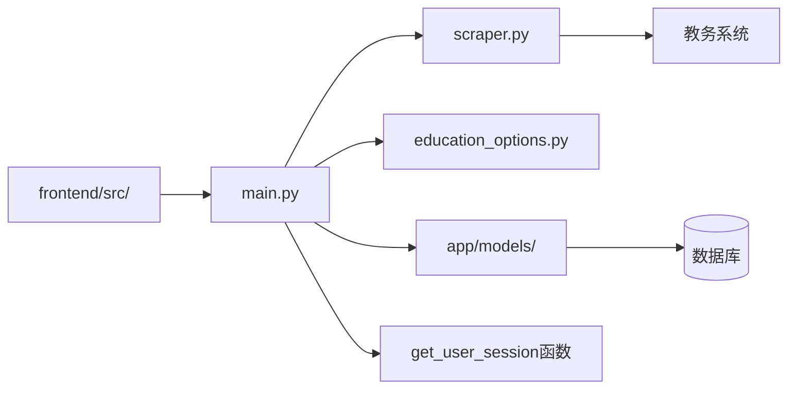

**图表来源**
- [backend/main.py:1-857](file://backend/main.py#L1-L857)
- [backend/scraper.py:1-1257](file://backend/scraper.py#L1-L1257)

**章节来源**
- [backend/main.py:1-857](file://backend/main.py#L1-L857)
- [backend/scraper.py:1-1257](file://backend/scraper.py#L1-L1257)

## 性能考虑

### 服务器选择策略

系统实现了智能的服务器选择机制，基于学号进行负载均衡：

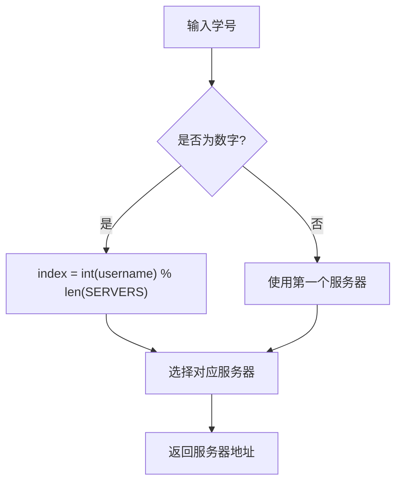

**图表来源**
- [backend/main.py:83-93](file://backend/main.py#L83-L93)

### 会话管理优化

**更新** 统一的会话管理机制提供了更好的性能和可靠性：

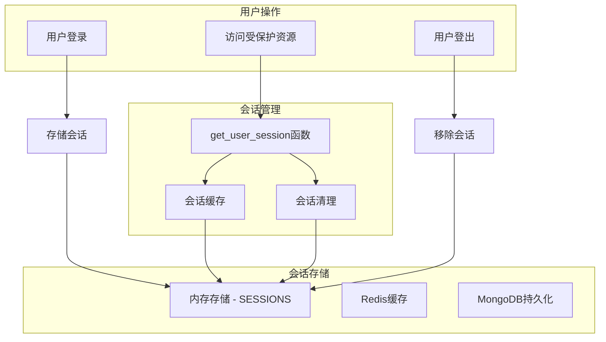

**图表来源**
- [backend/main.py:75](file://backend/main.py#L75)
- [backend/main.py:353-366](file://backend/main.py#L353-L366)

### 爬取性能优化

1. **超时设置**: 所有HTTP请求设置10秒超时
2. **编码处理**: 统一使用UTF-8编码
3. **错误重试**: 对于临时性错误提供重试机制
4. **连接复用**: 使用requests.Session复用连接
5. ****统一会话管理**: 通过`get_user_session()`函数确保会话一致性
6. **新增** **增强的调试日志**: 提供详细的性能监控和问题诊断信息

**章节来源**
- [backend/main.py:83-93](file://backend/main.py#L83-L93)
- [backend/scraper.py:1-1257](file://backend/scraper.py#L1-L1257)
- [backend/main.py:353-366](file://backend/main.py#L353-L366)

## 故障排除指南

### 常见错误及解决方案

#### 1. 验证码相关问题

**问题**: 验证码获取失败
**原因**: 
- 教务系统服务器不可达
- 网络连接问题
- 服务器选择错误

**解决方案**:
- 检查网络连接
- 验证教务系统URL配置
- 确认服务器列表配置正确

#### 2. 登录失败

**问题**: 用户名、密码或验证码错误
**原因**:
- 凭据不正确
- 验证码过期
- 服务器选择错误

**解决方案**:
- 重新获取验证码
- 检查用户名密码
- 确认验证码输入正确

#### 3. 个人信息获取失败

**问题**: 401未登录错误
**原因**:
- 用户未登录
- 会话已过期
- 用户名不匹配
- **更新**：会话管理器无法找到对应的会话

**解决方案**:
- 先执行登录操作
- 检查会话有效期
- 确认用户名正确
- **更新**：检查`get_user_session()`函数的日志输出

#### 4. 学籍卡片解析错误

**问题**: 学籍信息解析失败
**原因**:
- 教务系统页面结构变化
- 网络请求失败
- HTML解析异常
- **更新**：会话管理失败导致的请求失败

**解决方案**:
- 检查页面结构变化
- 增加重试机制
- 更新解析规则
- **更新**：检查会话管理器的错误日志

#### 5. 会话管理问题

**新增** 由于引入了统一的会话管理机制，可能出现以下问题：

**问题**: `get_user_session()`函数抛出401错误
**原因**:
- 用户未登录
- 会话数据损坏
- 服务器实例不一致

**解决方案**:
- 检查登录状态
- 清理会话数据
- 确认服务器实例配置

#### 6. 个人信息解析问题

**重大更新** 由于采用了双重解析策略，可能出现以下问题：

**问题**: 个人信息解析失败
**原因**:
- `div.block1text` 元素结构发生变化
- `#Top1_divLoginName` 元素不存在
- 教务系统页面结构变化
- 编码问题影响解析

**解决方案**:
- 检查页面结构变化
- 增加更多日志记录
- 更新解析策略
- 检查编码处理

### 调试工具

系统提供了完整的测试脚本和增强的调试功能：

1. **test_scraper.py**: 爬虫功能测试
2. **test_login.py**: 登录功能测试
3. **education_options.py**: 选项数据测试
4. **新增** **详细日志记录**: 提供完整的请求跟踪和响应分析

**新增** 调试增强功能：
- URL访问跟踪
- 响应特征监控
- 内容分析
- 编码检测
- 性能指标记录

**章节来源**
- [backend/test_scraper.py:1-280](file://backend/test_scraper.py#L1-L280)
- [backend/test_login.py:1-152](file://backend/test_login.py#L1-L152)

## 结论

本项目提供了一个完整的个人信息查询API解决方案，具有以下特点：

### 优势
1. **功能完整**: 支持个人信息和学籍卡片查询
2. **架构清晰**: 前后端分离，职责明确
3. **扩展性强**: 易于添加新的查询功能
4. **错误处理**: 完善的异常处理和错误反馈
5. ****统一会话管理**: 通过`get_user_session()`函数确保所有API端点的一致性
6. ****提高可靠性**: 登录和爬取使用同一服务器实例
7. **新增** **增强的调试能力**: 详细的日志记录改善问题诊断能力

### 重大改进
**更新** 个人信息解析功能的重大改进：
- **双重解析策略**：优先使用结构化 `div.block1text` 元素，确保更高的解析准确性
- **向后兼容性**：保留 `#Top1_divLoginName` 元素的降级解析机制
- **错误处理**：完善的日志记录和错误追踪
- **性能提升**：结构化元素解析比降级方案更高效

### 改进建议
1. **认证安全**: 引入JWT令牌认证机制
2. **会话持久化**: 使用Redis替代内存存储
3. **限流控制**: 添加API访问频率限制
4. **缓存策略**: 实现数据缓存减少重复爬取
5. **监控告警**: 添加系统监控和错误告警
6. ****会话管理优化**: 进一步优化`get_user_session()`函数的性能
7. **新增** **日志分析工具**: 建立专门的日志分析和监控系统

### 使用场景
- 学生自助查询个人信息
- 辅导员批量查询学生信息
- 系统集成第三方应用
- 数据分析和报表生成

## 附录

### API使用示例

#### 获取验证码
```bash
curl -X GET "http://localhost:8000/api/captcha?username=2024123456"
```

#### 用户登录
```bash
curl -X POST "http://localhost:8000/api/login" \
  -H "Content-Type: application/json" \
  -d '{
    "username": "2024123456",
    "password": "your_password",
    "code": "ABCD",
    "captcha_session_id": "captcha_123456789_0"
  }'
```

#### 获取个人信息
```bash
curl -X GET "http://localhost:8000/api/user/info?username=2024123456"
```

#### 获取学籍卡片
```bash
curl -X GET "http://localhost:8000/api/user/card?username=2024123456"
```

### 数据安全和隐私保护

1. **传输安全**: 建议在生产环境中使用HTTPS
2. **敏感信息**: 用户密码仅在本地验证，不存储明文
3. **会话管理**: 会话信息存储在服务器端，避免泄露
4. **日志记录**: 敏感信息不在日志中记录
5. **权限控制**: 受保护资源仅对已认证用户开放
6. ****会话一致性**: 统一的会话管理确保数据完整性
7. **新增** **日志安全**: 调试日志不包含敏感数据，仅记录必要的诊断信息

### 性能优化建议

1. **连接池**: 使用连接池复用HTTP连接
2. **异步处理**: 对于耗时操作使用异步处理
3. **缓存策略**: 实现多级缓存减少重复请求
4. **并发控制**: 限制同时发起的爬取请求数量
5. **监控指标**: 添加性能监控和指标收集
6. ****会话管理优化**: 优化`get_user_session()`函数的性能
7. ****服务器实例管理**: 确保所有API端点使用同一服务器实例
8. **新增** **日志性能优化**: 使用异步日志记录，避免阻塞请求处理

### 会话管理最佳实践

**新增** 使用`get_user_session()`函数的最佳实践：

1. **参数验证**: 确保username参数有效
2. **错误处理**: 正确处理401未登录错误
3. **日志记录**: 记录会话管理过程的关键信息
4. **性能监控**: 监控会话管理的响应时间和成功率
5. ****一致性保证**: 确保所有API端点使用相同的会话管理逻辑
6. **新增** **调试日志**: 利用详细的日志记录进行问题诊断和性能分析

### 调试日志示例

**新增** 系统提供的调试日志示例：

```
INFO:     【验证码】使用服务器: http://172.19.13.60:80/jsxsd/
INFO:     【验证码】生成 session: captcha_1712345678.901234_0
INFO:     【登录】使用验证码时的服务器: http://172.19.13.60:80/jsxsd/
INFO:     【登录】响应状态码: 200
INFO:     【登录】响应 URL: http://172.19.13.60:80/jsxsd/jsxsd/framework/xsMain.jsp
INFO:     【登录】响应内容长度: 12345
INFO:     【个人信息】URL: http://172.19.13.60:80/jsxsd/framework/xsMain.jsp
INFO:     【个人信息】响应编码: gb18030
INFO:     【个人信息】响应长度: 12345
INFO:     【个人信息】内容预览: <!DOCTYPE html><html>...
INFO:     【个人信息】从 block1text 解析: name=张靖, student_id=24251102121
```

这些日志提供了完整的请求跟踪、响应分析和内容监控，大大改善了问题诊断能力。

### 个人信息解析策略详解

**重大更新** 双重解析策略的技术细节：

1. **结构化解析（优先）**
   - 查找 `div.block1text` 元素
   - 解析结构化文本内容
   - 提取姓名和学号字段
   - 优点：解析准确度高，结构清晰

2. **降级解析（备用）**
   - 查找 `#Top1_divLoginName` 元素
   - 解析合并的文本格式
   - 提取姓名和学号字段
   - 优点：向后兼容性强

3. **错误恢复机制**
   - 两种策略都失败时记录警告
   - 返回空值并继续处理
   - 便于上层逻辑处理

**章节来源**
- [backend/scraper.py:99-133](file://backend/scraper.py#L99-L133)