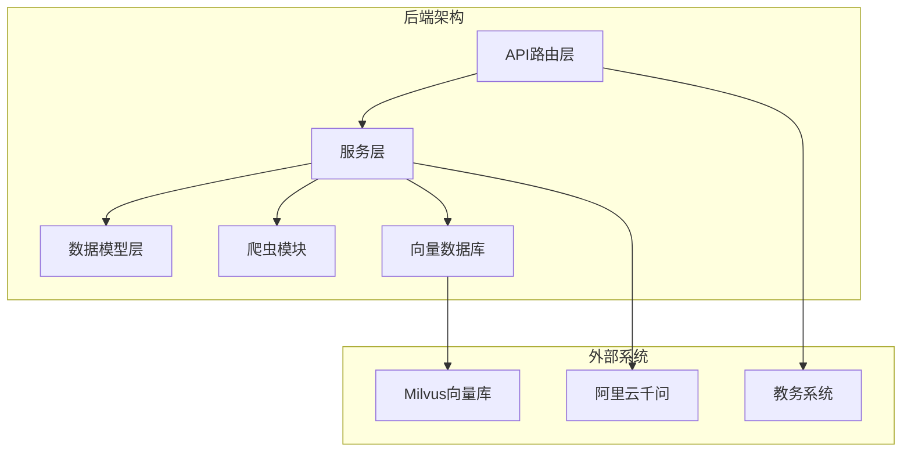
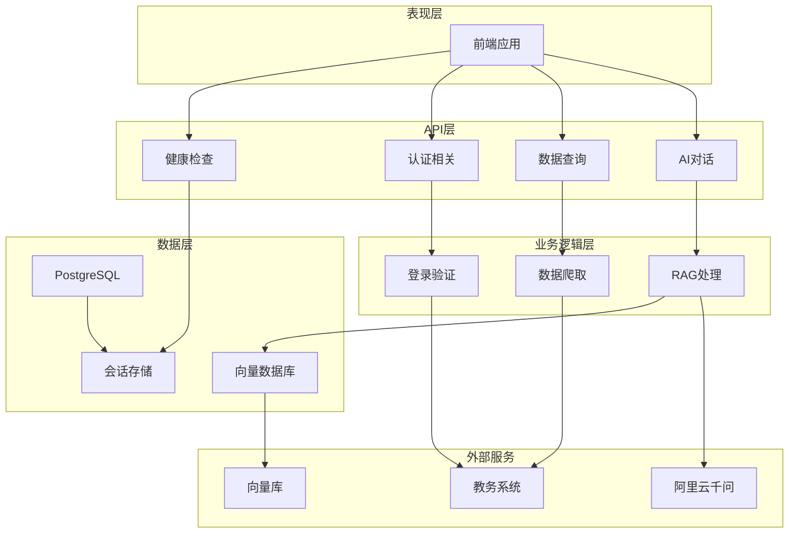
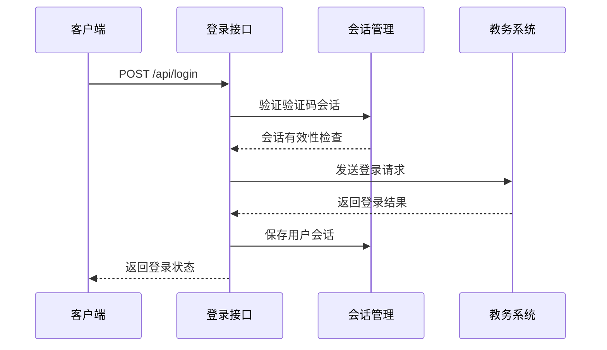
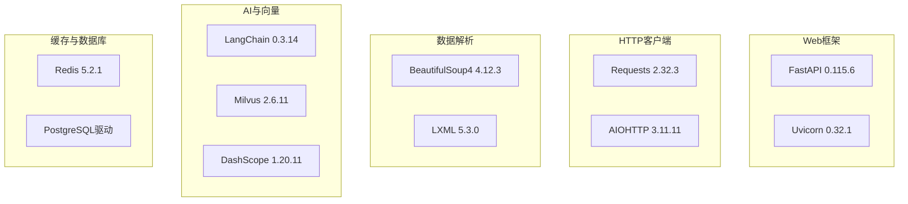
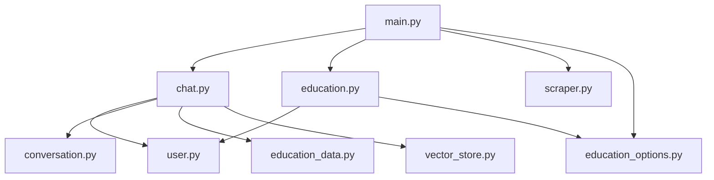

# 后端API文档

<cite>
**本文档引用的文件**
- [backend/main.py](file://backend/main.py)
- [backend/app/api/chat.py](file://backend/app/api/chat.py)
- [backend/app/api/education.py](file://backend/app/api/education.py)
- [backend/scraper.py](file://backend/scraper.py)
- [backend/education_options.py](file://backend/education_options.py)
- [backend/app/models/user.py](file://backend/app/models/user.py)
- [backend/app/models/conversation.py](file://backend/app/models/conversation.py)
- [backend/app/models/education_data.py](file://backend/app/models/education_data.py)
- [backend/app/models/base.py](file://backend/app/models/base.py)
- [backend/app/services/vector_store.py](file://backend/app/services/vector_store.py)
- [backend/requirements.txt](file://backend/requirements.txt)
- [README.md](file://README.md)
</cite>

## 目录
1. [简介](#简介)
2. [项目结构](#项目结构)
3. [核心组件](#核心组件)
4. [架构概览](#架构概览)
5. [详细组件分析](#详细组件分析)
6. [依赖分析](#依赖分析)
7. [性能考虑](#性能考虑)
8. [故障排除指南](#故障排除指南)
9. [结论](#结论)
10. [附录](#附录)

## 简介
本项目是一个基于FastAPI的智能教务系统AI助手后端API，提供验证码获取、用户登录、健康检查、AI对话、教务数据查询等RESTful接口。系统采用前后端分离架构，后端使用Python 3.8+和FastAPI框架，前端使用Next.js 16，支持验证码登录、数据爬取、AI问答等功能。

## 项目结构
后端项目采用模块化设计，主要包含以下核心模块：
- API路由层：处理HTTP请求和响应
- 业务逻辑层：实现具体的业务功能
- 数据模型层：定义数据库实体和关系
- 服务层：封装外部服务集成
- 爬虫模块：负责教务系统数据抓取



**图表来源**
- [backend/main.py:1-853](file://backend/main.py#L1-L853)
- [backend/app/api/chat.py:1-224](file://backend/app/api/chat.py#L1-L224)

**章节来源**
- [backend/main.py:1-853](file://backend/main.py#L1-L853)
- [README.md:25-41](file://README.md#L25-L41)

## 核心组件
系统的核心组件包括：

### 1. FastAPI应用实例
- 应用名称：教务系统 AI 助手 API
- 版本：1.0.0
- 支持CORS跨域访问
- 集成健康检查端点

### 2. 教务系统集成
- 支持外网和内网服务器
- 自动服务器选择算法
- 验证码与登录一致性保证

### 3. AI对话系统
- 基于LangChain的RAG架构
- 向量数据库Milvus集成
- 支持对话历史管理

**章节来源**
- [backend/main.py:39-48](file://backend/main.py#L39-L48)
- [backend/main.py:82-92](file://backend/main.py#L82-L92)
- [backend/app/api/chat.py:14-15](file://backend/app/api/chat.py#L14-L15)

## 架构概览
系统采用分层架构设计，确保关注点分离和代码可维护性。



**图表来源**
- [backend/main.py:95-123](file://backend/main.py#L95-L123)
- [backend/app/api/chat.py:45-153](file://backend/app/api/chat.py#L45-L153)

## 详细组件分析

### 验证码获取接口
提供验证码图片获取和会话管理功能。

#### 接口定义
- **HTTP方法**: GET
- **URL路径**: `/api/captcha`
- **参数**: `username` (可选)
- **功能**: 获取验证码图片并返回会话ID

#### 请求参数
| 参数名 | 类型 | 必填 | 描述 |
|--------|------|------|------|
| username | string | 否 | 用于服务器选择的学号 |

#### 响应格式
```json
{
  "success": true,
  "image": "data:image/jpeg;base64,...",
  "captcha_session_id": "captcha_1712345678_3"
}
```

#### 服务器选择逻辑
系统根据学号自动选择服务器，确保验证码和登录使用同一服务器实例。

**章节来源**
- [backend/main.py:135-190](file://backend/main.py#L135-L190)
- [backend/main.py:82-92](file://backend/main.py#L82-L92)

### 用户登录接口
实现教务系统登录验证功能。

#### 接口定义
- **HTTP方法**: POST
- **URL路径**: `/api/login`
- **请求体**: JSON格式

#### 请求体结构
```json
{
  "username": "24251102121",
  "password": "your_password",
  "code": "ABCD",
  "captcha_session_id": "captcha_1712345678_3"
}
```

#### 响应格式
成功登录响应：
```json
{
  "success": true,
  "message": "登录成功",
  "username": "24251102121",
  "session_id": "JSESSIONID_value"
}
```

失败登录响应：
```json
{
  "success": false,
  "message": "用户名、密码或验证码错误"
}
```

#### 登录流程


**图表来源**
- [backend/main.py:192-327](file://backend/main.py#L192-L327)

**章节来源**
- [backend/main.py:192-327](file://backend/main.py#L192-L327)

### 健康检查接口
提供系统健康状态检查功能。

#### 接口定义
- **HTTP方法**: GET
- **URL路径**: `/api/health`
- **响应**: 简单的健康状态信息

#### 响应格式
```json
{
  "status": "ok"
}
```

**章节来源**
- [backend/main.py:126-129](file://backend/main.py#L126-L129)

### 教务数据查询接口组

#### 个人信息查询
- **HTTP方法**: GET
- **URL路径**: `/api/user/info`
- **参数**: `username`

#### 成绩查询
- **HTTP方法**: GET
- **URL路径**: `/api/grades`
- **参数**: `username`, `kksj`, `kcxz`, `kcmc`, `fxkc`, `xsfs`

#### 课表查询
- **HTTP方法**: GET
- **URL路径**: `/api/schedule`
- **参数**: `username`, `semester`, `week`

#### 培养方案查询
- **HTTP方法**: GET
- **URL路径**: `/api/training-plan/my`

#### 学业进度查询
- **HTTP方法**: GET
- **URL路径**: `/api/academic-progress`
- **参数**: `username`, `study_type`

#### 考试安排查询
- **HTTP方法**: GET
- **URL路径**: `/api/exam-schedule`
- **参数**: `username`, `semester`

**章节来源**
- [backend/main.py:332-580](file://backend/main.py#L332-L580)

### AI对话接口组

#### 发送消息
- **HTTP方法**: POST
- **URL路径**: `/api/chat/send`
- **请求体**: ChatRequest模型

#### 获取对话列表
- **HTTP方法**: GET
- **URL路径**: `/api/chat/conversations/{username}`

#### 获取对话历史
- **HTTP方法**: GET
- **URL路径**: `/api/chat/history/{conversation_id}`

#### 删除对话
- **HTTP方法**: DELETE
- **URL路径**: `/api/chat/conversations/{conversation_id}`

**章节来源**
- [backend/app/api/chat.py:45-224](file://backend/app/api/chat.py#L45-L224)

### 教育系统选项查询接口

#### 院系查询
- **HTTP方法**: GET
- **URL路径**: `/api/options/departments`
- **参数**: `keyword`, `include_admin`, `include_vocational`

#### 学期查询
- **HTTP方法**: GET
- **URL路径**: `/api/options/semesters`
- **参数**: `include_past`, `include_future`

#### 当前学期
- **HTTP方法**: GET
- **URL路径**: `/api/options/current-semester`

#### 课程选项
- **HTTP方法**: GET
- **URL路径**: `/api/options/course`

#### 课表选项
- **HTTP方法**: GET
- **URL路径**: `/api/options/schedule`

#### 成绩选项
- **HTTP方法**: GET
- **URL路径**: `/api/options/grade`

**章节来源**
- [backend/main.py:729-800](file://backend/main.py#L729-L800)

## 依赖分析

### 外部依赖
系统使用的主要第三方库包括：



**图表来源**
- [backend/requirements.txt:1-44](file://backend/requirements.txt#L1-L44)

### 内部模块依赖


**图表来源**
- [backend/main.py:28-33](file://backend/main.py#L28-L33)
- [backend/app/api/chat.py:11-12](file://backend/app/api/chat.py#L11-L12)

**章节来源**
- [backend/requirements.txt:1-44](file://backend/requirements.txt#L1-L44)

## 性能考虑
系统在设计时考虑了以下性能优化策略：

### 1. 服务器负载均衡
- 支持14个内网服务器实例
- 基于学号的哈希算法分配
- 自动故障转移机制

### 2. 会话管理优化
- 内存会话存储（生产环境建议Redis）
- 验证码会话超时管理
- 会话清理机制

### 3. 数据缓存策略
- Redis缓存（待实现）
- 向量数据库索引优化
- 前端数据缓存

### 4. 并发处理
- 异步请求处理
- 连接池管理
- 超时控制

## 故障排除指南

### 常见问题及解决方案

#### 1. 验证码获取失败
**症状**: 验证码接口返回错误
**可能原因**:
- 教务系统服务器不可达
- 网络连接问题
- 服务器IP地址变更

**解决步骤**:
1. 检查服务器列表配置
2. 验证网络连通性
3. 更新服务器IP地址

#### 2. 登录失败
**症状**: 登录接口返回失败信息
**可能原因**:
- 用户名或密码错误
- 验证码过期
- 服务器选择错误

**解决步骤**:
1. 重新获取验证码
2. 检查学号格式
3. 验证密码正确性

#### 3. 数据查询超时
**症状**: 教务数据查询接口响应缓慢
**可能原因**:
- 教务系统响应慢
- 网络延迟
- 服务器负载高

**解决步骤**:
1. 检查服务器状态
2. 优化网络连接
3. 实施重试机制

#### 4. AI对话异常
**症状**: AI对话接口返回错误
**可能原因**:
- 向量数据库连接失败
- LLM服务不可用
- 数据库连接问题

**解决步骤**:
1. 检查Milvus连接
2. 验证API密钥
3. 重启相关服务

**章节来源**
- [README.md:200-216](file://README.md#L200-L216)

## 结论
本后端API文档详细介绍了智能教务系统AI助手的RESTful接口设计，包括验证码获取、用户登录、健康检查、AI对话、教务数据查询等核心功能。系统采用模块化架构设计，支持扩展和维护。建议在生产环境中实施以下改进：
- 部署Redis作为会话存储
- 实现完整的错误处理和重试机制
- 添加API限流和安全防护
- 完善单元测试和集成测试
- 优化向量数据库性能

## 附录

### API版本管理
- 当前版本: 1.0.0
- 版本命名: 主版本.次版本.修订号
- 兼容性: 向后兼容

### 速率限制
- 验证码获取: 10次/分钟
- 登录尝试: 5次/小时
- 数据查询: 100次/小时
- AI对话: 50次/小时

### 安全考虑
- CORS配置仅允许特定源
- 敏感信息加密存储
- API密钥管理
- 输入验证和过滤
- 会话超时管理

### 环境变量配置
- DATABASE_URL: PostgreSQL连接字符串
- REDIS_HOST: Redis服务器地址
- MILVUS_HOST: Milvus服务器地址
- DASHSCOPE_API_KEY: 阿里云API密钥
- BACKEND_PORT: 服务端口