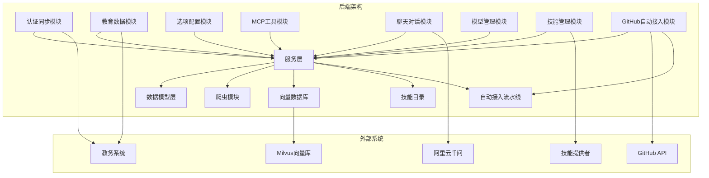
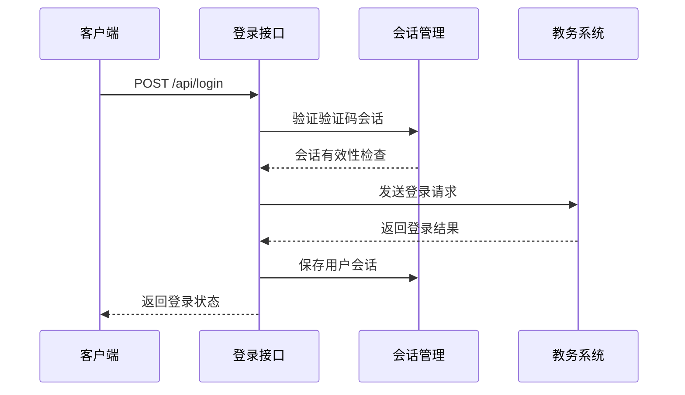
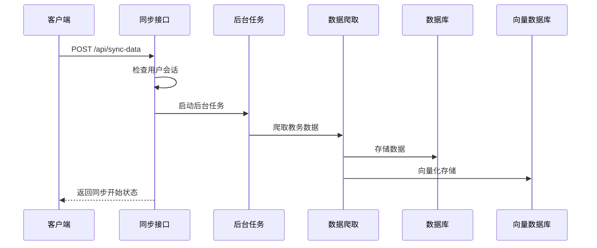
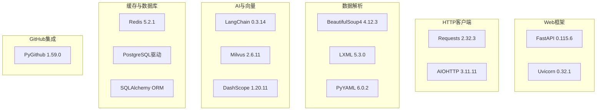
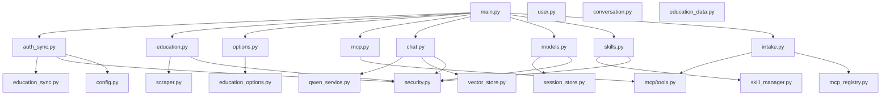

# 后端API文档

<cite>
**本文档引用的文件**
- [backend/main.py](file://backend/main.py)
- [backend/app/api/auth_sync.py](file://backend/app/api/auth_sync.py)
- [backend/app/api/education.py](file://backend/app/api/education.py)
- [backend/app/api/options.py](file://backend/app/api/options.py)
- [backend/app/api/mcp.py](file://backend/app/api/mcp.py)
- [backend/app/api/chat.py](file://backend/app/api/chat.py)
- [backend/app/api/models.py](file://backend/app/api/models.py)
- [backend/app/api/skills.py](file://backend/app/api/skills.py)
- [backend/app/api/intake.py](file://backend/app/api/intake.py)
- [backend/scraper.py](file://backend/scraper.py)
- [backend/education_options.py](file://backend/education_options.py)
- [backend/app/models/user.py](file://backend/app/models/user.py)
- [backend/app/models/conversation.py](file://backend/app/models/conversation.py)
- [backend/app/models/education_data.py](file://backend/app/models/education_data.py)
- [backend/app/models/base.py](file://backend/app/models/base.py)
- [backend/app/services/vector_store.py](file://backend/app/services/vector_store.py)
- [backend/app/services/education_sync.py](file://backend/app/services/education_sync.py)
- [backend/app/services/qwen_service.py](file://backend/app/services/qwen_service.py)
- [backend/app/services/session_store.py](file://backend/app/services/session_store.py)
- [backend/app/services/skill_manager.py](file://backend/app/services/skill_manager.py)
- [backend/app/services/mcp_registry.py](file://backend/app/services/mcp_registry.py)
- [backend/app/core/config.py](file://backend/app/core/config.py)
- [backend/app/security.py](file://backend/app/security.py)
- [backend/requirements.txt](file://backend/requirements.txt)
- [README.md](file://README.md)
- [scripts/github_autopilot.py](file://scripts/github_autopilot.py)
- [scripts/generate_mcp_external_tools.py](file://scripts/generate_mcp_external_tools.py)
- [scripts/enrich_mcp_external_tools.py](file://scripts/enrich_mcp_external_tools.py)
- [scripts/probe_mcp_external_tools.py](file://scripts/probe_mcp_external_tools.py)
</cite>

## 更新摘要
**变更内容**
- 新增GitHub Intake（自动接入）API模块，提供完整的流水线管理功能
- 新增一键全自动流水线API端点：`/api/intake/pipeline`
- 新增流水线历史记录查询API端点：`/api/intake/pipeline/history`、`/api/intake/pipeline/latest`
- 新增MCP工具生成、探测、丰富化等辅助API端点
- 新增GitHub自动搜索和报告生成功能
- 更新架构图以反映新增的自动接入流水线功能

## 目录
1. [简介](#简介)
2. [项目结构](#项目结构)
3. [核心组件](#核心组件)
4. [架构概览](#架构概览)
5. [详细组件分析](#详细组件分析)
6. [依赖分析](#依赖分析)
7. [性能考虑](#性能考虑)
8. [故障排除指南](#故障排除指南)
9. [结论](#结论)
10. [附录](#附录)

## 简介
本项目是一个基于FastAPI的智能教务系统AI助手后端API，经过重大模块化重构后，提供验证码获取、用户登录、健康检查、AI对话、教务数据查询、数据同步、MCP工具调用、模型管理、技能管理、GitHub自动接入流水线等RESTful接口。系统采用前后端分离架构，后端使用Python 3.8+和FastAPI框架，前端使用Next.js 16，支持验证码登录、数据爬取、AI问答、数据同步、模型偏好设置、自定义技能管理、GitHub仓库自动搜索和MCP工具接入等功能。

## 项目结构
后端项目采用高度模块化的架构设计，主要包含以下核心模块：
- **认证同步模块**：处理验证码获取、用户登录、数据同步状态管理
- **教育数据模块**：提供全面的教务数据查询功能
- **选项配置模块**：提供各种筛选选项和配置查询
- **MCP工具模块**：通过HTTP提供MCP工具调用接口
- **聊天对话模块**：支持AI对话和流式对话功能
- **模型管理模块**：提供用户模型偏好设置和可用模型查询
- **技能管理模块**：支持用户自定义技能的上传、启用/禁用、删除
- **GitHub自动接入模块**：提供完整的仓库搜索、报告生成、MCP工具接入流水线
- **业务逻辑层**：实现具体的业务功能
- **数据模型层**：定义数据库实体和关系
- **服务层**：封装外部服务集成
- **爬虫模块**：负责教务系统数据抓取



**图表来源**
- [backend/main.py:35-39](file://backend/main.py#L35-L39)
- [backend/app/api/auth_sync.py:19](file://backend/app/api/auth_sync.py#L19)
- [backend/app/api/education.py:12](file://backend/app/api/education.py#L12)
- [backend/app/api/options.py:17](file://backend/app/api/options.py#L17)
- [backend/app/api/mcp.py:13](file://backend/app/api/mcp.py#L13)
- [backend/app/api/chat.py:21](file://backend/app/api/chat.py#L21)
- [backend/app/api/models.py:14](file://backend/app/api/models.py#L14)
- [backend/app/api/skills.py:11](file://backend/app/api/skills.py#L11)
- [backend/app/api/intake.py:17](file://backend/app/api/intake.py#L17)

**章节来源**
- [backend/main.py:35-39](file://backend/main.py#L35-L39)
- [README.md:25-41](file://README.md#L25-L41)

## 核心组件
系统的核心组件包括：

### 1. FastAPI应用实例
- 应用名称：教务系统 AI 助手 API
- 版本：1.0.0
- 支持CORS跨域访问
- 集成健康检查端点

### 2. 模块化路由系统
- **认证同步路由**：`/api/captcha`, `/api/login`, `/api/sync-status`, `/api/sync-data`
- **教育数据路由**：`/api/user/info`, `/api/grades`, `/api/schedule`, `/api/training-plan/my`, `/api/academic-progress`, `/api/exam-schedule`, `/api/teacher/search`, `/api/course/search`, `/api/course-selection`, `/api/execution-plan`, `/api/all-data`
- **选项配置路由**：`/api/options/departments`, `/api/options/semesters`, `/api/options/current-semester`, `/api/options/course`, `/api/options/schedule`, `/api/options/grade`, `/api/options/all`
- **MCP工具路由**：`/api/mcp/tools`, `/api/mcp/tools/{tool_name}`, `/api/mcp/tools/{tool_name}/schema`
- **聊天对话路由**：`/api/chat/send`, `/api/chat/conversations/{username}`, `/api/chat/history/{conversation_id}`, `/api/chat/conversations/{conversation_id}`, `/api/chat/send-stream`
- **模型管理路由**：`/api/models/available`, `/api/models/preference/{username}`, `/api/models/preference`
- **技能管理路由**：`/api/skills/{username}`, `/api/skills/upload`, `/api/skills/{skill_name}/enable`, `/api/skills/{skill_name}`
- **GitHub自动接入路由**：`/api/intake/run`, `/api/intake/report`, `/api/intake/generate-mcp-tools`, `/api/intake/probe-mcp-tools`, `/api/intake/enrich-mcp-tools`, `/api/intake/pipeline`, `/api/intake/pipeline/history`, `/api/intake/pipeline/latest`

### 3. 教务系统集成
- 支持外网和内网服务器
- 自动服务器选择算法
- 验证码与登录一致性保证

### 4. AI对话系统
- 基于LangChain的RAG架构
- 向量数据库Milvus集成
- 支持对话历史管理
- 支持流式对话响应

### 5. 数据同步系统
- 支持自动和手动数据同步
- 后台任务异步处理
- 数据同步状态跟踪

### 6. 模型管理功能
- 支持多种AI模型提供商（Qwen、LiteLLM）
- 用户模型偏好设置持久化
- 可用模型列表动态查询

### 7. 技能管理系统
- YAML声明式技能定义
- 用户隔离的技能存储
- 技能启用/禁用控制
- 技能生命周期管理

### 8. GitHub自动接入流水线
- **仓库搜索**：基于项目需求自动搜索GitHub高星仓库
- **报告生成**：生成可融入路径建议报告
- **MCP工具生成**：自动生成MCP外部工具模板
- **工具探测**：检测MCP工具可达性和可用性
- **工具丰富化**：从仓库提取端点线索并回填URL
- **流水线管理**：一键执行完整的自动接入流程

**章节来源**
- [backend/main.py:35-39](file://backend/main.py#L35-L39)
- [backend/app/api/auth_sync.py:19](file://backend/app/api/auth_sync.py#L19)
- [backend/app/api/education.py:12](file://backend/app/api/education.py#L12)
- [backend/app/api/options.py:17](file://backend/app/api/options.py#L17)
- [backend/app/api/mcp.py:13](file://backend/app/api/mcp.py#L13)
- [backend/app/api/chat.py:21](file://backend/app/api/chat.py#L21)
- [backend/app/api/models.py:14](file://backend/app/api/models.py#L14)
- [backend/app/api/skills.py:11](file://backend/app/api/skills.py#L11)
- [backend/app/api/intake.py:17](file://backend/app/api/intake.py#L17)

## 架构概览
系统采用分层架构设计，确保关注点分离和代码可维护性。经过模块化重构后，各个功能模块职责更加明确，新增的GitHub自动接入模块提供了完整的仓库搜索和MCP工具接入流水线。

```mermaid
graph TB
subgraph "表现层"
Frontend[前端应用]
MCPClient[MCP客户端]
Agent[AI代理]
Settings[设置页面]
SkillsPage[技能管理页面]
IntakeUI[自动接入界面]
end
subgraph "API层"
Auth[认证相关]
Data[数据查询]
Options[选项查询]
Chat[AI对话]
MCP[MCP工具]
Sync[数据同步]
Models[模型管理]
Skills[技能管理]
Intake[GitHub自动接入]
end
subgraph "业务逻辑层"
Login[登录验证]
Crawler[数据爬取]
RAG[RAG处理]
SyncTask[同步任务]
Tools[MCP工具]
ModelPref[模型偏好]
SkillMgr[技能管理]
Autopilot[自动接入]
End
subgraph "数据层"
Session[会话存储]
VectorDB[向量数据库]
PostgreSQL[PostgreSQL]
SkillStorage[技能存储]
AutopilotStorage[自动接入存储]
end
subgraph "外部服务"
EduSys[教务系统]
Milvus[向量库]
DashScope[阿里云千问]
SkillProvider[技能提供者]
GitHub[GitHub API]
end
Frontend --> Auth
Frontend --> Data
Frontend --> Options
Frontend --> Chat
Frontend --> Sync
Frontend --> Models
Frontend --> Skills
Frontend --> Intake
Settings --> Models
SkillsPage --> Skills
IntakeUI --> Intake
Auth --> Login
Data --> Crawler
Options --> Tools
Chat --> RAG
Sync --> SyncTask
Models --> ModelPref
Skills --> SkillMgr
Intake --> Autopilot
Login --> EduSys
Crawler --> EduSys
RAG --> VectorDB
RAG --> DashScope
ModelPref --> Session
SkillMgr --> SkillStorage
Autopilot --> GitHub
Autopilot --> AutopilotStorage
VectorDB --> Milvus
PostgreSQL --> Session
SkillStorage --> SkillProvider
```

**图表来源**
- [backend/main.py:95-123](file://backend/main.py#L95-L123)
- [backend/app/api/chat.py:45-153](file://backend/app/api/chat.py#L45-L153)
- [backend/app/api/models.py:23-79](file://backend/app/api/models.py#L23-L79)
- [backend/app/api/skills.py:28-70](file://backend/app/api/skills.py#L28-L70)
- [backend/app/api/intake.py:181-275](file://backend/app/api/intake.py#L181-L275)

## 详细组件分析

### 认证同步模块

#### 验证码获取接口
提供验证码图片获取和会话管理功能。

##### 接口定义
- **HTTP方法**: GET
- **URL路径**: `/api/captcha`
- **参数**: `username` (可选)
- **功能**: 获取验证码图片并返回会话ID

##### 请求参数
| 参数名 | 类型 | 必填 | 描述 |
|--------|------|------|------|
| username | string | 否 | 用于服务器选择的学号 |

##### 响应格式
```json
{
  "success": true,
  "image": "data:image/jpeg;base64,...",
  "captcha_session_id": "captcha_1712345678_3"
}
```

##### 服务器选择逻辑
系统根据学号自动选择服务器，确保验证码和登录使用同一服务器实例。

**章节来源**
- [backend/app/api/auth_sync.py:30-68](file://backend/app/api/auth_sync.py#L30-L68)

#### 用户登录接口
实现教务系统登录验证功能。

##### 接口定义
- **HTTP方法**: POST
- **URL路径**: `/api/login`
- **请求体**: JSON格式

##### 请求体结构
```json
{
  "username": "24251102121",
  "password": "your_password",
  "code": "ABCD",
  "captcha_session_id": "captcha_1712345678_3"
}
```

##### 响应格式
成功登录响应：
```json
{
  "success": true,
  "message": "登录成功",
  "username": "24251102121",
  "session_id": "JSESSIONID_value",
  "sync_status": "completed",
  "sync_message": "已加载历史数据"
}
```

失败登录响应：
```json
{
  "success": false,
  "message": "用户名、密码或验证码错误"
}
```

##### 登录流程


**图表来源**
- [backend/app/api/auth_sync.py:70-208](file://backend/app/api/auth_sync.py#L70-L208)

**章节来源**
- [backend/app/api/auth_sync.py:70-208](file://backend/app/api/auth_sync.py#L70-L208)

#### 数据同步接口组

##### 同步状态查询
- **HTTP方法**: GET
- **URL路径**: `/api/sync-status`
- **参数**: `username`
- **功能**: 查询数据同步状态

##### 手动触发数据同步
- **HTTP方法**: POST
- **URL路径**: `/api/sync-data`
- **参数**: `username`
- **功能**: 手动触发数据同步更新

##### 同步流程


**图表来源**
- [backend/app/api/auth_sync.py:210-236](file://backend/app/api/auth_sync.py#L210-L236)

**章节来源**
- [backend/app/api/auth_sync.py:210-236](file://backend/app/api/auth_sync.py#L210-L236)

### 教育数据模块

#### 个人信息查询
- **HTTP方法**: GET
- **URL路径**: `/api/user/info`
- **参数**: `username`

#### 学籍卡片查询
- **HTTP方法**: GET
- **URL路径**: `/api/user/card`
- **参数**: `username`

#### 成绩查询
- **HTTP方法**: GET
- **URL路径**: `/api/grades`
- **参数**: `username`, `kksj`, `kcxz`, `kcmc`, `fxkc`, `xsfs`

#### 所有成绩查询
- **HTTP方法**: GET
- **URL路径**: `/api/grades/all`
- **参数**: `username`

#### 课表查询
- **HTTP方法**: GET
- **URL路径**: `/api/schedule`
- **参数**: `username`, `semester`, `week`

#### 培养方案查询
- **HTTP方法**: GET
- **URL路径**: `/api/training-plan/my`
- **参数**: `username`

#### 学业进度查询
- **HTTP方法**: GET
- **URL路径**: `/api/academic-progress`
- **参数**: `username`, `study_type`

#### 考试安排查询
- **HTTP方法**: GET
- **URL路径**: `/api/exam-schedule`
- **参数**: `username`, `semester`

#### 教师查询
- **HTTP方法**: GET
- **URL路径**: `/api/teacher/search`
- **参数**: `name`, `department`

#### 课程查询
- **HTTP方法**: GET
- **URL路径**: `/api/course/search`
- **参数**: `course_name`, `course_code`, `department`

#### 选课信息查询
- **HTTP方法**: GET
- **URL路径**: `/api/course-selection`
- **参数**: `username`

#### 执行计划查询
- **HTTP方法**: GET
- **URL路径**: `/api/execution-plan`
- **参数**: `username`

#### 全部数据查询
- **HTTP方法**: GET
- **URL路径**: `/api/all-data`
- **参数**: `username`

**章节来源**
- [backend/app/api/education.py:15-239](file://backend/app/api/education.py#L15-L239)

### 选项配置模块

#### 院系查询
- **HTTP方法**: GET
- **URL路径**: `/api/options/departments`
- **参数**: `keyword`, `include_admin`, `include_vocational`

#### 学期查询
- **HTTP方法**: GET
- **URL路径**: `/api/options/semesters`
- **参数**: `include_past`, `include_future`

#### 当前学期
- **HTTP方法**: GET
- **URL路径**: `/api/options/current-semester`

#### 课程选项
- **HTTP方法**: GET
- **URL路径**: `/api/options/course`

#### 课表选项
- **HTTP方法**: GET
- **URL路径**: `/api/options/schedule`

#### 成绩选项
- **HTTP方法**: GET
- **URL路径**: `/api/options/grade`

#### 所有选项
- **HTTP方法**: GET
- **URL路径**: `/api/options/all`

**章节来源**
- [backend/app/api/options.py:20-85](file://backend/app/api/options.py#L20-L85)

### MCP工具模块

#### 工具列表
- **HTTP方法**: GET
- **URL路径**: `/api/mcp/tools`

#### 工具调用
- **HTTP方法**: POST
- **URL路径**: `/api/mcp/tools/{tool_name}`
- **请求体**: `MCPToolRequest`模型

#### 工具Schema
- **HTTP方法**: GET
- **URL路径**: `/api/mcp/tools/{tool_name}/schema`

**章节来源**
- [backend/app/api/mcp.py:41-195](file://backend/app/api/mcp.py#L41-L195)

### 聊天对话模块

#### 发送消息
- **HTTP方法**: POST
- **URL路径**: `/api/chat/send`
- **请求体**: `ChatRequest`模型

#### 获取对话列表
- **HTTP方法**: GET
- **URL路径**: `/api/chat/conversations/{username}`

#### 获取对话历史
- **HTTP方法**: GET
- **URL路径**: `/api/chat/history/{conversation_id}`

#### 删除对话
- **HTTP方法**: DELETE
- **URL路径**: `/api/chat/conversations/{conversation_id}`

#### 流式发送消息
- **HTTP方法**: POST
- **URL路径**: `/api/chat/send-stream`
- **请求体**: `ChatRequest`模型

**章节来源**
- [backend/app/api/chat.py:52-499](file://backend/app/api/chat.py#L52-L499)

### 模型管理模块

#### 可用模型查询
- **HTTP方法**: GET
- **URL路径**: `/api/models/available`
- **功能**: 获取所有可用的AI模型提供商和模型列表

##### 响应格式
```json
{
  "success": true,
  "providers": [
    {
      "provider": "qwen",
      "models": ["qwen-plus", "qwen-max", "qwen-turbo"],
      "default_model": "qwen-plus"
    },
    {
      "provider": "litellm",
      "models": ["gpt-4o", "claude-3-5-sonnet", "deepseek-chat", "qwen-max", "ollama/llama3"],
      "default_model": "qwen-plus"
    }
  ],
  "active": {
    "provider": "qwen",
    "model": "qwen-plus"
  }
}
```

#### 用户模型偏好查询
- **HTTP方法**: GET
- **URL路径**: `/api/models/preference/{username}`
- **功能**: 获取指定用户的模型偏好设置

##### 响应格式
```json
{
  "success": true,
  "provider": "qwen",
  "model": "qwen-plus"
}
```

#### 设置用户模型偏好
- **HTTP方法**: POST
- **URL路径**: `/api/models/preference`
- **请求体**: `ModelPreferenceRequest`模型

##### 请求体结构
```json
{
  "username": "24251102121",
  "provider": "qwen",
  "model": "qwen-plus"
}
```

##### 响应格式
```json
{
  "success": true,
  "provider": "qwen",
  "model": "qwen-plus"
}
```

**章节来源**
- [backend/app/api/models.py:23-79](file://backend/app/api/models.py#L23-L79)

### 技能管理模块

#### 技能列表查询
- **HTTP方法**: GET
- **URL路径**: `/api/skills/{username}`
- **功能**: 获取指定用户的所有技能列表

##### 响应格式
```json
{
  "success": true,
  "skills": [
    {
      "name": "sample_schedule_skill",
      "version": "1.0.0",
      "description": "示例课表技能",
      "enabled": true,
      "triggers": ["课表", "课程安排"],
      "tools": [
        {
          "name": "query_schedule",
          "description": "查询课程表"
        }
      ],
      "updated_at": 1712345678
    }
  ]
}
```

#### 技能上传
- **HTTP方法**: POST
- **URL路径**: `/api/skills/upload`
- **请求体**: `SkillUploadRequest`模型

##### 请求体结构
```json
{
  "username": "24251102121",
  "yaml_content": "name: sample_skill\nversion: 1.0.0\ndescription: 示例技能\ntools:\n  - name: query_schedule\n    description: 查询课表\nenabled: true\n"
}
```

##### 响应格式
```json
{
  "success": true,
  "skill": {
    "owner": "24251102121",
    "name": "sample_skill",
    "path": "skills/24251102121/sample_skill.yaml"
  }
}
```

#### 技能启用/禁用
- **HTTP方法**: POST
- **URL路径**: `/api/skills/{skill_name}/enable`
- **请求体**: `SkillToggleRequest`模型

##### 请求体结构
```json
{
  "username": "24251102121",
  "enabled": true
}
```

##### 响应格式
```json
{
  "success": true,
  "skill": {
    "name": "sample_skill",
    "enabled": true
  }
}
```

#### 技能删除
- **HTTP方法**: DELETE
- **URL路径**: `/api/skills/{skill_name}`
- **请求体**: `SkillDeleteRequest`模型

##### 请求体结构
```json
{
  "username": "24251102121"
}
```

##### 响应格式
```json
{
  "success": true
}
```

**章节来源**
- [backend/app/api/skills.py:28-70](file://backend/app/api/skills.py#L28-L70)

### GitHub自动接入模块

#### 自动搜索和报告生成
- **HTTP方法**: POST
- **URL路径**: `/api/intake/run`
- **请求体**: `IntakeRunRequest`模型

##### 请求体结构
```json
{
  "per_topic": 6,
  "clone_top": 2,
  "integrate_top": 8,
  "no_clone": true,
  "update_repo_list": true
}
```

##### 响应格式
```json
{
  "success": true,
  "stdout": "搜索完成，生成报告...",
  "report_json": "docs/github-intake/autopilot-report.json",
  "report_md": "docs/github-intake/autopilot-report.md"
}
```

#### 获取报告
- **HTTP方法**: GET
- **URL路径**: `/api/intake/report`

##### 响应格式
```json
{
  "success": true,
  "report": {
    "integration_recommendations": [
      {
        "repo": "example/repo",
        "topic": "mcp",
        "score": 0.95,
        "reason": "符合MCP协议标准"
      }
    ]
  }
}
```

#### 生成MCP工具模板
- **HTTP方法**: POST
- **URL路径**: `/api/intake/generate-mcp-tools`

##### 响应格式
```json
{
  "success": true,
  "stdout": "生成MCP工具模板完成",
  "generated_file": "backend/app/mcp/external_tools.generated.json"
}
```

#### 探测MCP工具
- **HTTP方法**: POST
- **URL路径**: `/api/intake/probe-mcp-tools`
- **参数**: `auto_enable` (可选)

##### 响应格式
```json
{
  "success": true,
  "summary": "探测完成，发现可用工具数量：5"
}
```

#### 丰富化MCP工具
- **HTTP方法**: POST
- **URL路径**: `/api/intake/enrich-mcp-tools`

##### 响应格式
```json
{
  "success": true,
  "summary": "丰富化完成，更新工具数量：3"
}
```

#### 一键全自动流水线
- **HTTP方法**: POST
- **URL路径**: `/api/intake/pipeline`
- **请求体**: `IntakePipelineRequest`模型

##### 请求体结构
```json
{
  "per_topic": 6,
  "clone_top": 2,
  "integrate_top": 8,
  "no_clone": true,
  "update_repo_list": true,
  "auto_enable": false
}
```

##### 响应格式
```json
{
  "success": true,
  "started_at": "2024-01-01T12:00:00",
  "duration_ms": 12000,
  "steps": {
    "run": "搜索完成",
    "generate": "模板生成完成",
    "enrich": "丰富化完成",
    "probe": "探测完成",
    "reload_count": 15,
    "timing_ms": {
      "run": 2000,
      "generate": 1500,
      "enrich": 1800,
      "probe": 1200
    }
  },
  "paths": {
    "report_json": "docs/github-intake/autopilot-report.json",
    "generated_tools": "backend/app/mcp/external_tools.generated.json"
  }
}
```

#### 流水线历史记录
- **HTTP方法**: GET
- **URL路径**: `/api/intake/pipeline/history`
- **参数**: `limit` (默认20)

##### 响应格式
```json
{
  "success": true,
  "count": 5,
  "items": [
    {
      "started_at": "2024-01-01T12:00:00",
      "duration_ms": 12000,
      "params": {
        "per_topic": 6,
        "clone_top": 2,
        "integrate_top": 8,
        "no_clone": true,
        "update_repo_list": true
      },
      "reload_count": 15,
      "timing_ms": {
        "run": 2000,
        "generate": 1500,
        "enrich": 1800,
        "probe": 1200
      },
      "success": true
    }
  ]
}
```

#### 最新流水线记录
- **HTTP方法**: GET
- **URL路径**: `/api/intake/pipeline/latest`

##### 响应格式
```json
{
  "success": true,
  "item": {
    "started_at": "2024-01-01T12:00:00",
    "duration_ms": 12000,
    "params": {
      "per_topic": 6,
      "clone_top": 2,
      "integrate_top": 8,
      "no_clone": true,
      "update_repo_list": true
    },
    "reload_count": 15,
    "timing_ms": {
      "run": 2000,
      "generate": 1500,
      "enrich": 1800,
      "probe": 1200
    },
    "success": true
  }
}
```

**章节来源**
- [backend/app/api/intake.py:20-291](file://backend/app/api/intake.py#L20-L291)

### 健康检查接口
提供系统健康状态检查功能。

#### 接口定义
- **HTTP方法**: GET
- **URL路径**: `/api/health`
- **响应**: 简单的健康状态信息

#### 响应格式
```json
{
  "status": "ok"
}
```

**章节来源**
- [backend/main.py:71-73](file://backend/main.py#L71-L73)

## 依赖分析

### 外部依赖
系统使用的主要第三方库包括：



**图表来源**
- [backend/requirements.txt:1-44](file://backend/requirements.txt#L1-L44)

### 内部模块依赖


**图表来源**
- [backend/main.py:12-14](file://backend/main.py#L12-L14)
- [backend/app/api/chat.py:15-18](file://backend/app/api/chat.py#L15-L18)

**章节来源**
- [backend/requirements.txt:1-44](file://backend/requirements.txt#L1-L44)

## 性能考虑
系统在设计时考虑了以下性能优化策略：

### 1. 服务器负载均衡
- 支持14个内网服务器实例
- 基于学号的哈希算法分配
- 自动故障转移机制

### 2. 会话管理优化
- 内存会话存储（生产环境建议Redis）
- 验证码会话超时管理
- 会话清理机制
- **新增**：模型偏好设置的持久化存储

### 3. 数据缓存策略
- Redis缓存（待实现）
- 向量数据库索引优化
- 前端数据缓存
- **新增**：技能文件的本地存储
- **新增**：GitHub搜索结果的缓存机制

### 4. 并发处理
- 异步请求处理
- 连接池管理
- 超时控制
- **新增**：流水线执行的超时控制

### 5. 数据同步优化
- 后台任务异步处理
- 数据同步状态跟踪
- 避免重复同步

### 6. 模型管理优化
- **新增**：模型偏好设置的快速读取
- **新增**：可用模型列表的静态配置

### 7. 技能管理优化
- **新增**：YAML文件的快速解析
- **新增**：技能文件的用户隔离存储

### 8. GitHub自动接入优化
- **新增**：GitHub API请求的速率限制
- **新增**：搜索结果的本地缓存
- **新增**：流水线执行的并发控制
- **新增**：脚本执行的超时管理

## 故障排除指南

### 常见问题及解决方案

#### 1. 验证码获取失败
**症状**: 验证码接口返回错误
**可能原因**:
- 教务系统服务器不可达
- 网络连接问题
- 服务器IP地址变更

**解决步骤**:
1. 检查服务器列表配置
2. 验证网络连通性
3. 更新服务器IP地址

#### 2. 登录失败
**症状**: 登录接口返回失败信息
**可能原因**:
- 用户名或密码错误
- 验证码过期
- 服务器选择错误

**解决步骤**:
1. 重新获取验证码
2. 检查学号格式
3. 验证密码正确性

#### 3. 数据同步失败
**症状**: 数据同步接口返回失败
**可能原因**:
- 用户未登录
- 正在进行同步操作
- 教务系统访问失败

**解决步骤**:
1. 确认用户已登录
2. 检查同步状态
3. 重试同步操作

#### 4. AI对话异常
**症状**: AI对话接口返回错误
**可能原因**:
- 向量数据库连接失败
- LLM服务不可用
- 数据库连接问题

**解决步骤**:
1. 检查Milvus连接
2. 验证API密钥
3. 重启相关服务

#### 5. 模型偏好设置失败
**症状**: 模型管理接口返回错误
**可能原因**:
- 用户名隔离验证失败
- 模型提供商不支持
- 会话存储不可用

**解决步骤**:
1. 确认用户名与会话匹配
2. 检查模型提供商配置
3. 验证会话存储服务

#### 6. 技能管理异常
**症状**: 技能管理接口返回错误
**可能原因**:
- YAML格式不正确
- 技能文件不存在
- 文件权限问题

**解决步骤**:
1. 验证YAML格式
2. 检查技能文件路径
3. 确认文件写入权限

#### 7. GitHub自动接入失败
**症状**: 自动接入流水线返回错误
**可能原因**:
- GitHub API密钥无效
- 网络连接问题
- 脚本执行超时
- 权限不足

**解决步骤**:
1. 检查GITHUB_TOKEN环境变量
2. 验证网络连通性
3. 检查脚本文件权限
4. 增加超时时间设置
5. 查看详细错误日志

#### 8. 流水线历史记录为空
**症状**: 历史记录查询返回空数据
**可能原因**:
- 流水线从未执行过
- 历史文件被清理
- 文件权限问题

**解决步骤**:
1. 确认流水线已执行
2. 检查历史文件存在性
3. 验证文件读取权限

**章节来源**
- [README.md:200-216](file://README.md#L200-L216)

## 结论
本后端API文档详细介绍了智能教务系统AI助手经过重大模块化重构后的RESTful接口设计。系统现已分为认证同步、教育数据、选项配置、MCP工具、聊天对话、模型管理、技能管理、GitHub自动接入八大模块，每个模块职责明确，便于维护和扩展。

### 主要改进
1. **模块化架构**：各功能模块独立开发和维护
2. **增强的API覆盖**：新增MCP工具、聊天对话、模型管理、技能管理功能
3. **全新的GitHub自动接入模块**：提供完整的仓库搜索、报告生成、MCP工具接入流水线
4. **更好的安全性**：严格的用户名隔离机制
5. **完善的错误处理**：统一的HTTP异常处理
6. **支持流式响应**：聊天接口支持实时流式对话
7. **新增AI模型管理**：支持多种AI模型提供商的偏好设置
8. **新增技能管理**：支持用户自定义技能的声明式管理
9. **新增流水线管理**：支持一键执行完整的自动接入流程
10. **新增历史记录追踪**：记录流水线执行状态和性能指标

### 建议的后续改进
- 部署Redis作为会话存储
- 实现完整的错误处理和重试机制
- 添加API限流和安全防护
- 完善单元测试和集成测试
- 优化向量数据库性能
- 增加API文档的自动化生成
- **新增**：模型偏好设置的数据库持久化
- **新增**：技能管理的数据库支持
- **新增**：GitHub搜索结果的缓存机制
- **新增**：流水线执行的监控和告警

## 附录

### API版本管理
- 当前版本: 1.0.0
- 版本命名: 主版本.次版本.修订号
- 兼容性: 向后兼容

### 速率限制
- 验证码获取: 10次/分钟
- 登录尝试: 5次/小时
- 数据查询: 100次/小时
- AI对话: 50次/小时
- 数据同步: 10次/小时
- **新增**：GitHub自动接入: 5次/小时
- **新增**：流水线执行: 2次/小时
- **新增**：模型偏好设置: 1000次/小时
- **新增**：技能管理: 500次/小时

### 安全考虑
- CORS配置仅允许特定源
- 敏感信息加密存储
- API密钥管理
- 输入验证和过滤
- 会话超时管理
- 用户名隔离机制
- **新增**：GitHub API密钥的安全存储
- **新增**：流水线执行的权限控制
- **新增**：模型偏好设置的安全验证
- **新增**：技能文件的格式验证

### 环境变量配置
- DATABASE_URL: PostgreSQL连接字符串
- REDIS_HOST: Redis服务器地址
- MILVUS_HOST: Milvus服务器地址
- DASHSCOPE_API_KEY: 阿里云API密钥
- GITHUB_TOKEN: GitHub API访问令牌
- BACKEND_PORT: 服务端口
- **新增**：MODEL_PROVIDER: 默认AI模型提供商
- **新增**：QWEN_MODEL: Qwen默认模型
- **新增**：LITELVM_MODEL: LiteLLM默认模型

### 数据同步状态说明
- `none`: 未开始同步
- `syncing`: 同步中
- `completed`: 同步完成
- `failed`: 同步失败

### 模型提供商支持
- **Qwen**: 阿里云通义千问系列模型
  - 支持模型: qwen-plus, qwen-max, qwen-turbo
  - 默认模型: qwen-plus
- **LiteLLM**: 第三方模型聚合服务
  - 支持模型: gpt-4o, claude-3-5-sonnet, deepseek-chat, qwen-max, ollama/llama3
  - 默认模型: qwen-plus

### 技能管理规范
- **必需字段**: name, version, description, tools
- **文件结构**: `skills/<username>/<skill_name>.yaml`
- **技能格式**: YAML声明式配置
- **启用状态**: 默认启用，可通过API切换

### GitHub自动接入规范
- **仓库搜索**: 基于项目需求文档自动搜索相关仓库
- **报告生成**: 生成可融入路径建议报告
- **MCP工具生成**: 自动生成外部工具模板
- **工具探测**: 检测工具可达性和可用性
- **工具丰富化**: 从仓库提取端点线索并回填URL
- **流水线执行**: 一键执行完整的自动接入流程
- **历史记录**: 记录流水线执行状态和性能指标

### 流水线执行步骤
1. **仓库搜索**: `github_autopilot.py` - 搜索GitHub高星仓库
2. **报告生成**: `generate_mcp_external_tools.py` - 生成MCP工具模板
3. **工具丰富化**: `enrich_mcp_external_tools.py` - 回填端点URL
4. **工具探测**: `probe_mcp_external_tools.py` - 检测工具可用性
5. **注册重载**: `reload_mcp_registry()` - 重载MCP注册表

### 错误码定义
- **404**: 资源不存在（脚本文件、报告文件、流水线记录）
- **500**: 服务器内部错误（脚本执行失败、文件读取错误）
- **504**: 网关超时（脚本执行超时、GitHub API请求超时）

**章节来源**
- [backend/main.py:87-88](file://backend/main.py#L87-L88)
- [backend/app/api/auth_sync.py:210-236](file://backend/app/api/auth_sync.py#L210-L236)
- [backend/app/api/models.py:23-79](file://backend/app/api/models.py#L23-L79)
- [backend/app/api/skills.py:28-70](file://backend/app/api/skills.py#L28-L70)
- [backend/app/api/intake.py:71-92](file://backend/app/api/intake.py#L71-L92)
- [backend/app/services/session_store.py:195-211](file://backend/app/services/session_store.py#L195-L211)
- [backend/app/services/skill_manager.py:34-45](file://backend/app/services/skill_manager.py#L34-L45)
- [backend/app/services/mcp_registry.py](file://backend/app/services/mcp_registry.py)