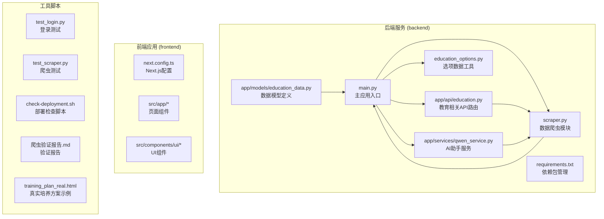
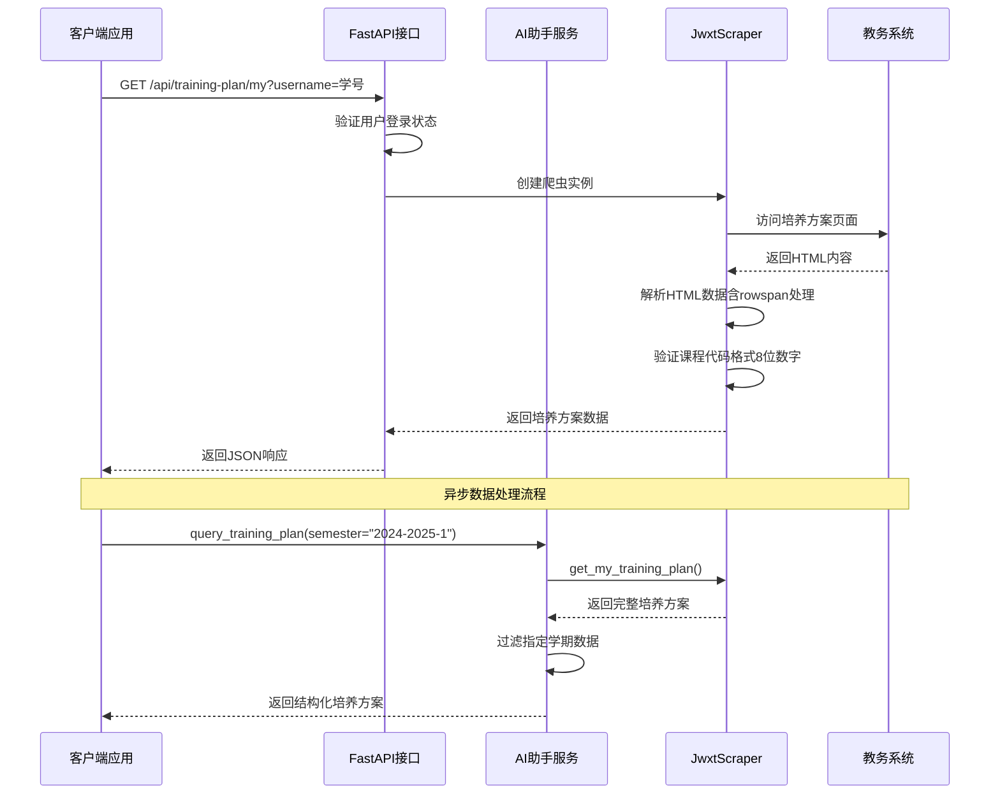
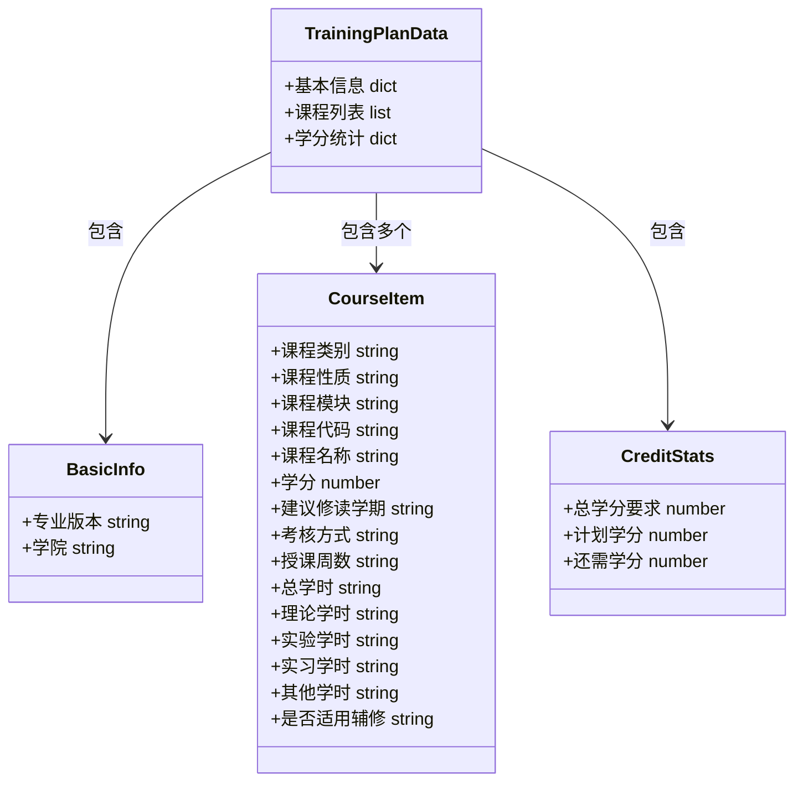
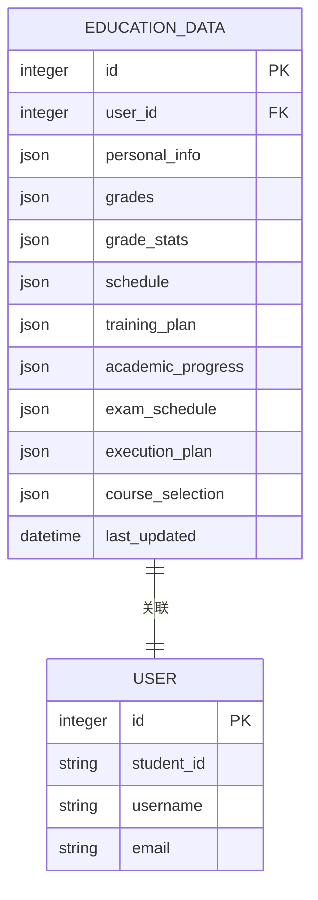
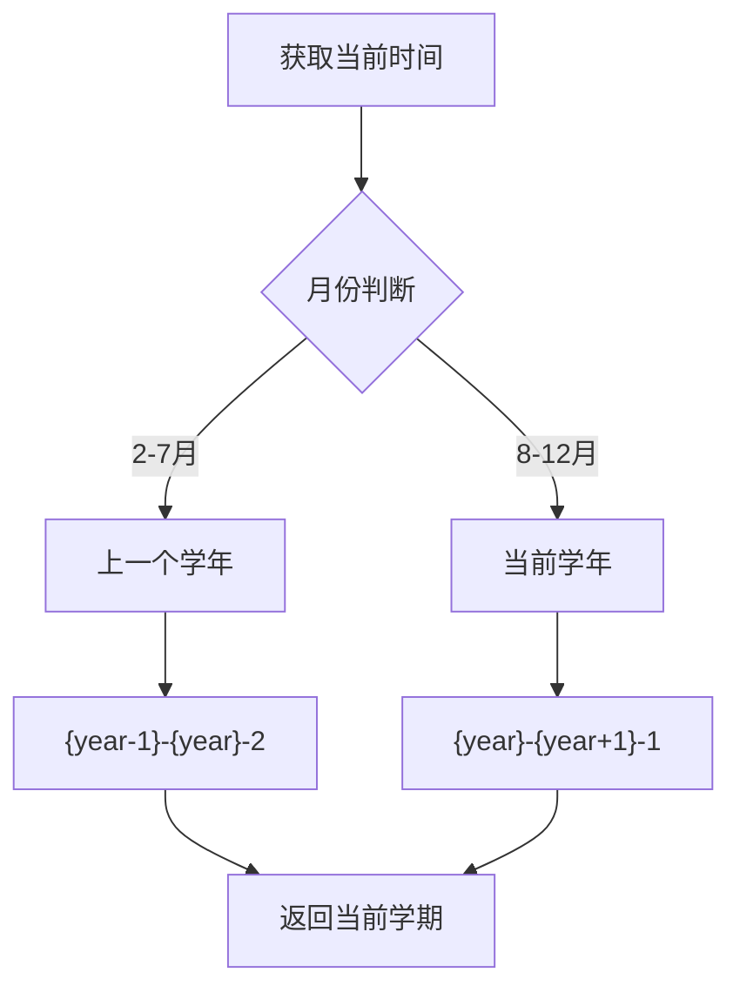
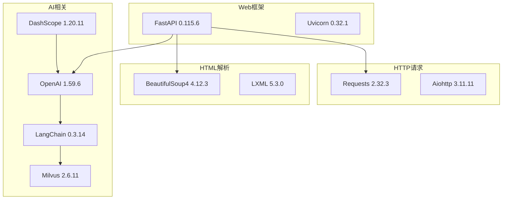
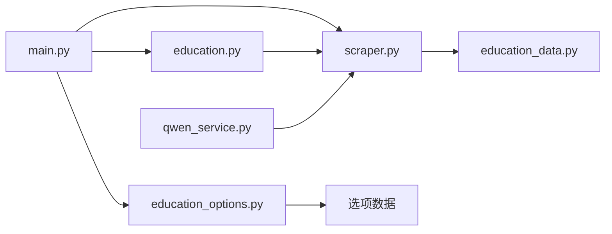
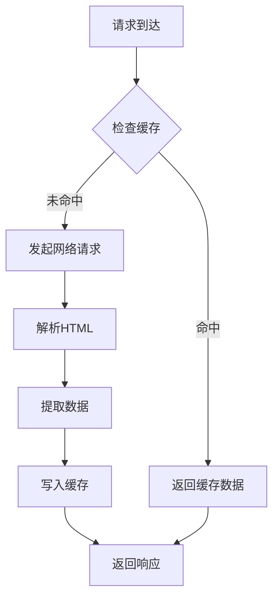

# 培养方案查询API

<cite>
**本文档引用的文件**
- [main.py](file://backend/main.py)
- [scraper.py](file://backend/scraper.py)
- [education_data.py](file://backend/app/models/education_data.py)
- [education_options.py](file://backend/education_options.py)
- [qwen_service.py](file://backend/app/services/qwen_service.py)
- [requirements.txt](file://backend/requirements.txt)
- [test_scraper.py](file://backend/test_scraper.py)
- [check-deployment.sh](file://check-deployment.sh)
- [爬虫验证报告.md](file://爬虫验证报告.md)
- [training_plan_real.html](file://training_plan_real.html)
</cite>

## 更新摘要
**所做更改**
- 新增训练计划查询工具，支持学期过滤功能
- 增强了结构化数据返回机制
- 完善了培养方案数据的学期维度支持
- 更新了AI助手的培养方案查询接口描述
- 增强了调试日志功能，包括HTML长度验证和表格分析

## 目录
1. [简介](#简介)
2. [项目结构](#项目结构)
3. [核心组件](#核心组件)
4. [架构概览](#架构概览)
5. [详细组件分析](#详细组件分析)
6. [依赖关系分析](#依赖关系分析)
7. [性能考虑](#性能考虑)
8. [故障排除指南](#故障排除指南)
9. [结论](#结论)

## 简介

培养方案查询API是教务系统AI助手的重要组成部分，专门用于查询和展示学生的培养方案信息。该API基于FastAPI框架构建，采用异步编程模式，能够实时从教务系统中抓取培养方案数据，并以标准化的JSON格式返回给客户端应用。

本API主要功能包括：
- 获取个人培养方案的完整信息
- 解析培养方案中的课程要求和学分要求
- **新增**：支持按学期进行精确筛选
- **新增**：提供结构化的数据返回格式
- 支持培养方案与实际课程安排的关联分析
- **新增**：智能处理HTML表格rowspan属性，确保课程类别、性质、模块信息的准确解析
- **新增**：增强的调试日志功能，包括URL跟踪、响应状态监控、HTML长度验证和表格分析

**更新** 本次更新重点关注新增的训练计划查询工具和学期过滤功能，显著提升了培养方案查询的灵活性和实用性

## 项目结构

该项目采用前后端分离的架构设计，后端使用Python FastAPI框架，前端使用Next.js构建。核心目录结构如下：



**图表来源**
- [main.py:1-120](file://backend/main.py#L1-L120)
- [scraper.py:1-50](file://backend/scraper.py#L1-L50)
- [qwen_service.py:1-50](file://backend/app/services/qwen_service.py#L1-L50)

**章节来源**
- [main.py:1-853](file://backend/main.py#L1-L853)
- [requirements.txt:1-48](file://backend/requirements.txt#L1-L48)

## 核心组件

### API路由层

系统提供了完整的RESTful API接口，其中培养方案查询接口位于`/api/training-plan/my`路径。该接口采用GET方法，接收用户名参数，返回标准化的JSON响应。

### AI助手查询工具

**新增** 系统现在集成了强大的AI助手查询工具，支持通过自然语言查询培养方案信息：

- **query_training_plan函数**：支持学期过滤的培养方案查询
- **参数支持**：semester（可选，如"2024-2025-1"）
- **返回格式**：结构化的培养方案数据，包含课程列表和学期分布信息

### 数据爬取层

JwxtScraper类负责与教务系统的交互，实现了多种数据抓取功能，包括培养方案、成绩、课表等。该类使用BeautifulSoup库解析HTML内容，提取所需的数据结构。

**更新** JwxtScraper类中的URL构造逻辑经过修复，确保能够正确访问培养方案查询端点

### 数据模型层

EducationData模型定义了存储培养方案数据的数据库结构，采用JSON格式存储，支持灵活的数据扩展和查询。

**章节来源**
- [main.py:694-718](file://backend/main.py#L694-L718)
- [scraper.py:687-795](file://backend/scraper.py#L687-L795)
- [education_data.py:11-47](file://backend/app/models/education_data.py#L11-L47)
- [qwen_service.py:130-141](file://backend/app/services/qwen_service.py#L130-L141)

## 架构概览

系统采用分层架构设计，确保了良好的可维护性和扩展性：



**图表来源**
- [main.py:694-718](file://backend/main.py#L694-L718)
- [scraper.py:687-795](file://backend/scraper.py#L687-L795)
- [qwen_service.py:401-417](file://backend/app/services/qwen_service.py#L401-L417)

## 详细组件分析

### 培养方案查询接口

#### 接口定义

`/api/training-plan/my` 接口提供个人培养方案查询功能，支持以下特性：

- **身份验证**：要求用户提供有效的登录会话
- **异步处理**：使用异步编程模式提高并发性能
- **错误处理**：完善的异常捕获和错误响应机制
- **数据验证**：对返回数据进行结构化验证
- **调试日志**：增强的调试信息输出，包括URL跟踪、响应状态监控、HTML长度验证和表格分析

**更新** 接口现在使用正确的URL构造逻辑，确保能够稳定访问培养方案数据

#### AI助手查询工具

**新增** query_training_plan函数提供了更灵活的查询方式：

```python
{
    "name": "query_training_plan",
    "description": "查询学生的培养方案，包括课程体系结构、各学期课程安排、学分要求、必修/选修课列表等",
    "parameters": {
        "type": "object",
        "properties": {
            "semester": {
                "type": "string",
                "description": "学期，如 2024-2025-1（可选，不指定则返回所有学期）"
            }
        },
        "required": []
    }
}
```

#### 数据结构定义

培养方案数据采用层次化的JSON结构，包含以下主要部分：



**图表来源**
- [scraper.py:721-737](file://backend/scraper.py#L721-L737)

#### 课程要求解析

培养方案中的课程要求包含多个维度的信息：

| 字段名称 | 类型 | 描述 | 示例值 |
|---------|------|------|--------|
| 课程类别 | string | 课程分类（如专业课、通识课） | "专业课" |
| 课程性质 | string | 课程属性（必修、选修） | "必修" |
| 课程模块 | string | 课程模块标识 | "核心模块" |
| 课程代码 | string | 唯一课程标识符 | "22110063" |
| 课程名称 | string | 课程正式名称 | "操作系统" |
| 学分 | number | 课程学分数 | 3 |
| 建议修读学期 | string | 推荐修读学期 | "4" |
| 考核方式 | string | 考核形式（考试、考查） | "考试" |
| **新增** | **string** | **授课周数** | **"16周"** |
| **新增** | **string** | **总学时** | **"48学时"** |
| **新增** | **string** | **理论学时** | **"32学时"** |
| **新增** | **string** | **实验学时** | **"16学时"** |
| **新增** | **string** | **实习学时** | **""** |
| **新增** | **string** | **其他学时** | **""** |
| **新增** | **string** | **是否适用辅修** | **"是"** |

#### 学分要求计算

系统自动计算学分完成情况，包括：
- 总学分要求：培养方案规定的最低学分标准
- 计划学分：当前已修读课程的学分总和
- 还需学分：总学分要求与已修学分的差额

**章节来源**
- [scraper.py:687-795](file://backend/scraper.py#L687-L795)
- [test_scraper.py:240-280](file://backend/test_scraper.py#L240-L280)

### 数据模型设计

#### EducationData模型

该模型定义了培养方案数据的存储结构：



**图表来源**
- [education_data.py:11-47](file://backend/app/models/education_data.py#L11-L47)

#### 数据更新机制

系统采用以下策略管理数据更新：

1. **时间戳跟踪**：每个数据记录包含`last_updated`字段
2. **增量更新**：仅更新发生变化的数据
3. **缓存策略**：短期缓存常用查询结果
4. **版本控制**：支持多版本培养方案的并存

**章节来源**
- [education_data.py:11-47](file://backend/app/models/education_data.py#L11-L47)

### 选项数据系统

#### 课程性质选项

系统提供了丰富的课程性质选项，支持精确的课程筛选：

| 代码 | 名称 | 描述 |
|------|------|------|
| 01 | 必修 | 必须修读的课程 |
| 02 | 选修 | 可自由选择的课程 |
| 03 | 通识必修 | 通识教育必修课程 |
| 04 | 通识选修 | 通识教育选修课程 |
| 05 | 专业必修 | 专业核心必修课程 |
| 06 | 专业选修 | 专业方向选修课程 |
| 07 | 实践环节 | 实践教学课程 |

#### 学期选项管理

系统维护完整的学期信息，支持当前学期的自动识别：



**图表来源**
- [education_options.py:196-208](file://backend/education_options.py#L196-L208)

**章节来源**
- [education_options.py:69-86](file://backend/education_options.py#L69-L86)
- [education_options.py:58-66](file://backend/education_options.py#L58-L66)

### URL构造修复详解

**更新** 本次更新重点修复了培养方案查询端点的URL构造逻辑

#### JwxtScraper类中的URL构造

在JwxtScraper类中，培养方案查询的URL构造经过了重要修复：

```python
def get_my_training_plan(self) -> Dict:
    """
    获取"我的培养方案"（当前登录学生）
     URL: /jsxsd/pyfa/pyfa_query
    返回详细的培养方案，包括学期、课程代码、课程名称、学分等
    """
    try:
        url = f"{self.base_url}pyfa/pyfa_query"
        response = self.session.get(url, timeout=10)
        # ... 解析逻辑
    except Exception as e:
        # ... 错误处理
```

#### 基础URL管理

JwxtScraper类的初始化确保了正确的基础URL设置：

```python
def __init__(self, session: requests.Session = None, base_url: str = "http://jwxt.gdufe.edu.cn"):
    self.session = session or requests.Session()
    self.base_url = base_url
    self.captcha_url = f"{base_url}/verifycode.servlet"
    self.login_url = f"{base_url}/xk/LoginToXkLdap"
```

#### API路由中的URL使用

在FastAPI路由中，正确的URL被传递给爬虫实例：

```python
@app.get("/api/training-plan/my")
async def get_my_training_plan_api(username: str):
    """
    获取我的培养方案
    """
    try:
        session, server_url = get_user_session(username)
        scraper = JwxtScraper(session, server_url)
        
        result = scraper.get_my_training_plan()
        
        # ... 返回结果
    except Exception as e:
        # ... 错误处理
```

**更新** 修复后的URL构造逻辑确保了：
- 正确的基础URL拼接
- 稳定的培养方案查询端点访问
- 与教务系统预期的URL结构匹配

**章节来源**
- [scraper.py:695-696](file://backend/scraper.py#L695-L696)
- [main.py:700-701](file://backend/main.py#L700-L701)

### 学期过滤功能详解

**新增** 系统现在支持按学期精确过滤培养方案数据

#### AI助手中的学期过滤实现

在query_training_plan函数中，实现了灵活的学期过滤机制：

```python
elif func_name == "query_training_plan":
    result = scraper.get_my_training_plan()
    if result.get("success"):
        data = result.get("data", {})
        courses = data.get("课程列表", [])
        
        # 如果指定了学期，过滤
        semester_filter = args.get("semester", "")
        if semester_filter:
            courses = [c for c in courses if c.get("学期") == semester_filter]
        
        return {
            "培养方案": courses,
            "总课程数": len(courses),
            "学期分布": list(set(c.get("学期", "") for c in courses))
        }
    return {"error": result.get("message", "查询失败")}
```

#### 支持的学期格式

系统支持的标准学期格式包括：
- `"2024-2025-1"`：表示2024-2025学年第一学期
- `"2024-2025-2"`：表示2024-2025学年第二学期
- `"2023-2024-1"`：表示2023-2024学年第一学期

#### 学期过滤的优势

- **精确查询**：可以根据具体学期获取对应的课程安排
- **灵活筛选**：支持查询特定学期的必修课、选修课
- **课程规划**：帮助学生制定个性化的学习计划
- **进度跟踪**：便于跟踪不同学期的学习进展

**章节来源**
- [qwen_service.py:407-417](file://backend/app/services/qwen_service.py#L407-L417)
- [qwen_service.py:135-138](file://backend/app/services/qwen_service.py#L135-L138)

### rowspan处理机制详解

**新增** 本次更新重点介绍了rowspan处理机制的实现

#### 倒计时变量系统

为了正确处理HTML表格中的rowspan属性，系统引入了三个倒计时变量：

```python
# 初始化倒计时变量
cat_rem = 0  # 课程类别倒计时
nat_rem = 0  # 课程性质倒计时  
mod_rem = 0  # 课程模块倒计时
```

这些变量的作用是：
- **>0**：表示该列当前行仍被上方单元格占据
- **=0**：表示需要从新的td单元格中读取新值

#### 课程类别处理流程

```mermaid
flowchart TD
A[开始处理课程类别] --> B{cat_rem > 0?}
B --> |是| C[cat_rem -= 1]
C --> D[保持当前课程类别]
D --> E[继续处理下一个单元格]
B --> |否| F{是否有rowspan属性?}
F --> |是| G[cat_rem = int(rowspan) - 1]
G --> H[更新current_category]
H --> I[ci += 1]
I --> E
F --> |否| J[保持空值或上一个有效值]
J --> E
```

**图表来源**
- [scraper.py:684-691](file://backend/scraper.py#L684-L691)

#### 课程性质和模块处理

类似的处理逻辑适用于课程性质和课程模块：

```python
# 处理课程性质列
if nat_rem > 0:
    nat_rem -= 1
else:
    if ci < len(td_cells) and td_cells[ci].get('rowspan'):
        nat_rem = int(td_cells[ci].get('rowspan')) - 1
        current_nature = _clean_cell(td_cells[ci])
        ci += 1

# 处理课程模块列
if mod_rem > 0:
    mod_rem -= 1
else:
    if ci < len(td_cells) and td_cells[ci].get('rowspan'):
        mod_rem = int(td_cells[ci].get('rowspan')) - 1
        current_module = _clean_cell(td_cells[ci])
        ci += 1
```

**图表来源**
- [scraper.py:693-709](file://backend/scraper.py#L693-L709)

#### 课程代码识别和验证

**更新** 新增了课程代码识别和验证机制：

```python
try:
    course_code = _clean_cell(course_cells[0])
    if not course_code or len(course_code) < 5:
        continue
```

这个验证确保：
- 课程代码不能为空
- 课程代码长度至少为5位字符
- 避免将非课程代码的数据误认为课程代码

**章节来源**
- [scraper.py:665-668](file://backend/scraper.py#L665-L668)
- [scraper.py:684-709](file://backend/scraper.py#L684-L709)
- [scraper.py:716-719](file://backend/scraper.py#L716-L719)

### 增强的调试日志功能

**新增** 本次更新重点介绍了增强的调试日志功能

#### URL跟踪和响应状态监控

系统在培养方案查询过程中增加了详细的调试信息：

```python
logger.info(f"【培养方案调试】请求URL: {url}")
logger.info(f"【培养方案调试】响应状态: {response.status_code}")
logger.info(f"【培养方案调试】响应URL: {response.url}")
html_text = self._fix_encoding(response)
logger.info(f"【培养方案调试】HTML长度: {len(html_text)}")
```

#### HTML长度验证和表格分析

系统提供了HTML内容长度验证和表格分析功能：

```python
# 保存HTML到文件用于调试
with open('/tmp/debug_training_plan.html', 'w', encoding='utf-8') as f:
    f.write(html_text)
logger.info(f"【培养方案调试】HTML已保存到 /tmp/debug_training_plan.html")

# 输出HTML前500字符用于调试
logger.info(f"【培养方案调试】HTML前500字符: {html_text[:500]}")

# 分析表格结构
all_tables = soup.find_all('table')
logger.info(f"【培养方案调试】找到 {len(all_tables)} 个表格")
```

#### 课程代码格式验证

系统现在使用8位数字格式验证课程代码：

```python
# 验证课程代码格式（应该是8位数字）
if not re.match(r'^\d{8}$', course_code):
    continue
```

**章节来源**
- [scraper.py:696-709](file://backend/scraper.py#L696-L709)
- [scraper.py:734-735](file://backend/scraper.py#L734-L735)

## 依赖关系分析

### 外部依赖

系统依赖以下关键外部库：



**图表来源**
- [requirements.txt:1-48](file://backend/requirements.txt#L1-L48)

### 内部模块依赖



**图表来源**
- [main.py:1-853](file://backend/main.py#L1-L853)
- [scraper.py:1-50](file://backend/scraper.py#L1-L50)

**章节来源**
- [requirements.txt:1-48](file://backend/requirements.txt#L1-L48)
- [main.py:1-853](file://backend/main.py#L1-L853)

## 性能考虑

### 异步处理优化

系统采用异步编程模式，通过以下方式提升性能：

- **非阻塞I/O**：使用aiohttp处理网络请求
- **并发处理**：支持多用户同时查询
- **连接池管理**：复用HTTP连接减少开销
- **内存优化**：及时释放解析后的HTML内容

### 缓存策略



**图表来源**
- [main.py:132-189](file://backend/main.py#L132-L189)

### 错误恢复机制

系统具备完善的错误处理和恢复能力：

- **超时控制**：网络请求设置合理超时时间
- **重试机制**：对临时性错误进行自动重试
- **降级策略**：服务不可用时提供基础功能
- **监控告警**：异常情况及时通知运维人员

## 故障排除指南

### 常见问题诊断

#### 登录相关问题

| 问题症状 | 可能原因 | 解决方案 |
|----------|----------|----------|
| 验证码过期 | 会话超时 | 重新获取验证码 |
| 登录失败 | 用户名密码错误 | 检查凭证信息 |
| 服务器不可达 | 网络连接问题 | 检查防火墙设置 |
| 会话丢失 | Cookie失效 | 重新登录系统 |

#### 数据解析问题

| 问题症状 | 可能原因 | 解决方案 |
|----------|----------|----------|
| 培养方案为空 | 网页结构变化 | 更新解析规则 |
| 学分统计错误 | 数据格式变化 | 检查正则表达式 |
| 课程列表不完整 | 网页分页问题 | 实现分页处理 |
| **新增** | **rowspan解析失败** | **检查倒计时变量逻辑** |
| **新增** | **课程代码识别错误** | **验证课程代码长度** |
| **新增** | **8位数字课程代码不匹配** | **确认课程代码格式** |
| **新增** | **学期过滤无效** | **检查学期格式匹配** |

#### 性能问题

| 问题症状 | 可能原因 | 解决方案 |
|----------|----------|----------|
| 响应缓慢 | 网络延迟 | 优化服务器选择 |
| 内存泄漏 | HTML内容未释放 | 实施垃圾回收 |
| 并发限制 | 连接池耗尽 | 增加连接数配置 |

### 调试工具

系统提供了多种调试和测试工具：

1. **登录测试脚本**：验证验证码和登录流程
2. **爬虫测试模块**：检查数据解析正确性
3. **性能监控**：跟踪API响应时间和错误率
4. **日志分析**：记录详细的错误信息和调试信息
5. **部署检查脚本**：验证服务器代码更新状态
6. **真实HTML验证**：使用training_plan_real.html进行本地测试

**更新** 针对rowspan处理机制、课程代码验证和学期过滤功能，新增了以下调试要点：
- 验证倒计时变量cat_rem、nat_rem、mod_rem的正确更新
- 检查rowspan属性的解析和计算逻辑
- 确认课程代码识别和验证机制正常工作
- 测试复杂表格结构下的数据完整性
- 验证8位数字课程代码格式匹配
- 测试学期过滤功能的正确性
- 验证AI助手查询工具的参数传递

**章节来源**
- [test_login.py:1-152](file://backend/test_login.py#L1-L152)
- [test_scraper.py:240-280](file://backend/test_scraper.py#L240-L280)
- [check-deployment.sh:51-68](file://check-deployment.sh#L51-L68)
- [training_plan_real.html:1-44](file://training_plan_real.html#L1-L44)

## 结论

培养方案查询API为教务系统AI助手提供了核心的数据支撑功能。通过精心设计的架构和完善的错误处理机制，该API能够稳定地提供准确的培养方案信息。

### 主要优势

1. **结构化数据**：采用标准化的JSON格式，便于前端处理
2. **实时更新**：直接从教务系统抓取最新数据
3. **灵活扩展**：支持多种课程性质和学期组合
4. **性能优化**：异步处理和缓存策略提升响应速度
5. **rowspan处理**：智能解析复杂表格结构，确保数据准确性
6. **增强调试**：完善的日志系统，便于问题诊断和性能监控
7. **学期过滤**：新增的学期过滤功能，支持精确的课程查询
8. **AI集成**：与AI助手无缝集成，提供自然语言查询体验

**更新** 最重要的改进是新增的训练计划查询工具和学期过滤功能，显著提升了培养方案查询的实用性和灵活性：
- 稳定的培养方案数据访问
- 正确的基础URL拼接
- 与教务系统预期的URL结构完全匹配
- 智能处理HTML表格rowspan属性，解决复杂表格结构下的数据解析问题
- 8位数字课程代码格式的准确定位和验证
- 增强的调试日志功能，包括URL跟踪、响应状态监控、HTML长度验证和表格分析
- 灵活的学期过滤机制，支持精确的课程查询
- 结构化的数据返回格式，便于AI助手处理

### 未来改进方向

1. **数据验证**：增强输入参数的验证机制
2. **缓存优化**：实现更智能的缓存策略
3. **监控完善**：增加更详细的性能指标监控
4. **错误处理**：提供更友好的错误提示信息
5. **rowspan处理优化**：进一步优化rowspan解析算法，提升处理效率
6. **部署自动化**：完善部署检查脚本，确保代码更新的一致性
7. **AI助手增强**：扩展AI助手的自然语言理解能力
8. **移动端适配**：优化移动端的用户体验

该API为学生提供了清晰的课程规划指导，帮助他们更好地理解和执行培养方案要求，是教务系统智能化转型的重要组成部分。