# 学业进度查询API

<cite>
**本文档引用的文件**
- [backend/main.py](file://backend/main.py)
- [backend/scraper.py](file://backend/scraper.py)
- [backend/education_options.py](file://backend/education_options.py)
- [backend/app/models/education_data.py](file://backend/app/models/education_data.py)
- [backend/app/api/education.py](file://backend/app/api/education.py)
- [backend/test_academic_progress.py](file://backend/test_academic_progress.py)
- [crawled_html/08_学业进度查询.html](file://crawled_html/08_学业进度查询.html)
- [deep_crawl/depth_1/1__jsxsd_pyfa_xyjdcx.html](file://deep_crawl/depth_1/1__jsxsd_pyfa_xyjdcx.html)
</cite>

## 更新摘要
**变更内容**
- 新增_extract_first_number辅助方法，专门用于从文本中提取数字
- 改进_expand_table_rows方法，增强rowspan/colspan处理能力
- 增强重复检测机制，使用set避免重复课程数据
- 优化课程数据提取逻辑，支持"课程类别/课程模块"两种变体
- 改进多表格处理能力，能够处理多个进度表格并合并数据
- 增强错误处理和调试能力，提供详细的日志信息

## 目录
1. [简介](#简介)
2. [项目结构](#项目结构)
3. [核心组件](#核心组件)
4. [架构概览](#架构概览)
5. [详细组件分析](#详细组件分析)
6. [依赖关系分析](#依赖关系分析)
7. [性能考虑](#性能考虑)
8. [故障排除指南](#故障排除指南)
9. [结论](#结论)

## 简介

本API提供教务系统的学业进度查询功能，能够查询学生的主修和辅修学业完成情况。该系统基于爬虫技术从教务系统中抓取实时数据，为学生提供准确的学业进度统计信息。最新的版本采用了先进的表头驱动解析方法，显著提高了数据解析的准确性和稳定性，并新增了多种辅助方法来增强数据处理能力。

## 项目结构

该项目采用前后端分离架构，主要包含以下核心模块：

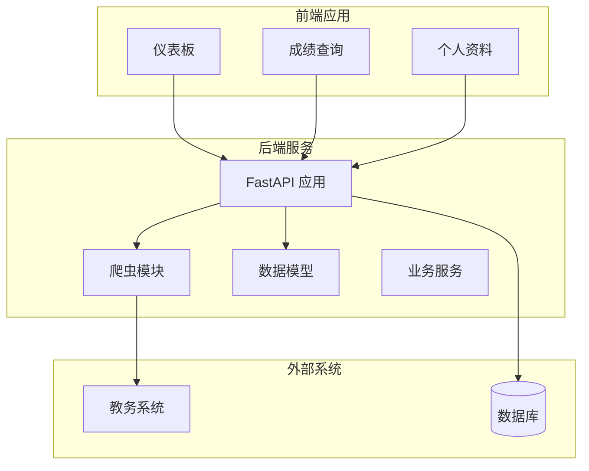

**图表来源**
- [backend/main.py:1-120](file://backend/main.py#L1-L120)
- [backend/scraper.py:13-21](file://backend/scraper.py#L13-L21)

**章节来源**
- [backend/main.py:1-853](file://backend/main.py#L1-L853)

## 核心组件

### API路由定义

系统提供了完整的教育相关API接口，其中学业进度查询是核心功能之一：

| 接口 | 方法 | 描述 |
|------|------|------|
| `/api/academic-progress` | GET | 获取学业进度查询 |
| `/api/grades` | GET | 获取成绩列表 |
| `/api/schedule` | GET | 获取课表信息 |
| `/api/training-plan/my` | GET | 获取培养方案 |

### 数据模型

系统使用SQLAlchemy ORM定义了完整的数据模型结构：

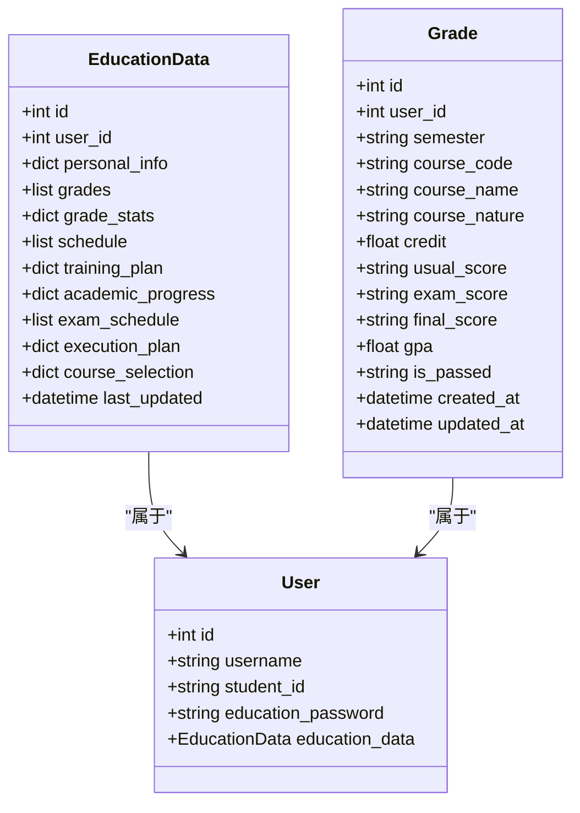

**图表来源**
- [backend/app/models/education_data.py:11-47](file://backend/app/models/education_data.py#L11-L47)
- [backend/app/models/education_data.py:50-76](file://backend/app/models/education_data.py#L50-L76)

**章节来源**
- [backend/app/models/education_data.py:1-103](file://backend/app/models/education_data.py#L1-L103)

## 架构概览

系统采用分层架构设计，实现了清晰的关注点分离：

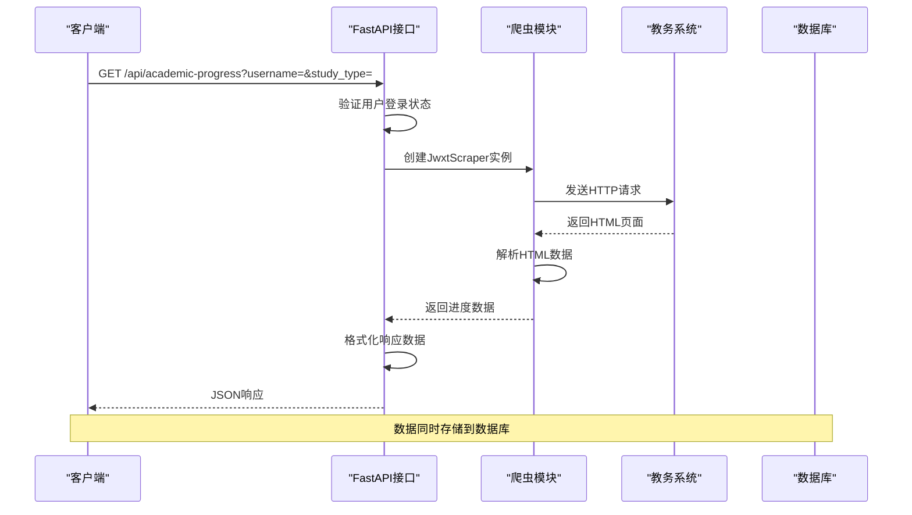

**图表来源**
- [backend/main.py:519-547](file://backend/main.py#L519-L547)
- [backend/scraper.py:686-783](file://backend/scraper.py#L686-L783)

## 详细组件分析

### 学业进度查询接口

#### 接口定义

`/api/academic-progress` 接口提供完整的学业进度查询功能：

**请求参数**
- `username` (必需): 用户名
- `study_type` (可选): 修读类型，默认值为"0"

**修读类型参数说明**

| 参数值 | 说明 | 用途 |
|--------|------|------|
| "0" | 主修课程 | 查询主修专业的学业进度 |
| "1" | 辅修课程 | 查询辅修专业的学业进度 |

#### 数据结构

接口返回的标准响应格式：

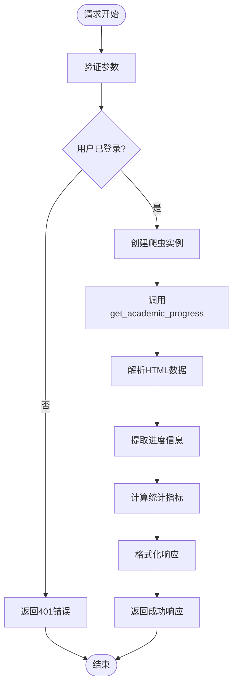

**图表来源**
- [backend/scraper.py:686-783](file://backend/scraper.py#L686-L783)

#### 统计指标计算

系统自动计算以下关键统计指标：

| 指标名称 | 计算公式 | 说明 |
|----------|----------|------|
| 总学分要求 | 从页面标题解析 | 培养方案规定的总学分要求 |
| 已获学分 | 累加各课程已获学分 | 实际已获得的学分总数 |
| 还需学分 | 总学分要求 - 已获学分 | 完成培养方案还需修读的学分 |
| 完成比例 | 已获学分 ÷ 总学分要求 × 100% | 学业完成百分比 |

#### 返回数据格式

标准响应结构：
```json
{
  "success": true,
  "data": {
    "修读类型": "主修",
    "总学分要求": 170,
    "已获学分": 120,
    "还需学分": 50,
    "课程列表": [
      {
        "课程性质": "必修",
        "课程代码": "CS101",
        "课程名称": "数据结构",
        "学分": "4.0",
        "建议修读学期": "3",
        "免听免修": "否",
        "已获学分": "4.0",
        "模块应修学分": "8.0"
      }
    ]
  },
  "count": 25
}
```

**章节来源**
- [backend/main.py:519-547](file://backend/main.py#L519-L547)
- [backend/scraper.py:686-783](file://backend/scraper.py#L686-L783)

### 修读类型详解

#### 主修课程 (study_type = "0")

主修课程查询用于跟踪学生主修专业的学习进度。系统会：
- 获取主修专业的培养方案
- 统计已完成的课程学分
- 计算距离毕业还需要的学分
- 提供详细的课程完成情况

#### 辅修课程 (study_type = "1")

辅修课程查询用于跟踪学生辅修专业的学习进度。系统会：
- 获取辅修专业的培养方案
- 统计辅修课程的完成情况
- 计算辅修专业的学分完成度
- 提供辅修专业的学习建议

### 培养方案对比分析

系统支持将实际学习进度与培养方案进行对比分析：

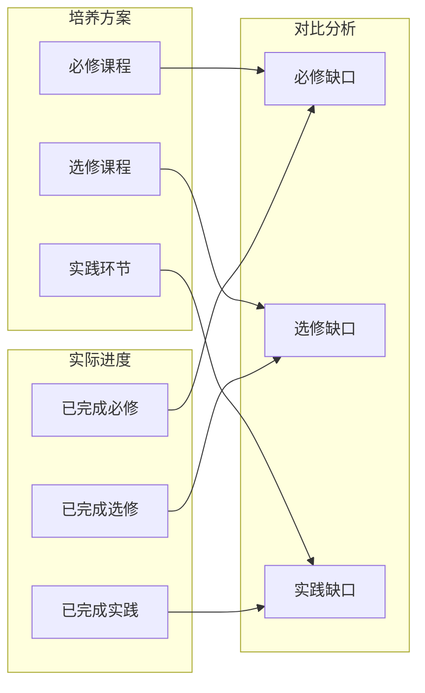

**图表来源**
- [backend/scraper.py:686-783](file://backend/scraper.py#L686-L783)

### 表头驱动的表格解析算法

**更新** 系统采用了全新的表头驱动解析方法，显著提高了表格识别的准确性：

#### 表格识别逻辑

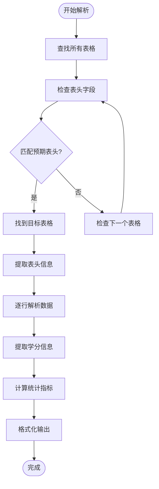

#### 预期表头组合

系统使用以下预期表头组合来识别目标表格：
- "课程性质"
- "课程代码" 
- "课程名称"
- "学分"
- "已获学分"

#### 动态列映射机制

当检测到标准表头时，系统会：
1. 自动识别表头位置和顺序
2. 建立动态列映射关系
3. 处理不同布局表格的列偏移
4. 提取合计行中的已获学分信息

**章节来源**
- [backend/scraper.py:1037-1136](file://backend/scraper.py#L1037-L1136)

### 增强的辅助方法

**更新** 系统新增了多个辅助方法来提升数据处理能力：

#### 数字提取辅助方法

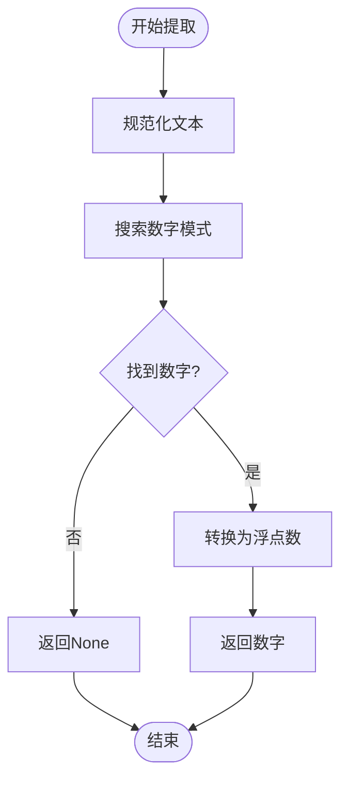

#### 表格展开辅助方法

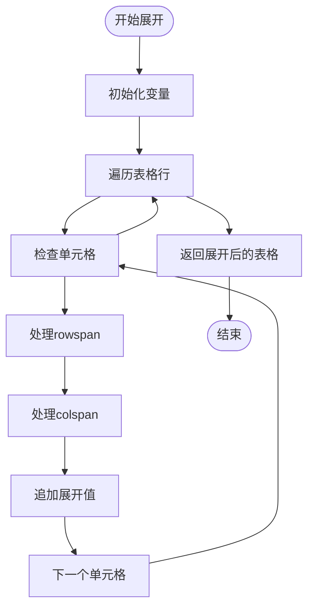

**章节来源**
- [backend/scraper.py:105-117](file://backend/scraper.py#L105-L117)
- [backend/scraper.py:55-103](file://backend/scraper.py#L55-L103)

### 模块应修学分字段支持

**更新** 系统新增了对模块应修学分字段的支持，提供更详细的课程模块学分信息：

#### 字段提取机制

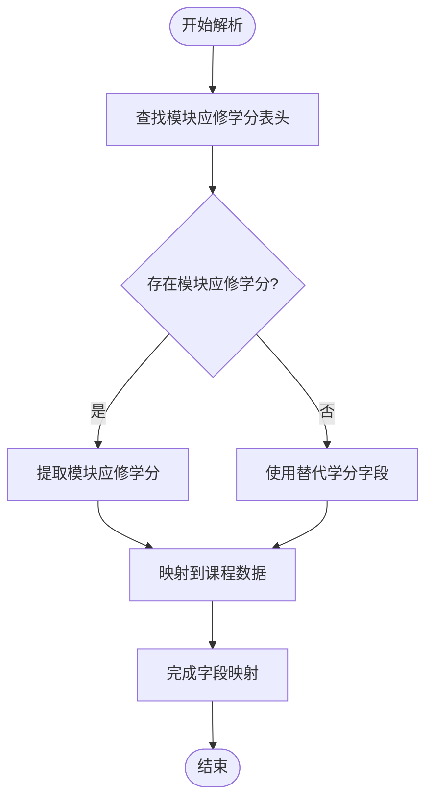

#### 字段映射规则

系统支持以下字段映射：
- 直接匹配"模块应修学分"表头
- 回退到"模块学分"或其他相关字段
- 默认为空字符串以保持数据完整性

**章节来源**
- [backend/scraper.py:1157](file://backend/scraper.py#L1157)

### 学分统计的标题提取机制

**更新** 系统采用了双重学分提取策略：

#### 标题提取流程

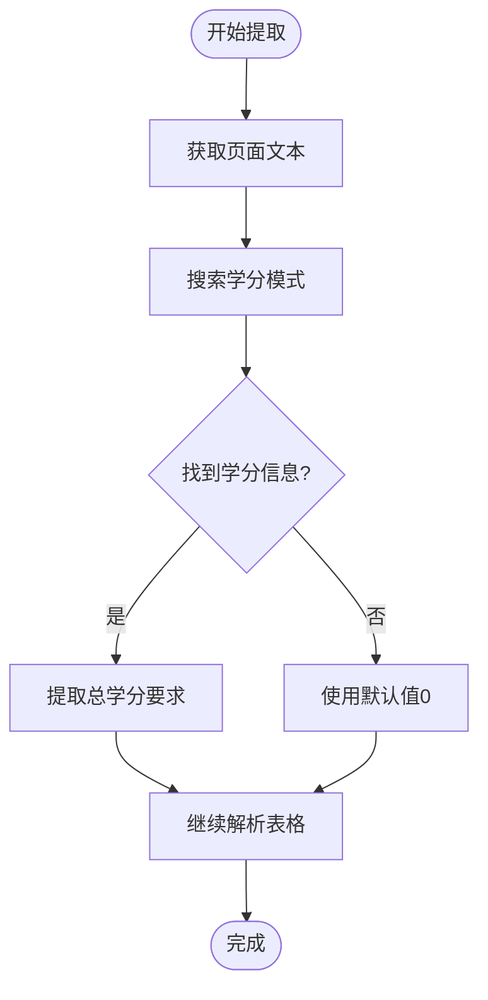

#### 学分提取模式

系统使用正则表达式模式来提取总学分要求：
- `需修读总学分[:：]\s*(\d+(?:\.\d+)?)`
- 支持中文冒号"："和英文冒号":"
- 支持可选的小数点格式

**章节来源**
- [backend/scraper.py:1052-1056](file://backend/scraper.py#L1052-L1056)

### 增强的错误处理机制

**更新** 系统实现了多层次的错误处理和调试机制：

#### 错误处理流程

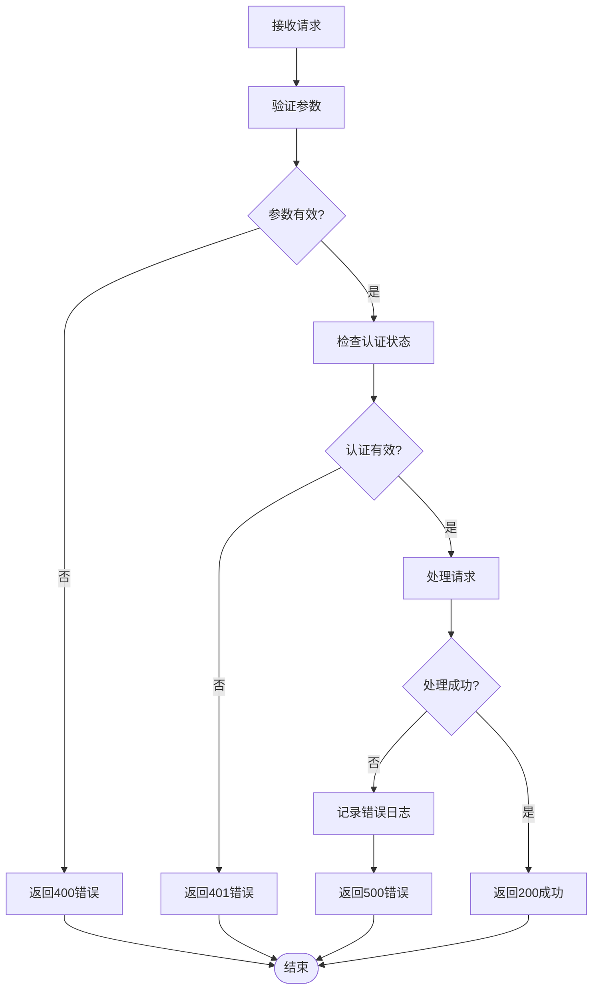

#### 调试信息记录

系统在关键节点记录详细的调试信息：
- HTML响应内容（前500字符）
- 表格识别过程
- 数据解析状态
- 错误发生位置

**章节来源**
- [backend/scraper.py:1017-1025](file://backend/scraper.py#L1017-L1025)

### 重复检测机制

**更新** 系统实现了增强的重复检测机制，确保数据的唯一性：

#### 重复检测流程

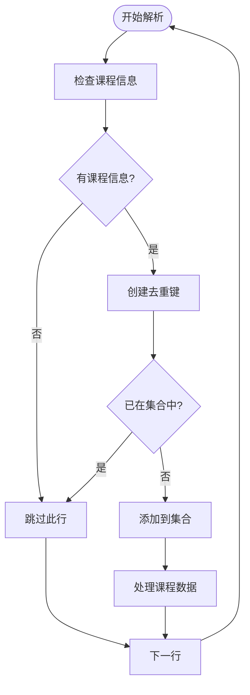

#### 去重策略

系统使用课程代码和课程名称的组合作为去重键：
- `(course_code, course_name)`
- 避免重复课程的多次添加
- 提高数据处理效率

**章节来源**
- [backend/scraper.py:1181-1184](file://backend/scraper.py#L1181-L1184)

## 依赖关系分析

### 外部依赖

系统依赖以下外部组件：

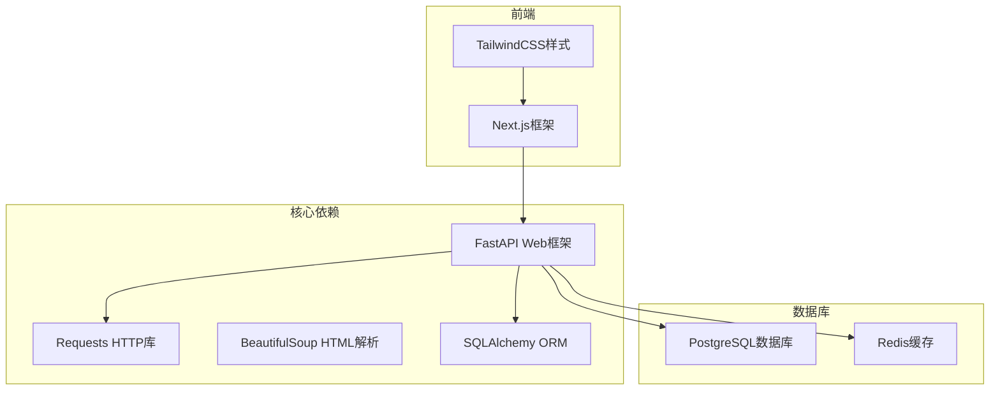

**图表来源**
- [backend/main.py:1-50](file://backend/main.py#L1-L50)

### 内部模块依赖

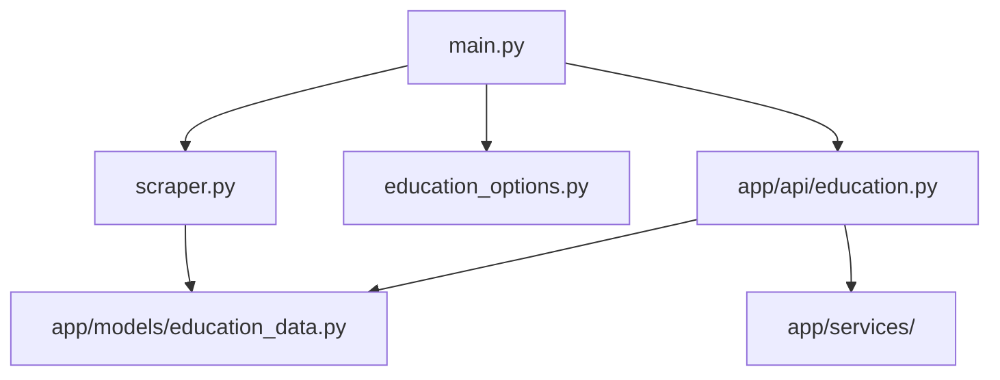

**图表来源**
- [backend/main.py:1-853](file://backend/main.py#L1-L853)

**章节来源**
- [backend/education_options.py:1-420](file://backend/education_options.py#L1-L420)

## 性能考虑

### 数据更新策略

系统采用以下策略确保数据的时效性和准确性：

1. **实时爬取**: 每次查询时直接从教务系统抓取最新数据
2. **缓存机制**: 使用Redis缓存常用查询结果，减少重复请求
3. **增量更新**: 仅更新发生变化的数据，避免全量重新抓取

### 性能优化措施

- **并发处理**: 支持多用户并发查询
- **连接池**: 使用HTTP连接池复用TCP连接
- **异步处理**: 采用异步编程模式提高响应速度
- **数据压缩**: 对传输的数据进行压缩以减少带宽占用

## 故障排除指南

### 常见问题及解决方案

| 问题类型 | 症状 | 可能原因 | 解决方案 |
|----------|------|----------|----------|
| 登录失败 | 返回"未登录，请先登录" | 用户未登录或会话过期 | 检查用户认证状态，重新登录 |
| 数据为空 | 返回空的课程列表 | 教务系统数据异常 | 稍后重试或联系管理员 |
| 服务器超时 | 请求超时错误 | 教务系统繁忙或网络问题 | 检查网络连接，稍后重试 |
| 参数错误 | 返回400错误 | 缺少必需参数或参数格式错误 | 检查请求参数格式 |

### 错误处理机制

系统实现了完善的错误处理机制：


**图表来源**
- [backend/main.py:519-547](file://backend/main.py#L519-L547)

**章节来源**
- [backend/main.py:519-547](file://backend/main.py#L519-L547)

## 结论

本API为教务系统提供了完整的学业进度查询功能，具有以下特点：

1. **准确性**: 直接从教务系统抓取实时数据，确保信息的准确性
2. **完整性**: 支持主修和辅修两种修读类型的进度查询
3. **易用性**: 提供简洁的API接口和标准化的数据格式
4. **扩展性**: 模块化设计便于功能扩展和维护
5. **稳定性**: 采用表头驱动解析方法，显著提高了数据解析的准确性

通过该API，学生可以实时了解自己的学业进度，合理规划学习安排，提高学习效率。系统还支持与培养方案的对比分析，帮助学生更好地理解学习目标和要求。

**最新改进**：
- 采用表头驱动的表格识别算法，提高了对不同布局表格的适应性
- 新增了基于预期表头组合的表格定位逻辑
- 改进了学分统计的标题提取机制，增强了数据解析的可靠性
- 增强了错误处理和调试能力，提升了系统的稳定性
- 新增模块应修学分字段支持，提供更详细的课程模块学分信息
- 优化课程数据提取的动态列映射机制，支持"课程类别/课程模块"两种变体
- 新增_extract_first_number辅助方法，专门用于数字提取
- 改进_expand_table_rows方法，增强rowspan/colspan处理能力
- 增强重复检测机制，使用set避免重复课程数据
- 优化多表格处理能力，能够处理多个进度表格并合并数据

这些改进使得学业进度查询功能更加健壮和准确，能够更好地服务于广大学生群体。