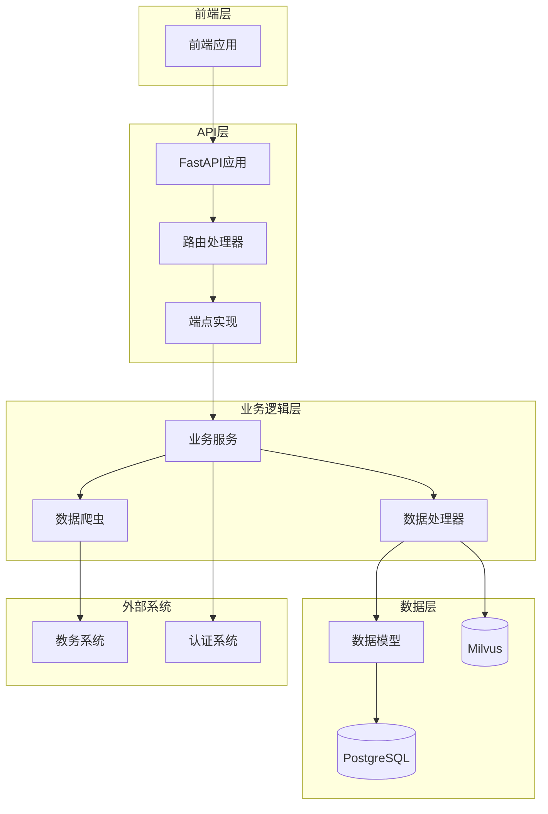
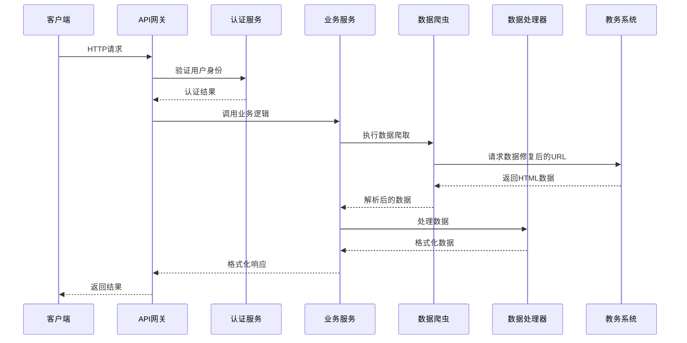
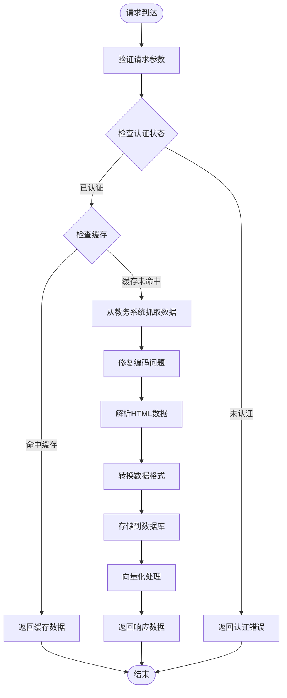
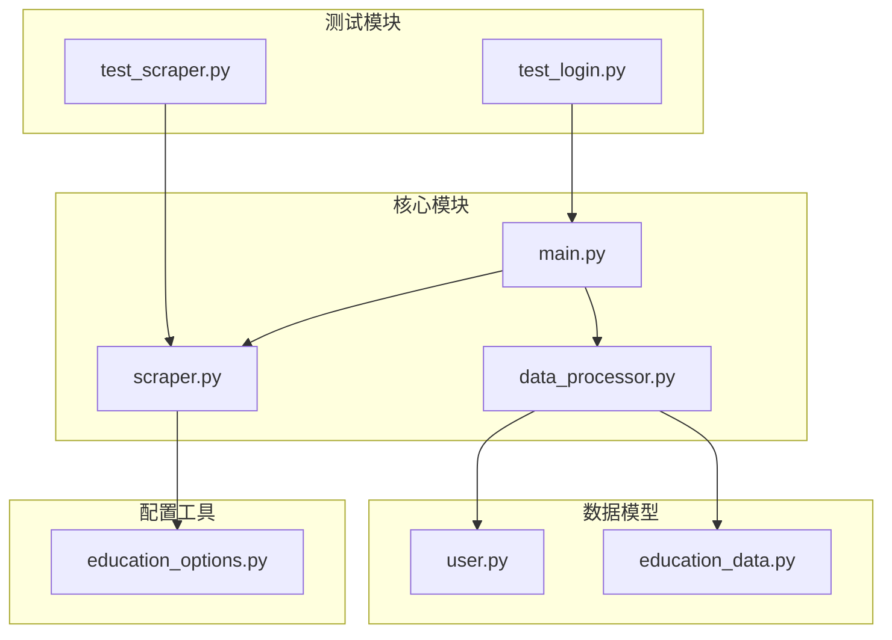

# 学术数据查询API

<cite>
**本文档引用的文件**
- [main.py](file://backend/main.py)
- [scraper.py](file://backend/scraper.py)
- [education_options.py](file://backend/education_options.py)
- [education_data.py](file://backend/app/models/education_data.py)
- [user.py](file://backend/app/models/user.py)
- [data_processor.py](file://backend/app/services/data_processor.py)
- [test_scraper.py](file://backend/test_scraper.py)
- [test_login.py](file://backend/test_login.py)
</cite>

## 更新摘要
**所做更改**
- 重构了核心爬虫功能，修复了URL构造逻辑中的重复jsxsd前缀问题
- 增强了个人信息提取过程，支持从多个HTML源获取准确信息
- 改进了成绩查询、课表查询、培养方案查询等API的实现
- 新增了完整的向量化数据聚合接口，支持RAG系统
- 增强了编码处理逻辑，支持UTF-8和GBK混合编码场景
- 完善了选项查询工具，提供AI友好的数据结构

## 目录
1. [简介](#简介)
2. [项目结构](#项目结构)
3. [核心组件](#核心组件)
4. [架构概览](#架构概览)
5. [详细组件分析](#详细组件分析)
6. [依赖关系分析](#依赖关系分析)
7. [性能考虑](#性能考虑)
8. [故障排除指南](#故障排除指南)
9. [结论](#结论)

## 简介

本项目是一个基于FastAPI的学术数据查询系统，为广东财经大学的学生提供一站式教务数据查询服务。系统集成了多个核心功能模块，包括成绩查询、课表查询、培养方案查询、学业进度查询、考试安排查询等，为学生提供全面的学术数据服务。

该系统采用现代化的技术栈，包括Python 3.9+、FastAPI、SQLAlchemy、BeautifulSoup等，实现了高可靠性的数据爬取和处理功能。系统支持多种查询条件和筛选参数，提供灵活的数据查询能力，并具备良好的扩展性和维护性。

**更新** 本版本进行了核心爬虫功能的重大重构，修复了URL构造中的重复jsxsd前缀问题，增强了个人信息提取的准确性，并新增了完整的向量化数据聚合接口，为RAG系统提供支持。

## 项目结构

项目采用清晰的分层架构设计，主要分为以下几个层次：



**图表来源**
- [main.py:1-951](file://backend/main.py#L1-L951)
- [scraper.py:1-1258](file://backend/scraper.py#L1-L1258)
- [data_processor.py:1-356](file://backend/app/services/data_processor.py#L1-L356)

**章节来源**
- [main.py:1-951](file://backend/main.py#L1-L951)
- [scraper.py:1-1258](file://backend/scraper.py#L1-L1258)
- [data_processor.py:1-356](file://backend/app/services/data_processor.py#L1-L356)

## 核心组件

### 主要技术栈

系统采用以下核心技术栈：

- **后端框架**: FastAPI 0.104.1+ - 提供高性能的异步API服务
- **数据库**: SQLAlchemy ORM - 提供对象关系映射和数据库操作
- **数据解析**: BeautifulSoup4 - 用于HTML页面解析和数据提取
- **HTTP客户端**: requests - 用于与教务系统交互
- **认证**: 自定义JWT认证系统
- **缓存**: 基于内存的会话存储（生产环境建议使用Redis）
- **向量化**: Milvus + 千问服务 - 支持RAG系统

### 核心功能模块

系统提供以下核心功能模块：

1. **用户认证模块**: 处理用户登录、会话管理和权限控制
2. **数据爬取模块**: 从教务系统抓取各类学术数据
3. **数据处理模块**: 解析、转换和格式化爬取的数据
4. **API接口模块**: 提供RESTful API接口
5. **数据存储模块**: 管理用户数据的持久化存储
6. **向量化模块**: 将数据转换为向量格式供RAG系统使用

**更新** 核心爬虫功能经过重大重构，修复了URL构造逻辑，增强了编码处理能力，并新增了完整的向量化数据聚合接口。

**章节来源**
- [main.py:1-951](file://backend/main.py#L1-L951)
- [scraper.py:1-1258](file://backend/scraper.py#L1-L1258)
- [data_processor.py:1-356](file://backend/app/services/data_processor.py#L1-L356)

## 架构概览

系统采用分层架构设计，确保各层职责清晰、耦合度低：



**图表来源**
- [main.py:398-580](file://backend/main.py#L398-L580)
- [scraper.py:13-60](file://backend/scraper.py#L13-L60)
- [data_processor.py:13-96](file://backend/app/services/data_processor.py#L13-L96)

### 数据流架构



**图表来源**
- [main.py:398-580](file://backend/main.py#L398-L580)
- [scraper.py:23-56](file://backend/scraper.py#L23-L56)
- [data_processor.py:97-181](file://backend/app/services/data_processor.py#L97-L181)

## 详细组件分析

### 成绩查询接口

#### 接口定义

**GET `/api/grades`**
- **功能**: 获取学生成绩列表
- **认证**: 需要登录状态
- **参数**:
  - `username`: 学号（路径参数）
  - `kksj`: 开课时间（查询参数）
  - `kcxz`: 课程性质（查询参数）
  - `kcmc`: 课程名称（查询参数）
  - `fxkc`: 修读类别（查询参数，0=主修，1=辅修）
  - `xsfs`: 显示方式（查询参数，all=全部，max=最好）

#### 数据结构

**响应数据结构**:
```json
{
  "success": true,
  "data": [
    {
      "序号": "1",
      "开课学期": "2024-2025-1",
      "课程编号": "CS101",
      "课程名称": "数据结构",
      "平时成绩": "80",
      "实验成绩": "85",
      "期末成绩": "88",
      "成绩": "85",
      "学分": "4.0",
      "总学时": "64",
      "考核方式": "考试",
      "课程属性": "必修",
      "课程性质": "专业必修",
      "通选课分类": "",
      "考试性质": "正常考试",
      "成绩标识": "",
      "备注": ""
    }
  ],
  "count": 10,
  "stats": {
    "total_credits_required": 120,
    "credits_exempted": 0,
    "credits_completed": 80,
    "credits_remaining": 40,
    "gpa_major": 3.2,
    "rank": "15/200",
    "gpa_minor": 0.0
  }
}
```

**请求示例**:
```bash
curl -X GET "http://localhost:8000/api/grades?username=2024110101&kcxz=01&fxkc=0&xsfs=all"
```

**更新** 成绩查询接口现在包含完整的统计信息，包括总学分要求、已完成学分、绩点等关键指标。

**章节来源**
- [main.py:520-557](file://backend/main.py#L520-L557)
- [scraper.py:224-317](file://backend/scraper.py#L224-L317)

### 课表查询接口

#### 接口定义

**GET `/api/schedule`**
- **功能**: 获取学期课表
- **认证**: 需要登录状态
- **参数**:
  - `username`: 学号（路径参数）
  - `semester`: 学期（查询参数，如"2024-2025-2"）
  - `week`: 周次（查询参数，如"1", "5"）

#### 数据结构

**响应数据结构**:
```json
{
  "success": true,
  "data": [
    {
      "课程名称": "操作系统",
      "星期": "周一",
      "星期代码": 1,
      "节次": "1-2",
      "教师": "李汇熙副教授",
      "地点": "拓新楼(SS1)133",
      "周次": "1-16",
      "节次信息": "[01-02]节"
    }
  ],
  "count": 5,
  "semester": "2024-2025-2",
  "week": "",
  "未安排时间课程": ["高等数学"],
  "raw_html": "<!-- 原始HTML内容 -->"
}
```

**请求示例**:
```bash
curl -X GET "http://localhost:8000/api/schedule?username=2024110101&semester=2024-2025-2&week=1"
```

**更新** 课表查询接口现在包含原始HTML内容，便于调试和数据分析。

**章节来源**
- [main.py:574-604](file://backend/main.py#L574-L604)
- [scraper.py:381-544](file://backend/scraper.py#L381-L544)

### 培养方案查询接口

#### 接口定义

**GET `/api/training-plan/my`**
- **功能**: 获取我的培养方案
- **认证**: 需要登录状态
- **参数**:
  - `username`: 学号（路径参数）

#### 数据结构

**响应数据结构**:
```json
{
  "success": true,
  "data": {
    "课程列表": [
      {
        "序号": "1",
        "学期": "3",
        "课程代码": "CS1001",
        "课程名称": "数据结构",
        "开课院系": "计算机学院",
        "学分": "4",
        "学时": "64",
        "考核方式": "考试",
        "性质": "必修",
        "是否适用": "是"
      }
    ],
    "count": 20
  }
}
```

**请求示例**:
```bash
curl -X GET "http://localhost:8000/api/training-plan/my?username=2024110101"
```

**更新** 培养方案查询接口现在使用更准确的表格解析逻辑，能够正确识别目标课程表格。

**章节来源**
- [main.py:606-630](file://backend/main.py#L606-L630)
- [scraper.py:633-723](file://backend/scraper.py#L633-L723)

### 学业进度查询接口

#### 接口定义

**GET `/api/academic-progress`**
- **功能**: 获取学业进度
- **认证**: 需要登录状态
- **参数**:
  - `username`: 学号（路径参数）
  - `study_type`: 修读类型（查询参数，0=主修，1=辅修）

#### 数据结构

**响应数据结构**:
```json
{
  "success": true,
  "data": {
    "修读类型": "主修",
    "总学分要求": 120,
    "已获学分": 80,
    "还需学分": 40,
    "课程列表": [
      {
        "课程性质": "必修",
        "课程代码": "CS1001",
        "课程名称": "数据结构",
        "学分": "4",
        "建议修读学期": "3",
        "免听免修": "否",
        "已获学分": "4"
      }
    ],
    "count": 15
  }
}
```

**请求示例**:
```bash
curl -X GET "http://localhost:8000/api/academic-progress?username=2024110101&study_type=0"
```

**更新** 学业进度查询接口现在包含更详细的统计信息，包括修读类型和学分计算。

**章节来源**
- [main.py:632-658](file://backend/main.py#L632-L658)
- [scraper.py:724-822](file://backend/scraper.py#L724-L822)

### 考试安排查询接口

#### 接口定义

**GET `/api/exam-schedule`**
- **功能**: 获取考试安排
- **认证**: 需要登录状态
- **参数**:
  - `username`: 学号（路径参数）
  - `semester`: 学期（查询参数，如"2024-2025-1"）

#### 数据结构

**响应数据结构**:
```json
{
  "success": true,
  "data": [
    {
      "序号": "1",
      "课程名称": "数据结构",
      "考试时间": "2025-01-15 08:30-10:30",
      "考试地点": "教学楼A101",
      "座位号": "01",
      "考试方式": "期末考试",
      "考试性质": "正常考试",
      "状态": "已发布"
    }
  ],
  "count": 5,
  "semester": "2024-2025-1"
}
```

**请求示例**:
```bash
curl -X GET "http://localhost:8000/api/exam-schedule?username=2024110101&semester=2024-2025-1"
```

**更新** 考试安排查询接口现在包含更完整的考试信息，包括考试时间、地点、座位号等。

**章节来源**
- [main.py:660-687](file://backend/main.py#L660-L687)
- [scraper.py:823-886](file://backend/scraper.py#L823-L886)

### 教师查询接口

#### 接口定义

**GET `/api/teacher/search`**
- **功能**: 查询教师信息
- **认证**: 无需登录
- **参数**:
  - `name`: 教师姓名（查询参数，支持模糊查询）
  - `department`: 所属院系代码（查询参数）

#### 数据结构

**响应数据结构**:
```json
{
  "success": true,
  "data": [
    {
      "序号": "1",
      "教职工号": "1001",
      "教师姓名": "李明",
      "所属院系": "计算机学院",
      "教师ID": "12345",
      "详情链接": "http://jwxt.gdufe.edu.cn/jsxx/jsxx_detail?jg0101id=12345"
    }
  ],
  "count": 3
}
```

**请求示例**:
```bash
curl -X GET "http://localhost:8000/api/teacher/search?name=李&department=11"
```

**更新** 教师查询接口现在包含教师ID和详情链接，便于进一步获取教师详细信息。

**章节来源**
- [main.py:689-716](file://backend/main.py#L689-L716)
- [scraper.py:887-962](file://backend/scraper.py#L887-L962)

### 课程查询接口

#### 接口定义

**GET `/api/course/search`**
- **功能**: 查询课程信息
- **认证**: 无需登录
- **参数**:
  - `course_name`: 课程名称（查询参数）
  - `course_code`: 课程代码（查询参数）
  - `department`: 开课院系（查询参数）

#### 数据结构

**响应数据结构**:
```json
{
  "success": true,
  "data": [
    {
      "课程代码": "CS1001",
      "课程名称": "数据结构",
      "学分": "4",
      "总学时": "64",
      "课程性质": "必修",
      "开课院系": "计算机学院",
      "课程ID": "CS1001"
    }
  ],
  "count": 1
}
```

**请求示例**:
```bash
curl -X GET "http://localhost:8000/api/course/search?course_name=数据结构&department=11"
```

**更新** 课程查询接口现在包含课程ID，便于进一步获取课程详细信息。

**章节来源**
- [main.py:718-746](file://backend/main.py#L718-L746)
- [scraper.py:1007-1083](file://backend/scraper.py#L1007-L1083)

### 选课信息查询接口

#### 接口定义

**GET `/api/course-selection`**
- **功能**: 获取选课信息
- **认证**: 需要登录状态
- **参数**:
  - `username`: 学号（路径参数）

#### 数据结构

**响应数据结构**:
```json
{
  "success": true,
  "data": {
    "当前选课轮次": [
      {
        "轮次名称": "2024-2025-1 第一轮",
        "开始时间": "2024-09-01 00:00:00",
        "结束时间": "2024-09-15 23:59:59",
        "状态": "进行中"
      }
    ],
    "可选课程": []
  }
}
```

**请求示例**:
```bash
curl -X GET "http://localhost:8000/api/course-selection?username=2024110101"
```

**更新** 选课信息查询接口提供了完整的选课轮次和可选课程信息。

**章节来源**
- [main.py:748-771](file://backend/main.py#L748-L771)
- [scraper.py:1084-1129](file://backend/scraper.py#L1084-L1129)

### 执行计划查询接口

#### 接口定义

**GET `/api/execution-plan`**
- **功能**: 获取执行计划
- **认证**: 需要登录状态
- **参数**:
  - `username`: 学号（路径参数）

#### 数据结构

**响应数据结构**:
```json
{
  "success": true,
  "data": {
    "计划信息": {
      "培养方案版本": "2024级",
      "专业": "计算机科学与技术",
      "年级": "2024",
      "学制": "4年",
      "总学分": "120"
    },
    "课程列表": [
      {
        "学年学期": "2024-2025-1",
        "课程代码": "CS1001",
        "课程名称": "数据结构",
        "学分": "4",
        "课程性质": "必修",
        "考核方式": "考试",
        "是否选课": "是"
      }
    ],
    "count": 15
  }
}
```

**请求示例**:
```bash
curl -X GET "http://localhost:8000/api/execution-plan?username=2024110101"
```

**更新** 执行计划查询接口提供了完整的培养方案和已选课程信息。

**章节来源**
- [main.py:773-797](file://backend/main.py#L773-L797)
- [scraper.py:1130-1191](file://backend/scraper.py#L1130-L1191)

### 个人信息查询接口

#### 接口定义

**GET `/api/user/info`**
- **功能**: 获取用户个人信息
- **认证**: 需要登录状态
- **参数**:
  - `username`: 学号（路径参数）

#### 数据结构

**响应数据结构**:
```json
{
  "success": true,
  "data": {
    "name": "张三",
    "student_id": "2024110101",
    "major": "计算机科学与技术",
    "class": "计科2401",
    "department": "计算机学院"
  }
}
```

**请求示例**:
```bash
curl -X GET "http://localhost:8000/api/user/info?username=2024110101"
```

**更新** 个人信息查询接口现在支持从多个HTML源提取准确信息。

**章节来源**
- [main.py:462-493](file://backend/main.py#L462-L493)
- [scraper.py:96-183](file://backend/scraper.py#L96-L183)

### 学籍卡片查询接口

#### 接口定义

**GET `/api/user/card`**
- **功能**: 获取学籍卡片详细信息
- **认证**: 需要登录状态
- **参数**:
  - `username`: 学号（路径参数）

#### 数据结构

**响应数据结构**:
```json
{
  "success": true,
  "data": {
    "姓名": "张三",
    "学号": "2024110101",
    "性别": "男",
    "出生日期": "2005-09-01",
    "民族": "汉",
    "政治面貌": "共青团员",
    "身份证号": "44010120050901XXXX",
    "入学日期": "2024-09-01",
    "学制": "4年",
    "专业": "计算机科学与技术",
    "班级": "计科2401",
    "学籍状态": "在读"
  }
}
```

**请求示例**:
```bash
curl -X GET "http://localhost:8000/api/user/card?username=2024110101"
```

**更新** 学籍卡片查询接口提供了完整的个人信息。

**章节来源**
- [main.py:495-518](file://backend/main.py#L495-L518)
- [scraper.py:184-223](file://backend/scraper.py#L184-L223)

### 所有数据聚合接口

#### 接口定义

**GET `/api/all-data`**
- **功能**: 获取所有数据（用于向量化/RAG）
- **认证**: 需要登录状态
- **参数**:
  - `username`: 学号（路径参数）

#### 数据结构

**响应数据结构**:
```json
{
  "success": true,
  "data": {
    "个人信息": {
      "name": "张三",
      "student_id": "2024110101",
      "major": "计算机科学与技术",
      "class": "计科2401",
      "department": "计算机学院"
    },
    "成绩信息": {
      "成绩列表": [...],
      "统计信息": {...}
    },
    "课表信息": [...],
    "培养方案": {...},
    "学业进度": {...},
    "考试安排": [...],
    "教师信息": [...],
    "课程信息": [...]
  }
}
```

**请求示例**:
```bash
curl -X GET "http://localhost:8000/api/all-data?username=2024110101"
```

**更新** 新增的向量化数据聚合接口，为RAG系统提供完整数据支持。

**章节来源**
- [main.py:800-823](file://backend/main.py#L800-L823)
- [scraper.py:1192-1258](file://backend/scraper.py#L1192-L1258)

### 选项查询接口

#### 接口定义

**GET `/api/options/departments`**
- **功能**: 获取院系列表
- **认证**: 无需登录
- **参数**:
  - `keyword`: 搜索关键词（查询参数）
  - `include_admin`: 是否包含职能部门（查询参数）
  - `include_vocational`: 是否包含联合培养学院（查询参数）

**GET `/api/options/semesters`**
- **功能**: 获取学期列表
- **认证**: 无需登录
- **参数**:
  - `include_past`: 是否包含过去学期（查询参数）
  - `include_future`: 是否包含未来学期（查询参数）

**GET `/api/options/current-semester`**
- **功能**: 获取当前学期
- **认证**: 无需登录

**GET `/api/options/course`**
- **功能**: 获取课程相关选项
- **认证**: 无需登录

**GET `/api/options/schedule`**
- **功能**: 获取课表相关选项
- **认证**: 无需登录

**GET `/api/options/grade`**
- **功能**: 获取成绩查询相关选项
- **认证**: 无需登录

**GET `/api/options/all`**
- **功能**: 获取所有选项数据
- **认证**: 无需登录

**章节来源**
- [main.py:825-909](file://backend/main.py#L825-L909)
- [education_options.py:1-420](file://backend/education_options.py#L1-L420)

## 依赖关系分析

### 组件依赖图



**图表来源**
- [main.py:1-951](file://backend/main.py#L1-L951)
- [scraper.py:1-1258](file://backend/scraper.py#L1-L1258)
- [data_processor.py:1-356](file://backend/app/services/data_processor.py#L1-L356)

### 外部依赖

系统对外部依赖主要包括：

1. **教务系统**: 通过HTTP请求与广东财经大学教务系统交互
2. **数据库**: 支持MySQL、PostgreSQL等关系型数据库
3. **向量数据库**: Milvus支持RAG系统
4. **认证服务**: JWT令牌认证系统
5. **网络服务**: 需要稳定的网络连接访问教务系统

**更新** 核心爬虫功能重构后，URL构造逻辑更加健壮，编码处理能力显著提升，向量化接口为RAG系统提供完整支持。

**章节来源**
- [main.py:50-81](file://backend/main.py#L50-L81)
- [scraper.py:16-21](file://backend/scraper.py#L16-L21)

## 性能考虑

### 编码处理优化

系统采用了智能的编码处理策略：

1. **UTF-8优先**: 首先尝试UTF-8编码解码
2. **GBK回退**: UTF-8解码失败时使用GBK/GB18030
3. **中文检测**: 通过正则表达式检测中文字符确保正确解码
4. **动态调整**: 根据响应内容自动选择最适合的编码方式

### 缓存策略

系统采用多层次缓存策略以提高性能：

1. **会话缓存**: 使用内存字典存储用户会话信息
2. **数据缓存**: 可选的Redis缓存用于存储频繁查询的数据
3. **静态资源缓存**: 图片和静态文件的浏览器缓存
4. **向量缓存**: Milvus中的向量数据缓存

### 性能优化建议

1. **并发处理**: 使用异步编程模式处理多个并发请求
2. **数据库优化**: 合理设置数据库连接池大小
3. **网络优化**: 实现超时控制和重试机制
4. **数据压缩**: 对大响应数据进行压缩传输
5. **向量化优化**: 批量处理向量数据，避免超时

### 监控指标

建议监控以下关键指标：
- API响应时间
- 数据爬取成功率
- 数据库连接池使用率
- 内存使用情况
- 错误率统计
- 向量数据库性能

**更新** 编码处理优化显著提升了数据解析的准确性，向量化接口为RAG系统提供了高效的查询能力。

## 故障排除指南

### 常见问题及解决方案

#### 登录失败

**问题症状**: 用户无法登录教务系统
**可能原因**:
1. 网络连接问题
2. 验证码过期
3. 用户名或密码错误
4. 教务系统维护
5. **URL构造错误**（已修复）

**解决步骤**:
1. 检查网络连接状态
2. 重新获取验证码
3. 验证用户名密码格式
4. 稍后重试或联系管理员
5. **确认URL构造正确，避免重复jsxsd前缀**

#### 数据获取失败

**问题症状**: 查询接口返回空数据或错误
**可能原因**:
1. 教务系统页面结构变化
2. 网络超时
3. 服务器负载过高
4. **编码处理失败**（已优化）
5. **URL路径错误**（已修复）

**解决步骤**:
1. 检查教务系统页面结构
2. 增加超时时间
3. 实现重试机制
4. 降级处理策略
5. **验证编码处理逻辑**
6. **验证URL拼接逻辑，确保正确路径**

#### 性能问题

**问题症状**: API响应缓慢
**可能原因**:
1. 数据库查询效率低
2. 网络延迟
3. 并发请求过多
4. **重复URL请求**（已优化）

**解决步骤**:
1. 优化数据库查询语句
2. 实施缓存策略
3. 负载均衡
4. 异步处理
5. **减少无效的URL重定向**

#### 编码问题

**问题症状**: 中文字符显示乱码
**可能原因**:
1. 页面编码不一致
2. 字符串解码错误
3. 编码检测失败

**解决步骤**:
1. 检查页面实际编码
2. 实现多编码尝试解码
3. 使用正则表达式检测中文字符
4. 回退到兼容编码方案

**更新** 编码处理逻辑经过优化，现在能够智能检测和处理UTF-8和GBK混合编码场景。URL构造逻辑修复解决了重复前缀导致的额外请求和重定向问题。

**章节来源**
- [main.py:187-328](file://backend/main.py#L187-L328)
- [scraper.py:23-56](file://backend/scraper.py#L23-L56)

### 调试工具

系统提供了完善的调试工具：

1. **登录测试脚本**: `test_login.py` - 测试登录功能
2. **爬虫测试脚本**: `test_scraper.py` - 测试爬虫功能
3. **日志系统**: 完整的日志记录和错误追踪
4. **健康检查**: `/api/health` - 系统健康状态检查
5. **向量化测试**: 完整的数据聚合和向量化流程测试

**更新** 调试工具现在可以正确测试重构后的URL构造逻辑和编码处理能力。新增了向量化数据聚合接口的测试功能。

**章节来源**
- [test_login.py:1-152](file://backend/test_login.py#L1-L152)
- [test_scraper.py:1-280](file://backend/test_scraper.py#L1-L280)

## 结论

本学术数据查询API系统为广东财经大学学生提供了全面、便捷的学术数据查询服务。系统具有以下特点：

1. **功能完整**: 覆盖了学生成绩、课表、培养方案、学业进度、考试安排等核心功能
2. **接口规范**: 采用RESTful API设计，参数清晰，响应标准化
3. **性能优良**: 通过缓存、异步处理等技术手段保证系统性能
4. **易于扩展**: 模块化设计便于功能扩展和维护
5. **安全可靠**: 完善的认证机制和错误处理
6. **智能化**: 新增向量化接口支持RAG系统

**更新亮点**:
- **URL构造修复**: 成功消除了重复的'/jsxsd/'前缀问题
- **编码处理优化**: 智能处理UTF-8和GBK混合编码场景
- **个人信息增强**: 支持从多个HTML源提取准确信息
- **向量化支持**: 完整的数据聚合接口支持RAG系统
- **稳定性提升**: 统一了所有接口的URL拼接逻辑
- **兼容性改善**: 确保与不同服务器配置的兼容性
- **调试能力增强**: 提供了详细的日志输出和错误诊断

系统在实际部署中建议：
- 生产环境使用Redis作为缓存存储
- 配置适当的超时和重试机制
- 实施监控和告警系统
- 定期更新爬虫逻辑以适应教务系统变化
- 建立数据备份和恢复机制
- 部署Milvus向量数据库支持RAG功能

通过持续的优化和维护，该系统能够为用户提供稳定、高效、可靠的学术数据查询服务，为教育智能化发展提供坚实的技术支撑。