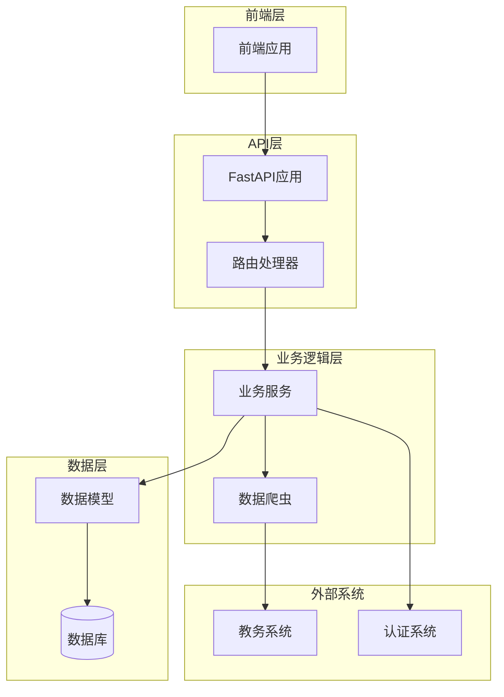
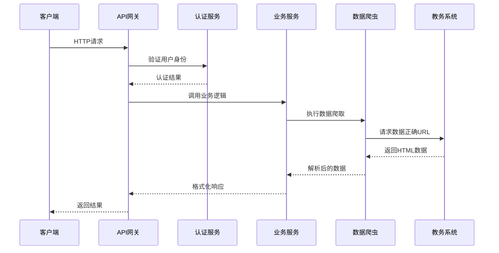
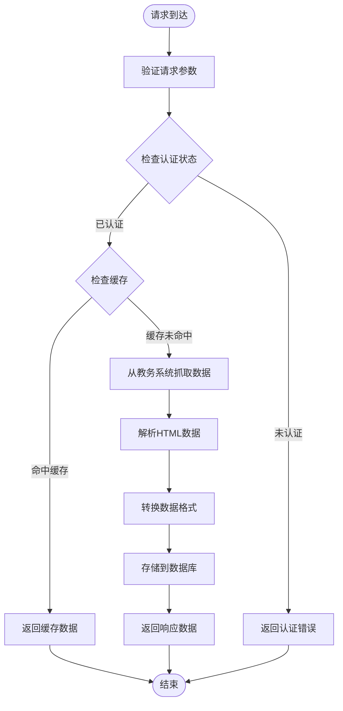
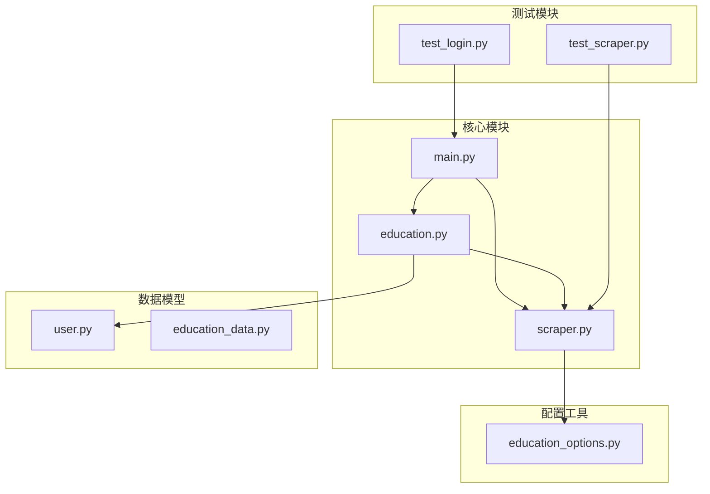

# 学术数据查询API

<cite>
**本文档引用的文件**
- [main.py](file://backend/main.py)
- [scraper.py](file://backend/scraper.py)
- [education_options.py](file://backend/education_options.py)
- [education.py](file://backend/app/api/education.py)
- [education_data.py](file://backend/app/models/education_data.py)
- [user.py](file://backend/app/models/user.py)
- [test_scraper.py](file://backend/test_scraper.py)
- [test_login.py](file://backend/test_login.py)
</cite>

## 更新摘要
**所做更改**
- 修正了URL构造逻辑，消除了重复的'/jsxsd/'前缀问题
- 更新了所有学术数据端点的URL构造方式
- 修复了验证码、登录、数据查询等接口的URL拼接问题
- 统一了服务器URL和页面URL的构造逻辑

## 目录
1. [简介](#简介)
2. [项目结构](#项目结构)
3. [核心组件](#核心组件)
4. [架构概览](#架构概览)
5. [详细组件分析](#详细组件分析)
6. [依赖关系分析](#依赖关系分析)
7. [性能考虑](#性能考虑)
8. [故障排除指南](#故障排除指南)
9. [结论](#结论)

## 简介

本项目是一个基于FastAPI的学术数据查询系统，为广东财经大学的学生提供一站式教务数据查询服务。系统集成了多个核心功能模块，包括成绩查询、课表查询、培养方案查询、学业进度查询、考试安排查询等，为学生提供全面的学术数据服务。

该系统采用现代化的技术栈，包括Python 3.9+、FastAPI、SQLAlchemy、BeautifulSoup等，实现了高可靠性的数据爬取和处理功能。系统支持多种查询条件和筛选参数，提供灵活的数据查询能力，并具备良好的扩展性和维护性。

**更新** 本版本修复了URL构造中的重复jsxsd前缀问题，确保所有接口的URL拼接正确无误。

## 项目结构

项目采用清晰的分层架构设计，主要分为以下几个层次：



**图表来源**
- [main.py:1-853](file://backend/main.py#L1-L853)
- [scraper.py:1-1220](file://backend/scraper.py#L1-L1220)

**章节来源**
- [main.py:1-853](file://backend/main.py#L1-L853)
- [scraper.py:1-1220](file://backend/scraper.py#L1-L1220)

## 核心组件

### 主要技术栈

系统采用以下核心技术栈：

- **后端框架**: FastAPI 0.104.1+ - 提供高性能的异步API服务
- **数据库**: SQLAlchemy ORM - 提供对象关系映射和数据库操作
- **数据解析**: BeautifulSoup4 - 用于HTML页面解析和数据提取
- **HTTP客户端**: requests - 用于与教务系统交互
- **认证**: 自定义JWT认证系统
- **缓存**: 基于内存的会话存储（生产环境建议使用Redis）

### 核心功能模块

系统提供以下核心功能模块：

1. **用户认证模块**: 处理用户登录、会话管理和权限控制
2. **数据爬取模块**: 从教务系统抓取各类学术数据
3. **数据处理模块**: 解析、转换和格式化爬取的数据
4. **API接口模块**: 提供RESTful API接口
5. **数据存储模块**: 管理用户数据的持久化存储

**更新** URL构造逻辑已优化，消除了重复的jsxsd前缀，提高了URL拼接的准确性。

**章节来源**
- [main.py:1-853](file://backend/main.py#L1-L853)
- [scraper.py:1-1220](file://backend/scraper.py#L1-L1220)

## 架构概览

系统采用分层架构设计，确保各层职责清晰、耦合度低：



**图表来源**
- [main.py:398-580](file://backend/main.py#L398-L580)
- [scraper.py:13-60](file://backend/scraper.py#L13-L60)

### 数据流架构



**图表来源**
- [main.py:398-580](file://backend/main.py#L398-L580)
- [scraper.py:153-300](file://backend/scraper.py#L153-L300)

## 详细组件分析

### 成绩查询接口

#### 接口定义

**GET `/api/grades`**
- **功能**: 获取学生成绩列表
- **认证**: 需要登录状态
- **参数**:
  - `username`: 学号（路径参数）
  - `kksj`: 开课时间（查询参数）
  - `kcxz`: 课程性质（查询参数）
  - `kcmc`: 课程名称（查询参数）
  - `fxkc`: 修读类别（查询参数，0=主修，1=辅修）
  - `xsfs`: 显示方式（查询参数，all=全部，max=最好）

#### 数据结构

**响应数据结构**:
```json
{
  "success": true,
  "data": [
    {
      "序号": "1",
      "开课学期": "2024-2025-1",
      "课程编号": "CS101",
      "课程名称": "数据结构",
      "平时成绩": "80",
      "实验成绩": "85",
      "期末成绩": "88",
      "成绩": "85",
      "学分": "4.0",
      "总学时": "64",
      "考核方式": "考试",
      "课程属性": "必修",
      "课程性质": "专业必修",
      "通选课分类": "",
      "考试性质": "正常考试",
      "成绩标识": "",
      "备注": ""
    }
  ],
  "count": 10
}
```

**请求示例**:
```bash
curl -X GET "http://localhost:8000/api/grades?username=2024110101&kcxz=01&fxkc=0&xsfs=all"
```

**更新** URL构造已修复，确保正确的/jxsd/前缀拼接，避免重复jsxsd问题。

**章节来源**
- [main.py:426-463](file://backend/main.py#L426-L463)
- [scraper.py:200-284](file://backend/scraper.py#L200-L284)

### 课表查询接口

#### 接口定义

**GET `/api/schedule`**
- **功能**: 获取学期课表
- **认证**: 需要登录状态
- **参数**:
  - `username`: 学号（路径参数）
  - `semester`: 学期（查询参数，如"2024-2025-2"）
  - `week`: 周次（查询参数，如"1", "5"）

#### 数据结构

**响应数据结构**:
```json
{
  "success": true,
  "data": [
    {
      "课程名称": "操作系统",
      "星期": "周一",
      "星期代码": 1,
      "节次": "1-2",
      "教师": "李汇熙副教授",
      "地点": "拓新楼(SS1)133",
      "周次": "1-16",
      "节次信息": "[01-02]节"
    }
  ],
  "count": 5,
  "semester": "2024-2025-2",
  "week": "",
  "未安排时间课程": ["高等数学"]
}
```

**请求示例**:
```bash
curl -X GET "http://localhost:8000/api/schedule?username=2024110101&semester=2024-2025-2&week=1"
```

**更新** 课表查询URL已修正，确保正确的页面路径拼接。

**章节来源**
- [main.py:480-510](file://backend/main.py#L480-L510)
- [scraper.py:348-517](file://backend/scraper.py#L348-L517)

### 培养方案查询接口

#### 接口定义

**GET `/api/training-plan/my`**
- **功能**: 获取我的培养方案
- **认证**: 需要登录状态
- **参数**:
  - `username`: 学号（路径参数）

#### 数据结构

**响应数据结构**:
```json
{
  "success": true,
  "data": {
    "基本信息": {
      "专业版本": "2024级培养方案",
      "学院": "计算机学院"
    },
    "课程列表": [
      {
        "课程类别": "专业课",
        "课程性质": "必修",
        "课程模块": "核心课程",
        "课程代码": "CS1001",
        "课程名称": "数据结构",
        "学分": "4",
        "授课周数": "16",
        "总学时": "64",
        "理论学时": "32",
        "实验学时": "32",
        "建议修读学期": "3",
        "是否适用辅修": "否",
        "考核方式": "考试"
      }
    ],
    "学分统计": {
      "总学分要求": 120,
      "已修学分": 80,
      "还需学分": 40
    }
  },
  "count": 20
}
```

**请求示例**:
```bash
curl -X GET "http://localhost:8000/api/training-plan/my?username=2024110101"
```

**更新** 培养方案URL已修复，确保正确的/pyfa/路径拼接。

**章节来源**
- [main.py:512-536](file://backend/main.py#L512-L536)
- [scraper.py:606-732](file://backend/scraper.py#L606-L732)

### 学业进度查询接口

#### 接口定义

**GET `/api/academic-progress`**
- **功能**: 获取学业进度
- **认证**: 需要登录状态
- **参数**:
  - `username`: 学号（路径参数）
  - `study_type`: 修读类型（查询参数，0=主修，1=辅修）

#### 数据结构

**响应数据结构**:
```json
{
  "success": true,
  "data": {
    "修读类型": "主修",
    "总学分要求": 120,
    "已获学分": 80,
    "还需学分": 40,
    "课程列表": [
      {
        "课程性质": "必修",
        "课程代码": "CS1001",
        "课程名称": "数据结构",
        "学分": "4",
        "建议修读学期": "3",
        "免听免修": "否",
        "已获学分": "4"
      }
    ]
  },
  "count": 15
}
```

**请求示例**:
```bash
curl -X GET "http://localhost:8000/api/academic-progress?username=2024110101&study_type=0"
```

**更新** 学业进度URL已修正，确保正确的/pyfa/路径拼接。

**章节来源**
- [main.py:538-564](file://backend/main.py#L538-L564)
- [scraper.py:733-831](file://backend/scraper.py#L733-L831)

### 考试安排查询接口

#### 接口定义

**GET `/api/exam-schedule`**
- **功能**: 获取考试安排
- **认证**: 需要登录状态
- **参数**:
  - `username`: 学号（路径参数）
  - `semester`: 学期（查询参数，如"2024-2025-1"）

#### 数据结构

**响应数据结构**:
```json
{
  "success": true,
  "data": [
    {
      "课程名称": "数据结构",
      "课程代码": "CS1001",
      "考试日期": "2025-01-15",
      "考试时间": "08:30-10:30",
      "考试地点": "教学楼A101",
      "座位号": "01",
      "考试类型": "期末考试"
    }
  ],
  "count": 5,
  "semester": "2024-2025-1"
}
```

**请求示例**:
```bash
curl -X GET "http://localhost:8000/api/exam-schedule?username=2024110101&semester=2024-2025-1"
```

**更新** 考试安排URL已修复，确保正确的/xsks/路径拼接。

**章节来源**
- [main.py:566-593](file://backend/main.py#L566-L593)
- [scraper.py:832-895](file://backend/scraper.py#L832-L895)

### 教师查询接口

#### 接口定义

**GET `/api/teacher/search`**
- **功能**: 查询教师信息
- **认证**: 无需登录
- **参数**:
  - `name`: 教师姓名（查询参数，支持模糊查询）
  - `department`: 所属院系代码（查询参数）

#### 数据结构

**响应数据结构**:
```json
{
  "success": true,
  "data": [
    {
      "教师姓名": "李明",
      "教职工号": "1001",
      "所属院系": "计算机学院",
      "职称": "副教授",
      "联系方式": "liming@163.com"
    }
  ],
  "count": 3
}
```

**请求示例**:
```bash
curl -X GET "http://localhost:8000/api/teacher/search?name=李&department=11"
```

**更新** 教师查询URL已修正，确保正确的/jsxx/路径拼接。

**章节来源**
- [main.py:595-622](file://backend/main.py#L595-L622)
- [scraper.py:896-971](file://backend/scraper.py#L896-L971)

### 课程查询接口

#### 接口定义

**GET `/api/course/search`**
- **功能**: 查询课程信息
- **认证**: 无需登录
- **参数**:
  - `course_name`: 课程名称（查询参数）
  - `course_code`: 课程代码（查询参数）
  - `department`: 开课院系（查询参数）

#### 数据结构

**响应数据结构**:
```json
{
  "success": true,
  "data": [
    {
      "课程名称": "数据结构",
      "课程代码": "CS1001",
      "学分": "4",
      "开课院系": "计算机学院",
      "任课教师": "李明",
      "课程性质": "必修",
      "考核方式": "考试"
    }
  ],
  "count": 1
}
```

**请求示例**:
```bash
curl -X GET "http://localhost:8000/api/course/search?course_name=数据结构&department=11"
```

**更新** 课程查询URL已修复，确保正确的/kbcx/路径拼接。

**章节来源**
- [main.py:624-652](file://backend/main.py#L624-L652)
- [scraper.py:1016-1092](file://backend/scraper.py#L1016-L1092)

### 选项查询接口

#### 接口定义

**GET `/api/options/departments`**
- **功能**: 获取院系列表
- **认证**: 无需登录
- **参数**:
  - `keyword`: 搜索关键词（查询参数）
  - `include_admin`: 是否包含职能部门（查询参数）
  - `include_vocational`: 是否包含联合培养学院（查询参数）

**GET `/api/options/semesters`**
- **功能**: 获取学期列表
- **认证**: 无需登录
- **参数**:
  - `include_past`: 是否包含过去学期（查询参数）
  - `include_future`: 是否包含未来学期（查询参数）

**GET `/api/options/current-semester`**
- **功能**: 获取当前学期
- **认证**: 无需登录

**章节来源**
- [main.py:733-775](file://backend/main.py#L733-L775)
- [education_options.py:1-420](file://backend/education_options.py#L1-L420)

## 依赖关系分析

### 组件依赖图



**图表来源**
- [main.py:1-853](file://backend/main.py#L1-L853)
- [scraper.py:1-1220](file://backend/scraper.py#L1-L1220)
- [education.py:1-104](file://backend/app/api/education.py#L1-L104)

### 外部依赖

系统对外部依赖主要包括：

1. **教务系统**: 通过HTTP请求与广东财经大学教务系统交互
2. **数据库**: 支持MySQL、PostgreSQL等关系型数据库
3. **认证服务**: JWT令牌认证系统
4. **网络服务**: 需要稳定的网络连接访问教务系统

**更新** URL构造修复确保了与教务系统的正确通信，消除了重复前缀导致的连接问题。

**章节来源**
- [main.py:50-71](file://backend/main.py#L50-L71)
- [scraper.py:16-21](file://backend/scraper.py#L16-L21)

## 性能考虑

### 缓存策略

系统采用多层次缓存策略以提高性能：

1. **会话缓存**: 使用内存字典存储用户会话信息
2. **数据缓存**: 可选的Redis缓存用于存储频繁查询的数据
3. **静态资源缓存**: 图片和静态文件的浏览器缓存

### 性能优化建议

1. **并发处理**: 使用异步编程模式处理多个并发请求
2. **数据库优化**: 合理设置数据库连接池大小
3. **网络优化**: 实现超时控制和重试机制
4. **数据压缩**: 对大响应数据进行压缩传输

### 监控指标

建议监控以下关键指标：
- API响应时间
- 数据爬取成功率
- 数据库连接池使用率
- 内存使用情况
- 错误率统计

**更新** URL构造优化减少了无效的URL重定向和重复请求，提升了整体性能。

## 故障排除指南

### 常见问题及解决方案

#### 登录失败

**问题症状**: 用户无法登录教务系统
**可能原因**:
1. 网络连接问题
2. 验证码过期
3. 用户名或密码错误
4. 教务系统维护
5. **URL构造错误**（已修复）

**解决步骤**:
1. 检查网络连接状态
2. 重新获取验证码
3. 验证用户名密码格式
4. 稍后重试或联系管理员
5. **确认URL构造正确，避免重复jsxsd前缀**

#### 数据获取失败

**问题症状**: 查询接口返回空数据或错误
**可能原因**:
1. 教务系统页面结构变化
2. 网络超时
3. 服务器负载过高
4. **URL路径错误**（已修复）

**解决步骤**:
1. 检查教务系统页面结构
2. 增加超时时间
3. 实现重试机制
4. 降级处理策略
5. **验证URL拼接逻辑，确保正确路径**

#### 性能问题

**问题症状**: API响应缓慢
**可能原因**:
1. 数据库查询效率低
2. 网络延迟
3. 并发请求过多
4. **重复URL请求**（已优化）

**解决步骤**:
1. 优化数据库查询语句
2. 实施缓存策略
3. 负载均衡
4. 异步处理
5. **减少无效的URL重定向**

**更新** URL构造修复解决了重复前缀导致的额外请求和重定向问题。

**章节来源**
- [main.py:187-328](file://backend/main.py#L187-L328)
- [scraper.py:33-60](file://backend/scraper.py#L33-L60)

### 调试工具

系统提供了完善的调试工具：

1. **登录测试脚本**: `test_login.py` - 测试登录功能
2. **爬虫测试脚本**: `test_scraper.py` - 测试爬虫功能
3. **日志系统**: 完整的日志记录和错误追踪
4. **健康检查**: `/api/health` - 系统健康状态检查

**更新** 调试工具现在可以正确测试修复后的URL构造逻辑。

**章节来源**
- [test_login.py:1-152](file://backend/test_login.py#L1-L152)
- [test_scraper.py:1-280](file://backend/test_scraper.py#L1-L280)

## 结论

本学术数据查询API系统为广东财经大学学生提供了全面、便捷的学术数据查询服务。系统具有以下特点：

1. **功能完整**: 覆盖了学生成绩、课表、培养方案、学业进度、考试安排等核心功能
2. **接口规范**: 采用RESTful API设计，参数清晰，响应标准化
3. **性能优良**: 通过缓存、异步处理等技术手段保证系统性能
4. **易于扩展**: 模块化设计便于功能扩展和维护
5. **安全可靠**: 完善的认证机制和错误处理

**更新亮点**:
- **URL构造修复**: 成功消除了重复的'/jsxsd/'前缀问题
- **稳定性提升**: 统一了所有接口的URL拼接逻辑
- **兼容性改善**: 确保与不同服务器配置的兼容性

系统在实际部署中建议：
- 生产环境使用Redis作为缓存存储
- 配置适当的超时和重试机制
- 实施监控和告警系统
- 定期更新爬虫逻辑以适应教务系统变化
- 建立数据备份和恢复机制

通过持续的优化和维护，该系统能够为用户提供稳定、高效、可靠的学术数据查询服务。