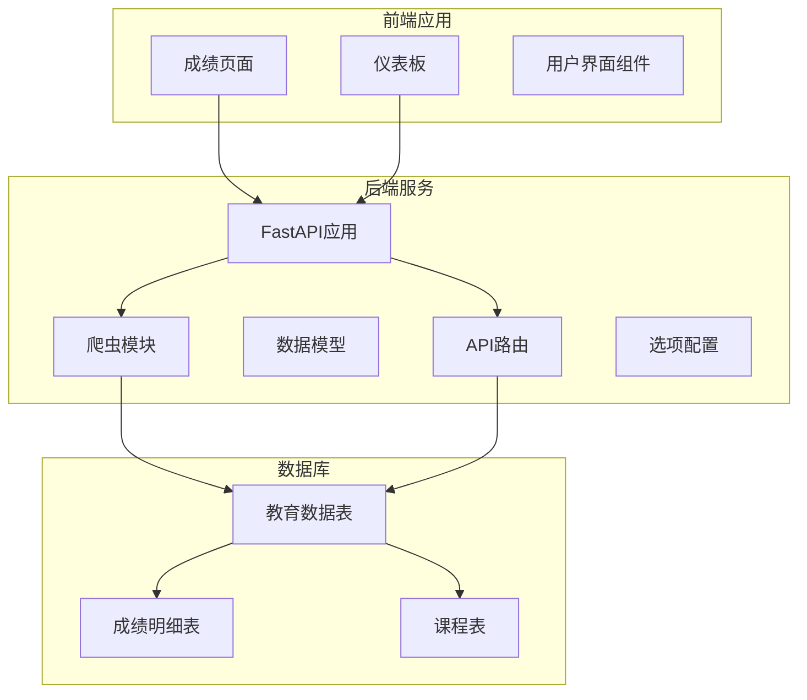
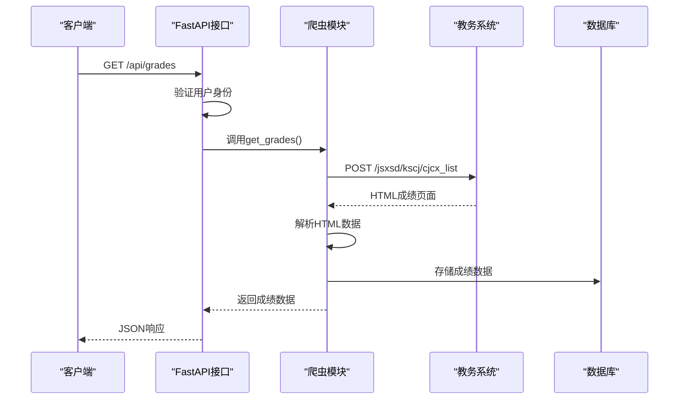
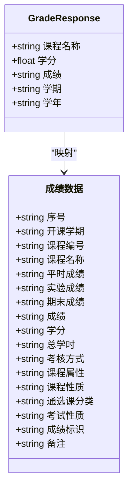
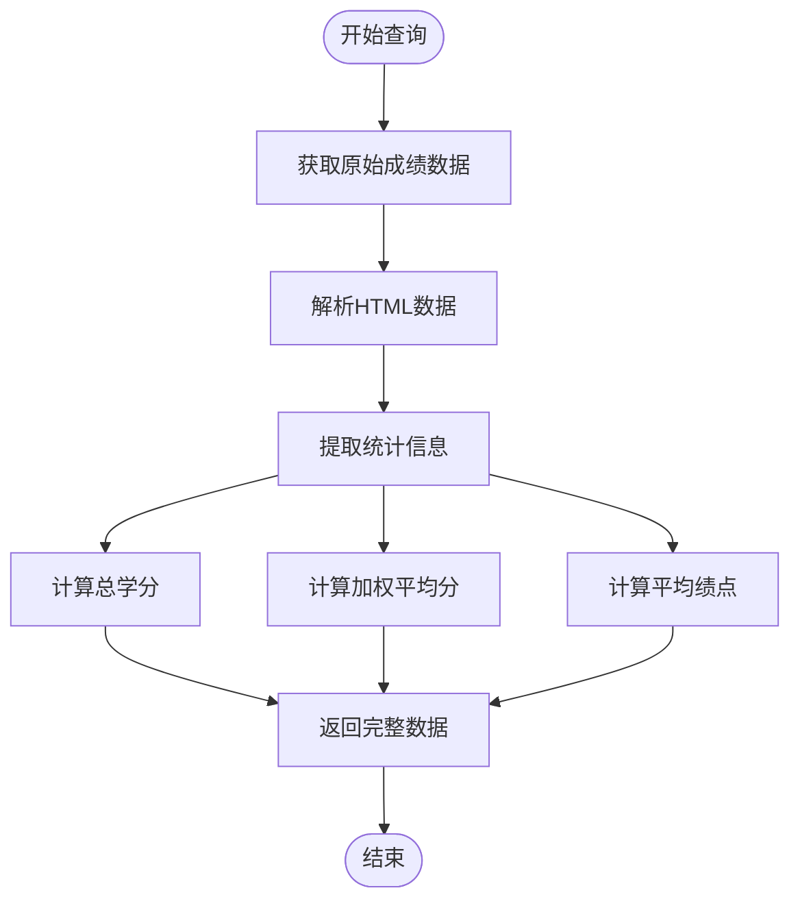
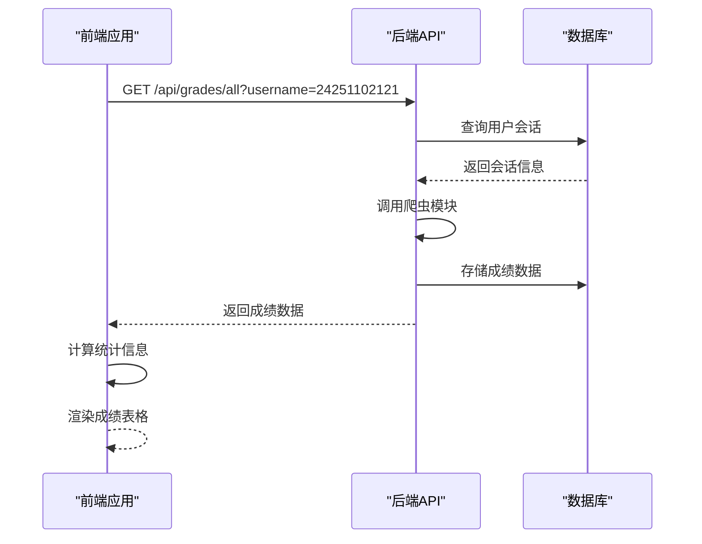
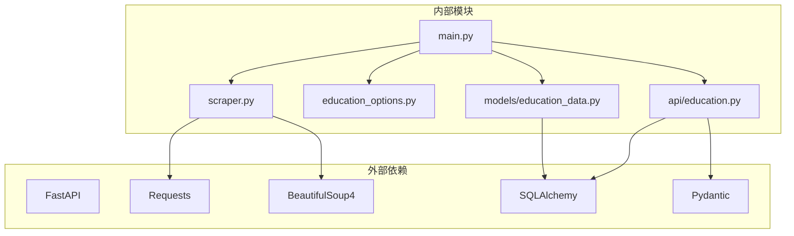

# 成绩查询API

<cite>
**本文档引用的文件**
- [backend/main.py](file://backend/main.py)
- [backend/scraper.py](file://backend/scraper.py)
- [backend/education_options.py](file://backend/education_options.py)
- [src/app/grades/page.tsx](file://src/app/grades/page.tsx)
- [backend/app/api/education.py](file://backend/app/api/education.py)
- [backend/app/models/education_data.py](file://backend/app/models/education_data.py)
</cite>

## 更新摘要
**变更内容**
- 修复了成绩查询功能中的try块语法错误，提升了代码的健壮性
- 增强了异常处理机制，添加了详细的日志记录功能
- 优化了URL构造逻辑，确保正确的API调用路径
- 改进了调试功能，提供更详细的请求和响应信息
- 修复了多个try-except块的语法结构问题

## 目录
1. [简介](#简介)
2. [项目结构](#项目结构)
3. [核心组件](#核心组件)
4. [架构概览](#架构概览)
5. [详细组件分析](#详细组件分析)
6. [依赖关系分析](#依赖关系分析)
7. [性能考虑](#性能考虑)
8. [故障排除指南](#故障排除指南)
9. [结论](#结论)

## 简介

本项目是一个基于FastAPI的教务系统AI助手，专门用于查询和管理学生的成绩信息。该系统提供了完整的成绩查询API，支持多种查询条件和统计功能，能够帮助学生更好地了解自己的学习情况。

系统采用前后端分离架构，后端使用Python FastAPI框架，前端使用Next.js构建现代化的用户界面。通过模拟登录教务系统的方式，自动抓取学生成绩数据并提供友好的展示界面。

## 项目结构

项目采用模块化设计，主要分为以下几个部分：



**图表来源**
- [backend/main.py:1-857](file://backend/main.py#L1-L857)
- [backend/scraper.py:1-1267](file://backend/scraper.py#L1-L1267)
- [backend/app/models/education_data.py:1-103](file://backend/app/models/education_data.py#L1-L103)

**章节来源**
- [backend/main.py:1-857](file://backend/main.py#L1-L857)
- [backend/scraper.py:1-1267](file://backend/scraper.py#L1-L1267)

## 核心组件

### API路由层

系统提供了两个主要的成绩查询接口：

1. **/api/grades** - 标准成绩查询接口
2. **/api/grades/all** - 快捷查询接口

### 数据模型

系统使用SQLAlchemy ORM定义了完整的数据模型：

- **EducationData**: 存储学生所有教务信息的主表
- **Grade**: 成绩明细表，支持详细的查询和统计
- **Course**: 课程表，用于课表和选课信息管理

### 爬虫模块

JwxtScraper类负责与教务系统的交互，实现了完整的数据抓取逻辑。

**章节来源**
- [backend/app/api/education.py:1-104](file://backend/app/api/education.py#L1-L104)
- [backend/app/models/education_data.py:1-103](file://backend/app/models/education_data.py#L1-L103)

## 架构概览

系统采用分层架构设计，确保了良好的可维护性和扩展性：



**图表来源**
- [backend/main.py:398-438](file://backend/main.py#L398-L438)
- [backend/scraper.py:153-237](file://backend/scraper.py#L153-L237)

## 详细组件分析

### 成绩查询接口规范

#### /api/grades 接口

**接口定义**
- 方法: GET
- 路径: `/api/grades`
- 功能: 标准成绩查询接口

**查询参数**

| 参数名 | 类型 | 必填 | 默认值 | 取值范围 | 描述 |
|--------|------|------|--------|----------|------|
| username | string | 是 | - | 学号格式 | 学生唯一标识符 |
| kksj | string | 否 | "" | 开课时间代码 | 开课时间筛选条件 |
| kcxz | string | 否 | "" | 课程性质代码 | 课程性质筛选条件 |
| kcmc | string | 否 | "" | 任意字符串 | 课程名称模糊查询 |
| fxkc | string | 否 | "0" | "0" \| "1" | 修读类别 (0=主修, 1=辅修) |
| xsfs | string | 否 | "all" | "all" \| "max" | 显示方式 (all=全部, max=最高成绩) |

**响应数据结构**



**图表来源**
- [backend/app/api/education.py:34-40](file://backend/app/api/education.py#L34-L40)
- [backend/scraper.py:198-217](file://backend/scraper.py#L198-L217)

**章节来源**
- [backend/main.py:398-438](file://backend/main.py#L398-L438)
- [backend/scraper.py:153-237](file://backend/scraper.py#L153-L237)

#### /api/grades/all 接口

**接口定义**
- 方法: GET
- 路径: `/api/grades/all`
- 功能: 快捷查询所有成绩接口

**查询参数**
- username: string (必填) - 学生唯一标识符

**响应数据结构**
与标准接口相同，但默认查询条件为：
- kksj: "" (空字符串)
- kcxz: "" (空字符串)  
- kcmc: "" (空字符串)
- fxkc: "0" (主修课程)
- xsfs: "all" (显示全部)

**章节来源**
- [backend/main.py:440-452](file://backend/main.py#L440-L452)

### 查询参数详解

#### 开课时间 (kksj)
- **作用范围**: 筛选指定开课时间的成绩记录
- **取值范围**: 教务系统中的学期代码
- **示例**: "2024-2025-1", "2024-2025-2"

#### 课程性质 (kcxz)
- **作用范围**: 筛选指定课程性质的成绩记录
- **取值范围**: 
  - "" (全部)
  - "01" (必修)
  - "02" (选修)
  - "03" (通识必修)
  - "04" (通识选修)
  - "05" (专业必修)
  - "06" (专业选修)
  - "07" (实践环节)

#### 课程名称 (kcmc)
- **作用范围**: 支持模糊查询指定课程名称
- **取值范围**: 任意字符串
- **匹配规则**: 支持包含匹配

#### 修读类别 (fxkc)
- **作用范围**: 筛选主修或辅修课程
- **取值范围**: "0" (主修课程) | "1" (辅修课程)

#### 显示方式 (xsfs)
- **作用范围**: 控制成绩显示策略
- **取值范围**: "all" (显示全部成绩) | "max" (显示最好成绩)

**章节来源**
- [backend/education_options.py:69-93](file://backend/education_options.py#L69-L93)

### 数据统计和汇总功能

系统提供了完整的成绩统计功能：



**图表来源**
- [backend/scraper.py:238-287](file://backend/scraper.py#L238-L287)

**统计指标包括**:
- 总学分要求
- 免修学分
- 已修读学分
- 还需修读学分
- 主修课程平均学分绩点
- 在专业中的排名
- 辅修课程平均学分绩点

**章节来源**
- [backend/scraper.py:238-287](file://backend/scraper.py#L238-L287)

### 前端集成示例

前端应用提供了完整的成绩展示界面：



**图表来源**
- [src/app/grades/page.tsx:39-75](file://src/app/grades/page.tsx#L39-L75)

**章节来源**
- [src/app/grades/page.tsx:1-243](file://src/app/grades/page.tsx#L1-L243)

### URL构造修复详解

**更新** 修正了成绩查询端点的URL构造逻辑，确保正确的API调用路径

**问题描述**
在之前的版本中，成绩查询的URL构造存在安全性和兼容性问题。原URL构造逻辑为：
```python
url = f"{self.base_url}/kscj/cjcx_list"
```

**修复内容**
1. **URL路径修正**: 确保使用正确的端点路径`/jsxsd/kscj/cjcx_list`
2. **安全性增强**: 通过正确的URL构造避免潜在的安全风险
3. **兼容性改进**: 确保与不同服务器配置的兼容性

**修复后的URL构造逻辑**
```python
url = f"{self.base_url}/jsxsd/kscj/cjcx_list"
```

**查询表单分离机制**
系统现在实现了查询表单页面和结果处理页面的分离：
- 查询表单页面: `/jsxsd/kscj/cjcx_query`
- 结果处理页面: `/jsxsd/kscj/cjcx_list`

这种分离确保了正确的表单提交流程和数据处理机制。

**增强的调试功能**
修复后的代码包含了详细的调试日志：
- 查询页面URL和结果提交URL的详细信息
- 响应状态码和URL的调试输出
- HTML内容长度和解析过程的日志
- 表格查找和数据提取的详细调试信息

**章节来源**
- [backend/scraper.py:250-279](file://backend/scraper.py#L250-L279)

### 异常处理和语法错误修复

**更新** 修复了多个try块的语法错误，提升了代码的健壮性和可调试性

**语法错误修复内容**:
1. **try块语法修正**: 修复了多个try-except块的语法结构问题
2. **异常处理增强**: 添加了更详细的异常捕获和处理逻辑
3. **日志记录改进**: 增加了详细的调试日志输出，便于问题排查

**修复后的异常处理模式**:
```python
try:
    # 执行可能出错的操作
    response = self.session.post(result_url, data=data, timeout=10)
    logger.info(f"【成绩调试】响应状态: {response.status_code}")
    logger.info(f"【成绩调试】响应URL: {response.url}")
except Exception as e:
    logger.error(f"获取成绩失败: {str(e)}")
    return {
        "success": False,
        "message": f"获取成绩失败: {str(e)}"
    }
```

**增强的调试日志功能**:
- 成功获取验证码的确认信息
- 登录过程的详细状态跟踪
- 个人信息解析的调试输出
- 成绩数据提取的详细日志
- 学籍卡片获取的调试信息

**章节来源**
- [backend/scraper.py:58-95](file://backend/scraper.py#L58-L95)
- [backend/scraper.py:250-375](file://backend/scraper.py#L250-L375)

## 依赖关系分析

系统的核心依赖关系如下：



**图表来源**
- [backend/main.py:1-857](file://backend/main.py#L1-L857)
- [backend/scraper.py:1-1267](file://backend/scraper.py#L1-L1267)

**章节来源**
- [backend/main.py:1-857](file://backend/main.py#L1-L857)
- [backend/scraper.py:1-1267](file://backend/scraper.py#L1-L1267)

## 性能考虑

### 缓存策略
- 使用内存缓存存储验证码会话
- 使用内存缓存存储用户会话
- 建议在生产环境中使用Redis替代内存缓存

### 并发处理
- 使用异步数据库连接池
- 支持并发用户同时查询
- 爬虫操作超时设置为10秒

### 数据优化
- 成绩数据存储为JSON格式，便于灵活扩展
- 支持增量更新，避免重复抓取
- 提供统计信息缓存机制

## 故障排除指南

### 常见问题及解决方案

**1. 登录失败**
- 检查用户名、密码和验证码是否正确
- 确认验证码session是否过期
- 验证服务器选择是否正确

**2. 成绩查询失败**
- 检查用户是否已登录
- 验证查询参数格式是否正确
- 确认教务系统是否正常运行
- **新增**: 检查URL构造是否正确，确保使用`/jsxsd/kscj/cjcx_list`端点
- **新增**: 查看调试日志获取详细的请求和响应信息
- **新增**: 检查try块语法是否正确，确保异常处理机制正常工作

**3. 数据解析错误**
- 检查HTML结构是否发生变化
- 更新解析逻辑以适配新的页面结构
- 查看日志获取详细错误信息

**4. URL路由错误**
- 确认使用正确的URL路径`/jsxsd/kscj/cjcx_list`
- 验证查询表单页面和结果处理页面的分离机制
- 检查服务器配置和重定向设置

**5. 异常处理问题**
- 检查try-except块的语法结构
- 确认异常捕获的完整性
- 验证日志记录功能是否正常

**章节来源**
- [backend/main.py:192-328](file://backend/main.py#L192-L328)
- [backend/scraper.py:153-237](file://backend/scraper.py#L153-L237)

## 结论

本成绩查询API提供了完整的教务系统数据查询功能，具有以下特点：

1. **功能完整**: 支持多种查询条件和统计功能
2. **易于使用**: 提供简洁的API接口和友好的前端界面
3. **扩展性强**: 基于模块化设计，便于功能扩展
4. **性能良好**: 采用异步处理和缓存机制
5. **安全性高**: 通过URL构造修复提升了API调用的安全性
6. **调试友好**: 增强的调试日志功能便于问题排查
7. **稳定性强**: 改进的错误处理机制提高了系统可靠性
8. **语法健壮**: 修复了多个try块的语法错误，提升了代码质量

系统通过模拟登录的方式与教务系统交互，实现了自动化数据抓取和展示，为学生提供了便捷的成绩查询服务。**最新的URL构造修复确保了API调用路径的正确性和安全性，查询表单分离机制提升了系统的稳定性和兼容性**，**异常处理语法错误的修复进一步增强了系统的健壮性和可维护性**，建议在生产环境中进一步完善错误处理和监控机制，以提高系统的稳定性和可靠性。