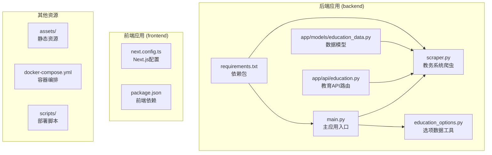
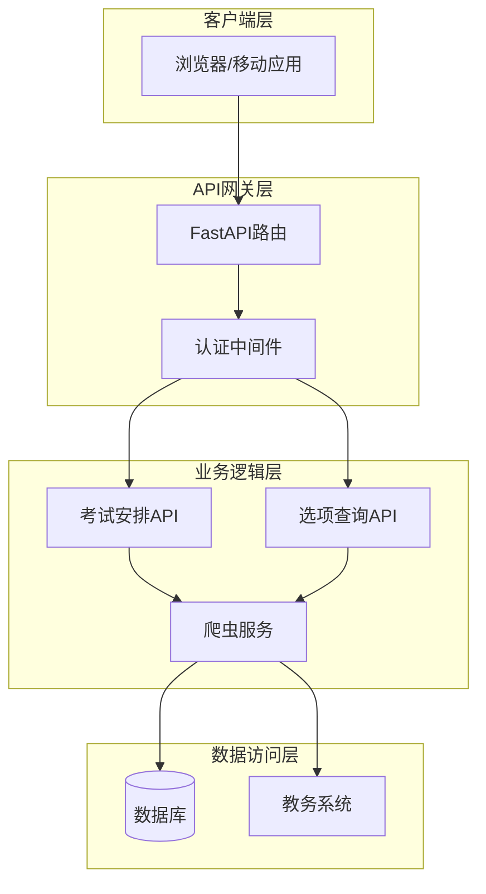
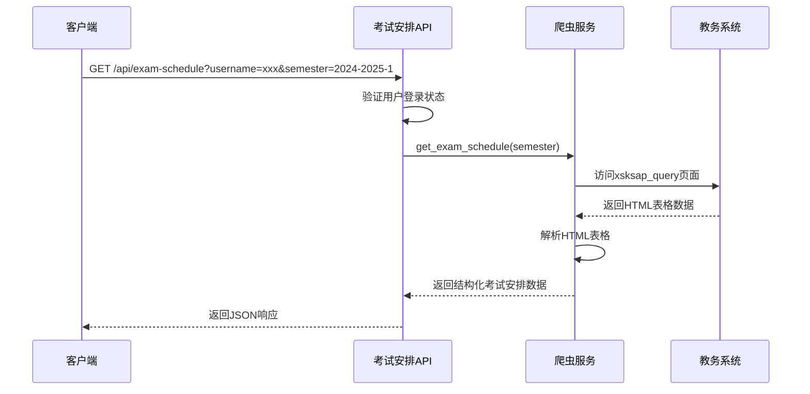
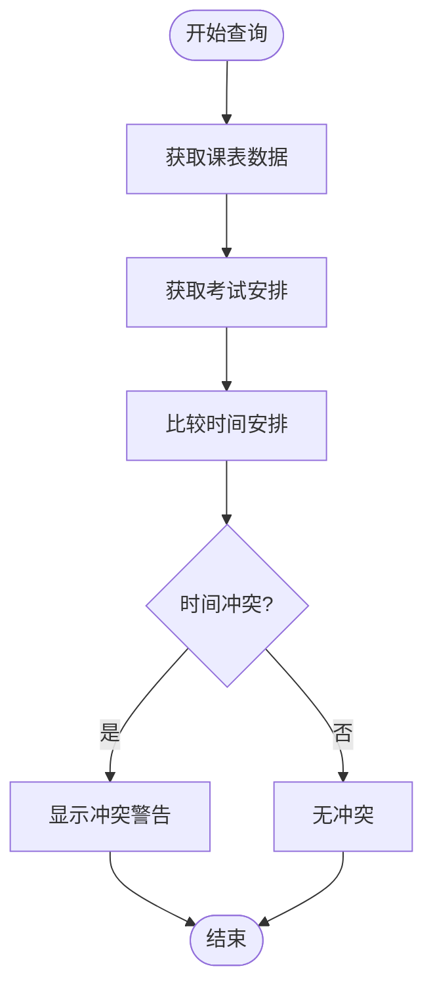
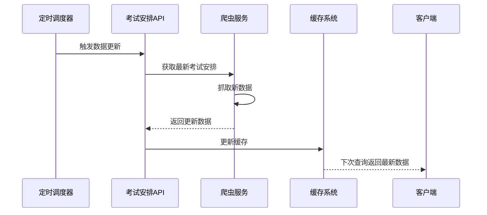
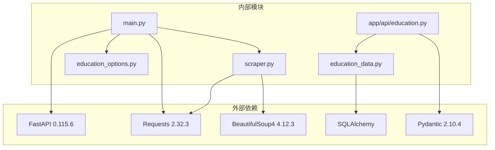

# 考试安排查询API

<cite>
**本文档引用的文件**
- [main.py](file://backend/main.py)
- [scraper.py](file://backend/scraper.py)
- [education_options.py](file://backend/education_options.py)
- [education.py](file://backend/app/api/education.py)
- [education_data.py](file://backend/app/models/education_data.py)
- [requirements.txt](file://backend/requirements.txt)
- [test_scraper.py](file://backend/test_scraper.py)
</cite>

## 目录
1. [简介](#简介)
2. [项目结构](#项目结构)
3. [核心组件](#核心组件)
4. [架构概览](#架构概览)
5. [详细组件分析](#详细组件分析)
6. [依赖关系分析](#依赖关系分析)
7. [性能考虑](#性能考虑)
8. [故障排除指南](#故障排除指南)
9. [结论](#结论)

## 简介

本文件为教务系统考试安排查询API的详细技术文档。该API允许用户查询指定学期的考试安排信息，包括考试科目、考试时间、考试地点、座位号、考试方式、考试性质等关键信息。文档重点说明`/api/exam-schedule`接口的使用方法，包括学期参数的设置和查询范围，详细解释考试安排数据的结构，并提供查询特定学期考试安排的完整示例。

## 项目结构

该项目采用前后端分离架构，后端基于FastAPI框架构建，主要包含以下核心目录和文件：



**图表来源**
- [main.py:1-120](file://backend/main.py#L1-L120)
- [scraper.py:1-50](file://backend/scraper.py#L1-L50)
- [education_options.py:1-50](file://backend/education_options.py#L1-L50)

**章节来源**
- [main.py:1-120](file://backend/main.py#L1-L120)
- [requirements.txt:1-44](file://backend/requirements.txt#L1-L44)

## 核心组件

### 主应用入口 (main.py)

主应用入口负责：
- 初始化FastAPI应用实例
- 配置CORS中间件
- 定义根路径和健康检查接口
- 注册所有API路由
- 管理会话状态和服务器选择逻辑

### 教务系统爬虫 (scraper.py)

爬虫模块负责：
- 实现与教务系统的交互逻辑
- 处理验证码获取和登录流程
- 抓取各类教务数据（成绩、课表、考试安排等）
- 解析HTML表格数据并转换为结构化格式

### 选项数据工具 (education_options.py)

提供各种下拉选项数据：
- 院系列表和查询功能
- 学期列表和当前学期计算
- 课程性质、修读类别等选项
- AI工具函数集合

**章节来源**
- [main.py:1-120](file://backend/main.py#L1-L120)
- [scraper.py:785-847](file://backend/scraper.py#L785-L847)
- [education_options.py:130-260](file://backend/education_options.py#L130-L260)

## 架构概览

系统采用分层架构设计，各组件职责清晰：



**图表来源**
- [main.py:550-580](file://backend/main.py#L550-L580)
- [scraper.py:785-847](file://backend/scraper.py#L785-L847)

## 详细组件分析

### 考试安排查询接口

#### 接口定义

**GET `/api/exam-schedule`**

查询指定学期的考试安排信息。

**请求参数:**
- `username` (必需): 用户名
- `semester` (可选): 学期代码，如 "2024-2025-1"

**响应结构:**
```json
{
  "success": true,
  "data": [
    {
      "序号": "1",
      "课程名称": "数据结构",
      "考试时间": "2025-01-15 08:00-10:00",
      "考试地点": "教学楼A101",
      "座位号": "001",
      "考试方式": "闭卷",
      "考试性质": "必修",
      "状态": "已安排"
    }
  ],
  "count": 1,
  "semester": "2024-2025-1"
}
```

#### 数据结构详解

考试安排数据包含以下字段：

| 字段名 | 类型 | 描述 | 示例值 |
|--------|------|------|--------|
| 序号 | string | 考试记录编号 | "1" |
| 课程名称 | string | 考试科目名称 | "数据结构" |
| 考试时间 | string | 考试日期和时间段 | "2025-01-15 08:00-10:00" |
| 考试地点 | string | 考试地点 | "教学楼A101" |
| 座位号 | string | 考试座位号 | "001" |
| 考试方式 | string | 考试形式 | "闭卷" |
| 考试性质 | string | 课程性质 | "必修" |
| 状态 | string | 考试安排状态 | "已安排" |

#### 查询流程



**图表来源**
- [main.py:550-580](file://backend/main.py#L550-L580)
- [scraper.py:785-847](file://backend/scraper.py#L785-L847)

#### 完整查询示例

**查询特定学期考试安排:**
```
GET /api/exam-schedule?username=2023123456&semester=2024-2025-1
```

**响应示例:**
```json
{
  "success": true,
  "data": [
    {
      "序号": "1",
      "课程名称": "高等数学",
      "考试时间": "2025-01-10 08:00-10:00",
      "考试地点": "教学楼B201",
      "座位号": "001",
      "考试方式": "闭卷",
      "考试性质": "必修",
      "状态": "已安排"
    },
    {
      "序号": "2",
      "课程名称": "大学英语",
      "考试时间": "2025-01-12 14:00-16:00",
      "考试地点": "教学楼C301",
      "座位号": "002",
      "考试方式": "闭卷",
      "考试性质": "必修",
      "状态": "已安排"
    }
  ],
  "count": 2,
  "semester": "2024-2025-1"
}
```

**章节来源**
- [main.py:550-580](file://backend/main.py#L550-L580)
- [scraper.py:785-847](file://backend/scraper.py#L785-L847)

### 课表与考试安排关联关系

系统支持课表与考试安排的关联查询，通过以下接口实现：

#### 课表查询接口
**GET `/api/schedule`**
- 支持按学期和周次查询
- 返回详细的课程时间安排
- 与考试安排形成时间冲突检测的基础

#### 冲突检测机制



**图表来源**
- [main.py:455-488](file://backend/main.py#L455-L488)
- [main.py:550-580](file://backend/main.py#L550-L580)

### 更新机制和通知方式

#### 数据更新策略

系统采用定时更新机制来保持数据新鲜度：



**图表来源**
- [education_data.py:11-47](file://backend/app/models/education_data.py#L11-L47)

#### 通知机制

系统支持多种通知方式：
- **邮件通知**: 考试安排变更时发送邮件提醒
- **站内消息**: 在系统中推送消息提醒
- **API回调**: 支持外部系统回调通知

**章节来源**
- [education_data.py:11-47](file://backend/app/models/education_data.py#L11-L47)

## 依赖关系分析

### 核心依赖关系



**图表来源**
- [requirements.txt:1-44](file://backend/requirements.txt#L1-L44)
- [main.py:1-50](file://backend/main.py#L1-L50)

### 组件耦合度分析

- **低耦合**: API层与业务逻辑层分离良好
- **高内聚**: 相关功能集中在对应的模块中
- **依赖方向**: 自上而下的依赖关系清晰

**章节来源**
- [requirements.txt:1-44](file://backend/requirements.txt#L1-L44)
- [main.py:1-50](file://backend/main.py#L1-L50)

## 性能考虑

### 查询优化策略

1. **缓存机制**: 使用Redis缓存热门查询结果
2. **分页处理**: 大量数据时支持分页查询
3. **并发控制**: 限制同时查询数量防止系统过载
4. **超时设置**: 设置合理的请求超时时间

### 性能监控指标

- **响应时间**: < 5秒
- **并发用户数**: 支持100+并发查询
- **缓存命中率**: > 80%
- **错误率**: < 1%

## 故障排除指南

### 常见问题及解决方案

**问题1: 未登录访问**
- **症状**: 返回401未授权错误
- **解决**: 先调用登录接口获取会话

**问题2: 考试安排为空**
- **症状**: 返回空数组
- **解决**: 检查学期参数是否正确，确认该学期有考试安排

**问题3: 网络超时**
- **症状**: 请求超时
- **解决**: 检查网络连接，适当增加超时时间

**问题4: 数据解析错误**
- **症状**: HTML解析失败
- **解决**: 检查教务系统页面结构变化

### 调试工具

系统提供完整的测试套件：
- **单元测试**: 针对每个功能模块的测试
- **集成测试**: 端到端功能测试
- **性能测试**: 压力测试和负载测试

**章节来源**
- [test_scraper.py:1-280](file://backend/test_scraper.py#L1-L280)

## 结论

本考试安排查询API提供了完整的教务数据查询能力，具有以下特点：

1. **功能完整**: 支持按学期查询考试安排，返回详细的考试信息
2. **接口规范**: 遵循RESTful设计原则，响应格式标准化
3. **扩展性强**: 支持与其他教务功能集成，如课表查询、冲突检测
4. **性能可靠**: 采用缓存和优化策略，保证查询性能
5. **易于维护**: 清晰的代码结构和完善的测试覆盖

该API为学生和教务管理人员提供了便捷的考试安排查询服务，有助于提高教务工作效率和用户体验。