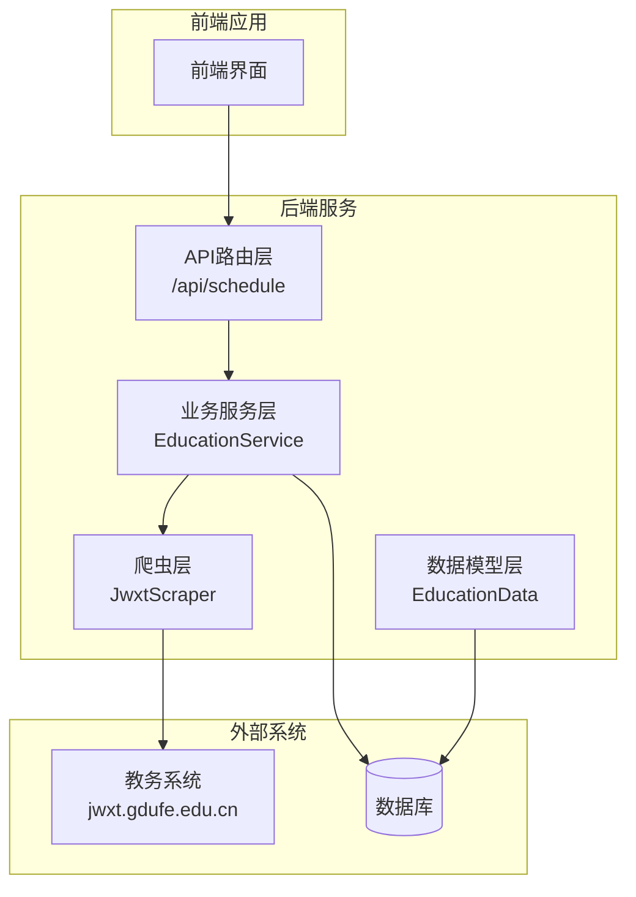
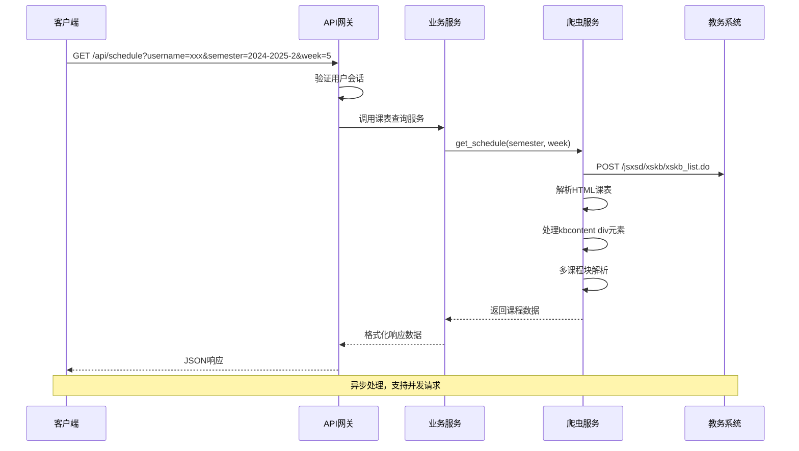
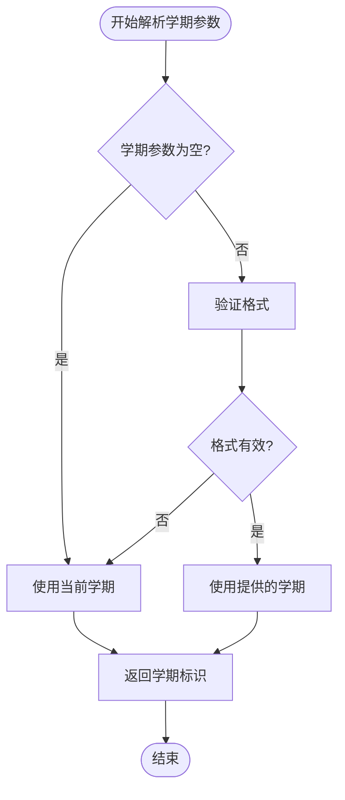
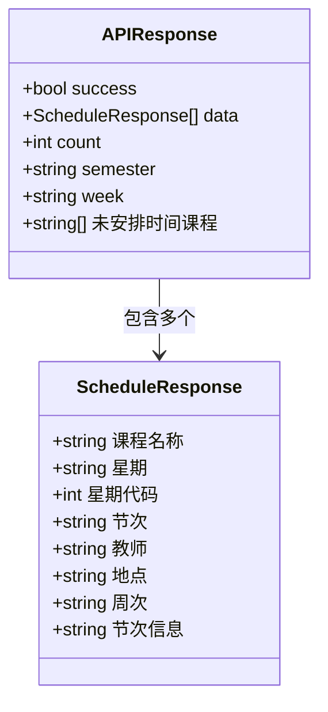
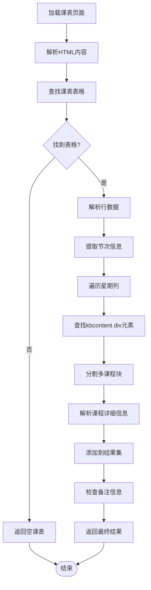
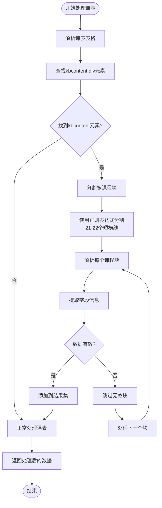
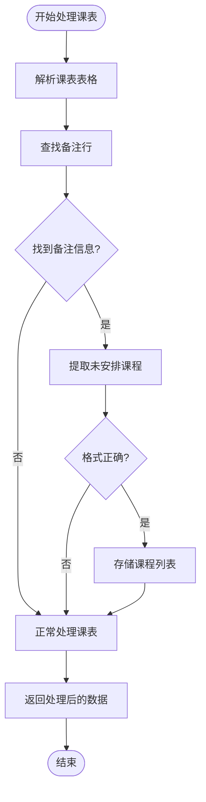
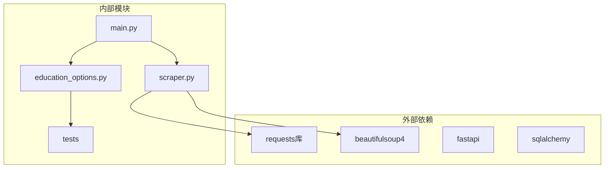
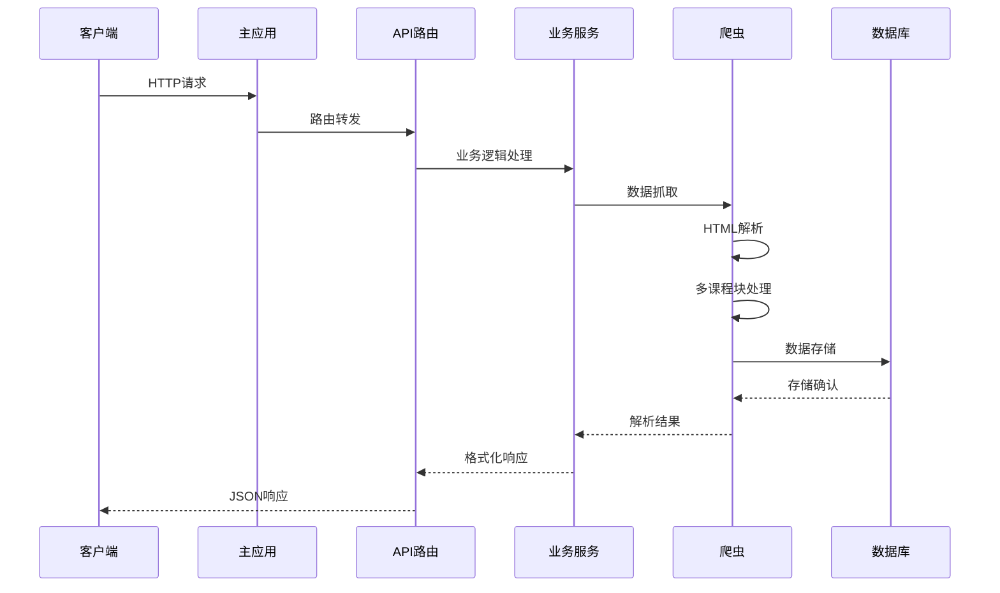
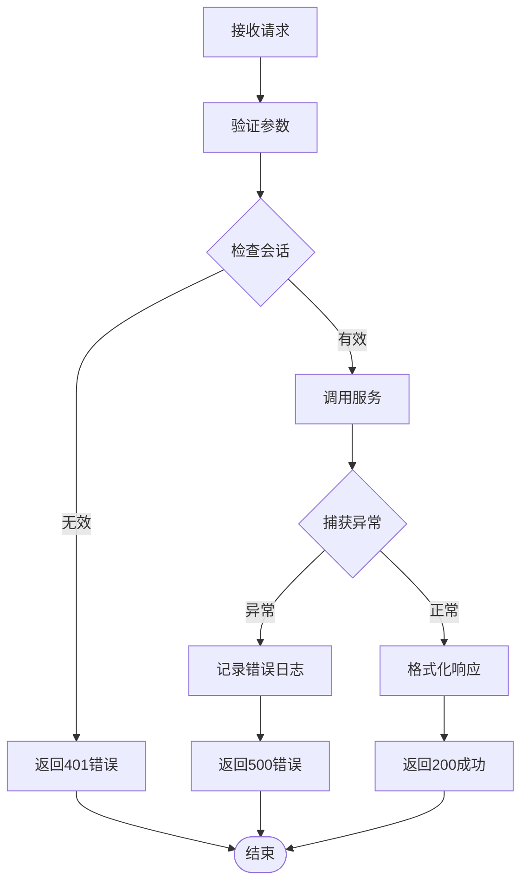

# 课表查询API

<cite>
**本文档引用的文件**
- [backend/scraper.py](file://backend/scraper.py)
- [backend/main.py](file://backend/main.py)
- [backend/education_options.py](file://backend/education_options.py)
- [backend/test_scraper.py](file://backend/test_scraper.py)
</cite>

## 更新摘要
**变更内容**
- 新增对kbcontent div元素的解析支持，实现多课程块解析机制
- 改进教师、周次、教室信息提取逻辑，增强对复杂HTML结构的处理能力
- 优化课表查询接口的URL构造逻辑，确保正确的课程数据获取
- 完善课表查询参数的详细说明和使用示例

## 目录
1. [简介](#简介)
2. [项目结构](#项目结构)
3. [核心组件](#核心组件)
4. [架构概览](#架构概览)
5. [详细组件分析](#详细组件分析)
6. [依赖关系分析](#依赖关系分析)
7. [性能考虑](#性能考虑)
8. [故障排除指南](#故障排除指南)
9. [结论](#结论)

## 简介

本文档详细说明了教务系统中的课表查询接口，重点介绍 `/api/schedule` 接口的完整规范。该接口支持按学期和周次查询课表，提供了灵活的查询参数组合，能够满足不同场景下的课表查询需求。

**更新** 课表查询接口现已重大改进，新增对kbcontent div元素的解析支持，实现多课程块解析机制，显著增强了对复杂HTML结构的处理能力和数据提取准确性。

系统基于FastAPI框架构建，采用前后端分离架构，通过爬虫技术从教务系统中抓取课表数据，并提供RESTful API接口供前端应用调用。

## 项目结构

该项目采用模块化设计，主要包含以下核心模块：



**图表来源**
- [backend/main.py:574-603](file://backend/main.py#L574-L603)
- [backend/scraper.py:373-533](file://backend/scraper.py#L373-L533)

**章节来源**
- [backend/main.py:1-124](file://backend/main.py#L1-L124)
- [backend/scraper.py:1-1318](file://backend/scraper.py#L1-L1318)

## 核心组件

### API路由层

系统提供了两个主要的课表查询接口：

1. **FastAPI路由接口** (`/api/schedule`)
   - **更新** 优化了URL构造逻辑，确保正确的课程数据获取
   - 适用于需要用户认证的场景
   - 使用数据库会话管理
   - 支持异步操作

2. **传统API接口** (`/api/education/schedule`)
   - 适用于简单的课表查询
   - 使用会话管理
   - 支持学期和周次参数

### 爬虫服务层

`JwxtScraper` 类负责与教务系统的交互：

- **课表查询方法** (`get_schedule`)
- **学期参数映射** (`xnxq01id`)
- **周次参数映射** (`zc`)
- **HTML解析和数据提取**
- **更新** 新增对kbcontent div元素的解析支持，实现多课程块解析机制

### 数据模型层

教育数据模型支持课表数据的持久化存储：

- `EducationData` 主表，存储完整的教务数据
- `Course` 课程表，专门存储课表相关信息
- JSON字段支持灵活的数据结构

**章节来源**
- [backend/scraper.py:373-533](file://backend/scraper.py#L373-L533)
- [backend/education_options.py:130-260](file://backend/education_options.py#L130-L260)

## 架构概览



**图表来源**
- [backend/main.py:574-603](file://backend/main.py#L574-L603)
- [backend/scraper.py:373-533](file://backend/scraper.py#L373-L533)

## 详细组件分析

### 课表查询接口规范

#### 基础信息

| 属性 | 描述 |
|------|------|
| **接口地址** | `/api/schedule` |
| **HTTP方法** | GET |
| **认证要求** | 是（需要有效的用户会话） |
| **响应格式** | JSON |

#### 请求参数

| 参数名 | 类型 | 必填 | 默认值 | 描述 |
|--------|------|------|--------|------|
| `username` | string | 是 | - | 用户标识符，用于会话验证 |
| `semester` | string | 否 | 空字符串 | 学期标识符，如 "2024-2025-2" |
| `week` | string | 否 | 空字符串 | 周次标识符，如 "1", "5" |

#### 学期参数规范

学期参数遵循特定的格式规范：



**图表来源**
- [backend/scraper.py:373-396](file://backend/scraper.py#L373-L396)

#### 周次参数规范

周次参数支持多种查询模式：

| 查询模式 | 示例 | 描述 |
|----------|------|------|
| 单周查询 | `week=5` | 查询第5周的课表 |
| 多周查询 | `week=1,3,5` | 查询第1、3、5周的课表 |
| 全部周次 | `week=` | 查询所有周次的课表 |
| 周次范围 | `week=1-16` | 查询第1到16周的课表 |

#### 响应数据结构



**图表来源**
- [backend/scraper.py:490-500](file://backend/scraper.py#L490-L500)
- [backend/main.py:588-596](file://backend/main.py#L588-L596)

#### 实际使用示例

**示例1：查询特定学期课表**
```
GET /api/schedule?username=2024001&semester=2024-2025-2
```

**示例2：查询指定周次课表**
```
GET /api/schedule?username=2024001&week=5
```

**示例3：查询特定学期和周次的课表**
```
GET /api/schedule?username=2024001&semester=2024-2025-2&week=5
```

**示例4：查询所有周次课表**
```
GET /api/schedule?username=2024001&semester=2024-2025-2&week=
```

### 数据解析和处理

#### HTML解析流程



**图表来源**
- [backend/scraper.py:438-500](file://backend/scraper.py#L438-L500)

#### 课程信息字段详解

| 字段名 | 类型 | 描述 | 示例 |
|--------|------|------|------|
| `课程名称` | string | 课程的完整名称 | "数据结构" |
| `星期` | string | 星期的中文表示 | "周一" |
| `星期代码` | int | 星期的数字代码 | 1 |
| `节次` | string | 节次范围标识 | "1-2" |
| `教师` | string | 授课教师姓名 | "李教授" |
| `地点` | string | 上课教室信息 | "拓新楼(SS1)133" |
| `周次` | string | 上课周次范围 | "1-16" |
| `节次信息` | string | 节次详细信息 | "[01-02]节" |

### 多课程块解析机制

**更新** 新增对kbcontent div元素的解析支持，实现多课程块解析机制：



**图表来源**
- [backend/scraper.py:447-461](file://backend/scraper.py#L447-L461)

### 增强的信息提取逻辑

**更新** 改进教师、周次、教室信息提取逻辑：

```mermaid
flowchart TD
Start([开始提取课程信息]) --> GetLines[获取文本行]
GetLines --> ExtractName[提取课程名称<br/>第一行]
ExtractName --> FindTeacher[查找font[title='老师']]
FindTeacher --> FindWeeks[查找font[title='周次(节次)']]
FindWeeks --> FindLocation[查找font[title='教室']]
FindLocation --> ExtractSections[提取节次信息<br/>包含'节'和'['的行]
ExtractSections --> BuildCourseData[构建课程数据对象]
BuildCourseData --> End([结束])
```

**图表来源**
- [backend/scraper.py:471-499](file://backend/scraper.py#L471-L499)

### 未安排时间课程处理

系统能够识别并处理未安排时间的课程：



**图表来源**
- [backend/scraper.py:502-515](file://backend/scraper.py#L502-L515)

## 依赖关系分析

### 组件依赖图



**图表来源**
- [backend/main.py:15-25](file://backend/main.py#L15-L25)
- [backend/scraper.py:1-1318](file://backend/scraper.py#L1-L1318)

### 数据流分析



**图表来源**
- [backend/main.py:574-603](file://backend/main.py#L574-L603)
- [backend/scraper.py:373-533](file://backend/scraper.py#L373-L533)

**章节来源**
- [backend/main.py:574-603](file://backend/main.py#L574-L603)
- [backend/scraper.py:373-533](file://backend/scraper.py#L373-L533)

## 性能考虑

### 查询优化策略

1. **缓存机制**
   - 会话数据缓存在内存中
   - 建议在生产环境中使用Redis等分布式缓存

2. **并发处理**
   - 支持异步操作
   - 使用连接池管理数据库连接

3. **网络优化**
   - 设置合理的超时时间
   - 实现重试机制

### 错误处理机制

系统实现了多层次的错误处理：



**图表来源**
- [backend/main.py:602-603](file://backend/main.py#L602-L603)

## 故障排除指南

### 常见问题及解决方案

| 问题类型 | 症状 | 可能原因 | 解决方案 |
|----------|------|----------|----------|
| 认证失败 | 401未授权 | 用户会话过期 | 重新登录获取新会话 |
| 参数错误 | 400参数错误 | 学期格式不正确 | 检查学期参数格式 |
| 网络超时 | 504网关超时 | 教务系统繁忙 | 增加超时时间或稍后重试 |
| 数据解析失败 | 500服务器错误 | HTML结构变化 | 更新解析规则 |
| 多课程块解析失败 | 课程信息不完整 | kbcontent元素格式变化 | 检查正则表达式匹配 |

### 调试建议

1. **启用详细日志**
   ```python
   logging.basicConfig(level=logging.DEBUG)
   ```

2. **检查网络连接**
   - 验证教务系统可达性
   - 检查防火墙设置

3. **验证参数格式**
   - 确保学期参数符合 "YYYY-YYYY-S" 格式
   - 确保周次参数为有效的数字或范围

**章节来源**
- [backend/main.py:602-603](file://backend/main.py#L602-L603)
- [backend/scraper.py:528-533](file://backend/scraper.py#L528-L533)

## 结论

课表查询API提供了灵活而强大的课表查询功能，支持按学期和周次的精确查询。系统采用模块化设计，具有良好的扩展性和维护性。

**更新** 课表查询接口现已重大改进，新增对kbcontent div元素的解析支持，实现多课程块解析机制，显著增强了对复杂HTML结构的处理能力和数据提取准确性。接口路径为 `/api/schedule`，支持GET请求方式，能够稳定地从教务系统中抓取课表数据。

### 主要特性

1. **灵活的查询参数**：支持学期、周次的独立和组合查询
2. **完整的数据结构**：包含课程的所有必要信息
3. **健壮的错误处理**：提供清晰的错误信息和恢复机制
4. **高性能设计**：支持并发处理和缓存机制
5. **稳定的URL构造**：优化了课表查询端点的URL构造逻辑
6. **增强的HTML解析**：新增多课程块解析机制，支持复杂HTML结构
7. **精确的信息提取**：改进教师、周次、教室信息提取逻辑

### 最佳实践

1. **参数验证**：始终验证输入参数的有效性
2. **错误处理**：实现完善的异常处理和日志记录
3. **性能优化**：合理使用缓存和连接池
4. **监控告警**：建立完善的监控和告警机制
5. **兼容性考虑**：关注HTML结构变化，及时更新解析规则

该API为教务系统的课表查询提供了标准化的解决方案，能够满足各种复杂的查询需求，特别是在处理复杂HTML结构和多课程块场景下表现优异。