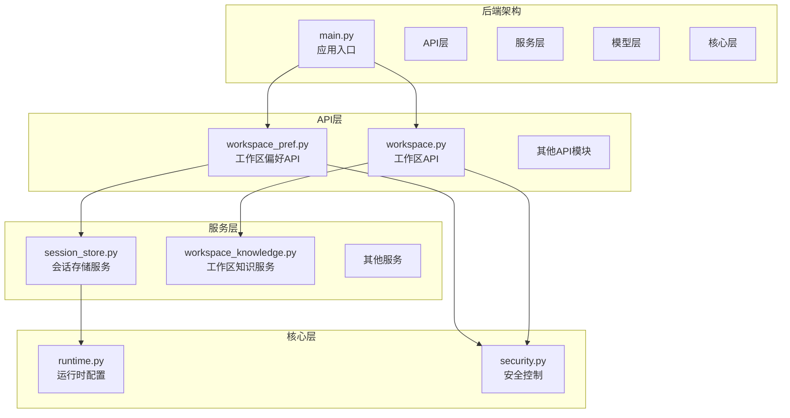
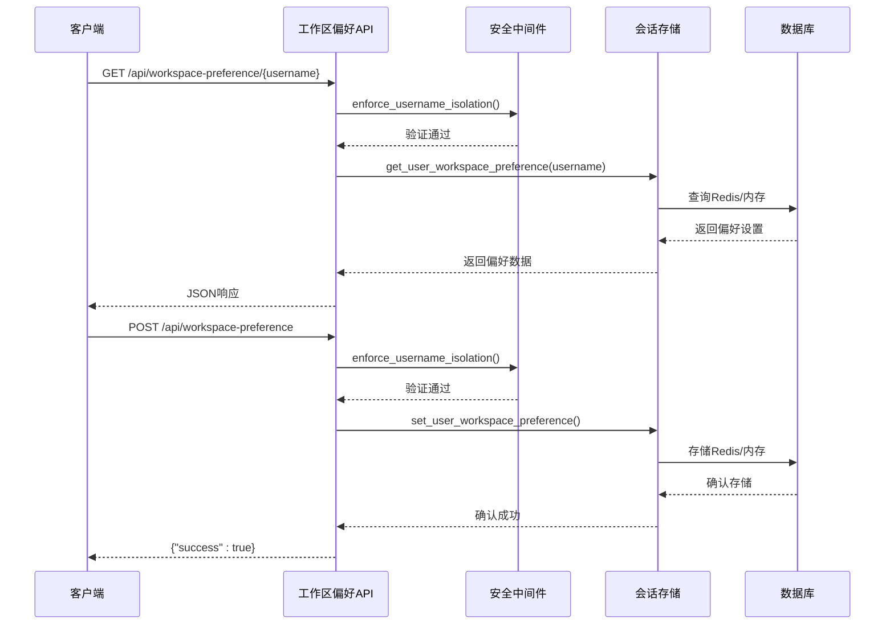
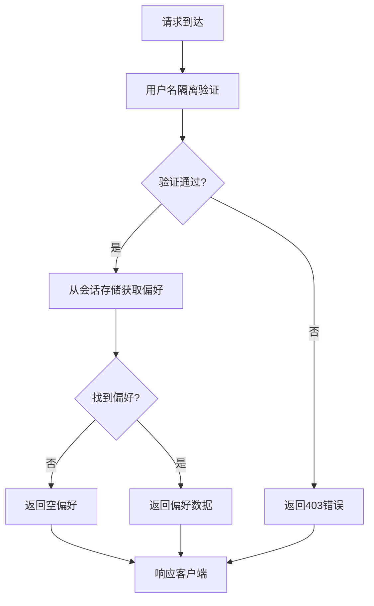
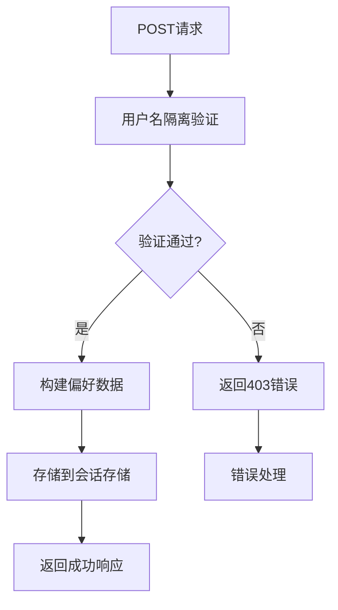
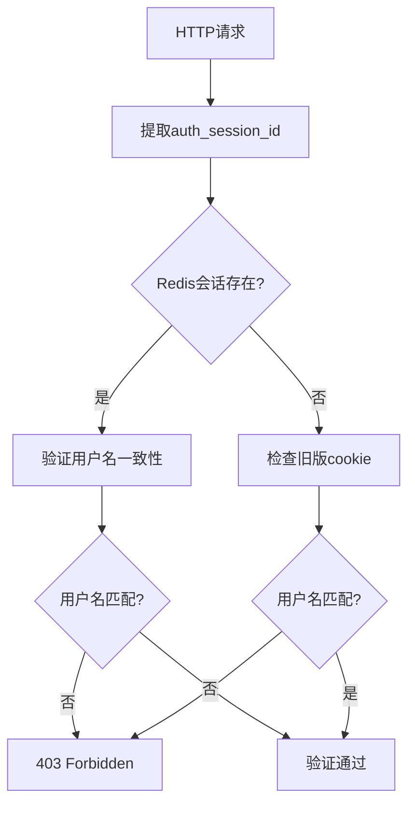
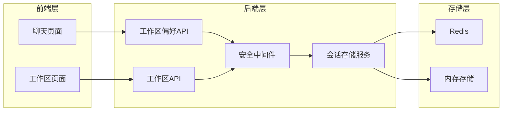

# 工作区偏好设置API

<cite>
**本文档引用的文件**
- [workspace_pref.py](file://backend/app/api/workspace_pref.py)
- [workspace.py](file://backend/app/api/workspace.py)
- [session_store.py](file://backend/app/services/session_store.py)
- [security.py](file://backend/app/security.py)
- [runtime.py](file://backend/app/core/runtime.py)
- [main.py](file://backend/main.py)
- [platform.py](file://backend/app/models/platform.py)
- [page.tsx](file://frontend/src/app/chat/page.tsx)
</cite>

## 目录
1. [简介](#简介)
2. [项目结构](#项目结构)
3. [核心组件](#核心组件)
4. [架构概览](#架构概览)
5. [详细组件分析](#详细组件分析)
6. [API规范](#api规范)
7. [数据流分析](#数据流分析)
8. [安全机制](#安全机制)
9. [性能考虑](#性能考虑)
10. [故障排除指南](#故障排除指南)
11. [结论](#结论)

## 简介

工作区偏好设置API是智能体构建平台中用于管理用户工作区选择偏好的核心组件。该API允许用户在多个工作区之间切换，并持久化其偏好设置，确保用户在不同会话中能够保持一致的工作区体验。

该系统采用前后端分离架构，后端基于FastAPI框架构建RESTful API，前端使用React Next.js实现用户界面。工作区偏好设置通过会话存储服务进行持久化，支持Redis和内存两种存储方式。

## 项目结构

智能体构建平台采用模块化的项目结构，工作区偏好设置API位于后端应用的API层中：



**图表来源**
- [main.py:1-176](file://backend/main.py#L1-L176)
- [workspace_pref.py:1-42](file://backend/app/api/workspace_pref.py#L1-L42)
- [session_store.py:1-252](file://backend/app/services/session_store.py#L1-L252)

**章节来源**
- [main.py:1-176](file://backend/main.py#L1-L176)
- [workspace_pref.py:1-42](file://backend/app/api/workspace_pref.py#L1-L42)

## 核心组件

工作区偏好设置API由以下核心组件构成：

### 1. API路由器
- **工作区偏好路由器** (`/api/workspace-preference`)
- **工作区路由器** (`/api/workspace`)

### 2. 数据模型
- **WorkspacePreferenceRequest**：请求参数模型
- **Workspace模型**：数据库工作区实体

### 3. 存储服务
- **SessionStore**：会话存储服务，支持Redis和内存存储
- **工作区偏好存储**：专门用于存储用户工作区选择

### 4. 安全机制
- **用户名隔离**：确保用户只能访问自己的数据
- **会话验证**：基于Cookie和会话ID的安全检查

**章节来源**
- [workspace_pref.py:14-41](file://backend/app/api/workspace_pref.py#L14-L41)
- [session_store.py:25-237](file://backend/app/services/session_store.py#L25-L237)
- [security.py:4-26](file://backend/app/security.py#L4-L26)

## 架构概览

工作区偏好设置API采用分层架构设计，确保关注点分离和代码可维护性：



**图表来源**
- [workspace_pref.py:20-41](file://backend/app/api/workspace_pref.py#L20-L41)
- [session_store.py:223-237](file://backend/app/services/session_store.py#L223-L237)
- [security.py:4-26](file://backend/app/security.py#L4-L26)

## 详细组件分析

### 工作区偏好API路由器

工作区偏好API路由器提供两个主要接口：

#### GET /api/workspace-preference/{username}
用于获取用户的当前工作区偏好设置：



#### POST /api/workspace-preference
用于设置或更新用户的工作区偏好：



**图表来源**
- [workspace_pref.py:20-41](file://backend/app/api/workspace_pref.py#L20-L41)

**章节来源**
- [workspace_pref.py:1-42](file://backend/app/api/workspace_pref.py#L1-L42)

### 会话存储服务

会话存储服务提供统一的会话数据持久化机制：

#### 存储策略
- **Redis优先**：生产环境推荐使用Redis进行分布式存储
- **内存回退**：当Redis不可用时自动回退到内存存储
- **键空间设计**：
  - `workspace_pref:{username}`：工作区偏好存储
  - `model_pref:{username}`：模型偏好存储
  - `auth_session:{session_id}`：认证会话存储

#### 数据结构
工作区偏好存储的数据结构包含：
- `workspace_id`：用户选择的工作区ID
- `workspace_name`：工作区名称
- `updated_at`：最后更新时间戳

**章节来源**
- [session_store.py:25-252](file://backend/app/services/session_store.py#L25-L252)

### 安全机制

系统采用多层安全防护机制：

#### 用户名隔离


#### 会话验证流程
1. **新式验证**：通过`auth_session_id`和`session_store`验证
2. **兼容验证**：回退到`session_username` cookie验证
3. **权限检查**：确保操作用户与会话用户一致

**图表来源**
- [security.py:4-26](file://backend/app/security.py#L4-L26)

**章节来源**
- [security.py:1-26](file://backend/app/security.py#L1-L26)

## API规范

### GET /api/workspace-preference/{username}

**请求参数**
- `username` (路径参数): 用户唯一标识符

**响应格式**
```json
{
  "success": true,
  "workspace_id": 1,
  "workspace_name": "默认工作区"
}
```

**状态码**
- `200 OK`: 成功获取偏好设置
- `401 Unauthorized`: 会话无效
- `403 Forbidden`: 用户名不匹配

### POST /api/workspace-preference

**请求体**
```json
{
  "username": "2021001",
  "workspace_id": 1,
  "workspace_name": "默认工作区"
}
```

**响应格式**
```json
{
  "success": true
}
```

**状态码**
- `200 OK`: 成功设置偏好
- `400 Bad Request`: 请求参数无效
- `401 Unauthorized`: 会话无效
- `403 Forbidden`: 用户名不匹配

**章节来源**
- [workspace_pref.py:20-41](file://backend/app/api/workspace_pref.py#L20-L41)

## 数据流分析

工作区偏好设置的数据流涉及多个组件的协作：



### 前端集成

前端应用通过以下方式集成工作区偏好API：

#### 聊天页面集成
- **偏好获取**：同时获取工作区列表和用户偏好
- **偏好更新**：用户切换工作区时自动更新偏好
- **状态同步**：确保UI状态与服务器状态一致

#### 工作区页面集成
- **工作区管理**：显示和管理用户的所有工作区
- **偏好同步**：工作区变更时同步到服务器

**章节来源**
- [page.tsx:160-193](file://frontend/src/app/chat/page.tsx#L160-L193)

## 安全机制

系统实施了多层次的安全保护措施：

### 1. 会话隔离
- **强制用户名验证**：确保用户只能访问自己的数据
- **会话ID验证**：基于Redis的会话状态检查
- **Cookie验证**：兼容旧版会话验证机制

### 2. 访问控制
- **API路由保护**：所有工作区相关API都经过安全验证
- **数据隔离**：通过用户名字段实现数据物理隔离
- **权限检查**：防止跨用户数据访问

### 3. 错误处理
- **统一错误响应**：标准化的错误格式
- **安全日志**：记录安全相关事件
- **异常捕获**：防止敏感信息泄露

**章节来源**
- [security.py:4-26](file://backend/app/security.py#L4-L26)
- [workspace_pref.py:21-41](file://backend/app/api/workspace_pref.py#L21-L41)

## 性能考虑

### 1. 缓存策略
- **Redis缓存**：高性能的分布式缓存
- **内存回退**：单机部署的内存存储
- **TTL管理**：合理的过期时间设置

### 2. 连接优化
- **连接池**：数据库连接池管理
- **异步处理**：非阻塞的I/O操作
- **批量操作**：减少网络往返次数

### 3. 内存管理
- **对象复用**：避免频繁的对象创建
- **垃圾回收**：及时释放不再使用的资源
- **监控指标**：内存使用情况监控

## 故障排除指南

### 常见问题及解决方案

#### 1. Redis连接失败
**症状**：偏好设置无法持久化
**原因**：Redis服务不可用
**解决方案**：
- 检查Redis服务状态
- 验证连接配置
- 确认防火墙设置

#### 2. 用户名验证失败
**症状**：403 Forbidden错误
**原因**：会话与用户名不匹配
**解决方案**：
- 检查Cookie设置
- 验证会话有效性
- 确认用户身份

#### 3. 偏好设置未生效
**症状**：切换工作区后状态未更新
**原因**：前端状态同步问题
**解决方案**：
- 检查API响应
- 验证前端逻辑
- 确认浏览器缓存

**章节来源**
- [session_store.py:40-55](file://backend/app/services/session_store.py#L40-L55)
- [security.py:14-26](file://backend/app/security.py#L14-L26)

## 结论

工作区偏好设置API为智能体构建平台提供了完整的用户工作区选择管理功能。该系统具有以下特点：

### 技术优势
- **模块化设计**：清晰的分层架构便于维护
- **安全性强**：多层安全防护机制
- **可扩展性**：支持Redis和内存双存储模式
- **用户体验**：无缝的偏好设置同步

### 架构特色
- **前后端分离**：清晰的职责划分
- **API标准化**：RESTful设计原则
- **错误处理**：完善的异常处理机制
- **监控集成**：内置的可观测性支持

### 应用价值
- **提升效率**：用户无需重复选择工作区
- **增强体验**：个性化的工作区管理
- **保证安全**：严格的数据隔离机制
- **易于维护**：清晰的代码结构和文档

该API为整个智能体构建平台奠定了坚实的基础，为后续的功能扩展和性能优化提供了良好的架构支撑。