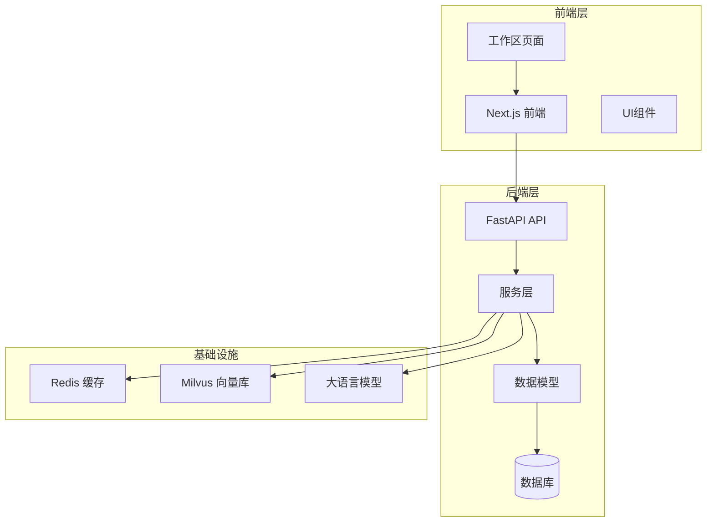
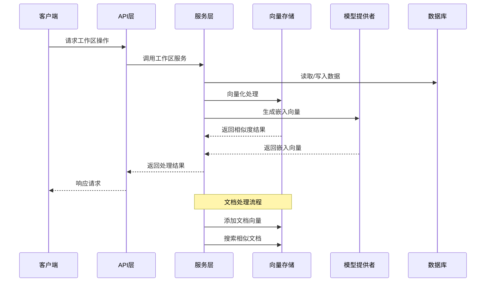
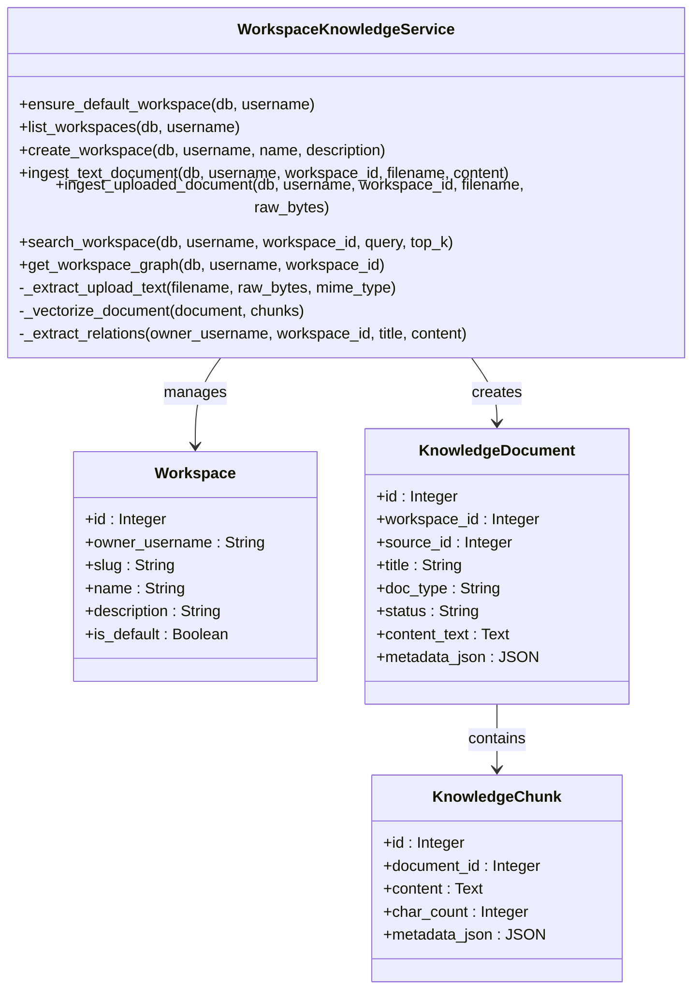
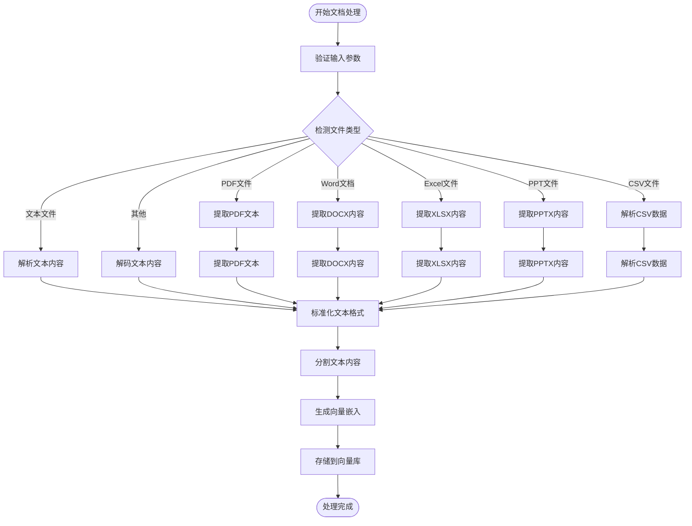
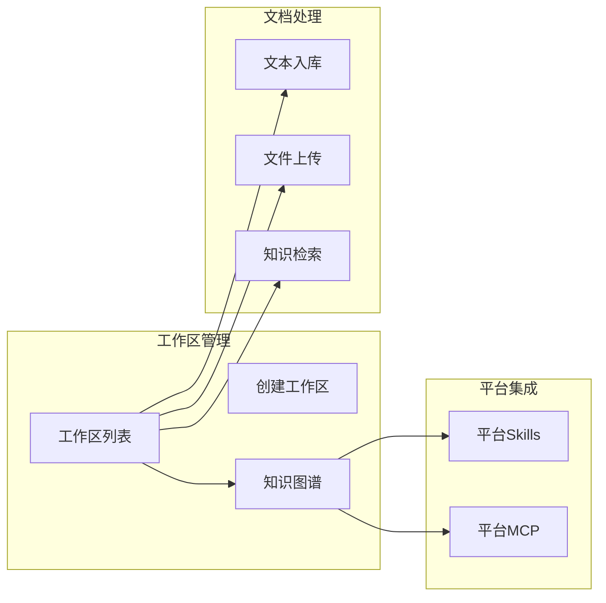
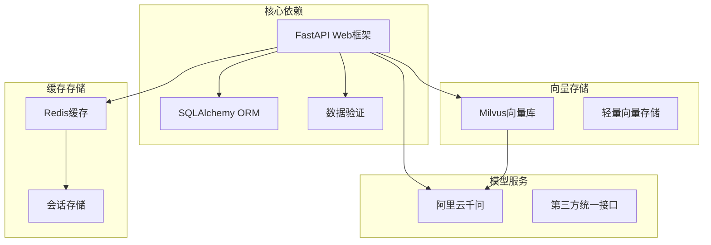

# 工作区知识库系统

<cite>
**本文档引用的文件**
- [backend/main.py](file://backend/main.py)
- [backend/app/api/workspace.py](file://backend/app/api/workspace.py)
- [backend/app/services/workspace_knowledge.py](file://backend/app/services/workspace_knowledge.py)
- [backend/app/models/platform.py](file://backend/app/models/platform.py)
- [backend/app/services/vector_store.py](file://backend/app/services/vector_store.py)
- [backend/app/services/model_provider.py](file://backend/app/services/model_provider.py)
- [backend/app/core/runtime.py](file://backend/app/core/runtime.py)
- [backend/app/security.py](file://backend/app/security.py)
- [backend/app/api/chat.py](file://backend/app/api/chat.py)
- [backend/app/services/session_store.py](file://backend/app/services/session_store.py)
- [frontend/src/app/workspace/page.tsx](file://frontend/src/app/workspace/page.tsx)
- [README-Windows.md](file://README-Windows.md)
</cite>

## 目录
1. [简介](#简介)
2. [项目结构](#项目结构)
3. [核心组件](#核心组件)
4. [架构概览](#架构概览)
5. [详细组件分析](#详细组件分析)
6. [依赖关系分析](#依赖关系分析)
7. [性能考虑](#性能考虑)
8. [故障排除指南](#故障排除指南)
9. [结论](#结论)

## 简介

工作区知识库系统是一个集成化的智能体知识管理系统，专为教务系统设计。该系统提供了完整的知识库管理功能，包括文档上传、文本处理、向量化存储、知识检索和关系抽取等核心能力。

系统采用前后端分离架构，后端基于FastAPI框架，前端使用Next.js，支持多种文档格式的自动解析和处理，提供直观的工作区管理界面。

## 项目结构

该项目采用清晰的分层架构设计：

**图表来源**
- [backend/main.py:1-176](file://backend/main.py#L1-L176)
- [frontend/src/app/workspace/page.tsx:1-618](file://frontend/src/app/workspace/page.tsx#L1-L618)

**章节来源**
- [backend/main.py:1-176](file://backend/main.py#L1-L176)
- [README-Windows.md:213-228](file://README-Windows.md#L213-L228)

## 核心组件

### 工作区知识库服务

工作区知识库服务是系统的核心组件，负责管理用户的知识库工作区和文档处理流程。

**主要功能：**
- 工作区创建和管理
- 文档上传和解析
- 文本切分和向量化
- 知识检索和搜索
- 轻量关系抽取

**章节来源**
- [backend/app/services/workspace_knowledge.py:93-800](file://backend/app/services/workspace_knowledge.py#L93-L800)

### 向量存储服务

系统提供两种向量存储后端：Milvus和轻量级txtai实现。

**特性：**
- 支持Cosine相似度计算
- 自动去重机制
- 多维度元数据支持
- 可扩展的存储后端

**章节来源**
- [backend/app/services/vector_store.py:33-455](file://backend/app/services/vector_store.py#L33-L455)

### 模型提供层

统一的模型抽象层，支持多种大语言模型提供商。

**支持的提供商：**
- Qwen（阿里云千问）
- LiteLLM（第三方统一接口）
- 可扩展的自定义提供商

**章节来源**
- [backend/app/services/model_provider.py:20-396](file://backend/app/services/model_provider.py#L20-L396)

## 架构概览

系统采用微服务架构，各组件职责明确，耦合度低：

**图表来源**
- [backend/app/api/workspace.py:1-190](file://backend/app/api/workspace.py#L1-L190)
- [backend/app/services/workspace_knowledge.py:591-715](file://backend/app/services/workspace_knowledge.py#L591-L715)

**章节来源**
- [backend/app/api/workspace.py:1-190](file://backend/app/api/workspace.py#L1-L190)
- [backend/app/services/workspace_knowledge.py:1-800](file://backend/app/services/workspace_knowledge.py#L1-L800)

## 详细组件分析

### 工作区管理组件

工作区管理提供了完整的知识库组织功能：

**图表来源**
- [backend/app/services/workspace_knowledge.py:93-800](file://backend/app/services/workspace_knowledge.py#L93-L800)
- [backend/app/models/platform.py:25-106](file://backend/app/models/platform.py#L25-L106)

**章节来源**
- [backend/app/services/workspace_knowledge.py:93-800](file://backend/app/services/workspace_knowledge.py#L93-L800)
- [backend/app/models/platform.py:1-166](file://backend/app/models/platform.py#L1-L166)

### 文档处理流程

系统支持多种文档格式的自动处理：

**图表来源**
- [backend/app/services/workspace_knowledge.py:266-590](file://backend/app/services/workspace_knowledge.py#L266-L590)

**章节来源**
- [backend/app/services/workspace_knowledge.py:266-590](file://backend/app/services/workspace_knowledge.py#L266-L590)

### 前端工作区界面

前端提供了直观的工作区管理界面：

**图表来源**
- [frontend/src/app/workspace/page.tsx:59-618](file://frontend/src/app/workspace/page.tsx#L59-L618)

**章节来源**
- [frontend/src/app/workspace/page.tsx:59-618](file://frontend/src/app/workspace/page.tsx#L59-L618)

## 依赖关系分析

系统采用模块化设计，各组件间依赖关系清晰：

**图表来源**
- [backend/app/core/runtime.py:14-26](file://backend/app/core/runtime.py#L14-L26)
- [backend/app/services/vector_store.py:5-11](file://backend/app/services/vector_store.py#L5-L11)

**章节来源**
- [backend/app/core/runtime.py:14-26](file://backend/app/core/runtime.py#L14-L26)
- [backend/app/services/vector_store.py:5-11](file://backend/app/services/vector_store.py#L5-L11)

## 性能考虑

系统在设计时充分考虑了性能优化：

### 向量检索优化
- 支持批量向量插入和查询
- 自动去重机制减少存储空间
- 可配置的相似度阈值
- 多线程并发处理

### 文档处理优化
- 智能文本分割算法
- 增量更新机制
- 缓存策略优化
- 异步处理支持

### 存储优化
- 分层存储架构
- 自动清理机制
- 压缩存储支持
- 内存缓存加速

## 故障排除指南

### 常见问题及解决方案

**1. 向量库连接失败**
- 检查Milvus服务状态
- 验证连接参数配置
- 确认网络连通性

**2. 文档解析错误**
- 检查文件格式支持
- 验证文件编码格式
- 确认文件完整性

**3. 模型服务不可用**
- 检查API密钥配置
- 验证网络连接
- 确认服务可用性

**4. 会话存储问题**
- 检查Redis服务状态
- 验证连接参数
- 确认权限设置

**章节来源**
- [backend/app/services/vector_store.py:44-61](file://backend/app/services/vector_store.py#L44-L61)
- [backend/app/services/session_store.py:40-55](file://backend/app/services/session_store.py#L40-L55)

## 结论

工作区知识库系统是一个功能完整、架构清晰的智能体知识管理平台。系统通过模块化设计实现了高内聚、低耦合的组件结构，支持多种文档格式的自动处理和高效的向量检索。

系统的主要优势包括：
- 完整的知识库管理功能
- 多种文档格式支持
- 高效的向量检索机制
- 直观的前端管理界面
- 灵活的扩展架构

未来可以进一步优化的方向包括：增强模型提供商的多样性、提升文档解析的准确性、优化大规模数据处理性能等。