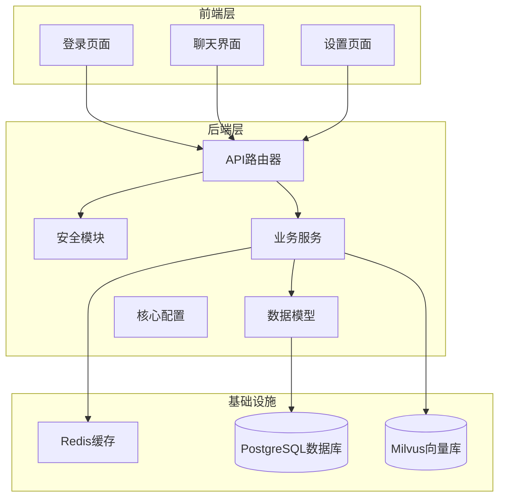
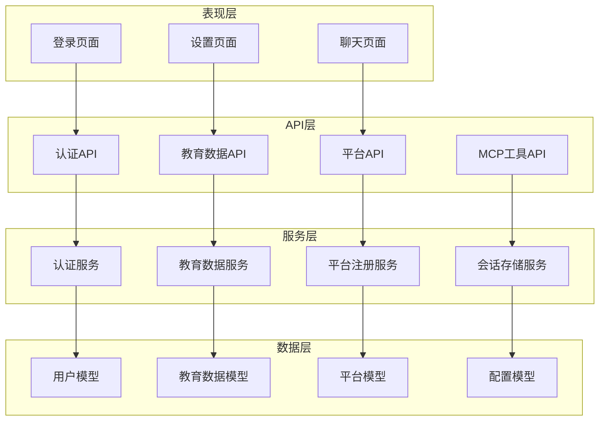
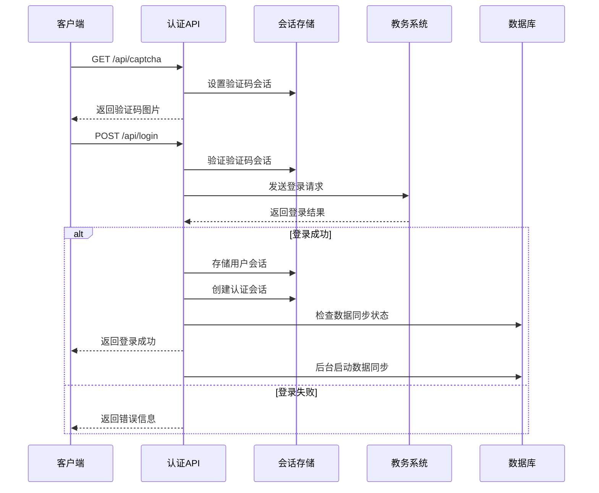
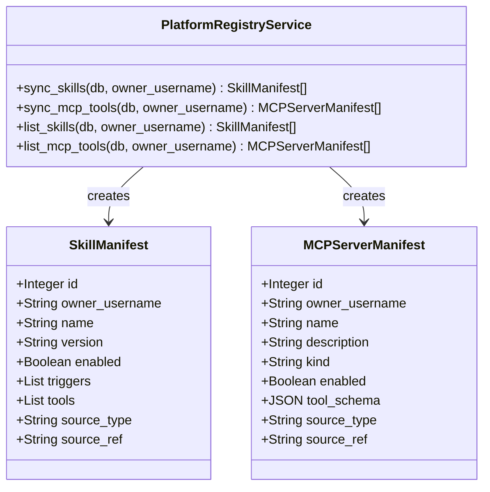
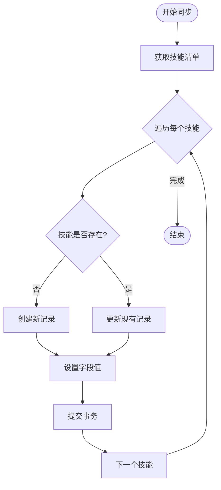
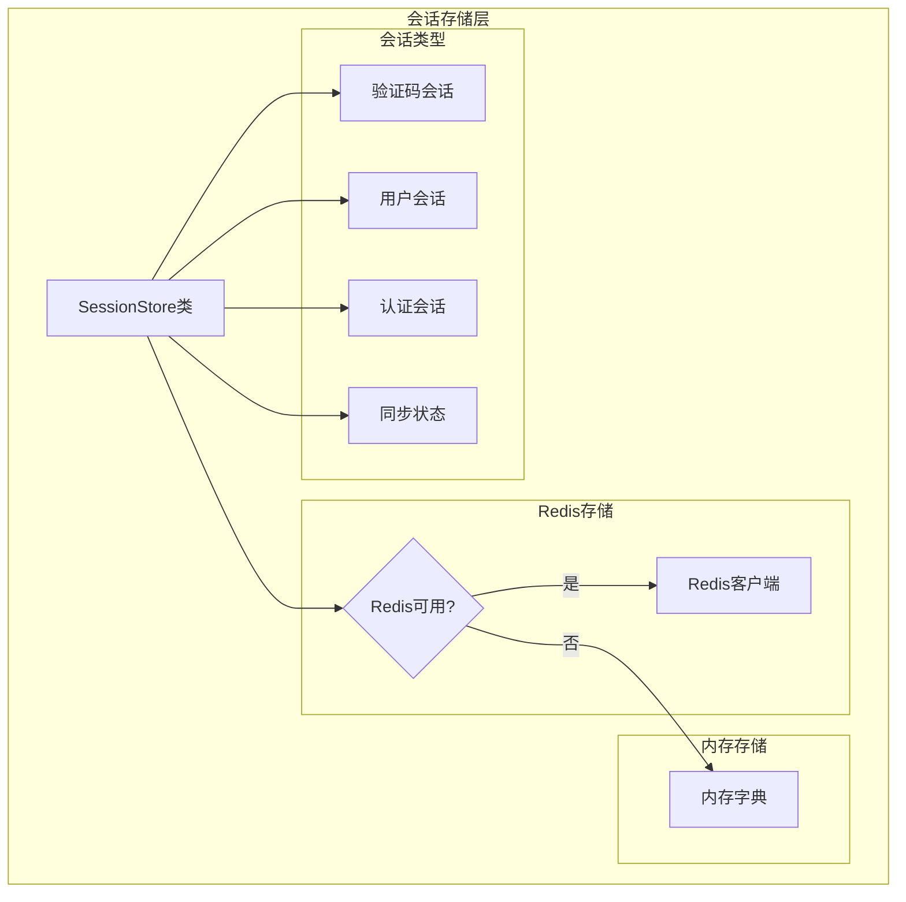
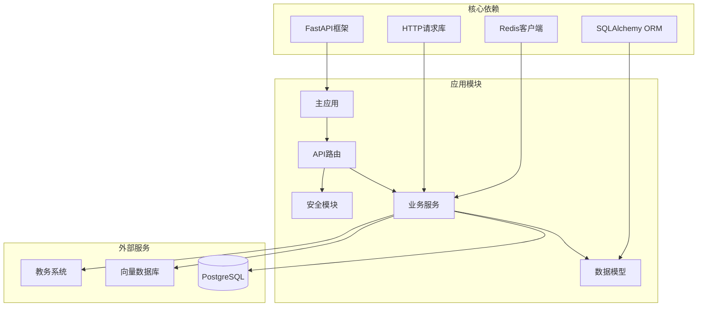

# 平台注册系统

<cite>
**本文档引用的文件**
- [backend/main.py](file://backend/main.py)
- [backend/app/security.py](file://backend/app/security.py)
- [backend/app/models/user.py](file://backend/app/models/user.py)
- [backend/app/models/platform.py](file://backend/app/models/platform.py)
- [backend/app/api/platform.py](file://backend/app/api/platform.py)
- [backend/app/services/platform_registry.py](file://backend/app/services/platform_registry.py)
- [backend/app/api/auth_sync.py](file://backend/app/api/auth_sync.py)
- [backend/app/core/runtime.py](file://backend/app/core/runtime.py)
- [backend/app/models/base.py](file://backend/app/models/base.py)
- [backend/app/models/education_data.py](file://backend/app/models/education_data.py)
- [backend/app/services/session_store.py](file://backend/app/services/session_store.py)
- [backend/app/core/config.py](file://backend/app/core/config.py)
- [backend/app/services/education_sync.py](file://backend/app/services/education_sync.py)
- [frontend/src/app/login/page.tsx](file://frontend/src/app/login/page.tsx)
</cite>

## 目录
1. [简介](#简介)
2. [项目结构](#项目结构)
3. [核心组件](#核心组件)
4. [架构概览](#架构概览)
5. [详细组件分析](#详细组件分析)
6. [依赖关系分析](#依赖关系分析)
7. [性能考虑](#性能考虑)
8. [故障排除指南](#故障排除指南)
9. [结论](#结论)

## 简介

平台注册系统是一个基于FastAPI构建的智能体平台，主要面向高校教务系统的集成需求。该系统提供了完整的用户认证、数据同步、技能注册和MCP工具管理功能。

系统的核心特性包括：
- 多服务器负载均衡的验证码获取和登录机制
- 基于Redis的会话存储和状态管理
- 教务数据的自动爬取、存储和向量化处理
- 技能清单和MCP工具的动态注册管理
- 完整的用户隔离和安全控制机制

## 项目结构

该项目采用前后端分离的架构设计，主要分为以下层次：

**图表来源**
- [backend/main.py:1-176](file://backend/main.py#L1-L176)
- [backend/app/models/base.py:1-29](file://backend/app/models/base.py#L1-L29)

**章节来源**
- [backend/main.py:1-176](file://backend/main.py#L1-L176)
- [backend/app/models/base.py:1-29](file://backend/app/models/base.py#L1-L29)

## 核心组件

### 1. 应用入口和路由管理

系统使用FastAPI作为Web框架，提供RESTful API接口。主应用文件负责：
- 应用实例创建和中间件配置
- CORS跨域资源共享设置
- 全局中间件实现请求追踪和指标收集
- 所有API路由的统一注册

### 2. 安全和会话管理

系统实现了多层次的安全机制：
- **用户隔离**：通过`enforce_username_isolation`函数确保用户数据的严格隔离
- **会话存储**：支持Redis和内存两种存储方式的会话管理
- **认证会话**：使用独立的认证会话ID确保登录状态的安全性

### 3. 数据模型和持久化

系统采用SQLAlchemy ORM框架，定义了完整的数据模型：
- 用户模型：存储学生基本信息和状态
- 教务数据模型：包含成绩、课表、培养方案等多维度数据
- 平台对象模型：工作区、知识源、技能清单等平台功能

**章节来源**
- [backend/app/security.py:1-26](file://backend/app/security.py#L1-L26)
- [backend/app/models/user.py:1-33](file://backend/app/models/user.py#L1-L33)
- [backend/app/models/education_data.py:1-126](file://backend/app/models/education_data.py#L1-L126)
- [backend/app/models/platform.py:1-166](file://backend/app/models/platform.py#L1-L166)

## 架构概览

系统采用分层架构设计，各层职责明确：

**图表来源**
- [backend/app/api/auth_sync.py:1-286](file://backend/app/api/auth_sync.py#L1-L286)
- [backend/app/api/platform.py:1-56](file://backend/app/api/platform.py#L1-L56)
- [backend/app/services/platform_registry.py:1-104](file://backend/app/services/platform_registry.py#L1-L104)

## 详细组件分析

### 认证与同步系统

认证系统是整个平台的核心，实现了完整的登录流程和数据同步机制。

#### 登录流程序列图

**图表来源**
- [backend/app/api/auth_sync.py:73-227](file://backend/app/api/auth_sync.py#L73-L227)
- [backend/app/services/session_store.py:125-154](file://backend/app/services/session_store.py#L125-L154)

#### 数据同步流程

系统实现了智能的数据同步策略，包括：
- **自动同步**：登录成功后自动触发数据爬取
- **手动同步**：用户可随时手动触发数据更新
- **缓存复用**：利用最近的成功快照减少重复爬取
- **增量更新**：只同步发生变化的数据

**章节来源**
- [backend/app/api/auth_sync.py:18-286](file://backend/app/api/auth_sync.py#L18-L286)
- [backend/app/services/education_sync.py:18-204](file://backend/app/services/education_sync.py#L18-L204)

### 平台注册服务

平台注册服务负责将技能文件和MCP工具注册到数据库中，实现平台能力的动态管理。

#### 注册流程类图

**图表来源**
- [backend/app/services/platform_registry.py:18-104](file://backend/app/services/platform_registry.py#L18-L104)
- [backend/app/models/platform.py:125-166](file://backend/app/models/platform.py#L125-L166)

#### 技能同步算法

**图表来源**
- [backend/app/services/platform_registry.py:19-44](file://backend/app/services/platform_registry.py#L19-L44)

**章节来源**
- [backend/app/services/platform_registry.py:1-104](file://backend/app/services/platform_registry.py#L1-L104)
- [backend/app/api/platform.py:1-56](file://backend/app/api/platform.py#L1-L56)

### 会话存储系统

会话存储系统提供了灵活的会话管理机制，支持Redis和内存两种存储方式。

#### 会话存储架构

**图表来源**
- [backend/app/services/session_store.py:25-252](file://backend/app/services/session_store.py#L25-L252)

**章节来源**
- [backend/app/services/session_store.py:1-252](file://backend/app/services/session_store.py#L1-L252)

## 依赖关系分析

系统采用模块化的依赖设计，各组件之间的耦合度较低：

**图表来源**
- [backend/main.py:6-33](file://backend/main.py#L6-L33)
- [backend/app/models/base.py:5-18](file://backend/app/models/base.py#L5-L18)

**章节来源**
- [backend/main.py:1-176](file://backend/main.py#L1-L176)
- [backend/app/models/base.py:1-29](file://backend/app/models/base.py#L1-L29)

## 性能考虑

### 缓存策略

系统实现了多层次的缓存机制：
- **Redis缓存**：用于高并发场景下的会话存储
- **内存缓存**：在Redis不可用时提供降级方案
- **数据库缓存**：利用PostgreSQL的查询优化

### 异步处理

- **后台任务**：数据同步采用异步方式，避免阻塞主线程
- **批量操作**：数据库操作采用批量提交，提高性能
- **连接池**：数据库连接使用连接池管理

### 负载均衡

- **多服务器支持**：支持14个不同的教务系统服务器
- **智能路由**：根据学号哈希选择最优服务器
- **故障转移**：服务器不可用时自动切换到其他节点

## 故障排除指南

### 常见问题及解决方案

#### 1. 登录失败问题

**症状**：验证码正确但登录失败
**可能原因**：
- 教务系统服务器不可用
- 用户名密码错误
- 验证码过期

**解决步骤**：
1. 检查服务器连通性
2. 验证用户名密码格式
3. 重新获取验证码

#### 2. 数据同步失败

**症状**：登录成功但数据为空
**可能原因**：
- 网络超时
- 数据库连接失败
- 向量化处理异常

**解决步骤**：
1. 检查数据库连接状态
2. 验证向量数据库可用性
3. 查看同步日志

#### 3. 会话管理问题

**症状**：用户状态异常或会话丢失
**可能原因**：
- Redis服务不可用
- 会话过期
- Cookie设置问题

**解决步骤**：
1. 检查Redis服务状态
2. 验证会话TTL设置
3. 检查浏览器Cookie设置

**章节来源**
- [backend/app/api/auth_sync.py:224-286](file://backend/app/api/auth_sync.py#L224-L286)
- [backend/app/services/session_store.py:40-55](file://backend/app/services/session_store.py#L40-L55)

## 结论

平台注册系统是一个功能完整、架构清晰的智能体平台。系统的主要优势包括：

1. **安全性**：实现了严格的用户隔离和多重认证机制
2. **可扩展性**：模块化设计支持功能的灵活扩展
3. **可靠性**：多层缓存和降级机制确保系统稳定性
4. **易用性**：简洁的API设计和完善的错误处理

系统特别适合高校教务系统的集成需求，能够有效解决学生信息查询、课程管理、成绩分析等常见问题。通过合理的架构设计和技术选型，系统具备良好的性能表现和维护性。

未来可以考虑的功能增强包括：
- 更丰富的技能管理功能
- 支持更多的MCP工具类型
- 增强的监控和告警机制
- 更灵活的权限控制系统