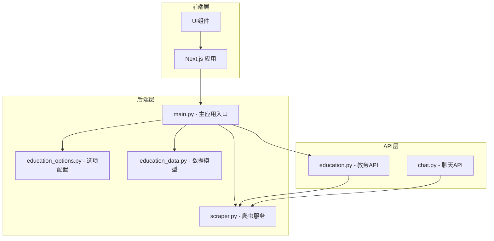
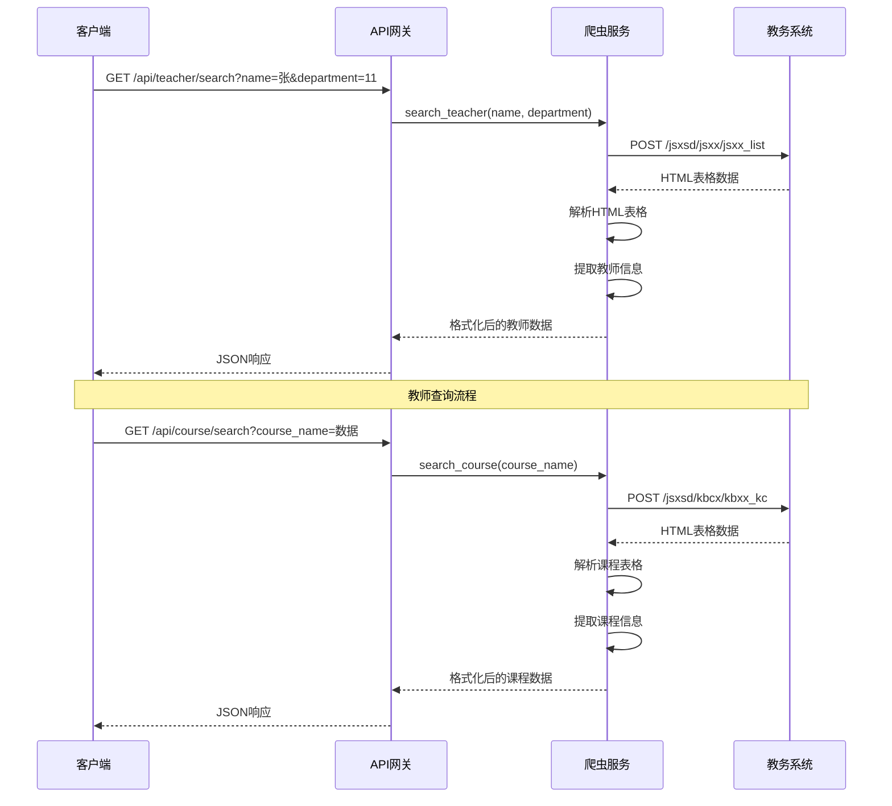
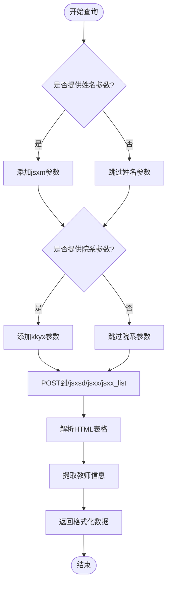
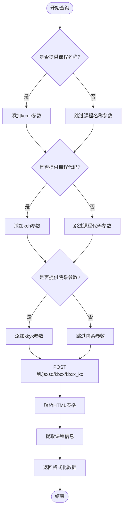
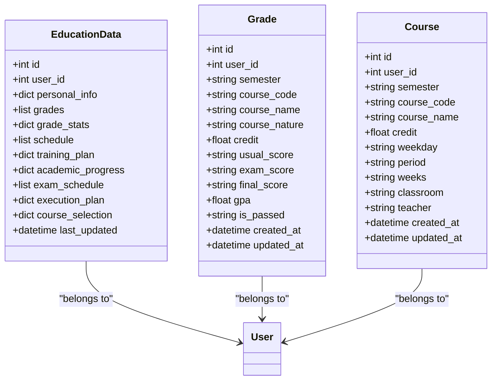
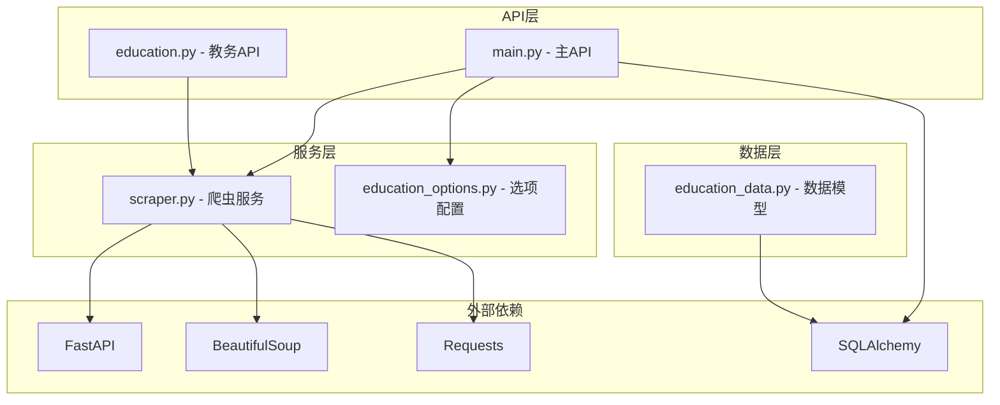
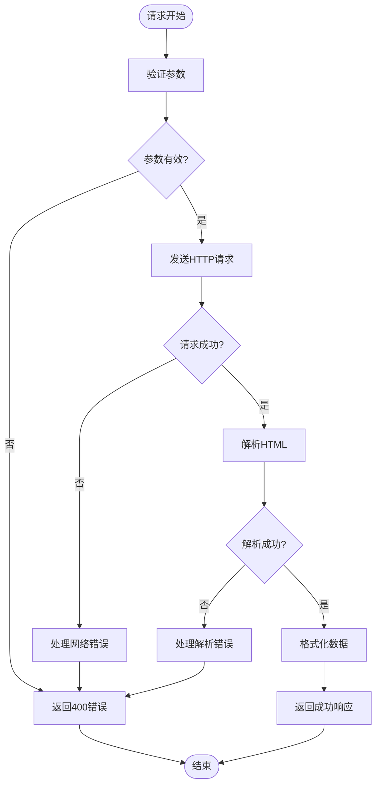

# 搜索查询API

<cite>
**本文档引用的文件**
- [main.py](file://backend/main.py)
- [scraper.py](file://backend/scraper.py)
- [education_options.py](file://backend/education_options.py)
- [test_scraper.py](file://backend/test_scraper.py)
- [education_data.py](file://backend/app/models/education_data.py)
</cite>

## 目录
1. [简介](#简介)
2. [项目结构](#项目结构)
3. [核心组件](#核心组件)
4. [架构概览](#架构概览)
5. [详细组件分析](#详细组件分析)
6. [依赖分析](#依赖分析)
7. [性能考虑](#性能考虑)
8. [故障排除指南](#故障排除指南)
9. [结论](#结论)

## 简介

本文档详细介绍了教育系统的搜索查询API接口，重点涵盖教师查询接口和课程查询接口的完整规范。该系统基于FastAPI框架构建，提供了对教务系统数据的高效查询能力，支持多种搜索条件和筛选功能。

系统采用前后端分离架构，后端使用Python和FastAPI提供RESTful API服务，前端使用Next.js构建用户界面。搜索功能直接对接教务系统的HTML页面，通过HTTP请求和HTML解析实现数据抓取和查询。

## 项目结构

该项目采用模块化组织方式，主要分为以下层次：



**图表来源**
- [main.py:1-120](file://backend/main.py#L1-L120)
- [scraper.py:1-50](file://backend/scraper.py#L1-L50)

**章节来源**
- [main.py:1-853](file://backend/main.py#L1-L853)

## 核心组件

### 搜索API路由

系统提供了两个核心搜索接口：

1. **教师查询接口**: `/api/teacher/search`
2. **课程查询接口**: `/api/course/search`

这两个接口都采用GET方法，支持多种查询参数，无需用户认证即可使用。

### 搜索服务层

搜索功能由专门的爬虫服务实现，负责：
- 构建查询参数
- 发送HTTP请求到教务系统
- 解析HTML响应
- 提取和格式化数据

**章节来源**
- [main.py:582-638](file://backend/main.py#L582-L638)
- [scraper.py:849-1048](file://backend/scraper.py#L849-L1048)

## 架构概览



**图表来源**
- [main.py:582-638](file://backend/main.py#L582-L638)
- [scraper.py:849-1048](file://backend/scraper.py#L849-L1048)

## 详细组件分析

### 教师查询接口

#### 接口规范

**URL**: `/api/teacher/search`

**方法**: GET

**参数**:
- `name` (可选): 教师姓名，支持模糊匹配
- `department` (可选): 所属院系代码

**响应结构**:
```json
{
  "success": true,
  "data": [
    {
      "序号": "1",
      "教职工号": "123456",
      "教师姓名": "张教授",
      "所属院系": "计算机学院",
      "教师ID": "jg0101id_value",
      "详情链接": "http://jwxt.gdufe.edu.cn/jsxsd/jsxx/jsxx_detail?jg0101id=..."
    }
  ],
  "count": 5
}
```

#### 搜索算法实现

教师查询采用基于表单提交的POST请求方式：



**图表来源**
- [scraper.py:849-916](file://backend/scraper.py#L849-L916)

#### 匹配规则

- **姓名模糊匹配**: 支持部分匹配，输入任意字符片段即可匹配
- **院系筛选**: 支持精确的院系代码匹配
- **结果排序**: 按照教务系统返回的表格顺序

**章节来源**
- [main.py:582-609](file://backend/main.py#L582-L609)
- [scraper.py:849-916](file://backend/scraper.py#L849-L916)

### 课程查询接口

#### 接口规范

**URL**: `/api/course/search`

**方法**: GET

**参数**:
- `course_name` (可选): 课程名称，支持模糊匹配
- `course_code` (可选): 课程代码
- `department` (可选): 开课院系

**响应结构**:
```json
{
  "success": true,
  "data": [
    {
      "课程代码": "CS101",
      "课程名称": "数据结构",
      "学分": "4.0",
      "总学时": "64",
      "课程性质": "必修",
      "开课院系": "计算机学院",
      "课程ID": "course_id_value"
    }
  ],
  "count": 12
}
```

#### 搜索算法实现

课程查询同样采用表单提交的方式：



**图表来源**
- [scraper.py:969-1037](file://backend/scraper.py#L969-L1037)

#### 多维度搜索能力

- **名称搜索**: 支持课程名称的模糊匹配
- **代码搜索**: 支持精确的课程代码匹配
- **院系筛选**: 支持按开课院系进行筛选
- **组合查询**: 可以同时使用多个条件进行精确搜索

**章节来源**
- [main.py:611-638](file://backend/main.py#L611-L638)
- [scraper.py:969-1037](file://backend/scraper.py#L969-L1037)

### 数据模型分析

系统使用SQLAlchemy ORM定义了相关的数据模型：



**图表来源**
- [education_data.py:11-103](file://backend/app/models/education_data.py#L11-L103)

**章节来源**
- [education_data.py:1-103](file://backend/app/models/education_data.py#L1-L103)

## 依赖分析

### 组件依赖关系



**图表来源**
- [main.py:1-50](file://backend/main.py#L1-L50)
- [scraper.py:1-30](file://backend/scraper.py#L1-L30)

### 外部依赖

系统依赖以下关键库：

- **FastAPI**: Web框架，提供异步API服务
- **BeautifulSoup**: HTML解析库，用于解析教务系统页面
- **Requests**: HTTP客户端，用于发送请求到教务系统
- **SQLAlchemy**: ORM库，用于数据库操作
- **Pydantic**: 数据验证和序列化库

**章节来源**
- [main.py:1-50](file://backend/main.py#L1-L50)
- [scraper.py:1-30](file://backend/scraper.py#L1-L30)

## 性能考虑

### 响应时间优化

系统在多个层面实现了性能优化：

1. **超时控制**: 所有HTTP请求设置10秒超时，避免长时间等待
2. **异步处理**: 使用FastAPI的异步特性提高并发处理能力
3. **缓存策略**: 使用内存字典存储验证码会话和用户会话
4. **连接复用**: 使用requests.Session复用HTTP连接

### 内存管理

- **会话管理**: 使用全局字典存储会话，便于快速访问
- **数据结构**: 使用列表和字典存储查询结果，减少内存占用
- **异常处理**: 及时清理无效会话，防止内存泄漏

### 错误处理机制



**图表来源**
- [main.py:582-638](file://backend/main.py#L582-L638)

**章节来源**
- [main.py:160-170](file://backend/main.py#L160-L170)
- [scraper.py:849-1048](file://backend/scraper.py#L849-L1048)

## 故障排除指南

### 常见问题及解决方案

#### 1. 教师查询无结果

**可能原因**:
- 姓名参数过于具体，导致无匹配
- 院系代码不正确
- 教务系统数据更新延迟

**解决方法**:
- 尝试使用更通用的姓名片段
- 验证院系代码的有效性
- 稍后再试，等待数据同步

#### 2. 课程查询响应缓慢

**可能原因**:
- 教务系统服务器负载过高
- 网络连接不稳定
- 查询参数过多导致数据量过大

**解决方法**:
- 减少查询参数数量
- 降低并发请求频率
- 检查网络连接质量

#### 3. HTML解析失败

**可能原因**:
- 教务系统页面结构调整
- 网络请求被防火墙拦截
- 服务器响应格式变化

**解决方法**:
- 更新HTML解析逻辑
- 检查代理设置
- 联系系统管理员

### 调试技巧

1. **查看日志**: 系统记录详细的请求和响应信息
2. **参数验证**: 确保所有必需参数都已提供
3. **网络诊断**: 检查网络连接和服务器可达性
4. **HTML结构**: 分析目标页面的HTML结构变化

**章节来源**
- [main.py:582-638](file://backend/main.py#L582-L638)
- [scraper.py:849-1048](file://backend/scraper.py#L849-L1048)

## 结论

该搜索查询API系统提供了完整的教师和课程查询功能，具有以下特点：

### 技术优势
- **简单易用**: API设计简洁，参数直观
- **功能完整**: 支持多种查询条件和筛选功能
- **性能可靠**: 异步处理和超时控制保证响应速度
- **错误处理**: 完善的异常处理和错误反馈机制

### 应用场景
- 学生选课辅助查询
- 教师信息检索
- 课程安排查询
- 教学资源发现

### 改进建议
- 实现结果分页功能
- 添加搜索结果排序选项
- 增加搜索历史记录
- 优化HTML解析稳定性

该系统为教育管理系统提供了强大的搜索能力，能够有效提升用户体验和查询效率。