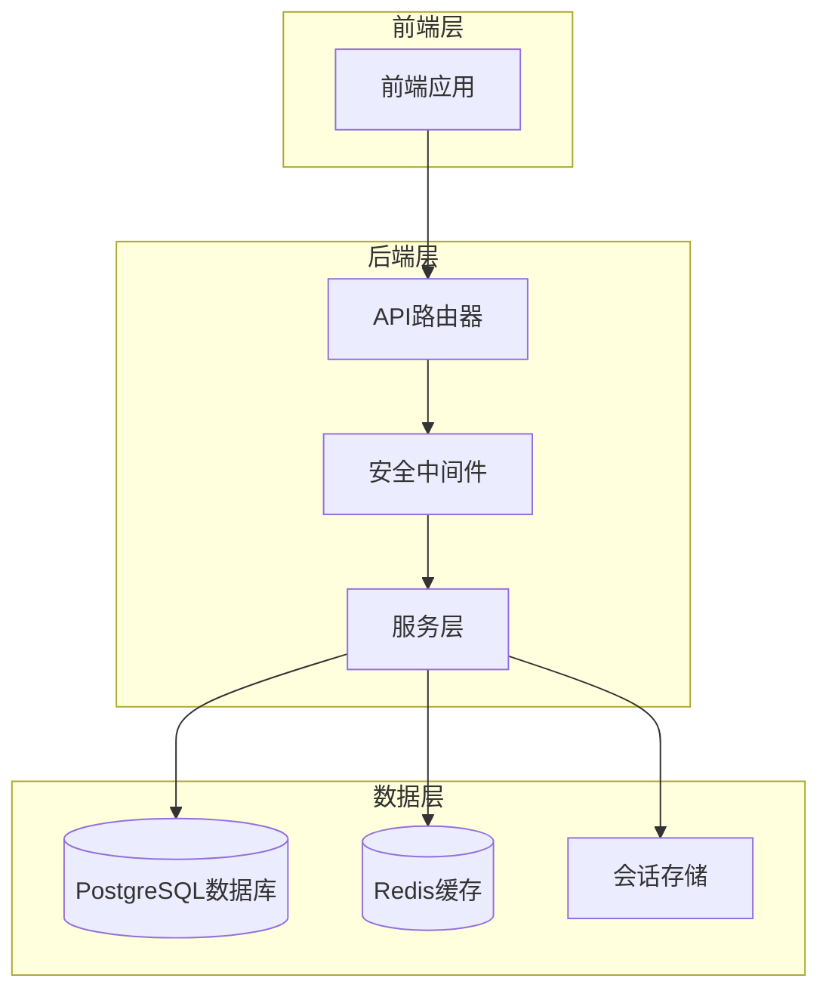
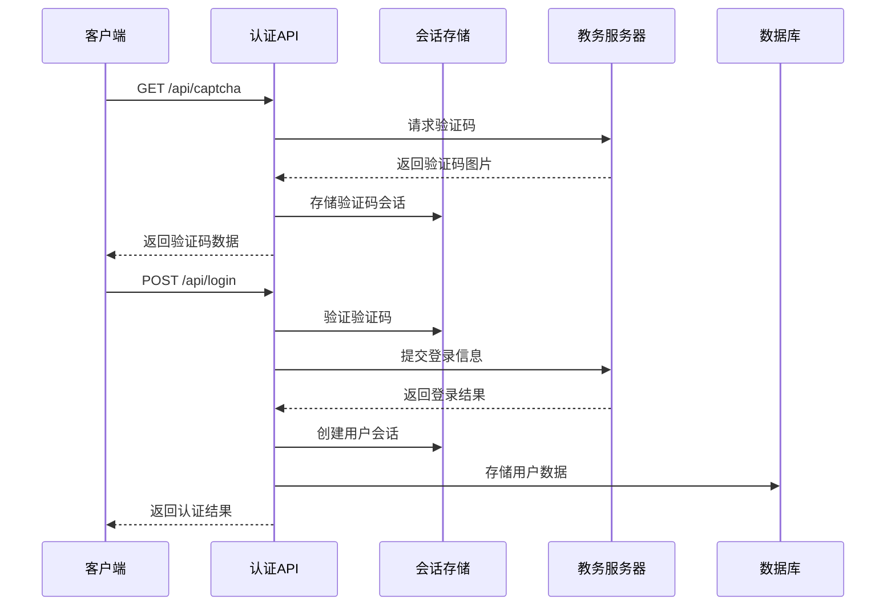
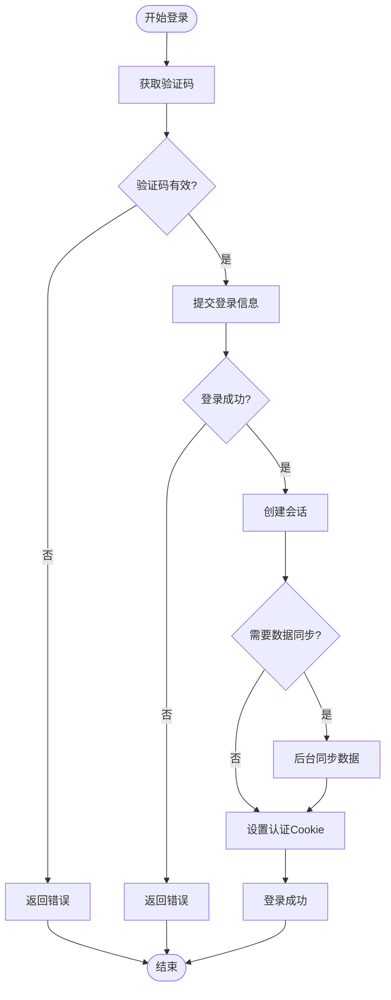
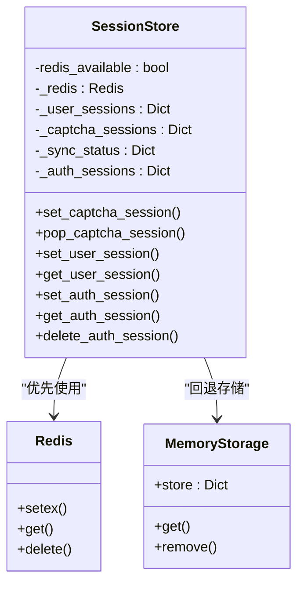
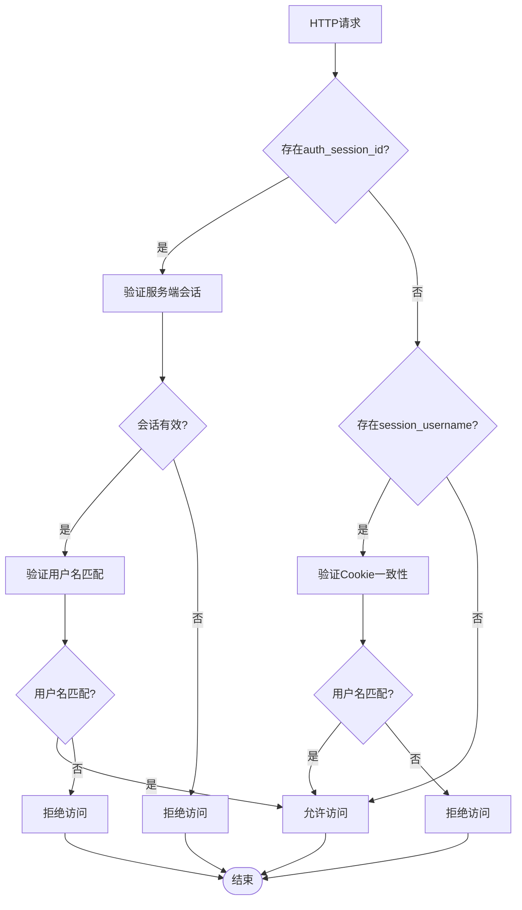
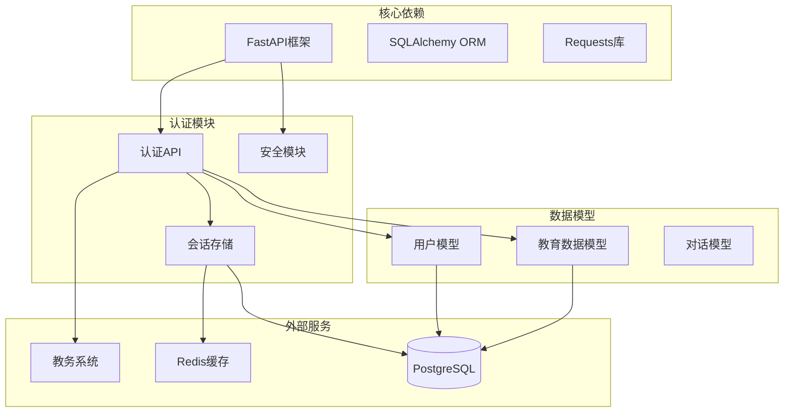

# 学生身份验证机制

<cite>
**本文档引用的文件**
- [backend/main.py](file://backend/main.py)
- [backend/app/api/auth_sync.py](file://backend/app/api/auth_sync.py)
- [backend/app/security.py](file://backend/app/security.py)
- [backend/app/services/session_store.py](file://backend/app/services/session_store.py)
- [backend/app/core/runtime.py](file://backend/app/core/runtime.py)
- [backend/app/models/user.py](file://backend/app/models/user.py)
- [backend/app/models/education_data.py](file://backend/app/models/education_data.py)
- [backend/app/core/config.py](file://backend/app/core/config.py)
- [backend/tests/test_security_isolation.py](file://backend/tests/test_security_isolation.py)
- [backend/test_login.py](file://backend/test_login.py)
</cite>

## 目录
1. [简介](#简介)
2. [项目结构](#项目结构)
3. [核心组件](#核心组件)
4. [架构概览](#架构概览)
5. [详细组件分析](#详细组件分析)
6. [依赖关系分析](#依赖关系分析)
7. [性能考虑](#性能考虑)
8. [故障排除指南](#故障排除指南)
9. [结论](#结论)

## 简介

本项目是一个基于FastAPI构建的智能体系统，专门针对高校教务系统的身份验证机制进行了深入设计。该系统实现了完整的登录流程，包括验证码获取、用户认证、会话管理和数据同步等功能。

系统的核心特点是采用了双重身份验证机制：既支持传统的基于Cookie的会话验证，又引入了基于服务端会话存储的强验证机制，确保不同用户之间的严格隔离。

## 项目结构

该项目采用典型的三层架构设计：

**图表来源**
- [backend/main.py:30-82](file://backend/main.py#L30-L82)
- [backend/app/core/runtime.py:12-26](file://backend/app/core/runtime.py#L12-L26)

**章节来源**
- [backend/main.py:1-170](file://backend/main.py#L1-L170)
- [backend/app/core/runtime.py:1-28](file://backend/app/core/runtime.py#L1-L28)

## 核心组件

### 1. 身份验证API模块

身份验证功能主要集中在`auth_sync.py`文件中，提供了完整的登录、验证码获取和会话管理功能。

### 2. 会话存储服务

`session_store.py`实现了统一的会话存储抽象，支持Redis持久化和内存回退两种模式。

### 3. 安全隔离机制

`security.py`文件包含了强制的用户名隔离验证逻辑，确保用户只能访问自己的数据。

### 4. 数据模型

系统定义了完整的数据模型，包括用户、教育数据和对话记录等核心实体。

**章节来源**
- [backend/app/api/auth_sync.py:1-286](file://backend/app/api/auth_sync.py#L1-L286)
- [backend/app/services/session_store.py:1-234](file://backend/app/services/session_store.py#L1-L234)
- [backend/app/security.py:1-26](file://backend/app/security.py#L1-L26)

## 架构概览

系统采用微服务架构，通过API路由器实现功能模块化：

**图表来源**
- [backend/app/api/auth_sync.py:33-227](file://backend/app/api/auth_sync.py#L33-L227)
- [backend/app/services/session_store.py:94-152](file://backend/app/services/session_store.py#L94-L152)

## 详细组件分析

### 身份验证流程

系统实现了多步骤的身份验证流程：

**图表来源**
- [backend/app/api/auth_sync.py:73-227](file://backend/app/api/auth_sync.py#L73-L227)

### 会话存储机制

会话存储服务提供了灵活的存储策略：

**图表来源**
- [backend/app/services/session_store.py:25-234](file://backend/app/services/session_store.py#L25-L234)

### 安全隔离验证

系统实现了双重安全验证机制：

**图表来源**
- [backend/app/security.py:4-26](file://backend/app/security.py#L4-L26)

**章节来源**
- [backend/app/api/auth_sync.py:1-286](file://backend/app/api/auth_sync.py#L1-L286)
- [backend/app/services/session_store.py:1-234](file://backend/app/services/session_store.py#L1-L234)
- [backend/app/security.py:1-26](file://backend/app/security.py#L1-L26)

## 依赖关系分析

系统各组件之间的依赖关系如下：

**图表来源**
- [backend/main.py:6-28](file://backend/main.py#L6-L28)
- [backend/app/api/auth_sync.py:15-19](file://backend/app/api/auth_sync.py#L15-L19)

**章节来源**
- [backend/main.py:1-170](file://backend/main.py#L1-L170)
- [backend/app/api/auth_sync.py:1-286](file://backend/app/api/auth_sync.py#L1-L286)

## 性能考虑

系统在设计时充分考虑了性能优化：

1. **会话存储优化**：支持Redis持久化，提供高并发访问能力
2. **数据同步策略**：采用后台任务异步处理，避免阻塞主线程
3. **缓存机制**：利用Redis缓存频繁访问的数据
4. **连接池管理**：合理配置数据库连接池大小

## 故障排除指南

### 常见问题及解决方案

1. **验证码获取失败**
   - 检查网络连接和服务器可达性
   - 验证验证码会话是否正确存储
   - 确认Redis服务正常运行

2. **登录认证失败**
   - 验证用户名密码是否正确
   - 检查验证码是否过期
   - 确认目标服务器地址配置正确

3. **会话隔离错误**
   - 检查auth_session_id Cookie是否存在
   - 验证用户名参数与会话中的用户名是否一致
   - 确认服务端会话存储正常工作

**章节来源**
- [backend/tests/test_security_isolation.py:1-57](file://backend/tests/test_security_isolation.py#L1-L57)
- [backend/test_login.py:1-152](file://backend/test_login.py#L1-L152)

## 结论

该学生身份验证机制通过多层次的设计实现了高安全性、高可用性的认证系统。系统不仅满足了基本的登录需求，还提供了完善的数据隔离、会话管理和错误处理机制。

主要特点包括：
- 双重身份验证机制，确保用户数据安全
- 灵活的会话存储策略，支持多种部署环境
- 完善的错误处理和监控机制
- 高性能的异步数据同步处理

该系统为后续的功能扩展奠定了坚实的基础，可以轻松集成更多的教育数据查询和AI助手功能。