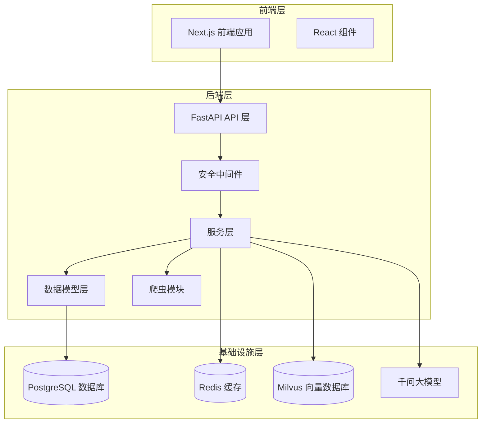
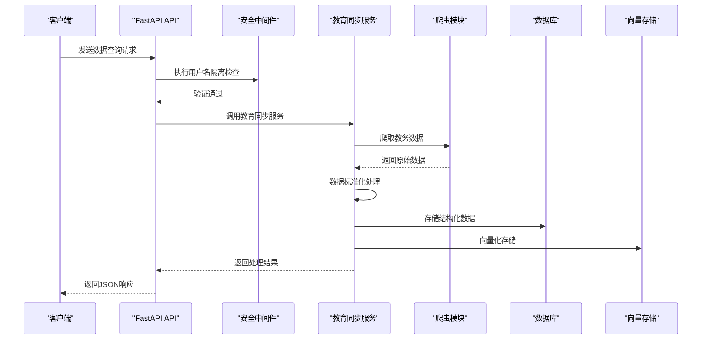
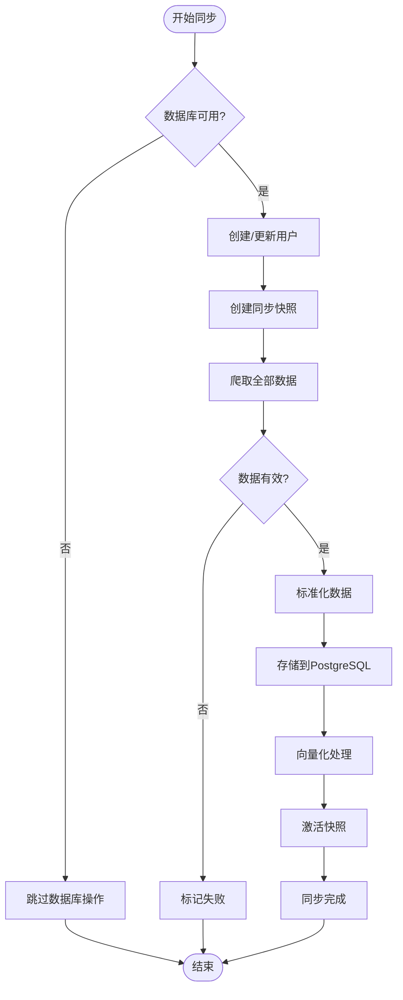
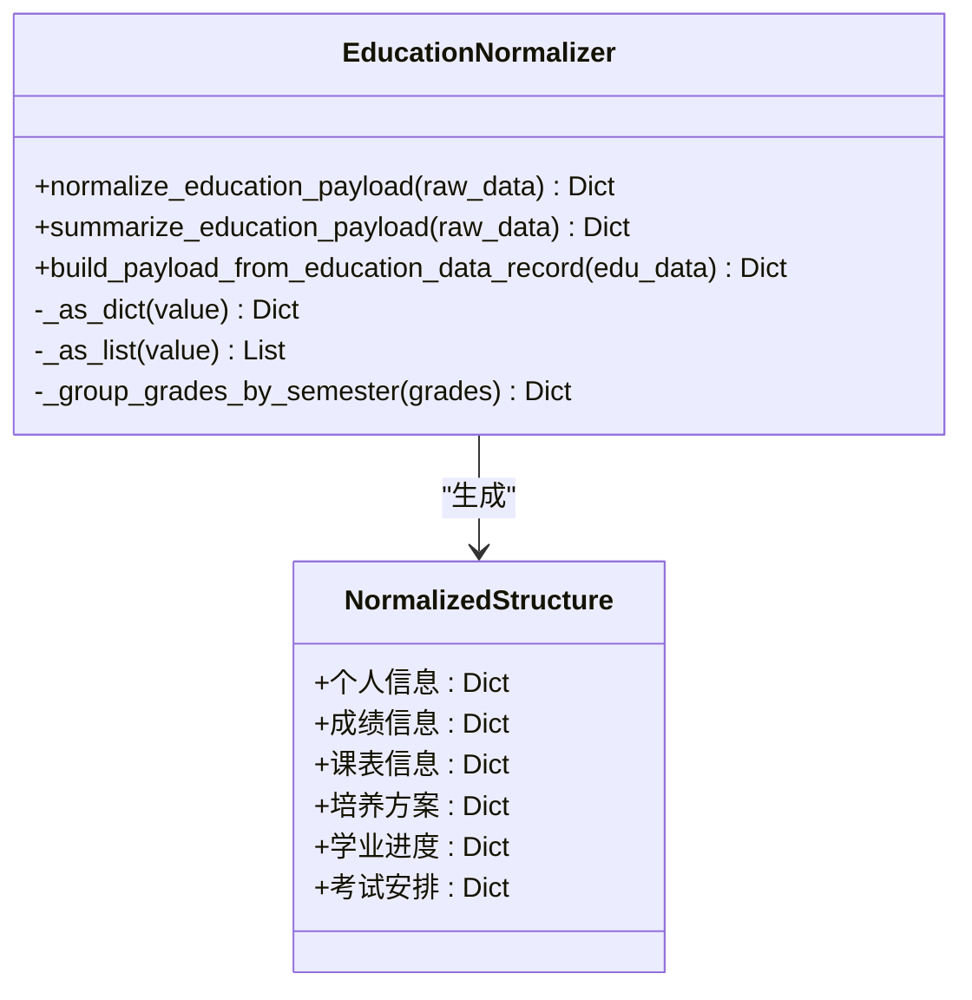
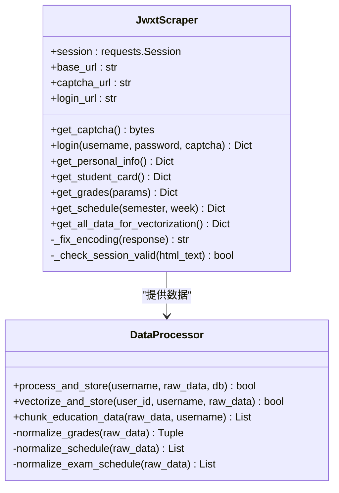
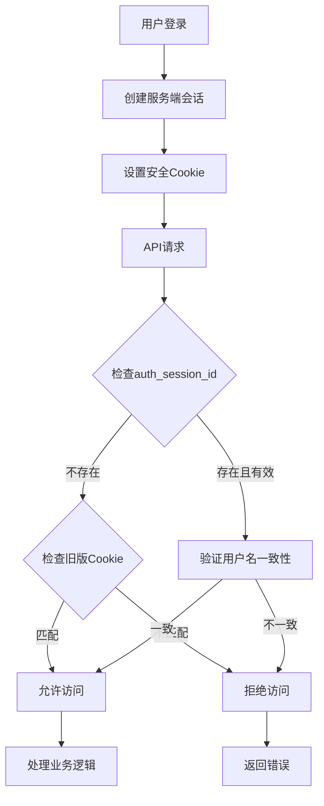
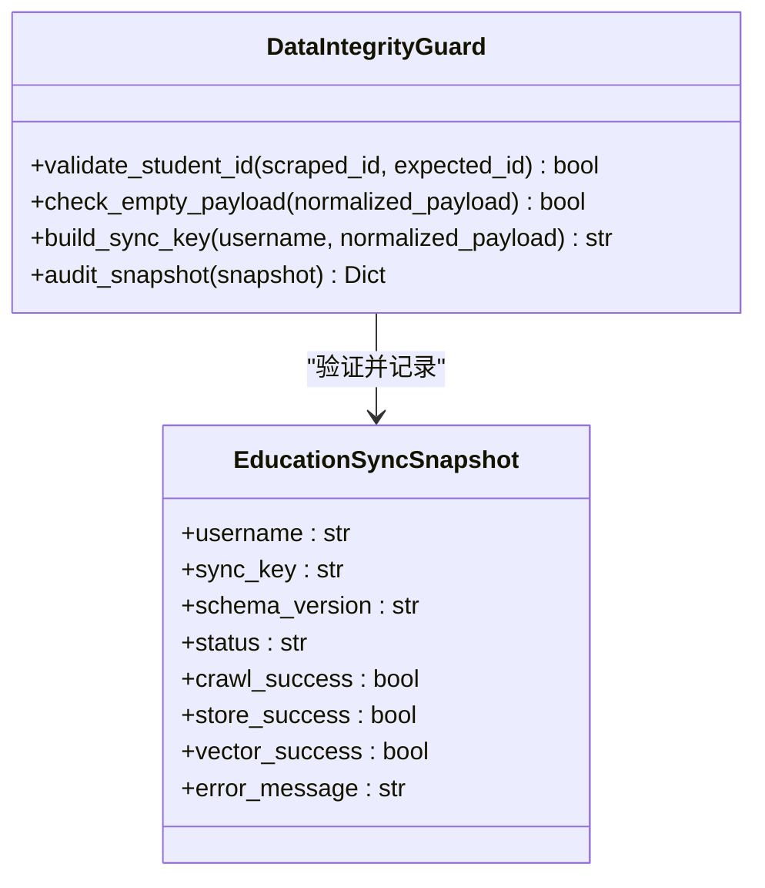
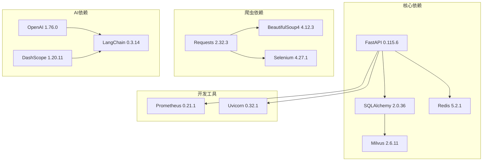

# 教育数据快照系统

<cite>
**本文档引用的文件**
- [main.py](file://backend/main.py)
- [education.py](file://backend/app/api/education.py)
- [education_data.py](file://backend/app/models/education_data.py)
- [education_sync.py](file://backend/app/services/education_sync.py)
- [education_normalizer.py](file://backend/app/services/education_normalizer.py)
- [education_audit.py](file://backend/app/services/education_audit.py)
- [security.py](file://backend/app/security.py)
- [session_store.py](file://backend/app/services/session_store.py)
- [auth_sync.py](file://backend/app/api/auth_sync.py)
- [scraper.py](file://backend/scraper.py)
- [data_processor.py](file://backend/app/services/data_processor.py)
- [base.py](file://backend/app/models/base.py)
- [runtime.py](file://backend/app/core/runtime.py)
- [config.py](file://backend/app/core/config.py)
- [requirements.txt](file://backend/requirements.txt)
- [test_security_isolation.py](file://backend/tests/test_security_isolation.py)
- [README-Windows.md](file://README-Windows.md)
</cite>

## 更新摘要
**变更内容**
- 新增学生身份验证和会话隔离机制，确保数据访问安全
- 增强数据完整性保障，包括学号校验、空数据检测、快照审计
- 实现服务端会话管理，替代传统的客户端Cookie方式
- 完善数据快照系统，支持数据契约版本控制和状态追踪
- 新增全面的调试输出功能，包括HTML保存和详细日志记录

## 目录
1. [简介](#简介)
2. [项目结构](#项目结构)
3. [核心组件](#核心组件)
4. [架构概览](#架构概览)
5. [详细组件分析](#详细组件分析)
6. [安全与数据完整性](#安全与数据完整性)
7. [依赖关系分析](#依赖关系分析)
8. [性能考虑](#性能考虑)
9. [故障排除指南](#故障排除指南)
10. [结论](#结论)

## 简介

教育数据快照系统是一个基于FastAPI构建的智能教务助手平台，专门设计用于自动化爬取、处理和管理高校教务系统数据。该系统通过AI技术为学生提供个性化的学习辅助服务，包括成绩查询、课表管理、培养方案跟踪、学业进度监控等功能。

系统的核心特色在于其"数据快照"机制，能够定期捕获和存储学生的教务数据，形成可检索、可分析的数据快照，为后续的AI问答和数据分析提供坚实基础。最新的功能增强进一步提升了系统的安全性和稳定性，新增了严格的身份验证机制和数据完整性保障功能。

## 项目结构

该项目采用前后端分离的架构设计，主要分为以下层次：

**图表来源**
- [main.py:1-170](file://backend/main.py#L1-L170)
- [education.py:1-239](file://backend/app/api/education.py#L1-L239)

**章节来源**
- [main.py:1-170](file://backend/main.py#L1-L170)
- [README-Windows.md:213-228](file://README-Windows.md#L213-L228)

## 核心组件

### 1. API 路由系统

系统提供完整的RESTful API接口，涵盖教务数据的所有查询需求：

- **用户认证接口**：验证码获取、用户登录、会话管理
- **个人信息接口**：学籍卡片、个人资料查询
- **成绩查询接口**：单学期、全部成绩查询
- **课表查询接口**：学期课表、周次课表
- **培养方案接口**：专业培养计划
- **学业进度接口**：学习进度跟踪
- **考试安排接口**：期末考试时间安排
- **综合查询接口**：所有数据的向量化查询

### 2. 数据模型层

系统采用ORM设计模式，定义了完整的数据模型体系：

- **EducationData**：主数据表，存储用户完整的教务信息
- **EducationSyncSnapshot**：同步快照表，记录每次数据同步的状态
- **Grade**：成绩明细表，支持详细的成绩查询
- **Course**：课程表，支持课表和选课信息

### 3. 爬虫引擎

基于Selenium和BeautifulSoup4构建的智能爬虫系统，能够处理复杂的教务系统页面：

- **会话管理**：自动处理登录状态和Cookie
- **编码处理**：智能识别GBK/UTF-8混合编码
- **页面解析**：精确提取所需数据字段
- **错误恢复**：具备完善的异常处理机制
- **调试输出**：新增HTML保存和详细日志记录功能

**章节来源**
- [education.py:15-239](file://backend/app/api/education.py#L15-L239)
- [education_data.py:11-126](file://backend/app/models/education_data.py#L11-L126)
- [scraper.py:13-800](file://backend/scraper.py#L13-L800)

## 架构概览

系统采用微服务架构，各组件职责明确，耦合度低：

**图表来源**
- [main.py:49-81](file://backend/main.py#L49-L81)
- [education_sync.py:18-185](file://backend/app/services/education_sync.py#L18-L185)
- [security.py:4-26](file://backend/app/security.py#L4-L26)

## 详细组件分析

### 数据同步服务

数据同步服务是整个系统的核心，负责自动化数据采集和处理流程：

**图表来源**
- [education_sync.py:18-185](file://backend/app/services/education_sync.py#L18-L185)

#### 核心功能特性

1. **自动爬取机制**：登录成功后自动触发数据爬取
2. **多阶段存储**：原始数据、结构化数据、向量数据三层存储
3. **状态追踪**：完整的同步状态管理和错误处理
4. **幂等性保证**：支持重复执行而不产生副作用
5. **调试增强**：新增详细的同步状态追踪和错误日志

### 数据标准化服务

数据标准化服务确保来自不同来源的数据具有统一的结构和格式：

**图表来源**
- [education_normalizer.py:27-142](file://backend/app/services/education_normalizer.py#L27-L142)

#### 标准化规则

1. **成绩数据**：支持多种格式的原始成绩数据
2. **课表数据**：统一课表格式，包含时间、地点、教师信息
3. **培养方案**：标准化培养计划结构
4. **统计信息**：生成稳定的统计数据格式

### 爬虫模块

爬虫模块是系统与教务系统交互的桥梁，具备强大的页面解析能力：

**图表来源**
- [scraper.py:13-800](file://backend/scraper.py#L13-L800)
- [data_processor.py:14-538](file://backend/app/services/data_processor.py#L14-L538)

#### 爬取策略

1. **编码处理**：智能识别和处理不同的页面编码
2. **会话管理**：维护登录状态和Cookie
3. **页面解析**：精确提取所需数据字段
4. **错误恢复**：具备完善的异常处理和重试机制
5. **调试增强**：新增HTML保存和详细日志记录功能

**更新** 编码处理机制得到显著改进，新增了智能编码检测和自动修复功能，能够有效处理GBK/UTF-8混合编码场景。同时，系统现在会在调试模式下自动保存关键页面的HTML内容到临时目录，便于问题诊断和分析。

**章节来源**
- [education_sync.py:18-185](file://backend/app/services/education_sync.py#L18-L185)
- [education_normalizer.py:27-142](file://backend/app/services/education_normalizer.py#L27-L142)
- [scraper.py:13-800](file://backend/scraper.py#L13-L800)

## 安全与数据完整性

### 用户身份验证机制

系统实现了严格的身份验证和会话隔离机制，确保数据访问的安全性：

**图表来源**
- [security.py:4-26](file://backend/app/security.py#L4-L26)
- [auth_sync.py:190-220](file://backend/app/api/auth_sync.py#L190-L220)

#### 安全特性

1. **服务端会话管理**：使用`auth_session_id` Cookie进行强身份验证
2. **用户名隔离**：确保用户只能访问自己的数据
3. **会话状态验证**：检查会话的有效性和完整性
4. **向后兼容**：支持旧版`session_username` Cookie作为兼容层

### 数据完整性保障

系统实现了多层次的数据完整性保障机制：

**图表来源**
- [education_sync.py:70-110](file://backend/app/services/education_sync.py#L70-L110)
- [education_audit.py:18-48](file://backend/app/services/education_audit.py#L18-L48)

#### 保障措施

1. **学号校验**：确保爬取数据与请求用户一致
2. **空数据检测**：防止无效数据写入数据库
3. **快照审计**：记录完整的同步状态和错误信息
4. **数据契约版本控制**：支持数据格式的向前兼容

**章节来源**
- [security.py:4-26](file://backend/app/security.py#L4-L26)
- [education_sync.py:70-110](file://backend/app/services/education_sync.py#L70-L110)
- [education_audit.py:18-48](file://backend/app/services/education_audit.py#L18-L48)

## 依赖关系分析

系统采用模块化设计，各组件之间的依赖关系清晰明确：

**图表来源**
- [requirements.txt:1-61](file://backend/requirements.txt#L1-L61)

### 外部服务集成

系统集成了多个外部服务来增强功能：

1. **教务系统**：通过爬虫技术获取学生数据
2. **Redis**：提供高性能的会话存储和缓存
3. **Milvus**：支持向量相似性搜索
4. **千问大模型**：提供AI问答能力
5. **Prometheus**：提供系统监控指标

**章节来源**
- [requirements.txt:1-61](file://backend/requirements.txt#L1-L61)
- [runtime.py:14-28](file://backend/app/core/runtime.py#L14-L28)

## 性能考虑

### 数据库优化

1. **索引策略**：为常用查询字段建立索引
2. **连接池**：使用连接池管理数据库连接
3. **批量操作**：支持批量数据插入和更新

### 缓存策略

1. **会话缓存**：使用Redis缓存用户会话
2. **查询缓存**：缓存常用的查询结果
3. **向量缓存**：缓存向量嵌入结果

### 并发处理

1. **异步处理**：支持异步数据同步
2. **队列机制**：使用消息队列处理后台任务
3. **负载均衡**：支持多实例部署

### 调试和监控

1. **详细日志**：每个关键步骤都有详细的日志记录
2. **HTML调试**：自动保存页面HTML用于问题诊断
3. **状态追踪**：实时追踪数据同步状态

## 故障排除指南

### 常见问题及解决方案

#### 1. 登录失败
- **症状**：验证码无法显示或登录失败
- **原因**：网络连接问题、VPN配置错误
- **解决方案**：检查校园网连接，确认VPN正常工作

#### 2. 数据同步失败
- **症状**：同步状态显示失败
- **原因**：教务系统维护、网络超时
- **解决方案**：稍后重试，检查系统状态

#### 3. 向量搜索异常
- **症状**：AI问答功能不可用
- **原因**：Milvus服务异常
- **解决方案**：重启Milvus服务

#### 4. 编码问题
- **症状**：页面显示乱码或解析失败
- **原因**：GBK/UTF-8编码混合
- **解决方案**：系统已自动处理编码问题，如仍出现可检查日志

#### 5. 权限访问被拒绝
- **症状**：403错误，提示学号与登录会话不一致
- **原因**：尝试访问其他用户的敏感数据
- **解决方案**：确保使用正确的学号进行访问

### 日志分析

系统提供详细的日志记录，便于问题诊断：

1. **请求日志**：记录所有API请求和响应
2. **错误日志**：记录异常和错误信息
3. **性能日志**：记录关键操作的执行时间
4. **调试日志**：记录详细的爬取过程和HTML内容

**更新** 新增了全面的调试输出功能，包括：
- 自动保存关键页面的HTML到临时目录
- 详细的爬取过程日志记录
- 错误恢复和重试机制的日志
- 数据标准化过程的详细追踪

**章节来源**
- [README-Windows.md:232-291](file://README-Windows.md#L232-L291)

## 结论

教育数据快照系统是一个功能完整、架构清晰的智能教务平台。通过采用现代化的技术栈和设计模式，系统实现了以下目标：

1. **自动化程度高**：支持自动数据同步和处理
2. **扩展性强**：模块化设计便于功能扩展
3. **可靠性好**：完善的错误处理和监控机制
4. **用户体验佳**：简洁直观的前端界面
5. **调试能力强**：全面的调试输出和问题诊断能力
6. **安全性高**：严格的身份验证和数据隔离机制
7. **数据完整性保障**：多层次的数据验证和审计功能

系统的核心价值在于通过AI技术为学生提供个性化的学习辅助服务，帮助学生更好地管理自己的学业进度和学习资源。随着功能的不断完善和技术的持续演进，该系统有望成为高校智慧校园建设的重要组成部分。

最新的功能增强进一步提升了系统的安全性和可维护性，特别是新增的学生身份验证机制、数据完整性保障功能以及改进的编码处理机制，使得系统在面对复杂的教务系统页面时更加稳健可靠。这些改进不仅增强了系统的安全性，也为未来的功能扩展奠定了坚实的基础。