# 数据处理服务

<cite>
**本文档引用的文件**
- [backend/main.py](file://backend/main.py)
- [backend/app/api/chat.py](file://backend/app/api/chat.py)
- [backend/app/services/data_processor.py](file://backend/app/services/data_processor.py)
- [backend/app/services/education_normalizer.py](file://backend/app/services/education_normalizer.py)
- [backend/app/services/qwen_service.py](file://backend/app/services/qwen_service.py)
- [backend/app/services/vector_store.py](file://backend/app/services/vector_store.py)
- [backend/scraper.py](file://backend/scraper.py)
- [backend/app/models/base.py](file://backend/app/models/base.py)
- [backend/app/models/user.py](file://backend/app/models/user.py)
- [backend/app/models/education_data.py](file://backend/app/models/education_data.py)
- [backend/app/models/conversation.py](file://backend/app/models/conversation.py)
- [backend/education_options.py](file://backend/education_options.py)
- [backend/test_login.py](file://backend/test_login.py)
- [backend/test_scraper.py](file://backend/test_scraper.py)
- [backend/test_normalizer.py](file://backend/test_normalizer.py)
- [backend/requirements.txt](file://backend/requirements.txt)
- [src/app/grades/page.tsx](file://src/app/grades/page.tsx)
</cite>

## 更新摘要
**变更内容**
- 新增教育数据标准化模块，提供统一的数据格式化和验证机制
- 数据处理服务集成了标准化模块，实现多源数据的统一契约
- 增强了成绩统计信息提取的鲁棒性，_extract_grade_stats()方法现在可以接受grades参数并提供HTML提取失败时的回退统计计算
- 改进了学术进度和成绩统计数据的人类可读格式化输出
- 新增了课程数量统计字段，完善了成绩统计信息的完整性
- 优化了数据分块策略中成绩统计文本的格式化处理

## 目录
1. [项目概述](#项目概述)
2. [项目结构](#项目结构)
3. [核心组件](#核心组件)
4. [架构概览](#架构概览)
5. [详细组件分析](#详细组件分析)
6. [依赖关系分析](#依赖关系分析)
7. [性能考虑](#性能考虑)
8. [故障排除指南](#故障排除指南)
9. [结论](#结论)

## 项目概述

这是一个基于FastAPI构建的教务系统AI助手数据处理服务。该系统集成了数据爬取、存储、向量化和AI对话功能，为广东财经大学的学生提供智能化的教务信息服务。

### 主要功能特性

- **多服务器负载均衡**：支持14个教务系统服务器的自动选择和负载分配
- **完整的数据爬取**：涵盖个人信息、成绩、课表、培养方案、学业进度等全方位教务数据
- **智能数据存储**：PostgreSQL + Milvus向量数据库的双重存储架构
- **AI智能对话**：基于DashScope千问模型的Function Calling和RAG增强对话
- **会话管理**：完整的用户会话管理和对话历史记录
- **选项数据管理**：丰富的教育系统选项数据支持
- **数据标准化**：新增教育数据标准化模块，提供统一的数据格式化和验证机制

## 项目结构

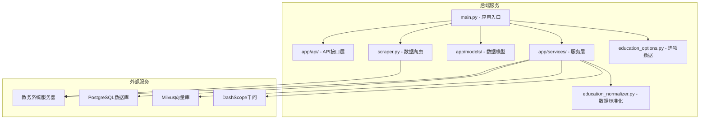

**图表来源**
- [backend/main.py:1-100](file://backend/main.py#L1-L100)
- [backend/app/services/data_processor.py:1-50](file://backend/app/services/data_processor.py#L1-L50)

**章节来源**
- [backend/main.py:1-150](file://backend/main.py#L1-L150)
- [backend/requirements.txt:1-48](file://backend/requirements.txt#L1-L48)

## 核心组件

### 数据处理服务架构

系统采用分层架构设计，主要包括以下核心组件：

1. **API层**：提供RESTful接口和WebSocket通信
2. **服务层**：包含数据处理、AI服务、向量存储等核心业务逻辑
3. **数据层**：负责数据持久化和检索
4. **爬虫层**：处理教务系统的数据抓取
5. **标准化层**：提供统一的数据格式化和验证机制

### 数据流处理流程

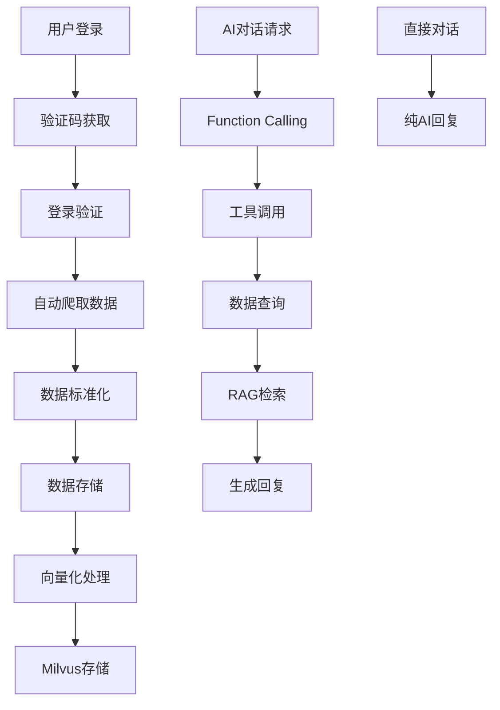

**图表来源**
- [backend/main.py:384-435](file://backend/main.py#L384-L435)
- [backend/app/services/data_processor.py:16-96](file://backend/app/services/data_processor.py#L16-L96)

**章节来源**
- [backend/app/services/data_processor.py:13-356](file://backend/app/services/data_processor.py#L13-L356)
- [backend/app/services/qwen_service.py:15-516](file://backend/app/services/qwen_service.py#L15-L516)

## 架构概览

### 系统架构图

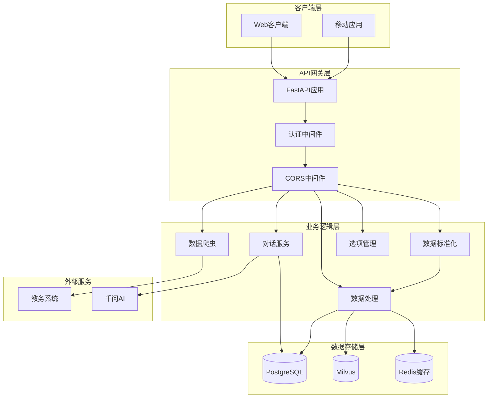

**图表来源**
- [backend/main.py:49-96](file://backend/main.py#L49-L96)
- [backend/app/services/data_processor.py:97-177](file://backend/app/services/data_processor.py#L97-L177)

### 组件交互流程

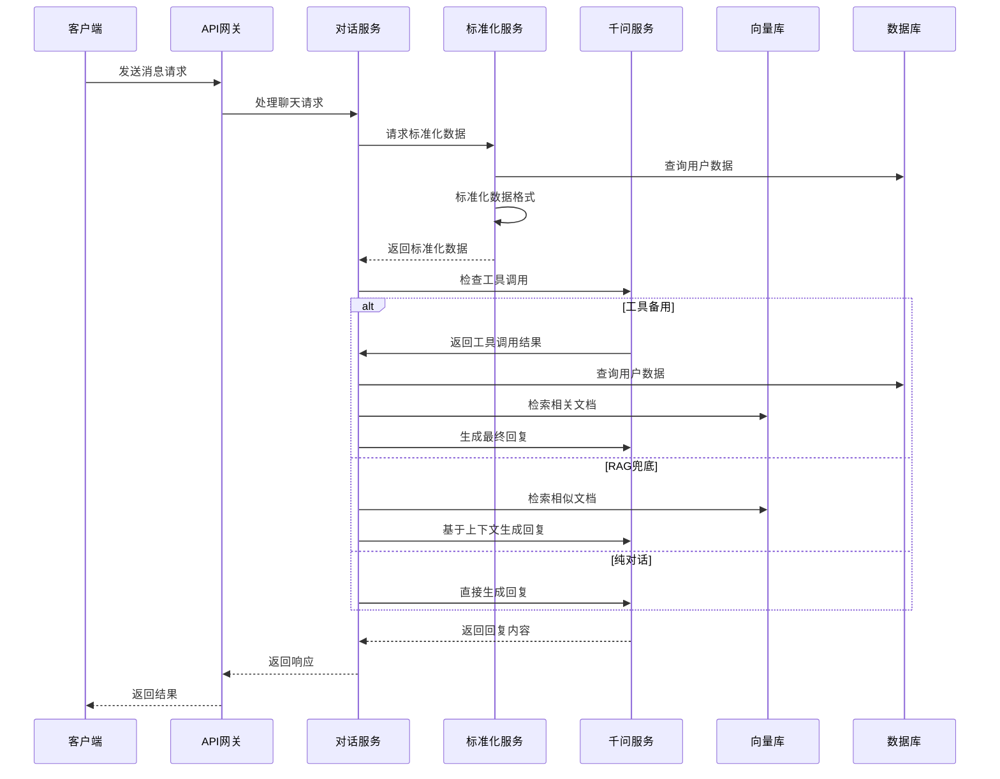

**图表来源**
- [backend/app/api/chat.py:46-179](file://backend/app/api/chat.py#L46-L179)
- [backend/app/services/qwen_service.py:190-321](file://backend/app/services/qwen_service.py#L190-L321)

**章节来源**
- [backend/app/api/chat.py:1-249](file://backend/app/api/chat.py#L1-L249)
- [backend/app/services/qwen_service.py:15-516](file://backend/app/services/qwen_service.py#L15-L516)

## 详细组件分析

### 教育数据标准化模块

**新增** 教育数据标准化模块是本次更新的核心组件，提供统一的数据格式化和验证机制，确保来自不同源的数据能够被统一处理和存储。

#### 标准化数据结构

标准化模块将原始数据转换为统一的契约结构：

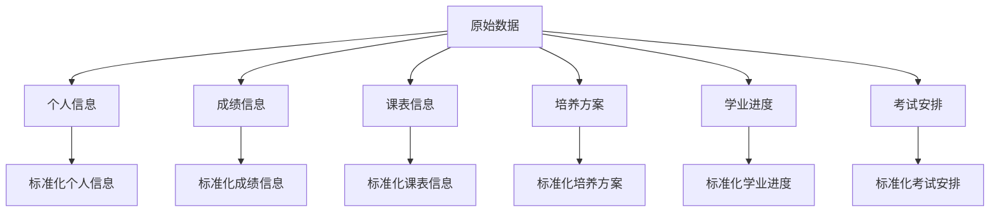

**图表来源**
- [backend/app/services/education_normalizer.py:27-112](file://backend/app/services/education_normalizer.py#L27-L112)

#### 标准化功能特性

1. **多源兼容**：支持多种历史数据结构，包括新的按学期分组和传统的直接列表格式
2. **数据验证**：自动验证数据类型，确保只有有效的字典和列表被处理
3. **字段映射**：统一不同源的字段命名，如"地点"替代"教室"，"考试地点"替代"地点"
4. **结构重组**：将分散的数据重新组织为统一的标准化结构

#### 核心处理函数

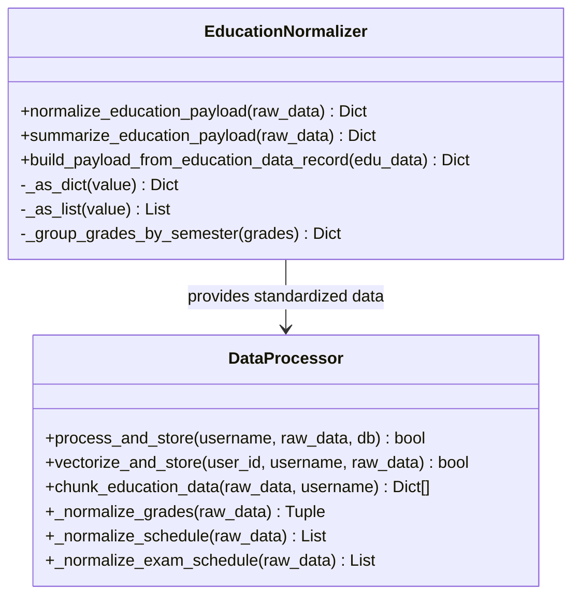

**图表来源**
- [backend/app/services/education_normalizer.py:17-140](file://backend/app/services/education_normalizer.py#L17-L140)
- [backend/app/services/data_processor.py:17-61](file://backend/app/services/data_processor.py#L17-L61)

**章节来源**
- [backend/app/services/education_normalizer.py:1-142](file://backend/app/services/education_normalizer.py#L1-L142)
- [backend/test_normalizer.py:1-58](file://backend/test_normalizer.py#L1-L58)

### 数据处理服务

数据处理服务是整个系统的核心，负责将爬取的原始数据进行结构化处理、存储和向量化。

#### 数据处理流程

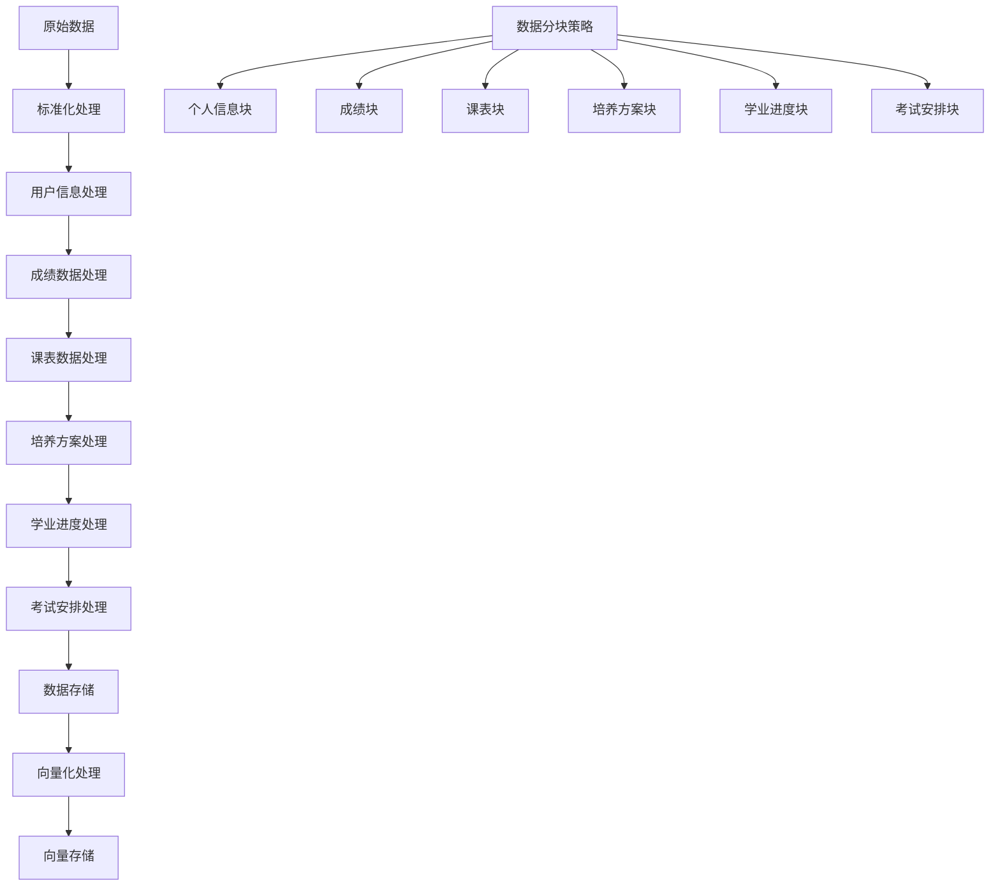

**图表来源**
- [backend/app/services/data_processor.py:178-356](file://backend/app/services/data_processor.py#L178-L356)

#### 数据存储架构

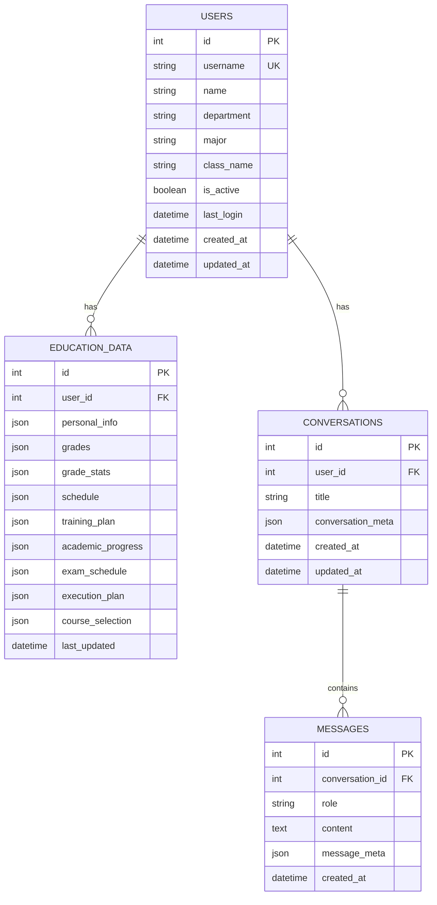

**图表来源**
- [backend/app/models/user.py:11-33](file://backend/app/models/user.py#L11-L33)
- [backend/app/models/education_data.py:11-47](file://backend/app/models/education_data.py#L11-L47)
- [backend/app/models/conversation.py:11-42](file://backend/app/models/conversation.py#L11-L42)

**章节来源**
- [backend/app/services/data_processor.py:13-356](file://backend/app/services/data_processor.py#L13-L356)
- [backend/app/models/education_data.py:1-103](file://backend/app/models/education_data.py#L1-L103)

### AI对话服务

AI对话服务集成了千问大模型的Function Calling能力，实现了智能的数据查询和对话功能。

#### 对话处理流程

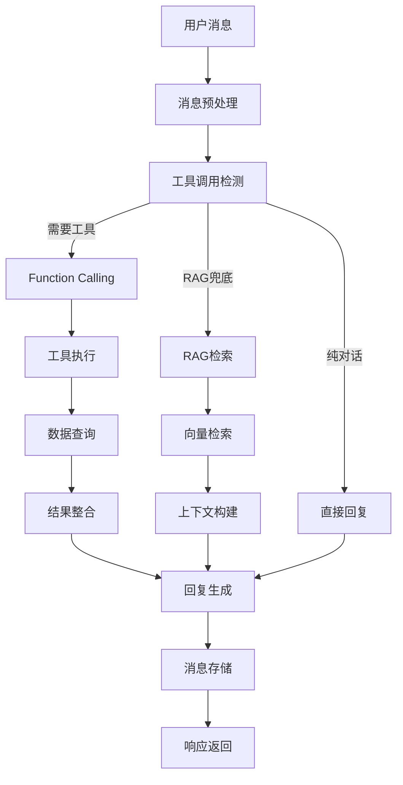

**图表来源**
- [backend/app/api/chat.py:115-147](file://backend/app/api/chat.py#L115-L147)
- [backend/app/services/qwen_service.py:190-321](file://backend/app/services/qwen_service.py#L190-L321)

#### 工具调用机制

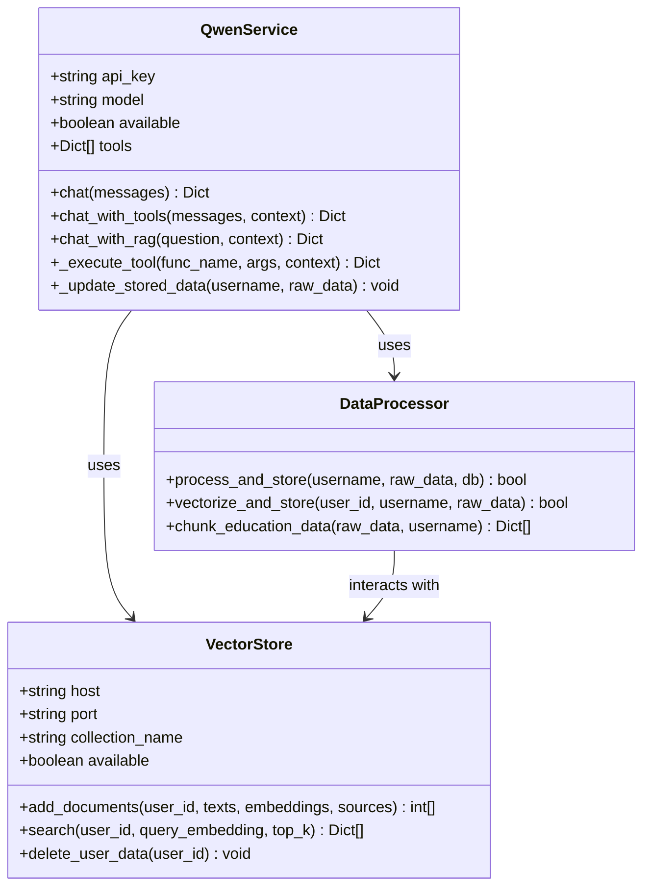

**图表来源**
- [backend/app/services/qwen_service.py:15-516](file://backend/app/services/qwen_service.py#L15-L516)
- [backend/app/services/data_processor.py:13-356](file://backend/app/services/data_processor.py#L13-L356)
- [backend/app/services/vector_store.py:14-185](file://backend/app/services/vector_store.py#L14-L185)

**章节来源**
- [backend/app/services/qwen_service.py:15-516](file://backend/app/services/qwen_service.py#L15-L516)
- [backend/app/api/chat.py:1-249](file://backend/app/api/chat.py#L1-L249)

### 数据爬虫服务

数据爬虫服务负责从教务系统中抓取各种数据，支持多种查询方式和数据格式。

#### 支持的数据类型

| 数据类型 | 爬取方法 | 查询参数 | 返回格式 |
|---------|---------|---------|---------|
| 个人信息 | get_personal_info | 无 | JSON对象 |
| 成绩信息 | get_grades | kksj,kcxz,kcmc,fxkc,xsfs | 成绩列表+统计信息 |
| 课表信息 | get_schedule | semester,week | 课程列表 |
| 培养方案 | get_my_training_plan | 无 | 方案详情 |
| 学业进度 | get_academic_progress | study_type | 进度详情 |
| 考试安排 | get_exam_schedule | semester | 考试列表 |

**章节来源**
- [backend/scraper.py:13-1258](file://backend/scraper.py#L13-L1258)
- [backend/education_options.py:1-420](file://backend/education_options.py#L1-L420)

### 选项数据管理系统

系统内置了完整的教育选项数据管理，为AI对话提供丰富的上下文信息。

#### 选项数据结构

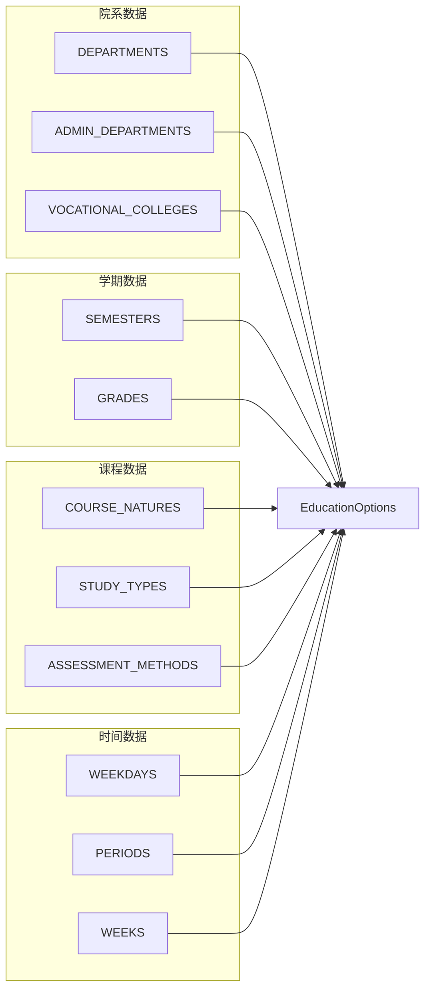

**图表来源**
- [backend/education_options.py:9-420](file://backend/education_options.py#L9-L420)

**章节来源**
- [backend/education_options.py:130-420](file://backend/education_options.py#L130-L420)

### 成绩统计处理增强

**更新** 数据处理服务中的成绩统计处理已得到显著增强，主要体现在以下方面：

#### 成绩统计提取的鲁棒性改进

1. **参数化处理**：_extract_grade_stats()方法现在可以接受grades参数，提供更灵活的统计计算能力
2. **HTML提取失败回退机制**：当从HTML页面提取统计信息失败时，系统会自动使用成绩列表进行计算
3. **课程数量统计**：新增course_count字段，完整统计已修课程数量
4. **增强的错误处理**：即使HTML解析失败，也能保证统计数据的完整性

#### 成绩统计文本格式化优化

1. **人类可读格式**：成绩统计信息现在以清晰的中文格式输出，包含完整的统计指标
2. **标准化字段命名**：统一使用中文字段名称，如"已修课程数量"、"已修读学分"等
3. **完整的统计维度**：涵盖总学分要求、已修读学分、还需修读学分、免修学分、主修课程平均学分绩点、专业排名、辅修课程平均学分绩点等

#### 数据分块策略优化

1. **成绩统计文本构建**：在chunk_education_data方法中，成绩统计部分现在使用更清晰的文本格式
2. **字段一致性**：确保所有统计字段的命名和格式保持一致
3. **可读性提升**：通过换行和缩进改善统计信息的可读性

**章节来源**
- [backend/scraper.py:376-448](file://backend/scraper.py#L376-L448)
- [backend/app/services/data_processor.py:232-260](file://backend/app/services/data_processor.py#L232-L260)

### 学业进度统计格式化

**更新** 学业进度的统计数据格式化也得到了改进：

1. **结构化输出**：学业进度信息现在以清晰的层级结构输出
2. **完整字段覆盖**：包含修读类型、总学分要求、已获学分、还需学分等关键信息
3. **课程列表截断**：超过20门课程时自动截断，避免文本过长
4. **智能省略号**：在截断位置添加省略号，提示用户还有更多课程

**章节来源**
- [backend/app/services/data_processor.py:338-382](file://backend/app/services/data_processor.py#L338-L382)

## 依赖关系分析

### 外部依赖关系

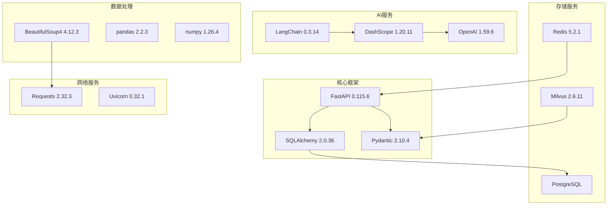

**图表来源**
- [backend/requirements.txt:1-48](file://backend/requirements.txt#L1-L48)

### 内部模块依赖

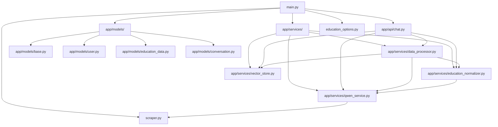

**图表来源**
- [backend/main.py:29-44](file://backend/main.py#L29-L44)
- [backend/app/api/chat.py:11-14](file://backend/app/api/chat.py#L11-L14)

**章节来源**
- [backend/requirements.txt:1-48](file://backend/requirements.txt#L1-L48)
- [backend/main.py:1-951](file://backend/main.py#L1-L951)

## 性能考虑

### 数据处理优化

1. **批量处理**：向量化过程采用10条数据一批的批量处理，避免超时问题
2. **内存管理**：及时清理向量数据，避免内存泄漏
3. **编码处理**：智能识别GBK/UTF-8编码，提高数据解析效率
4. **缓存策略**：使用Redis缓存验证码和会话信息
5. **标准化优化**：教育数据标准化模块提供高效的格式转换

### 网络性能优化

1. **服务器选择算法**：基于学号的哈希算法实现均匀分布
2. **超时控制**：统一设置10秒超时，防止长时间阻塞
3. **重试机制**：对网络异常进行适当的重试处理

### 存储性能优化

1. **向量索引**：使用IVF_FLAT索引类型，平衡查询速度和存储空间
2. **数据分块**：合理的数据分块策略提高检索精度
3. **连接池**：数据库连接池管理，减少连接开销

## 故障排除指南

### 常见问题诊断

#### 登录失败问题

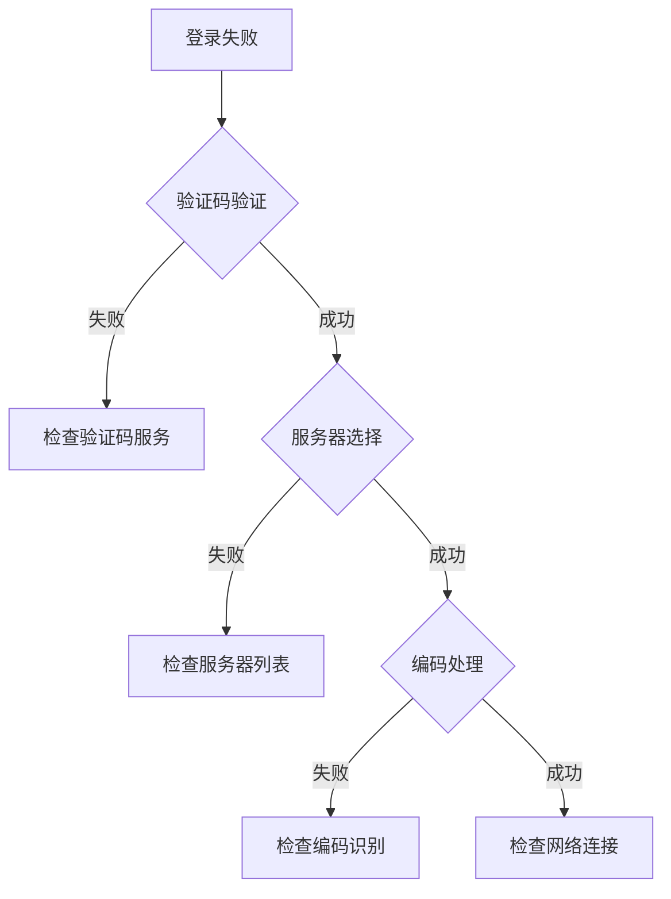

**图表来源**
- [backend/main.py:224-382](file://backend/main.py#L224-L382)

#### 数据爬取失败

1. **检查网络连接**：确认能够访问教务系统服务器
2. **验证登录状态**：确保会话有效
3. **检查编码问题**：确认数据编码正确
4. **查看日志输出**：分析具体的错误信息

#### AI服务异常

1. **检查API密钥**：确认QWEN_API_KEY配置正确
2. **验证模型可用性**：确认DashScope服务正常
3. **检查向量库连接**：确认Milvus服务可用
4. **监控资源使用**：检查内存和CPU使用情况

### 调试工具

系统提供了完整的测试脚本用于功能验证：

1. **登录测试**：验证验证码获取和登录流程
2. **爬虫测试**：测试各种数据爬取功能
3. **选项测试**：验证教育选项数据的正确性
4. **标准化测试**：验证教育数据标准化功能

**章节来源**
- [backend/test_login.py:1-152](file://backend/test_login.py#L1-L152)
- [backend/test_scraper.py:1-280](file://backend/test_scraper.py#L1-L280)
- [backend/test_normalizer.py:1-58](file://backend/test_normalizer.py#L1-L58)

### 错误处理增强

**更新** 系统现已增强了错误处理机制，特别是在向量化工作流程中：

#### 向量化工作流程改进

1. **集合存在性验证**：在向量化前检查Milvus集合是否存在，不存在时自动创建
2. **条件创建逻辑**：只有在服务可用且集合不存在时才创建新集合
3. **数据清理机制**：向量化前删除用户旧数据，避免数据重复
4. **批量处理优化**：10条数据一批的批量向量化，避免超时
5. **占位向量处理**：嵌入生成失败时使用占位向量，保证流程继续

#### 数据处理稳定性提升

1. **事务回滚机制**：数据库操作失败时自动回滚，保持数据一致性
2. **服务可用性检查**：在执行操作前检查各服务可用性
3. **异常捕获和日志记录**：完整的异常处理和详细日志记录
4. **资源清理**：确保数据库连接和向量库连接正确关闭

#### 字段命名一致性改进

**更新** 在数据处理服务中，已对字段引用进行统一修正，确保与爬取数据字段命名一致：

1. **课表数据字段修正**：将课表中的'教室'字段引用统一更改为'地点'，以匹配爬虫返回的JSON结构
2. **考试安排字段修正**：将考试安排中的'考试地点'字段引用统一更改为'地点'，确保字段命名一致性
3. **字段映射优化**：在chunk_education_data方法中，所有地点相关信息均使用'地点'键进行访问

#### 培养方案课程分类逻辑更新

**更新** 培养方案的课程分类逻辑已从按类别分组改为按学期组织，这一重要变更提升了数据组织的逻辑性和实用性：

1. **按学期分组策略**：培养方案中的课程现在按照"学期"字段进行分组，而不是之前的"类别"分组
2. **学期字段优先级**：优先使用"学期"字段，如果不存在则回退到"建议修读学期"字段
3. **元数据增强**：每个学期分组的向量化文档都包含"semester"元数据，便于后续查询和过滤
4. **API工具调用支持**：相关的查询工具函数（query_grades、query_schedule、query_exam_schedule）现在都支持按学期参数进行精确查询
5. **数据结构优化**：新的分组策略使得培养方案数据更适合按学期维度进行检索和展示

#### 成绩统计处理增强

**更新** 成绩统计处理功能得到了重大改进：

1. **参数化统计计算**：_extract_grade_stats()方法现在接受grades参数，提供更灵活的统计能力
2. **HTML提取失败回退**：当HTML解析失败时，系统会自动使用成绩列表进行统计计算
3. **课程数量统计**：新增course_count字段，完整统计已修课程数量
4. **格式化输出优化**：成绩统计信息现在以更清晰的中文格式输出，提升用户体验

#### 教育数据标准化模块集成

**新增** 教育数据标准化模块已完全集成到系统中：

1. **标准化数据处理**：所有数据处理流程现在使用标准化模块统一数据格式
2. **向量化数据准备**：标准化后的数据更适合向量化和RAG检索
3. **AI对话数据支持**：标准化数据为AI对话提供更准确的上下文信息
4. **数据一致性保证**：确保来自不同源的数据具有统一的结构和字段

**章节来源**
- [backend/app/services/data_processor.py:271-302](file://backend/app/services/data_processor.py#L271-L302)
- [backend/app/services/qwen_service.py:60-118](file://backend/app/services/qwen_service.py#L60-L118)
- [backend/app/services/vector_store.py:39-76](file://backend/app/services/vector_store.py#L39-L76)
- [backend/app/services/qwen_service.py:405-421](file://backend/app/services/qwen_service.py#L405-L421)
- [backend/app/services/data_processor.py:255-265](file://backend/app/services/data_processor.py#L255-L265)
- [backend/app/services/data_processor.py:333-343](file://backend/app/services/data_processor.py#L333-L343)
- [backend/scraper.py:376-448](file://backend/scraper.py#L376-L448)
- [backend/app/services/education_normalizer.py:1-142](file://backend/app/services/education_normalizer.py#L1-L142)

## 结论

数据处理服务是一个功能完整、架构清晰的教务系统AI助手解决方案。系统通过合理的分层设计、完善的错误处理机制和优化的性能策略，为用户提供了一站式的智能化教务服务体验。

### 主要优势

1. **完整的数据覆盖**：涵盖教务系统的各个方面
2. **智能AI集成**：支持Function Calling和RAG增强
3. **高可用性设计**：多服务器负载均衡和故障转移
4. **可扩展架构**：模块化设计便于功能扩展
5. **稳定的错误处理**：增强的向量化工作流程和条件创建逻辑
6. **字段命名一致性**：经过修正的数据字段引用确保了数据处理的准确性
7. **优化的课程组织**：培养方案按学期分组的改进提升了数据可用性
8. **鲁棒的统计处理**：成绩统计提取的回退机制确保了数据完整性
9. **人性化的格式化输出**：改进的统计信息格式提升了用户体验
10. **统一的数据标准**：新增的教育数据标准化模块提供了统一的数据格式化和验证机制

### 技术亮点

1. **混合存储架构**：传统关系型数据库与向量数据库结合
2. **智能编码处理**：自动识别和处理不同编码格式
3. **灵活的选项管理**：丰富的教育数据选项支持
4. **完善的监控机制**：全面的日志记录和状态跟踪
5. **健壮的错误处理**：系统化的异常捕获和恢复机制
6. **数据字段一致性**：统一的字段命名规范确保数据完整性
7. **智能课程分类**：从按类别分组到按学期组织的升级
8. **增强的统计功能**：参数化统计计算和HTML提取失败回退机制
9. **优化的用户界面**：改进的统计信息格式化输出
10. **标准化数据处理**：教育数据标准化模块提供统一的数据格式化和验证机制

该系统为高校智能化服务提供了良好的技术基础，具有较强的实用价值和推广前景。新增的教育数据标准化模块进一步提升了系统的数据处理能力和稳定性，为未来的功能扩展奠定了坚实的基础。