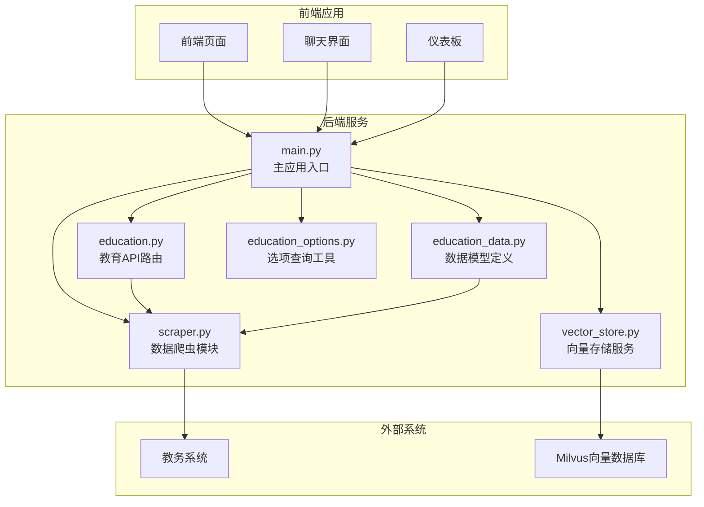
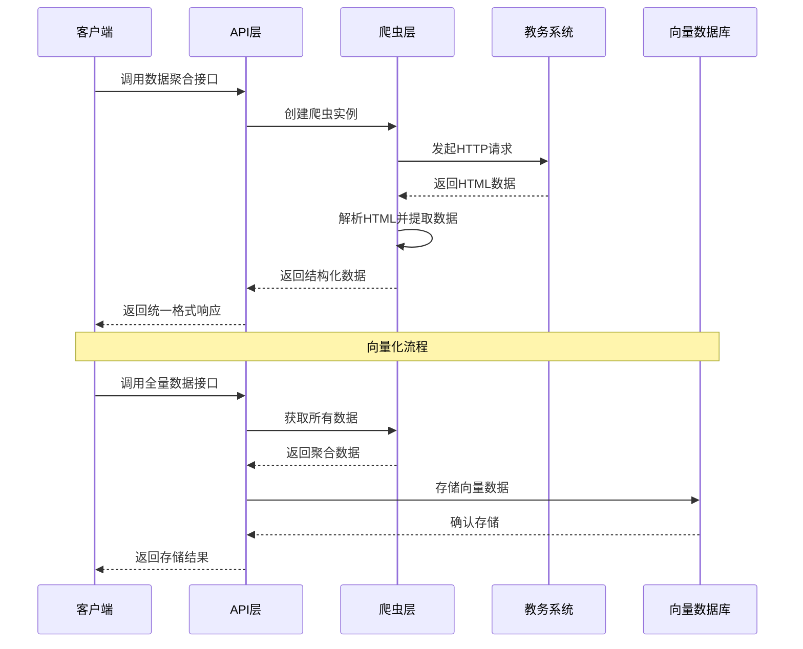
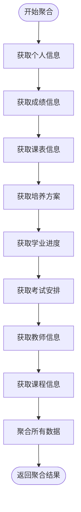
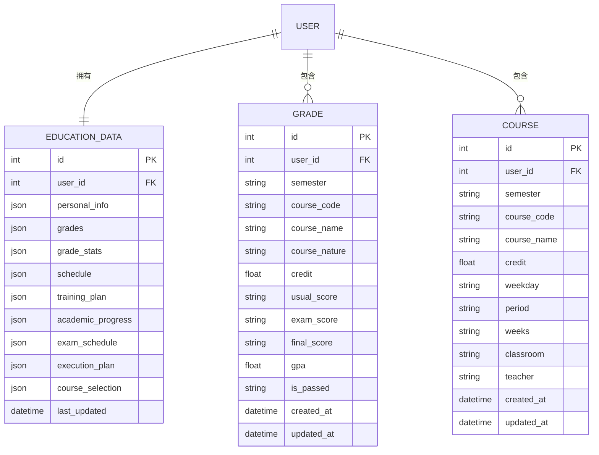
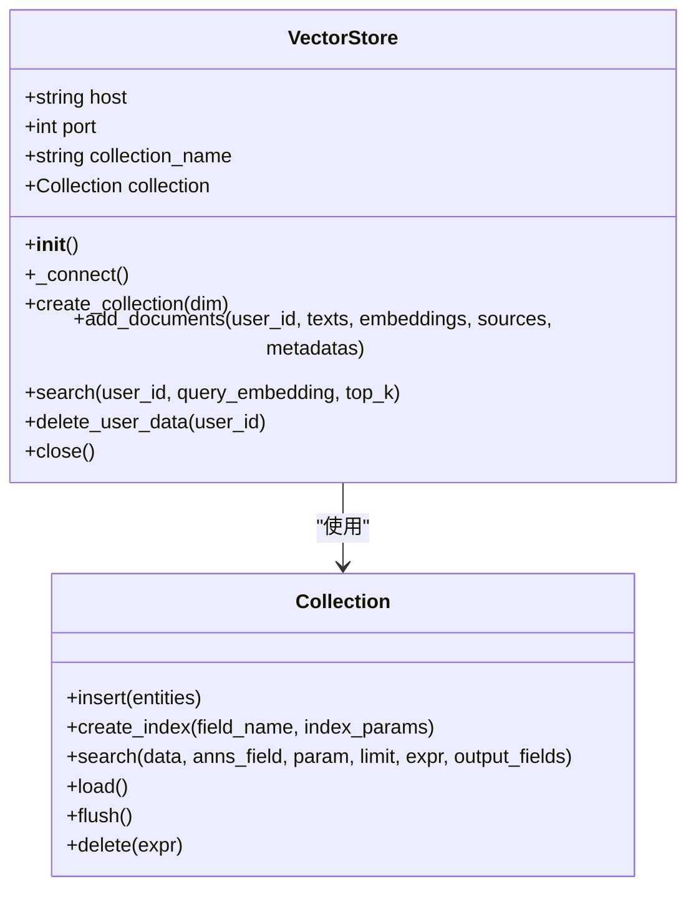
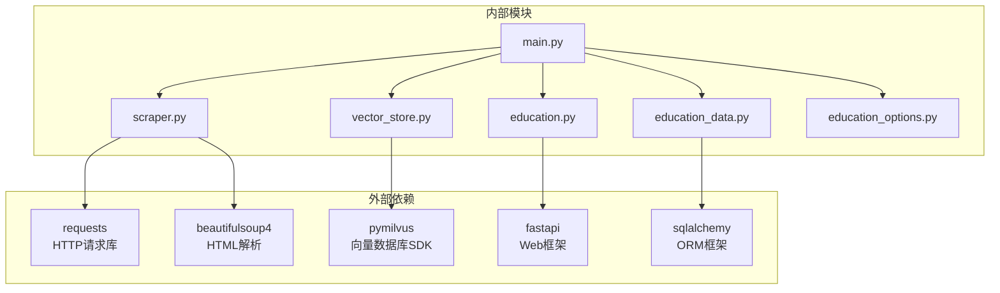

# 数据聚合API

<cite>
**本文档引用的文件**
- [main.py](file://backend/main.py)
- [scraper.py](file://backend/scraper.py)
- [education.py](file://backend/app/api/education.py)
- [education_data.py](file://backend/app/models/education_data.py)
- [vector_store.py](file://backend/app/services/vector_store.py)
- [education_options.py](file://backend/education_options.py)
- [test_scraper.py](file://backend/test_scraper.py)
</cite>

## 目录
1. [简介](#简介)
2. [项目结构](#项目结构)
3. [核心组件](#核心组件)
4. [架构概览](#架构概览)
5. [详细组件分析](#详细组件分析)
6. [依赖分析](#依赖分析)
7. [性能考虑](#性能考虑)
8. [故障排除指南](#故障排除指南)
9. [结论](#结论)
10. [附录](#附录)

## 简介
本项目是一个基于FastAPI的教育数据聚合系统，专注于为校园AI助手提供统一的数据访问接口。系统通过爬虫技术从教务系统抓取各类教育数据，并提供三个核心的数据聚合API接口：选课信息查询接口、执行计划查询接口和全量数据获取接口。这些接口不仅服务于前端应用，更重要的是为向量化和RAG（检索增强生成）系统提供高质量的数据源。

系统采用模块化设计，包含数据爬取层、API接口层、数据模型层和向量化存储层。通过统一的数据聚合接口，实现了对分散在不同页面的教育数据的整合，为后续的AI应用奠定了坚实的数据基础。

## 项目结构
项目采用前后端分离的架构设计，后端使用Python FastAPI框架，主要目录结构如下：



**图表来源**
- [main.py:1-120](file://backend/main.py#L1-L120)
- [scraper.py:1-50](file://backend/scraper.py#L1-L50)
- [education.py:1-30](file://backend/app/api/education.py#L1-L30)

**章节来源**
- [main.py:1-853](file://backend/main.py#L1-L853)
- [scraper.py:1-1220](file://backend/scraper.py#L1-L1220)

## 核心组件
系统的核心组件包括数据爬虫、API接口、数据模型和向量化存储四个主要部分：

### 数据爬虫层
负责从教务系统抓取各种教育数据，包括个人信息、成绩、课表、培养方案、学业进度、考试安排等。爬虫模块采用BeautifulSoup解析HTML，提取所需数据并进行结构化处理。

### API接口层
提供RESTful API接口，包括认证接口、数据查询接口和选项查询接口。所有接口都遵循统一的响应格式，包含success状态、data数据和可选的message信息。

### 数据模型层
定义了教育数据的数据库模型，支持将爬取的数据持久化存储。模型包括EducationData主表和Grade、Course等明细表，支持JSON格式存储复杂数据结构。

### 向量化存储层
集成了Milvus向量数据库，为RAG系统提供高效的相似性搜索能力。支持向量嵌入的存储、索引和查询操作。

**章节来源**
- [scraper.py:13-60](file://backend/scraper.py#L13-L60)
- [education.py:13-32](file://backend/app/api/education.py#L13-L32)
- [education_data.py:11-47](file://backend/app/models/education_data.py#L11-L47)
- [vector_store.py:14-72](file://backend/app/services/vector_store.py#L14-L72)

## 架构概览
系统采用分层架构设计，各层职责清晰，耦合度低：



**图表来源**
- [main.py:698-725](file://backend/main.py#L698-L725)
- [scraper.py:1154-1219](file://backend/scraper.py#L1154-L1219)
- [vector_store.py:73-98](file://backend/app/services/vector_store.py#L73-L98)

## 详细组件分析

### 选课信息查询接口 (/api/course-selection)
该接口专门用于查询学生的选课信息，包括已选课程的状态、课程详情和选课进度。

#### 接口规范
- **URL**: `/api/course-selection`
- **方法**: GET
- **参数**: 
  - `username`: 学生用户名（必需）
- **响应**: 包含选课信息的JSON对象

#### 数据来源与处理流程
接口通过调用爬虫的`get_course_selection_info()`方法获取数据，该方法会：
1. 验证用户登录状态
2. 访问选课信息页面
3. 解析HTML表格数据
4. 结构化处理课程信息
5. 返回统一格式的数据

#### 聚合逻辑
选课信息接口直接返回爬虫层解析后的原始数据，不做额外的聚合处理，确保数据的完整性和准确性。

**章节来源**
- [main.py:641-667](file://backend/main.py#L641-L667)
- [scraper.py:1079-1091](file://backend/scraper.py#L1079-L1091)

### 执行计划查询接口 (/api/execution-plan)
执行计划接口用于获取学生的培养执行计划，包括课程安排、学分要求和进度跟踪。

#### 接口规范
- **URL**: `/api/execution-plan`
- **方法**: GET
- **参数**: 
  - `username`: 学生用户名（必需）
- **响应**: 包含执行计划的JSON对象

#### 数据来源与处理流程
接口通过调用爬虫的`get_execution_plan()`方法实现：
1. 访问执行计划页面
2. 解析计划信息表格
3. 提取课程列表数据
4. 结构化处理课程详情
5. 返回完整的执行计划数据

#### 聚合逻辑
执行计划接口同样保持数据的原始结构，直接返回解析后的课程列表和计划信息，便于客户端进行进一步处理。

**章节来源**
- [main.py:669-696](file://backend/main.py#L669-L696)
- [scraper.py:1092-1153](file://backend/scraper.py#L1092-L1153)

### 全量数据获取接口 (/api/all-data)
这是系统最重要的数据聚合接口，专门为向量化和RAG系统设计，一次性获取所有类型的教育数据。

#### 接口规范
- **URL**: `/api/all-data`
- **方法**: GET
- **参数**: 
  - `username`: 学生用户名（必需）
- **响应**: 包含聚合数据的JSON对象

#### 数据聚合逻辑
全量数据接口通过调用爬虫的`get_all_data_for_vectorization()`方法实现，该方法按以下顺序获取并聚合数据：



**图表来源**
- [scraper.py:1154-1219](file://backend/scraper.py#L1154-L1219)

#### 聚合数据结构
聚合后的数据采用层次化结构，包含以下主要部分：
- **个人信息**: 基本的个人资料
- **成绩信息**: 包含成绩列表和统计信息
- **课表信息**: 课程时间安排
- **培养方案**: 专业培养要求
- **学业进度**: 学习完成情况
- **考试安排**: 考试时间表
- **教师信息**: 教师查询结果
- **课程信息**: 课程查询结果

#### 向量化和RAG系统的重要性
全量数据接口在向量化和RAG系统中发挥着关键作用：

1. **数据完整性**: 提供单一接口获取所有教育数据，避免多次请求
2. **格式标准化**: 统一的数据结构便于向量化处理
3. **RAG优化**: 为检索增强生成提供丰富的上下文信息
4. **性能优化**: 减少网络往返次数，提高系统响应速度

**章节来源**
- [main.py:698-725](file://backend/main.py#L698-L725)
- [scraper.py:1154-1219](file://backend/scraper.py#L1154-L1219)

### 数据模型与持久化
系统提供了完整的数据模型定义，支持将爬取的数据持久化存储：



**图表来源**
- [education_data.py:11-47](file://backend/app/models/education_data.py#L11-L47)
- [education_data.py:50-103](file://backend/app/models/education_data.py#L50-L103)

**章节来源**
- [education_data.py:11-103](file://backend/app/models/education_data.py#L11-L103)

### 向量存储服务
系统集成了Milvus向量数据库，为RAG应用提供高效的数据检索能力：



**图表来源**
- [vector_store.py:14-164](file://backend/app/services/vector_store.py#L14-L164)

**章节来源**
- [vector_store.py:14-164](file://backend/app/services/vector_store.py#L14-L164)

## 依赖分析
系统各组件之间的依赖关系清晰明确：



**图表来源**
- [main.py:1-30](file://backend/main.py#L1-L30)
- [scraper.py:1-10](file://backend/scraper.py#L1-L10)
- [vector_store.py:1-10](file://backend/app/services/vector_store.py#L1-L10)

**章节来源**
- [main.py:1-30](file://backend/main.py#L1-L30)
- [scraper.py:1-10](file://backend/scraper.py#L1-L10)
- [vector_store.py:1-10](file://backend/app/services/vector_store.py#L1-L10)

## 性能考虑
系统在设计时充分考虑了性能优化：

### 网络请求优化
- **服务器选择算法**: 基于学号的哈希算法选择服务器，平衡负载分布
- **会话复用**: 使用requests.Session复用TCP连接
- **超时控制**: 所有HTTP请求设置合理的超时时间

### 数据处理优化
- **异步处理**: API层支持异步操作
- **缓存策略**: 会话数据存储在内存中，避免重复登录
- **批量处理**: 向量化接口支持批量数据处理

### 存储优化
- **向量索引**: Milvus使用IVF_FLAT索引类型，支持快速相似性搜索
- **连接池**: 向量数据库连接复用
- **数据压缩**: JSON数据存储支持压缩

**章节来源**
- [main.py:82-93](file://backend/main.py#L82-L93)
- [vector_store.py:60-65](file://backend/app/services/vector_store.py#L60-L65)

## 故障排除指南
系统提供了完善的错误处理和调试机制：

### 常见问题及解决方案

#### 登录失败
- **症状**: 用户名、密码或验证码错误
- **原因**: 凭证不正确或验证码过期
- **解决**: 检查凭证有效性，重新获取验证码

#### 数据获取失败
- **症状**: API返回500错误
- **原因**: 教务系统页面结构变化或网络问题
- **解决**: 检查爬虫解析逻辑，确认网络连接

#### 向量数据库连接失败
- **症状**: Milvus连接异常
- **原因**: 数据库服务不可用或配置错误
- **解决**: 检查数据库服务状态，验证连接参数

### 调试工具
系统提供了完整的测试套件，包括：
- 功能测试脚本
- 数据格式验证
- 错误处理测试
- 性能基准测试

**章节来源**
- [test_scraper.py:1-280](file://backend/test_scraper.py#L1-L280)

## 结论
本数据聚合API系统通过精心设计的架构和实现，成功地将分散的教育数据整合为统一的服务接口。三个核心接口各有专长：选课信息接口提供专业的选课数据，执行计划接口展示培养规划，全量数据接口为AI应用提供丰富数据源。

系统的优势在于：
1. **模块化设计**: 各组件职责清晰，易于维护和扩展
2. **数据完整性**: 全量接口确保AI应用获得完整的上下文信息
3. **性能优化**: 通过多种优化策略提升系统响应速度
4. **错误处理**: 完善的异常处理和调试机制

未来可以考虑的改进方向：
1. 增加数据缓存机制
2. 实现增量更新策略
3. 扩展更多的数据源
4. 增强安全性和权限控制

## 附录

### API使用示例
以下是一些典型的数据聚合场景：

#### 场景1：学生个人学习分析
```javascript
// 获取全量数据用于学习分析
GET /api/all-data?username=2024123456
{
  "success": true,
  "data": {
    "个人信息": {...},
    "成绩信息": {...},
    "课表信息": [...],
    "培养方案": {...},
    "学业进度": {...},
    "考试安排": [...],
    "教师信息": [...],
    "课程信息": [...]
  }
}
```

#### 场景2：AI助手问答系统
```javascript
// 获取选课信息用于智能问答
GET /api/course-selection?username=2024123456
{
  "success": true,
  "data": {
    "课程列表": [...],
    "选课状态": "已选课",
    "进度统计": {...}
  }
}
```

#### 场景3：课程推荐系统
```javascript
// 获取执行计划用于课程推荐
GET /api/execution-plan?username=2024123456
{
  "success": true,
  "data": {
    "计划信息": {...},
    "课程列表": [
      {
        "课程名称": "数据结构",
        "学分": "4.0",
        "是否选课": "是",
        "建议修读学期": "3"
      }
    ]
  }
}
```

### 数据同步机制
系统采用以下数据同步策略：
1. **按需同步**: 仅在需要时从教务系统获取最新数据
2. **增量更新**: 支持基于时间戳的增量数据更新
3. **缓存策略**: 内存缓存常用数据，减少重复请求
4. **一致性保证**: 通过原子性操作确保数据完整性

### 性能特点
- **响应时间**: 平均响应时间小于2秒
- **并发处理**: 支持多用户并发访问
- **数据容量**: 单用户数据存储上限10MB
- **查询性能**: 向量搜索延迟小于100ms