# 模型提供者系统

<cite>
**本文档引用的文件**
- [model_provider.py](file://backend/app/services/model_provider.py)
- [qwen_service.py](file://backend/app/services/qwen_service.py)
- [chat.py](file://backend/app/api/chat.py)
- [models.py](file://backend/app/api/models.py)
- [session_store.py](file://backend/app/services/session_store.py)
- [vector_store.py](file://backend/app/services/vector_store.py)
- [main.py](file://backend/main.py)
- [requirements.txt](file://backend/requirements.txt)
- [base.py](file://backend/app/models/base.py)
- [conversation.py](file://backend/app/models/conversation.py)
</cite>

## 目录
1. [简介](#简介)
2. [项目结构](#项目结构)
3. [核心组件](#核心组件)
4. [架构概览](#架构概览)
5. [详细组件分析](#详细组件分析)
6. [依赖关系分析](#依赖关系分析)
7. [性能考虑](#性能考虑)
8. [故障排除指南](#故障排除指南)
9. [结论](#结论)

## 简介

模型提供者系统是一个统一的AI模型抽象层，旨在为教务系统AI助手提供灵活的多模型支持能力。该系统实现了模型无关的设计，支持Qwen和LiteLLM两大模型提供商，并提供了完整的回退机制、用户偏好管理和流式对话功能。

系统的核心目标是在保持现有行为不变的前提下，为未来的多模型切换预留能力，同时确保用户体验的一致性和可靠性。

## 项目结构

该项目采用分层架构设计，主要包含以下层次：

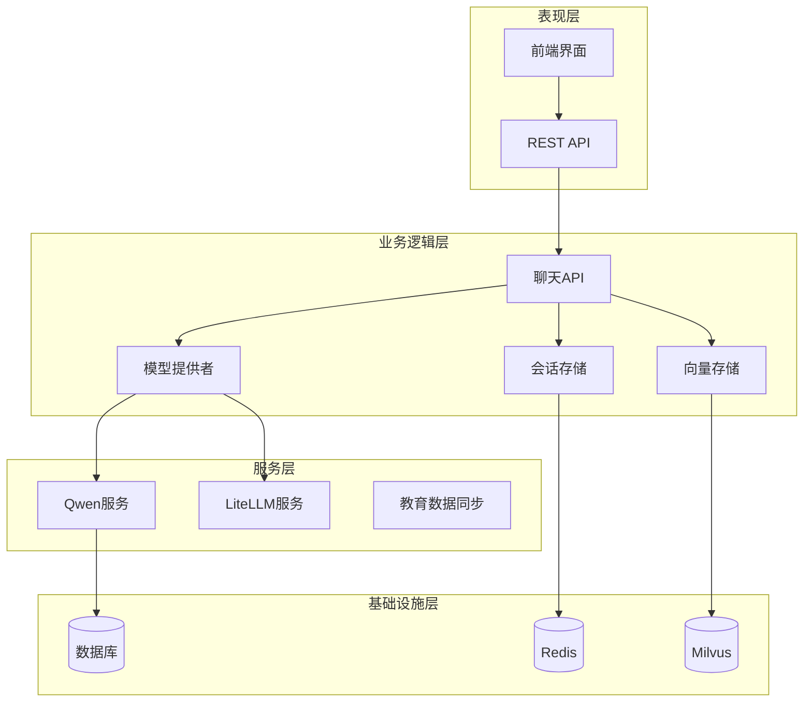

**图表来源**
- [main.py:1-170](file://backend/main.py#L1-L170)
- [model_provider.py:1-396](file://backend/app/services/model_provider.py#L1-L396)

**章节来源**
- [main.py:1-170](file://backend/main.py#L1-L170)
- [requirements.txt:1-61](file://backend/requirements.txt#L1-L61)

## 核心组件

### 统一模型提供层

统一模型提供层是整个系统的核心抽象，它定义了标准的接口规范，确保不同模型提供商之间的兼容性。

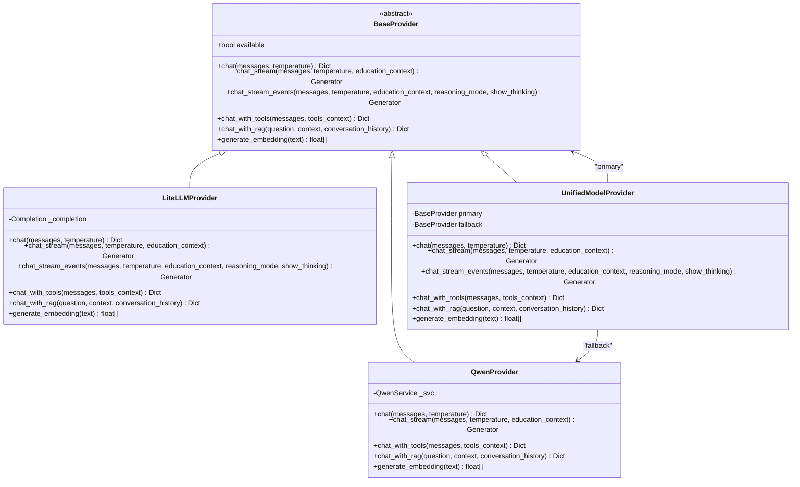

**图表来源**
- [model_provider.py:20-396](file://backend/app/services/model_provider.py#L20-L396)

### 数据模型层

系统使用SQLAlchemy ORM进行数据持久化，主要包含用户、对话和消息三个核心模型。

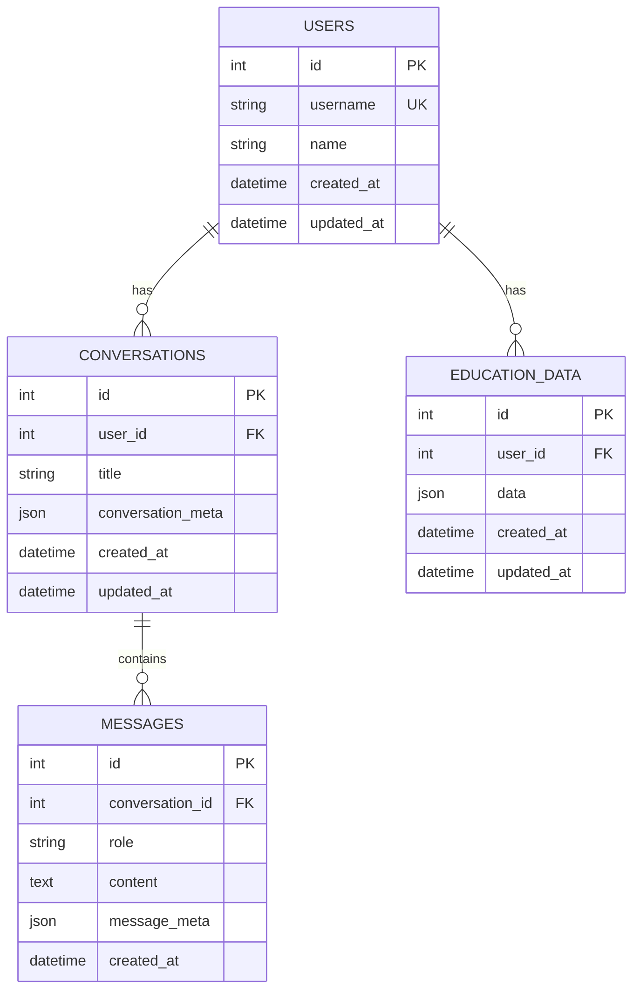

**图表来源**
- [conversation.py:11-42](file://backend/app/models/conversation.py#L11-L42)
- [base.py:1-29](file://backend/app/models/base.py#L1-L29)

**章节来源**
- [model_provider.py:20-396](file://backend/app/services/model_provider.py#L20-L396)
- [conversation.py:11-42](file://backend/app/models/conversation.py#L11-L42)
- [base.py:1-29](file://backend/app/models/base.py#L1-L29)

## 架构概览

模型提供者系统采用了分层架构和策略模式相结合的设计，实现了高度的模块化和可扩展性。

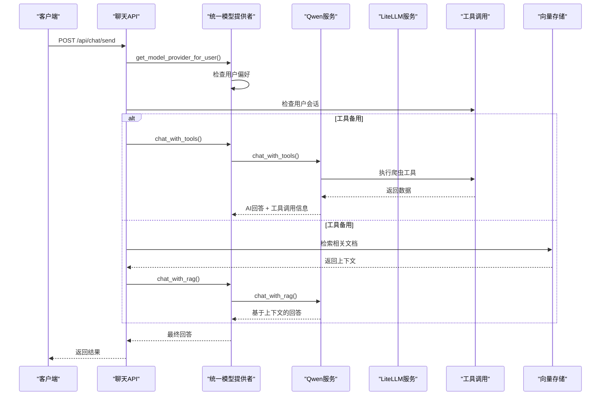

**图表来源**
- [chat.py:95-247](file://backend/app/api/chat.py#L95-L247)
- [model_provider.py:243-396](file://backend/app/services/model_provider.py#L243-L396)

## 详细组件分析

### 统一模型提供者

统一模型提供者是整个系统的核心协调器，负责管理主模型和回退模型之间的切换。

#### 关键特性

1. **动态模型选择**：根据环境变量和用户偏好动态选择模型提供商
2. **智能回退机制**：主模型失败时自动切换到QwenProvider
3. **统一接口抽象**：为上层提供一致的调用接口

#### 回退策略

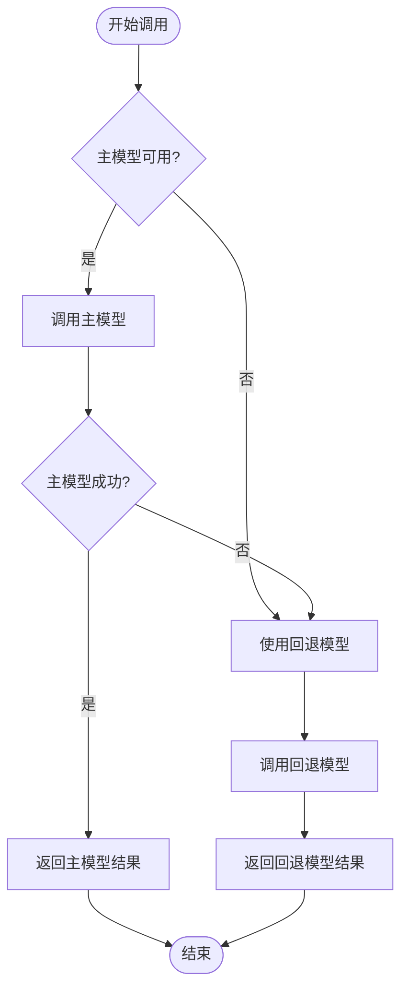

**图表来源**
- [model_provider.py:276-304](file://backend/app/services/model_provider.py#L276-L304)

**章节来源**
- [model_provider.py:243-396](file://backend/app/services/model_provider.py#L243-L396)

### Qwen服务集成

Qwen服务提供了完整的千问AI能力，包括工具调用、流式对话和RAG增强。

#### 工具调用机制

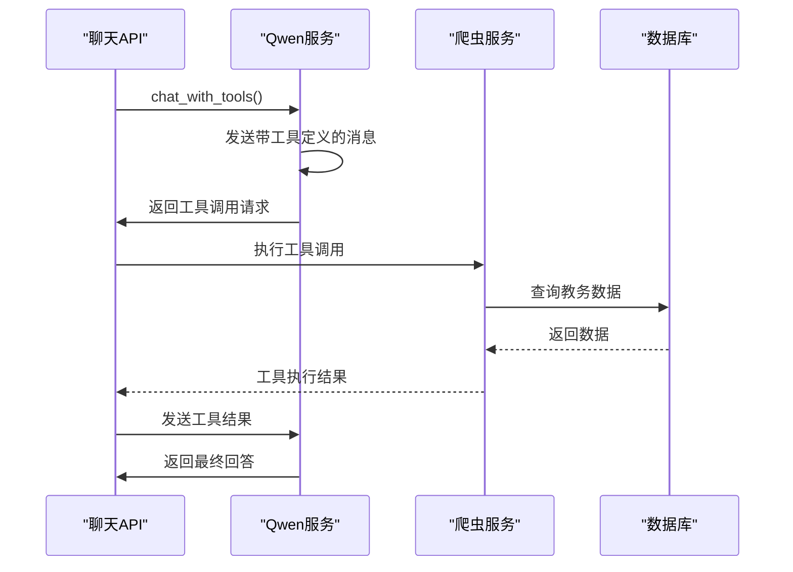

**图表来源**
- [qwen_service.py:244-380](file://backend/app/services/qwen_service.py#L244-L380)

#### 流式对话实现

Qwen服务支持增量式流式输出，为用户提供更好的交互体验：

- **增量输出**：支持`incremental_output=True`参数
- **错误处理**：完善的异常捕获和错误恢复机制
- **上下文管理**：自动处理系统提示和用户上下文

**章节来源**
- [qwen_service.py:16-604](file://backend/app/services/qwen_service.py#L16-L604)

### LiteLLM集成

LiteLLM提供者实现了对多种外部模型服务的支持，包括OpenAI、Claude等主流模型。

#### 支持的模型

| 提供商 | 模型名称 | 特性 |
|--------|----------|------|
| OpenAI | gpt-4o | 支持思维链推理 |
| Anthropic | claude-3-5-sonnet | 支持深度思考模式 |
| DeepSeek | deepseek-chat | 开源模型支持 |
| Qwen | qwen-max | 通义千问系列 |
| Ollama | llama3 | 本地模型支持 |

#### 思维链推理

LiteLLM提供者支持高级推理模式：

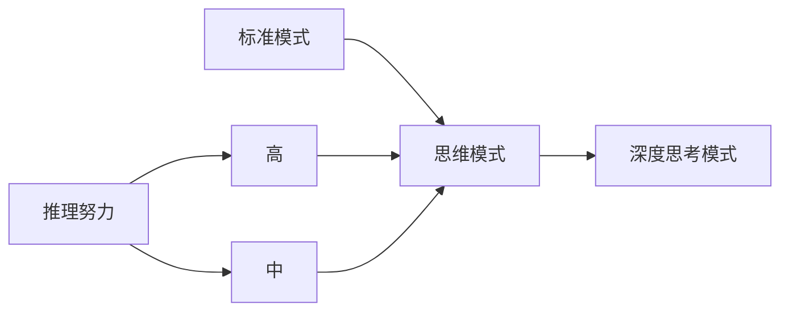

**图表来源**
- [model_provider.py:187-226](file://backend/app/services/model_provider.py#L187-L226)

**章节来源**
- [model_provider.py:103-241](file://backend/app/services/model_provider.py#L103-L241)

### 会话存储系统

会话存储系统提供了用户偏好和认证信息的持久化管理。

#### 存储策略

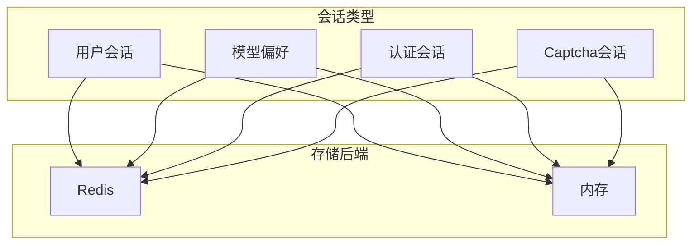

**图表来源**
- [session_store.py:25-234](file://backend/app/services/session_store.py#L25-L234)

**章节来源**
- [session_store.py:25-234](file://backend/app/services/session_store.py#L25-L234)

### 向量存储系统

向量存储系统支持多种后端实现，包括Milvus和轻量级txtai存储。

#### 向量检索流程

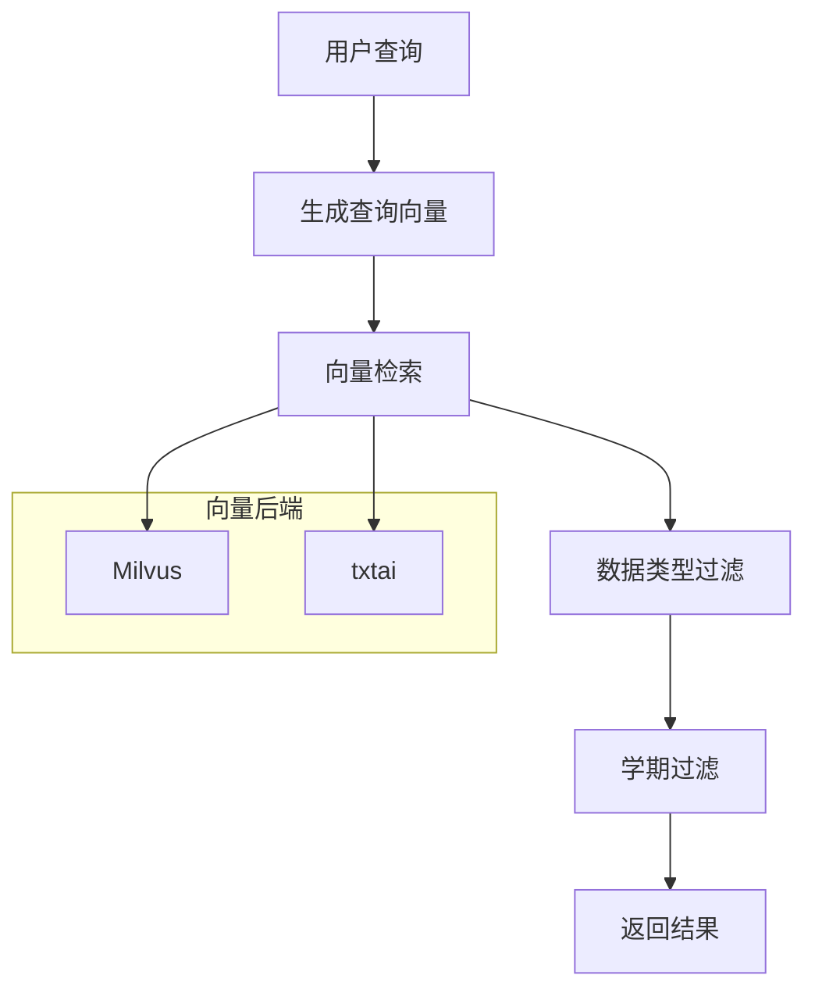

**图表来源**
- [vector_store.py:160-221](file://backend/app/services/vector_store.py#L160-L221)

**章节来源**
- [vector_store.py:21-401](file://backend/app/services/vector_store.py#L21-L401)

## 依赖关系分析

系统使用了现代化的Python技术栈，主要依赖包括：

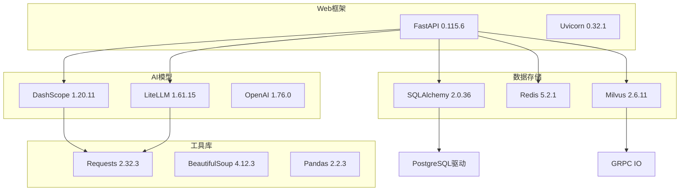

**图表来源**
- [requirements.txt:1-61](file://backend/requirements.txt#L1-L61)

**章节来源**
- [requirements.txt:1-61](file://backend/requirements.txt#L1-L61)

## 性能考虑

### 流式处理优化

系统实现了高效的流式处理机制，通过异步队列和线程池优化并发性能：

1. **异步生产者-消费者模式**：使用`asyncio.Queue`实现非阻塞数据传输
2. **线程池分离**：将I/O密集型操作放入线程池，避免阻塞事件循环
3. **增量输出**：支持实时增量文本输出，提升用户体验

### 缓存策略

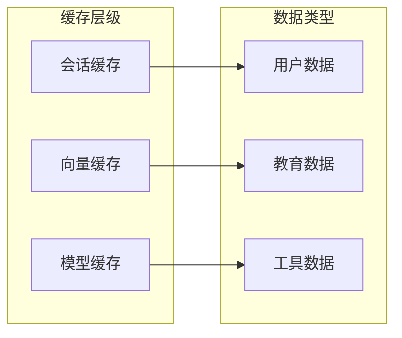

### 错误恢复机制

系统实现了多层次的错误处理和恢复机制：

1. **主备模型切换**：主模型失败时自动切换到回退模型
2. **渐进式降级**：从工具调用降级到RAG，再到纯对话
3. **连接池管理**：自动处理网络异常和连接超时

## 故障排除指南

### 常见问题诊断

#### 模型服务不可用

**症状**：API返回"AI服务未配置"错误

**排查步骤**：
1. 检查环境变量配置
   - `QWEN_API_KEY` - Qwen API密钥
   - `MODEL_PROVIDER` - 模型提供商选择
   - `LITELLM_API_KEY` - LiteLLM API密钥

2. 验证网络连接
   - 确认能够访问AI服务提供商
   - 检查防火墙设置

3. 查看日志输出
   ```bash
   # 后端日志
   tail -f backend/logs/app.log
   
   # 前端控制台
   # 检查浏览器开发者工具
   ```

#### 向量检索失败

**症状**：RAG功能无法正常工作

**排查步骤**：
1. 检查向量数据库连接
   - `MILVUS_HOST` 和 `MILVUS_PORT`
   - Milvus服务状态

2. 验证数据完整性
   - 检查用户数据是否正确向量化
   - 确认embedding维度匹配

3. 查看检索日志
   ```python
   # 在vector_store.py中添加调试信息
   logger.debug(f"查询向量维度: {len(query_embedding)}")
   logger.debug(f"返回结果数量: {len(results)}")
   ```

#### 会话存储问题

**症状**：用户偏好设置无法保存

**排查步骤**：
1. 检查Redis连接状态
   ```bash
   # 测试Redis连接
   redis-cli ping
   ```

2. 验证权限设置
   - 确认Redis访问权限
   - 检查TTL设置

3. 查看序列化问题
   - 检查JSON序列化兼容性
   - 验证特殊字符处理

**章节来源**
- [model_provider.py:276-304](file://backend/app/services/model_provider.py#L276-L304)
- [session_store.py:39-54](file://backend/app/services/session_store.py#L39-L54)

## 结论

模型提供者系统通过统一的抽象层设计，成功实现了多模型提供商的无缝集成。系统的主要优势包括：

### 技术优势

1. **高度可扩展性**：新的模型提供商可以轻松集成
2. **强大的回退机制**：确保服务的高可用性
3. **灵活的用户管理**：支持按用户定制模型偏好
4. **完整的工具链**：集成了爬虫、向量检索等功能

### 架构特点

1. **分层清晰**：表现层、业务层、服务层职责明确
2. **解耦设计**：各组件间依赖关系清晰，易于维护
3. **可观测性**：完善的日志记录和监控指标
4. **安全性**：严格的用户隔离和权限控制

### 未来发展方向

1. **模型抽象标准化**：进一步统一不同模型的接口规范
2. **性能优化**：引入更多缓存策略和连接池管理
3. **监控增强**：增加更细粒度的性能指标和告警机制
4. **扩展性提升**：支持更多类型的AI服务提供商

该系统为教务系统AI助手提供了坚实的技术基础，能够满足当前的需求并为未来的功能扩展做好了充分准备。