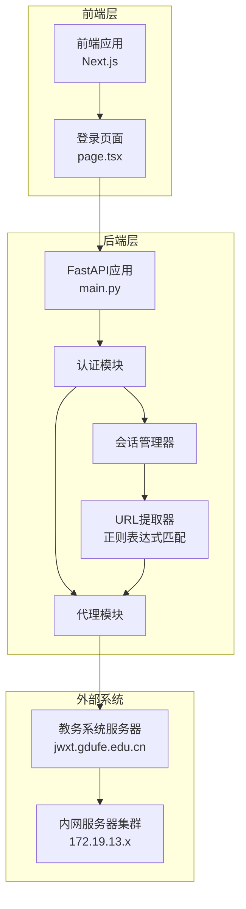
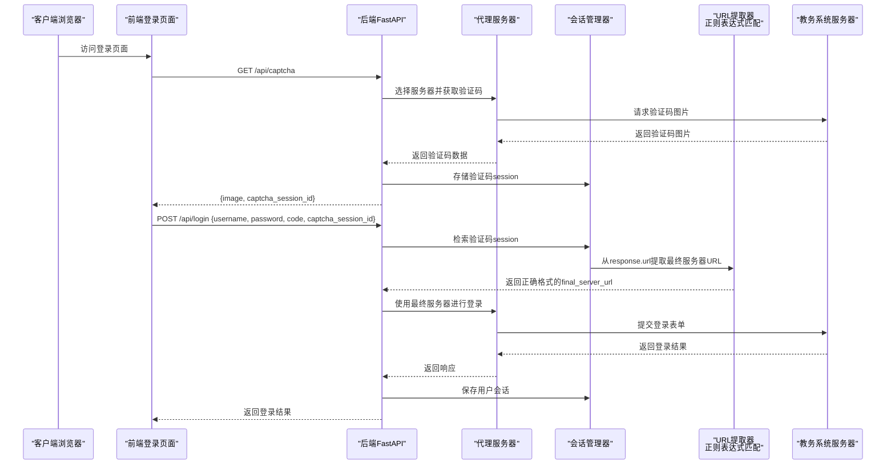
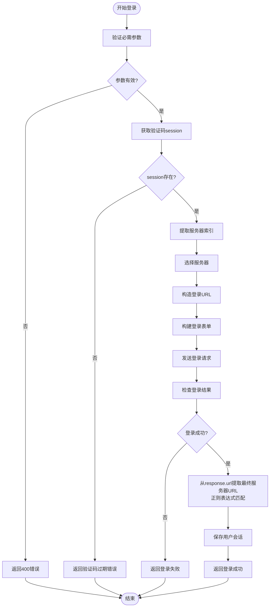
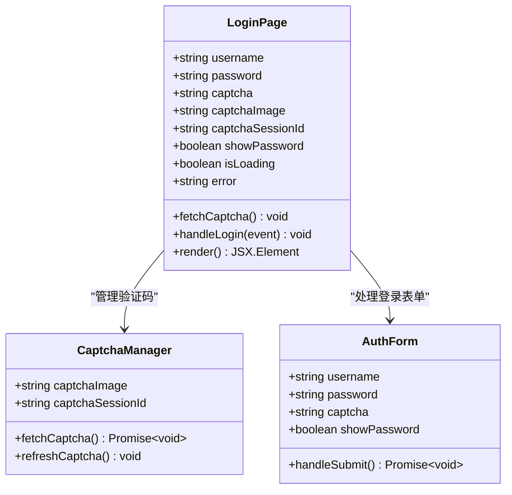
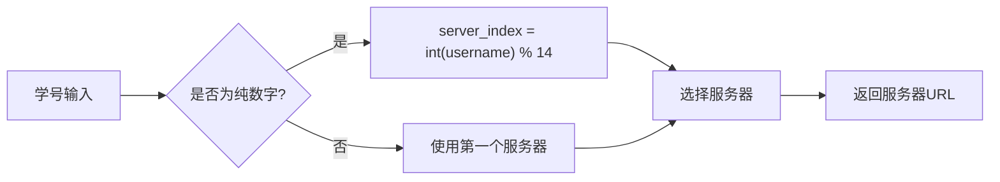
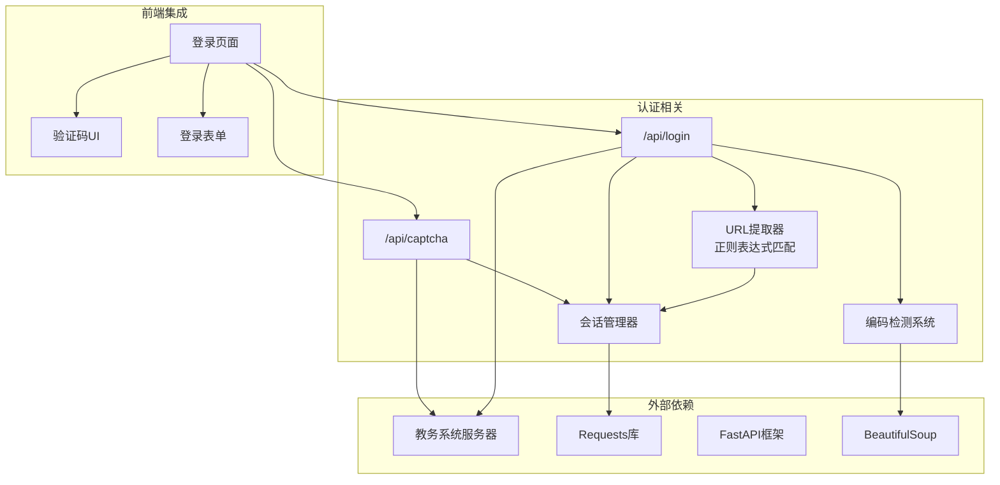

# 用户认证API

<cite>
**本文档引用的文件**
- [backend/main.py](file://backend/main.py)
- [frontend/src/app/login/page.tsx](file://frontend/src/app/login/page.tsx)
- [backend/test_login.py](file://backend/test_login.py)
- [backend/scraper.py](file://backend/scraper.py)
- [docker-compose.yml](file://docker-compose.yml)
- [scripts/start.sh](file://scripts/start.sh)
</cite>

## 更新摘要
**变更内容**
- 修复了服务器URL不一致问题，通过从response.url中提取最终服务器URL（使用正则表达式匹配https?://[^/]+/jsxsd/模式）
- 确保后续请求使用正确的端口和服务器地址，解决登录后端口变化导致的数据爬取失败问题
- 更新了服务器选择算法和负载均衡机制的实现细节

## 目录
1. [简介](#简介)
2. [项目结构](#项目结构)
3. [核心组件](#核心组件)
4. [架构概览](#架构概览)
5. [详细组件分析](#详细组件分析)
6. [依赖分析](#依赖分析)
7. [性能考虑](#性能考虑)
8. [故障排除指南](#故障排除指南)
9. [结论](#结论)
10. [附录](#附录)

## 简介
本文件为用户认证相关的API接口详细文档，重点覆盖验证码获取接口和用户登录接口的完整规范。文档详细说明了：
- 验证码获取接口的参数要求、返回格式和验证码session管理机制
- 登录接口的认证流程、参数验证、会话管理和错误处理策略
- 完整的请求示例、响应格式和错误码定义
- 前端集成指南，说明如何正确处理验证码刷新、登录状态维护和会话超时处理
- 服务器选择算法和负载均衡机制
- **新增**：修复的服务器URL提取机制，通过正则表达式从response.url中提取最终服务器URL

## 项目结构
该项目采用前后端分离架构，后端基于FastAPI提供RESTful API，前端基于Next.js构建用户界面。认证流程涉及以下关键组件：
- 后端FastAPI应用：提供/api/captcha和/api/login等认证接口
- 前端登录页面：负责用户输入、验证码展示和登录请求发送
- 教务系统服务器：作为后端代理，处理真实的验证码获取和登录请求
- 会话管理系统：维护用户登录状态和验证码session
- **新增**：修复的URL提取机制：从response.url中提取最终服务器URL，确保端口和服务器地址的正确性



**图表来源**
- [backend/main.py:1-120](file://backend/main.py#L1-L120)
- [frontend/src/app/login/page.tsx:1-50](file://frontend/src/app/login/page.tsx#L1-L50)

**章节来源**
- [backend/main.py:1-120](file://backend/main.py#L1-L120)
- [frontend/src/app/login/page.tsx:1-50](file://frontend/src/app/login/page.tsx#L1-L50)

## 核心组件
本项目的认证系统由以下核心组件构成：

### 1. 验证码获取组件
- 接口：GET /api/captcha
- 功能：获取教务系统验证码图片
- 特性：支持按学号选择服务器，确保验证码与登录使用同一服务器实例

### 2. 用户登录组件
- 接口：POST /api/login
- 功能：验证用户凭据并建立会话
- 特性：集成验证码验证、服务器选择、会话管理、**修复的URL提取机制**

### 3. 服务器选择算法
- 基于学号的哈希算法
- 支持14个内网服务器实例
- 确保相同学号用户始终路由到同一服务器

### 4. 会话管理机制
- 验证码session存储（内存级别）
- 用户登录会话存储（内存级别）
- 自动清理过期session

### 5. **新增**：修复的URL提取机制
- 从response.url中提取最终服务器URL
- 使用正则表达式：r'(https?://[^/]+/jsxsd/)'
- 确保端口和服务器地址的正确性
- 处理教务系统重定向导致的端口变化问题

**章节来源**
- [backend/main.py:74-366](file://backend/main.py#L74-L366)

## 架构概览
认证系统的整体架构遵循"前端-后端-教务系统"三层模式，**修复了URL提取中间层**：



**图表来源**
- [backend/main.py:136-366](file://backend/main.py#L136-L366)
- [frontend/src/app/login/page.tsx:20-107](file://frontend/src/app/login/page.tsx#L20-L107)

## 详细组件分析

### 验证码获取接口 (/api/captcha)

#### 接口规范
- 方法：GET
- 路径：/api/captcha
- 参数：
  - username (可选)：学号，用于服务器选择

#### 服务器选择算法
系统采用基于学号的哈希算法选择服务器：
- 如果username为纯数字：server_index = int(username) % 14
- 否则：默认使用第一个服务器
- 支持14个内网服务器实例，IP范围：172.19.13.60-109

#### 验证码session管理
- 生成唯一captcha_session_id，格式：captcha_{timestamp}_{server_index}
- 将requests.Session对象与captcha_session_id关联存储
- 自动清理机制：登录成功后立即删除对应session

#### 响应格式
```json
{
  "success": true,
  "image": "data:image/jpeg;base64,/9j/4AAQSkZJRgABAQEAYABgAAD...",
  "captcha_session_id": "captcha_1712345678.901234_5"
}
```

#### 错误处理
- 服务器不可达：HTTP 500
- 验证码获取失败：HTTP 500
- 参数验证失败：HTTP 400

**章节来源**
- [backend/main.py:136-192](file://backend/main.py#L136-L192)

### 用户登录接口 (/api/login)

#### 接口规范
- 方法：POST
- 路径：/api/login
- 请求体参数：
  - username：学号
  - password：密码
  - code：验证码
  - captcha_session_id：验证码session ID

#### 认证流程


**图表来源**
- [backend/main.py:194-366](file://backend/main.py#L194-L366)

#### 服务器选择策略
1. **优先级1**：从captcha_session_id中提取服务器索引
2. **优先级2**：使用学号哈希算法选择服务器
3. **优先级3**：回退到第一个服务器

#### **新增**：修复的URL提取机制
- **问题**：教务系统可能重定向到不同的端口（如8380端口）
- **解决方案**：从response.url中提取最终服务器URL
- **正则表达式**：r'(https?://[^/]+/jsxsd/)'
- **原理**：匹配https?://开头，直到/jsxsd/结尾的完整URL模式
- **效果**：确保使用正确的端口号和服务器地址

#### 会话管理
- 用户登录成功后，将requests.Session对象和**最终服务器URL**存储在SESSIONS字典中
- 键为username，值为字典{session: requests.Session, server_url: str}
- 会话包含JSESSIONID Cookie，用于后续API调用
- 确保验证码和登录使用同一服务器实例

#### 错误处理策略
- 参数缺失：HTTP 400
- 验证码过期：返回业务错误（success=false）
- 登录失败：检查响应内容中的错误标志
- 服务器错误：HTTP 500

#### 响应格式
成功响应：
```json
{
  "success": true,
  "message": "登录成功",
  "username": "2025123456",
  "session_id": "ABCDEF1234567890"
}
```

失败响应：
```json
{
  "success": false,
  "message": "用户名、密码或验证码错误"
}
```

**章节来源**
- [backend/main.py:194-366](file://backend/main.py#L194-L366)

### 前端集成指南

#### 前端组件分析
前端登录页面实现了完整的认证流程：



**图表来源**
- [frontend/src/app/login/page.tsx:1-228](file://frontend/src/app/login/page.tsx#L1-L228)

#### 验证码刷新机制
- 页面加载时自动获取验证码
- 用户输入学号（≥10位）后延迟刷新验证码
- 点击验证码图片时手动刷新
- 验证码过期时自动重新获取

#### 登录状态维护
- 登录成功后将username存储到localStorage
- 跳转到聊天页面
- 自动清理错误状态

#### 会话超时处理
- 登录过程中显示loading状态
- 网络错误时显示友好提示
- 验证码过期时自动刷新并清空输入

**章节来源**
- [frontend/src/app/login/page.tsx:20-107](file://frontend/src/app/login/page.tsx#L20-L107)

### 服务器选择算法和负载均衡

#### 算法实现


**图表来源**
- [backend/main.py:83-94](file://backend/main.py#L83-L94)

#### 服务器配置
系统配置了14个内网服务器实例：
- IP范围：172.19.13.60-109
- 端口：80或8380
- 负载均衡：基于学号的哈希分布

#### **新增**：修复的URL提取保证
- 验证码获取时确定服务器索引并存储在captcha_session_id中
- 登录时从captcha_session_id提取服务器索引，确保使用同一服务器
- **修复**：从response.url中提取最终服务器URL，确保端口正确性
- **正则表达式**：r'(https?://[^/]+/jsxsd/)' 确保URL格式正确
- 确保验证码和登录操作的一致性

#### 负载均衡策略
- 均匀分布：相同学号始终路由到同一服务器
- 容错机制：服务器不可用时自动选择下一个
- 一致性保证：确保验证码和登录使用同一服务器实例
- **URL一致性**：通过正则表达式提取最终URL，确保端口和服务器地址正确

**章节来源**
- [backend/main.py:55-94](file://backend/main.py#L55-L94)

## 依赖分析

### 组件间依赖关系


**图表来源**
- [backend/main.py:1-857](file://backend/main.py#L1-L857)
- [frontend/src/app/login/page.tsx:1-228](file://frontend/src/app/login/page.tsx#L1-L228)

### 外部依赖
- **Requests库**：HTTP请求处理
- **Base64编码**：验证码图片传输
- **Time模块**：验证码session时间戳
- **Logging模块**：日志记录
- **新增** **BeautifulSoup**：HTML解析和编码检测
- **新增** **正则表达式**：URL提取和模式匹配

**章节来源**
- [backend/main.py:1-50](file://backend/main.py#L1-L50)

## 性能考虑
基于代码分析，认证系统的性能特点如下：

### 1. 服务器选择性能
- 时间复杂度：O(1)
- 哈希计算简单，服务器选择快速
- 减少跨服务器请求导致的网络延迟

### 2. 会话管理性能
- 内存存储：SESSIONS和CAPTCHA_SESSIONS字典
- 查找复杂度：O(1)
- 适合小规模并发场景

### 3. 网络性能优化
- 单个requests.Session复用连接
- 超时设置：10秒
- User-Agent模拟真实浏览器

### 4. **新增**：URL提取性能优化
- **修复**：使用正则表达式从response.url提取最终服务器URL
- **效果**：确保端口和服务器地址正确，避免重定向导致的性能损失
- **稳定性**：处理教务系统重定向，确保后续请求使用正确的端口

### 5. 编码检测性能
- 多编码尝试：最多4次编码尝试
- 早期退出：一旦找到合适编码立即停止
- 内存效率：每次只尝试一种编码格式
- 日志记录：仅在调试模式下记录详细信息

### 6. 生产环境建议
- 使用Redis替代内存存储
- 实现session过期清理机制
- 添加缓存层减少重复请求
- 实现限流和防暴力破解
- **新增**：考虑使用更高效的编码检测库
- **新增**：实现会话数据的持久化存储
- **新增**：优化正则表达式性能，考虑编译正则表达式

## 故障排除指南

### 常见问题及解决方案

#### 1. 验证码获取失败
**症状**：返回HTTP 500错误
**原因**：
- 教务系统服务器不可达
- 网络连接超时
- 服务器配置错误

**解决方案**：
- 检查服务器IP连通性
- 验证防火墙设置
- 查看后端日志

#### 2. 登录失败
**症状**：返回"用户名、密码或验证码错误"
**原因**：
- 凭证错误
- 验证码过期
- 服务器不一致
- **新增**：URL提取错误（端口不正确）

**解决方案**：
- 重新获取验证码
- 确认学号格式
- 检查密码正确性
- **新增**：检查服务器URL提取是否正确

#### 3. **新增**：URL提取问题
**症状**：登录后数据爬取失败，端口不匹配
**原因**：
- 教务系统重定向到不同端口（如8380端口）
- 正则表达式匹配失败
- URL格式不正确

**解决方案**：
- 确认正则表达式 r'(https?://[^/]+/jsxsd/)' 是否正确匹配
- 检查response.url格式
- 验证最终服务器URL是否包含正确端口
- 使用降级机制：如果正则表达式匹配失败，使用原始server_url

#### 4. 编码检测问题
**症状**：登录响应乱码或解析失败
**原因**：
- 编码检测失败
- 多种编码格式混合
- 响应内容解析错误

**解决方案**：
- 检查编码检测逻辑
- 确认GBK/UTF-8编码处理
- 验证BeautifulSoup解析

### 调试工具
系统提供了专门的测试脚本：
- 支持外网和内网服务器测试
- 手动输入验证码进行验证
- 详细的响应内容输出
- **新增**：URL提取和服务器选择测试功能

**章节来源**
- [backend/test_login.py:1-152](file://backend/test_login.py#L1-L152)

## 结论
本认证系统实现了完整的用户身份验证流程，具有以下特点：

### 优势
- **一致性保证**：基于学号的服务器选择确保验证码和登录使用同一服务器
- **简单可靠**：基于现有教务系统接口，无需额外开发
- **前端友好**：提供完整的前端集成示例
- **可扩展性**：支持多种服务器配置和负载均衡策略
- **URL提取修复**：通过正则表达式从response.url提取最终服务器URL，确保正确的认证流程
- **端口兼容性**：处理教务系统重定向导致的端口变化问题

### 局限性
- **内存存储**：生产环境需要替换为Redis等持久化存储
- **单机部署**：当前实现为单实例，需要集群化改造
- **安全考虑**：需要添加JWT令牌、HTTPS等安全措施
- **URL提取复杂度**：需要确保正则表达式的正确性和性能

### 改进建议
1. **存储层升级**：使用Redis或数据库存储会话
2. **安全加固**：添加JWT令牌、CSRF保护、速率限制
3. **监控告警**：添加API调用监控和异常告警
4. **文档完善**：补充完整的API文档和SDK
5. **性能优化**：考虑使用更高效的编码检测算法
6. **URL提取验证**：添加URL格式验证机制
7. **正则表达式优化**：考虑编译正则表达式以提高性能
8. **错误处理增强**：添加更详细的错误日志和用户提示

## 附录

### API参考

#### 验证码获取接口
- **URL**: `/api/captcha`
- **方法**: `GET`
- **参数**: `username` (可选)
- **响应**: `{success, image, captcha_session_id}`

#### 用户登录接口
- **URL**: `/api/login`
- **方法**: `POST`
- **请求体**: `{username, password, code, captcha_session_id}`
- **响应**: `{success, message, username, session_id}`

### 错误码定义
- **200**: 请求成功
- **400**: 参数错误或缺失
- **401**: 未登录或会话无效
- **500**: 服务器内部错误

### **新增**：URL提取修复说明
系统使用修复的URL提取逻辑：
```python
# 从response.url中提取最终服务器URL
import re
match = re.match(r'(https?://[^/]+/jsxsd/)', response.url)
if match:
    final_server_url = match.group(1)
else:
    final_server_url = server_url  # 降级使用原始URL

# 正则表达式说明
# r'(https?://[^/]+/jsxsd/)'
# https?:// : 匹配http://或https://
# [^/]+ : 匹配一个或多个非斜杠字符
# /jsxsd/ : 匹配/jsxsd/字面量
```

### 部署配置
系统支持Docker容器化部署，包含：
- PostgreSQL数据库
- Redis缓存
- Milvus向量数据库
- MinIO对象存储
- 前后端分离部署

**章节来源**
- [docker-compose.yml:1-167](file://docker-compose.yml#L1-L167)
- [scripts/start.sh:1-18](file://scripts/start.sh#L1-L18)