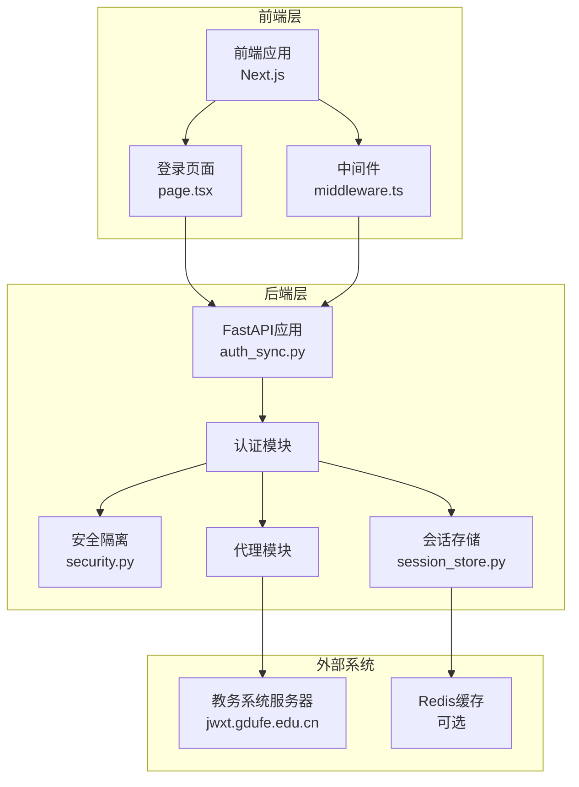
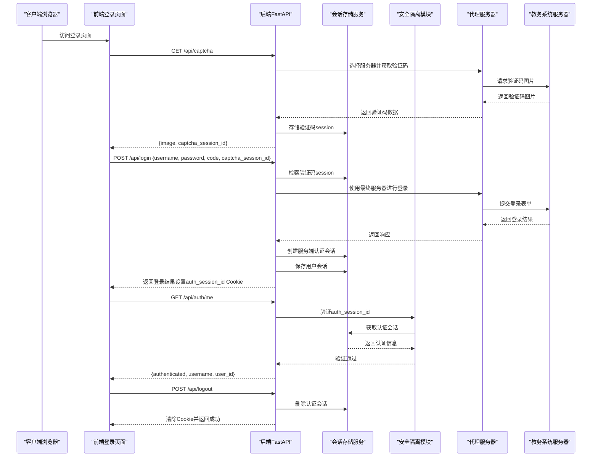
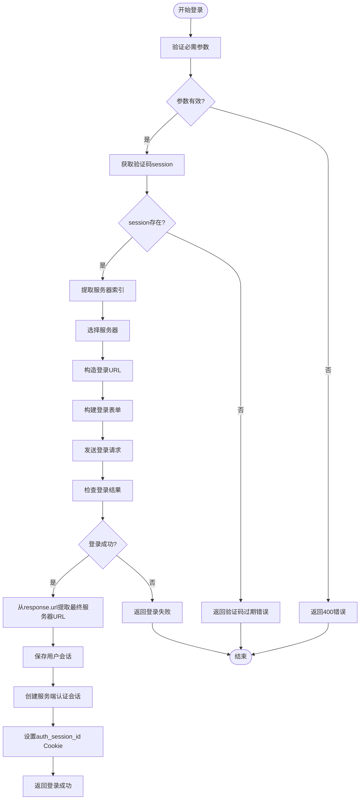
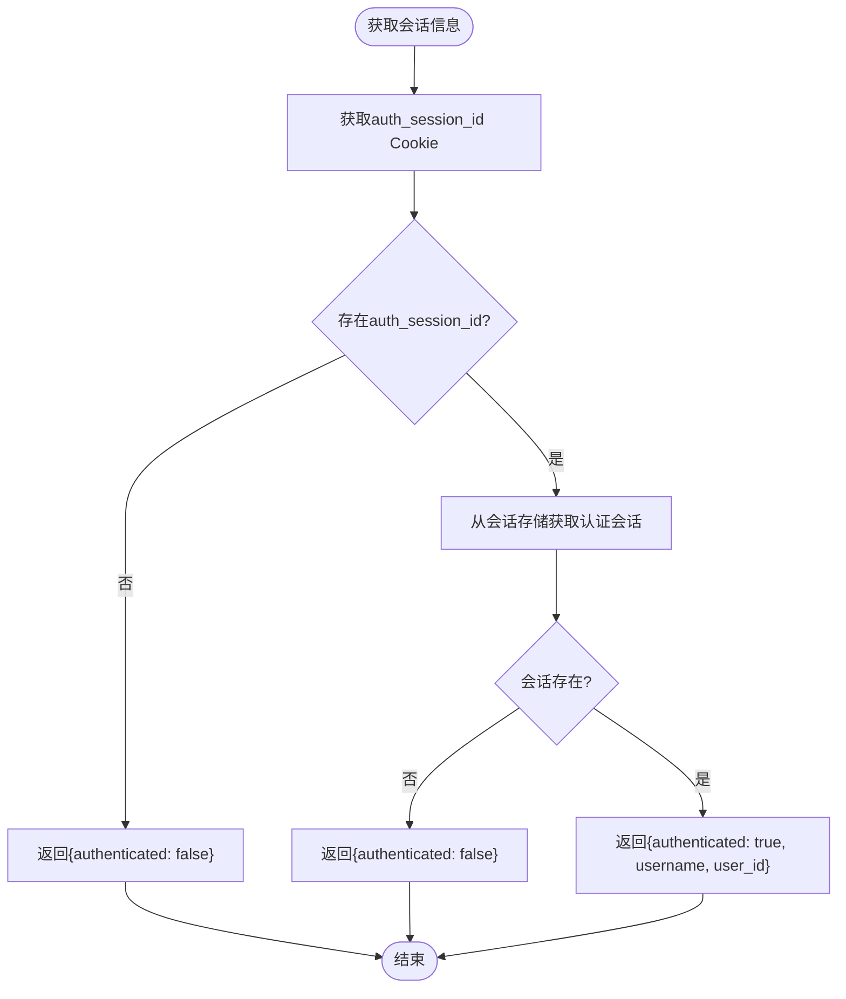
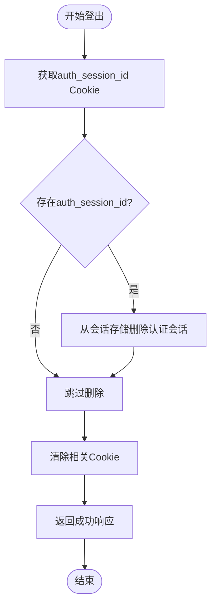
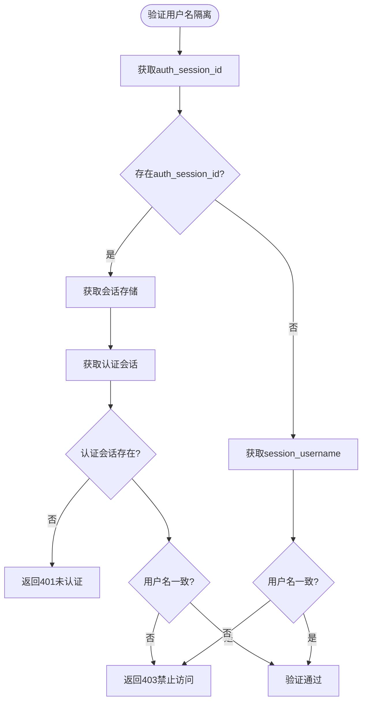
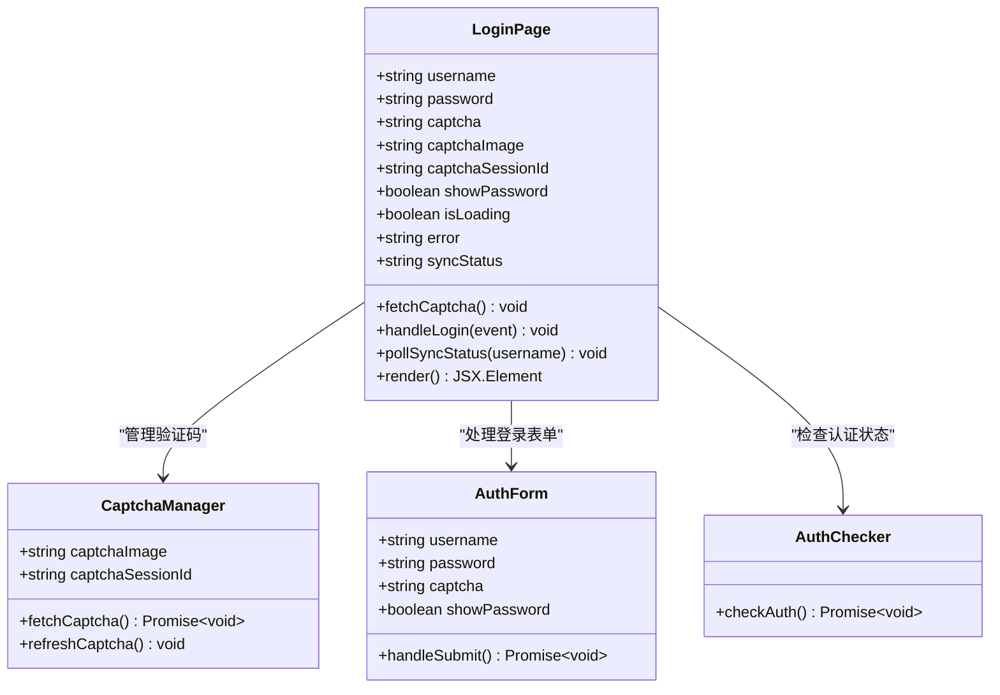
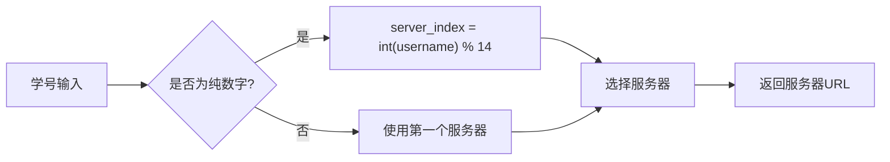
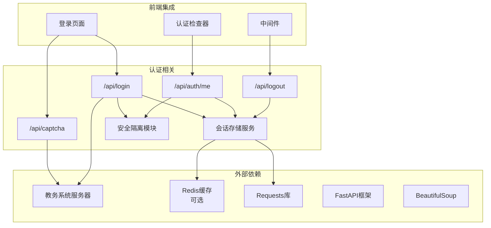

# 用户认证API

<cite>
**本文档引用的文件**
- [backend/app/api/auth_sync.py](file://backend/app/api/auth_sync.py)
- [backend/app/services/session_store.py](file://backend/app/services/session_store.py)
- [backend/app/security.py](file://backend/app/security.py)
- [frontend/src/app/login/page.tsx](file://frontend/src/app/login/page.tsx)
- [frontend/src/middleware.ts](file://frontend/src/middleware.ts)
- [backend/main.py](file://backend/main.py)
- [backend/tests/test_session_store_singleton.py](file://backend/tests/test_session_store_singleton.py)
- [backend/tests/test_security_isolation.py](file://backend/tests/test_security_isolation.py)
</cite>

## 更新摘要
**变更内容**
- 新增基于服务端会话存储的认证机制，替代了之前的客户端cookie认证方式
- 添加了 `/api/auth/me` 端点用于获取当前登录会话信息
- 添加了 `/api/logout` 端点用于退出登录并清理服务端会话
- 实现了严格的会话隔离机制，优先使用 `auth_session_id` 进行用户名一致性验证
- 增强了安全隔离功能，支持新旧两种认证方式的兼容

## 目录
1. [简介](#简介)
2. [项目结构](#项目结构)
3. [核心组件](#核心组件)
4. [架构概览](#架构概览)
5. [详细组件分析](#详细组件分析)
6. [依赖分析](#依赖分析)
7. [性能考虑](#性能考虑)
8. [故障排除指南](#故障排除指南)
9. [结论](#结论)
10. [附录](#附录)

## 简介
本文件为用户认证相关的API接口详细文档，重点覆盖基于服务端会话存储的新认证系统。文档详细说明了：
- 验证码获取接口的参数要求、返回格式和验证码session管理机制
- 用户登录接口的认证流程、参数验证、会话管理和错误处理策略
- **新增**：`/api/auth/me` 端点用于获取当前登录会话信息
- **新增**：`/api/logout` 端点用于退出登录并清理服务端会话
- **新增**：基于服务端会话存储的认证机制，替代了之前的客户端cookie认证方式
- **新增**：严格的会话隔离机制，优先使用 `auth_session_id` 进行用户名一致性验证
- 完整的请求示例、响应格式和错误码定义
- 前端集成指南，说明如何正确处理验证码刷新、登录状态维护和会话超时处理
- 服务器选择算法和负载均衡机制

## 项目结构
该项目采用前后端分离架构，后端基于FastAPI提供RESTful API，前端基于Next.js构建用户界面。新的认证系统涉及以下关键组件：
- 后端FastAPI应用：提供 `/api/captcha`、`/api/login`、`/api/auth/me` 和 `/api/logout` 等认证接口
- 会话存储服务：基于Redis或内存的会话存储，支持用户会话、验证码会话和服务端认证会话
- 安全隔离模块：实现严格的会话隔离机制，优先使用服务端会话进行用户名一致性验证
- 前端登录页面：负责用户输入、验证码展示和登录请求发送
- 前端中间件：在生产环境中保护受保护的路由，确保只有认证用户才能访问



**图表来源**
- [backend/app/api/auth_sync.py:1-267](file://backend/app/api/auth_sync.py#L1-L267)
- [backend/app/services/session_store.py:1-206](file://backend/app/services/session_store.py#L1-L206)
- [backend/app/security.py:1-26](file://backend/app/security.py#L1-L26)

**章节来源**
- [backend/app/api/auth_sync.py:1-267](file://backend/app/api/auth_sync.py#L1-L267)
- [frontend/src/app/login/page.tsx:1-350](file://frontend/src/app/login/page.tsx#L1-L350)

## 核心组件
本项目的认证系统由以下核心组件构成：

### 1. 验证码获取组件
- 接口：GET /api/captcha
- 功能：获取教务系统验证码图片
- 特性：支持按学号选择服务器，确保验证码与登录使用同一服务器实例

### 2. 用户登录组件
- 接口：POST /api/login
- 功能：验证用户凭据并建立会话
- 特性：集成验证码验证、服务器选择、会话管理、**基于服务端会话存储的认证机制**

### 3. 会话信息获取组件
- 接口：GET /api/auth/me
- 功能：获取当前登录会话信息（仅信任服务端 `auth_session_id`）
- 特性：基于服务端会话存储验证用户身份，返回用户名和用户ID

### 4. 用户登出组件
- 接口：POST /api/logout
- 功能：退出登录并清理服务端会话
- 特性：删除服务端认证会话，清除相关Cookie

### 5. 会话存储服务
- 功能：基于Redis或内存的会话存储
- 支持类型：用户会话、验证码会话、认证会话、同步状态
- 特性：支持Redis持久化和内存回退机制

### 6. 安全隔离机制
- 功能：严格的会话隔离
- 优先级：优先使用 `auth_session_id`（服务端会话）校验用户名一致性
- 兼容性：支持旧的 `session_username` cookie校验

### 7. 服务器选择算法
- 基于学号的哈希算法
- 支持14个内网服务器实例
- 确保相同学号用户始终路由到同一服务器

### 8. 会话管理机制
- 验证码session存储（内存级别）
- 用户登录会话存储（内存级别）
- **新增**：服务端认证会话存储（支持Redis或内存）
- 自动清理过期session

**章节来源**
- [backend/app/api/auth_sync.py:30-266](file://backend/app/api/auth_sync.py#L30-L266)
- [backend/app/services/session_store.py:25-206](file://backend/app/services/session_store.py#L25-L206)
- [backend/app/security.py:4-26](file://backend/app/security.py#L4-L26)

## 架构概览
认证系统的整体架构遵循"前端-后端-教务系统"三层模式，**新增了基于服务端会话存储的认证机制**：



**图表来源**
- [backend/app/api/auth_sync.py:70-266](file://backend/app/api/auth_sync.py#L70-L266)
- [frontend/src/app/login/page.tsx:23-43](file://frontend/src/app/login/page.tsx#L23-L43)

## 详细组件分析

### 验证码获取接口 (/api/captcha)

#### 接口规范
- 方法：GET
- 路径：/api/captcha
- 参数：
  - username (可选)：学号，用于服务器选择

#### 服务器选择算法
系统采用基于学号的哈希算法选择服务器：
- 如果username为纯数字：server_index = int(username) % 14
- 否则：默认使用第一个服务器
- 支持14个内网服务器实例，IP范围：172.19.13.60-109

#### 验证码session管理
- 生成唯一captcha_session_id，格式：captcha_{timestamp}_{server_index}
- 将requests.Session对象与captcha_session_id关联存储
- 自动清理机制：登录成功后立即删除对应session

#### 响应格式
```json
{
  "success": true,
  "image": "data:image/jpeg;base64,/9j/4AAQSkZJRgABAQEAYABgAAD...",
  "captcha_session_id": "captcha_1712345678.901234_5"
}
```

#### 错误处理
- 服务器不可达：HTTP 500
- 验证码获取失败：HTTP 500
- 参数验证失败：HTTP 400

**章节来源**
- [backend/app/api/auth_sync.py:30-68](file://backend/app/api/auth_sync.py#L30-L68)

### 用户登录接口 (/api/login)

#### 接口规范
- 方法：POST
- 路径：/api/login
- 请求体参数：
  - username：学号
  - password：密码
  - code：验证码
  - captcha_session_id：验证码session ID

#### 认证流程


**图表来源**
- [backend/app/api/auth_sync.py:70-208](file://backend/app/api/auth_sync.py#L70-L208)

#### 服务器选择策略
1. **优先级1**：从captcha_session_id中提取服务器索引
2. **优先级2**：使用学号哈希算法选择服务器
3. **优先级3**：回退到第一个服务器

#### 会话管理
- 用户登录成功后，将requests.Session对象和最终服务器URL存储在SESSIONS字典中
- **新增**：同时创建服务端认证会话，存储用户名和用户ID
- **新增**：设置两个Cookie：
  - `session_username`：用于兼容旧系统，允许最小级别的用户名校验
  - `auth_session_id`：服务端会话ID，httponly，用于严格的身份验证
- 会话包含JSESSIONID Cookie，用于后续API调用
- 确保验证码和登录使用同一服务器实例

#### 错误处理策略
- 参数缺失：HTTP 400
- 验证码过期：返回业务错误（success=false）
- 登录失败：检查响应内容中的错误标志
- 服务器错误：HTTP 500

#### 响应格式
成功响应：
```json
{
  "success": true,
  "message": "登录成功",
  "username": "2025123456",
  "session_id": "ABCDEF1234567890",
  "sync_status": "completed",
  "sync_message": "已加载历史数据"
}
```

失败响应：
```json
{
  "success": false,
  "message": "用户名、密码或验证码错误"
}
```

**章节来源**
- [backend/app/api/auth_sync.py:70-208](file://backend/app/api/auth_sync.py#L70-L208)

### 会话信息获取接口 (/api/auth/me)

#### 接口规范
- 方法：GET
- 路径：/api/auth/me
- 功能：获取当前登录会话信息（仅信任服务端 `auth_session_id`）

#### 认证流程


**图表来源**
- [backend/app/api/auth_sync.py:238-253](file://backend/app/api/auth_sync.py#L238-L253)

#### 会话验证机制
- 仅信任服务端 `auth_session_id` 进行身份验证
- 从会话存储中检索认证会话信息
- 返回用户名和用户ID，供前端显示和权限控制

#### 响应格式
认证成功：
```json
{
  "authenticated": true,
  "username": "2025123456",
  "user_id": 123456
}
```

未认证：
```json
{
  "authenticated": false
}
```

**章节来源**
- [backend/app/api/auth_sync.py:238-253](file://backend/app/api/auth_sync.py#L238-L253)

### 用户登出接口 (/api/logout)

#### 接口规范
- 方法：POST
- 路径：/api/logout
- 功能：退出登录并清理服务端会话

#### 登出流程


**图表来源**
- [backend/app/api/auth_sync.py:256-266](file://backend/app/api/auth_sync.py#L256-L266)

#### 会话清理机制
- 删除服务端认证会话
- 清除两个相关Cookie：
  - `session_username`：用户名Cookie
  - `auth_session_id`：服务端会话ID Cookie
- 确保客户端和服务器端的会话都得到清理

#### 响应格式
```json
{
  "success": true,
  "message": "已退出登录"
}
```

**章节来源**
- [backend/app/api/auth_sync.py:256-266](file://backend/app/api/auth_sync.py#L256-L266)

### 会话存储服务

#### 服务端会话存储
- **新增**：支持Redis持久化和内存回退机制
- **新增**：三种会话类型：
  - 用户会话：存储用户登录后的会话信息
  - 验证码会话：存储验证码获取时的临时会话
  - 认证会话：存储服务端认证信息
- **新增**：会话TTL管理，默认24小时

#### Redis集成
- 自动检测Redis可用性
- 连接配置：可通过环境变量配置REDIS_HOST和REDIS_PORT
- 持久化存储：在Redis可用时使用Redis存储会话
- 回退机制：Redis不可用时自动使用内存存储

#### 序列化机制
- **新增**：会话序列化和反序列化
- **新增**：支持requests.Session对象的完整序列化
- **新增**：保持会话头信息和Cookie状态

**章节来源**
- [backend/app/services/session_store.py:25-206](file://backend/app/services/session_store.py#L25-L206)

### 安全隔离机制

#### 严格会话隔离
- **新增**：优先使用 `auth_session_id`（服务端会话）校验用户名一致性
- **新增**：兼容旧的 `session_username` cookie校验
- **新增**：当服务端会话存在且有效时，忽略旧的cookie校验

#### 验证流程


**图表来源**
- [backend/app/security.py:4-26](file://backend/app/security.py#L4-L26)

#### 错误处理
- 服务端会话无效：返回401未认证
- 用户名不一致：返回403禁止访问
- 无会话信息：验证通过（允许匿名访问）

**章节来源**
- [backend/app/security.py:4-26](file://backend/app/security.py#L4-L26)

### 前端集成指南

#### 前端组件分析
前端登录页面实现了完整的认证流程：



**图表来源**
- [frontend/src/app/login/page.tsx:1-350](file://frontend/src/app/login/page.tsx#L1-L350)

#### 验证码刷新机制
- 页面加载时自动获取验证码
- 用户输入学号（≥10位）后延迟刷新验证码
- 点击验证码图片时手动刷新
- 验证码过期时自动重新获取

#### 登录状态维护
- **新增**：页面加载时调用 `/api/auth/me` 检查登录状态
- 登录成功后将username存储到localStorage
- 跳转到聊天页面
- 自动清理错误状态

#### 会话超时处理
- 登录过程中显示loading状态
- 网络错误时显示友好提示
- 验证码过期时自动刷新并清空输入
- **新增**：支持数据同步状态轮询

#### 前端中间件保护
- **新增**：生产环境中间件保护 `/chat` 路由
- 检查 `auth_session_id` Cookie
- 未认证用户重定向到登录页面
- 支持重定向参数，登录后返回原页面

**章节来源**
- [frontend/src/app/login/page.tsx:23-43](file://frontend/src/app/login/page.tsx#L23-L43)
- [frontend/src/middleware.ts:5-28](file://frontend/src/middleware.ts#L5-L28)

### 服务器选择算法和负载均衡

#### 算法实现


**图表来源**
- [backend/app/api/auth_sync.py:22-27](file://backend/app/api/auth_sync.py#L22-L27)

#### 服务器配置
系统配置了14个内网服务器实例：
- IP范围：172.19.13.60-109
- 端口：80或8380
- 负载均衡：基于学号的哈希分布

#### 负载均衡策略
- 均匀分布：相同学号始终路由到同一服务器
- 容错机制：服务器不可用时自动选择下一个
- 一致性保证：确保验证码和登录使用同一服务器实例
- **URL一致性**：通过正则表达式提取最终URL，确保端口和服务器地址正确

**章节来源**
- [backend/app/api/auth_sync.py:22-27](file://backend/app/api/auth_sync.py#L22-L27)

## 依赖分析

### 组件间依赖关系


**图表来源**
- [backend/app/api/auth_sync.py:1-267](file://backend/app/api/auth_sync.py#L1-L267)
- [frontend/src/app/login/page.tsx:1-350](file://frontend/src/app/login/page.tsx#L1-L350)

### 外部依赖
- **Requests库**：HTTP请求处理
- **Base64编码**：验证码图片传输
- **Time模块**：验证码session时间戳
- **Logging模块**：日志记录
- **新增** **Redis**：会话存储持久化
- **新增** **Secrets模块**：生成安全的会话ID
- **新增** **BeautifulSoup**：HTML解析和编码检测
- **新增** **正则表达式**：URL提取和模式匹配

**章节来源**
- [backend/app/api/auth_sync.py:1-18](file://backend/app/api/auth_sync.py#L1-L18)

## 性能考虑
基于代码分析，认证系统的性能特点如下：

### 1. 服务器选择性能
- 时间复杂度：O(1)
- 哈希计算简单，服务器选择快速
- 减少跨服务器请求导致的网络延迟

### 2. 会话管理性能
- **新增**：Redis支持：在Redis可用时使用Redis存储会话
- **新增**：内存回退：Redis不可用时自动使用内存存储
- **新增**：会话序列化：支持requests.Session对象的完整序列化
- 查找复杂度：O(1)
- 适合小规模并发场景

### 3. 网络性能优化
- 单个requests.Session复用连接
- 超时设置：10秒
- User-Agent模拟真实浏览器

### 4. 编码检测性能
- 多编码尝试：最多4次编码尝试
- 早期退出：一旦找到合适编码立即停止
- 内存效率：每次只尝试一种编码格式
- 日志记录：仅在调试模式下记录详细信息

### 5. 生产环境建议
- **新增**：使用Redis替代内存存储
- **新增**：实现会话过期清理机制
- **新增**：添加缓存层减少重复请求
- **新增**：实现限流和防暴力破解
- **新增**：考虑使用更高效的编码检测库
- **新增**：优化正则表达式性能，考虑编译正则表达式
- **新增**：实现会话数据的持久化存储

## 故障排除指南

### 常见问题及解决方案

#### 1. 验证码获取失败
**症状**：返回HTTP 500错误
**原因**：
- 教务系统服务器不可达
- 网络连接超时
- 服务器配置错误

**解决方案**：
- 检查服务器IP连通性
- 验证防火墙设置
- 查看后端日志

#### 2. 登录失败
**症状**：返回"用户名、密码或验证码错误"
**原因**：
- 凭证错误
- 验证码过期
- 服务器不一致
- **新增**：服务端会话存储问题

**解决方案**：
- 重新获取验证码
- 确认学号格式
- 检查密码正确性
- **新增**：检查Redis连接状态

#### 3. 会话验证失败
**症状**：`/api/auth/me` 返回未认证
**原因**：
- 缺少 `auth_session_id` Cookie
- 服务端会话已过期
- 会话存储Redis连接失败

**解决方案**：
- 确认登录成功后Cookie设置
- 检查Redis服务状态
- 验证会话TTL设置

#### 4. 登出后仍可访问受保护路由
**症状**：登出后仍能访问 `/chat` 页面
**原因**：
- 前端中间件未正确配置
- Cookie未正确清除
- 会话存储问题

**解决方案**：
- 检查生产环境配置
- 验证Cookie清除逻辑
- 确认会话存储正常工作

#### 5. 编码检测问题
**症状**：登录响应乱码或解析失败
**原因**：
- 编码检测失败
- 多种编码格式混合
- 响应内容解析错误

**解决方案**：
- 检查编码检测逻辑
- 确认GBK/UTF-8编码处理
- 验证BeautifulSoup解析

### 调试工具
系统提供了专门的测试脚本：
- 支持外网和内网服务器测试
- 手动输入验证码进行验证
- 详细的响应内容输出
- **新增**：会话存储单例测试
- **新增**：安全隔离机制测试

**章节来源**
- [backend/tests/test_session_store_singleton.py:1-30](file://backend/tests/test_session_store_singleton.py#L1-L30)
- [backend/tests/test_security_isolation.py:1-56](file://backend/tests/test_security_isolation.py#L1-L56)

## 结论
本认证系统实现了基于服务端会话存储的统一认证机制，具有以下特点：

### 优势
- **统一认证**：基于服务端会话存储，替代了之前的客户端cookie认证方式
- **安全性提升**：优先使用 `auth_session_id` 进行严格的身份验证
- **会话隔离**：实现严格的会话隔离机制，防止会话劫持
- **兼容性**：支持新旧两种认证方式的平滑过渡
- **可扩展性**：支持Redis持久化和内存回退机制
- **前端保护**：生产环境中间件保护受保护路由
- **会话管理**：完善的会话生命周期管理

### 局限性
- **内存存储**：生产环境需要Redis等持久化存储
- **单机部署**：当前实现为单实例，需要集群化改造
- **安全考虑**：需要添加JWT令牌、HTTPS等安全措施
- **会话存储复杂度**：需要确保Redis连接稳定和会话数据一致性

### 改进建议
1. **存储层升级**：使用Redis或数据库存储会话
2. **安全加固**：添加JWT令牌、CSRF保护、速率限制
3. **监控告警**：添加API调用监控和异常告警
4. **文档完善**：补充完整的API文档和SDK
5. **性能优化**：考虑使用更高效的编码检测算法
6. **会话存储验证**：添加会话数据完整性验证机制
7. **Redis连接池**：实现Redis连接池管理
8. **错误处理增强**：添加更详细的错误日志和用户提示

## 附录

### API参考

#### 验证码获取接口
- **URL**: `/api/captcha`
- **方法**: `GET`
- **参数**: `username` (可选)
- **响应**: `{success, image, captcha_session_id}`

#### 用户登录接口
- **URL**: `/api/login`
- **方法**: `POST`
- **请求体**: `{username, password, code, captcha_session_id}`
- **响应**: `{success, message, username, session_id, sync_status, sync_message}`

#### 会话信息获取接口
- **URL**: `/api/auth/me`
- **方法**: `GET`
- **响应**: `{authenticated, username, user_id}` 或 `{authenticated: false}`

#### 用户登出接口
- **URL**: `/api/logout`
- **方法**: `POST`
- **响应**: `{success, message}`

### 错误码定义
- **200**: 请求成功
- **400**: 参数错误或缺失
- **401**: 未登录或会话无效
- **403**: 权限不足或会话不一致
- **500**: 服务器内部错误

### 会话存储机制
系统使用基于Redis或内存的会话存储：
```python
# 会话类型
user_session: 用户登录后的会话信息
captcha_session: 验证码获取时的临时会话
auth_session: 服务端认证会话
sync_status: 数据同步状态

# Redis键格式
user_session:{username}
captcha_session:{captcha_session_id}
auth_session:{auth_session_id}
sync_status:{username}

# TTL设置
user_session: 24小时
auth_session: 24小时  
sync_status: 6小时
```

### 安全隔离机制
系统实现了严格的会话隔离：
```python
# 优先级验证
1) 检查auth_session_id Cookie
2) 验证服务端认证会话
3) 检查session_username Cookie
4) 验证用户名一致性
```

### 部署配置
系统支持Docker容器化部署，包含：
- PostgreSQL数据库
- Redis缓存
- Milvus向量数据库
- MinIO对象存储
- 前后端分离部署

**章节来源**
- [backend/app/services/session_store.py:171-206](file://backend/app/services/session_store.py#L171-L206)
- [backend/app/security.py:4-26](file://backend/app/security.py#L4-L26)
- [docker-compose.yml:1-167](file://docker-compose.yml#L1-L167)
- [scripts/start.sh:1-18](file://scripts/start.sh#L1-L18)