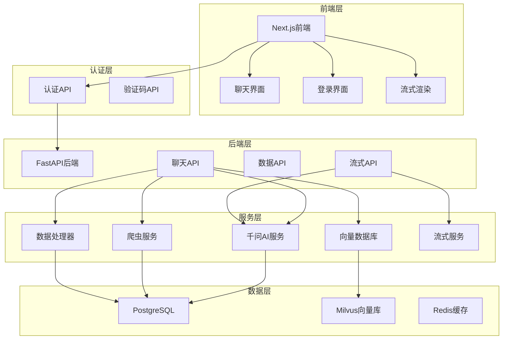
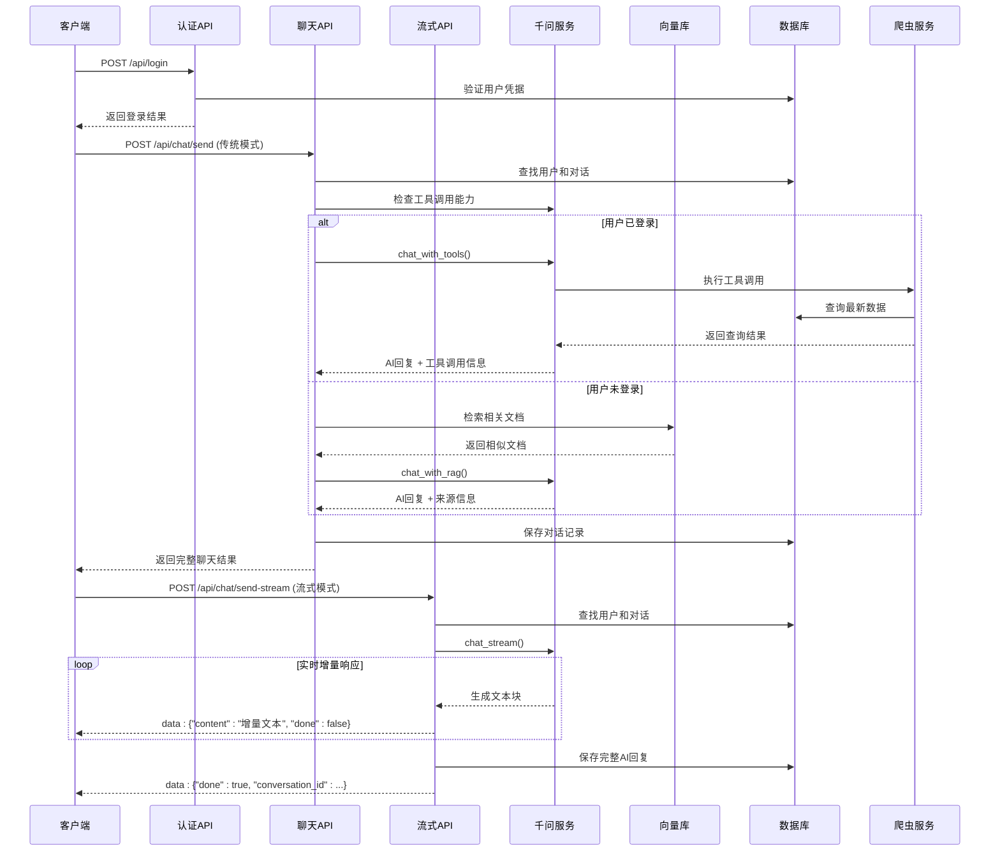
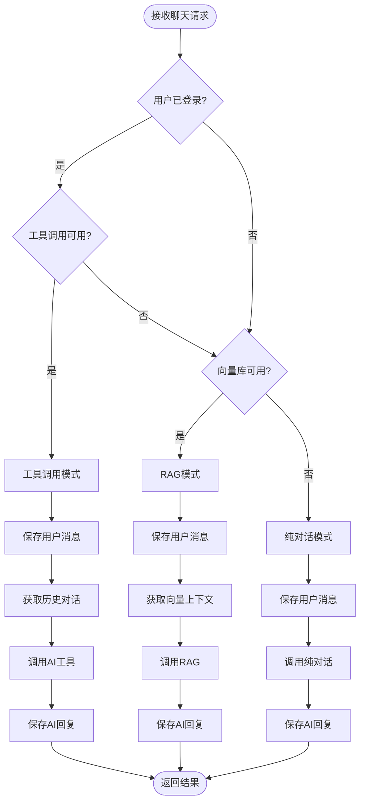
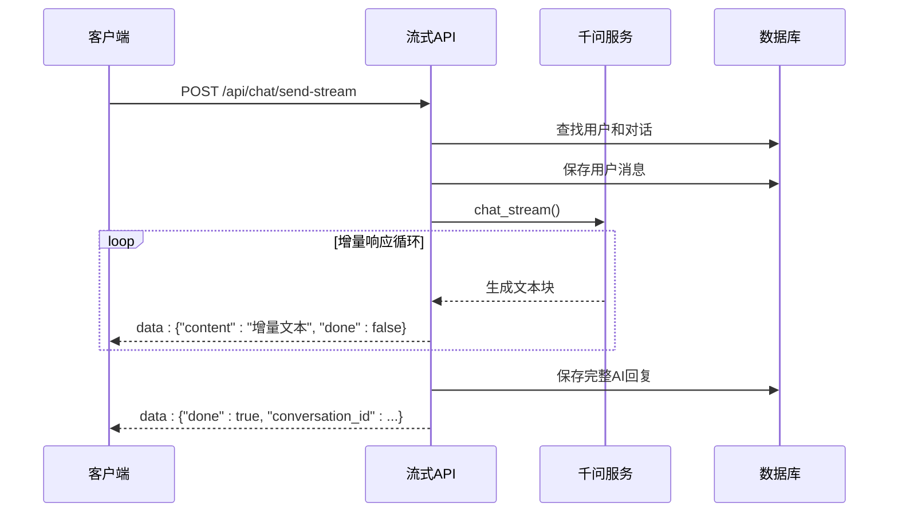
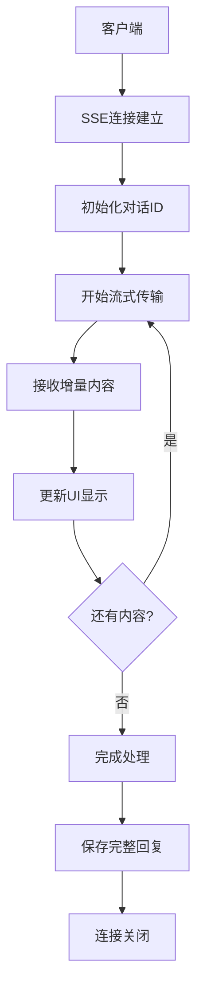
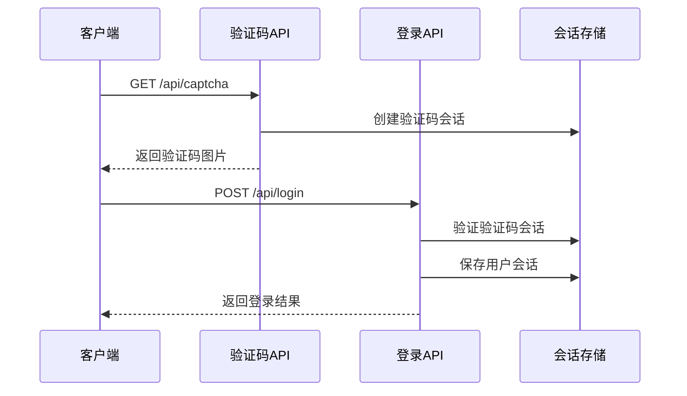
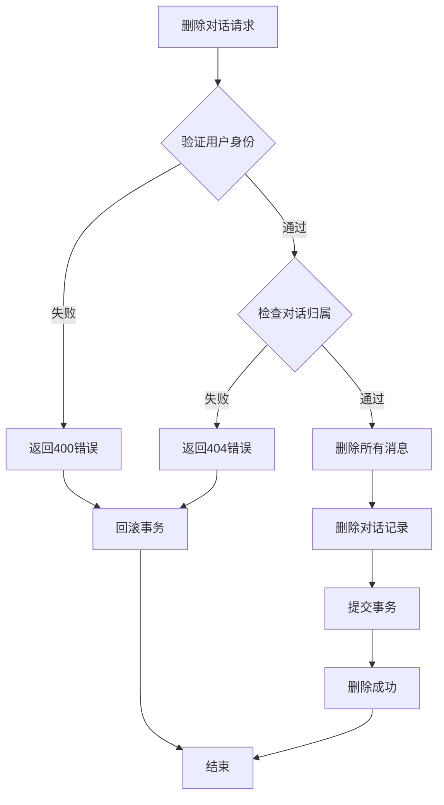
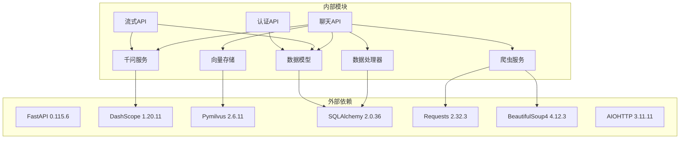

# 聊天API增强

<cite>
**本文档引用的文件**
- [backend/main.py](file://backend/main.py)
- [backend/app/api/chat.py](file://backend/app/api/chat.py)
- [backend/app/services/qwen_service.py](file://backend/app/services/qwen_service.py)
- [backend/app/services/data_processor.py](file://backend/app/services/data_processor.py)
- [backend/app/services/vector_store.py](file://backend/app/services/vector_store.py)
- [backend/app/models/conversation.py](file://backend/app/models/conversation.py)
- [backend/app/models/user.py](file://backend/app/models/user.py)
- [backend/app/models/education_data.py](file://backend/app/models/education_data.py)
- [backend/scraper.py](file://backend/scraper.py)
- [frontend/src/app/chat/page.tsx](file://frontend/src/app/chat/page.tsx)
- [frontend/src/app/login/page.tsx](file://frontend/src/app/login/page.tsx)
- [backend/app/models/base.py](file://backend/app/models/base.py)
- [backend/requirements.txt](file://backend/requirements.txt)
- [docker-compose.yml](file://docker-compose.yml)
- [README-Windows.md](file://README-Windows.md)
</cite>

## 更新摘要
**所做更改**
- 新增Server-Sent Events流式聊天功能章节，支持实时增量响应
- 更新前端聊天界面以支持流式渲染和实时更新
- 新增流式API架构图，展示SSE实时通信流程
- 更新聊天API架构图，反映新增的流式处理机制
- 新增流式错误处理和异常管理章节
- 更新消息级联删除和数据完整性保护机制

## 目录
1. [项目概述](#项目概述)
2. [项目结构](#项目结构)
3. [核心组件](#核心组件)
4. [架构概览](#架构概览)
5. [详细组件分析](#详细组件分析)
6. [Server-Sent Events流式聊天功能](#server-sent-events流式聊天功能)
7. [用户认证和授权机制](#用户认证和授权机制)
8. [消息级联删除和数据完整性](#消息级联删除和数据完整性)
9. [依赖关系分析](#依赖关系分析)
10. [性能考虑](#性能考虑)
11. [故障排除指南](#故障排除指南)
12. [结论](#结论)

## 项目概述

这是一个基于FastAPI构建的教务系统AI助手聊天API增强项目。该项目集成了多种AI技术，包括千问大模型、向量数据库Milvus、爬虫技术和RAG（检索增强生成）技术，为广东财经大学的学生提供智能化的教务咨询服务。

### 主要特性
- **多模态AI对话**：支持Function Calling和RAG增强的智能对话
- **实时数据查询**：通过爬虫技术实时查询教务系统数据
- **对话历史管理**：完整的对话记录和历史查询功能
- **向量化知识库**：基于Milvus的向量检索系统
- **用户认证授权**：完整的用户登录、会话管理和权限控制
- **消息级联删除**：确保数据一致性的自动清理机制
- **Server-Sent Events流式聊天**：支持实时增量响应的流式通信
- **前后端分离架构**：React前端 + FastAPI后端 + Python爬虫

## 项目结构



**图表来源**
- [backend/main.py:126-154](file://backend/main.py#L126-L154)
- [backend/app/api/chat.py:46-179](file://backend/app/api/chat.py#L46-L179)

**章节来源**
- [backend/main.py:126-154](file://backend/main.py#L126-L154)
- [docker-compose.yml:1-167](file://docker-compose.yml#L1-L167)

## 核心组件

### 1. 聊天API服务

聊天API是整个系统的核心，提供了完整的对话功能，包括工具调用、RAG检索和纯对话三种模式。

### 2. 流式聊天API服务

新增的流式聊天API服务，基于Server-Sent Events（SSE）实现实时增量响应，提供更好的用户体验。

### 3. 用户认证系统

实现了完整的用户认证和授权机制，包括验证码获取、用户登录、会话管理和权限控制。

### 4. AI服务集成

集成了阿里云千问大模型，支持Function Calling和RAG增强功能，以及流式对话模式。

### 5. 数据处理管道

实现了从爬取数据到向量化的完整数据处理流程。

### 6. 向量检索系统

基于Milvus的向量数据库，提供高效的相似性检索。

**章节来源**
- [backend/app/api/chat.py:46-179](file://backend/app/api/chat.py#L46-L179)
- [backend/app/services/qwen_service.py:15-516](file://backend/app/services/qwen_service.py#L15-L516)

## 架构概览



**图表来源**
- [backend/app/api/chat.py:115-179](file://backend/app/api/chat.py#L115-L179)
- [backend/app/api/chat.py:273-367](file://backend/app/api/chat.py#L273-L367)
- [backend/app/services/qwen_service.py:190-321](file://backend/app/services/qwen_service.py#L190-L321)

## 详细组件分析

### 聊天API组件

聊天API实现了智能对话的核心逻辑，支持三种不同的对话模式：

#### 工具调用模式（Function Calling）
当用户已登录时，AI可以自主决定是否调用爬虫工具查询最新数据。

#### RAG兜底模式
当工具调用不可用或失败时，使用向量库检索已缓存数据进行回答。

#### 纯对话模式
当没有任何数据时，进行普通的AI对话。



**图表来源**
- [backend/app/api/chat.py:46-179](file://backend/app/api/chat.py#L46-L179)

**章节来源**
- [backend/app/api/chat.py:46-179](file://backend/app/api/chat.py#L46-L179)

### 流式聊天API组件

新增的流式聊天API组件，基于Server-Sent Events（SSE）实现实时增量响应：

#### 流式响应格式
- 使用SSE标准格式：`data: {JSON数据}\n\n`
- 支持增量内容传输
- 包含完成信号通知

#### 流式处理流程
1. 验证AI服务可用性
2. 查找或创建用户和对话
3. 保存用户消息
4. 获取历史对话
5. 流式调用AI生成器
6. 实时传输增量内容
7. 保存完整AI回复并发送完成信号



**图表来源**
- [backend/app/api/chat.py:273-367](file://backend/app/api/chat.py#L273-L367)

**章节来源**
- [backend/app/api/chat.py:273-367](file://backend/app/api/chat.py#L273-L367)

### AI服务组件

千问AI服务封装了阿里云千问大模型的调用逻辑，提供了多种对话模式：

#### 工具定义
- `query_personal_info`: 查询个人信息
- `query_grades`: 查询成绩
- `query_schedule`: 查询课表
- `query_exam_schedule`: 查询考试安排
- `query_academic_progress`: 查询学业进度
- `refresh_all_data`: 刷新所有数据

#### 对话模式
- `chat()`: 基础对话
- `chat_with_tools()`: 带工具调用的对话
- `chat_with_rag()`: RAG增强对话
- `chat_stream()`: 流式对话生成器
- `generate_embedding()`: 文本向量化

**章节来源**
- [backend/app/services/qwen_service.py:15-516](file://backend/app/services/qwen_service.py#L15-L516)

### 数据处理组件

数据处理器负责将爬取的原始数据转换为适合向量检索的格式：

#### 数据分块策略
- 个人信息：1个数据块
- 每门课程成绩：1个数据块
- 每天课表：1个数据块
- 培养方案：按类别分组，每类1个数据块
- 学业进度：1个数据块
- 每门考试：1个数据块

#### 向量化流程
1. 删除用户旧向量数据
2. 数据分块
3. 批量向量化（每批10个）
4. 过滤无效向量
5. 存储到Milvus

**章节来源**
- [backend/app/services/data_processor.py:13-347](file://backend/app/services/data_processor.py#L13-L347)

### 向量数据库组件

向量数据库服务基于Milvus实现，提供了完整的向量检索功能：

#### 集合管理
- 自动创建集合（如果不存在）
- 创建向量索引（IVF_FLAT）
- 设置相似度度量（COSINE）

#### 检索功能
- 按用户ID过滤
- 支持自定义top_k
- 返回相似度分数

**章节来源**
- [backend/app/services/vector_store.py:14-185](file://backend/app/services/vector_store.py#L14-L185)

### 数据模型组件

系统使用SQLAlchemy ORM定义了完整的数据模型：

#### 用户模型
- 基本信息：学号、姓名、学院、专业、班级
- 状态管理：激活状态、最后登录时间
- 关系：一对多的教育数据和对话关系

#### 教务数据模型
- 个人信息JSON
- 成绩列表和统计
- 课表信息
- 培养方案
- 学业进度
- 考试安排

#### 对话模型
- 对话会话：标题、元数据、时间戳
- 消息记录：角色、内容、元数据

**章节来源**
- [backend/app/models/user.py:11-33](file://backend/app/models/user.py#L11-L33)
- [backend/app/models/education_data.py:11-103](file://backend/app/models/education_data.py#L11-L103)
- [backend/app/models/conversation.py:11-42](file://backend/app/models/conversation.py#L11-L42)

### 爬虫组件

爬虫服务负责从教务系统获取实时数据：

#### 支持的功能
- 个人信息查询
- 成绩查询
- 课表查询
- 培养方案查询
- 学业进度查询
- 考试安排查询

#### 编码处理
- 自动检测和修复编码问题
- 支持UTF-8和GBK混合编码
- 处理教务系统的特殊HTML结构

**章节来源**
- [backend/scraper.py:13-800](file://backend/scraper.py#L13-L800)

### 前端聊天界面

前端聊天界面提供了完整的用户交互体验：

#### 功能特性
- 实时聊天对话
- 对话历史管理
- 工具调用可视化
- 快捷问题功能
- 响应式设计
- 流式渲染支持

#### 用户体验
- 支持移动端和桌面端
- 实时加载指示器
- 对话状态管理
- 无缝的用户体验
- 实时增量内容显示

**章节来源**
- [frontend/src/app/chat/page.tsx:40-490](file://frontend/src/app/chat/page.tsx#L40-L490)

## Server-Sent Events流式聊天功能

### SSE架构设计

系统采用Server-Sent Events（SSE）技术实现流式聊天功能，提供实时增量响应：

#### SSE协议特点
- 单向实时通信
- 自动重连机制
- 事件流格式支持
- 增量内容传输

#### 流式响应格式
```javascript
// 增量内容
data: {"content": "AI生成的文本片段", "done": false}

// 完成信号
data: {"done": true, "conversation_id": 123}

// 对话ID通知
data: {"conversation_id": 123, "done": false}
```

### 后端流式API实现

#### 流式生成器
- 使用Python生成器模式
- 支持异步流式响应
- 实时传输增量内容
- 自动处理异常和完成信号

#### SSE响应头设置
- `Content-Type: text/event-stream`
- `Cache-Control: no-cache`
- `Connection: keep-alive`
- `X-Accel-Buffering: no`

### 前端流式渲染实现

#### 流式读取器
- 使用ReadableStream API
- 实时解析SSE事件
- 增量更新消息内容
- 自动处理完成信号

#### 用户体验优化
- 实时内容增量显示
- 对话ID动态更新
- 错误处理和恢复
- 加载状态管理



**图表来源**
- [frontend/src/app/chat/page.tsx:119-198](file://frontend/src/app/chat/page.tsx#L119-L198)
- [backend/app/api/chat.py:329-351](file://backend/app/api/chat.py#L329-L351)

**章节来源**
- [frontend/src/app/chat/page.tsx:119-198](file://frontend/src/app/chat/page.tsx#L119-L198)
- [backend/app/api/chat.py:273-367](file://backend/app/api/chat.py#L273-L367)

### 流式错误处理机制

#### 错误传播
- 后端异常转换为错误消息
- 前端错误状态显示
- 连接自动重连
- 用户友好的错误提示

#### 异常恢复
- 流式传输中断处理
- 对话状态恢复
- 数据完整性保证
- 优雅降级机制

**章节来源**
- [backend/app/api/chat.py:283-285](file://backend/app/api/chat.py#L283-L285)
- [frontend/src/app/chat/page.tsx:186-195](file://frontend/src/app/chat/page.tsx#L186-L195)

## 用户认证和授权机制

### 登录流程

系统实现了完整的用户认证流程，包括验证码获取、用户登录和会话管理：

#### 验证码获取
- 支持根据学号选择服务器
- 生成临时验证码会话ID
- 返回base64编码的图片

#### 用户登录
- 验证用户名、密码和验证码
- 自动选择服务器（优先使用验证码时的服务器）
- 保存用户会话和服务器URL
- 后台异步爬取和存储数据

#### 会话管理
- 使用内存存储用户会话
- 支持会话状态检查
- 提供会话超时处理



**图表来源**
- [backend/main.py:166-235](file://backend/main.py#L166-L235)
- [backend/main.py:237-444](file://backend/main.py#L237-L444)

### 权限控制

系统实现了基于用户名的权限控制机制：

#### 会话归属检查
- 在删除对话时验证用户身份
- 确保用户只能操作自己的对话
- 提供详细的错误信息

#### 数据访问控制
- 所有数据查询接口都需要有效的会话
- 自动检查用户登录状态
- 提供统一的错误处理

**章节来源**
- [backend/app/api/chat.py:232-269](file://backend/app/api/chat.py#L232-L269)
- [backend/main.py:535-549](file://backend/main.py#L535-L549)

### 前端认证集成

前端实现了完整的认证界面和状态管理：

#### 登录界面
- 验证码图片显示和刷新
- 用户名、密码输入验证
- 登录状态实时反馈
- 数据同步状态轮询

#### 会话状态管理
- 自动保存用户名到本地存储
- 设置会话Cookie
- 支持会话过期处理

**章节来源**
- [frontend/src/app/login/page.tsx:1-328](file://frontend/src/app/login/page.tsx#L1-L328)

## 消息级联删除和数据完整性

### 级联删除机制

系统实现了完整的数据级联删除机制，确保数据一致性：

#### 对话删除流程
1. 验证用户身份和对话归属
2. 显式删除该对话的所有消息
3. 删除对话记录
4. 保证数据完整性

#### 数据完整性保护
- 使用SQLAlchemy级联删除
- 确保外键约束不被破坏
- 提供事务回滚机制



**图表来源**
- [backend/app/api/chat.py:232-269](file://backend/app/api/chat.py#L232-L269)

### 错误处理机制

系统实现了详细的错误处理和异常管理：

#### HTTP异常处理
- 统一的HTTP状态码返回
- 详细的错误信息描述
- 日志记录和监控

#### 数据库事务管理
- 自动事务回滚
- 连接池管理
- 连接泄漏防护

**章节来源**
- [backend/app/api/chat.py:264-269](file://backend/app/api/chat.py#L264-L269)

## 依赖关系分析



**图表来源**
- [backend/requirements.txt:1-48](file://backend/requirements.txt#L1-L48)

**章节来源**
- [backend/requirements.txt:1-48](file://backend/requirements.txt#L1-L48)
- [docker-compose.yml:120-155](file://docker-compose.yml#L120-L155)

## 性能考虑

### 1. 向量化性能优化
- 批量处理：每次处理10个数据块，避免超时
- 向量过滤：自动过滤无效向量（全零向量）
- 索引优化：使用IVF_FLAT索引，支持COSINE相似度

### 2. 数据库性能优化
- 连接池管理：使用SQLAlchemy连接池
- 查询优化：合理的索引设计
- 事务管理：适当的事务边界

### 3. API性能优化
- 异步处理：后台任务处理数据同步
- 缓存策略：Redis缓存常用数据
- 超时控制：合理的请求超时设置
- 流式传输：SSE减少延迟

### 4. 前端性能优化
- 懒加载：按需加载组件
- 无限滚动：对话历史分页加载
- 响应式设计：适配不同设备
- 流式渲染：增量UI更新

### 5. 认证性能优化
- 会话缓存：内存存储用户会话
- 验证码缓存：短期验证码会话
- 并发控制：防止重复登录

### 6. 流式性能优化
- 增量传输：只传输变化内容
- 连接复用：SSE连接复用
- 内存管理：及时释放流式数据
- 错误恢复：自动重连机制

## 故障排除指南

### 1. AI服务不可用
**症状**：聊天API返回"AI服务未配置"
**解决方案**：
- 检查QWEN_API_KEY环境变量
- 验证API密钥有效性
- 确认网络连接正常

### 2. 向量库连接失败
**症状**：向量检索功能异常
**解决方案**：
- 检查Milvus服务状态
- 验证连接参数（主机、端口）
- 确认集合已创建

### 3. 数据库连接问题
**症状**：用户信息查询失败
**解决方案**：
- 检查PostgreSQL服务状态
- 验证连接字符串
- 确认数据库权限

### 4. 爬虫功能异常
**症状**：无法获取教务系统数据
**解决方案**：
- 检查VPN连接状态
- 验证教务系统URL
- 确认验证码功能正常

### 5. 认证失败
**症状**：登录失败或会话无效
**解决方案**：
- 检查验证码会话是否过期
- 验证用户名密码正确性
- 确认服务器选择正确

### 6. 数据删除失败
**症状**：对话删除后数据仍然存在
**解决方案**：
- 检查用户身份验证
- 验证对话归属检查
- 确认事务提交成功

### 7. 流式聊天功能异常
**症状**：SSE连接断开或内容不显示
**解决方案**：
- 检查网络连接稳定性
- 验证SSE支持的浏览器兼容性
- 确认服务器SSE配置正确
- 检查防火墙和代理设置

**章节来源**
- [backend/app/services/qwen_service.py:23-28](file://backend/app/services/qwen_service.py#L23-L28)
- [backend/app/services/vector_store.py:25-37](file://backend/app/services/vector_store.py#L25-L37)

## 结论

这个聊天API增强项目展示了现代AI应用的完整架构，集成了多种先进技术：

### 技术亮点
- **多模态AI对话**：结合工具调用和RAG增强
- **实时数据集成**：通过爬虫技术获取最新数据
- **智能知识管理**：向量化存储和检索
- **完整的认证体系**：用户登录、会话管理和权限控制
- **数据完整性保障**：级联删除和事务管理
- **Server-Sent Events流式聊天**：支持实时增量响应
- **完整的开发环境**：Docker容器化部署

### 应用价值
- 为学生提供智能化的教务咨询服务
- 展示了AI技术在教育领域的实际应用
- 提供了可扩展的架构模式
- 确保了用户数据的安全性和完整性
- 提升了用户体验和交互效率

### 未来发展方向
- 支持更多AI模型
- 增强多语言支持
- 优化性能和可扩展性
- 扩展更多教务功能
- 增强安全性和合规性
- 支持WebSocket双向通信
- 增加语音和图像识别功能

这个项目为构建智能教育应用提供了完整的参考实现，展示了如何将传统教务系统与现代AI技术有机结合，同时确保了系统的安全性、可靠性和可维护性。新增的Server-Sent Events流式聊天功能显著提升了用户体验，使AI助手能够提供更加自然和流畅的对话体验。