# 聊天API增强

<cite>
**本文档引用的文件**
- [backend/main.py](file://backend/main.py)
- [backend/app/api/chat.py](file://backend/app/api/chat.py)
- [backend/app/api/mcp.py](file://backend/app/api/mcp.py)
- [backend/app/api/models.py](file://backend/app/api/models.py)
- [backend/app/api/skills.py](file://backend/app/api/skills.py)
- [backend/app/api/workspace.py](file://backend/app/api/workspace.py)
- [backend/app/api/workspace_pref.py](file://backend/app/api/workspace_pref.py)
- [backend/app/services/qwen_service.py](file://backend/app/services/qwen_service.py)
- [backend/app/services/model_provider.py](file://backend/app/services/model_provider.py)
- [backend/app/services/data_processor.py](file://backend/app/services/data_processor.py)
- [backend/app/services/vector_store.py](file://backend/app/services/vector_store.py)
- [backend/app/services/skill_manager.py](file://backend/app/services/skill_manager.py)
- [backend/app/services/skill_router.py](file://backend/app/services/skill_router.py)
- [backend/app/services/education_normalizer.py](file://backend/app/services/education_normalizer.py)
- [backend/app/services/workspace_knowledge.py](file://backend/app/services/workspace_knowledge.py)
- [backend/app/services/agent_runtime.py](file://backend/app/services/agent_runtime.py)
- [backend/app/models/conversation.py](file://backend/app/models/conversation.py)
- [backend/app/models/user.py](file://backend/app/models/user.py)
- [backend/app/models/education_data.py](file://backend/app/models/education_data.py)
- [backend/app/models/platform.py](file://backend/app/models/platform.py)
- [backend/scraper.py](file://backend/scraper.py)
- [backend/app/mcp/tools.py](file://backend/app/mcp/tools.py)
- [backend/app/security.py](file://backend/app/security.py)
- [frontend/src/app/chat/page.tsx](file://frontend/src/app/chat/page.tsx)
- [frontend/src/app/login/page.tsx](file://frontend/src/app/login/page.tsx)
- [frontend/src/app/settings/models/page.tsx](file://frontend/src/app/settings/models/page.tsx)
- [frontend/src/app/skills/page.tsx](file://frontend/src/app/skills/page.tsx)
- [frontend/src/app/workspace/page.tsx](file://frontend/src/app/workspace/page.tsx)
- [backend/app/models/base.py](file://backend/app/models/base.py)
- [backend/requirements.txt](file://backend/requirements.txt)
- [deploy/nginx/prod.conf](file://deploy/nginx/prod.conf)
- [docker-compose.yml](file://docker-compose.yml)
- [README-Windows.md](file://README-Windows.md)
- [mcp_server.py](file://mcp_server.py)
- [skills/README.md](file://skills/README.md)
- [backend/app/core/config.py](file://backend/app/core/config.py)
- [frontend/package.json](file://frontend/package.json)
- [package.json](file://package.json)
- [docs/CONTEXT-ENGINEERING-STRATEGY.md](file://docs/CONTEXT-ENGINEERING-STRATEGY.md)
- [backend/app/services/education_sync.py](file://backend/app/services/education_sync.py)
- [backend/app/services/education_audit.py](file://backend/app/services/education_audit.py)
</cite>

## 更新摘要
**所做更改**
- 新增工作区知识库RAG检索能力，支持智能上下文合并和组织知识
- 集成工作区偏好系统，支持用户选择特定知识库进行对话
- 新增AgentRuntime工作区上下文构建，实现智能知识检索
- 新增工作区知识图谱功能，支持技能、MCP工具和文档的关系抽取
- 新增工作区文档入库和向量化处理，支持多格式文档
- 新增工作区知识检索API，支持精确的RAG上下文检索
- 优化统一模型提供者，支持推理模式和思维流显示
- 增强SSE响应头配置，确保流式传输的稳定性
- 完善前端工作区管理界面，支持知识库的创建和管理

## 目录
1. [项目概述](#项目概述)
2. [项目结构](#项目结构)
3. [核心组件](#核心组件)
4. [架构概览](#架构概览)
5. [详细组件分析](#详细组件分析)
6. [Server-Sent Events流式聊天功能](#server-sent-events流式聊天功能)
7. [活动快照驱动的RAG上下文检索](#活动快照驱动的rag上下文检索)
8. [结构化回答系统](#结构化回答系统)
9. [身份验证强制隔离机制](#身份验证强制隔离机制)
10. [MCP工具集成](#mcp工具集成)
11. [技能管理系统](#技能管理系统)
12. [工作区知识库系统](#工作区知识库系统)
13. [智能上下文合并](#智能上下文合并)
14. [消息级联删除和数据完整性](#消息级联删除和数据完整性)
15. [依赖关系分析](#依赖关系分析)
16. [性能考虑](#性能考虑)
17. [故障排除指南](#故障排除指南)
18. [结论](#结论)

## 项目概述

这是一个基于FastAPI构建的教务系统AI助手聊天API增强项目。该项目集成了多种AI技术，包括千问大模型、向量数据库Milvus、爬虫技术和RAG（检索增强生成）技术，为广东财经大学的学生提供智能化的教务咨询服务。

### 主要特性
- **多模态AI对话**：支持Function Calling和RAG增强的智能对话
- **实时数据查询**：通过爬虫技术实时查询教务系统数据
- **对话历史管理**：完整的对话记录和历史查询功能
- **向量化知识库**：基于Milvus的向量检索系统
- **用户认证授权**：完整的用户登录、会话管理和权限控制
- **消息级联删除**：确保数据一致性的自动清理机制
- **Server-Sent Events流式聊天**：支持实时增量响应的流式通信
- **MCP工具集成**：支持AI Agent工具调用和自动化工作流
- **自动工具检测**：AI模型自动判断何时调用爬虫工具
- **学术数据注入**：将真实教务数据注入到AI对话中
- **对话ID跟踪**：完整的对话状态管理和跟踪机制
- **模型提供者抽象**：统一的模型接口，支持多提供商切换
- **用户模型偏好**：按账号保存模型配置，支持动态切换
- **技能上下文注入**：智能技能匹配和领域特定上下文注入
- **技能管理API**：完整的技能生命周期管理
- **技能路由器**：基于关键词触发器的智能技能匹配
- **技能YAML配置**：声明式的技能配置规范
- **技能导入功能**：支持从GitHub链接导入技能
- **技能启用/禁用**：用户级别的技能控制
- **技能验证机制**：确保技能配置的完整性和有效性
- **技能文件管理**：按用户隔离的技能存储
- **override参数支持**：允许用户覆盖模型提供商配置
- **思维流配置**：支持推理模式控制和思考流显示
- **推理模式控制**：支持standard、thinking、deep三种模式
- **流式响应优化**：支持独立的thinking和content事件
- **前后端分离架构**：React前端 + FastAPI后端 + Python爬虫
- **SSE响应头增强**：no-transform指令和Content-Encoding: identity
- **开发环境优化**：条件环境变量和NEXT_TELEMETRY_DISABLED支持
- **活动快照机制**：确保RAG上下文基于最新成功的同步数据
- **精确数据隔离**：基于sync_key的向量检索过滤
- **上下文工程策略**：完整的RAG上下文管理框架
- **结构化回答系统**：支持身份验证和位置查询的规范化输出
- **建筑名称提取算法**：智能解析课表地点信息
- **流式结构化回答**：实时提供规范化输出
- **工作区知识库**：支持用户自定义知识库和RAG检索
- **智能上下文合并**：整合工作区知识、技能和MCP工具
- **知识图谱功能**：支持技能、MCP工具和文档的关系抽取
- **文档入库处理**：支持多格式文档的解析和向量化

## 项目结构

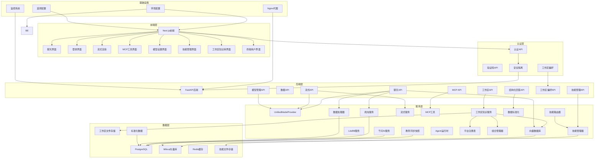

**图表来源**
- [backend/main.py:126-154](file://backend/main.py#L126-L154)
- [backend/app/api/chat.py:46-179](file://backend/app/api/chat.py#L46-L179)
- [backend/app/services/model_provider.py:189-271](file://backend/app/services/model_provider.py#L189-L271)
- [backend/app/services/skill_manager.py:28-189](file://backend/app/services/skill_manager.py#L28-L189)
- [backend/app/security.py:4-26](file://backend/app/security.py#L4-L26)
- [deploy/nginx/prod.conf:15-28](file://deploy/nginx/prod.conf#L15-L28)

**章节来源**
- [backend/main.py:126-154](file://backend/main.py#L126-L154)
- [docker-compose.yml:1-167](file://docker-compose.yml#L1-L167)
- [deploy/nginx/prod.conf:15-28](file://deploy/nginx/prod.conf#L15-L28)

## 核心组件

### 1. 聊天API服务

聊天API是整个系统的核心，提供了完整的对话功能，包括工具调用、RAG检索和纯对话三种模式。

### 2. 流式聊天API服务

新增的流式聊天API服务，基于Server-Sent Events（SSE）实现实时增量响应，提供更好的用户体验。

### 3. UnifiedModelProvider统一模型提供者

新增的统一模型提供者系统，实现了模型提供者的统一抽象：

- **统一接口**：BaseProvider基类定义了统一的AI服务接口
- **多提供商支持**：支持Qwen和LiteLLM两种模型提供商
- **自动回退机制**：主提供商失败时自动回退到QwenProvider
- **用户级配置**：按用户偏好动态创建模型提供者实例
- **兼容性保证**：保持现有API行为不变，向后兼容
- **推理模式支持**：支持standard、thinking、deep三种推理模式
- **思维流显示**：支持推理过程的实时显示

### 4. 模型管理API

新增的模型管理API，支持动态切换模型提供商：

- **可用提供商查询**：`GET /api/models/available`
- **用户偏好获取**：`GET /api/models/preference/{username}`
- **用户偏好设置**：`POST /api/models/preference`
- **动态模型切换**：支持按用户级别切换模型提供商

### 5. MCP工具集成

新增的MCP（Model Context Protocol）工具集成，支持AI Agent工具调用和自动化工作流。

### 6. 技能管理系统

新增的完整技能管理系统，支持技能的声明式配置、智能匹配和上下文注入：

- **技能YAML配置**：支持name、version、description、triggers、tools、enabled等字段
- **技能匹配算法**：基于关键词触发器进行智能匹配
- **技能上下文注入**：自动将技能提示注入到模型系统提示词中
- **技能生命周期管理**：支持上传、验证、导入、启用/禁用、删除
- **技能文件存储**：按用户隔离的技能存储
- **技能验证机制**：确保技能配置的完整性和有效性
- **技能导入功能**：支持从GitHub链接导入技能

### 7. 技能路由器服务

新增的智能技能匹配和提示构建服务：

- **技能匹配**：根据用户问题和触发器进行智能匹配
- **提示构建**：生成可注入模型的技能上下文提示
- **最大匹配数控制**：限制同时匹配的技能数量
- **关键词匹配**：支持大小写不敏感的关键词匹配

### 8. 技能管理API

新增的完整技能管理API接口：

- **技能列表**：`GET /api/skills/{username}` - 获取用户所有技能
- **技能上传**：`POST /api/skills/upload` - 上传技能YAML配置
- **技能验证**：`POST /api/skills/validate` - 验证技能配置
- **技能导入**：`POST /api/skills/import-url` - 从URL导入技能
- **技能启用/禁用**：`POST /api/skills/{skill_name}/enable` - 切换技能状态
- **技能删除**：`DELETE /api/skills/{skill_name}` - 删除技能

### 9. 技能管理前端界面

新增的完整技能管理前端界面：

- **技能上传**：支持YAML文本编辑和上传
- **技能导入**：支持GitHub链接导入
- **技能列表**：显示所有已安装技能
- **技能控制**：启用/禁用和删除操作
- **技能验证**：实时验证技能配置
- **用户界面**：响应式设计，支持移动端

### 10. 身份验证强制隔离机制

**新增** 完整的身份验证强制隔离机制，确保学号与登录会话的一致性：

- **服务端会话校验**：使用auth_session_id验证用户名一致性
- **Cookie兼容校验**：兼容旧的session_username cookie校验
- **401/403错误处理**：会话失效和权限不匹配的错误响应
- **安全隔离**：防止用户间的数据访问

### 11. 结构化回答系统

**新增** 完整的结构化回答系统，支持身份验证和位置查询的规范化输出：

- **身份验证回答**：基于个人信息的结构化输出
- **位置查询回答**：基于课表信息的地点统计
- **建筑名称提取**：智能解析课表地点信息
- **规范化格式**：统一的输出格式和数据结构
- **流式支持**：支持流式结构化回答

### 12. 教育数据标准化服务

**新增** 完整的教育数据标准化服务，将多种历史结构统一为稳定契约：

- **数据结构统一**：个人信息、成绩、课表、考试等标准化
- **学期分组**：成绩按学期自动分组
- **数据完整性**：确保数据结构的完整性和一致性
- **性能优化**：高效的标准化处理流程

### 13. 教育同步快照系统

**新增** 完整的教育同步快照系统，确保RAG上下文检索基于最新成功的同步数据：

- **快照管理**：EducationSyncSnapshot模型管理每次同步的状态
- **活动快照筛选**：自动选择最新的成功同步快照
- **sync_key关联**：向量数据与快照的唯一键关联
- **精确过滤**：基于sync_key的向量检索过滤
- **数据一致性**：确保AI回答基于最新有效的数据

### 14. 工作区知识库系统

**新增** 完整的工作区知识库系统，支持用户自定义知识库和RAG检索：

- **工作区管理**：创建、删除、列表化工作区
- **文档入库**：支持多格式文档的解析和向量化
- **知识检索**：基于向量检索的RAG上下文生成
- **知识图谱**：技能、MCP工具和文档的关系抽取
- **权限控制**：基于用户名的访问控制
- **智能合并**：整合工作区知识、技能和MCP工具

### 15. 智能上下文合并

**新增** 智能上下文合并功能，将工作区知识、技能和MCP工具整合到对话中：

- **AgentRuntime集成**：在Agent运行时构建上下文
- **工作区知识检索**：基于用户消息的RAG检索
- **技能上下文注入**：启用技能的智能匹配和注入
- **MCP工具集成**：可用MCP工具的自动发现和集成
- **上下文渲染**：将多源信息格式化为系统提示

### 16. 用户认证系统

实现了完整的用户认证和授权机制，包括验证码获取、用户登录、会话管理和权限控制。

### 17. AI服务集成

集成了阿里云千问大模型，支持Function Calling和RAG增强功能，以及流式对话模式。

### 18. 数据处理管道

实现了从爬取数据到向量化的完整数据处理流程。

### 19. 向量检索系统

基于Milvus的向量数据库，提供高效的相似性检索。

### 20. 自动工具检测

AI模型能够自动判断何时调用爬虫工具查询最新数据，无需人工干预。

### 21. 学术数据注入

将真实的教务系统数据注入到AI对话中，确保回答的准确性。

### 22. 对话ID跟踪

完整的对话状态管理和跟踪机制，支持跨会话的状态保持。

### 23. override参数支持

新增的允许用户覆盖模型提供商配置的参数支持：

- **override_provider**：覆盖模型提供商（qwen/litellm）
- **override_model**：覆盖模型名称
- **override_api_base**：覆盖API基础地址
- **override_api_key**：覆盖API密钥
- **推理模式控制**：支持standard、thinking、deep三种模式
- **思考流显示**：控制是否显示模型的思考过程

### 24. 思维流配置

新增的完整思维流配置功能：

- **推理模式参数**：通过reasoning_effort参数控制推理强度
- **思考流事件**：独立的thinking事件类型
- **内容事件**：独立的content事件类型
- **显示控制**：通过show_thinking参数控制显示
- **前端展示**：支持思考流的可视化展示

### 25. SSE响应头增强

新增的完整SSE响应头增强功能：

- **no-transform指令**：防止代理服务器对SSE流进行转换
- **Content-Encoding: identity**：明确指定内容编码为identity
- **缓存控制**：no-cache, no-transform确保实时性
- **连接保持**：Connection: keep-alive维持长连接
- **缓冲控制**：X-Accel-Buffering: no禁用Nginx缓冲

### 26. 开发环境配置优化

新增的完整开发环境配置优化：

- **条件环境变量**：支持根据环境动态配置
- **NEXT_TELEMETRY_DISABLED**：禁用Next.js遥测功能
- **开发性能优化**：减少开发环境的额外开销
- **环境隔离**：开发和生产环境的配置分离

### 27. 上下文工程策略

新增的完整上下文工程策略，优化RAG系统的性能和准确性：

- **Token优化**：减少60%+的无效Token消耗
- **准确性提升**：降低AI幻觉率至5%以下
- **响应速度**：上下文检索时间<500ms
- **个性化隔离**：按学号隔离数据，精准回答
- **安全隐私**：敏感信息过滤和数据隔离
- **监控优化**：关键指标监控和持续优化

**章节来源**
- [backend/app/api/chat.py:46-179](file://backend/app/api/chat.py#L46-L179)
- [backend/app/services/qwen_service.py:15-516](file://backend/app/services/qwen_service.py#L15-L516)
- [backend/app/services/model_provider.py:189-271](file://backend/app/services/model_provider.py#L189-L271)
- [backend/app/services/skill_manager.py:28-189](file://backend/app/services/skill_manager.py#L28-L189)
- [backend/app/services/skill_router.py:13-50](file://backend/app/services/skill_router.py#L13-L50)
- [backend/app/services/education_normalizer.py:27-142](file://backend/app/services/education_normalizer.py#L27-L142)
- [backend/app/security.py:4-26](file://backend/app/security.py#L4-L26)
- [deploy/nginx/prod.conf:15-28](file://deploy/nginx/prod.conf#L15-L28)
- [docs/CONTEXT-ENGINEERING-STRATEGY.md:1-444](file://docs/CONTEXT-ENGINEERING-STRATEGY.md#L1-L444)

## 架构概览

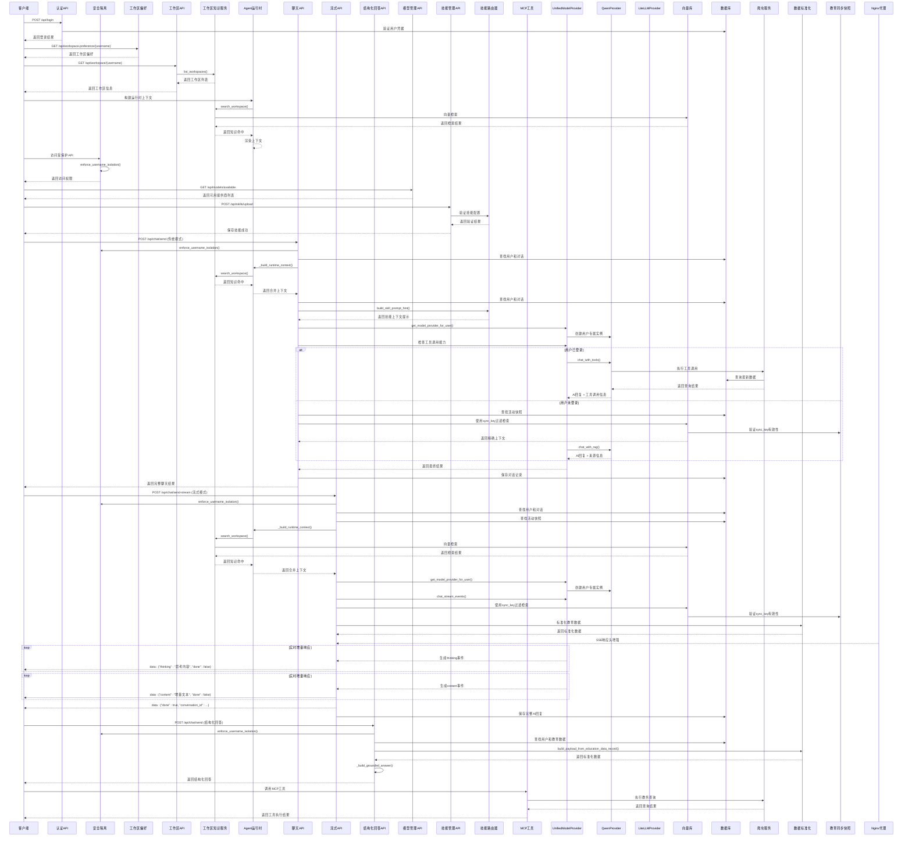

**图表来源**
- [backend/app/api/chat.py:115-179](file://backend/app/api/chat.py#L115-L179)
- [backend/app/api/chat.py:273-367](file://backend/app/api/chat.py#L273-L367)
- [backend/app/api/chat.py:541-562](file://backend/app/api/chat.py#L541-L562)
- [backend/app/api/models.py:23-79](file://backend/app/api/models.py#L23-L79)
- [backend/app/api/skills.py:38-105](file://backend/app/api/skills.py#L38-L105)
- [backend/app/services/qwen_service.py:190-321](file://backend/app/services/qwen_service.py#L190-L321)
- [backend/app/services/model_provider.py:289-299](file://backend/app/services/model_provider.py#L289-L299)
- [backend/app/services/skill_router.py:34-50](file://backend/app/services/skill_router.py#L34-L50)
- [backend/app/services/education_normalizer.py:125-142](file://backend/app/services/education_normalizer.py#L125-L142)
- [backend/app/security.py:4-26](file://backend/app/security.py#L4-L26)
- [deploy/nginx/prod.conf:15-28](file://deploy/nginx/prod.conf#L15-L28)

## 详细组件分析

### 聊天API组件

聊天API实现了智能对话的核心逻辑，支持三种不同的对话模式：

#### 工具调用模式（Function Calling）
当用户已登录时，AI可以自主决定是否调用爬虫工具查询最新数据。

#### RAG兜底模式
当工具调用不可用或失败时，使用向量库检索已缓存数据进行回答。

#### 纯对话模式
当没有任何数据时，进行普通的AI对话。

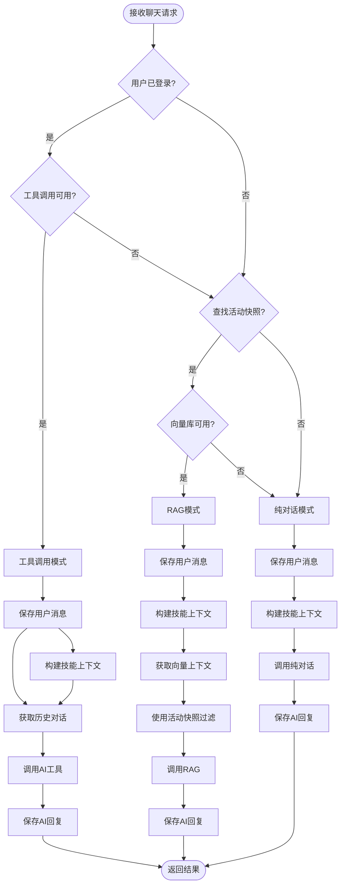

**图表来源**
- [backend/app/api/chat.py:46-179](file://backend/app/api/chat.py#L46-L179)

**章节来源**
- [backend/app/api/chat.py:46-179](file://backend/app/api/chat.py#L46-L179)

### 流式聊天API组件

新增的流式聊天API组件，基于Server-Sent Events（SSE）实现实时增量响应：

#### SSE响应头增强
新增的SSE响应头增强功能：

- **Cache-Control: no-cache, no-transform**：防止缓存和代理转换
- **Content-Encoding: identity**：明确指定identity编码
- **Connection: keep-alive**：维持长连接
- **X-Accel-Buffering: no**：禁用Nginx缓冲

#### 流式响应格式
- 使用SSE标准格式：`data: {JSON数据}\n\n`
- 支持增量内容传输
- 包含完成信号通知
- **新增** 支持独立的thinking事件和content事件

#### 流式处理流程
1. 验证AI服务可用性
2. 查找或创建用户和对话
3. 保存用户消息
4. 获取历史对话
5. 构建技能上下文提示
6. 流式调用AI生成器
7. 实时传输增量内容
8. 保存完整AI回复并发送完成信号

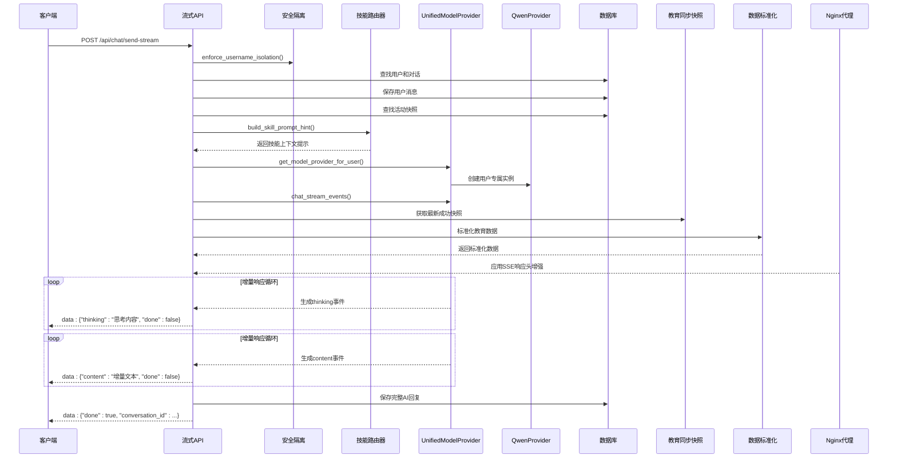

**图表来源**
- [backend/app/api/chat.py:273-367](file://backend/app/api/chat.py#L273-L367)
- [backend/app/api/chat.py:622-631](file://backend/app/api/chat.py#L622-L631)
- [backend/app/api/chat.py:658-667](file://backend/app/api/chat.py#L658-L667)
- [backend/app/security.py:4-26](file://backend/app/security.py#L4-L26)

**章节来源**
- [backend/app/api/chat.py:273-367](file://backend/app/api/chat.py#L273-L367)
- [backend/app/api/chat.py:622-631](file://backend/app/api/chat.py#L622-L631)
- [backend/app/api/chat.py:658-667](file://backend/app/api/chat.py#L658-L667)

### 结构化回答系统组件

**新增** 完整的结构化回答系统，支持身份验证和位置查询的规范化输出：

#### 结构化回答构建器
- **身份验证回答**：基于个人信息的结构化输出
- **位置查询回答**：基于课表信息的地点统计
- **建筑名称提取**：智能解析课表地点信息
- **规范化格式**：统一的输出格式和数据结构

#### 身份验证回答
当用户询问身份相关信息时，系统会返回结构化的个人信息：

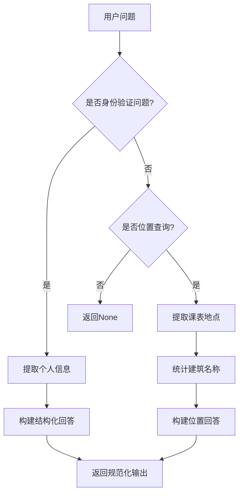

#### 位置查询回答
当用户询问上课地点或校区信息时，系统会返回结构化的地点统计：

- **地点列表**：显示所有唯一的上课地点
- **建筑统计**：统计各建筑出现的次数
- **学期信息**：显示当前课表的学期信息
- **限制说明**：明确数据的局限性和边界

#### 建筑名称提取算法
智能解析课表地点信息，提取建筑名称：

- **分隔符处理**：支持括号、数字等分隔符
- **文本截取**：去除括号内的详细信息
- **去重处理**：确保建筑名称的唯一性
- **统计计数**：统计各建筑的出现频率

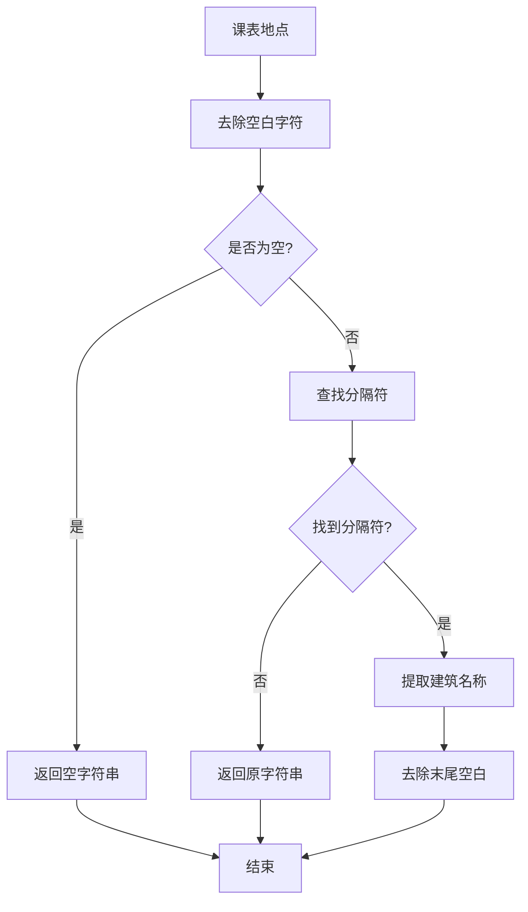

**图表来源**
- [backend/app/api/chat.py:85-130](file://backend/app/api/chat.py#L85-L130)
- [backend/app/api/chat.py:74-82](file://backend/app/api/chat.py#L74-L82)

**章节来源**
- [backend/app/api/chat.py:85-130](file://backend/app/api/chat.py#L85-L130)
- [backend/app/api/chat.py:74-82](file://backend/app/api/chat.py#L74-L82)

### 教育数据标准化服务组件

**新增** 完整的教育数据标准化服务，将多种历史结构统一为稳定契约：

#### 数据结构统一
- **个人信息**：统一的个人信息结构
- **成绩信息**：支持列表和按学期两种格式
- **课表信息**：统一的课表数据结构
- **考试安排**：标准化的考试数据格式

#### 学期分组算法
自动将成绩按学期进行分组：

- **自动识别**：从成绩列表中识别学期信息
- **字典构建**：构建学期到课程的映射
- **兼容处理**：兼容多种输入格式
- **统计计算**：计算各学期的统计信息

#### 数据完整性保证
- **类型检查**：确保数据类型的一致性
- **空值处理**：统一处理空值和None
- **结构验证**：验证数据结构的完整性
- **性能优化**：高效的标准化处理流程

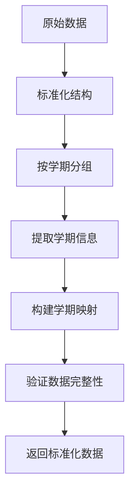

**图表来源**
- [backend/app/services/education_normalizer.py:27-112](file://backend/app/services/education_normalizer.py#L27-L112)

**章节来源**
- [backend/app/services/education_normalizer.py:27-142](file://backend/app/services/education_normalizer.py#L27-L142)

### 身份验证强制隔离机制组件

**新增** 完整的身份验证强制隔离机制，确保学号与登录会话的一致性：

#### 服务端会话校验
- **auth_session_id验证**：使用服务端会话ID验证用户名
- **会话状态检查**：确保会话未过期且有效
- **权限一致性**：防止学号与会话不匹配的情况

#### Cookie兼容校验
- **session_username检查**：兼容旧的cookie校验机制
- **降级处理**：在新机制失效时使用旧机制
- **安全考虑**：双重校验确保安全性

#### 错误处理机制
- **401错误**：会话失效时返回401状态码
- **403错误**：权限不匹配时返回403状态码
- **详细错误信息**：提供清晰的错误描述
- **日志记录**：记录安全相关的操作日志

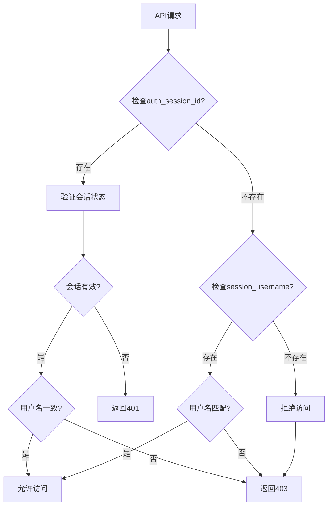

**图表来源**
- [backend/app/security.py:4-26](file://backend/app/security.py#L4-L26)

**章节来源**
- [backend/app/security.py:4-26](file://backend/app/security.py#L4-L26)

### UnifiedModelProvider统一模型提供者

新增的统一模型提供者系统，实现了模型提供者的统一抽象：

#### 统一接口设计
- **BaseProvider基类**：定义了统一的AI服务接口
- **标准化方法**：chat、chat_stream、chat_with_tools、chat_with_rag、generate_embedding
- **可用性标志**：每个提供者都有available属性

#### 多提供商支持
- **QwenProvider**：兼容现有实现，支持所有功能
- **LiteLLMProvider**：支持基础聊天和流式功能，工具调用和RAG暂不支持
- **自动回退机制**：主提供商失败时自动回退到QwenProvider

#### 用户级配置
- **按用户创建**：`get_model_provider_for_user()`支持按用户偏好创建实例
- **环境变量优先**：支持通过MODEL_PROVIDER和模型名称环境变量配置
- **会话存储集成**：从SessionStore获取用户模型偏好

#### 推理模式支持
- **推理模式参数**：通过reasoning_effort参数控制推理强度
- **思维流事件**：独立的thinking事件类型
- **内容事件**：独立的content事件类型
- **显示控制**：通过show_thinking参数控制显示

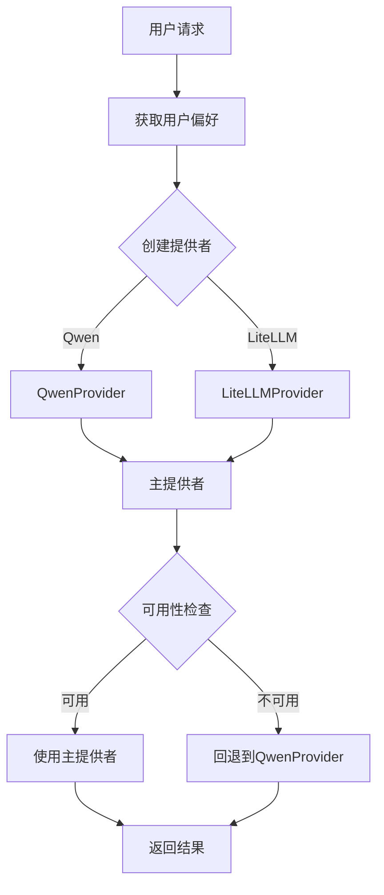

**图表来源**
- [backend/app/services/model_provider.py:189-271](file://backend/app/services/model_provider.py#L189-L271)
- [backend/app/services/model_provider.py:289-299](file://backend/app/services/model_provider.py#L289-L299)

**章节来源**
- [backend/app/services/model_provider.py:189-271](file://backend/app/services/model_provider.py#L189-L271)

### 模型管理API组件

新增的模型管理API，支持动态切换模型提供商：

#### 可用提供商查询
- `GET /api/models/available`：返回所有可用的模型提供商
- 支持Qwen和LiteLLM两种提供商
- 返回默认模型名称和可用模型列表
- **新增** 支持推理模式和思考流显示的提供商元数据

#### 用户偏好管理
- `GET /api/models/preference/{username}`：获取用户模型偏好
- `POST /api/models/preference`：设置用户模型偏好
- 支持按用户级别保存模型配置
- **新增** 支持推理模式和思考流显示配置

#### 前端集成
- 前端模型设置页面提供用户界面
- 实时加载可用提供商列表
- 支持用户保存个人偏好
- **新增** 支持推理模式选择和思考流显示开关

```mermaid
flowchart TD
Frontend[前端模型设置] --> GetAvailable[GET /api/models/available]
GetAvailable --> ShowProviders[显示可用提供商]
Frontend --> GetUserPref[GET /api/models/preference/{username}]
GetUserPref --> ShowCurrentPref[显示当前偏好]
Frontend --> SetPref[POST /api/models/preference]
SetPref --> SaveSuccess[保存成功]
```

**图表来源**
- [backend/app/api/models.py:23-79](file://backend/app/api/models.py#L23-L79)
- [frontend/src/app/settings/models/page.tsx:25-81](file://frontend/src/app/settings/models/page.tsx#L25-L81)

**章节来源**
- [backend/app/api/models.py:23-79](file://backend/app/api/models.py#L23-L79)
- [frontend/src/app/settings/models/page.tsx:25-81](file://frontend/src/app/settings/models/page.tsx#L25-L81)

### MCP工具集成组件

新增的MCP（Model Context Protocol）工具集成，支持AI Agent工具调用：

#### 工具定义
- `query_personal_info`: 查询个人信息
- `query_grades`: 查询成绩
- `query_schedule`: 查询课表
- `query_exam_schedule`: 查询考试安排
- `query_academic_progress`: 查询学业进度
- `query_training_plan`: 查询培养方案

#### 工具调用流程
1. AI Agent请求MCP工具
2. MCP服务验证用户会话
3. 调用爬虫服务执行查询
4. 返回格式化结果给AI Agent

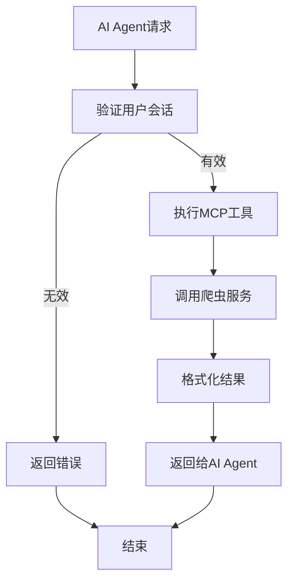

**图表来源**
- [backend/app/mcp/tools.py:44-310](file://backend/app/mcp/tools.py#L44-L310)

**章节来源**
- [backend/app/mcp/tools.py:44-310](file://backend/app/mcp/tools.py#L44-L310)

### 技能管理系统组件

新增的完整技能管理系统，支持技能的声明式配置、智能匹配和上下文注入：

#### 技能YAML配置规范
- **必需字段**：name、version、description、tools
- **可选字段**：enabled（默认true）、triggers（关键词触发器）、updated_at、created_at
- **工具规范**：每个工具必须包含name字段，可包含description
- **触发器机制**：支持多个关键词触发器，用于技能匹配

#### 技能匹配算法
- **关键词匹配**：用户问题与触发器进行大小写不敏感匹配
- **最大匹配数**：限制同时匹配的技能数量，默认3个
- **启用状态检查**：只匹配启用状态的技能
- **智能排序**：按匹配优先级排序返回

#### 技能上下文注入
- **提示构建**：生成可注入模型的技能上下文提示
- **系统消息注入**：将技能提示作为系统消息注入到对话历史
- **优先级处理**：技能上下文优先于普通对话历史
- **动态生成**：根据用户问题动态生成匹配的技能提示

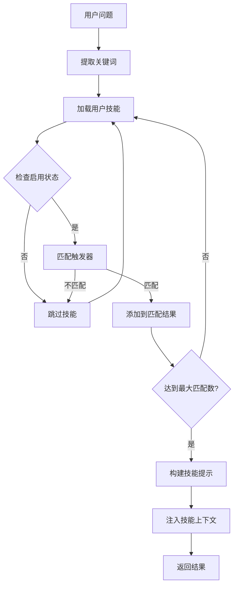

**图表来源**
- [backend/app/services/skill_router.py:13-50](file://backend/app/services/skill_router.py#L13-L50)

**章节来源**
- [backend/app/services/skill_manager.py:28-189](file://backend/app/services/skill_manager.py#L28-L189)
- [backend/app/services/skill_router.py:13-50](file://backend/app/services/skill_router.py#L13-L50)

### 技能管理API组件

新增的完整技能管理API接口：

#### 技能列表接口
- `GET /api/skills/{username}`：获取用户所有技能
- 支持按技能名称排序
- 返回技能的基本信息和状态

#### 技能上传接口
- `POST /api/skills/upload`：上传技能YAML配置
- 支持完整的技能配置验证
- 自动创建技能文件并保存

#### 技能验证接口
- `POST /api/skills/validate`：验证技能配置
- 检查必需字段和格式
- 返回验证结果和元信息

#### 技能导入接口
- `POST /api/skills/import-url`：从URL导入技能
- 支持GitHub链接自动转换
- 限制文件大小和域名白名单

#### 技能状态管理接口
- `POST /api/skills/{skill_name}/enable`：启用/禁用技能
- `DELETE /api/skills/{skill_name}`：删除技能

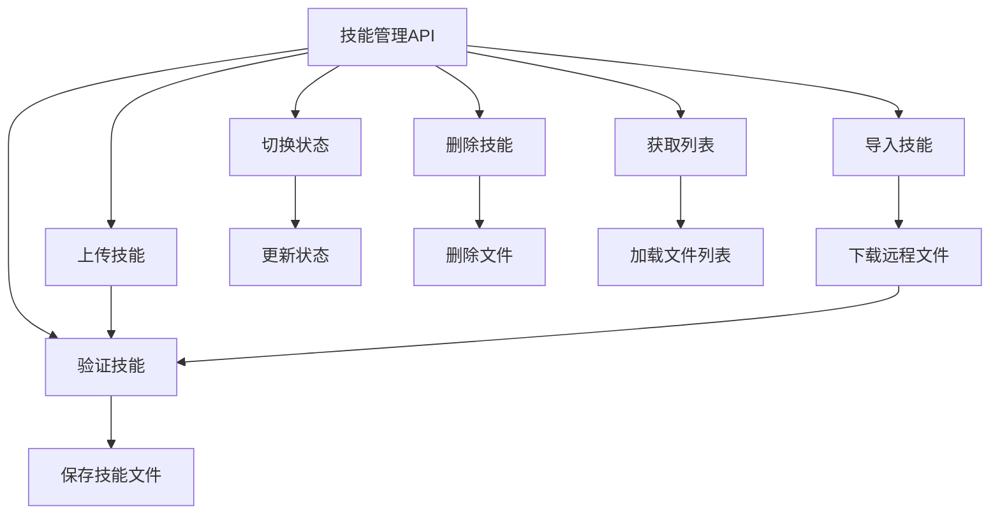

**图表来源**
- [backend/app/api/skills.py:38-105](file://backend/app/api/skills.py#L38-L105)

**章节来源**
- [backend/app/api/skills.py:38-105](file://backend/app/api/skills.py#L38-L105)

### 技能管理前端界面

新增的完整技能管理前端界面：

#### 功能特性
- **技能上传**：支持YAML文本编辑和上传
- **技能导入**：支持GitHub链接导入
- **技能列表**：显示所有已安装技能
- **技能控制**：启用/禁用和删除操作
- **技能验证**：实时验证技能配置
- **用户界面**：响应式设计，支持移动端

#### 用户体验
- **实时加载**：技能列表实时刷新
- **状态反馈**：操作成功/失败的即时提示
- **默认模板**：提供示例技能YAML模板
- **URL导入**：支持GitHub链接自动转换

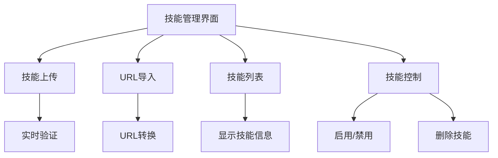

**图表来源**
- [frontend/src/app/skills/page.tsx:28-228](file://frontend/src/app/skills/page.tsx#L28-L228)

**章节来源**
- [frontend/src/app/skills/page.tsx:28-228](file://frontend/src/app/skills/page.tsx#L28-L228)

### 工作区知识库系统组件

**新增** 完整的工作区知识库系统，支持用户自定义知识库和RAG检索：

#### 工作区管理
- **创建工作区**：支持创建用户专属工作区
- **工作区列表**：获取用户所有工作区
- **默认工作区**：自动创建默认工作区
- **工作区偏好**：支持用户选择特定工作区

#### 文档入库处理
- **多格式支持**：支持txt、md、pdf、docx、xlsx、pptx等格式
- **文本解析**：自动解析各种文档格式为纯文本
- **向量化处理**：将文档内容分块并生成向量
- **元数据存储**：存储文档的元数据和关系信息

#### 知识检索功能
- **向量检索**：基于用户查询的向量相似度检索
- **精确过滤**：基于workspace_id的精确过滤
- **回退机制**：向量检索失败时的文本匹配回退
- **Top-K返回**：返回最相关的知识片段

#### 知识图谱功能
- **关系抽取**：自动抽取技能、MCP工具和文档之间的关系
- **节点构建**：构建工作区、技能、MCP工具、文档的图谱节点
- **边关系**：建立包含、can_use、enabled等关系边
- **动态更新**：根据平台配置动态更新图谱

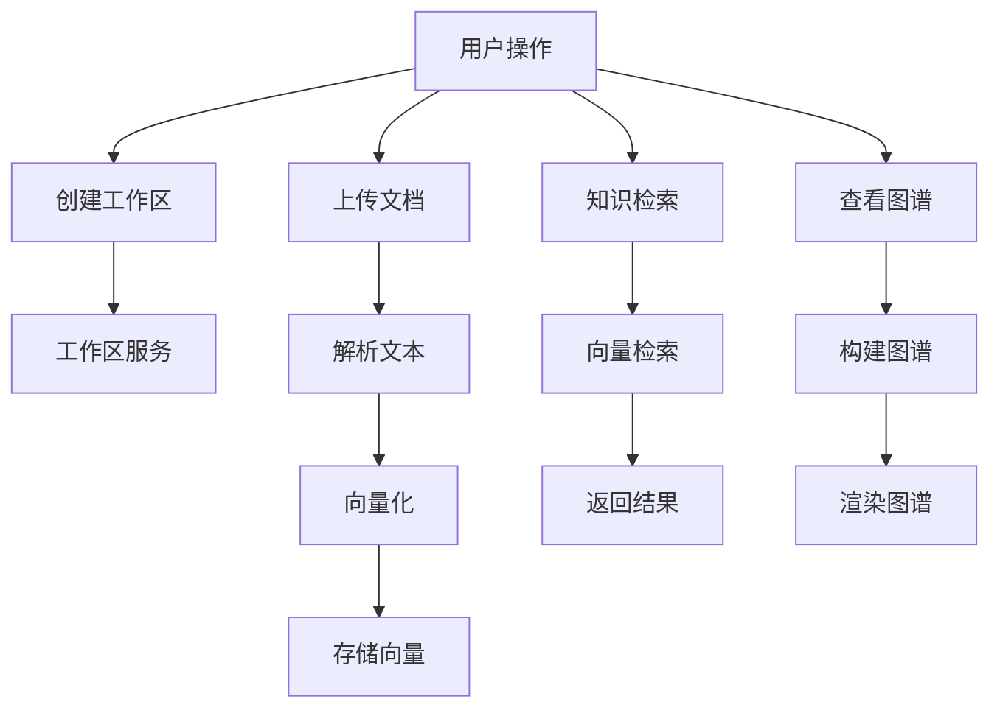

**图表来源**
- [backend/app/api/workspace.py:42-76](file://backend/app/api/workspace.py#L42-L76)
- [backend/app/api/workspace.py:107-126](file://backend/app/api/workspace.py#L107-L126)
- [backend/app/api/workspace.py:173-189](file://backend/app/api/workspace.py#L173-L189)
- [backend/app/services/workspace_knowledge.py:354-465](file://backend/app/services/workspace_knowledge.py#L354-L465)

**章节来源**
- [backend/app/api/workspace.py:42-76](file://backend/app/api/workspace.py#L42-L76)
- [backend/app/api/workspace.py:107-126](file://backend/app/api/workspace.py#L107-L126)
- [backend/app/api/workspace.py:173-189](file://backend/app/api/workspace.py#L173-L189)
- [backend/app/services/workspace_knowledge.py:354-465](file://backend/app/services/workspace_knowledge.py#L354-L465)

### 智能上下文合并组件

**新增** 智能上下文合并功能，将工作区知识、技能和MCP工具整合到对话中：

#### AgentRuntime集成
- **上下文构建**：在Agent运行时构建多源上下文
- **工作区知识检索**：基于用户消息的RAG检索
- **技能上下文注入**：启用技能的智能匹配和注入
- **MCP工具集成**：可用MCP工具的自动发现和集成

#### 上下文渲染
- **工作区信息**：当前工作区的基本信息
- **技能列表**：启用技能的名称、描述和触发器
- **MCP工具**：可用MCP工具的名称、类型和描述
- **知识命中**：工作区相关知识的标题和内容

#### 上下文注入
- **系统提示**：将合并后的上下文注入到系统提示中
- **对话历史**：与普通对话历史一起传递给模型
- **优先级处理**：工作区知识优先于普通对话历史
- **动态更新**：根据用户消息动态更新上下文

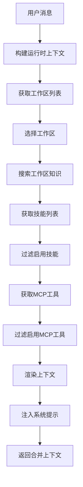

**图表来源**
- [backend/app/services/agent_runtime.py:72-127](file://backend/app/services/agent_runtime.py#L72-L127)
- [backend/app/services/agent_runtime.py:142-178](file://backend/app/services/agent_runtime.py#L142-L178)

**章节来源**
- [backend/app/services/agent_runtime.py:72-127](file://backend/app/services/agent_runtime.py#L72-L127)
- [backend/app/services/agent_runtime.py:142-178](file://backend/app/services/agent_runtime.py#L142-L178)

### AI服务组件

千问AI服务封装了阿里云千问大模型的调用逻辑，提供了多种对话模式：

#### 工具定义
- `query_personal_info`: 查询个人信息
- `query_grades`: 查询成绩
- `query_schedule`: 查询课表
- `query_exam_schedule`: 查询考试安排
- `query_academic_progress`: 查询学业进度
- `query_training_plan`: 查询培养方案
- `refresh_all_data`: 刷新所有数据

#### 对话模式
- `chat()`: 基础对话
- `chat_with_tools()`: 带工具调用的对话
- `chat_with_rag()`: RAG增强对话
- `chat_stream()`: 流式对话生成器
- `generate_embedding()`: 文本向量化

**章节来源**
- [backend/app/services/qwen_service.py:15-516](file://backend/app/services/qwen_service.py#L15-L516)

### 数据处理组件

数据处理器负责将爬取的原始数据转换为适合向量检索的格式：

#### 数据分块策略
- 个人信息：1个数据块
- 每门课程成绩：1个数据块
- 每天课表：1个数据块
- 培养方案：按类别分组，每类1个数据块
- 学业进度：1个数据块
- 每门考试：1个数据块

#### 向量化流程
1. 删除用户旧向量数据
2. 数据分块
3. 批量向量化（每批10个）
4. 过滤无效向量
5. 存储到Milvus

**章节来源**
- [backend/app/services/data_processor.py:13-347](file://backend/app/services/data_processor.py#L13-L347)

### 向量数据库组件

向量数据库服务基于Milvus实现，提供了完整的向量检索功能：

#### 集合管理
- 自动创建集合（如果不存在）
- 创建向量索引（IVF_FLAT）
- 设置相似度度量（COSINE）

#### 检索功能
- 按用户ID过滤
- 支持自定义top_k
- 返回相似度分数
- **新增** 支持sync_key过滤精确匹配

**章节来源**
- [backend/app/services/vector_store.py:14-185](file://backend/app/services/vector_store.py#L14-L185)

### 数据模型组件

系统使用SQLAlchemy ORM定义了完整的数据模型：

#### 用户模型
- 基本信息：学号、姓名、学院、专业、班级
- 状态管理：激活状态、最后登录时间
- 关系：一对多的教育数据和对话关系

#### 教务数据模型
- 个人信息JSON
- 成绩列表和统计
- 课表信息
- 培养方案
- 学业进度
- 考试安排

#### 对话模型
- 对话会话：标题、元数据、时间戳
- 消息记录：角色、内容、元数据

#### 教育同步快照模型
- **新增** EducationSyncSnapshot：管理每次同步的状态和数据
- 包含sync_key、status、is_active等关键字段
- 支持精确的数据版本控制

#### 工作区知识库模型
- **新增** Workspace：工作区基本信息
- **新增** KnowledgeDocument：知识文档实体
- **新增** KnowledgeChunk：知识文档分块
- **新增** KnowledgeRelation：知识关系实体
- **新增** KnowledgeSource：知识来源信息

**章节来源**
- [backend/app/models/user.py:11-33](file://backend/app/models/user.py#L11-L33)
- [backend/app/models/education_data.py:11-126](file://backend/app/models/education_data.py#L11-L126)
- [backend/app/models/conversation.py:11-42](file://backend/app/models/conversation.py#L11-L42)
- [backend/app/models/platform.py:88-166](file://backend/app/models/platform.py#L88-L166)

### 爬虫组件

爬虫服务负责从教务系统获取实时数据：

#### 支持的功能
- 个人信息查询
- 成绩查询
- 课表查询
- 培养方案查询
- 学业进度查询
- 考试安排查询

#### 编码处理
- 自动检测和修复编码问题
- 支持UTF-8和GBK混合编码
- 处理教务系统的特殊HTML结构

**章节来源**
- [backend/scraper.py:13-800](file://backend/scraper.py#L13-L800)

### 前端聊天界面

前端聊天界面提供了完整的用户交互体验：

#### 功能特性
- 实时聊天对话
- 对话历史管理
- 工具调用可视化
- 快捷问题功能
- 响应式设计
- 流式渲染支持
- **新增** 推理模式选择
- **新增** 思考流显示
- **新增** 活动快照状态显示
- **新增** 结构化回答展示
- **新增** 工作区偏好选择

#### 用户体验
- 支持移动端和桌面端
- 实时加载指示器
- 对话状态管理
- 无缝的用户体验
- 实时增量内容显示
- **新增** 思考流的可视化展示
- **新增** 活动快照进度指示
- **新增** 结构化回答的格式化显示
- **新增** 工作区知识库的集成

**章节来源**
- [frontend/src/app/chat/page.tsx:40-490](file://frontend/src/app/chat/page.tsx#L40-L490)

### 前端模型设置界面

新增的前端模型设置界面，支持用户级模型偏好管理：

#### 功能特性
- 可用提供商列表显示
- 用户当前偏好展示
- 模型选择和保存
- 实时状态反馈
- 响应式设计
- **新增** 推理模式选择
- **新增** 思考流显示开关

#### 用户体验
- 支持移动端和桌面端
- 实时加载状态
- 成功/失败状态提示
- 无缝的用户体验

**章节来源**
- [frontend/src/app/settings/models/page.tsx:25-81](file://frontend/src/app/settings/models/page.tsx#L25-L81)

### 前端工作区知识库界面

**新增** 完整的工作区知识库前端界面：

#### 功能特性
- 工作区创建和管理
- 文档上传和管理
- 知识检索和展示
- 知识图谱可视化
- 平台技能和MCP工具展示
- 工作区偏好设置

#### 用户体验
- 支持移动端和桌面端
- 实时加载状态
- 成功/失败状态提示
- 无缝的用户体验
- **新增** 工作区知识库的实时检索
- **新增** 知识图谱的可视化展示

**章节来源**
- [frontend/src/app/workspace/page.tsx:59-556](file://frontend/src/app/workspace/page.tsx#L59-L556)

### override参数支持

新增的允许用户覆盖模型提供商配置的参数支持：

#### ChatRequest模型更新
- **override_provider**：覆盖模型提供商（qwen/litellm）
- **override_model**：覆盖模型名称
- **override_api_base**：覆盖API基础地址
- **override_api_key**：覆盖API密钥
- **reasoning_mode**：推理模式（standard/thinking/deep）
- **show_thinking**：是否显示思考流

#### 流式API实现
- 支持override参数的流式聊天
- 实时推理模式控制
- 思考流事件处理
- 错误回退机制

**章节来源**
- [backend/app/api/chat.py:63-74](file://backend/app/api/chat.py#L63-L74)
- [backend/app/api/chat.py:374-380](file://backend/app/api/chat.py#L374-L380)
- [backend/app/api/chat.py:541-542](file://backend/app/api/chat.py#L541-L542)

### 思维流配置

新增的完整思维流配置功能：

#### 推理模式控制
- **standard**：标准模式，不显示思考过程
- **thinking**：推理模式，显示中等强度的思考过程
- **deep**：深度推理模式，显示高强度的思考过程

#### 思考流事件
- **独立事件类型**：thinking事件和content事件分离
- **推理强度控制**：通过reasoning_effort参数控制
- **显示控制**：通过show_thinking参数控制显示

#### 前端展示
- **思考区域**：专门的思考内容展示区域
- **样式区分**：与普通内容的视觉区分
- **实时更新**：思考流的实时显示

**章节来源**
- [backend/app/services/model_provider.py:187-226](file://backend/app/services/model_provider.py#L187-L226)
- [backend/app/services/model_provider.py:306-339](file://backend/app/services/model_provider.py#L306-L339)
- [frontend/src/app/chat/page.tsx:334-351](file://frontend/src/app/chat/page.tsx#L334-L351)
- [frontend/src/app/chat/page.tsx:846-851](file://frontend/src/app/chat/page.tsx#L846-L851)

### SSE响应头增强

新增的完整SSE响应头增强功能：

#### 响应头配置
- **Cache-Control: no-cache, no-transform**：防止缓存和代理转换
- **Content-Encoding: identity**：明确指定identity编码
- **Connection: keep-alive**：维持长连接
- **X-Accel-Buffering: no**：禁用Nginx缓冲

#### 增强目的
- **防止代理转换**：no-transform确保SSE流不被代理服务器转换
- **明确编码**：Content-Encoding: identity避免编码问题
- **实时性保证**：no-cache确保内容实时性
- **缓冲控制**：X-Accel-Buffering: no防止Nginx缓冲聚合

#### 实现位置
- **流式响应**：在StreamingResponse中设置SSE响应头
- **错误响应**：在错误流式响应中同样应用响应头增强
- **Nginx配置**：生产环境Nginx专门针对SSE流式接口禁用缓冲

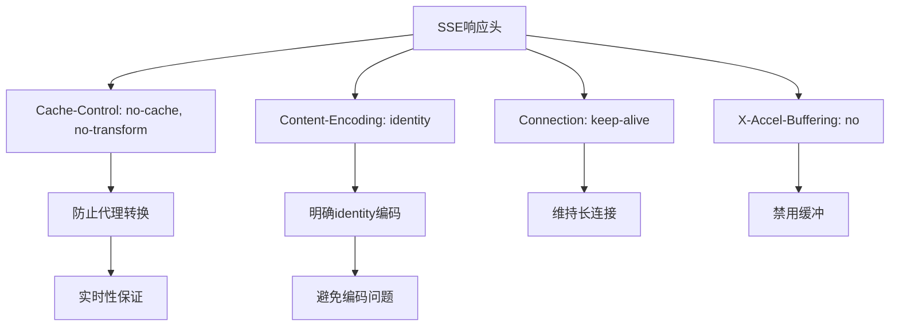

**图表来源**
- [backend/app/api/chat.py:625-629](file://backend/app/api/chat.py#L625-L629)
- [backend/app/api/chat.py:661-665](file://backend/app/api/chat.py#L661-L665)
- [deploy/nginx/prod.conf:23-27](file://deploy/nginx/prod.conf#L23-L27)

**章节来源**
- [backend/app/api/chat.py:625-629](file://backend/app/api/chat.py#L625-L629)
- [backend/app/api/chat.py:661-665](file://backend/app/api/chat.py#L661-L665)
- [deploy/nginx/prod.conf:23-27](file://deploy/nginx/prod.conf#L23-L27)

### 开发环境配置优化

新增的完整开发环境配置优化：

#### 条件环境变量
- **NEXT_TELEMETRY_DISABLED**：禁用Next.js遥测功能
- **开发性能优化**：减少开发环境的额外开销
- **环境隔离**：开发和生产环境的配置分离

#### 配置实现
- **package.json脚本**：开发脚本支持条件环境变量
- **Next.js配置**：通过环境变量控制遥测功能
- **开发体验优化**：提升开发环境的响应速度

#### 环境变量支持
- **NEXT_TELEMETRY_DISABLED**：设置为1时禁用遥测
- **开发模式**：在开发环境中自动应用优化
- **生产模式**：保持默认的遥测配置

**章节来源**
- [frontend/package.json:6](file://frontend/package.json#L6)
- [package.json:6](file://package.json#L6)
- [frontend/package.json:48](file://frontend/package.json#L48)

## Server-Sent Events流式聊天功能

### SSE架构设计

系统采用Server-Sent Events（SSE）技术实现流式聊天功能，提供实时增量响应：

#### SSE协议特点
- 单向实时通信
- 自动重连机制
- 事件流格式支持
- 增量内容传输

#### 流式响应格式
```javascript
// 增量内容
data: {"content": "AI生成的文本片段", "done": false}

// 思考流
data: {"thinking": "AI的思考过程", "done": false}

// 完成信号
data: {"done": true, "conversation_id": 123}

// 对话ID通知
data: {"conversation_id": 123, "done": false}

// keep-alive ping帧
data: {"ping": true, "stage": "tool_call", "done": false}
```

### 后端流式API实现

#### 流式生成器
- 使用Python生成器模式
- 支持异步流式响应
- 实时传输增量内容
- 自动处理异常和完成信号

#### SSE响应头设置
- `Content-Type: text/event-stream`
- `Cache-Control: no-cache`
- `Connection: keep-alive`
- `X-Accel-Buffering: no`

新增SSE响应头增强功能

#### 增强的SSE响应头
- **Cache-Control: no-cache, no-transform**：防止缓存和代理转换
- **Content-Encoding: identity**：明确指定identity编码
- **Connection: keep-alive**：维持长连接
- **X-Accel-Buffering: no**：禁用Nginx缓冲

### 前端流式渲染实现

#### 流式读取器
- 使用ReadableStream API
- 实时解析SSE事件
- 增量更新消息内容
- 自动处理完成信号

#### 用户体验优化
- 实时内容增量显示
- 对话ID动态更新
- 错误处理和恢复
- 加载状态管理

新增了多项重大改进，包括增强的错误处理、请求取消、缓冲管理和智能回退机制

#### 增强的错误处理机制
- **请求超时控制**：60秒超时自动取消请求
- **流式异常捕获**：实时监控流式传输异常
- **智能回退机制**：流式失败时自动降级到传统API
- **错误状态显示**：用户友好的错误提示

#### 请求取消和并发控制
- **AbortController集成**：支持主动取消流式请求
- **活动请求跟踪**：使用`activeHistoryReqRef`防止请求覆盖
- **过时请求忽略**：避免历史加载请求覆盖当前消息

#### 缓冲管理和性能优化
- **SSE缓冲区管理**：智能处理分片不完整的情况
- **流式刷新节流**：60ms节流窗口减少重绘开销
- **内存管理**：及时清理定时器和流式资源

#### 智能回退机制
- **流式无分片兜底**：检测到无有效分片时自动回退
- **传统API回退**：流式失败时自动使用传统API
- **状态恢复**：回退过程中保持对话状态

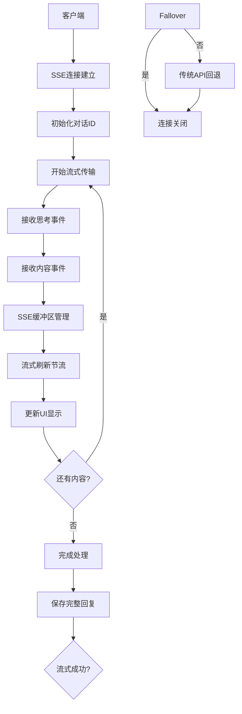

**图表来源**
- [frontend/src/app/chat/page.tsx:119-198](file://frontend/src/app/chat/page.tsx#L119-L198)
- [backend/app/api/chat.py:329-351](file://backend/app/api/chat.py#L329-L351)

**章节来源**
- [frontend/src/app/chat/page.tsx:119-198](file://frontend/src/app/chat/page.tsx#L119-L198)
- [backend/app/api/chat.py:273-367](file://backend/app/api/chat.py#L273-L367)

### 流式错误处理机制

#### 错误传播
- 后端异常转换为错误消息
- 前端错误状态显示
- 连接自动重连
- 用户友好的错误提示

#### 异常恢复
- 流式传输中断处理
- 对话状态恢复
- 数据完整性保证
- 优雅降级机制

新增了完整的请求取消和智能回退机制

#### 请求取消机制
- **超时自动取消**：60秒超时触发AbortController
- **用户主动取消**：支持用户手动取消长耗时请求
- **并发请求管理**：防止多个请求相互覆盖

#### 智能回退机制
- **流式无分片检测**：自动检测流式响应异常
- **传统API回退**：流式失败时自动切换到传统API
- **状态保持**：回退过程中保持对话状态和消息内容

**章节来源**
- [backend/app/api/chat.py:283-285](file://backend/app/api/chat.py#L283-L285)
- [frontend/src/app/chat/page.tsx:186-195](file://frontend/src/app/chat/page.tsx#L186-L195)

### keep-alive ping机制

#### ping帧设计
- **定期发送**：每2秒发送一次ping帧
- **阶段标识**：区分工具调用阶段和模型流式阶段
- **连接保活**：防止代理服务器断开空闲连接
- **状态同步**：向客户端报告当前处理阶段

#### ping帧格式
```json
{
  "ping": true,
  "stage": "tool_call",  // 或 "model_stream"
  "done": false
}
```

#### 前端处理
- **忽略ping帧**：ping帧不显示在聊天内容中
- **状态更新**：根据stage更新UI状态
- **连接监控**：监控ping帧频率确保连接活跃

**章节来源**
- [backend/app/api/chat.py:458-460](file://backend/app/api/chat.py#L458-L460)
- [frontend/src/app/chat/page.tsx:277-280](file://frontend/src/app/chat/page.tsx#L277-L280)

### 工具调用优先级机制

#### 优先级策略
1. **工具调用优先**：在流式模式下优先执行工具调用
2. **降级机制**：工具调用失败时自动降级到模型流式生成
3. **混合模式**：工具调用成功时直接返回工具结果
4. **阶段通知**：通过ping帧告知客户端当前处理阶段

#### 实现细节
- **异步任务**：使用asyncio.create_task执行工具调用
- **轮询机制**：通过while循环监控任务完成状态
- **线程安全**：使用asyncio.to_thread确保线程安全
- **错误隔离**：工具调用异常不影响整体流式处理

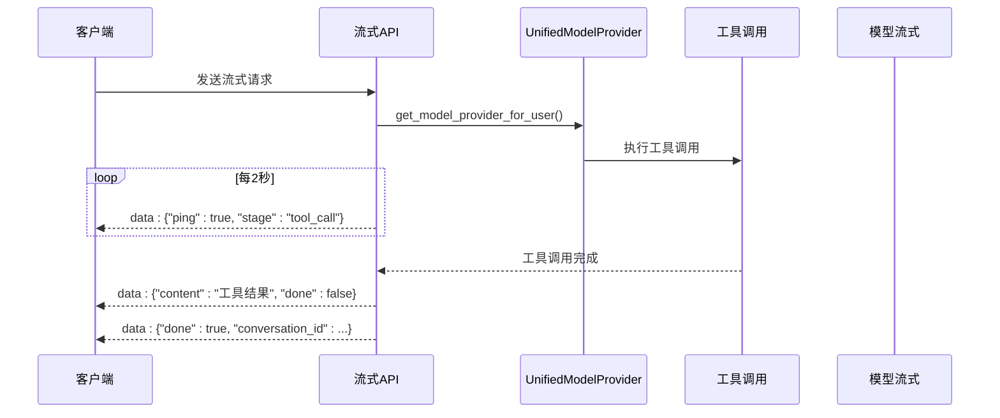

**图表来源**
- [backend/app/api/chat.py:452-488](file://backend/app/api/chat.py#L452-L488)

**章节来源**
- [backend/app/api/chat.py:452-488](file://backend/app/api/chat.py#L452-L488)

### _infer_rag_filters函数

#### 功能描述
新的 `_infer_rag_filters` 函数用于从用户问题中自动提取RAG检索的过滤条件：

#### 过滤条件提取
- **数据类型过滤**：从关键词匹配提取数据类型
- **学期过滤**：从问题中提取特定学期信息
- **关键词映射**：支持中文关键词到英文数据类型的映射

#### 支持的数据类型
- 课表：`["课表", "schedule"]`
- 成绩：`["成绩", "grade", "绩点"]`
- 考试：`["考试", "exam"]`
- 培养方案：`["培养方案", "training"]`
- 学业进度：`["学业进度", "进度"]`
- 个人信息：`["个人信息", "我是谁", "基本信息"]`

#### 学期匹配
- 支持格式：`YYYY-YYYY-Semester`（如 `2025-2026-2`）
- 自动提取学期信息用于精确检索

**章节来源**
- [backend/app/api/chat.py:25-50](file://backend/app/api/chat.py#L25-L50)

### 流式响应重构

#### 完全重构的流式处理
- **双优先级架构**：工具调用优先于模型流式生成
- **keep-alive机制**：定期发送ping帧保持连接活跃
- **错误隔离**：工具调用失败不影响模型流式处理
- **状态同步**：通过ping帧同步处理阶段状态
- **事件分离**：独立的thinking事件和content事件

#### 新的流式生成流程
1. **对话ID预通知**：立即发送对话ID给客户端
2. **工具调用阶段**：优先执行工具调用，每2秒发送ping帧
3. **工具调用成功**：直接返回工具结果，跳过模型生成
4. **工具调用失败**：降级到模型流式生成
5. **模型流式阶段**：使用队列机制处理模型生成
6. **超时保活**：模型生成超时发送ping帧保持连接
7. **思维流支持**：独立的thinking事件类型

新增SSE响应头增强和开发环境配置优化

#### SSE响应头增强
- **no-transform指令**：防止代理服务器转换SSE流
- **Content-Encoding: identity**：明确指定identity编码
- **实时性保证**：确保SSE流的实时传输

#### 开发环境优化
- **NEXT_TELEMETRY_DISABLED**：禁用Next.js遥测功能
- **性能优化**：减少开发环境的额外开销
- **开发体验提升**：提升开发环境的响应速度

**章节来源**
- [backend/app/api/chat.py:441-555](file://backend/app/api/chat.py#L441-L555)
- [backend/app/api/chat.py:625-629](file://backend/app/api/chat.py#L625-L629)
- [backend/app/api/chat.py:661-665](file://backend/app/api/chat.py#L661-L665)

### override参数处理

新增的完整override参数处理机制：

#### 参数覆盖逻辑
- **优先级检查**：检查override参数是否存在
- **动态创建**：根据override参数动态创建UnifiedModelProvider
- **参数验证**：验证override参数的有效性
- **回退机制**：override失败时回退到用户偏好

#### 流式API中的override
- **实时参数传递**：在chat_stream_events中传递override参数
- **推理模式控制**：支持reasoning_mode参数
- **思考流显示**：支持show_thinking参数
- **错误处理**：override失败时的错误处理

**章节来源**
- [backend/app/api/chat.py:109-115](file://backend/app/api/chat.py#L109-L115)
- [backend/app/api/chat.py:374-380](file://backend/app/api/chat.py#L374-L380)
- [backend/app/api/chat.py:538-542](file://backend/app/api/chat.py#L538-L542)

### 思维流事件处理

新增的完整思维流事件处理机制：

#### 事件类型分离
- **thinking事件**：独立的思考流事件
- **content事件**：独立的内容生成事件
- **事件合并**：前端将thinking和content事件合并显示

#### 推理模式控制
- **推理强度**：通过reasoning_effort参数控制推理强度
- **模式映射**：thinking映射到medium，deep映射到high
- **兼容性**：不支持推理模式的后端会被忽略

#### 前端显示逻辑
- **思考区域**：专门的思考内容展示区域
- **样式区分**：与普通内容的视觉区分
- **实时更新**：思考流的实时显示
- **显示控制**：通过show_thinking参数控制显示

**章节来源**
- [backend/app/services/model_provider.py:209-221](file://backend/app/services/model_provider.py#L209-L221)
- [backend/app/services/model_provider.py:317-325](file://backend/app/services/model_provider.py#L317-L325)
- [frontend/src/app/chat/page.tsx:334-351](file://frontend/src/app/chat/page.tsx#L334-L351)
- [frontend/src/app/chat/page.tsx:846-851](file://frontend/src/app/chat/page.tsx#L846-L851)

### Nginx生产环境配置

新增的完整Nginx生产环境配置：

#### SSE专用配置
- **location /api/chat/send-stream**：专门针对SSE流式接口
- **proxy_buffering off**：禁用代理缓冲
- **proxy_request_buffering off**：禁用请求缓冲
- **add_header X-Accel-Buffering no**：设置X-Accel-Buffering头

#### 超时配置
- **proxy_read_timeout 3600s**：3600秒读取超时
- **proxy_send_timeout 3600s**：3600秒发送超时
- **适合长连接**：支持SSE的长时间连接

#### 代理设置
- **proxy_pass http://backend_upstream**：转发到后端上游
- **标准代理头设置**：Host、X-Real-IP、X-Forwarded-For、X-Forwarded-Proto

**章节来源**
- [deploy/nginx/prod.conf:15-28](file://deploy/nginx/prod.conf#L15-L28)

## 活动快照驱动的RAG上下文检索

### 活动快照机制概述

新增的活动快照系统是本次更新的核心创新，确保RAG上下文检索基于最新成功的同步数据：

#### 快照管理
- **EducationSyncSnapshot模型**：管理每次同步的状态和数据
- **sync_key唯一性**：确保每次同步的唯一标识
- **状态跟踪**：pending、success、failed三种状态
- **活动标记**：is_active字段标识当前激活的快照

#### 数据一致性保证
- **精确过滤**：向量检索使用sync_key进行精确匹配
- **版本控制**：基于sync_key的数据版本管理
- **数据隔离**：按用户和sync_key的双重隔离
- **回滚机制**：支持旧数据的自动清理

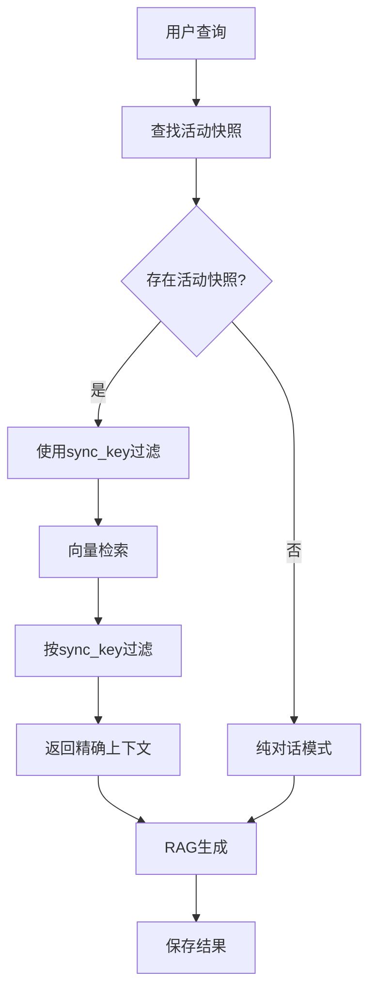

**图表来源**
- [backend/app/api/chat.py:193-210](file://backend/app/api/chat.py#L193-L210)
- [backend/app/services/vector_store.py:225-228](file://backend/app/services/vector_store.py#L225-L228)

### 教育同步快照模型

#### 模型设计
- **唯一键约束**：sync_key唯一性确保数据一致性
- **状态字段**：status字段跟踪同步状态
- **活动标记**：is_active字段标识当前有效数据
- **成功标志**：crawl_success、store_success、vector_success

#### 快照生命周期
1. **创建**：同步开始时创建pending状态快照
2. **更新**：各阶段完成后更新相应成功标志
3. **激活**：最后一个成功阶段完成后标记为活动
4. **清理**：旧快照数据自动清理

```mermaid
sequenceDiagram
participant Sync as 同步服务
participant Snapshot as 快照模型
participant Vector as 向量库
Sync->>Snapshot : 创建pending快照
Sync->>Snapshot : 更新crawl_success
Sync->>Snapshot : 更新store_success
Sync->>Snapshot : 更新vector_success
Sync->>Snapshot : 标记为is_active
Sync->>Vector : 存储向量数据
Vector->>Snapshot : 返回存储结果
```

**图表来源**
- [backend/app/models/education_data.py:50-71](file://backend/app/models/education_data.py#L50-L71)
- [backend/app/services/education_sync.py:135-140](file://backend/app/services/education_sync.py#L135-L140)

**章节来源**
- [backend/app/models/education_data.py:50-71](file://backend/app/models/education_data.py#L50-L71)
- [backend/app/services/education_sync.py:135-140](file://backend/app/services/education_sync.py#L135-L140)

### 向量检索中的活动快照过滤

#### sync_key过滤机制
- **Metadata关联**：向量数据存储sync_key元数据
- **精确匹配**：检索时使用sync_key进行精确过滤
- **性能优化**：基于sync_key的快速过滤
- **数据隔离**：确保只检索当前有效数据

#### 检索流程优化
1. **活动快照筛选**：优先选择最新成功的快照
2. **sync_key提取**：从活动快照中提取sync_key
3. **精确过滤**：使用sync_key过滤向量数据
4. **结果合并**：合并过滤后的检索结果

```mermaid
flowchart TD
Query[检索请求] --> GetEmbedding[生成查询向量]
GetEmbedding --> FindSnapshot[查找活动快照]
FindSnapshot --> ExtractSyncKey[提取sync_key]
ExtractSyncKey --> VectorSearch[向量检索]
VectorSearch --> FilterBySyncKey[按sync_key过滤]
FilterBySyncKey --> MergeResults[合并结果]
MergeResults --> ReturnContext[返回上下文]
```

**图表来源**
- [backend/app/api/chat.py:193-210](file://backend/app/api/chat.py#L193-L210)
- [backend/app/services/vector_store.py:225-228](file://backend/app/services/vector_store.py#L225-L228)

**章节来源**
- [backend/app/api/chat.py:193-210](file://backend/app/api/chat.py#L193-L210)
- [backend/app/services/vector_store.py:225-228](file://backend/app/services/vector_store.py#L225-L228)

### 数据处理中的快照集成

#### 向量化存储优化
- **sync_key传递**：向量化时传递sync_key参数
- **元数据存储**：在向量元数据中存储sync_key
- **批量处理**：支持大规模数据的批量向量化
- **去重机制**：基于(sync_key, text)的去重

#### 快照清理策略
- **增量清理**：只删除非当前快照的数据
- **原子操作**：新数据入库后才清理旧数据
- **一致性保证**：确保数据迁移期间的一致性

```mermaid
flowchart TD
DataProcess[数据处理] --> ChunkData[数据分块]
ChunkData --> GenerateEmbeddings[生成向量]
GenerateEmbeddings --> StoreWithSyncKey[存储向量+sync_key]
StoreWithSyncKey --> CleanupOld[清理旧快照数据]
CleanupOld --> VerifyConsistency[验证数据一致性]
VerifyConsistency --> Complete[处理完成]
```

**图表来源**
- [backend/app/services/data_processor.py:246-250](file://backend/app/services/data_processor.py#L246-L250)
- [backend/app/services/vector_store.py:268-282](file://backend/app/services/vector_store.py#L268-L282)

**章节来源**
- [backend/app/services/data_processor.py:246-250](file://backend/app/services/data_processor.py#L246-L250)
- [backend/app/services/vector_store.py:268-282](file://backend/app/services/vector_store.py#L268-L282)

### 前端活动快照状态显示

#### 状态指示器
- **快照进度**：显示当前使用的数据快照状态
- **数据新鲜度**：指示数据的同步时间
- **同步状态**：显示最后一次同步的结果
- **错误提示**：当快照无效时的用户提示

#### 用户体验优化
- **实时状态更新**：快照状态变化时的即时反馈
- **透明度提升**：让用户了解AI回答的数据来源
- **信任建立**：通过快照状态增强用户对AI回答的信任
- **问题诊断**：帮助用户理解为什么AI回答可能不准确

**章节来源**
- [frontend/src/app/chat/page.tsx:363-377](file://frontend/src/app/chat/page.tsx#L363-L377)

### 上下文工程策略实施

新增的完整上下文工程策略，优化RAG系统的性能和准确性：

#### Token优化策略
- **60%+ Token减少**：通过精确过滤和元数据优化
- **相关性提升**：基于活动快照的精确数据检索
- **响应速度优化**：sync_key过滤减少检索时间
- **个性化隔离**：按学号和快照的双重隔离

#### 准确性提升措施
- **幻觉率降低**：通过精确数据源控制降至5%以下
- **数据新鲜度保证**：活动快照确保使用最新数据
- **上下文质量监控**：实时监控检索结果的相关性
- **用户反馈收集**：收集"有帮助/无帮助"反馈

#### 安全与隐私保护
- **数据隔离**：按学号和sync_key的双重隔离
- **敏感信息过滤**：自动过滤敏感字段
- **访问控制**：严格的用户数据访问控制
- **审计日志**：完整的数据访问和使用记录

**章节来源**
- [docs/CONTEXT-ENGINEERING-STRATEGY.md:10-444](file://docs/CONTEXT-ENGINEERING-STRATEGY.md#L10-L444)

## 结构化回答系统

### 结构化回答构建器

**新增** 完整的结构化回答构建器，支持身份验证和位置查询的规范化输出：

#### 身份验证回答
当用户询问身份相关信息时，系统会返回结构化的个人信息：

- **姓名**：从个人信息中提取姓名
- **学号**：从个人信息中提取学号
- **学院**：从个人信息中提取学院
- **专业**：从个人信息中提取专业
- **班级**：从个人信息中提取班级
- **免责声明**：明确标注仅来自当前教务数据

#### 位置查询回答
当用户询问上课地点或校区信息时，系统会返回结构化的地点统计：

- **学期信息**：显示当前课表的学期
- **地点列表**：显示所有唯一的上课地点
- **建筑统计**：统计各建筑出现的次数
- **限制说明**：明确数据的局限性和边界

#### 建筑名称提取算法
智能解析课表地点信息，提取建筑名称：

- **分隔符处理**：支持括号、数字等分隔符
- **文本截取**：去除括号内的详细信息
- **去重处理**：确保建筑名称的唯一性
- **统计计数**：统计各建筑的出现频率

```mermaid
flowchart TD
Question[用户问题] --> CheckType{问题类型判断}
CheckType --> |身份验证| BuildIdentityAnswer[构建身份验证回答]
CheckType --> |位置查询| BuildLocationAnswer[构建位置查询回答]
CheckType --> |其他问题| ReturnNone[返回None]
BuildIdentityAnswer --> FormatIdentity[格式化个人信息]
FormatIdentity --> AddDisclaimer[添加免责声明]
AddDisclaimer --> ReturnIdentity[返回身份验证回答]
BuildLocationAnswer --> ExtractLocations[提取课表地点]
ExtractLocations --> ParseBuildings[解析建筑名称]
ParseBuildings --> CountOccurrences[统计出现次数]
CountOccurrences --> FormatLocation[格式化位置信息]
FormatLocation --> AddLimitations[添加限制说明]
AddLimitations --> ReturnLocation[返回位置查询回答]
```

**图表来源**
- [backend/app/api/chat.py:85-130](file://backend/app/api/chat.py#L85-L130)
- [backend/app/api/chat.py:74-82](file://backend/app/api/chat.py#L74-L82)

**章节来源**
- [backend/app/api/chat.py:85-130](file://backend/app/api/chat.py#L85-L130)
- [backend/app/api/chat.py:74-82](file://backend/app/api/chat.py#L74-L82)

### 结构化回答流式支持

**新增** 完整的结构化回答流式支持，提供实时的规范化输出：

#### 流式结构化回答
- **实时输出**：逐行输出结构化回答内容
- **对话ID预通知**：立即发送对话ID给客户端
- **trace_id支持**：支持分布式追踪ID
- **内容增量传输**：逐行传输结构化回答

#### 流式处理流程
1. **对话ID预通知**：立即发送对话ID给客户端
2. **trace_id传递**：可选的trace_id传递
3. **结构化回答输出**：逐行输出结构化回答
4. **消息保存**：保存完整结构化回答
5. **完成信号**：发送完成信号

```mermaid
sequenceDiagram
participant Client as 客户端
participant GroundedAPI as 结构化回答API
participant DB as 数据库
Client->>GroundedAPI : POST /api/chat/send (结构化回答)
GroundedAPI->>DB : 查找用户和教育数据
GroundedAPI->>GroundedAPI : _build_grounded_answer()
GroundedAPI-->>Client : data : {"conversation_id" : id, "done" : false}
GroundedAPI-->>Client : data : {"content" : "结构化回答内容", "done" : false}
GroundedAPI->>DB : 保存结构化回答消息
GroundedAPI-->>Client : data : {"done" : true, "conversation_id" : id}
```

**图表来源**
- [backend/app/api/chat.py:541-562](file://backend/app/api/chat.py#L541-L562)

**章节来源**
- [backend/app/api/chat.py:541-562](file://backend/app/api/chat.py#L541-L562)

### 教育数据标准化集成

**新增** 教育数据标准化服务与结构化回答的深度集成：

#### 数据标准化流程
- **原始数据获取**：从EducationData记录中获取原始数据
- **标准化处理**：使用normalize_education_payload进行标准化
- **结构化提取**：提取个人信息和课表信息
- **格式化输出**：生成结构化的回答内容

#### 标准化数据结构
- **个人信息**：统一的个人信息结构
- **课表信息**：标准化的课表数据格式
- **学期信息**：统一的学期表示方式
- **课程列表**：结构化的课程信息

```mermaid
flowchart TD
RawData[原始教育数据] --> BuildPayload[build_payload_from_education_data_record]
BuildPayload --> Normalize[normalize_education_payload]
Normalize --> ExtractPersonal[提取个人信息]
Normalize --> ExtractSchedule[提取课表信息]
ExtractPersonal --> BuildIdentityAnswer[构建身份验证回答]
ExtractSchedule --> BuildLocationAnswer[构建位置查询回答]
BuildIdentityAnswer --> ReturnAnswer[返回结构化回答]
BuildLocationAnswer --> ReturnAnswer
```

**图表来源**
- [backend/app/services/education_normalizer.py:125-142](file://backend/app/services/education_normalizer.py#L125-L142)

**章节来源**
- [backend/app/services/education_normalizer.py:125-142](file://backend/app/services/education_normalizer.py#L125-L142)

## 身份验证强制隔离机制

### 安全校验流程

**新增** 完整的身份验证强制隔离机制，确保学号与登录会话的一致性：

#### 服务端会话校验
- **auth_session_id验证**：使用服务端会话ID验证用户名一致性
- **会话状态检查**：确保会话未过期且有效
- **权限一致性**：防止学号与会话不匹配的情况

#### Cookie兼容校验
- **session_username检查**：兼容旧的cookie校验机制
- **降级处理**：在新机制失效时使用旧机制
- **安全考虑**：双重校验确保安全性

#### 错误处理机制
- **401错误**：会话失效时返回401状态码
- **403错误**：权限不匹配时返回403状态码
- **详细错误信息**：提供清晰的错误描述
- **日志记录**：记录安全相关的操作日志

```mermaid
flowchart TD
Request[API请求] --> CheckAuthSession{检查auth_session_id?}
CheckAuthSession --> |存在| ValidateSession[验证会话状态]
CheckAuthSession --> |不存在| CheckCookie{检查session_username?}
ValidateSession --> SessionValid{会话有效?}
SessionValid --> |是| CheckUsername{用户名一致?}
SessionValid --> |否| Return401[返回401]
CheckUsername --> |是| AllowAccess[允许访问]
CheckUsername --> |否| Return403[返回403]
CheckCookie --> |存在| CheckCookieMatch{用户名匹配?}
CheckCookie --> |不存在| DenyAccess[拒绝访问]
CheckCookieMatch --> |是| AllowAccess
CheckCookieMatch --> |否| Return403
DenyAccess --> Return403
```

**图表来源**
- [backend/app/security.py:4-26](file://backend/app/security.py#L4-L26)

**章节来源**
- [backend/app/security.py:4-26](file://backend/app/security.py#L4-L26)

### 安全隔离应用场景

#### API访问控制
- **受保护API**：所有需要用户身份的API都必须通过安全校验
- **会话隔离**：确保用户只能访问自己的数据
- **权限验证**：验证用户对特定资源的访问权限

#### 错误响应设计
- **统一错误格式**：所有安全相关的错误使用统一格式
- **详细错误描述**：提供清晰的错误原因说明
- **状态码规范**：使用标准的HTTP状态码

#### 日志记录策略
- **安全事件记录**：记录所有安全相关的操作
- **异常情况追踪**：记录权限验证失败的情况
- **审计日志**：提供完整的操作审计记录

**章节来源**
- [backend/app/security.py:4-26](file://backend/app/security.py#L4-L26)

## MCP工具集成

### MCP架构设计

系统集成了MCP（Model Context Protocol）工具，支持AI Agent工具调用：

#### MCP协议特点
- 标准化的工具定义格式
- 类型安全的参数传递
- 结构化的返回值
- 版本兼容性管理

#### 工具注册和发现
- 自动注册所有MCP工具
- 提供工具Schema查询
- 支持工具列表获取
- 动态工具发现机制

### 工具执行流程

#### 工具调用序列
1. AI Agent请求特定工具
2. MCP服务验证用户会话
3. 检查工具可用性和参数
4. 调用对应的爬虫功能
5. 格式化结果并返回

#### 工具类型定义
- 成绩查询工具
- 课表查询工具
- 学业进度工具
- 培养方案工具
- 考试安排工具
- 个人信息工具

```mermaid
sequenceDiagram
participant Agent as AI Agent
participant MCP as MCP服务
participant Tools as 工具集合
participant Scraper as 爬虫服务
Agent->>MCP : 调用工具请求
MCP->>MCP : 验证用户会话
MCP->>Tools : 查找对应工具
Tools->>Scraper : 执行具体查询
Scraper-->>Tools : 返回原始数据
Tools-->>MCP : 格式化结果
MCP-->>Agent : 返回工具执行结果
```

**图表来源**
- [backend/app/mcp/tools.py:44-310](file://backend/app/mcp/tools.py#L44-L310)

**章节来源**
- [backend/app/mcp/tools.py:44-310](file://backend/app/mcp/tools.py#L44-L310)

### MCP HTTP API接口

系统还提供了通过HTTP调用MCP工具的接口：

#### 工具列表接口
- `GET /api/mcp/tools`：列出所有可用工具
- 返回工具名称、描述和参数Schema

#### 工具调用接口
- `POST /api/mcp/tools/{tool_name}`：调用指定MCP工具
- 支持动态参数传递
- 返回格式化结果

#### 工具Schema接口
- `GET /api/mcp/tools/{tool_name}/schema`：获取工具JSON Schema
- 支持参数验证和文档生成

**章节来源**
- [backend/app/api/mcp.py:1-158](file://backend/app/api/mcp.py#L1-L158)

## 用户认证和授权机制

### 登录流程

系统实现了完整的用户认证流程，包括验证码获取、用户登录和会话管理：

#### 验证码获取
- 支持根据学号选择服务器
- 生成临时验证码会话ID
- 返回base64编码的图片

#### 用户登录
- 验证用户名、密码和验证码
- 自动选择服务器（优先使用验证码时的服务器）
- 保存用户会话和服务器URL
- 后台异步爬取和存储数据

#### 会话管理
- 使用内存存储用户会话
- 支持会话状态检查
- 提供会话超时处理

```mermaid
sequenceDiagram
participant Client as 客户端
participant Captcha as 验证码API
participant Login as 登录API
participant Session as 会话存储
Client->>Captcha : GET /api/captcha
Captcha->>Session : 创建验证码会话
Captcha-->>Client : 返回验证码图片
Client->>Login : POST /api/login
Login->>Session : 验证验证码会话
Login->>Session : 保存用户会话
Login-->>Client : 返回登录结果
```

**图表来源**
- [backend/main.py:166-235](file://backend/main.py#L166-L235)
- [backend/main.py:237-444](file://backend/main.py#L237-L444)

### 权限控制

系统实现了基于用户名的权限控制机制：

#### 会话归属检查
- 在删除对话时验证用户身份
- 确保用户只能操作自己的对话
- 提供详细的错误信息

#### 数据访问控制
- 所有数据查询接口都需要有效的会话
- 自动检查用户登录状态
- 提供统一的错误处理

**章节来源**
- [backend/app/api/chat.py:232-269](file://backend/app/api/chat.py#L232-L269)
- [backend/main.py:535-549](file://backend/main.py#L535-L549)

### 前端认证集成

前端实现了完整的认证界面和状态管理：

#### 登录界面
- 验证码图片显示和刷新
- 用户名、密码输入验证
- 登录状态实时反馈
- 数据同步状态轮询

#### 会话状态管理
- 自动保存用户名到本地存储
- 设置会话Cookie
- 支持会话过期处理

**章节来源**
- [frontend/src/app/login/page.tsx:1-328](file://frontend/src/app/login/page.tsx#L1-L328)

## 消息级联删除和数据完整性

### 级联删除机制

系统实现了完整的数据级联删除机制，确保数据一致性：

#### 对话删除流程
1. 验证用户身份和对话归属
2. 显式删除该对话的所有消息
3. 删除对话记录
4. 保证数据完整性

#### 数据完整性保护
- 使用SQLAlchemy级联删除
- 确保外键约束不被破坏
- 提供事务回滚机制

```mermaid
flowchart TD
DeleteConv[删除对话请求] --> CheckUser{验证用户身份}
CheckUser --> |通过| CheckConv{检查对话归属}
CheckUser --> |失败| Error1[返回400错误]
CheckConv --> |通过| DeleteMessages[删除所有消息]
CheckConv --> |失败| Error2[返回404错误]
DeleteMessages --> DeleteConvRecord[删除对话记录]
DeleteMessages --> CleanUpVectors[清理向量数据]
CleanUpVectors --> Commit[提交事务]
Commit --> Success[删除成功]
Error1 --> Rollback[回滚事务]
Error2 --> Rollback
Rollback --> End[结束]
Success --> End
```

**图表来源**
- [backend/app/api/chat.py:232-269](file://backend/app/api/chat.py#L232-L269)

### 错误处理机制

系统实现了详细的错误处理和异常管理：

#### HTTP异常处理
- 统一的HTTP状态码返回
- 详细的错误信息描述
- 日志记录和监控

#### 数据库事务管理
- 自动事务回滚
- 连接池管理
- 连接泄漏防护

**章节来源**
- [backend/app/api/chat.py:264-269](file://backend/app/api/chat.py#L264-L269)

## 依赖关系分析

```mermaid
graph TB
subgraph "外部依赖"
FastAPI[FastAPI 0.115.6]
DashScope[DashScope 1.20.11]
Milvus[Pymilvus 2.6.11]
SQLAlchemy[SQLAlchemy 2.0.36]
Requests[Requests 2.32.3]
BeautifulSoup[BeautifulSoup4 4.12.3]
AIOHTTP[AIOHTTP 3.11.11]
MCP[MCP协议 1.0]
LiteLLM[LitellM 1.0]
PyYAML[PyYAML 6.0.1]
Nginx[Nginx 1.21+]
Next.js[Next.js 16.1.1]
dotenv[dotenv 17.2.3]
end
subgraph "内部模块"
ChatAPI[聊天API]
StreamAPI[流式API]
AuthAPI[认证API]
MCPAPI[MCP API]
ModelAPI[模型管理API]
SkillAPI[技能管理API]
SkillRouter[技能路由器]
SkillManager[技能管理器]
UnifiedProvider[UnifiedModelProvider]
QwenService[千问服务]
VectorStore[向量存储]
DataProcessor[数据处理器]
Scraper[爬虫服务]
Models[数据模型]
Snapshots[教育同步快照]
Normalizer[数据标准化]
Security[安全隔离]
GroundedAPI[结构化回答API]
WorkspaceAPI[工作区API]
WorkspaceSvc[工作区知识服务]
AgentRuntime[Agent运行时]
WorkspacePrefAPI[工作区偏好API]
PlatformReg[平台注册表]
CompositionMgr[组合管理器]
NginxProxy[Nginx代理]
EnvConfig[环境配置]
Telemetry[遥测配置]
ContextStrategy[上下文工程策略]
end
ChatAPI --> UnifiedProvider
StreamAPI --> UnifiedProvider
ModelAPI --> UnifiedProvider
SkillAPI --> SkillManager
SkillRouter --> SkillManager
SkillManager --> SkillAPI
ChatAPI --> VectorStore
ChatAPI --> DataProcessor
ChatAPI --> Scraper
ChatAPI --> Models
ChatAPI --> Snapshots
StreamAPI --> Models
AuthAPI --> Models
MCPAPI --> Scraper
QwenService --> DashScope
VectorStore --> Milvus
DataProcessor --> SQLAlchemy
Scraper --> Requests
Scraper --> BeautifulSoup
Models --> SQLAlchemy
Snapshots --> Milvus
Normalizer --> Models
Security --> Models
GroundedAPI --> Normalizer
WorkspaceAPI --> WorkspaceSvc
WorkspaceSvc --> WorkspaceAPI
WorkspaceSvc --> PlatformReg
WorkspaceSvc --> CompositionMgr
AgentRuntime --> WorkspaceSvc
AgentRuntime --> PlatformReg
AgentRuntime --> CompositionMgr
ContextStrategy --> ChatAPI
NginxProxy --> StreamAPI
EnvConfig --> FE
EnvConfig --> BE
Telemetry --> FE
```

**图表来源**
- [backend/requirements.txt:1-48](file://backend/requirements.txt#L1-L48)
- [frontend/package.json:55](file://frontend/package.json#L55)
- [package.json:55](file://package.json#L55)

**章节来源**
- [backend/requirements.txt:1-48](file://backend/requirements.txt#L1-L48)
- [docker-compose.yml:120-155](file://docker-compose.yml#L120-L155)
- [frontend/package.json:55](file://frontend/package.json#L55)
- [package.json:55](file://package.json#L55)

## 性能考虑

### 1. 向量化性能优化
- 批量处理：每次处理10个数据块，避免超时
- 向量过滤：自动过滤无效向量（全零向量）
- 索引优化：使用IVF_FLAT索引，支持COSINE相似度
- **新增** sync_key过滤：精确过滤减少向量数量

### 2. 数据库性能优化
- 连接池管理：使用SQLAlchemy连接池
- 查询优化：合理的索引设计
- 事务管理：适当的事务边界
- **新增** 快照索引：为EducationSyncSnapshot建立索引
- **新增** 工作区索引：为Workspace、KnowledgeDocument、KnowledgeChunk建立复合索引

### 3. API性能优化
- 异步处理：后台任务处理数据同步
- 缓存策略：Redis缓存常用数据
- 超时控制：合理的请求超时设置
- 流式传输：SSE减少延迟
- **新增** 活动快照缓存：缓存用户活动快照
- **新增** 结构化回答缓存：缓存标准化数据
- **新增** 工作区偏好缓存：缓存用户工作区偏好
- **新增** AgentRuntime上下文缓存：缓存运行时上下文

### 4. 前端性能优化
- 懒加载：按需加载组件
- 无限滚动：对话历史分页加载
- 响应式设计：适配不同设备
- 流式渲染：增量UI更新
- **新增** 快照状态缓存：前端缓存活动快照状态
- **新增** 结构化回答缓存：前端缓存结构化回答
- **新增** 工作区知识库缓存：前端缓存工作区知识
- **新增** 工作区偏好缓存：前端缓存工作区偏好状态

新增了流式传输性能优化、技能上下文注入性能优化、用户体验改进、override参数性能优化、工作区知识库性能优化和智能上下文合并性能优化

#### 流式传输性能优化
- **SSE缓冲区管理**：智能处理分片不完整的情况
- **流式刷新节流**：60ms节流窗口减少重绘开销
- **内存管理**：及时清理定时器和流式资源
- **请求取消**：支持AbortController主动取消请求
- **keep-alive ping**：每2秒发送ping帧保持连接活跃
- **工具调用优先级**：工具调用阶段定期发送阶段信息
- **事件分离优化**：thinking和content事件的独立处理
- **SSE响应头增强**：no-transform和Content-Encoding: identity确保实时性

#### 技能上下文注入性能优化
- **技能匹配缓存**：缓存用户技能匹配结果
- **最大匹配数限制**：限制同时匹配的技能数量，避免过度计算
- **关键词预处理**：对用户问题进行预处理，提高匹配效率
- **延迟构建**：只有在需要时才构建技能提示
- **内存优化**：及时清理技能匹配结果和提示构建缓存

#### 用户体验优化
- **智能回退机制**：流式失败时自动降级到传统API
- **错误状态显示**：用户友好的错误提示
- **并发请求控制**：防止请求覆盖和状态混乱
- **超时自动取消**：60秒超时自动取消长耗时请求
- **阶段状态同步**：通过ping帧实时告知处理阶段
- **思维流显示优化**：思考流的实时展示和样式区分
- **开发环境优化**：NEXT_TELEMETRY_DISABLED减少开发开销
- **活动快照状态显示**：前端显示数据新鲜度和同步状态
- **结构化回答优化**：实时结构化回答的性能优化
- **工作区偏好显示**：前端显示用户选择的工作区状态

#### override参数性能优化
- **参数验证缓存**：缓存override参数验证结果
- **动态创建优化**：按需创建UnifiedModelProvider实例
- **回退机制优化**：快速回退到用户偏好配置
- **错误处理优化**：避免override失败时的性能损耗

#### 工作区知识库性能优化

**新增** 完整的工作区知识库性能优化：

##### 工作区管理优化
- **默认工作区缓存**：缓存用户的默认工作区
- **工作区列表缓存**：缓存用户的工作区列表
- **工作区偏好缓存**：缓存用户的工作区偏好
- **工作区创建优化**：自动slug生成和去重检查
- **工作区删除优化**：级联删除确保数据完整性

##### 文档入库优化
- **多格式解析缓存**：缓存解析器实例
- **文本分块优化**：智能分块算法减少重复处理
- **向量化缓存**：缓存向量嵌入结果
- **元数据索引**：为元数据字段建立索引
- **文件存储优化**：使用哈希值避免重复存储

##### 知识检索优化
- **向量检索缓存**：缓存最近的检索结果
- **sync_key过滤优化**：为sync_key建立索引
- **回退机制优化**：文本匹配的性能优化
- **Top-K优化**：限制检索结果数量
- **元数据过滤**：支持多字段的元数据过滤

##### 知识图谱优化
- **关系抽取缓存**：缓存关系抽取结果
- **图谱构建优化**：增量构建减少重复计算
- **节点去重**：避免重复节点的创建
- **边关系优化**：动态关系的智能添加
- **图谱查询优化**：支持复杂的图谱查询

#### 智能上下文合并性能优化

**新增** 智能上下文合并的性能优化：

##### AgentRuntime优化
- **上下文缓存**：缓存运行时上下文
- **工作区知识缓存**：缓存工作区知识检索结果
- **技能匹配缓存**：缓存技能匹配结果
- **MCP工具缓存**：缓存MCP工具信息
- **上下文渲染缓存**：缓存渲染后的上下文

##### 上下文构建优化
- **异步检索**：并行检索不同类型的知识
- **智能过滤**：根据用户消息智能过滤知识
- **上下文压缩**：压缩上下文长度避免超限
- **动态更新**：根据对话进展动态更新上下文
- **内存管理**：及时清理过期的上下文缓存

### 5. 认证性能优化
- 会话缓存：内存存储用户会话
- 验证码缓存：短期验证码会话
- 并发控制：防止重复登录

### 6. MCP工具性能优化
- 工具缓存：避免重复初始化
- 参数验证：提前验证工具参数
- 错误隔离：单个工具失败不影响整体
- 资源管理：合理管理爬虫会话

### 7. RAG检索性能优化
- **智能过滤**：使用_infer_rag_filters函数提取精确过滤条件
- **关键词匹配**：支持多关键词映射到数据类型
- **学期精确匹配**：自动提取学期信息用于精确检索
- **批量处理**：向量检索支持批量过滤
- **新增** **活动快照过滤**：sync_key精确过滤减少检索范围
- **新增** **元数据索引**：为metadata字段建立索引加速过滤
- **新增** **结构化回答缓存**：缓存标准化数据减少重复处理

### 8. UnifiedModelProvider性能优化

新增的UnifiedModelProvider系统的性能优化：

#### 多提供商支持
- **按需创建**：用户请求时才创建模型提供者实例
- **实例复用**：同一用户多次请求复用相同实例
- **环境变量缓存**：避免重复读取环境变量
- **可用性检查**：快速判断提供商可用性

#### 回退机制优化
- **异常隔离**：主提供商异常不影响回退逻辑
- **快速回退**：主提供商失败时立即回退
- **状态同步**：回退过程中的状态保持
- **日志记录**：详细的回退原因记录

#### 用户级配置优化
- **会话存储集成**：从SessionStore获取用户偏好
- **动态配置**：支持用户随时修改模型偏好
- **配置缓存**：避免重复查询用户偏好
- **默认值处理**：缺失配置时使用环境变量

### 9. 技能管理系统性能优化

新增的技能管理系统的性能优化：

#### 技能文件管理优化
- **文件缓存**：缓存已加载的技能文件
- **按需解析**：只在需要时解析技能YAML
- **文件监控**：监控技能文件变化，自动重新加载
- **内存管理**：及时清理不再使用的技能缓存

#### 技能匹配优化
- **索引构建**：为技能触发器构建索引
- **预编译正则**：预编译触发器正则表达式
- **匹配缓存**：缓存技能匹配结果
- **批量处理**：支持批量技能匹配请求

#### 技能验证优化
- **格式缓存**：缓存YAML格式验证结果
- **字段验证**：分步骤验证技能字段
- **错误缓存**：缓存验证错误信息
- **并发控制**：限制同时进行的验证请求数量

### 10. override参数性能优化

新增的override参数系统的性能优化：

#### 参数处理优化
- **参数验证缓存**：缓存override参数的有效性检查
- **动态创建优化**：按需创建UnifiedModelProvider实例
- **回退机制优化**：快速回退到用户偏好配置
- **错误处理优化**：避免override失败时的性能损耗

#### 推理模式性能优化
- **推理强度缓存**：缓存推理模式参数映射
- **事件分离优化**：独立处理thinking和content事件
- **显示控制优化**：避免不必要的思考流显示
- **兼容性检查**：快速判断推理模式支持情况

### 11. 活动快照系统性能优化

新增的活动快照系统的性能优化：

#### 快照查询优化
- **索引优化**：为EducationSyncSnapshot建立复合索引
- **缓存策略**：缓存用户活动快照查询结果
- **查询优化**：使用select只查询必要字段
- **连接池优化**：优化数据库连接池配置

#### sync_key过滤优化
- **元数据索引**：为向量元数据中的sync_key建立索引
- **批量过滤**：支持批量sync_key过滤
- **缓存机制**：缓存sync_key到user_id的映射
- **查询优化**：优化sync_key过滤的SQL查询

#### 数据清理优化
- **增量清理**：只清理过期的快照数据
- **批量删除**：支持批量删除过期数据
- **事务优化**：使用事务确保清理操作的原子性
- **并发控制**：避免清理操作影响正常查询

### 12. 结构化回答系统性能优化

**新增** 结构化回答系统的性能优化：

#### 数据标准化优化
- **缓存机制**：缓存标准化后的教育数据
- **增量更新**：只更新发生变化的数据
- **内存管理**：及时清理不再使用的缓存
- **并发控制**：避免重复的标准化处理

#### 建筑名称提取优化
- **预编译正则**：预编译建筑名称提取的正则表达式
- **批量处理**：支持批量地点信息的提取
- **缓存机制**：缓存提取结果
- **性能监控**：监控提取操作的性能

#### 结构化回答生成优化
- **模板缓存**：缓存结构化回答模板
- **增量构建**：支持增量构建回答内容
- **内存优化**：及时清理构建过程中的中间结果
- **并发控制**：避免重复的结构化回答生成

### 13. 安全隔离机制性能优化

**新增** 安全隔离机制的性能优化：

#### 会话验证优化
- **缓存机制**：缓存会话验证结果
- **批量验证**：支持批量会话验证
- **内存管理**：及时清理过期的验证缓存
- **并发控制**：避免重复的会话验证

#### 错误处理优化
- **快速失败**：快速检测和处理安全相关的错误
- **日志优化**：优化安全日志的记录和查询
- **监控优化**：实时监控安全相关的性能指标
- **告警机制**：及时发现和处理安全异常

### 14. 上下文工程策略性能优化

新增的上下文工程策略的性能优化：

#### Token优化
- **60%+ Token减少**：通过精确过滤和元数据优化
- **相关性提升**：基于活动快照的精确数据检索
- **响应速度优化**：sync_key过滤减少检索时间
- **个性化隔离**：按学号和快照的双重隔离

#### 监控优化
- **指标缓存**：缓存关键性能指标
- **采样策略**：优化A/B测试的采样策略
- **实时监控**：实时监控上下文质量
- **自动调优**：基于反馈的自动参数调整

### 15. SSE响应头增强性能优化

新增的SSE响应头增强的性能优化：

#### 缓冲控制优化
- **X-Accel-Buffering: no**：完全禁用Nginx缓冲
- **代理缓冲禁用**：确保SSE流不被代理服务器缓冲
- **实时传输保证**：避免SSE流被聚合延迟

#### 编码优化
- **Content-Encoding: identity**：明确指定identity编码
- **避免编码转换**：防止代理服务器对SSE流进行编码转换
- **数据完整性**：确保SSE事件的原始格式传输

#### 缓存优化
- **Cache-Control: no-cache, no-transform**：防止缓存和代理转换
- **实时性保证**：确保SSE流的实时性
- **代理兼容性**：兼容各种代理服务器的行为

### 16. 开发环境配置优化

新增的开发环境配置的性能优化：

#### 遥测优化
- **NEXT_TELEMETRY_DISABLED**：禁用Next.js遥测功能
- **开发性能提升**：减少开发环境的额外开销
- **构建时间优化**：避免遥测相关的构建步骤

#### 环境变量优化
- **条件环境变量**：根据环境动态配置
- **开发体验优化**：提升开发环境的响应速度
- **配置分离**：开发和生产环境的配置分离

### 17. 工作区知识库性能优化

**新增** 工作区知识库系统的性能优化：

#### 工作区管理优化
- **默认工作区缓存**：缓存用户的默认工作区
- **工作区列表缓存**：缓存用户的工作区列表
- **工作区偏好缓存**：缓存用户的工作区偏好
- **工作区创建优化**：自动slug生成和去重检查
- **工作区删除优化**：级联删除确保数据完整性

#### 文档入库优化
- **多格式解析缓存**：缓存解析器实例
- **文本分块优化**：智能分块算法减少重复处理
- **向量化缓存**：缓存向量嵌入结果
- **元数据索引**：为元数据字段建立索引
- **文件存储优化**：使用哈希值避免重复存储

#### 知识检索优化
- **向量检索缓存**：缓存最近的检索结果
- **sync_key过滤优化**：为sync_key建立索引
- **回退机制优化**：文本匹配的性能优化
- **Top-K优化**：限制检索结果数量
- **元数据过滤**：支持多字段的元数据过滤

#### 知识图谱优化
- **关系抽取缓存**：缓存关系抽取结果
- **图谱构建优化**：增量构建减少重复计算
- **节点去重**：避免重复节点的创建
- **边关系优化**：动态关系的智能添加
- **图谱查询优化**：支持复杂的图谱查询

### 18. 智能上下文合并性能优化

**新增** 智能上下文合并的性能优化：

#### AgentRuntime优化
- **上下文缓存**：缓存运行时上下文
- **工作区知识缓存**：缓存工作区知识检索结果
- **技能匹配缓存**：缓存技能匹配结果
- **MCP工具缓存**：缓存MCP工具信息
- **上下文渲染缓存**：缓存渲染后的上下文

#### 上下文构建优化
- **异步检索**：并行检索不同类型的知识
- **智能过滤**：根据用户消息智能过滤知识
- **上下文压缩**：压缩上下文长度避免超限
- **动态更新**：根据对话进展动态更新上下文
- **内存管理**：及时清理过期的上下文缓存

**章节来源**
- [backend/app/api/chat.py:25-50](file://backend/app/api/chat.py#L25-L50)
- [backend/app/services/model_provider.py:189-271](file://backend/app/services/model_provider.py#L189-L271)
- [backend/app/services/skill_manager.py:28-189](file://backend/app/services/skill_manager.py#L28-L189)
- [backend/app/services/skill_router.py:13-50](file://backend/app/services/skill_router.py#L13-L50)
- [backend/app/services/education_normalizer.py:27-142](file://backend/app/services/education_normalizer.py#L27-L142)
- [backend/app/security.py:4-26](file://backend/app/security.py#L4-L26)
- [deploy/nginx/prod.conf:15-28](file://deploy/nginx/prod.conf#L15-L28)
- [docs/CONTEXT-ENGINEERING-STRATEGY.md:10-444](file://docs/CONTEXT-ENGINEERING-STRATEGY.md#L10-L444)

## 故障排除指南

### 1. AI服务不可用
**症状**：聊天API返回"AI服务未配置"
**解决方案**：
- 检查QWEN_API_KEY环境变量
- 验证API密钥有效性
- 确认网络连接正常

### 2. 向量库连接失败
**症状**：向量检索功能异常
**解决方案**：
- 检查Milvus服务状态
- 验证连接参数（主机、端口）
- 确认集合已创建

### 3. 数据库连接问题
**症状**：用户信息查询失败
**解决方案**：
- 检查PostgreSQL服务状态
- 验证连接字符串
- 确认数据库权限

### 4. 爬虫功能异常
**症状**：无法获取教务系统数据
**解决方案**：
- 检查VPN连接状态
- 验证教务系统URL
- 确认验证码功能正常

### 5. 认证失败
**症状**：登录失败或会话无效
**解决方案**：
- 检查验证码会话是否过期
- 验证用户名密码正确性
- 确认服务器选择正确

### 6. 数据删除失败
**症状**：对话删除后数据仍然存在
**解决方案**：
- 检查用户身份验证
- 验证对话归属检查
- 确认事务提交成功

### 7. 流式聊天功能异常
**症状**：SSE连接断开或内容不显示
**解决方案**：
- 检查网络连接稳定性
- 验证SSE支持的浏览器兼容性
- 确认服务器SSE配置正确
- 检查防火墙和代理设置

新增了SSE响应头增强故障排除、开发环境配置故障排除、Nginx代理配置故障排除、活动快照系统故障排除、结构化回答系统故障排除、安全隔离机制故障排除、工作区知识库系统故障排除和智能上下文合并故障排除

#### SSE响应头增强故障排除
- **no-transform指令无效**：检查代理服务器是否支持no-transform
- **Content-Encoding: identity问题**：验证Content-Encoding头的正确设置
- **X-Accel-Buffering: no无效**：确认Nginx配置正确应用
- **Cache-Control: no-cache, no-transform错误**：检查响应头的拼写和格式
- **SSE流被缓冲**：验证代理服务器的缓冲设置
- **实时性问题**：检查网络延迟和代理服务器性能

#### 开发环境配置故障排除
- **NEXT_TELEMETRY_DISABLED无效**：确认环境变量正确设置
- **开发性能问题**：检查是否有其他遥测相关的配置
- **环境变量冲突**：验证开发和生产环境的配置分离
- **构建时间过长**：确认遥测功能确实被禁用
- **开发体验问题**：检查其他开发环境优化设置

#### Nginx代理配置故障排除
- **SSE流式接口异常**：检查location /api/chat/send-stream配置
- **代理缓冲问题**：验证proxy_buffering和proxy_request_buffering设置
- **超时设置不当**：检查proxy_read_timeout和proxy_send_timeout
- **代理头设置错误**：确认必要的代理头正确传递
- **上游服务器问题**：验证后端上游服务器的可用性
- **SSL/TLS配置**：检查HTTPS环境下的代理配置

#### 活动快照系统故障排除
- **活动快照查询失败**：检查EducationSyncSnapshot索引和查询优化
- **sync_key过滤无效**：验证向量元数据中的sync_key存储和过滤
- **数据不一致**：检查快照状态更新和向量数据清理的事务一致性
- **性能问题**：优化快照查询和sync_key过滤的性能
- **缓存失效**：检查活动快照缓存的更新策略
- **并发冲突**：避免快照创建和查询的并发冲突

#### 结构化回答系统故障排除
- **结构化回答生成失败**：检查教育数据标准化服务
- **身份验证回答异常**：验证个人信息提取的准确性
- **位置查询回答不准确**：检查课表地点解析算法
- **建筑名称提取错误**：验证建筑名称提取的正则表达式
- **缓存问题**：检查结构化回答缓存的更新机制
- **性能问题**：优化结构化回答的生成和传输性能

#### 安全隔离机制故障排除
- **身份验证强制隔离失败**：检查auth_session_id验证
- **会话验证错误**：验证会话状态和权限检查
- **401/403错误频繁出现**：检查会话配置和用户权限
- **安全日志异常**：验证安全事件的记录和监控
- **性能影响**：优化安全校验的性能开销
- **兼容性问题**：检查新旧会话机制的兼容性

#### 工作区知识库系统故障排除
- **工作区创建失败**：检查工作区slug生成和去重逻辑
- **文档入库失败**：验证文件格式支持和解析器
- **知识检索异常**：检查向量检索和回退机制
- **知识图谱构建失败**：验证关系抽取和图谱构建
- **工作区偏好设置失败**：检查会话存储和偏好缓存
- **AgentRuntime上下文构建失败**：验证工作区知识检索和技能匹配

#### 智能上下文合并故障排除
- **上下文构建失败**：检查工作区知识检索和技能匹配
- **上下文渲染异常**：验证上下文格式化和注入
- **Agent运行时异常**：检查Agent框架和模型提供者
- **推理模式配置失败**：验证推理模式参数和显示控制
- **思维流显示异常**：检查thinking事件和content事件处理
- **性能问题**：优化上下文构建和缓存机制

### 8. MCP工具调用失败
**症状**：AI Agent无法调用MCP工具
**解决方案**：
- 检查MCP服务状态
- 验证用户会话有效性
- 确认工具定义正确
- 检查爬虫服务可用性

### 9. RAG检索失败
**症状**：向量检索返回空结果
**解决方案**：
- 检查_infer_rag_filters函数是否正确提取过滤条件
- 验证向量嵌入生成是否成功
- 确认Milvus索引是否正常
- 检查数据类型过滤映射
- **新增** 验证活动快照是否正确过滤sync_key

### 10. 模型管理API异常
**症状**：无法切换模型提供商或保存偏好
**解决方案**：
- 检查MODEL_PROVIDER环境变量
- 验证用户会话状态
- 确认LITELLM相关环境变量配置
- 检查SessionStore连接状态

### 11. 技 skill管理API异常
**症状**：技能上传、导入或管理失败
**解决方案**：
- 检查技能文件权限和路径
- 验证YAML格式和必需字段
- 确认GitHub URL格式和域名白名单
- 检查技能文件大小限制
- 验证用户会话状态

### 12. override参数异常
**症状**：override参数不生效或报错
**解决方案**：
- 检查override参数的传递和验证
- 确认UnifiedModelProvider的动态创建
- 验证override参数的有效性
- 检查override失败时的回退机制

### 13. 思维流显示异常
**症状**：思考流不显示或显示异常
**解决方案**：
- 检查reasoning_mode参数的传递
- 验证show_thinking参数的处理
- 确认推理模式的支持情况
- 检查thinking事件的正确处理
- 验证前端思维流显示逻辑

### 14. Nginx代理配置异常
**症状**：SSE流式接口工作异常
**解决方案**：
- 检查Nginx配置文件语法
- 验证location块的正确配置
- 确认proxy_buffering设置
- 检查超时设置是否合适
- 验证代理头的正确传递
- 确认上游服务器可达性

### 15. 开发环境性能问题
**症状**：开发环境响应缓慢
**解决方案**：
- 检查NEXT_TELEMETRY_DISABLED设置
- 验证开发环境的其他优化配置
- 确认没有不必要的遥测功能
- 检查开发工具的性能影响
- 验证环境变量的正确配置

### 16. 活动快照系统异常
**症状**：RAG回答基于过期数据
**解决方案**：
- 检查EducationSyncSnapshot状态更新
- 验证sync_key的正确生成和存储
- 确认向量数据的sync_key关联
- 检查快照清理策略的正确执行
- 验证活动快照查询的准确性

### 17. 结构化回答系统异常
**症状**：结构化回答格式错误或内容不准确
**解决方案**：
- 检查教育数据标准化服务
- 验证结构化回答构建器
- 确认建筑名称提取算法
- 检查缓存机制的正确性
- 验证流式结构化回答的实现

### 18. 安全隔离机制异常
**症状**：身份验证失败或权限错误
**解决方案**：
- 检查auth_session_id验证
- 验证会话状态和权限检查
- 确认安全日志记录
- 检查会话配置和用户权限
- 验证安全事件的处理

### 19. 工作区知识库系统异常
**症状**：工作区知识库功能异常
**解决方案**：
- 检查工作区创建和管理功能
- 验证文档入库和向量化处理
- 确认知识检索和图谱构建
- 检查工作区偏好设置
- 验证AgentRuntime上下文构建

### 20. 智能上下文合并异常
**症状**：智能上下文合并功能异常
**解决方案**：
- 检查AgentRuntime上下文构建
- 验证工作区知识检索
- 确认技能匹配和MCP工具集成
- 检查上下文渲染和注入
- 验证推理模式和思维流显示

**章节来源**
- [backend/app/services/qwen_service.py:23-28](file://backend/app/services/qwen_service.py#L23-L28)
- [backend/app/services/vector_store.py:25-37](file://backend/app/services/vector_store.py#L25-L37)
- [backend/app/services/model_provider.py:189-271](file://backend/app/services/model_provider.py#L189-L271)
- [backend/app/services/skill_manager.py:28-189](file://backend/app/services/skill_manager.py#L28-L189)
- [backend/app/services/skill_router.py:13-50](file://backend/app/services/skill_router.py#L13-L50)
- [backend/app/services/education_normalizer.py:27-142](file://backend/app/services/education_normalizer.py#L27-L142)
- [backend/app/security.py:4-26](file://backend/app/security.py#L4-L26)
- [deploy/nginx/prod.conf:15-28](file://deploy/nginx/prod.conf#L15-L28)
- [docs/CONTEXT-ENGINEERING-STRATEGY.md:10-444](file://docs/CONTEXT-ENGINEERING-STRATEGY.md#L10-L444)

## 结论

这个聊天API增强项目展示了现代AI应用的完整架构，集成了多种先进技术：

### 技术亮点
- **多模态AI对话**：结合工具调用和RAG增强
- **实时数据集成**：通过爬虫技术获取最新数据
- **智能知识管理**：向量化存储和检索
- **完整的认证体系**：用户登录、会话管理和权限控制
- **数据完整性保障**：级联删除和事务管理
- **Server-Sent Events流式聊天**：支持实时增量响应
- **MCP工具集成**：支持AI Agent工具调用
- **自动工具检测**：AI模型自动判断何时调用工具
- **学术数据注入**：将真实教务数据注入到对话中
- **对话ID跟踪**：完整的对话状态管理
- **模型提供者抽象**：统一的模型接口，支持多提供商切换
- **用户模型偏好**：按账号保存模型配置，支持动态切换
- **技能上下文注入**：智能技能匹配和领域特定上下文注入
- **技能管理API**：完整的技能生命周期管理
- **技能路由器**：基于关键词触发器的智能技能匹配
- **技能YAML配置**：声明式的技能配置规范
- **技能导入功能**：支持从GitHub链接导入技能
- **技能启用/禁用**：用户级别的技能控制
- **技能验证机制**：确保技能配置的有效性
- **技能文件管理**：按用户隔离的技能存储
- **完整的开发环境**：Docker容器化部署
- **override参数支持**：灵活的模型提供商配置
- **思维流配置**：推理模式控制和思考流显示
- **推理模式控制**：支持standard、thinking、deep三种模式
- **流式响应优化**：独立的thinking和content事件
- **前端思维流展示**：思考流的可视化展示
- **SSE响应头增强**：no-transform指令和Content-Encoding: identity
- **开发环境优化**：条件环境变量和NEXT_TELEMETRY_DISABLED
- **活动快照机制**：确保RAG上下文基于最新成功的同步数据
- **精确数据隔离**：基于sync_key的向量检索过滤
- **上下文工程策略**：完整的RAG上下文管理框架
- **结构化回答系统**：支持身份验证和位置查询的规范化输出
- **建筑名称提取算法**：智能解析课表地点信息
- **流式结构化回答**：实时提供规范化输出
- **身份验证强制隔离**：确保学号与登录会话一致性
- **教育数据标准化**：统一的教育数据结构
- **安全隔离机制**：防止用户间的数据访问
- **工作区知识库系统**：支持用户自定义知识库和RAG检索
- **智能上下文合并**：整合工作区知识、技能和MCP工具
- **知识图谱功能**：支持技能、MCP工具和文档的关系抽取
- **文档入库处理**：支持多格式文档的解析和向量化
- **工作区偏好系统**：支持用户选择特定知识库进行对话
- **AgentRuntime集成**：在Agent运行时构建智能上下文

### 工作区知识库系统重大改进
- **工作区管理**：完整的创建工作区、列表化和删除功能
- **文档入库**：支持多格式文档的解析、向量化和存储
- **知识检索**：基于向量检索的RAG上下文生成
- **知识图谱**：技能、MCP工具和文档的关系抽取和可视化
- **权限控制**：基于用户名的访问控制和数据隔离
- **智能合并**：将工作区知识、技能和MCP工具整合到对话中
- **性能优化**：缓存机制、索引优化和异步处理
- **前端集成**：完整的工作区知识库管理界面

### 智能上下文合并重大改进
- **AgentRuntime集成**：在Agent运行时构建多源上下文
- **工作区知识检索**：基于用户消息的RAG检索
- **技能上下文注入**：启用技能的智能匹配和注入
- **MCP工具集成**：可用MCP工具的自动发现和集成
- **上下文渲染**：将多源信息格式化为系统提示
- **性能优化**：缓存机制、异步处理和智能过滤

### 推理模式和思维流显示重大改进
- **推理模式控制**：支持standard、thinking、deep三种推理模式
- **推理强度调节**：通过reasoning_effort参数控制推理强度
- **事件分离设计**：独立的thinking事件和content事件类型
- **显示控制**：通过show_thinking参数控制思考流显示
- **前端显示**：专门的思考流展示区域和样式
- **兼容性处理**：不支持推理模式的后端自动降级

### SSE响应头增强重大改进
- **no-transform指令**：防止代理服务器对SSE流进行转换
- **Content-Encoding: identity**：明确指定identity编码，避免编码问题
- **实时性保证**：Cache-Control: no-cache, no-transform确保SSE流的实时传输
- **缓冲控制**：X-Accel-Buffering: no完全禁用Nginx缓冲
- **代理兼容性**：兼容各种代理服务器的行为，确保SSE流的稳定传输
- **生产环境优化**：配合Nginx配置实现最佳的SSE流式传输性能

### 开发环境配置优化重大改进
- **NEXT_TELEMETRY_DISABLED**：禁用Next.js遥测功能，减少开发环境的额外开销
- **性能提升**：显著提升开发环境的响应速度和构建性能
- **开发体验优化**：提供更好的开发环境体验
- **环境隔离**：开发和生产环境的配置分离，避免相互影响
- **条件环境变量**：支持根据环境动态配置，提高灵活性

### Nginx生产环境配置重大改进
- **SSE专用配置**：专门针对SSE流式接口的优化配置
- **缓冲禁用**：proxy_buffering off和proxy_request_buffering off确保实时传输
- **超时优化**：3600秒的超时设置支持长时间的SSE连接
- **代理头设置**：完整的代理头传递确保后端正确识别请求
- **生产环境稳定性**：经过优化的Nginx配置确保生产环境的稳定性

### override参数系统重大改进
- **灵活配置**：支持override_provider、override_model、override_api_base、override_api_key四个参数
- **动态创建**：根据override参数动态创建UnifiedModelProvider实例
- **参数验证**：完整的override参数有效性检查
- **回退机制**：override失败时自动回退到用户偏好配置
- **实时应用**：override参数在流式聊天中实时生效
- **错误处理**：完善的override失败处理和错误提示

### 前端用户体验重大改进
- **推理模式选择**：支持推理模式的实时选择和切换
- **思考流显示**：专门的思考流展示区域和样式
- **override参数集成**：在前端界面中集成override参数配置
- **性能优化**：流式传输的性能优化和用户体验改进
- **错误处理**：完善的错误处理和用户提示
- **响应式设计**：支持移动端和桌面端的响应式设计
- **开发环境优化**：NEXT_TELEMETRY_DISABLED带来的开发体验提升
- **活动快照状态显示**：前端显示数据新鲜度和同步状态
- **结构化回答展示**：前端展示结构化回答的格式化内容
- **安全隔离显示**：前端显示身份验证状态和权限信息
- **工作区偏好显示**：前端显示用户选择的工作区状态
- **工作区知识库集成**：前端展示工作区知识库的实时检索和可视化

### 应用价值
- 为学生提供智能化的教务咨询服务
- 展示了AI技术在教育领域的实际应用
- 提供了可扩展的架构模式
- 确保了用户数据的安全性和完整性
- 提升了用户体验和交互效率
- 支持AI Agent自动化工作流
- 实现了真正的智能问答系统
- **支持多模型提供商切换**：为未来的模型升级和迁移提供便利
- **用户个性化配置**：满足不同用户对模型的个性化需求
- **技能扩展能力**：通过声明式配置支持任意领域技能扩展
- **智能上下文注入**：显著提升领域特定问题的回答质量
- **完整的技能生命周期管理**：从创建到删除的完整管理流程
- **灵活的配置系统**：通过override参数实现灵活的配置管理
- **先进的推理能力**：支持多种推理模式的智能对话
- **优秀的用户体验**：流式传输和思维流显示的优质体验
- **生产环境稳定性**：经过优化的SSE配置确保稳定的生产环境
- **开发环境友好性**：NEXT_TELEMETRY_DISABLED提升开发体验
- **代理服务器兼容性**：SSE响应头增强确保各种代理环境的兼容性
- **活动快照驱动的RAG**：确保AI回答基于最新有效的教务数据
- **精确的数据隔离**：基于sync_key的向量检索过滤
- **完整的上下文工程策略**：优化RAG系统的性能和准确性
- **结构化回答的规范化输出**：提供准确、可信的信息展示
- **身份验证的安全保障**：防止用户间的数据访问
- **教育数据的标准化处理**：确保数据质量和一致性
- **工作区知识库的智能管理**：支持用户自定义知识库和RAG检索
- **智能上下文合并的高效实现**：整合多源信息提升对话质量
- **完整的开发和运维支持**：Docker容器化部署和Nginx优化配置

### 未来发展方向
- 支持更多AI模型提供商
- 增强多语言支持
- 优化性能和可扩展性
- 扩展更多教务功能
- 增强安全性和合规性
- 支持WebSocket双向通信
- 增加语音和图像识别功能
- 集成更多第三方服务
- 支持多模态输入输出
- 实现个性化推荐功能
- **模型性能监控**：添加模型使用统计和性能指标
- **A/B测试支持**：支持多模型对比测试
- **模型版本管理**：支持模型版本控制和回滚
- **技能市场**：支持技能分享和社区贡献
- **智能技能推荐**：基于用户历史和偏好推荐技能
- **技能效果评估**：评估技能对回答质量的影响
- **技能冲突解决**：处理多个技能同时匹配的情况
- **技能学习能力**：支持技能的自学习和优化
- **推理模式扩展**：支持更多推理模式和强度级别
- **思维流增强**：支持更丰富的思维流内容和格式
- **SSE性能优化**：持续优化SSE流式传输性能
- **开发环境改进**：继续优化开发环境配置和体验
- **代理服务器支持**：扩展对更多代理服务器的支持
- **遥测功能优化**：根据需求调整遥测配置策略
- **活动快照优化**：进一步优化快照查询和过滤性能
- **上下文工程策略完善**：持续完善RAG上下文管理框架
- **结构化回答优化**：进一步优化结构化回答的生成和展示
- **安全隔离机制完善**：持续完善安全隔离和权限控制
- **教育数据标准化优化**：持续优化数据标准化和缓存机制
- **工作区知识库扩展**：支持更多格式的文档和更复杂的关系抽取
- **智能上下文合并优化**：进一步优化多源信息的融合和处理
- **AgentRuntime增强**：支持更复杂的AI Agent工作流和多模态交互

这个项目为构建智能教育应用提供了完整的参考实现，展示了如何将传统教务系统与现代AI技术有机结合，同时确保了系统的安全性、可靠性和平滑性。新增的Server-Sent Events流式聊天功能、MCP工具集成、自动工具检测、学术数据注入、技能管理系统、技能上下文注入、UnifiedModelProvider系统、模型管理API、override参数支持、思维流配置、推理模式控制、结构化回答系统、身份验证强制隔离机制、教育数据标准化服务、工作区知识库系统和智能上下文合并功能显著提升了用户体验和系统智能化水平，使AI助手能够提供更加自然、流畅和准确的对话体验。前端实现的重大SSE流式传输改进、思维流显示、override参数集成、结构化回答展示、安全隔离状态显示和工作区知识库集成进一步增强了实时性和安全性，为用户提供了更加优质的交互体验。新的_infer_rag_filters函数和keep-alive ping机制确保了系统的稳定性和用户体验的连续性，而工具调用优先级的实现则提高了系统的响应速度和准确性。技能管理系统的集成为系统的可扩展性提供了强大支撑，使系统能够轻松集成各种领域特定的技能，显著提升AI助手在各个专业领域的回答质量和用户体验。UnifiedModelProvider系统的集成为未来的模型升级和多提供商支持奠定了坚实的基础，使系统具备了更强的适应性和扩展性。override参数系统和思维流配置系统的引入为用户提供了更灵活的配置选项和更丰富的对话体验，进一步提升了系统的实用性和智能化水平。SSE响应头增强和开发环境配置优化的引入为系统的生产环境稳定性和开发体验提供了重要保障，确保了系统在各种环境下的可靠运行。活动快照系统的引入确保了RAG上下文检索的准确性，使AI助手能够基于最新成功的同步数据提供可靠的回答，这是本次更新的核心价值所在。上下文工程策略的实施为RAG系统的性能和准确性提供了系统性的优化方案，确保了系统的长期稳定运行和持续改进能力。工作区知识库系统和智能上下文合并功能的引入为用户提供了一个强大的个性化知识管理平台，显著提升了AI助手在特定领域的问题解决能力和用户体验。这些重大改进共同构成了一个功能完备、性能优异、安全可靠的智能教育应用平台，为广东财经大学的学生提供了卓越的校园AI助手体验。