# 聊天响应验证系统

<cite>
**本文档引用的文件**
- [backend/main.py](file://backend/main.py)
- [backend/app/api/chat.py](file://backend/app/api/chat.py)
- [backend/app/services/model_provider.py](file://backend/app/services/model_provider.py)
- [backend/app/services/vector_store.py](file://backend/app/services/vector_store.py)
- [backend/app/models/conversation.py](file://backend/app/models/conversation.py)
- [backend/app/core/runtime.py](file://backend/app/core/runtime.py)
- [backend/app/api/education.py](file://backend/app/api/education.py)
- [backend/app/core/config.py](file://backend/app/core/config.py)
- [backend/app/services/session_store.py](file://backend/app/services/session_store.py)
- [backend/app/services/education_sync.py](file://backend/app/services/education_sync.py)
- [backend/app/services/education_normalizer.py](file://backend/app/services/education_normalizer.py)
- [backend/app/services/skill_router.py](file://backend/app/services/skill_router.py)
- [backend/app/security.py](file://backend/app/security.py)
- [frontend/src/app/chat/page.tsx](file://frontend/src/app/chat/page.tsx)
- [frontend/src/components/MarkdownMessage.tsx](file://frontend/src/components/MarkdownMessage.tsx)
</cite>

## 更新摘要
**变更内容**
- 新增聊天响应生成系统重构章节，反映从结构化行式响应到自然对话式文本的重大转变
- 更新辅助函数分析，详细介绍 `_join_natural_text` 和 `_format_examples` 的作用
- 重构 `_build_grounded_answer` 函数分析，说明其如何生成更人性化、符合中文表达习惯的响应
- 更新前端流式响应处理和Markdown渲染机制
- 新增聊天响应验证机制章节，详细说明新的验证流程

## 目录
1. [简介](#简介)
2. [项目结构](#项目结构)
3. [核心组件](#核心组件)
4. [架构概览](#架构概览)
5. [详细组件分析](#详细组件分析)
6. [聊天响应生成系统重构](#聊天响应生成系统重构)
7. [依赖分析](#依赖分析)
8. [性能考虑](#性能考虑)
9. [故障排除指南](#故障排除指南)
10. [结论](#结论)

## 简介

聊天响应验证系统是一个基于FastAPI构建的智能教务助手平台，专注于为用户提供准确、可靠的校园信息服务。该系统通过多层验证机制确保聊天响应的质量和准确性，结合函数调用、RAG检索和结构化数据验证等多种技术手段。

**更新** 系统进行了重大重构，从传统的结构化行式响应转变为更自然、更符合中文表达习惯的对话式文本生成，提升了用户体验和响应的可读性。

系统的核心目标是：
- 提供准确的教务信息查询和咨询服务
- 确保所有聊天响应都经过严格的验证和溯源
- 支持多种数据源和验证方式
- 保证用户隐私和数据安全
- 生成更自然、更人性化的对话式响应

## 项目结构

该项目采用前后端分离的架构设计，主要分为以下几个核心部分：

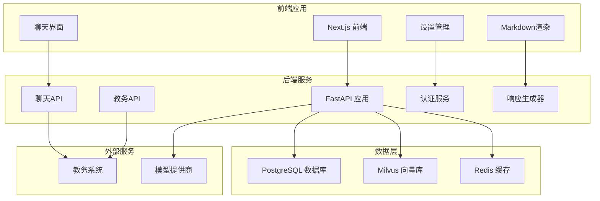

**图表来源**
- [backend/main.py:1-170](file://backend/main.py#L1-L170)
- [frontend/src/app/chat/page.tsx:1-1007](file://frontend/src/app/chat/page.tsx#L1-L1007)

**章节来源**
- [backend/main.py:1-170](file://backend/main.py#L1-L170)
- [frontend/src/app/chat/page.tsx:1-1007](file://frontend/src/app/chat/page.tsx#L1-L1007)

## 核心组件

### 聊天响应验证引擎

聊天响应验证系统的核心是其多层验证机制，确保每个AI响应都经过严格的质量控制：

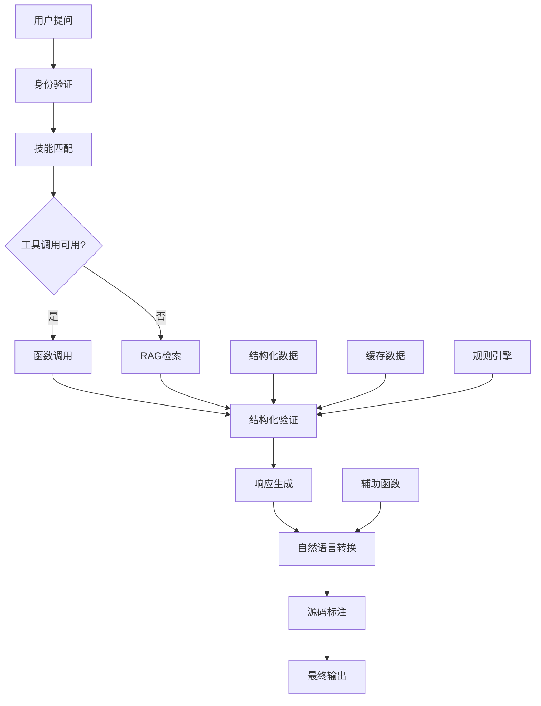

**图表来源**
- [backend/app/api/chat.py:190-368](file://backend/app/api/chat.py#L190-L368)
- [backend/app/services/model_provider.py:243-396](file://backend/app/services/model_provider.py#L243-L396)

### 数据验证管道

系统实现了多层次的数据验证机制：

1. **结构化数据验证**：验证教务数据的完整性和准确性
2. **语义一致性检查**：确保AI响应与原始数据一致
3. **上下文完整性验证**：检查响应是否包含必要的上下文信息
4. **源码追踪验证**：为每个响应提供可追溯的来源
5. **自然语言质量验证**：确保响应符合中文表达习惯

**章节来源**
- [backend/app/api/chat.py:99-153](file://backend/app/api/chat.py#L99-L153)
- [backend/app/services/education_normalizer.py:27-142](file://backend/app/services/education_normalizer.py#L27-L142)

## 架构概览

系统采用分层架构设计，每层都有明确的职责和边界：

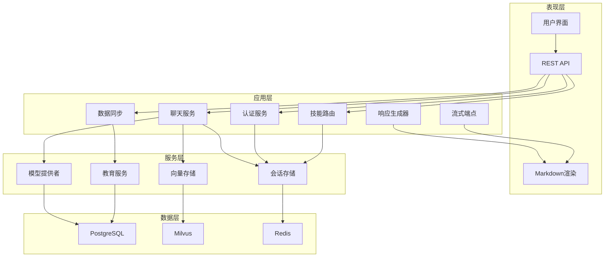

**图表来源**
- [backend/app/api/chat.py:1-816](file://backend/app/api/chat.py#L1-L816)
- [backend/app/services/model_provider.py:1-396](file://backend/app/services/model_provider.py#L1-L396)
- [backend/app/services/vector_store.py:1-455](file://backend/app/services/vector_store.py#L1-L455)

## 详细组件分析

### 聊天API组件

聊天API是整个系统的核心组件，负责处理用户的所有聊天请求：

#### 请求处理流程

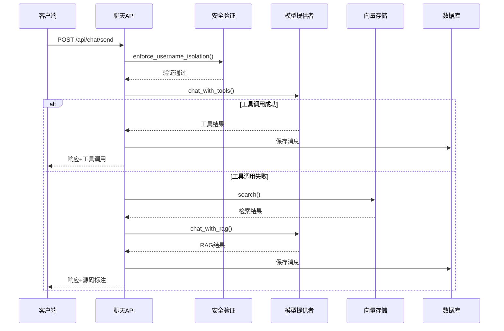

**图表来源**
- [backend/app/api/chat.py:190-368](file://backend/app/api/chat.py#L190-L368)
- [backend/app/api/chat.py:481-799](file://backend/app/api/chat.py#L481-L799)

#### 聊天响应验证机制

系统实现了多层次的响应验证：

1. **身份验证**：确保用户会话的有效性
2. **内容过滤**：过滤不适当的内容
3. **数据一致性**：验证响应与源数据的一致性
4. **源码追踪**：为每个响应提供可追溯的来源
5. **自然语言质量**：确保响应符合中文表达习惯

**章节来源**
- [backend/app/api/chat.py:190-368](file://backend/app/api/chat.py#L190-L368)
- [backend/app/security.py:1-26](file://backend/app/security.py#L1-L26)

### 模型提供者组件

模型提供者组件实现了统一的模型抽象层，支持多种AI模型：

#### 统一模型接口

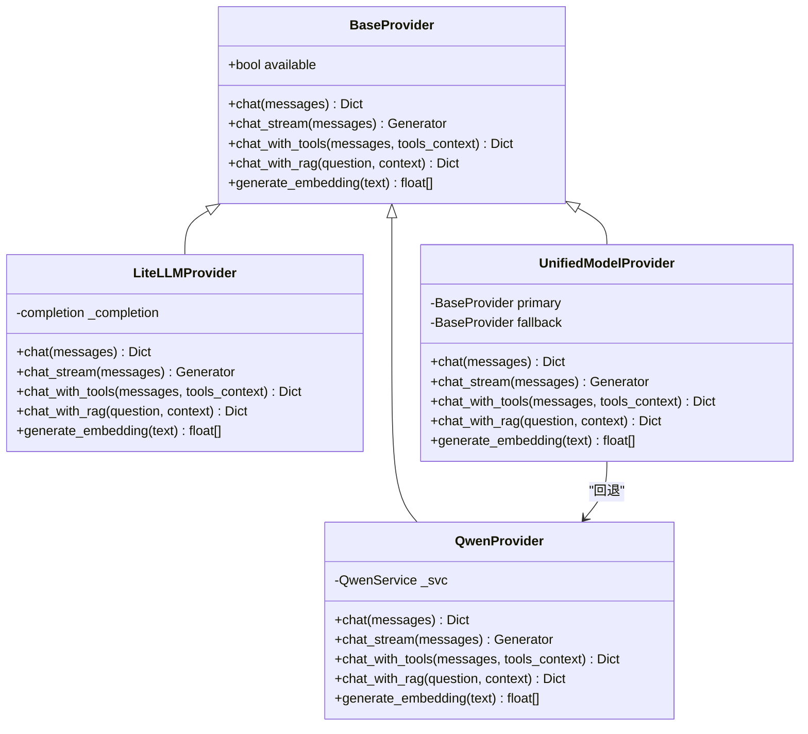

**图表来源**
- [backend/app/services/model_provider.py:20-396](file://backend/app/services/model_provider.py#L20-L396)

#### 模型回退机制

系统实现了智能的模型回退机制，确保服务的高可用性：

1. **主模型优先**：优先使用首选模型
2. **自动回退**：主模型失败时自动切换到备用模型
3. **用户偏好**：支持按用户设置不同的模型偏好
4. **性能监控**：实时监控模型性能并调整策略

**章节来源**
- [backend/app/services/model_provider.py:243-396](file://backend/app/services/model_provider.py#L243-L396)

### 向量存储组件

向量存储组件提供了高效的相似性搜索能力：

#### 向量存储架构

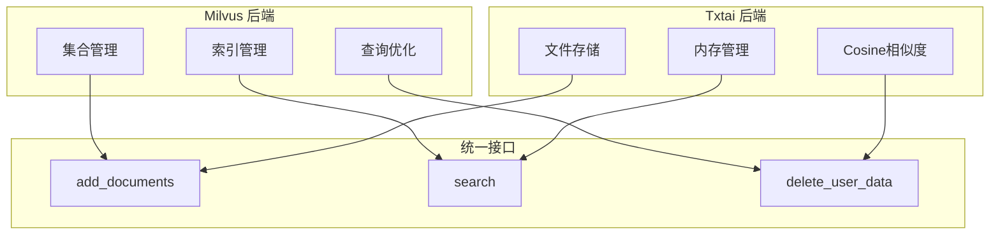

**图表来源**
- [backend/app/services/vector_store.py:33-455](file://backend/app/services/vector_store.py#L33-L455)

#### 搜索过滤机制

系统实现了灵活的搜索过滤功能：

1. **数据类型过滤**：按数据类型筛选结果
2. **学期过滤**：按学期筛选课程数据
3. **同步键过滤**：按数据同步版本过滤
4. **相似度排序**：按相似度对结果排序

**章节来源**
- [backend/app/services/vector_store.py:177-243](file://backend/app/services/vector_store.py#L177-L243)

### 教育数据同步组件

教育数据同步组件负责从教务系统获取和处理数据：

#### 数据同步流程

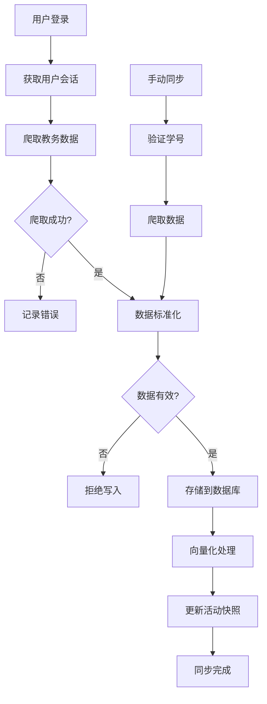

**图表来源**
- [backend/app/services/education_sync.py:18-186](file://backend/app/services/education_sync.py#L18-L186)

#### 数据验证规则

系统实施了严格的数据验证规则：

1. **学号一致性验证**：确保爬取的学号与用户学号一致
2. **数据完整性检查**：验证数据是否为空或格式错误
3. **结构标准化**：将不同格式的数据统一为标准结构
4. **摘要生成**：为每次同步生成数据摘要

**章节来源**
- [backend/app/services/education_sync.py:18-186](file://backend/app/services/education_sync.py#L18-L186)

### 技能路由组件

技能路由组件负责将用户问题路由到合适的技能和工具：

#### 技能匹配算法

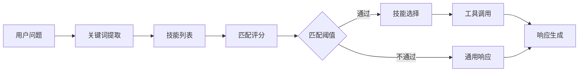

**图表来源**
- [backend/app/services/skill_router.py:14-55](file://backend/app/services/skill_router.py#L14-L55)

#### 技能配置管理

系统支持灵活的技能配置：

1. **触发词匹配**：基于关键词触发技能
2. **技能启用控制**：动态启用或禁用技能
3. **工具集成**：将技能与具体工具关联
4. **组合编排**：支持多个技能的组合使用

**章节来源**
- [backend/app/services/skill_router.py:14-55](file://backend/app/services/skill_router.py#L14-L55)

## 聊天响应生成系统重构

**更新** 系统进行了重大重构，从结构化行式响应转变为更自然的对话式文本生成。

### 辅助函数系统

系统新增了两个关键的辅助函数来支持自然语言生成：

#### _join_natural_text 函数

该函数负责将多个文本片段连接成自然流畅的中文句子：

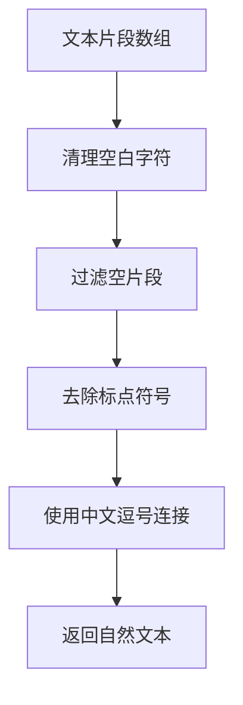

**图表来源**
- [backend/app/api/chat.py:85-87](file://backend/app/api/chat.py#L85-L87)

#### _format_examples 函数

该函数用于格式化示例数据，支持中文表达习惯：

```mermaid
flowchart TD
A[示例数据数组] --> B[清理空白字符]
B --> C[过滤空片段]
C --> D[去重处理]
D --> E[截取限制数量]
E --> F{超过限制?}
F --> |是| G[添加"等"后缀]
F --> |否| H[不添加后缀]
G --> I[使用中文顿号连接]
H --> I
I --> J[返回格式化字符串]
```

**图表来源**
- [backend/app/api/chat.py:89-96](file://backend/app/api/chat.py#L89-L96)

### _build_grounded_answer 函数重构

该函数经过重构，专门处理结构化数据的自然语言转换：

#### 身份信息处理

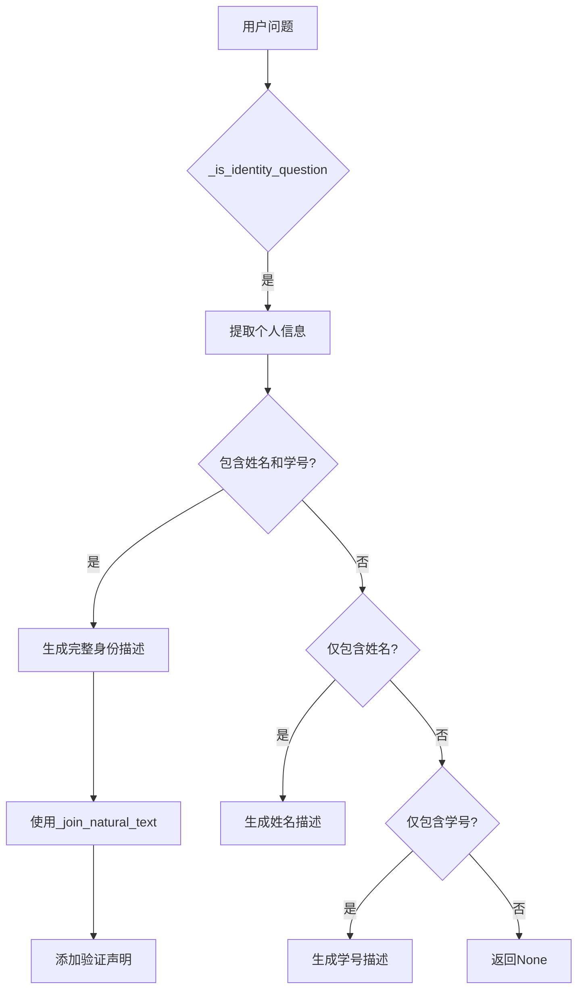

**图表来源**
- [backend/app/api/chat.py:99-124](file://backend/app/api/chat.py#L99-L124)

#### 地点信息处理

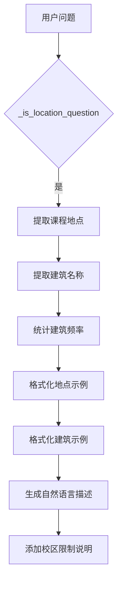

**图表来源**
- [backend/app/api/chat.py:125-151](file://backend/app/api/chat.py#L125-L151)

### 自然语言生成策略

系统采用以下策略生成符合中文表达习惯的响应：

1. **中文标点符号**：使用中文逗号、句号等标点符号
2. **语序优化**：按照中文的自然语序组织信息
3. **量词使用**：合理使用"个"、"次"等量词
4. **省略号使用**：在表示不确定信息时使用省略号
5. **限定语**：明确标注"仅基于已验证信息"等限定语

**章节来源**
- [backend/app/api/chat.py:85-153](file://backend/app/api/chat.py#L85-L153)

### 前端响应处理

前端实现了增强的流式响应处理和Markdown渲染：

#### 流式响应处理

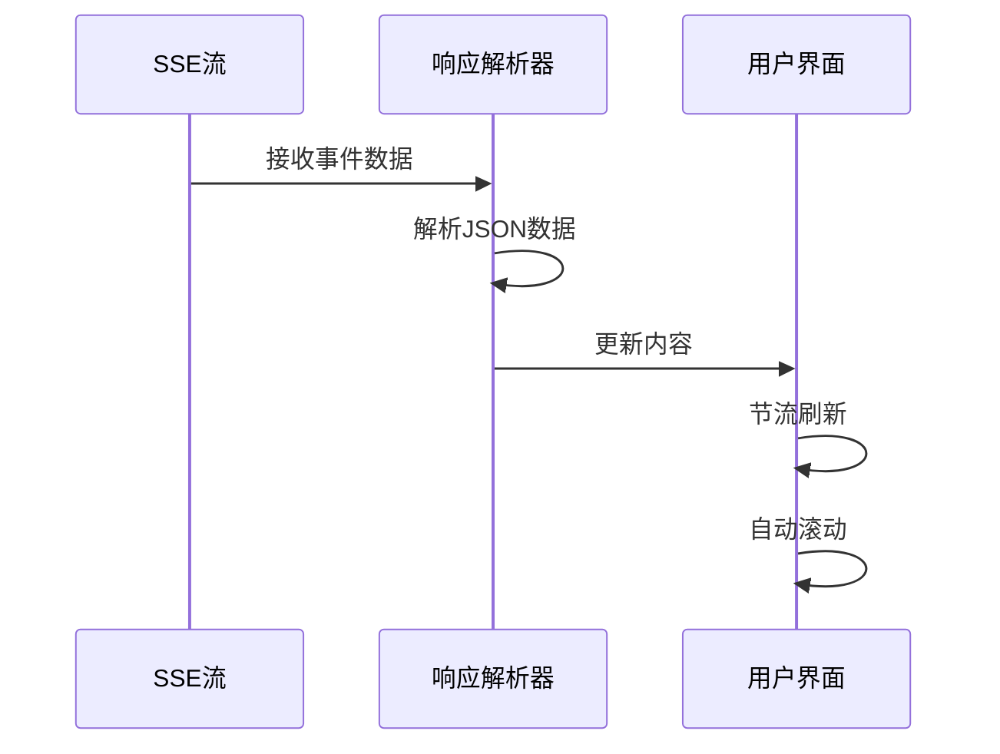

**图表来源**
- [frontend/src/app/chat/page.tsx:294-400](file://frontend/src/app/chat/page.tsx#L294-L400)

#### Markdown渲染

前端使用React Markdown组件进行内容渲染：

1. **语法高亮**：支持代码块语法高亮
2. **表格渲染**：支持Markdown表格
3. **代码块样式**：自定义代码块样式
4. **响应式设计**：适配不同屏幕尺寸

**章节来源**
- [frontend/src/app/chat/page.tsx:188-400](file://frontend/src/app/chat/page.tsx#L188-L400)
- [frontend/src/components/MarkdownMessage.tsx:1-73](file://frontend/src/components/MarkdownMessage.tsx#L1-L73)

## 依赖分析

系统采用了模块化的依赖管理策略：

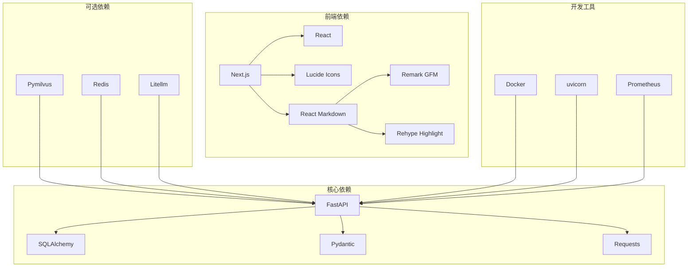

**图表来源**
- [backend/main.py:6-28](file://backend/main.py#L6-L28)
- [backend/app/services/vector_store.py:5-11](file://backend/app/services/vector_store.py#L5-L11)

### 第三方服务集成

系统集成了多个第三方服务：

1. **教务系统集成**：通过爬虫技术获取教务数据
2. **模型服务集成**：支持多种AI模型提供商
3. **向量数据库集成**：使用Milvus进行高效检索
4. **缓存服务集成**：使用Redis提升性能
5. **Markdown渲染集成**：使用React Markdown进行内容渲染

**章节来源**
- [backend/app/core/config.py:1-27](file://backend/app/core/config.py#L1-L27)
- [backend/app/services/session_store.py:16-54](file://backend/app/services/session_store.py#L16-L54)

## 性能考虑

系统在设计时充分考虑了性能优化：

### 缓存策略

1. **会话缓存**：使用Redis缓存用户会话信息
2. **向量缓存**：缓存常用的向量查询结果
3. **模型响应缓存**：缓存相似的模型响应
4. **静态资源缓存**：前端静态资源的长期缓存

### 并发处理

1. **异步处理**：聊天流式响应使用异步处理
2. **线程池管理**：合理管理并发线程
3. **连接池优化**：数据库和HTTP连接池优化
4. **负载均衡**：支持多实例部署

### 监控指标

系统实现了全面的性能监控：

1. **请求指标**：请求量、响应时间、错误率
2. **资源指标**：CPU、内存、磁盘使用率
3. **业务指标**：用户活跃度、功能使用率
4. **自定义指标**：业务特定的性能指标

## 故障排除指南

### 常见问题诊断

#### 聊天响应异常

**问题症状**：聊天无响应或响应错误

**排查步骤**：
1. 检查模型提供者配置
2. 验证向量存储连接
3. 确认用户会话有效性
4. 检查数据库连接状态

**解决方案**：
- 重启相关服务
- 检查环境变量配置
- 验证网络连接
- 查看日志文件

#### 数据同步失败

**问题症状**：教务数据无法同步

**排查步骤**：
1. 验证教务系统登录凭据
2. 检查网络连接状态
3. 确认数据格式正确性
4. 查看同步日志

**解决方案**：
- 更新登录凭据
- 检查防火墙设置
- 验证数据结构
- 重试同步操作

#### 性能问题

**问题症状**：系统响应缓慢

**排查步骤**：
1. 检查数据库性能
2. 验证向量查询效率
3. 监控内存使用情况
4. 分析慢查询日志

**解决方案**：
- 优化数据库查询
- 调整向量索引参数
- 增加缓存策略
- 升级硬件配置

#### 自然语言生成问题

**问题症状**：响应不符合中文表达习惯

**排查步骤**：
1. 检查辅助函数执行情况
2. 验证输入数据格式
3. 确认中文标点符号使用
4. 查看日志输出

**解决方案**：
- 修复辅助函数逻辑
- 规范数据格式
- 更新标点符号配置
- 调整生成策略

**章节来源**
- [backend/app/api/chat.py:363-368](file://backend/app/api/chat.py#L363-L368)
- [backend/app/services/education_sync.py:176-186](file://backend/app/services/education_sync.py#L176-L186)

## 结论

聊天响应验证系统通过多层验证机制和智能路由技术，为用户提供了一个准确、可靠、安全的教务助手平台。系统经过重大重构，从结构化行式响应转变为更自然、更符合中文表达习惯的对话式文本生成，显著提升了用户体验。

系统的主要优势包括：

1. **多层验证**：确保每个响应都经过严格验证
2. **灵活路由**：智能匹配最适合的技能和工具
3. **数据安全**：严格的会话隔离和数据保护
4. **高性能**：优化的缓存和并发处理机制
5. **可扩展性**：模块化设计支持功能扩展
6. **自然语言生成**：符合中文表达习惯的响应生成
7. **流式响应**：实时的流式对话体验
8. **Markdown渲染**：美观的内容展示效果

未来的发展方向包括：
- 增强AI模型的多样性和准确性
- 优化用户体验和交互设计
- 扩展更多的教务功能
- 提升系统的智能化水平
- 进一步优化自然语言生成质量

该系统为智能教务服务提供了一个坚实的技术基础，能够满足现代高校对智能化服务的需求。